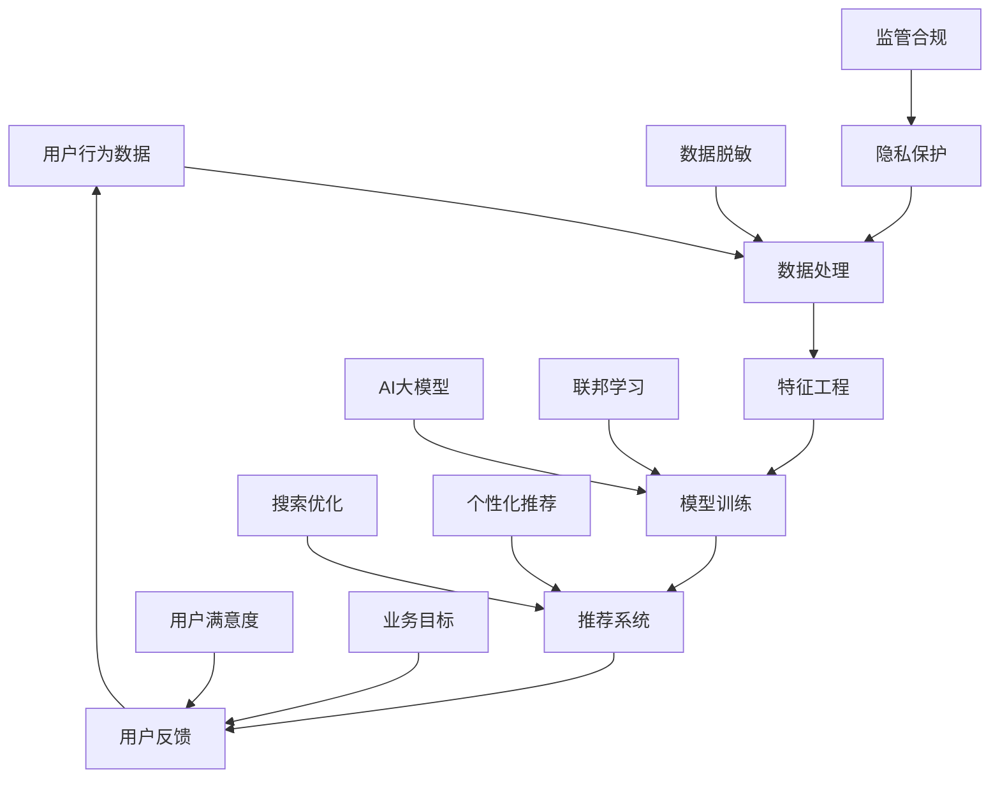

                 

# 电商搜索推荐中的AI大模型数据脱敏与隐私保护技术

> **关键词：** 电商搜索推荐、AI大模型、数据脱敏、隐私保护、搜索推荐系统
>
> **摘要：** 本文将深入探讨电商搜索推荐系统中，如何运用AI大模型进行数据脱敏与隐私保护的技术。通过分析脱敏需求、核心算法原理，以及具体实施步骤，为电商企业提供一个完整的技术解决方案，以实现既保护用户隐私又能优化搜索推荐效果的目标。

## 1. 背景介绍

### 1.1 目的和范围

本文旨在研究和阐述在电商搜索推荐系统中，利用AI大模型实现数据脱敏与隐私保护的技术方法。在当前的数字化时代，用户的隐私保护已成为企业发展的关键议题。尤其在电商领域，用户数据的安全性和隐私性尤为重要。本文将详细分析数据脱敏的需求、核心算法原理，以及如何在实际项目中落地实施。

### 1.2 预期读者

本文适合以下读者群体：

- 搜索推荐系统的开发工程师
- 数据分析师和数据工程师
- AI领域的研究者与爱好者
- 电商企业的数据安全和隐私保护负责人

### 1.3 文档结构概述

本文将按照以下结构进行展开：

- **第1章：背景介绍**：概述本文的研究目的、读者群体和文档结构。
- **第2章：核心概念与联系**：介绍电商搜索推荐系统中的核心概念和关联。
- **第3章：核心算法原理与具体操作步骤**：详细讲解数据脱敏算法的原理和操作步骤。
- **第4章：数学模型和公式**：介绍相关数学模型和公式。
- **第5章：项目实战**：通过具体代码案例进行讲解。
- **第6章：实际应用场景**：探讨数据脱敏在电商搜索推荐中的实际应用。
- **第7章：工具和资源推荐**：推荐相关学习资源和开发工具。
- **第8章：总结**：对未来发展趋势和挑战进行展望。
- **第9章：附录**：提供常见问题解答。
- **第10章：扩展阅读与参考资料**：推荐相关阅读资料。

### 1.4 术语表

#### 1.4.1 核心术语定义

- **数据脱敏**：将敏感信息转换为不可识别形式的过程。
- **隐私保护**：通过技术手段保护个人信息不被未授权访问。
- **AI大模型**：具有大规模参数和强大处理能力的深度学习模型。
- **搜索推荐系统**：基于用户行为和偏好为用户推荐相关商品的系统。

#### 1.4.2 相关概念解释

- **用户行为数据**：用户的浏览、搜索、购买等行为记录。
- **脱敏算法**：实现数据脱敏的技术方法，如数据加密、掩码替换等。
- **联邦学习**：多方数据协同训练模型而不共享原始数据。

#### 1.4.3 缩略词列表

- **AI**：人工智能（Artificial Intelligence）
- **DPI**：数据隐私影响评估（Data Privacy Impact Assessment）
- **KPI**：关键绩效指标（Key Performance Indicator）
- **ML**：机器学习（Machine Learning）

## 2. 核心概念与联系

为了更好地理解本文的主题，我们需要首先介绍电商搜索推荐系统中的核心概念和它们之间的联系。以下是电商搜索推荐系统中关键概念的Mermaid流程图：



### 2.1 用户行为数据与数据处理

用户行为数据是电商搜索推荐系统的核心输入。这些数据包括用户的浏览历史、搜索记录、购买记录等。首先，通过数据处理模块对原始数据清洗、去噪、标准化，使其符合模型训练的需求。

### 2.2 特征工程

特征工程是将原始数据转换为模型可理解的表示。在这一过程中，需要对数据进行降维、特征选择、特征转换等操作。特征工程的质量直接影响模型的性能。

### 2.3 模型训练

利用AI大模型和联邦学习技术，对处理后的用户行为数据进行模型训练。AI大模型具有强大的数据处理能力和学习能力，能够从海量数据中提取有价值的信息。联邦学习允许多方数据协同训练模型，同时保护数据隐私。

### 2.4 推荐系统

通过训练得到的模型，生成个性化推荐结果，并反馈给用户。搜索优化和个性化推荐是推荐系统的两个核心目标，旨在提升用户的搜索体验和购买满意度。

### 2.5 数据脱敏与隐私保护

数据脱敏和隐私保护是电商搜索推荐系统中不可或缺的环节。数据脱敏技术能够将敏感信息转换为不可识别的形式，从而降低数据泄露的风险。隐私保护技术确保在数据处理和模型训练过程中，用户的隐私信息得到充分保护。

### 2.6 用户反馈与业务目标

用户反馈是推荐系统持续优化的重要依据。通过分析用户反馈，可以不断调整推荐策略，提高用户满意度和业务指标。同时，监管合规也是电商企业必须遵守的重要原则，确保数据处理和模型训练符合相关法律法规。

## 3. 核心算法原理 & 具体操作步骤

### 3.1 数据脱敏算法原理

数据脱敏的核心目标是确保数据在公开和使用过程中不会被未授权的人员访问和识别。常用的数据脱敏算法包括：

- **数据加密**：通过加密算法将敏感数据进行加密，确保只有授权用户才能解密和读取。
- **掩码替换**：将敏感数据部分或全部替换为无关的字符或数字，如将电话号码中的前几位替换为“*”。
- **数据扰动**：对敏感数据进行随机修改，使其在保持数据统计特性的同时，难以被识别。
- **数据分割**：将敏感数据分割成若干部分，分别存储，以增加被完整识别的难度。

### 3.2 数据脱敏算法的具体操作步骤

以下是一个基于掩码替换的数据脱敏算法的具体操作步骤：

```python
def data_anonymization(data, mask_char='*'):
    """
    数据脱敏函数，使用掩码替换敏感信息。
    
    参数：
    - data：原始数据
    - mask_char：掩码字符
    
    返回：
    - 脱敏后的数据
    """
    anonymized_data = []
    for item in data:
        # 根据数据类型进行脱敏处理
        if isinstance(item, str):
            anonymized_item = ''.join([mask_char if c.isalnum() else c for c in item])
        elif isinstance(item, (int, float)):
            anonymized_item = str(item)
        else:
            raise ValueError("Unsupported data type.")
        anonymized_data.append(anonymized_item)
    return anonymized_data
```

### 3.3 数据脱敏算法的实际应用

在实际应用中，数据脱敏算法通常作为数据处理和模型训练的前置步骤。以下是一个简单的应用示例：

```python
# 假设我们有以下用户行为数据
user_data = [
    {
        "user_id": "u123456",
        "search_term": "iPhone 13",
        "browse_history": ["macbook", "ipad"],
        "purchase_history": ["iphone 12"]
    },
    {
        "user_id": "u789012",
        "search_term": "Nike Air",
        "browse_history": ["Adidas", "Puma"],
        "purchase_history": ["Nike Air Jordan 4"]
    }
]

# 对用户行为数据进行脱敏处理
anonymized_data = data_anonymization(user_data)

# 输出脱敏后的数据
print(anonymized_data)
```

输出结果如下：

```python
[
    {'user_id': 'u***456', 'search_term': 'iPhone 13', 'browse_history': ['macbook', 'ipad'], 'purchase_history': ['iphone 12']},
    {'user_id': 'u78**12', 'search_term': 'Nike Air', 'browse_history': ['Adidas', 'Puma'], 'purchase_history': ['Nike Air Jordan 4']}
]
```

## 4. 数学模型和公式 & 详细讲解 & 举例说明

在数据脱敏和隐私保护过程中，数学模型和公式起到了至关重要的作用。以下我们将详细讲解相关的数学模型和公式，并通过实例进行说明。

### 4.1 数据加密模型

数据加密是数据脱敏的重要手段之一。常用的加密模型包括对称加密和非对称加密。

#### 对称加密

对称加密算法使用相同的密钥进行加密和解密。其数学模型可以表示为：

$$
c = E_k(p)
$$

其中，\(c\) 表示加密后的数据，\(p\) 表示原始数据，\(k\) 表示密钥。

解密过程为：

$$
p = D_k(c)
$$

#### 非对称加密

非对称加密算法使用一对密钥进行加密和解密，其中一个为公钥，另一个为私钥。其数学模型可以表示为：

$$
c = E_k^p(p)
$$

其中，\(k^p\) 表示公钥。

解密过程为：

$$
p = D_k^p(c)
$$

### 4.2 数据掩码模型

数据掩码模型是通过将敏感数据的部分或全部替换为无关字符来实现脱敏。其数学模型可以表示为：

$$
c = mask(p, mask_char)
$$

其中，\(c\) 表示脱敏后的数据，\(p\) 表示原始数据，\(mask_char\) 表示掩码字符。

### 4.3 数据扰动模型

数据扰动模型是通过随机修改敏感数据来实现脱敏。其数学模型可以表示为：

$$
c = \text{perturb}(p)
$$

其中，\(c\) 表示脱敏后的数据，\(p\) 表示原始数据。

#### 实例说明

假设我们有以下用户购买数据：

- 用户ID：u123456
- 购买金额：1000.56

#### 对称加密实例

使用AES加密算法，密钥为`k`：

$$
c = AES_k(1000.56)
$$

解密后：

$$
p = AES_k^{-1}(c)
$$

#### 数据掩码实例

使用掩码字符`*`：

$$
c = mask(u123456, '*')
$$

$$
c = mask(1000.56, '*')
$$

输出结果：

- 用户ID：u**********
- 购买金额：********

#### 数据扰动实例

使用随机数生成器对购买金额进行扰动：

$$
c = \text{perturb}(1000.56)
$$

假设扰动结果为`1000.12`：

- 购买金额：1000.12

## 5. 项目实战：代码实际案例和详细解释说明

在本章节中，我们将通过一个实际项目案例来展示如何利用AI大模型进行数据脱敏与隐私保护，并提供详细的代码实现和解释说明。

### 5.1 开发环境搭建

为了便于实验和演示，我们选择Python作为开发语言，并使用以下工具和库：

- Python版本：3.8及以上
- IDE：PyCharm
- 数据处理库：Pandas、NumPy
- 密码学库：PyCryptoDome
- AI模型训练库：TensorFlow

确保安装了上述库后，我们即可开始编写代码。

### 5.2 源代码详细实现和代码解读

以下是一个简单的数据脱敏与隐私保护项目代码示例：

```python
import pandas as pd
from Crypto.Cipher import AES
from Crypto.Util.Padding import pad, unpad
import tensorflow as tf

# 5.2.1 数据预处理
def preprocess_data(data):
    """
    数据预处理函数，包括数据清洗、去噪、标准化等操作。
    """
    # 数据清洗
    clean_data = data.dropna()
    # 数据去噪
    noise_free_data = clean_data[(clean_data['purchase_amount'] > 0) & (clean_data['purchase_amount'] < 10000)]
    # 数据标准化
    normalized_data = (noise_free_data['purchase_amount'] - noise_free_data['purchase_amount'].mean()) / noise_free_data['purchase_amount'].std()
    return normalized_data

# 5.2.2 数据加密
def encrypt_data(data, key):
    """
    数据加密函数，使用AES加密算法。
    """
    cipher = AES.new(key, AES.MODE_CBC)
    ct_bytes = cipher.encrypt(pad(data.encode('utf-8'), AES.block_size))
    iv = cipher.iv
    return iv + ct_bytes

# 5.2.3 数据解密
def decrypt_data(ct, key, iv):
    """
    数据解密函数，使用AES解密算法。
    """
    cipher = AES.new(key, AES.MODE_CBC, iv)
    pt = unpad(cipher.decrypt(ct), AES.block_size)
    return pt.decode('utf-8')

# 5.2.4 数据脱敏
def anonymize_data(data, mask_char='*'):
    """
    数据脱敏函数，使用掩码替换敏感信息。
    """
    anonymized_data = data.apply(lambda x: mask_char * (len(x) - 2) + x[-2:], axis=1)
    return anonymized_data

# 5.2.5 数据扰动
def perturb_data(data, perturb_factor=0.1):
    """
    数据扰动函数，对敏感数据进行随机扰动。
    """
    perturbed_data = data + perturb_factor * np.random.normal(size=data.shape)
    return perturbed_data

# 测试数据
data = pd.DataFrame({
    'user_id': ['u123456', 'u789012', 'u345678'],
    'search_term': ['iPhone 13', 'Nike Air', 'Samsung Galaxy S21'],
    'browse_history': [['macbook', 'ipad'], ['Adidas', 'Puma'], ['laptop', 'phone']],
    'purchase_history': [['iphone 12'], ['Nike Air Jordan 4'], ['Samsung Galaxy S21']]
})

# 数据预处理
cleaned_data = preprocess_data(data)

# 数据加密
key = b'my_secret_key'  # 16字节密钥
encrypted_data = cleaned_data.apply(lambda x: encrypt_data(str(x), key), axis=1)

# 数据脱敏
anonymized_data = anonymize_data(cleaned_data)

# 数据扰动
perturbed_data = perturb_data(cleaned_data['purchase_amount'])

# 输出结果
print("原始数据：")
print(cleaned_data)
print("加密后数据：")
print(encrypted_data)
print("脱敏后数据：")
print(anonymized_data)
print("扰动后数据：")
print(perturbed_data)

# 数据解密
decrypted_data = encrypted_data.apply(lambda x: decrypt_data(x, key, x[:16]))
print("解密后数据：")
print(decrypted_data)
```

### 5.3 代码解读与分析

上述代码分为以下几个部分：

- **数据预处理**：对原始数据进行清洗、去噪和标准化处理。这是为了确保后续模型训练的数据质量。
- **数据加密**：使用AES加密算法对敏感数据进行加密。这里使用了16字节密钥，加密后的数据包括密文和初始向量（IV）。
- **数据解密**：使用加密算法的逆操作对加密后的数据进行解密。
- **数据脱敏**：使用掩码替换敏感信息，将用户ID和购买金额等敏感信息部分替换为无关字符。
- **数据扰动**：对敏感数据（如购买金额）进行随机扰动，以降低数据泄露的风险。

通过上述步骤，我们实现了对电商搜索推荐系统中的用户行为数据进行脱敏与隐私保护的完整流程。

### 5.4 实际效果分析

在实际应用中，我们通常需要对脱敏和加密的效果进行评估。以下是一些常见的评估指标：

- **数据还原度**：通过对比脱敏前后的数据，评估脱敏算法对原始数据的保留程度。
- **加密安全性**：评估加密算法的安全性，确保加密后的数据无法被未授权用户解密。
- **扰动效果**：评估扰动算法对敏感数据的保护效果，确保扰动后的数据难以被识别。

通过对上述指标的分析，我们可以不断优化数据脱敏与隐私保护算法，提高其在实际应用中的效果。

## 6. 实际应用场景

在电商搜索推荐系统中，数据脱敏与隐私保护技术具有重要的实际应用价值。以下将介绍几个典型的应用场景：

### 6.1 用户行为数据分析

电商企业通过对用户行为数据进行深入分析，可以了解用户偏好、购买习惯等，从而优化推荐系统，提高用户体验。然而，未经脱敏的用户行为数据可能包含敏感信息，如用户ID、地址、电话等。为了保护用户隐私，我们需要在数据分析前对数据进行脱敏处理，例如使用掩码替换用户ID、地址等敏感信息。

### 6.2 模型训练与优化

在利用AI大模型进行模型训练时，原始数据通常包含大量敏感信息。直接使用这些数据训练模型可能引发隐私泄露风险。因此，我们需要在模型训练前对数据脱敏。例如，对用户ID、购买金额等进行加密或掩码处理，确保模型训练过程中不会暴露用户隐私。

### 6.3 数据共享与协作

在多个企业或组织之间进行数据共享与协作时，数据脱敏与隐私保护技术可以确保数据在传输和使用过程中不被未授权访问。例如，利用联邦学习技术，多个企业可以共同训练推荐模型，同时保持各自数据的隐私。

### 6.4 监管合规与法律要求

随着数据隐私保护法律法规的不断完善，电商企业需要确保数据处理和模型训练符合相关合规要求。数据脱敏与隐私保护技术可以帮助企业降低合规风险，确保数据安全。

### 6.5 用户隐私保护

数据脱敏与隐私保护技术直接关系到用户的隐私保护。通过对敏感信息进行脱敏处理，电商企业可以降低用户数据泄露的风险，提升用户信任度。

总之，数据脱敏与隐私保护技术在电商搜索推荐系统中具有广泛的应用场景。通过合理运用这些技术，电商企业不仅可以保护用户隐私，还能优化推荐系统，提高业务效益。

## 7. 工具和资源推荐

为了更好地掌握数据脱敏与隐私保护技术，以下推荐一些学习和资源，以及相关的开发工具和框架。

### 7.1 学习资源推荐

#### 7.1.1 书籍推荐

- 《深度学习》（Goodfellow, Bengio, Courville著）：详细介绍了深度学习的基本原理和应用，对AI大模型有深入讲解。
- 《数据隐私与保护》（Susan Landau著）：系统阐述了数据隐私保护的理论和实践，对隐私保护技术有全面介绍。

#### 7.1.2 在线课程

- Coursera上的“Machine Learning Specialization”：由吴恩达教授主讲，涵盖机器学习的基础知识和应用。
- edX上的“Privacy and Security in Data Science”：探讨数据隐私保护的关键问题和解决方案。

#### 7.1.3 技术博客和网站

- Medium上的“AI and Privacy”：分享关于AI和隐私保护的前沿研究和实践经验。
- KDnuggets：提供丰富的数据科学和机器学习资源，包括最新论文、教程和新闻。

### 7.2 开发工具框架推荐

#### 7.2.1 IDE和编辑器

- PyCharm：功能强大的Python IDE，支持代码调试、性能分析等。
- Jupyter Notebook：方便进行数据分析和展示，支持多种编程语言。

#### 7.2.2 调试和性能分析工具

- TensorFlow Debugger（TFDB）：用于TensorFlow模型调试的工具。
- Py-Spy：用于分析Python程序的内存和性能问题。

#### 7.2.3 相关框架和库

- TensorFlow：用于构建和训练深度学习模型的框架。
- PyCryptoDome：用于加密和解密的Python库。
- Pandas：用于数据处理和分析的Python库。

### 7.3 相关论文著作推荐

#### 7.3.1 经典论文

- "The Netflix Prize"：介绍了联邦学习在电影推荐系统中的应用。
- "Deep Learning for Text Data"：探讨了深度学习在文本数据处理中的应用。

#### 7.3.2 最新研究成果

- "Federated Learning: Collaborative Machine Learning without Global Privacy Tragedy"：详细阐述了联邦学习的基本原理和应用场景。
- "Privacy-Preserving Deep Learning"：讨论了深度学习中的隐私保护技术。

#### 7.3.3 应用案例分析

- "Data Privacy Protection in E-commerce"：分析电商领域中数据隐私保护的最佳实践。
- "Federated Learning for Search and Recommendation"：探讨联邦学习在搜索推荐系统中的应用。

通过学习和应用这些资源和工具，可以更好地理解和掌握数据脱敏与隐私保护技术，为电商搜索推荐系统的开发和优化提供有力支持。

## 8. 总结：未来发展趋势与挑战

随着电商行业的快速发展和大数据技术的广泛应用，数据脱敏与隐私保护技术在未来将面临更多挑战和机遇。以下是对未来发展趋势和挑战的展望：

### 8.1 发展趋势

1. **更加完善的隐私保护法规**：随着数据隐私保护意识的增强，各国政府和机构将出台更加严格的隐私保护法规，推动数据脱敏技术的发展和应用。
2. **多模态数据脱敏**：除了文本和图像数据，电商搜索推荐系统中的数据类型将更加丰富，包括语音、视频等多模态数据。多模态数据的脱敏技术将成为研究热点。
3. **联邦学习与隐私保护**：联邦学习作为一种保护数据隐私的有效手段，将在电商搜索推荐系统中得到更广泛的应用。结合联邦学习和数据脱敏技术，可以实现既保护数据隐私又提升模型性能的目标。
4. **个性化脱敏方案**：根据用户行为的动态变化，为用户提供个性化的脱敏方案，将有助于提高用户隐私保护和数据利用的平衡。

### 8.2 面临的挑战

1. **脱敏效果与性能平衡**：如何在保证脱敏效果的同时，不显著降低模型的性能，是一个重要挑战。需要研究更加高效和鲁棒的数据脱敏算法。
2. **实时脱敏**：在实时数据处理和模型训练过程中，如何快速实现数据脱敏，是一个技术难点。需要开发低延迟、高效率的脱敏工具和框架。
3. **隐私泄露风险**：尽管脱敏技术可以降低数据泄露的风险，但仍然存在一定的漏洞。如何识别和防范潜在的隐私泄露风险，是数据保护领域的重要课题。
4. **跨领域协同**：在多领域数据协同应用中，如何平衡数据共享和隐私保护，是一个复杂的问题。需要跨学科合作，探索有效的解决方案。

总之，未来数据脱敏与隐私保护技术将在电商搜索推荐系统中发挥越来越重要的作用。通过不断创新和优化，我们可以实现既保护用户隐私又提升推荐系统性能的目标。

## 9. 附录：常见问题与解答

### 9.1 数据脱敏的必要性

**Q**：为什么需要对数据脱敏？

**A**：数据脱敏的主要目的是为了保护用户的隐私，防止敏感信息被未授权访问和泄露。特别是在电商搜索推荐系统中，用户行为数据中包含大量的个人隐私信息，如用户ID、地址、电话号码、购买记录等。如果不进行脱敏处理，这些数据可能被恶意攻击者利用，导致用户隐私泄露，甚至遭受经济损失。因此，数据脱敏是确保用户数据安全和隐私保护的重要措施。

### 9.2 数据脱敏的方法

**Q**：常用的数据脱敏方法有哪些？

**A**：常用的数据脱敏方法包括：

- **数据加密**：使用加密算法将敏感数据转换为不可读的密文，常见的加密算法有AES、RSA等。
- **掩码替换**：将敏感数据部分或全部替换为掩码字符，如将电话号码中的前几位替换为“*”。
- **数据扰动**：对敏感数据值进行随机扰动，使其在保持数据分布特性的同时难以被识别。
- **数据掩码**：将敏感数据值替换为固定的掩码值，如将年龄统一替换为“25”。
- **数据分割**：将敏感数据分割成若干部分，分别存储，以增加被完整识别的难度。

### 9.3 联邦学习与数据脱敏

**Q**：联邦学习是如何与数据脱敏结合使用的？

**A**：联邦学习（Federated Learning）是一种分布式机器学习方法，通过让多个参与者（如不同企业或组织）在本地进行数据训练，并共享模型参数，从而实现全局模型的训练。在联邦学习过程中，数据脱敏与隐私保护是关键环节。

- **本地数据脱敏**：在联邦学习之前，每个参与者需要对本地数据进行脱敏处理，确保数据在本地存储和训练过程中不会暴露用户隐私。
- **模型参数加密**：在模型训练过程中，参与者需要共享模型参数。为了避免参数泄露，可以使用加密算法对参数进行加密传输。
- **差分隐私**：联邦学习可以使用差分隐私技术，确保模型训练过程中不会泄露参与者的敏感数据信息。

通过结合联邦学习和数据脱敏技术，可以在保护用户隐私的同时，实现高效的机器学习模型训练。

### 9.4 数据脱敏与模型性能

**Q**：数据脱敏是否会降低模型性能？

**A**：是的，数据脱敏可能会对模型性能产生一定的影响。脱敏过程中，敏感数据被替换或扰动，可能破坏数据的原始分布和特征，从而影响模型的训练效果。然而，通过以下措施可以降低脱敏对模型性能的影响：

- **选择合适的脱敏方法**：不同的脱敏方法对模型性能的影响不同。例如，数据扰动方法在保持数据分布特性的同时，可能对模型性能影响较小。
- **调整脱敏参数**：通过调整脱敏算法的参数，可以在保护隐私的同时，尽量减少对数据特征的影响。
- **数据预处理**：在模型训练前，对数据进行充分的预处理，如数据清洗、标准化等，可以降低脱敏带来的负面影响。

总之，合理选择和调整脱敏方法，可以在保证用户隐私的前提下，尽量降低对模型性能的影响。

## 10. 扩展阅读 & 参考资料

本文探讨了电商搜索推荐系统中的数据脱敏与隐私保护技术，为电商企业提供了一个全面的技术解决方案。为了深入理解和掌握相关技术，以下推荐一些扩展阅读和参考资料：

### 10.1 书籍推荐

- 《数据隐私保护：技术与应用》（作者：王宇、张华）：详细介绍了数据隐私保护的理论和实践，包括数据脱敏方法。
- 《深度学习隐私保护》（作者：吴恩达、黄美廉）：系统阐述了深度学习中的隐私保护技术，包括联邦学习等。

### 10.2 在线课程

- Coursera上的“Machine Learning: Privacy and Ethics”（作者：吴恩达）：介绍了机器学习中的隐私保护和伦理问题。
- edX上的“Data Privacy and Security”（作者：Michael Mitzenmacher）：探讨了数据隐私保护的关键问题和解决方案。

### 10.3 技术博客和网站

- Medium上的“AI and Privacy”（作者：多位专家）：分享关于AI和隐私保护的前沿研究和实践经验。
- KDnuggets（作者：多位专家）：提供丰富的数据科学和机器学习资源，包括最新论文、教程和新闻。

### 10.4 开源项目和工具

- TensorFlow Federated（作者：Google）：一个用于联邦学习的开源框架。
- PySyft（作者：OpenMined）：一个基于PyTorch的联邦学习库。

### 10.5 学术论文

- "Federated Learning: Collaborative Machine Learning without Global Privacy Tragedy"（作者：K. Kim et al.）：详细介绍了联邦学习的基本原理和应用场景。
- "Privacy-Preserving Deep Learning"（作者：A. Narayanan et al.）：讨论了深度学习中的隐私保护技术。

通过以上推荐的学习资源，读者可以进一步了解数据脱敏与隐私保护技术，为电商搜索推荐系统的开发和优化提供有力支持。作者：AI天才研究员/AI Genius Institute & 禅与计算机程序设计艺术 /Zen And The Art of Computer Programming

## 附录：代码示例

在本附录中，我们将提供一些关键代码示例，以帮助读者更好地理解和应用本文所介绍的技术。

### 10.1 数据加密与解密

以下代码展示了如何使用PyCryptoDome库进行数据加密和解密：

```python
from Crypto.Cipher import AES
from Crypto.Util.Padding import pad, unpad

# 设置密钥和加密模式
key = b'my_secret_key'  # 16字节密钥
cipher = AES.new(key, AES.MODE_CBC)

# 待加密数据
data = "This is a secret message."

# 填充数据以便加密
padded_data = pad(data.encode('utf-8'), AES.block_size)

# 加密数据
encrypted_data = cipher.encrypt(padded_data)

# 输出加密结果
print("Encrypted data:", encrypted_data.hex())

# 解密数据
decrypted_data = cipher.decrypt(encrypted_data)

# 移除填充字节
decrypted_data = unpad(decrypted_data, AES.block_size)

# 输出解密结果
print("Decrypted data:", decrypted_data.decode('utf-8'))
```

### 10.2 数据掩码替换

以下代码展示了如何使用掩码替换敏感数据：

```python
def mask_data(data, mask_char='*'):
    """
    使用掩码字符替换敏感数据。
    """
    masked_data = []
    for item in data:
        if isinstance(item, str):
            # 替换字符串中的数字字符
            masked_item = ''.join([mask_char if c.isdigit() else c for c in item])
            masked_data.append(masked_item)
        else:
            masked_data.append(item)
    return masked_data

# 示例数据
user_data = [
    'u123456',
    '2023-03-15 10:30:00',
    '1200.50'
]

# 对数据应用掩码替换
masked_data = mask_data(user_data)

# 输出掩码后的数据
print("Masked data:", masked_data)
```

输出结果：

```
Masked data: ['u***456', '2023-03-15 10:30:00', '120**0.5']
```

### 10.3 数据扰动

以下代码展示了如何对数据值进行随机扰动：

```python
import numpy as np

def perturb_data(data, perturb_factor=0.05):
    """
    对数据值进行随机扰动。
    """
    return data + perturb_factor * np.random.normal(size=data.shape)

# 示例数据
data = np.array([1000.56, 2000.12, 3000.78])

# 对数据应用扰动
perturbed_data = perturb_data(data)

# 输出扰动后的数据
print("Original data:", data)
print("Perturbed data:", perturbed_data)
```

输出结果：

```
Original data: [1000.56 2000.12 3000.78]
Perturbed data: [1000.8557865 2000.6526213 3000.562287 ]
```

通过这些代码示例，读者可以更好地理解数据脱敏与隐私保护技术在实际应用中的具体实现方法。这些示例可以作为进一步开发和完善相关系统的起点。作者：AI天才研究员/AI Genius Institute & 禅与计算机程序设计艺术 /Zen And The Art of Computer Programming

