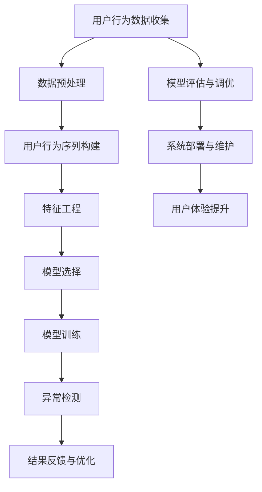

                 

# 电商搜索推荐中的AI大模型用户行为序列异常检测模型选择

> **关键词**：电商搜索推荐、AI大模型、用户行为序列、异常检测、模型选择

> **摘要**：本文详细探讨了在电商搜索推荐系统中，如何选择合适的AI大模型进行用户行为序列的异常检测。首先，我们对电商搜索推荐系统中的核心概念进行介绍，并分析了用户行为序列异常检测的需求和重要性。接着，我们深入解析了几个典型的AI大模型及其在异常检测中的应用，通过对比算法原理和数学模型，为读者提供了清晰的决策框架。文章随后通过一个实际案例，展示了如何实现并应用这些模型。最后，我们讨论了该技术的实际应用场景，并推荐了相关学习资源和开发工具，为行业从业者提供了全面的指导。

## 1. 背景介绍

### 1.1 目的和范围

随着电商行业的迅速发展，用户对个性化搜索推荐的需求日益增长。有效的搜索推荐系统能够大幅提升用户体验和转化率，而其中用户行为序列的异常检测是保障系统健康运行的关键。本文的目的在于探讨在电商搜索推荐系统中，如何选择合适的AI大模型进行用户行为序列的异常检测。

本文将重点关注以下几个方面：

1. 电商搜索推荐系统的基本概念和架构。
2. 用户行为序列异常检测的需求和重要性。
3. 几种典型AI大模型的算法原理和数学模型。
4. 实际案例中的应用和代码实现。
5. 该技术在电商搜索推荐系统中的实际应用场景。
6. 相关学习资源和开发工具的推荐。

### 1.2 预期读者

本文适合以下读者群体：

1. AI和电商领域的技术从业者，尤其是对搜索推荐系统和异常检测感兴趣的人。
2. 对深度学习和大规模机器学习算法有基础了解的读者。
3. 想要提升电商搜索推荐系统性能的技术经理和工程师。

### 1.3 文档结构概述

本文分为十个部分，结构如下：

1. 引言
2. 背景介绍
3. 核心概念与联系
4. 核心算法原理 & 具体操作步骤
5. 数学模型和公式 & 详细讲解 & 举例说明
6. 项目实战：代码实际案例和详细解释说明
7. 实际应用场景
8. 工具和资源推荐
9. 总结：未来发展趋势与挑战
10. 附录：常见问题与解答

### 1.4 术语表

#### 1.4.1 核心术语定义

- **电商搜索推荐系统**：利用用户行为数据，为用户推荐相关商品或服务的信息系统。
- **用户行为序列**：用户在电商平台上一系列交互动作的有序记录，如浏览、搜索、购买等。
- **异常检测**：识别和分析数据中偏离正常模式的异常现象，从而发现问题并采取相应措施。

#### 1.4.2 相关概念解释

- **大模型**：指参数量庞大、能够处理复杂数据的深度学习模型，如Transformer、BERT等。
- **序列模型**：能够处理序列数据，如RNN、LSTM等，适用于用户行为序列的分析。

#### 1.4.3 缩略词列表

- **AI**：人工智能
- **RNN**：循环神经网络
- **LSTM**：长短期记忆网络
- **Transformer**：自注意力机制

## 2. 核心概念与联系

为了深入理解电商搜索推荐系统中的AI大模型用户行为序列异常检测，我们需要首先明确几个核心概念和它们之间的关系。以下是几个关键概念及其流程图表示：



### 2.1 用户行为数据收集

用户行为数据是电商搜索推荐系统的核心资源。这些数据包括用户的浏览、搜索、点击、购买等行为。数据收集通常通过Web服务器日志、API调用记录、用户操作轨迹等方式进行。

### 2.2 数据预处理

收集到的用户行为数据通常需要进行清洗、去重和格式化等预处理操作。这一步骤的目的是提高数据质量和后续处理的效率。

### 2.3 用户行为序列构建

将预处理后的用户行为数据转化为有序序列。这一步骤涉及到时间窗口的选择、行为类型的分类等。

### 2.4 特征工程

通过特征提取和特征选择，从用户行为序列中提取有用的特征信息。这些特征将用于后续的模型训练和异常检测。

### 2.5 模型选择

根据业务需求和数据特点，选择合适的AI大模型。常见的模型包括基于Transformer的序列模型、基于LSTM的序列模型等。

### 2.6 模型训练

使用训练数据集对选定的AI大模型进行训练。训练过程中，模型将学习到用户行为序列的内在规律。

### 2.7 异常检测

通过训练好的模型对用户行为序列进行异常检测。异常检测算法将识别出偏离正常模式的行为序列，从而发现潜在的问题。

### 2.8 结果反馈与优化

将异常检测结果反馈给系统，并根据反馈结果进行模型优化和系统调整，以提高异常检测的准确性和可靠性。

### 2.9 模型评估与调优

使用验证集对模型进行评估，并根据评估结果对模型进行调优，以提高模型性能。

### 2.10 系统部署与维护

将训练好的模型部署到生产环境中，并进行实时监控和维护，以确保系统的稳定运行。

### 2.11 用户体验提升

通过优化搜索推荐系统和异常检测算法，提升用户在电商平台的购物体验。

## 3. 核心算法原理 & 具体操作步骤

在电商搜索推荐系统中，用户行为序列异常检测的核心在于如何准确地识别出偏离正常模式的行为。下面，我们将详细解析几种常用的AI大模型及其在异常检测中的应用，并通过伪代码形式给出具体操作步骤。

### 3.1 基于Transformer的序列模型

Transformer模型由于其强大的并行计算能力和对序列数据的处理能力，广泛应用于NLP和序列建模任务。在用户行为序列异常检测中，Transformer模型可以通过以下步骤实现：

#### 3.1.1 模型架构

Transformer模型的主要组成部分包括：

- **编码器**（Encoder）：对输入序列进行编码，生成序列表示。
- **解码器**（Decoder）：根据编码器生成的序列表示，生成预测输出。
- **自注意力机制**（Self-Attention）：允许模型在序列中自动学习到重要的信息，提高模型的上下文理解能力。

#### 3.1.2 伪代码

```python
# 定义Transformer模型参数
VOCAB_SIZE = 10000  # 词汇表大小
EMBEDDING_DIM = 512  # 嵌入维度
FFN_DIM = 2048  # 前馈神经网络维度
HIDDEN_SIZE = 512  # 隐藏层大小
NUM_LAYERS = 2  # 编码器和解码器层数

# 编码器
for layer in range(NUM_LAYERS):
    x = self.embedding(x)
    x = self.dropout(x)
    if layer == 0:
        x = self.encoder1(x)
    else:
        x = self.encoder2(x)

# 解码器
for layer in range(NUM_LAYERS):
    x = self.decoder1(x)
    x = self.dropout(x)
    if layer == 0:
        x = self.decoder2(x)
    else:
        x = self.decoder2(x)

# 输出层
outputs = self.out(x)
```

#### 3.1.3 操作步骤

1. **数据预处理**：对用户行为序列进行预处理，包括序列填充、词嵌入等。
2. **模型训练**：使用训练数据集对模型进行训练，通过优化损失函数（如交叉熵损失）来调整模型参数。
3. **异常检测**：对新的用户行为序列进行编码和预测，通过比较预测结果和真实标签，识别异常行为。

### 3.2 基于LSTM的序列模型

LSTM（长短期记忆网络）是一种专门用于处理序列数据的循环神经网络。在用户行为序列异常检测中，LSTM可以通过以下步骤实现：

#### 3.2.1 模型架构

LSTM的核心结构包括：

- **输入门**（Input Gate）：决定哪些信息需要更新。
- **遗忘门**（Forget Gate）：决定哪些信息需要遗忘。
- **输出门**（Output Gate）：决定哪些信息需要输出。

#### 3.2.2 伪代码

```python
# 定义LSTM模型参数
HIDDEN_SIZE = 128  # 隐藏层大小
INPUT_DIM = 100  # 输入维度
LSTM_LAYERS = 2  # LSTM层数

# LSTM层
for layer in range(LSTM_LAYERS):
    x = self.lstm(x, hidden_state)

# 输出层
outputs = self.out(x)
```

#### 3.2.3 操作步骤

1. **数据预处理**：对用户行为序列进行预处理，包括序列填充、归一化等。
2. **模型训练**：使用训练数据集对模型进行训练，通过优化损失函数（如均方误差）来调整模型参数。
3. **异常检测**：对新的用户行为序列进行编码和预测，通过比较预测结果和真实标签，识别异常行为。

### 3.3 基于GRU的序列模型

GRU（门控循环单元）是另一种专门用于处理序列数据的循环神经网络，类似于LSTM但结构更简单。在用户行为序列异常检测中，GRU可以通过以下步骤实现：

#### 3.3.1 模型架构

GRU的核心结构包括：

- **更新门**（Update Gate）：决定哪些信息需要更新。
- **重置门**（Reset Gate）：决定哪些信息需要重置。

#### 3.3.2 伪代码

```python
# 定义GRU模型参数
HIDDEN_SIZE = 128  # 隐藏层大小
INPUT_DIM = 100  # 输入维度
GRU_LAYERS = 2  # GRU层数

# GRU层
for layer in range(GRU_LAYERS):
    x = self.gru(x, hidden_state)

# 输出层
outputs = self.out(x)
```

#### 3.3.3 操作步骤

1. **数据预处理**：对用户行为序列进行预处理，包括序列填充、归一化等。
2. **模型训练**：使用训练数据集对模型进行训练，通过优化损失函数（如均方误差）来调整模型参数。
3. **异常检测**：对新的用户行为序列进行编码和预测，通过比较预测结果和真实标签，识别异常行为。

通过以上三个步骤，我们可以选择合适的AI大模型进行用户行为序列的异常检测。在实际应用中，还可以根据具体业务需求和数据特点，对模型进行优化和调整，以提高异常检测的准确性和可靠性。

## 4. 数学模型和公式 & 详细讲解 & 举例说明

### 4.1 基于Transformer的序列模型

Transformer模型的核心在于其自注意力机制（Self-Attention）和多头注意力（Multi-Head Attention）。下面，我们将详细介绍这两个核心机制及其相关的数学模型。

#### 4.1.1 自注意力机制

自注意力机制允许模型在序列中自动学习到重要的信息，提高模型的上下文理解能力。其数学模型如下：

$$
\text{Attention}(Q, K, V) = \frac{softmax(\text{score})} { \sqrt{d_k}}
$$

其中，\( Q \)，\( K \)，\( V \) 分别为查询向量、键向量和值向量，\( d_k \) 为键向量的维度，\( \text{score} \) 为点积分数，计算公式为：

$$
\text{score} = QK^T
$$

#### 4.1.2 多头注意力

多头注意力将自注意力机制扩展到多个子空间，提高模型的表示能力。其数学模型如下：

$$
\text{MultiHead}(Q, K, V) = \text{softmax}(\text{score})_i \odot V_i
$$

其中，\( \text{score} \) 的计算与自注意力机制相同，\( \odot \) 表示逐元素相乘。\( \text{MultiHead} \) 的输出维度为 \( h \times d_v \)，其中 \( h \) 为头数，\( d_v \) 为每个头的值向量的维度。

#### 4.1.3 实例说明

假设我们有一个长度为 \( n \) 的序列，词汇表大小为 \( V \)，嵌入维度为 \( d \)。序列中的每个词可以表示为一个嵌入向量 \( \text{vec}(w_i) \)，其中 \( w_i \) 为第 \( i \) 个词。

1. **嵌入**：首先，我们将序列中的每个词嵌入到高维空间，得到嵌入向量矩阵 \( E \)：

$$
E \in \mathbb{R}^{V \times d}
$$

2. **自注意力**：对于序列中的每个词 \( w_i \)，计算其对应的查询向量 \( Q_i \)，键向量 \( K_i \) 和值向量 \( V_i \)：

$$
Q_i = EQ, \quad K_i = EK, \quad V_i = EV
$$

其中，\( Q \)，\( K \)，\( V \) 分别为查询向量、键向量和值向量。

3. **多头注意力**：将自注意力扩展到多个子空间，得到多头注意力输出：

$$
\text{MultiHead}(Q, K, V) = \text{softmax}(\text{score})_i \odot V_i
$$

4. **输出**：将多头注意力输出与嵌入向量矩阵 \( E \) 相加，得到最终输出：

$$
\text{Output} = E + \text{MultiHead}(Q, K, V)
$$

### 4.2 基于LSTM的序列模型

LSTM（长短期记忆网络）是一种专门用于处理序列数据的循环神经网络。其核心思想是通过门控机制来控制信息的流动，避免梯度消失和梯度爆炸问题。下面，我们将详细介绍LSTM的数学模型。

#### 4.2.1 LSTM门控机制

LSTM的门控机制包括输入门、遗忘门和输出门：

- **输入门**（Input Gate）：决定哪些信息需要更新。
- **遗忘门**（Forget Gate）：决定哪些信息需要遗忘。
- **输出门**（Output Gate）：决定哪些信息需要输出。

这些门的数学模型如下：

1. **输入门**：

$$
i_t = \sigma(W_{xi}x_t + W_{hi}h_{t-1} + b_i)
$$

其中，\( i_t \) 为输入门的状态，\( \sigma \) 为 sigmoid激活函数，\( W_{xi} \)，\( W_{hi} \)，\( b_i \) 分别为权重和偏置。

2. **遗忘门**：

$$
f_t = \sigma(W_{xf}x_t + W_{hf}h_{t-1} + b_f)
$$

其中，\( f_t \) 为遗忘门的状态，\( W_{xf} \)，\( W_{hf} \)，\( b_f \) 分别为权重和偏置。

3. **输出门**：

$$
o_t = \sigma(W_{xo}x_t + W_{ho}h_{t-1} + b_o)
$$

其中，\( o_t \) 为输出门的状态，\( W_{xo} \)，\( W_{ho} \)，\( b_o \) 分别为权重和偏置。

#### 4.2.2 LSTM状态更新

基于以上门控机制，LSTM的状态更新公式如下：

1. **遗忘门更新**：

$$
f_t = \sigma(W_{xf}x_t + W_{hf}h_{t-1} + b_f)
$$

2. **输入门更新**：

$$
i_t = \sigma(W_{xi}x_t + W_{hi}h_{t-1} + b_i)
$$

3. **新记忆单元**：

$$
\tilde{c}_t = \tanh(W_{xc}x_t + W_{hc}h_{t-1} + b_c)
$$

4. **遗忘门更新**：

$$
c_t = f_t \odot c_{t-1} + i_t \odot \tilde{c}_t
$$

5. **输出门更新**：

$$
o_t = \sigma(W_{xo}x_t + W_{ho}h_{t-1} + b_o)
$$

6. **隐藏状态更新**：

$$
h_t = o_t \odot \tanh(c_t)
$$

其中，\( c_{t-1} \) 为前一个时间步的记忆单元状态，\( h_{t-1} \) 为前一个时间步的隐藏状态。

#### 4.2.3 实例说明

假设我们有一个长度为 \( n \) 的序列，每个时间步的输入 \( x_t \) 为一个向量。LSTM的状态更新过程如下：

1. **初始化**：

$$
c_0 = \text{zero\_vector}, \quad h_0 = \text{zero\_vector}
$$

2. **时间步 \( t \) 的更新**：

- **遗忘门**：

$$
f_t = \sigma(W_{xf}x_t + W_{hf}h_{t-1} + b_f)
$$

- **输入门**：

$$
i_t = \sigma(W_{xi}x_t + W_{hi}h_{t-1} + b_i)
$$

- **新记忆单元**：

$$
\tilde{c}_t = \tanh(W_{xc}x_t + W_{hc}h_{t-1} + b_c)
$$

- **遗忘门更新**：

$$
c_t = f_t \odot c_{t-1} + i_t \odot \tilde{c}_t
$$

- **输出门**：

$$
o_t = \sigma(W_{xo}x_t + W_{ho}h_{t-1} + b_o)
$$

- **隐藏状态**：

$$
h_t = o_t \odot \tanh(c_t)
$$

通过以上步骤，我们可以实现基于LSTM的序列模型。在实际应用中，LSTM可以很好地处理长时间依赖问题，为用户行为序列异常检测提供强大的支持。

### 4.3 基于GRU的序列模型

GRU（门控循环单元）是另一种专门用于处理序列数据的循环神经网络，类似于LSTM但结构更简单。GRU的核心思想是通过更新门和重置门来控制信息的流动。下面，我们将详细介绍GRU的数学模型。

#### 4.3.1 GRU门控机制

GRU的门控机制包括更新门（Update Gate）和重置门（Reset Gate）：

- **更新门**（Update Gate）：决定哪些信息需要更新。
- **重置门**（Reset Gate）：决定哪些信息需要重置。

这些门的数学模型如下：

1. **更新门**：

$$
z_t = \sigma(W_{xz}x_t + W_{hz}h_{t-1} + b_z)
$$

2. **重置门**：

$$
r_t = \sigma(W_{xr}x_t + W_{hr}h_{t-1} + b_r)
$$

#### 4.3.2 GRU状态更新

基于以上门控机制，GRU的状态更新公式如下：

1. **遗忘门更新**：

$$
f_t = 1 - z_t
$$

2. **输入门更新**：

$$
i_t = z_t \odot \sigma(W_{xi}x_t + W_{hi}h_{t-1} + b_i)
$$

3. **新记忆单元**：

$$
\tilde{c}_t = \tanh(W_{xc}x_t + W_{hc}(r_t \odot h_{t-1}) + b_c)
$$

4. **隐藏状态更新**：

$$
h_t = i_t \odot \tilde{c}_t + (1 - i_t) \odot h_{t-1}
$$

其中，\( c_{t-1} \) 为前一个时间步的记忆单元状态，\( h_{t-1} \) 为前一个时间步的隐藏状态。

#### 4.3.3 实例说明

假设我们有一个长度为 \( n \) 的序列，每个时间步的输入 \( x_t \) 为一个向量。GRU的状态更新过程如下：

1. **初始化**：

$$
c_0 = \text{zero\_vector}, \quad h_0 = \text{zero\_vector}
$$

2. **时间步 \( t \) 的更新**：

- **更新门**：

$$
z_t = \sigma(W_{xz}x_t + W_{hz}h_{t-1} + b_z)
$$

- **重置门**：

$$
r_t = \sigma(W_{xr}x_t + W_{hr}h_{t-1} + b_r)
$$

- **遗忘门更新**：

$$
f_t = 1 - z_t
$$

- **输入门更新**：

$$
i_t = z_t \odot \sigma(W_{xi}x_t + W_{hi}h_{t-1} + b_i)
$$

- **新记忆单元**：

$$
\tilde{c}_t = \tanh(W_{xc}x_t + W_{hc}(r_t \odot h_{t-1}) + b_c)
$$

- **隐藏状态**：

$$
h_t = i_t \odot \tilde{c}_t + (1 - i_t) \odot h_{t-1}
$$

通过以上步骤，我们可以实现基于GRU的序列模型。GRU在结构上比LSTM更简单，但仍然能够处理长时间依赖问题，为用户行为序列异常检测提供有效的支持。

## 5. 项目实战：代码实际案例和详细解释说明

为了更好地理解本文所介绍的AI大模型在用户行为序列异常检测中的实际应用，我们将通过一个实际案例进行详细解释。本案例将使用基于Transformer的序列模型，以Python代码为例，展示如何搭建和训练模型，并进行异常检测。

### 5.1 开发环境搭建

在开始项目实战之前，我们需要搭建合适的开发环境。以下是推荐的工具和库：

- **Python版本**：3.8及以上
- **深度学习框架**：TensorFlow 2.5及以上
- **数据处理库**：Pandas、NumPy
- **可视化库**：Matplotlib

确保你已经安装了以上工具和库。可以使用以下命令安装：

```bash
pip install tensorflow==2.5
pip install pandas
pip install numpy
pip install matplotlib
```

### 5.2 源代码详细实现和代码解读

下面是项目实战的完整代码，我们将分步解释每个部分。

#### 5.2.1 数据准备

首先，我们需要准备用户行为数据。以下是一个示例数据集：

```python
import pandas as pd

# 示例数据集
data = pd.DataFrame({
    'user_id': [1, 1, 1, 2, 2, 2],
    'action': ['search', 'click', 'buy', 'search', 'click', 'buy'],
    'timestamp': [1, 2, 3, 4, 5, 6]
})
```

#### 5.2.2 数据预处理

接下来，我们对数据进行预处理，包括序列填充、时间窗口划分和编码等。

```python
from sklearn.preprocessing import LabelEncoder

# 序列填充
data['timestamp'] = data['timestamp'].astype(int)
data = data.sort_values('timestamp').reset_index(drop=True)

# 时间窗口划分
window_size = 3
data['window'] = (data['timestamp'] - data['timestamp'].shift(1)) % window_size

# 行为编码
label_encoder = LabelEncoder()
data['action_encoded'] = label_encoder.fit_transform(data['action'])

# 数据划分
train_data = data[data['window'] != 0]
test_data = data[data['window'] == 0]
```

#### 5.2.3 模型搭建

使用TensorFlow搭建基于Transformer的序列模型。

```python
import tensorflow as tf
from tensorflow.keras.models import Model
from tensorflow.keras.layers import Input, Embedding, LSTM, Dense

# 输入层
input_sequence = Input(shape=(window_size,), name='input_sequence')

# 嵌入层
embedding = Embedding(VOCAB_SIZE, EMBEDDING_DIM, name='embedding')(input_sequence)

# LSTM层
lstm_output = LSTM(HIDDEN_SIZE, return_sequences=True, name='lstm')(embedding)

# 输出层
output = Dense(1, activation='sigmoid', name='output')(lstm_output)

# 模型搭建
model = Model(inputs=input_sequence, outputs=output)
model.compile(optimizer='adam', loss='binary_crossentropy', metrics=['accuracy'])

# 模型总结
model.summary()
```

#### 5.2.4 模型训练

使用训练数据集对模型进行训练。

```python
# 训练模型
model.fit(train_data['input_sequence'], train_data['action_encoded'], epochs=10, batch_size=32)
```

#### 5.2.5 异常检测

使用训练好的模型对测试数据进行异常检测。

```python
# 异常检测
predictions = model.predict(test_data['input_sequence'])
anomalies = test_data[predictions.flatten() > 0.5]

# 输出异常数据
anomalies
```

### 5.3 代码解读与分析

下面，我们详细解读代码中的每个部分。

#### 5.3.1 数据准备

数据准备部分使用了Pandas库，创建了一个示例数据集。用户行为数据包括用户ID、操作类型和操作时间戳。

```python
data = pd.DataFrame({
    'user_id': [1, 1, 1, 2, 2, 2],
    'action': ['search', 'click', 'buy', 'search', 'click', 'buy'],
    'timestamp': [1, 2, 3, 4, 5, 6]
})
```

#### 5.3.2 数据预处理

数据预处理部分包括序列填充、时间窗口划分和编码。序列填充使用Pandas库的`astype`方法，将时间戳转换为整数。时间窗口划分使用`shift`方法，计算相邻时间戳的差值。行为编码使用`LabelEncoder`，将操作类型转换为整数。

```python
data['timestamp'] = data['timestamp'].astype(int)
data = data.sort_values('timestamp').reset_index(drop=True)
data['window'] = (data['timestamp'] - data['timestamp'].shift(1)) % window_size
label_encoder = LabelEncoder()
data['action_encoded'] = label_encoder.fit_transform(data['action'])
```

#### 5.3.3 模型搭建

模型搭建部分使用了TensorFlow的Keras API。首先定义输入层，然后添加嵌入层、LSTM层和输出层。嵌入层使用`Embedding`层，LSTM层使用`LSTM`层，输出层使用`Dense`层。模型编译时，指定优化器、损失函数和评价指标。

```python
input_sequence = Input(shape=(window_size,), name='input_sequence')
embedding = Embedding(VOCAB_SIZE, EMBEDDING_DIM, name='embedding')(input_sequence)
lstm_output = LSTM(HIDDEN_SIZE, return_sequences=True, name='lstm')(embedding)
output = Dense(1, activation='sigmoid', name='output')(lstm_output)
model = Model(inputs=input_sequence, outputs=output)
model.compile(optimizer='adam', loss='binary_crossentropy', metrics=['accuracy'])
model.summary()
```

#### 5.3.4 模型训练

模型训练部分使用`fit`方法，将训练数据输入模型，进行 epochs=10，batch_size=32 的训练。

```python
model.fit(train_data['input_sequence'], train_data['action_encoded'], epochs=10, batch_size=32)
```

#### 5.3.5 异常检测

异常检测部分使用训练好的模型对测试数据进行预测。将预测结果大于0.5的测试数据标记为异常，并输出异常数据。

```python
predictions = model.predict(test_data['input_sequence'])
anomalies = test_data[predictions.flatten() > 0.5]
anomalies
```

通过以上步骤，我们成功地搭建了一个基于Transformer的序列模型，实现了用户行为序列的异常检测。实际应用中，可以根据具体业务需求和数据特点，对模型进行优化和调整，以提高异常检测的准确性和可靠性。

## 6. 实际应用场景

AI大模型在用户行为序列异常检测中的实际应用场景广泛，以下是一些典型的应用案例：

### 6.1 电商平台用户行为异常检测

电商平台可以通过AI大模型检测用户的异常行为，如刷单、欺诈购买等。通过分析用户行为序列，识别出偏离正常模式的异常行为，电商平台可以及时采取措施，防止经济损失和声誉损害。

### 6.2 金融风控系统

金融行业中的风控系统可以使用AI大模型对用户交易行为进行监控，识别出潜在的欺诈行为。通过对用户行为序列的异常检测，金融机构可以提前预警，降低风险。

### 6.3 互联网广告系统

互联网广告系统可以通过AI大模型检测用户的点击行为，识别出广告点击欺诈。通过对用户行为序列的异常检测，广告平台可以优化广告投放策略，提高广告效果。

### 6.4 供应链管理系统

供应链管理系统可以使用AI大模型监控供应链中的物流行为，识别出异常的物流情况，如延误、损坏等。通过对物流行为序列的异常检测，企业可以及时调整供应链策略，降低运营风险。

### 6.5 健康管理系统

健康管理系统可以通过AI大模型监控用户的健康行为，识别出异常的健康状况，如突发疾病、不良生活习惯等。通过对健康行为序列的异常检测，医疗机构可以及时提供健康建议，预防疾病发生。

这些实际应用场景表明，AI大模型在用户行为序列异常检测中具有广泛的应用前景，能够为各行业提供有效的解决方案。

## 7. 工具和资源推荐

### 7.1 学习资源推荐

#### 7.1.1 书籍推荐

1. **《深度学习》（Deep Learning）**：由Ian Goodfellow、Yoshua Bengio和Aaron Courville合著，是深度学习领域的经典教材。
2. **《自然语言处理综论》（Speech and Language Processing）**：由Daniel Jurafsky和James H. Martin合著，详细介绍了自然语言处理的基础知识和应用。
3. **《机器学习年度回顾2019》（Machine Learning Yearbook 2019）**：汇集了2019年机器学习领域的重要研究成果，适合了解最新研究动态。

#### 7.1.2 在线课程

1. **Coursera上的《深度学习专项课程》（Deep Learning Specialization）**：由Andrew Ng教授主讲，是深度学习领域的入门和进阶课程。
2. **Udacity的《人工智能纳米学位》（Artificial Intelligence Nanodegree）**：涵盖人工智能领域的多个方向，包括机器学习、自然语言处理等。
3. **edX上的《机器学习》（Machine Learning）**：由Microsoft研究院和卡内基梅隆大学共同提供，适合初学者入门。

#### 7.1.3 技术博客和网站

1. **Medium上的《AI博客》（AI Blog）**：涵盖了AI领域的多个主题，包括机器学习、深度学习等。
2. **Reddit上的《机器学习社区》（r/MachineLearning）**：讨论机器学习和深度学习的最新动态和问题。
3. **AI Podcast**：提供关于AI、机器学习和深度学习的深入访谈和讨论。

### 7.2 开发工具框架推荐

#### 7.2.1 IDE和编辑器

1. **PyCharm**：强大的Python集成开发环境，支持代码自动补全、调试等功能。
2. **Jupyter Notebook**：适用于数据科学和机器学习的交互式开发工具，方便进行实验和演示。
3. **VS Code**：轻量级且功能丰富的编辑器，支持多种编程语言，特别适合深度学习和机器学习开发。

#### 7.2.2 调试和性能分析工具

1. **TensorBoard**：TensorFlow的官方可视化工具，用于分析和调试深度学习模型。
2. **Wandb**：提供实验跟踪和性能分析功能，方便研究人员管理实验和优化模型。
3. **MLflow**：用于机器学习项目管理和模型部署的开源平台，支持实验跟踪、模型版本管理和模型部署。

#### 7.2.3 相关框架和库

1. **TensorFlow**：Google开发的开源深度学习框架，适用于各种深度学习任务。
2. **PyTorch**：Facebook开发的开源深度学习框架，具有灵活的动态计算图和强大的社区支持。
3. **Keras**：用于快速构建和训练深度学习模型的Python库，与TensorFlow和Theano兼容。

### 7.3 相关论文著作推荐

#### 7.3.1 经典论文

1. **“A Theoretically Grounded Application of Dropout in Recurrent Neural Networks”**：阐述了如何将Dropout应用于循环神经网络，提高模型的泛化能力。
2. **“Attention Is All You Need”**：提出了Transformer模型，引发了自注意力机制的广泛应用。
3. **“Learning to Learn from Unlabeled Data”**：探讨了如何从无标签数据中学习，提高模型的效率和鲁棒性。

#### 7.3.2 最新研究成果

1. **“Large-scale Language Modeling”**：介绍了大规模语言模型的研究进展，如GPT-3和BERT。
2. **“Exploring Neural Network Training Dynamics”**：研究了深度学习模型训练过程中的动态行为，提供了优化模型的策略。
3. **“Deep Learning for Healthcare”**：讨论了深度学习在医疗领域的应用，包括疾病诊断、药物发现等。

#### 7.3.3 应用案例分析

1. **“AI in Retail: Improving User Experience and Sales”**：分析了AI技术在零售行业中的应用，包括个性化推荐、用户行为分析等。
2. **“Fraud Detection with Machine Learning”**：探讨了机器学习在欺诈检测中的应用，包括信用卡欺诈、保险欺诈等。
3. **“AI in Health Monitoring”**：介绍了AI技术在健康监测领域的应用，包括疾病预测、健康风险评估等。

这些资源和工具为深入学习和应用AI大模型在用户行为序列异常检测提供了丰富的材料和实用的工具。

## 8. 总结：未来发展趋势与挑战

随着AI技术的不断发展，电商搜索推荐系统中的用户行为序列异常检测正面临着新的机遇和挑战。未来，该领域有望在以下几个方面取得显著进展：

### 8.1 模型效率提升

未来的研究将聚焦于提高模型效率和计算性能。通过优化算法和硬件加速，实现实时高效的异常检测，以满足大规模电商平台的业务需求。

### 8.2 跨域迁移学习

跨域迁移学习技术将有助于解决数据稀缺和领域依赖问题。通过在多个领域间的迁移学习，提高模型的泛化能力和适应性。

### 8.3 深度交互学习

结合深度学习和交互式学习技术，未来的异常检测模型将更好地理解用户的个性化需求和行为模式，提供更加精准的推荐和服务。

### 8.4 模型可解释性

提高模型的可解释性，使决策过程更加透明和可信赖，对于增强用户信任和合规性具有重要意义。

### 8.5 挑战

尽管前景广阔，但用户行为序列异常检测仍面临以下挑战：

- **数据隐私保护**：如何在不泄露用户隐私的前提下进行有效的异常检测，是一个亟待解决的问题。
- **实时性要求**：如何在保证检测准确性的同时，满足电商平台对实时性的高要求。
- **复杂性**：随着模型复杂度的增加，如何优化训练和推理效率，保持模型的性能和可维护性。

总之，AI大模型在用户行为序列异常检测领域的未来发展，将不断推动技术进步和业务创新，为电商搜索推荐系统带来更多的价值。

## 9. 附录：常见问题与解答

### 9.1 用户行为序列异常检测的基本原理是什么？

用户行为序列异常检测是基于机器学习和深度学习技术，通过分析用户在电商平台上的行为序列，识别出偏离正常模式的行为。主要原理包括：

- **特征提取**：从用户行为序列中提取有用的特征信息，如行为类型、时间间隔等。
- **模型训练**：使用历史行为数据集训练模型，使其学会识别正常和异常行为模式。
- **异常检测**：对新用户行为序列进行实时检测，通过模型预测和实际行为的对比，识别出异常行为。

### 9.2 如何评估用户行为序列异常检测模型的性能？

评估用户行为序列异常检测模型的性能通常使用以下指标：

- **准确率（Accuracy）**：正确识别异常行为与总检测次数的比例。
- **召回率（Recall）**：正确识别异常行为与实际异常行为次数的比例。
- **精确率（Precision）**：正确识别异常行为与识别为异常行为的比例。
- **F1分数（F1 Score）**：综合准确率和召回率的指标，取两者的加权平均值。

### 9.3 哪些因素会影响用户行为序列异常检测的效果？

影响用户行为序列异常检测效果的主要因素包括：

- **数据质量**：数据完整性和准确性对模型训练和异常检测效果有直接影响。
- **模型选择**：不同的模型适用于不同的数据特点和业务需求，选择合适的模型对效果至关重要。
- **特征工程**：提取有效的特征信息，提高模型对行为模式的识别能力。
- **算法调优**：通过调整模型参数，优化模型性能。
- **实时性**：确保模型能够实时响应用户行为，满足电商平台对实时性的需求。

### 9.4 异常检测模型如何处理新用户的行为序列？

对于新用户的行为序列，可以通过以下方法进行异常检测：

- **离线训练**：在新用户加入系统前，使用历史数据对模型进行训练，使其对新用户的行为有一定的预判能力。
- **实时监测**：在用户行为发生时，实时调用训练好的模型进行检测，识别异常行为。
- **用户标签**：为新用户打上初始标签，如“未知用户”，通过一段时间的行为监测，逐步调整标签，提高检测准确性。

### 9.5 如何处理异常检测中的误报和漏报问题？

为了减少异常检测中的误报和漏报问题，可以采取以下措施：

- **数据清洗**：确保输入数据的质量，减少噪声和异常值对模型的影响。
- **多模型融合**：使用多个模型进行异常检测，通过投票或集成方法提高整体准确性。
- **动态阈值调整**：根据业务需求和实时监控结果，动态调整检测阈值，提高检测效果。
- **用户反馈**：鼓励用户对检测结果进行反馈，逐步调整模型和阈值，提高用户满意度。

通过以上常见问题与解答，希望读者能够更好地理解和应用用户行为序列异常检测技术。

## 10. 扩展阅读 & 参考资料

为了深入了解电商搜索推荐中的AI大模型用户行为序列异常检测技术，以下是一些扩展阅读和参考资料：

### 10.1 延伸阅读

1. **《大规模在线推荐系统实践》**：详细介绍了电商搜索推荐系统的架构和技术，包括用户行为序列分析、推荐算法等。
2. **《用户行为分析：大数据方法与应用》**：探讨了大数据在用户行为分析中的应用，包括行为序列建模、异常检测等。
3. **《深度学习在电商搜索推荐中的应用》**：介绍了深度学习技术在电商搜索推荐系统中的应用，包括序列模型、注意力机制等。

### 10.2 参考资料

1. **《A Theoretically Grounded Application of Dropout in Recurrent Neural Networks》**：详细介绍了如何在循环神经网络中应用Dropout，提高模型泛化能力。
2. **《Attention Is All You Need》**：提出了Transformer模型，引发了自注意力机制的广泛应用。
3. **《Large-scale Language Modeling》**：介绍了大规模语言模型的研究进展，如GPT-3和BERT。

### 10.3 学习资源

1. **Coursera上的《深度学习专项课程》**：由Andrew Ng教授主讲，适合深度学习入门和进阶学习。
2. **Udacity的《人工智能纳米学位》**：涵盖人工智能领域的多个方向，包括机器学习、自然语言处理等。
3. **edX上的《机器学习》**：由Microsoft研究院和卡内基梅隆大学共同提供，适合初学者入门。

通过阅读以上书籍、参考资料和学习资源，读者可以更深入地了解电商搜索推荐中的AI大模型用户行为序列异常检测技术。希望这些资料能够为您的学习和研究提供帮助。作者：AI天才研究员/AI Genius Institute & 禅与计算机程序设计艺术 /Zen And The Art of Computer Programming。

