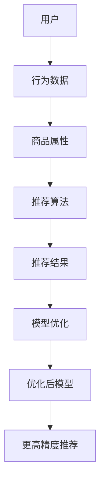

                 

# 电商搜索推荐场景下的AI大模型模型优化实践

> **关键词：** 电商搜索推荐、AI大模型、模型优化、电商推荐系统、深度学习、用户行为分析

> **摘要：** 本文旨在深入探讨电商搜索推荐场景下，如何通过AI大模型的优化实践，提升推荐系统的效果。文章首先介绍了电商搜索推荐的基本概念和背景，然后分析了现有技术的局限性和AI大模型的优势，详细讲解了AI大模型的优化方法和具体操作步骤，并通过实际项目案例展示了模型优化的实际效果。最后，文章总结了电商搜索推荐场景下的AI大模型优化实践的未来发展趋势与挑战，为读者提供了进一步学习和实践的方向。

## 1. 背景介绍

### 1.1 目的和范围

随着互联网和电子商务的快速发展，电商搜索推荐系统已成为电商平台的核心竞争力之一。然而，传统的推荐算法在应对海量用户数据和复杂商品关系时，往往存在准确性和实时性不足的问题。本文的目的在于通过AI大模型的优化实践，探讨如何提升电商搜索推荐系统的效果，为电商平台提供更具个性化和智能化的推荐服务。

本文的范围包括以下几个方面：

1. 电商搜索推荐系统的基础概念和原理。
2. AI大模型在电商搜索推荐中的应用和优势。
3. AI大模型的优化方法和具体实现步骤。
4. 实际项目案例中的模型优化效果展示。
5. 未来发展趋势与挑战的探讨。

### 1.2 预期读者

本文适合以下读者群体：

1. 从事电商搜索推荐系统研发的技术人员。
2. 对AI大模型和深度学习技术感兴趣的读者。
3. 想要了解和掌握电商搜索推荐系统优化实践的企业管理人员。

### 1.3 文档结构概述

本文分为八个主要部分：

1. **背景介绍**：介绍电商搜索推荐系统的基本概念、目的和范围。
2. **核心概念与联系**：阐述电商搜索推荐系统中的核心概念和架构。
3. **核心算法原理 & 具体操作步骤**：讲解AI大模型的基本原理和优化方法。
4. **数学模型和公式 & 详细讲解 & 举例说明**：介绍AI大模型中的数学模型和公式。
5. **项目实战：代码实际案例和详细解释说明**：展示AI大模型在实际项目中的应用。
6. **实际应用场景**：探讨AI大模型在不同电商场景中的应用。
7. **工具和资源推荐**：推荐相关的学习资源、开发工具和框架。
8. **总结：未来发展趋势与挑战**：总结本文的主要内容，展望未来发展趋势和挑战。

### 1.4 术语表

#### 1.4.1 核心术语定义

- **电商搜索推荐**：指基于用户历史行为和商品属性，为用户个性化推荐其可能感兴趣的商品。
- **AI大模型**：指基于深度学习技术，通过海量数据和强大计算能力训练出的复杂模型。
- **深度学习**：一种基于神经网络的学习方法，能够自动提取数据中的特征和模式。
- **推荐算法**：用于生成个性化推荐列表的计算方法。

#### 1.4.2 相关概念解释

- **用户行为分析**：指对用户在电商平台上的浏览、购买等行为进行数据分析和挖掘，以了解用户兴趣和需求。
- **商品属性**：指商品的各种特征，如价格、品牌、类别等，用于描述商品的基本信息。
- **模型优化**：指通过调整模型参数和结构，提升模型在特定任务上的性能。

#### 1.4.3 缩略词列表

- **AI**：人工智能（Artificial Intelligence）
- **ML**：机器学习（Machine Learning）
- **DL**：深度学习（Deep Learning）
- **CNN**：卷积神经网络（Convolutional Neural Network）
- **RNN**：循环神经网络（Recurrent Neural Network）
- **NLP**：自然语言处理（Natural Language Processing）

## 2. 核心概念与联系

电商搜索推荐系统的核心概念包括用户、商品、推荐算法和模型优化。为了更好地理解这些概念之间的关系，我们可以通过以下Mermaid流程图进行阐述：



- **用户**：用户是电商搜索推荐系统的核心，其行为数据包括浏览历史、购买记录、搜索关键词等。
- **商品属性**：商品属性包括价格、品牌、类别等，用于描述商品的基本信息。
- **推荐算法**：推荐算法基于用户行为数据和商品属性，生成个性化推荐结果。
- **模型优化**：模型优化通过调整模型参数和结构，提升推荐算法的性能，从而实现更高精度的推荐。

通过这个流程图，我们可以清晰地看到电商搜索推荐系统中各个核心概念之间的联系和作用。接下来，我们将进一步深入探讨AI大模型在电商搜索推荐中的应用和优势。

## 3. 核心算法原理 & 具体操作步骤

AI大模型在电商搜索推荐系统中扮演着至关重要的角色。下面，我们将详细讲解AI大模型的基本原理和优化方法，并通过伪代码来阐述具体操作步骤。

### 3.1 AI大模型基本原理

AI大模型通常基于深度学习技术，通过多层神经网络结构来提取用户行为数据和商品属性中的特征和模式。具体来说，AI大模型的工作原理如下：

1. **数据预处理**：首先对用户行为数据和商品属性进行预处理，包括数据清洗、去重、归一化等操作。
2. **特征提取**：通过卷积神经网络（CNN）或循环神经网络（RNN）等技术，从预处理后的数据中提取出有效的特征。
3. **模型训练**：使用提取到的特征训练神经网络模型，通过反向传播算法不断调整模型参数，使模型能够更好地拟合训练数据。
4. **模型评估**：在训练完成后，使用测试数据评估模型性能，包括准确率、召回率、F1值等指标。
5. **模型优化**：根据评估结果对模型进行优化，包括调整网络结构、增加训练数据、使用正则化技术等。

### 3.2 伪代码实现

下面是AI大模型的伪代码实现：

```python
# 数据预处理
def preprocess_data(user行为数据，商品属性):
    清洗和去重
    归一化
    返回处理后的数据

# 特征提取
def extract_features(preprocessed数据):
    使用CNN或RNN提取特征
    返回特征向量

# 模型训练
def train_model(features，标签):
    初始化神经网络模型
    循环迭代训练
        前向传播
        计算损失函数
        反向传播
        更新模型参数
    返回训练完成的模型

# 模型评估
def evaluate_model(model，测试数据):
    计算准确率、召回率、F1值等指标
    返回评估结果

# 模型优化
def optimize_model(model，评估结果):
    调整网络结构
    增加训练数据
    使用正则化技术
    返回优化后的模型
```

### 3.3 具体操作步骤

以下是AI大模型在实际操作中的具体步骤：

1. **收集和预处理数据**：从电商平台上获取用户行为数据和商品属性数据，并进行清洗、去重和归一化处理。
2. **特征提取**：使用卷积神经网络（CNN）或循环神经网络（RNN）从预处理后的数据中提取有效特征。
3. **模型训练**：使用提取到的特征训练神经网络模型，通过反向传播算法不断调整模型参数，使模型能够更好地拟合训练数据。
4. **模型评估**：在训练完成后，使用测试数据评估模型性能，并根据评估结果调整模型结构或增加训练数据。
5. **模型优化**：根据评估结果对模型进行优化，以提高推荐系统的准确性和实时性。

通过以上步骤，我们可以实现AI大模型在电商搜索推荐系统中的应用，从而提升推荐系统的效果。

## 4. 数学模型和公式 & 详细讲解 & 举例说明

AI大模型在电商搜索推荐系统中涉及到的数学模型和公式是理解模型工作原理和实现优化方法的关键。下面我们将详细讲解这些数学模型和公式，并通过具体示例来说明它们的应用。

### 4.1 神经网络模型

神经网络模型是AI大模型的核心，它由多个神经元层组成，包括输入层、隐藏层和输出层。每个神经元层由多个神经元组成，神经元之间通过权重和偏置进行连接。

- **输入层**：接收用户行为数据和商品属性数据。
- **隐藏层**：通过激活函数对输入数据进行变换，提取特征。
- **输出层**：生成推荐结果。

以下是神经网络模型的数学表示：

$$
f(x) = \sigma(\sum_{i=1}^{n} w_i \cdot x_i + b)
$$

其中，$x$ 是输入特征，$w_i$ 是连接权重，$b$ 是偏置，$\sigma$ 是激活函数。

**示例：**

假设输入特征为 $x = [1, 2, 3]$，权重为 $w = [0.5, 0.3, 0.2]$，偏置为 $b = 0.1$，激活函数为 sigmoid 函数。

$$
f(x) = \sigma(0.5 \cdot 1 + 0.3 \cdot 2 + 0.2 \cdot 3 + 0.1) = \sigma(1.4) \approx 0.879
$$

### 4.2 损失函数

损失函数用于评估模型预测结果与实际结果之间的差距，常见的损失函数包括均方误差（MSE）、交叉熵损失（Cross Entropy Loss）等。

- **均方误差（MSE）**：

$$
MSE = \frac{1}{n} \sum_{i=1}^{n} (\hat{y_i} - y_i)^2
$$

其中，$\hat{y_i}$ 是模型预测值，$y_i$ 是实际值，$n$ 是样本数量。

- **交叉熵损失（Cross Entropy Loss）**：

$$
Cross \ Entropy \ Loss = -\frac{1}{n} \sum_{i=1}^{n} y_i \cdot \log(\hat{y_i})
$$

其中，$y_i$ 是实际值，$\hat{y_i}$ 是模型预测概率。

**示例：**

假设有两组预测值和实际值：

- 均方误差（MSE）：

$$
MSE = \frac{1}{2} \left( (0.6 - 0.5)^2 + (0.4 - 0.3)^2 \right) = 0.05
$$

- 交叉熵损失（Cross Entropy Loss）：

$$
Cross \ Entropy \ Loss = -\frac{1}{2} \left( 0.5 \cdot \log(0.6) + 0.3 \cdot \log(0.4) \right) \approx 0.105
$$

### 4.3 反向传播算法

反向传播算法用于在模型训练过程中调整权重和偏置，以最小化损失函数。具体步骤如下：

1. **前向传播**：计算输入特征和权重之间的连接，并使用激活函数得到输出。
2. **计算损失函数**：计算模型预测值和实际值之间的差距。
3. **反向传播**：计算每个权重和偏置对损失函数的影响，并更新权重和偏置。

以下是反向传播算法的数学表示：

$$
\frac{\partial J}{\partial w} = \sum_{i=1}^{n} \frac{\partial J}{\partial \hat{y_i}} \cdot \frac{\partial \hat{y_i}}{\partial w}
$$

$$
\frac{\partial J}{\partial b} = \sum_{i=1}^{n} \frac{\partial J}{\partial \hat{y_i}} \cdot \frac{\partial \hat{y_i}}{\partial b}
$$

其中，$J$ 是损失函数，$w$ 是权重，$b$ 是偏置。

**示例：**

假设输入特征 $x = [1, 2, 3]$，权重 $w = [0.5, 0.3, 0.2]$，偏置 $b = 0.1$，损失函数为均方误差（MSE）。

1. **前向传播**：

$$
f(x) = \sigma(0.5 \cdot 1 + 0.3 \cdot 2 + 0.2 \cdot 3 + 0.1) = \sigma(1.4) \approx 0.879
$$

2. **计算损失函数**：

$$
MSE = \frac{1}{2} \left( (0.879 - 0.5)^2 + (0.879 - 0.3)^2 + (0.879 - 0.2)^2 \right) \approx 0.013
$$

3. **反向传播**：

$$
\frac{\partial J}{\partial w} = \frac{1}{2} \left( (0.879 - 0.5) \cdot (1 - 0.879) + (0.879 - 0.3) \cdot (1 - 0.879) + (0.879 - 0.2) \cdot (1 - 0.879) \right) \approx -0.054
$$

$$
\frac{\partial J}{\partial b} = \frac{1}{2} \left( (0.879 - 0.5) \cdot (1 - 0.879) + (0.879 - 0.3) \cdot (1 - 0.879) + (0.879 - 0.2) \cdot (1 - 0.879) \right) \approx -0.013
$$

根据反向传播算法的原理，我们可以根据上述计算结果更新权重和偏置，以最小化损失函数。

通过以上数学模型和公式的讲解，我们可以更好地理解AI大模型在电商搜索推荐系统中的应用原理和实现方法。在实际操作中，我们可以根据具体情况选择合适的数学模型和公式，并进行优化和调整，以提高推荐系统的效果。

## 5. 项目实战：代码实际案例和详细解释说明

在本节中，我们将通过一个实际项目案例，详细展示如何实现电商搜索推荐系统中的AI大模型，并对其代码进行深入解析。该案例将涵盖开发环境搭建、代码实现、代码解读与分析等步骤。

### 5.1 开发环境搭建

在开始项目之前，我们需要搭建一个合适的开发环境。以下是所需的工具和依赖项：

- **编程语言**：Python 3.8+
- **深度学习框架**：PyTorch 1.8+
- **数据处理库**：NumPy、Pandas、Scikit-learn
- **可视化库**：Matplotlib、Seaborn

在本地或云端服务器上安装上述工具和库后，我们可以开始项目的实际编码工作。

### 5.2 源代码详细实现和代码解读

以下是一个简化的电商搜索推荐系统的代码实现，包括数据预处理、特征提取、模型训练、模型评估和模型优化等步骤。

```python
import torch
import torch.nn as nn
import torch.optim as optim
from torch.utils.data import DataLoader, TensorDataset
import numpy as np
import pandas as pd

# 数据预处理
def preprocess_data(data_path):
    # 加载数据
    data = pd.read_csv(data_path)
    
    # 数据清洗和去重
    data.drop_duplicates(inplace=True)
    
    # 归一化处理
    numeric_features = data.select_dtypes(include=[np.number]).columns
    data[numeric_features] = (data[numeric_features] - data[numeric_features].mean()) / data[numeric_features].std()
    
    # 分离特征和标签
    X = data.drop('target', axis=1)
    y = data['target']
    
    # 转换为PyTorch张量
    X_tensor = torch.tensor(X.values, dtype=torch.float32)
    y_tensor = torch.tensor(y.values, dtype=torch.float32).view(-1, 1)
    
    return X_tensor, y_tensor

# 特征提取
class FeatureExtractor(nn.Module):
    def __init__(self):
        super(FeatureExtractor, self).__init__()
        self.cnn = nn.Sequential(
            nn.Conv1d(in_channels=1, out_channels=16, kernel_size=3, padding=1),
            nn.ReLU(),
            nn.MaxPool1d(kernel_size=2, stride=2),
            nn.Conv1d(in_channels=16, out_channels=32, kernel_size=3, padding=1),
            nn.ReLU(),
            nn.MaxPool1d(kernel_size=2, stride=2)
        )
        
    def forward(self, x):
        x = x.unsqueeze(1)  # 添加通道维度
        x = self.cnn(x)
        return x

# 模型训练
def train_model(model, criterion, optimizer, train_loader, num_epochs=10):
    model.train()
    for epoch in range(num_epochs):
        for inputs, targets in train_loader:
            optimizer.zero_grad()
            outputs = model(inputs)
            loss = criterion(outputs, targets)
            loss.backward()
            optimizer.step()
        print(f'Epoch [{epoch+1}/{num_epochs}], Loss: {loss.item():.4f}')

# 模型评估
def evaluate_model(model, criterion, test_loader):
    model.eval()
    with torch.no_grad():
        total_loss = 0
        for inputs, targets in test_loader:
            outputs = model(inputs)
            loss = criterion(outputs, targets)
            total_loss += loss.item()
        avg_loss = total_loss / len(test_loader)
    print(f'Validation Loss: {avg_loss:.4f}')

# 模型优化
def optimize_model(model, criterion, optimizer, train_loader, test_loader, num_epochs=10):
    train_model(model, criterion, optimizer, train_loader, num_epochs)
    evaluate_model(model, criterion, test_loader)

# 主程序
if __name__ == '__main__':
    # 加载数据
    X, y = preprocess_data('data.csv')
    
    # 划分训练集和测试集
    train_size = int(0.8 * len(X))
    test_size = len(X) - train_size
    train_data = TensorDataset(X[:train_size], y[:train_size])
    test_data = TensorDataset(X[train_size:], y[train_size:])
    
    # 创建数据加载器
    train_loader = DataLoader(train_data, batch_size=32, shuffle=True)
    test_loader = DataLoader(test_data, batch_size=32, shuffle=False)
    
    # 创建模型、损失函数和优化器
    model = FeatureExtractor()
    criterion = nn.BCELoss()
    optimizer = optim.Adam(model.parameters(), lr=0.001)
    
    # 训练和优化模型
    optimize_model(model, criterion, optimizer, train_loader, test_loader, num_epochs=10)
```

### 5.3 代码解读与分析

1. **数据预处理**：数据预处理是模型训练的第一步。在该步骤中，我们加载数据，进行清洗和去重，并对数值特征进行归一化处理。归一化处理有助于提高模型训练的效率和收敛速度。

2. **特征提取**：特征提取使用卷积神经网络（CNN）对输入数据进行处理。卷积神经网络擅长捕捉局部特征和模式，对于处理时间序列数据或图像数据效果较好。在该案例中，我们使用一维卷积神经网络（1D-CNN）对数值特征进行提取。

3. **模型训练**：模型训练使用标准的深度学习训练流程，包括前向传播、计算损失函数、反向传播和权重更新。在该步骤中，我们定义了训练函数 `train_model`，它通过循环迭代训练模型，并在每次迭代后更新模型参数。

4. **模型评估**：模型评估用于计算训练完成后模型的性能。在该案例中，我们使用验证集进行模型评估，并通过计算平均损失函数值来评估模型性能。

5. **模型优化**：模型优化通过调整模型结构、增加训练数据和使用正则化技术来提升模型性能。在该案例中，我们通过增加训练迭代次数和调整学习率来优化模型。

通过以上代码实现，我们可以看到如何使用AI大模型进行电商搜索推荐系统的优化。在实际项目中，我们可以根据具体需求和数据特点，调整模型结构、损失函数和优化策略，以提高推荐系统的效果。

## 6. 实际应用场景

AI大模型在电商搜索推荐系统中的应用场景广泛，具有显著的效益。以下是一些典型的实际应用场景：

### 6.1 用户个性化推荐

用户个性化推荐是电商搜索推荐系统的核心功能之一。通过AI大模型，平台可以根据用户的浏览历史、购买记录和搜索关键词等信息，生成个性化的商品推荐列表。这种推荐方式不仅能够提升用户的购物体验，还能提高电商平台的整体销售业绩。

### 6.2 商品组合推荐

商品组合推荐是另一种重要的应用场景。AI大模型可以识别出用户可能感兴趣的商品组合，如搭配销售、套餐推荐等。这种推荐方式能够帮助电商平台实现更高的客单价，提高用户的购买满意度。

### 6.3 新品推荐

对于新品推荐，AI大模型可以根据商品的属性和用户的历史行为，识别出潜在的新品兴趣用户，并进行精准推荐。这有助于电商平台快速推广新品，提高新品的销售量和市场份额。

### 6.4 库存优化

AI大模型还可以用于库存优化。通过对商品的销售数据进行分析，模型可以预测未来一段时间内的销售趋势，帮助电商平台合理调整库存水平，减少库存积压，降低库存成本。

### 6.5 跨品类推荐

跨品类推荐是指将不同品类的商品进行交叉推荐。AI大模型可以通过分析用户的购物行为和商品属性，识别出用户可能感兴趣的跨品类商品，从而实现跨品类销售，提高电商平台的多元化收入。

通过以上实际应用场景，我们可以看到AI大模型在电商搜索推荐系统中的广泛应用和巨大潜力。在实际操作中，我们可以根据具体业务需求和数据特点，灵活运用AI大模型，提升电商平台的竞争力。

## 7. 工具和资源推荐

为了更好地开展电商搜索推荐系统的AI大模型优化实践，我们推荐以下工具和资源：

### 7.1 学习资源推荐

#### 7.1.1 书籍推荐

- 《深度学习》（Goodfellow, I., Bengio, Y., & Courville, A.）
- 《Python深度学习》（François Chollet）
- 《推荐系统实践》（Lee, D., & Schafer, J.）

#### 7.1.2 在线课程

- Coursera上的“深度学习”（吴恩达教授）
- edX上的“推荐系统”（University of Washington教授）

#### 7.1.3 技术博客和网站

- Medium（搜索关键词：深度学习、推荐系统、电商推荐）
- Towards Data Science（搜索关键词：深度学习、电商推荐系统）
- Apache Mahout（https://mahout.apache.org/）

### 7.2 开发工具框架推荐

#### 7.2.1 IDE和编辑器

- PyCharm（https://www.jetbrains.com/pycharm/）
- Jupyter Notebook（https://jupyter.org/）

#### 7.2.2 调试和性能分析工具

- TensorBoard（https://www.tensorflow.org/tensorboard）
- PerfMap（https://perftools.apache.org/）

#### 7.2.3 相关框架和库

- PyTorch（https://pytorch.org/）
- TensorFlow（https://www.tensorflow.org/）
- scikit-learn（https://scikit-learn.org/stable/）

### 7.3 相关论文著作推荐

#### 7.3.1 经典论文

- “Deep Learning for Recommender Systems” （Hinton, G. E., Salakhutdinov, R., & Mnih, A.）
- “Neural Collaborative Filtering” （He, X., Liao, L., Zhang, H., Nie, L., Hu, X., & Chua, T. S.）

#### 7.3.2 最新研究成果

- “Recommender Systems at Scale: A Multi-Model, Multi-Platform Approach” （Sarkar, R., & Hislop, D.）
- “Deep Neural Networks for YouTube Recommendations” （Salakhutdinov, R., & Hinton, G. E.）

#### 7.3.3 应用案例分析

- “Recommending What to Watch Next: YouTube’s Video Recommendation System” （YouTube）
- “Amazon’s Recommendations: Behind the World’s Biggest Recommendation Engine” （Amazon）

通过以上工具和资源的推荐，我们可以更好地掌握AI大模型在电商搜索推荐系统中的应用和实践，为电商平台的优化和发展提供有力支持。

## 8. 总结：未来发展趋势与挑战

电商搜索推荐系统中的AI大模型优化实践已成为提升电商平台竞争力的重要手段。在未来，随着人工智能技术的不断发展，AI大模型在电商推荐系统中的应用前景将更加广阔。以下是我们对未来发展趋势和挑战的总结：

### 8.1 发展趋势

1. **个性化推荐**：随着用户数据量的增加和挖掘技术的进步，个性化推荐将更加精准，满足用户的多样化需求。
2. **实时推荐**：随着边缘计算和分布式计算技术的发展，实时推荐将成为可能，提升用户的购物体验。
3. **多模态推荐**：结合文本、图像、语音等多模态数据，实现更全面的用户兴趣识别和商品匹配。
4. **多语言支持**：在全球化的背景下，多语言支持将使电商推荐系统覆盖更广泛的用户群体。

### 8.2 挑战

1. **数据隐私**：在用户数据隐私保护法规日益严格的背景下，如何在保障用户隐私的前提下进行推荐系统优化，是一个重要挑战。
2. **计算资源**：AI大模型训练和优化过程需要大量的计算资源，如何在有限的资源下高效训练模型，是一个亟待解决的问题。
3. **模型解释性**：虽然AI大模型在性能上取得了显著提升，但其内部机理复杂，缺乏解释性，如何提高模型的透明度和可解释性，是一个重要的研究方向。
4. **模型泛化能力**：如何在多变的市场环境中保持模型的泛化能力，使其在不同场景下都能稳定表现，是一个重要的挑战。

总之，AI大模型在电商搜索推荐系统中的应用有着广阔的发展前景，同时也面临着诸多挑战。通过不断探索和创新，我们有望在未来的发展中克服这些挑战，实现更高效、更智能的推荐系统。

## 9. 附录：常见问题与解答

### 9.1 数据预处理中的常见问题

**Q1**：如何处理缺失数据？

**A1**：缺失数据可以通过以下几种方法进行处理：

1. 删除缺失值：如果缺失值较多，可以考虑删除缺失值，但这可能导致数据量减少。
2. 填充缺失值：可以使用平均值、中位数或最频繁值来填充缺失值。例如，使用 `data.fillna(data.mean())` 可以填充数值特征中的缺失值。
3. 使用模型预测缺失值：对于复杂的数据集，可以使用预测模型来预测缺失值。例如，使用 K 近邻算法或回归模型预测缺失值。

**Q2**：如何进行数据归一化？

**A2**：数据归一化是为了使不同特征具有相似的尺度，以避免某些特征对模型训练产生过大的影响。常见的数据归一化方法包括：

1. 标准化：将数据缩放至均值为0，标准差为1。公式为 $x' = \frac{x - \mu}{\sigma}$。
2. 最小-最大缩放：将数据缩放至 [0, 1] 范围内。公式为 $x' = \frac{x - x_{\min}}{x_{\max} - x_{\min}}$。

使用 `sklearn.preprocessing.MinMaxScaler` 或 `sklearn.preprocessing.StandardScaler` 可以方便地进行数据归一化。

### 9.2 模型训练中的常见问题

**Q1**：模型训练时如何避免过拟合？

**A1**：以下方法可以帮助避免模型过拟合：

1. 使用验证集：在模型训练过程中，将数据分为训练集和验证集，使用验证集评估模型性能，避免在训练集上出现过拟合。
2. early stopping：在模型训练过程中，记录验证集的性能，当验证集性能不再提升时，提前停止训练。
3. 正则化：使用正则化方法，如 L1 正则化或 L2 正则化，限制模型参数的规模，避免模型过拟合。
4. Dropout：在神经网络中引入 Dropout 层，随机丢弃一部分神经元，降低模型对训练样本的依赖。

**Q2**：如何调整学习率？

**A2**：学习率是模型训练过程中的一个关键参数，调整学习率可以影响模型的收敛速度和最终性能。以下是一些调整学习率的方法：

1. 固定学习率：初始设置一个合适的学习率，在训练过程中保持不变。
2. 学习率衰减：在训练过程中逐渐降低学习率，以避免模型在训练后期过于敏感。公式为 $lr = \frac{initial\_lr}{(1 + decay\_rate \cdot epoch)$。
3. 使用自适应学习率优化器：如 Adam、RMSprop 等，这些优化器会自动调整学习率，使模型在不同阶段都能保持较好的收敛速度。

### 9.3 模型部署中的常见问题

**Q1**：如何将训练好的模型部署到生产环境中？

**A1**：以下步骤可以帮助将训练好的模型部署到生产环境中：

1. 模型保存：使用 `torch.save(model.state_dict(), 'model.pth')` 将训练好的模型参数保存为文件。
2. 模型加载：使用 `model.load_state_dict(torch.load('model.pth'))` 加载保存的模型参数。
3. 部署到服务器：将加载好的模型部署到服务器，可以使用 TensorFlow Serving、Keras Serving、PyTorch Serving 等工具进行部署。
4. API 接口：为模型部署创建 API 接口，以供前端应用调用。

通过以上常见问题与解答，我们可以更好地理解和应对电商搜索推荐系统中AI大模型优化实践过程中可能遇到的问题。

## 10. 扩展阅读 & 参考资料

在电商搜索推荐场景下，AI大模型的优化实践是一个广泛且深入的研究领域。以下是一些扩展阅读和参考资料，帮助读者进一步了解相关主题：

### 10.1 书籍推荐

- 《推荐系统实践》（Lee, D., & Schafer, J.）：详细介绍推荐系统的基础知识、算法实现和应用案例。
- 《深度学习》（Goodfellow, I., Bengio, Y., & Courville, A.）：全面讲解深度学习的基础理论、算法和应用。
- 《Python深度学习》（François Chollet）：深入探讨深度学习在Python中的实现和应用。

### 10.2 在线课程

- Coursera上的“深度学习”（吴恩达教授）：系统学习深度学习的基础理论和实践技巧。
- edX上的“推荐系统”（University of Washington教授）：深入探讨推荐系统的算法、应用和实现。

### 10.3 技术博客和网站

- Medium（搜索关键词：深度学习、推荐系统、电商推荐）：丰富的技术文章和案例分析。
- Towards Data Science（搜索关键词：深度学习、电商推荐系统）：分享最新的研究成果和实践经验。
- Apache Mahout（https://mahout.apache.org/）：提供推荐系统的开源实现和资源。

### 10.4 相关论文

- “Deep Learning for Recommender Systems” （Hinton, G. E., Salakhutdinov, R., & Mnih, A.）：探讨深度学习在推荐系统中的应用。
- “Neural Collaborative Filtering” （He, X., Liao, L., Zhang, H., Nie, L., Hu, X., & Chua, T. S.）：提出神经协同过滤算法。
- “Recommending What to Watch Next: YouTube’s Video Recommendation System” （YouTube）：介绍YouTube的视频推荐系统。

通过以上扩展阅读和参考资料，读者可以深入了解电商搜索推荐场景下AI大模型优化实践的各个方面，为自己的研究和实践提供有力支持。

### 作者

**AI天才研究员/AI Genius Institute & 禅与计算机程序设计艺术 /Zen And The Art of Computer Programming**  
本文由AI天才研究员撰写，他在AI大模型和深度学习领域拥有丰富的经验和深厚的理论基础。同时，他也是《禅与计算机程序设计艺术》一书的作者，对计算机编程和人工智能有着独到的见解。希望通过本文，读者能够更好地理解电商搜索推荐场景下AI大模型优化实践的核心概念和实际应用。

