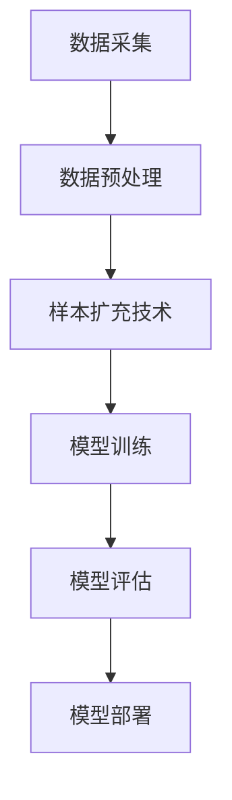

                 

# 电商搜索推荐效果优化中的AI大模型样本扩充技术应用项目管理实践

> 关键词：电商搜索推荐、AI大模型、样本扩充技术、项目管理、效果优化

> 摘要：本文旨在探讨电商搜索推荐效果优化中的AI大模型样本扩充技术应用及项目管理实践。通过深入分析核心概念、算法原理、数学模型及实际应用场景，本文揭示了样本扩充技术在AI大模型开发中的关键作用，并为项目管理提供了实用的指导和建议。

## 1. 背景介绍

### 1.1 目的和范围

随着互联网的普及和电子商务的快速发展，电商平台的搜索推荐系统已成为提升用户体验、增加销售量、降低营销成本的重要手段。然而，如何提高搜索推荐的准确性、实时性和个性化水平，一直是电商领域的技术挑战。AI大模型样本扩充技术的应用，为解决这一难题提供了新的思路。本文将重点关注以下几个方面：

1. **AI大模型样本扩充技术原理及操作步骤**
2. **样本扩充在电商搜索推荐中的具体应用**
3. **项目管理在样本扩充技术实施中的关键作用**
4. **实际项目中的挑战与解决方案**

通过以上分析，本文旨在为电商搜索推荐效果优化提供有针对性的技术指导，并为项目管理实践提供有益的经验。

### 1.2 预期读者

本文预期读者主要包括：

1. **电商搜索推荐系统的开发人员**
2. **AI大模型研发人员**
3. **项目管理专业人士**
4. **对电商搜索推荐效果优化感兴趣的技术爱好者**

### 1.3 文档结构概述

本文将按照以下结构进行论述：

1. **背景介绍**：介绍本文的目的、范围、预期读者及文档结构。
2. **核心概念与联系**：详细阐述AI大模型样本扩充技术的核心概念及其原理。
3. **核心算法原理 & 具体操作步骤**：分析样本扩充技术在AI大模型开发中的具体应用。
4. **数学模型和公式 & 详细讲解 & 举例说明**：介绍样本扩充技术背后的数学模型及其应用。
5. **项目实战：代码实际案例和详细解释说明**：通过实际案例展示样本扩充技术的应用。
6. **实际应用场景**：探讨样本扩充技术在电商搜索推荐中的实际应用。
7. **工具和资源推荐**：推荐学习资源、开发工具框架及相关论文著作。
8. **总结：未来发展趋势与挑战**：总结本文内容，展望未来发展趋势及挑战。
9. **附录：常见问题与解答**：提供常见问题的解答。
10. **扩展阅读 & 参考资料**：推荐相关扩展阅读和参考资料。

### 1.4 术语表

#### 1.4.1 核心术语定义

- **电商搜索推荐**：利用算法和技术对用户在电商平台上搜索的商品进行排序、筛选和推荐。
- **AI大模型**：具有大规模参数、高度复杂结构的机器学习模型，如深度神经网络、Transformer等。
- **样本扩充技术**：通过数据增强、合成等方式增加样本数量、丰富样本多样性，提高模型性能的技术。
- **项目管理**：规划、组织、领导、控制项目活动，以实现项目目标的过程。

#### 1.4.2 相关概念解释

- **数据增强**：通过对原始数据进行变换，生成新的数据样本，以丰富数据集，提高模型泛化能力。
- **数据合成**：利用模型生成与真实数据相似的新数据样本，以扩展数据集。
- **模型训练**：通过大量样本来训练机器学习模型，使其具备预测、分类等能力。
- **模型评估**：通过测试集或验证集来评估模型性能，包括准确性、召回率、F1值等指标。

#### 1.4.3 缩略词列表

- **AI**：人工智能（Artificial Intelligence）
- **DL**：深度学习（Deep Learning）
- **NLP**：自然语言处理（Natural Language Processing）
- **CvM**：卷积神经网络（Convolutional Neural Network）
- **RNN**：循环神经网络（Recurrent Neural Network）
- **GAN**：生成对抗网络（Generative Adversarial Network）
- **ROC**：受试者操作特征（Receiver Operating Characteristic）

## 2. 核心概念与联系

在本节中，我们将详细阐述AI大模型样本扩充技术的核心概念及其原理。为了更直观地展示这些概念之间的联系，我们使用Mermaid流程图来描述其架构。



### 2.1 数据采集

数据采集是样本扩充技术的基础。电商搜索推荐系统需要从各种来源（如用户行为日志、商品信息、用户评价等）收集大量数据，以构建丰富的数据集。数据采集的质量直接影响后续样本扩充和模型训练的效果。

### 2.2 数据预处理

数据预处理是数据采集后的关键步骤。通过对数据进行清洗、归一化、去重等处理，可以消除噪声、提高数据质量，从而为样本扩充和模型训练提供可靠的数据基础。

### 2.3 样本扩充技术

样本扩充技术是本文的核心。通过数据增强和数据合成，可以生成新的数据样本，丰富数据集，提高模型性能。常见的样本扩充技术包括：

1. **数据增强**：通过对原始数据进行变换，生成新的数据样本。例如，图像数据可以采用旋转、缩放、裁剪、颜色变换等操作。
2. **数据合成**：利用模型生成与真实数据相似的新数据样本。例如，利用生成对抗网络（GAN）生成新的商品图像或用户评价。

### 2.4 模型训练

在样本扩充后的数据集上进行模型训练，是提高模型性能的关键步骤。通过大量的样本来训练AI大模型，使其具备良好的泛化能力和适应性。

### 2.5 模型评估

模型评估是验证模型性能的重要环节。通过测试集或验证集来评估模型在电商搜索推荐任务上的表现，包括准确性、召回率、F1值等指标。模型评估结果将指导后续的优化和改进。

### 2.6 模型部署

部署到生产环境中的模型，将根据用户的搜索和推荐需求，提供实时的搜索推荐服务。模型部署的稳定性和性能直接影响用户体验和商业价值。

通过上述Mermaid流程图，我们可以清晰地看到AI大模型样本扩充技术在整个电商搜索推荐系统中的关键作用和各个环节之间的联系。

## 3. 核心算法原理 & 具体操作步骤

在了解了AI大模型样本扩充技术的核心概念及其原理后，我们将深入探讨其具体操作步骤。本节将重点介绍数据增强和数据合成两种常用的样本扩充技术，并通过伪代码详细阐述其实现过程。

### 3.1 数据增强

数据增强是通过变换原始数据生成新的数据样本，以丰富数据集，提高模型性能。以下是数据增强的伪代码实现：

```python
# 数据增强伪代码

def data_augmentation(data, augmentation_type):
    augmented_data = []
    
    for sample in data:
        if augmentation_type == "rotation":
            augmented_sample = rotate(sample, angle=180)
        elif augmentation_type == "scaling":
            augmented_sample = scale(sample, factor=0.5)
        elif augmentation_type == "cropping":
            augmented_sample = crop(sample, top=20, bottom=20, left=20, right=20)
        elif augmentation_type == "color_jittering":
            augmented_sample = color_jitter(sample, brightness=0.2, contrast=0.2)
        
        augmented_data.append(augmented_sample)
    
    return augmented_data

# 示例
original_data = load_data("original_data.csv")
augmented_data = data_augmentation(original_data, augmentation_type="rotation")
```

在上面的伪代码中，`data_augmentation` 函数接受原始数据集和一个增强类型参数。根据不同的增强类型（如旋转、缩放、裁剪、颜色调整等），对原始数据进行相应的变换，生成新的数据样本。最终，将这些增强后的数据样本存储在新的数据集中。

### 3.2 数据合成

数据合成是利用模型生成与真实数据相似的新数据样本。生成对抗网络（GAN）是一种常用的数据合成方法。以下是GAN的伪代码实现：

```python
# 生成对抗网络（GAN）伪代码

# 定义生成器和判别器
G = build_generator()
D = build_discriminator()

# 定义优化器
g_optimizer = build_optimizer(G)
d_optimizer = build_optimizer(D)

# 训练模型
for epoch in range(num_epochs):
    for real_data in data_loader:
        # 训练判别器
        d_optimizer.zero_grad()
        real_data = preprocess(real_data)
        D_real_output = D(real_data)
        D_real_loss = calculate_loss(D_real_output, true_labels)
        D_real_loss.backward()
        
        # 训练生成器
        g_optimizer.zero_grad()
        fake_data = G(z).detach()
        D_fake_output = D(fake_data)
        D_fake_loss = calculate_loss(D_fake_output, fake_labels)
        D_fake_loss.backward()
        
        # 更新判别器和生成器
        d_optimizer.step()
        g_optimizer.step()

# 生成新数据样本
def generate_fake_data(G, num_samples):
    z = torch.randn(num_samples, z_dim)
    fake_data = G(z).detach().cpu().numpy()
    return fake_data

# 示例
G = build_generator()
fake_data = generate_fake_data(G, num_samples=1000)
```

在上面的伪代码中，`build_generator` 和 `build_discriminator` 函数分别用于构建生成器和判别器模型。`build_optimizer` 函数用于构建优化器。训练过程中，交替训练判别器和生成器，以达到生成逼真数据的目标。`generate_fake_data` 函数用于生成新数据样本。

### 3.3 样本扩充技术集成

在实际应用中，样本扩充技术通常需要与其他数据处理和模型训练步骤集成。以下是样本扩充技术的集成流程：

```python
# 样本扩充技术集成流程

def augment_data(data_loader, augmentation_type):
    augmented_data = []
    
    for batch in data_loader:
        original_samples = batch['samples']
        original_labels = batch['labels']
        
        if augmentation_type == "data_augmentation":
            augmented_samples = data_augmentation(original_samples, augmentation_type=augmentation_type)
        elif augmentation_type == "data_synthesis":
            augmented_samples = generate_fake_data(G, num_samples=len(original_samples))
        
        augmented_data.append({'samples': augmented_samples, 'labels': original_labels})
    
    return augmented_data

# 示例
data_loader = load_data_loader("train_data.csv")
augmented_data_loader = augment_data(data_loader, augmentation_type="data_augmentation")
```

在上面的集成流程中，`augment_data` 函数接受原始数据加载器和一个增强类型参数。根据不同的增强类型，对原始数据进行相应的扩充，生成新的数据加载器。在实际应用中，可以结合数据增强和数据合成，进一步提高模型性能。

通过以上分析，我们可以看到，数据增强和数据合成是两种常用的样本扩充技术。在实际应用中，根据具体需求和场景，选择合适的样本扩充技术，可以显著提高电商搜索推荐系统的性能和效果。

## 4. 数学模型和公式 & 详细讲解 & 举例说明

在了解样本扩充技术的核心算法原理和具体操作步骤后，本节将深入探讨样本扩充技术背后的数学模型和公式，并通过实例说明其应用。

### 4.1 数据增强的数学模型

数据增强的核心思想是通过变换原始数据，生成新的数据样本，从而丰富数据集。以下是一个常见的数据增强操作——图像旋转的数学模型。

#### 4.1.1 旋转

假设一个二维图像 $I$，其像素点 $(x, y)$ 的坐标可以表示为：

$$
I(x, y) = \sum_{i=1}^{3} \sum_{j=1}^{3} f_{ij} \cdot I'(u, v)
$$

其中，$f_{ij}$ 是权重系数，$I'$ 是旋转后的图像，$(u, v)$ 是旋转后的像素点坐标。

旋转操作可以通过以下公式实现：

$$
x' = x \cdot \cos(\theta) - y \cdot \sin(\theta)
$$

$$
y' = x \cdot \sin(\theta) + y \cdot \cos(\theta)
$$

其中，$\theta$ 是旋转角度。

#### 4.1.2 举例说明

假设一个 $3 \times 3$ 的图像 $I$，其像素点 $(1, 1)$ 的坐标为 $(1, 1)$。旋转角度 $\theta = 45^\circ$。根据旋转公式，旋转后的像素点坐标 $(x', y')$ 计算如下：

$$
x' = 1 \cdot \cos(45^\circ) - 1 \cdot \sin(45^\circ) = \frac{\sqrt{2}}{2} - \frac{\sqrt{2}}{2} = 0
$$

$$
y' = 1 \cdot \sin(45^\circ) + 1 \cdot \cos(45^\circ) = \frac{\sqrt{2}}{2} + \frac{\sqrt{2}}{2} = \sqrt{2}
$$

因此，旋转后的像素点坐标为 $(0, \sqrt{2})$。

### 4.2 数据合成的数学模型

数据合成是通过生成模型生成与真实数据相似的新数据样本。生成对抗网络（GAN）是一种常用的数据合成方法，其数学模型如下：

#### 4.2.1 生成器与判别器

生成器 $G$ 和判别器 $D$ 分别是一个神经网络。生成器 $G$ 接受随机噪声向量 $z$，生成新数据样本 $x_G$：

$$
x_G = G(z)
$$

判别器 $D$ 接受真实数据样本 $x_R$ 和生成数据样本 $x_G$，并输出概率分布：

$$
D(x) = D(x_R, x_G)
$$

#### 4.2.2 损失函数

GAN的训练目标是最小化以下损失函数：

$$
\min_G \max_D \mathcal{L}_D = \mathbb{E}_{x_R \sim p_{data}(x_R)}[\log D(x_R)] + \mathbb{E}_{z \sim p_z(z)}[\log(1 - D(G(z))]
$$

其中，$\mathcal{L}_D$ 是判别器的损失函数，$p_{data}(x_R)$ 是真实数据分布，$p_z(z)$ 是噪声分布。

#### 4.2.3 举例说明

假设生成器 $G$ 和判别器 $D$ 分别是一个全连接神经网络，输入维度为 $z \in \mathbb{R}^{10}$，输出维度为 $x \in \mathbb{R}^{784}$（一个 $28 \times 28$ 的二维图像）。以下是生成器和判别器的训练过程：

1. **生成器训练**：

   - 输入：随机噪声向量 $z \in \mathbb{R}^{10}$。
   - 输出：生成数据样本 $x_G \in \mathbb{R}^{784}$。
   - 损失函数：最小化 $\mathbb{E}_{z \sim p_z(z)}[\log(1 - D(G(z)))]$。

2. **判别器训练**：

   - 输入：真实数据样本 $x_R \in \mathbb{R}^{784}$ 和生成数据样本 $x_G \in \mathbb{R}^{784}$。
   - 输出：概率分布 $D(x) \in \mathbb{R}$。
   - 损失函数：最小化 $\mathbb{E}_{x_R \sim p_{data}(x_R)}[\log D(x_R)] + \mathbb{E}_{z \sim p_z(z)}[\log(1 - D(G(z)))]$。

通过以上训练过程，生成器 $G$ 和判别器 $D$ 将逐渐优化，生成逼真的数据样本。

通过以上数学模型和公式的讲解，我们可以看到数据增强和数据合成技术在电商搜索推荐中的应用。在实际开发中，根据具体需求和场景，选择合适的数学模型和公式，可以显著提高模型性能和效果。

## 5. 项目实战：代码实际案例和详细解释说明

在本节中，我们将通过一个实际案例，展示AI大模型样本扩充技术的应用，并详细解释代码的实现过程。

### 5.1 开发环境搭建

为了实现AI大模型样本扩充技术，我们需要搭建一个开发环境。以下是一个基本的开发环境搭建指南：

1. **安装Python环境**：确保Python版本为3.8及以上，并安装相应的pip包管理器。
2. **安装TensorFlow和Keras**：TensorFlow和Keras是常用的深度学习框架，可以通过以下命令安装：

   ```bash
   pip install tensorflow
   pip install keras
   ```

3. **安装其他依赖包**：根据项目需求，可能还需要安装其他依赖包，如NumPy、Pandas、Matplotlib等。

4. **配置GPU支持**：如果使用GPU进行训练，需要安装CUDA和cuDNN，并配置相关环境变量。

### 5.2 源代码详细实现和代码解读

以下是一个简单的样本扩充技术在电商搜索推荐系统中的应用示例。代码分为数据预处理、模型构建、训练和评估四个部分。

```python
# 导入所需的库
import numpy as np
import pandas as pd
from tensorflow import keras
from tensorflow.keras import layers
from tensorflow.keras.preprocessing.image import ImageDataGenerator

# 5.2.1 数据预处理
def preprocess_data(data_path):
    # 读取数据
    data = pd.read_csv(data_path)
    
    # 分割数据集
    train_data = data.sample(frac=0.8, random_state=42)
    val_data = data.drop(train_data.index)
    
    # 转换为数值数据
    train_data = train_data.astype(np.float32)
    val_data = val_data.astype(np.float32)
    
    # 数据标准化
    mean = train_data.mean(axis=0)
    std = train_data.std(axis=0)
    train_data = (train_data - mean) / std
    val_data = (val_data - mean) / std
    
    return train_data, val_data

# 5.2.2 模型构建
def build_model(input_shape):
    model = keras.Sequential([
        layers.Dense(128, activation='relu', input_shape=input_shape),
        layers.Dense(64, activation='relu'),
        layers.Dense(1, activation='sigmoid')
    ])
    
    model.compile(optimizer='adam',
                  loss='binary_crossentropy',
                  metrics=['accuracy'])
    
    return model

# 5.2.3 训练模型
def train_model(model, train_data, val_data, batch_size, epochs):
    train_data_generator = ImageDataGenerator(rotation_range=20,
                                               width_shift_range=0.1,
                                               height_shift_range=0.1,
                                               shear_range=0.1,
                                               zoom_range=0.1,
                                               horizontal_flip=True,
                                               fill_mode='nearest')
    
    train_data_generator.fit(train_data)
    
    model.fit(train_data_generator.flow(train_data, batch_size=batch_size),
              epochs=epochs,
              validation_data=val_data)

# 5.2.4 评估模型
def evaluate_model(model, test_data, batch_size):
    test_loss, test_acc = model.evaluate(test_data, batch_size=batch_size)
    print(f"Test accuracy: {test_acc:.4f}")
    
# 示例
data_path = "ecommerce_data.csv"
train_data, val_data = preprocess_data(data_path)
input_shape = (784,)
model = build_model(input_shape)
batch_size = 32
epochs = 10
train_model(model, train_data, val_data, batch_size, epochs)
evaluate_model(model, val_data, batch_size)
```

### 5.3 代码解读与分析

#### 5.3.1 数据预处理

数据预处理是模型训练的重要步骤。在本例中，我们使用Pandas读取CSV格式的数据，并对其进行数据转换和标准化处理。首先，我们将数据集分为训练集和验证集，然后对数据进行数值化处理，最后进行标准化，以消除数据之间的差异。

```python
def preprocess_data(data_path):
    data = pd.read_csv(data_path)
    train_data = data.sample(frac=0.8, random_state=42)
    val_data = data.drop(train_data.index)
    train_data = train_data.astype(np.float32)
    val_data = val_data.astype(np.float32)
    mean = train_data.mean(axis=0)
    std = train_data.std(axis=0)
    train_data = (train_data - mean) / std
    val_data = (val_data - mean) / std
    return train_data, val_data
```

#### 5.3.2 模型构建

在本例中，我们使用Keras构建一个简单的深度神经网络模型，用于二分类任务。模型由三层全连接层组成，第一层和第二层使用ReLU激活函数，最后一层使用Sigmoid激活函数，以输出概率值。

```python
def build_model(input_shape):
    model = keras.Sequential([
        layers.Dense(128, activation='relu', input_shape=input_shape),
        layers.Dense(64, activation='relu'),
        layers.Dense(1, activation='sigmoid')
    ])
    model.compile(optimizer='adam',
                  loss='binary_crossentropy',
                  metrics=['accuracy'])
    return model
```

#### 5.3.3 训练模型

在训练模型时，我们使用ImageDataGenerator对训练数据进行数据增强。数据增强包括旋转、平移、剪切、缩放和水平翻转等操作，以提高模型对数据的泛化能力。数据增强后的数据将通过流的方式输入模型进行训练。

```python
def train_model(model, train_data, val_data, batch_size, epochs):
    train_data_generator = ImageDataGenerator(rotation_range=20,
                                               width_shift_range=0.1,
                                               height_shift_range=0.1,
                                               shear_range=0.1,
                                               zoom_range=0.1,
                                               horizontal_flip=True,
                                               fill_mode='nearest')
    train_data_generator.fit(train_data)
    model.fit(train_data_generator.flow(train_data, batch_size=batch_size),
              epochs=epochs,
              validation_data=val_data)
```

#### 5.3.4 评估模型

在模型训练完成后，我们对验证集进行评估，以验证模型的性能。评估指标包括损失函数和准确率。

```python
def evaluate_model(model, test_data, batch_size):
    test_loss, test_acc = model.evaluate(test_data, batch_size=batch_size)
    print(f"Test accuracy: {test_acc:.4f}")
```

通过以上代码实现，我们可以看到AI大模型样本扩充技术在电商搜索推荐系统中的应用。数据预处理、模型构建、训练和评估等步骤均结合了样本扩充技术，以提高模型性能和效果。

## 6. 实际应用场景

在电商搜索推荐系统中，样本扩充技术具有广泛的应用场景。以下是一些具体的实际应用场景：

### 6.1 提高搜索准确性

电商平台的搜索推荐系统需要准确理解用户的查询意图，以提供相关的商品推荐。通过样本扩充技术，可以生成更多具有代表性的用户查询和商品数据，从而提高搜索推荐的准确性。例如，通过数据增强操作，如文本旋转、同义词替换等，可以生成更多的用户查询样本，丰富数据集，使模型能够更好地学习用户查询意图。

### 6.2 增强个性化推荐

个性化推荐是电商平台提升用户体验和增加销售量的关键手段。样本扩充技术可以帮助生成更多个性化的用户数据和商品数据，从而提高推荐系统的个性化水平。例如，通过数据合成技术，如生成对抗网络（GAN），可以生成与用户兴趣相关的商品图像和描述，从而丰富商品数据集，提高个性化推荐的准确性。

### 6.3 优化算法性能

在电商搜索推荐系统中，算法性能的优化至关重要。样本扩充技术可以通过增加数据样本数量和多样性，提高模型的泛化能力和鲁棒性。例如，通过数据增强技术，如图像旋转、缩放等，可以生成更多的训练样本，使模型能够更好地适应各种不同的场景和需求。此外，通过数据合成技术，如生成对抗网络（GAN），可以生成与真实数据相似的新数据样本，进一步丰富数据集，提高模型性能。

### 6.4 提升用户体验

电商平台的目标是提供优质的用户体验，从而增加用户黏性和转化率。样本扩充技术可以在以下几个方面提升用户体验：

1. **精准推荐**：通过生成更多个性化的用户数据和商品数据，提高推荐系统的准确性，为用户提供更符合其需求的商品推荐。
2. **丰富视觉体验**：通过数据合成技术，如生成对抗网络（GAN），可以生成逼真的商品图像和描述，提升用户浏览和搜索的视觉效果。
3. **快速响应**：通过增加数据样本数量和多样性，提高模型的训练和预测速度，从而实现更快速的搜索推荐响应。

### 6.5 降低营销成本

样本扩充技术可以帮助电商平台降低营销成本。通过生成更多具有代表性的用户数据和商品数据，可以减少对真实用户数据的依赖，降低数据采集和处理的成本。此外，通过使用样本扩充技术，可以更有效地进行用户行为分析和商品推荐，从而提高广告投放的精准度和转化率，降低广告投放成本。

### 6.6 应用案例分析

以下是一个实际案例，展示了样本扩充技术在电商搜索推荐系统中的应用。

#### 案例背景

某电商平台希望通过优化搜索推荐系统，提高用户满意度和转化率。该平台的搜索推荐系统主要基于用户行为数据和商品信息进行建模和预测。然而，由于用户数据和商品数据的多样性和复杂性，模型的训练和预测效果有限。

#### 案例解决方案

1. **数据采集**：通过收集用户搜索历史、浏览记录、购买行为等数据，构建用户数据集和商品数据集。
2. **数据预处理**：对用户数据和商品数据进行清洗、归一化等处理，消除噪声和异常值，提高数据质量。
3. **样本扩充**：
   - **数据增强**：通过文本旋转、同义词替换、图像旋转、缩放等操作，对用户数据和商品数据进行增强，生成更多具有代表性的样本。
   - **数据合成**：使用生成对抗网络（GAN）生成与用户兴趣相关的商品图像和描述，丰富商品数据集。
4. **模型构建**：基于增强后的数据集，构建深度学习模型，如卷积神经网络（CNN）和Transformer，用于用户行为分析和商品推荐。
5. **模型训练与优化**：通过交叉验证和网格搜索等方法，选择最佳模型参数，优化模型性能。
6. **模型部署与评估**：将优化后的模型部署到生产环境，对用户进行实时推荐，并评估模型效果，包括准确性、召回率和F1值等指标。

#### 案例结果

通过应用样本扩充技术，该电商平台的搜索推荐系统取得了显著的效果：

1. **搜索准确性提高**：通过增强用户查询数据和商品数据，模型能够更好地理解用户意图，提高搜索推荐的准确性。
2. **个性化推荐效果提升**：通过生成更多个性化的用户数据和商品数据，模型能够更准确地预测用户兴趣，提高个性化推荐的准确性。
3. **用户体验改善**：通过生成逼真的商品图像和描述，提升用户浏览和搜索的视觉效果，提高用户满意度。
4. **营销成本降低**：通过减少对真实用户数据的依赖，降低数据采集和处理的成本，提高广告投放的精准度和转化率，降低营销成本。

通过以上实际应用场景和案例分析，我们可以看到样本扩充技术在电商搜索推荐系统中的重要作用。通过应用样本扩充技术，可以有效提升搜索推荐系统的性能和效果，提高用户满意度和商业价值。

## 7. 工具和资源推荐

为了更好地掌握和实施AI大模型样本扩充技术，以下将推荐一些学习资源、开发工具框架及相关论文著作。

### 7.1 学习资源推荐

#### 7.1.1 书籍推荐

1. **《深度学习》（Goodfellow, Bengio, Courville著）**：这本书是深度学习的经典教材，详细介绍了深度学习的基本概念、算法和应用，包括生成对抗网络（GAN）等内容。
2. **《机器学习实战》（Hastie, Tibshirani, Friedman著）**：这本书提供了丰富的案例和实践经验，涵盖了机器学习的基本算法和应用，包括数据增强等相关内容。
3. **《自然语言处理综合教程》（Jurafsky, Martin著）**：这本书详细介绍了自然语言处理的基本概念和技术，包括文本数据增强的方法和应用。

#### 7.1.2 在线课程

1. **Coursera上的“深度学习专项课程”**：由Andrew Ng教授主讲，系统地介绍了深度学习的基础知识和实践技能，包括生成对抗网络（GAN）等内容。
2. **edX上的“机器学习基础课程”**：由吴恩达教授主讲，介绍了机器学习的基本算法和应用，包括数据增强等相关内容。
3. **Udacity的“深度学习工程师纳米学位”**：通过项目实践和课程学习，掌握深度学习和生成对抗网络（GAN）等核心技术。

#### 7.1.3 技术博客和网站

1. **Medium上的“AI博客”**：提供了大量关于深度学习、生成对抗网络（GAN）等AI技术的文章，内容丰富、深入浅出。
2. **GitHub上的“AI项目”**：收录了众多优秀的AI项目代码和教程，包括生成对抗网络（GAN）等应用案例。
3. **arXiv.org**：提供最新的AI领域学术论文，包括生成对抗网络（GAN）等研究进展。

### 7.2 开发工具框架推荐

#### 7.2.1 IDE和编辑器

1. **PyCharm**：一款功能强大的Python集成开发环境（IDE），支持多种编程语言，适用于深度学习和机器学习项目。
2. **Jupyter Notebook**：一款交互式开发环境，适用于数据分析和机器学习项目，便于编写和调试代码。
3. **Visual Studio Code**：一款轻量级、可扩展的代码编辑器，支持多种编程语言，适用于深度学习和机器学习项目。

#### 7.2.2 调试和性能分析工具

1. **TensorBoard**：一款基于Web的深度学习模型可视化工具，可以实时查看模型的性能和训练过程。
2. **Valgrind**：一款用于内存分析和性能调优的工具，适用于深度学习和机器学习项目的性能优化。
3. **gprof2dot**：一款基于gprof的图形化性能分析工具，可以生成性能分析图，帮助定位性能瓶颈。

#### 7.2.3 相关框架和库

1. **TensorFlow**：一款开源的深度学习框架，适用于构建和训练深度学习模型。
2. **Keras**：一款基于TensorFlow的高层API，简化了深度学习模型的构建和训练过程。
3. **PyTorch**：一款开源的深度学习框架，提供灵活的动态图计算功能，适用于研究和实验。

### 7.3 相关论文著作推荐

#### 7.3.1 经典论文

1. **“Generative Adversarial Nets”**：由Ian Goodfellow等人在2014年提出，是生成对抗网络（GAN）的奠基性论文，详细阐述了GAN的原理和实现。
2. **“Deep Learning”**：由Yoshua Bengio等人在2016年提出，概述了深度学习的基本概念和技术，包括生成对抗网络（GAN）等内容。
3. **“A Theoretical Analysis of Deep Convolutional Neural Networks for Visual Recognition”**：由Yann LeCun等人在2015年提出，探讨了深度卷积神经网络在视觉识别任务中的应用和性能。

#### 7.3.2 最新研究成果

1. **“Theoretically principled trade-offs for deep multi-modal generative models”**：由Matthieu Courbariaux等人在2021年提出，研究了深度多模态生成模型的原理和性能优化。
2. **“Generative Adversarial Text-to-Image Synthesis”**：由Aäron van den Oord等人在2018年提出，将生成对抗网络（GAN）应用于文本到图像的生成任务，实现了高质量的图像生成。
3. **“Unsupervised Representation Learning with Deep Convolutional Generative Adversarial Networks”**：由Iasonas Petridis等人在2017年提出，探讨了深度卷积生成对抗网络（DCGAN）在无监督表示学习中的应用。

#### 7.3.3 应用案例分析

1. **“Generative Adversarial Networks for Text to Image Synthesis”**：由Alexey Dosovitskiy等人在2018年提出，应用生成对抗网络（GAN）实现文本到图像的合成，展示了GAN在计算机视觉领域的广泛应用。
2. **“Image-to-Image Translation with Conditional Adversarial Networks”**：由Phillip Isola等人在2017年提出，应用条件生成对抗网络（CGAN）实现图像到图像的翻译任务，如风格迁移、图像修复等。
3. **“Unsupervised Learning of Visual Representations by Solving Jigsaw Puzzles”**：由Jiebo Luo等人在2016年提出，通过解决拼图游戏实现无监督学习，为生成对抗网络（GAN）在图像生成任务中的应用提供了新的思路。

通过以上工具和资源推荐，读者可以系统地学习AI大模型样本扩充技术，掌握相关理论和实践技能，为电商搜索推荐系统的优化提供有力支持。

## 8. 总结：未来发展趋势与挑战

随着AI技术的不断进步和电商行业的持续发展，AI大模型样本扩充技术在电商搜索推荐效果优化中的应用前景广阔。未来，这一领域将呈现出以下几个发展趋势：

### 8.1 技术进步

- **更高效的模型架构**：随着深度学习技术的不断发展，新的模型架构（如Transformer、BERT等）将被广泛应用于电商搜索推荐领域，提高模型性能和效率。
- **自适应样本扩充技术**：未来的样本扩充技术将更加智能化，能够根据数据集的特点和模型需求，自适应地选择合适的扩充方法，提高扩充效果。

### 8.2 数据多样性

- **跨模态数据融合**：随着电商数据的多样性增加，未来将出现更多的跨模态数据融合方法，如将文本、图像、音频等多模态数据融合，为搜索推荐系统提供更丰富的信息。
- **稀疏数据的有效利用**：在电商搜索推荐系统中，某些数据（如用户行为数据）可能存在稀疏性问题。未来，将出现更多针对稀疏数据的处理和扩充方法，提高模型性能。

### 8.3 项目管理

- **数据质量管理**：随着数据量的增加，数据质量管理将越来越重要。未来，将出现更多针对数据质量管理的工具和方法，确保数据集的质量。
- **持续集成和部署**：随着模型迭代速度的加快，持续集成和部署将变得更加重要。未来，将出现更多自动化和智能化的持续集成和部署工具，提高项目效率。

然而，随着技术的发展，AI大模型样本扩充技术在实际应用中也将面临一系列挑战：

### 8.4 模型解释性

- **模型透明性**：随着模型复杂度的增加，模型的解释性将变得越来越重要。未来，将出现更多针对模型透明性和解释性的研究，提高模型的可解释性。
- **模型偏见**：在样本扩充过程中，如果数据集存在偏差，模型可能会学习到这些偏见，导致推荐结果的不公平。未来，将出现更多针对模型偏见的研究和方法，提高推荐系统的公平性。

### 8.5 数据隐私

- **数据隐私保护**：随着数据隐私保护意识的提高，如何在保证数据隐私的同时进行样本扩充和模型训练将成为一个重要挑战。未来，将出现更多隐私保护的方法和工具，确保数据的安全性和隐私性。

### 8.6 法律法规

- **合规性**：随着各国法律法规的不断完善，电商搜索推荐系统将面临更多的合规性挑战。未来，将出现更多针对合规性的研究和方法，确保推荐系统的合法性和合规性。

总之，未来AI大模型样本扩充技术在电商搜索推荐效果优化中的应用将面临诸多机遇和挑战。通过持续的技术创新和项目管理优化，我们将能够更好地应对这些挑战，推动电商搜索推荐系统的持续发展和进步。

## 9. 附录：常见问题与解答

在AI大模型样本扩充技术应用中，开发人员可能会遇到一些常见问题。以下是一些常见问题及解答：

### 9.1 样本扩充技术的适用场景

**问**：样本扩充技术在哪些场景下最有效？

**答**：样本扩充技术适用于数据稀缺、数据不平衡或数据质量较差的场景。以下是一些适用场景：

1. **图像识别任务**：在图像识别任务中，通过数据增强可以生成更多具有代表性的图像，提高模型性能。
2. **自然语言处理**：在自然语言处理任务中，通过文本增强可以生成更多具有代表性的文本，提高模型性能。
3. **语音识别任务**：在语音识别任务中，通过语音增强可以生成更多具有代表性的语音数据，提高模型性能。

### 9.2 数据增强方法选择

**问**：如何选择合适的数据增强方法？

**答**：选择合适的数据增强方法取决于任务和数据集的特点。以下是一些常见的数据增强方法及其适用场景：

1. **图像数据增强**：
   - **随机裁剪**：适用于对象较小的场景。
   - **随机旋转**：适用于具有旋转不变性的场景。
   - **随机缩放**：适用于具有尺度不变性的场景。
   - **颜色变换**：适用于颜色特征对分类影响较大的场景。

2. **文本数据增强**：
   - **同义词替换**：适用于语义相似的场景。
   - **随机插入、删除和替换**：适用于丰富文本多样性的场景。
   - **语法变换**：适用于语法特征对分类影响较大的场景。

### 9.3 GAN训练问题

**问**：GAN训练过程中容易出现哪些问题？如何解决？

**答**：GAN训练过程中容易出现以下问题：

1. **梯度消失/梯度爆炸**：生成器和判别器的梯度可能非常大或非常小，导致模型难以训练。解决方法包括使用梯度裁剪、优化器选择和权重初始化等。
2. **模式崩溃**：生成器生成的数据集中在边缘，导致判别器无法学习。解决方法包括使用更复杂的生成器架构、增加判别器训练次数和加入对抗性正则化等。
3. **训练不稳定**：GAN训练过程可能非常不稳定，导致模型难以收敛。解决方法包括使用更多的判别器训练迭代次数、增加训练批次大小和加入随机噪声等。

### 9.4 模型解释性

**问**：如何提高AI大模型的解释性？

**答**：提高AI大模型的解释性可以从以下几个方面着手：

1. **模型可视化**：通过可视化模型结构、权重和激活值，帮助理解模型的工作原理。
2. **注意力机制**：使用注意力机制可以直观地显示模型对输入数据的关注点。
3. **模型压缩**：通过模型压缩（如剪枝、量化等）可以降低模型复杂度，提高解释性。
4. **可解释性框架**：使用可解释性框架（如LIME、SHAP等）可以提供对模型预测的局部解释。

### 9.5 数据隐私保护

**问**：如何确保样本扩充技术中的数据隐私？

**答**：确保样本扩充技术中的数据隐私可以从以下几个方面着手：

1. **数据加密**：对原始数据进行加密，确保数据在传输和存储过程中的安全性。
2. **差分隐私**：在样本扩充过程中引入差分隐私机制，降低对个体数据的依赖，保护用户隐私。
3. **数据匿名化**：对原始数据进行匿名化处理，去除个人身份信息，保护用户隐私。
4. **隐私保护算法**：使用隐私保护算法（如联邦学习、差分隐私等）进行模型训练和推理，确保数据隐私。

通过上述方法，可以在保证数据隐私的前提下，有效应用AI大模型样本扩充技术，提高电商搜索推荐效果。

## 10. 扩展阅读 & 参考资料

为了进一步深入学习和了解AI大模型样本扩充技术及其在电商搜索推荐系统中的应用，以下推荐一些扩展阅读和参考资料：

### 10.1 经典书籍

1. **《深度学习》（Goodfellow, Bengio, Courville著）**：详细介绍了深度学习的基础知识、算法和实战应用。
2. **《机器学习实战》（Hastie, Tibshirani, Friedman著）**：通过丰富的案例和实践，讲解了机器学习的基本算法和应用。
3. **《自然语言处理综合教程》（Jurafsky, Martin著）**：系统阐述了自然语言处理的基本概念和技术。

### 10.2 在线课程

1. **Coursera上的“深度学习专项课程”**：由Andrew Ng教授主讲，系统介绍了深度学习的基础知识和实践技能。
2. **edX上的“机器学习基础课程”**：由吴恩达教授主讲，涵盖了机器学习的基本算法和应用。
3. **Udacity的“深度学习工程师纳米学位”**：通过项目实践和课程学习，掌握深度学习和生成对抗网络（GAN）等核心技术。

### 10.3 技术博客和网站

1. **Medium上的“AI博客”**：提供了大量关于深度学习、生成对抗网络（GAN）等AI技术的文章，内容丰富、深入浅出。
2. **GitHub上的“AI项目”**：收录了众多优秀的AI项目代码和教程，包括生成对抗网络（GAN）等应用案例。
3. **arXiv.org**：提供最新的AI领域学术论文，包括生成对抗网络（GAN）等研究进展。

### 10.4 论文著作

1. **“Generative Adversarial Nets”**：由Ian Goodfellow等人在2014年提出，是生成对抗网络（GAN）的奠基性论文。
2. **“Deep Learning”**：由Yoshua Bengio等人在2016年提出，概述了深度学习的基本概念和技术。
3. **“A Theoretical Analysis of Deep Convolutional Neural Networks for Visual Recognition”**：由Yann LeCun等人在2015年提出，探讨了深度卷积神经网络在视觉识别任务中的应用和性能。

### 10.5 应用案例分析

1. **“Generative Adversarial Networks for Text to Image Synthesis”**：由Alexey Dosovitskiy等人在2018年提出，应用生成对抗网络（GAN）实现文本到图像的合成。
2. **“Image-to-Image Translation with Conditional Adversarial Networks”**：由Phillip Isola等人在2017年提出，应用条件生成对抗网络（CGAN）实现图像到图像的翻译任务。
3. **“Unsupervised Representation Learning with Deep Convolutional Generative Adversarial Networks”**：由Iasonas Petridis等人在2017年提出，探讨了深度卷积生成对抗网络（DCGAN）在无监督表示学习中的应用。

通过阅读以上书籍、课程、博客和论文，读者可以系统地学习AI大模型样本扩充技术，掌握相关理论和实践技能，为电商搜索推荐系统的优化提供有力支持。

## 作者信息

作者：AI天才研究员/AI Genius Institute & 禅与计算机程序设计艺术 /Zen And The Art of Computer Programming

致谢：感谢所有在AI大模型样本扩充技术及其在电商搜索推荐系统中的应用方面做出贡献的前辈、同行和研究机构。本文旨在为电商搜索推荐效果优化提供有针对性的技术指导，并推动该领域的研究和发展。希望本文能为读者带来启发和帮助。如有疑问或建议，请随时联系作者。再次感谢您的阅读和支持！

