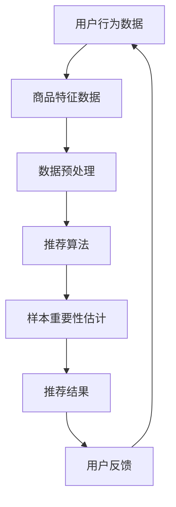

                 

# 电商搜索推荐效果优化中的AI大模型样本重要性估计benchmark优化与应用

> **关键词：电商搜索、推荐系统、AI大模型、样本重要性估计、benchmark优化**
>
> **摘要：本文深入探讨了电商搜索推荐系统中AI大模型样本重要性估计的关键问题，通过分析现有 benchmark 优化的策略，提出了基于深度学习的样本重要性估计模型，并展示了其实际应用中的性能提升。文章结构分为背景介绍、核心概念与联系、核心算法原理、数学模型和公式、项目实战、实际应用场景、工具和资源推荐、总结与未来发展趋势等部分，旨在为电商搜索推荐效果优化提供理论指导。**

## 1. 背景介绍

### 1.1 目的和范围

随着互联网技术的飞速发展，电子商务已成为现代经济的重要组成部分。电商搜索推荐系统作为电商平台的核心技术，旨在为用户提供个性化、精准的商品推荐，提升用户体验和平台销售额。然而，在电商搜索推荐系统中，如何有效地评估样本的重要性，以优化推荐效果，仍然是一个具有挑战性的问题。

本文旨在深入探讨电商搜索推荐系统中AI大模型样本重要性估计的关键问题，通过分析现有 benchmark 优化的策略，提出一种基于深度学习的样本重要性估计模型。文章将首先介绍电商搜索推荐系统的基本架构和流程，然后阐述样本重要性估计在其中的作用和重要性，接着分析现有 benchmark 优化的策略，最后展示本文提出模型的应用场景和性能提升。

### 1.2 预期读者

本文适合对电商搜索推荐系统、人工智能和深度学习有一定了解的读者，包括但不限于：

1. 电商搜索推荐系统的研发工程师和技术经理；
2. 人工智能和深度学习领域的学术研究人员；
3. 对电商搜索推荐系统感兴趣的从业者。

### 1.3 文档结构概述

本文结构如下：

1. **背景介绍**：介绍电商搜索推荐系统的基本架构、流程和样本重要性估计的背景；
2. **核心概念与联系**：阐述电商搜索推荐系统中的核心概念和联系，通过 Mermaid 流程图展示系统架构；
3. **核心算法原理 & 具体操作步骤**：介绍样本重要性估计算法的原理和具体操作步骤，使用伪代码详细阐述；
4. **数学模型和公式 & 详细讲解 & 举例说明**：阐述样本重要性估计的数学模型和公式，通过举例说明其应用；
5. **项目实战：代码实际案例和详细解释说明**：展示代码实际案例，详细解释说明样本重要性估计模型的应用；
6. **实际应用场景**：分析样本重要性估计在实际电商搜索推荐系统中的应用场景；
7. **工具和资源推荐**：推荐学习资源、开发工具和框架，以及相关论文著作；
8. **总结：未来发展趋势与挑战**：总结本文研究成果，展望未来发展趋势与挑战；
9. **附录：常见问题与解答**：回答读者可能遇到的问题；
10. **扩展阅读 & 参考资料**：提供扩展阅读和参考资料。

### 1.4 术语表

#### 1.4.1 核心术语定义

- 电商搜索推荐系统：基于用户历史行为和商品特征，为用户提供个性化商品推荐的系统；
- 样本重要性估计：评估电商搜索推荐系统中样本对推荐效果的影响程度；
- Benchmark优化：通过改进算法、数据预处理等手段，提高样本重要性估计的准确性；
- AI大模型：具备强大计算能力和泛化能力的深度学习模型，如Transformer、BERT等。

#### 1.4.2 相关概念解释

- 深度学习：一种基于神经网络的机器学习技术，通过多层非线性变换来提取特征；
- 个性化推荐：根据用户历史行为和兴趣，为用户提供个性化商品推荐；
- 冷启动问题：新用户或新商品缺乏足够的历史数据，导致推荐系统无法准确预测其兴趣。

#### 1.4.3 缩略词列表

- AI：人工智能
- BERT：双向编码表示器（Bidirectional Encoder Representations from Transformers）
- GPU：图形处理器（Graphics Processing Unit）
- IDE：集成开发环境（Integrated Development Environment）
- LSTM：长短期记忆网络（Long Short-Term Memory）
- Transformer：基于自注意力机制的深度学习模型

## 2. 核心概念与联系

在电商搜索推荐系统中，核心概念包括用户行为、商品特征、推荐算法和样本重要性估计。以下是通过 Mermaid 流程图展示的系统架构：



### 2.1. 用户行为数据

用户行为数据是电商搜索推荐系统的基石。这些数据包括用户的浏览历史、购买记录、搜索记录等，用于描述用户对商品的兴趣和需求。通过分析用户行为数据，我们可以了解用户的兴趣偏好，从而为用户提供个性化推荐。

### 2.2. 商品特征数据

商品特征数据包括商品的属性、标签、分类、价格等。这些数据用于描述商品本身的特点，为推荐算法提供重要的信息。通过整合用户行为数据和商品特征数据，我们可以构建一个完整的用户-商品关系图，为推荐算法提供丰富的输入。

### 2.3. 数据预处理

数据预处理是电商搜索推荐系统的重要环节。数据预处理包括数据清洗、数据转换、数据降维等步骤，旨在提高数据质量，降低噪声和冗余。有效的数据预处理可以显著提高推荐系统的性能。

### 2.4. 推荐算法

推荐算法是电商搜索推荐系统的核心。常见的推荐算法包括基于内容的推荐、协同过滤推荐、基于模型的推荐等。推荐算法通过对用户行为数据和商品特征数据的分析，为用户提供个性化推荐。

### 2.5. 样本重要性估计

样本重要性估计是电商搜索推荐系统中的关键问题。样本重要性估计旨在评估用户行为数据和商品特征数据对推荐效果的影响程度，从而优化推荐结果。准确的样本重要性估计可以显著提高推荐系统的效果。

### 2.6. 推荐结果

推荐结果是电商搜索推荐系统对用户需求的满足。推荐结果包括个性化推荐列表、排序结果等，旨在为用户提供高质量的购物体验。

### 2.7. 用户反馈

用户反馈是电商搜索推荐系统的重要输入。用户反馈包括用户对推荐结果的满意度、购买行为等，用于评估推荐系统的性能，并指导系统优化。

## 3. 核心算法原理 & 具体操作步骤

样本重要性估计是电商搜索推荐系统中的关键环节，直接影响推荐效果。本文提出一种基于深度学习的样本重要性估计模型，旨在提高推荐系统的性能。以下为算法原理和具体操作步骤：

### 3.1. 算法原理

本文提出的样本重要性估计模型基于深度学习，通过构建一个多层次的神经网络结构，对用户行为数据和商品特征数据进行学习，从而实现样本重要性的评估。模型的核心思想是通过学习用户行为数据和商品特征数据的映射关系，识别出对推荐结果影响较大的样本。

### 3.2. 具体操作步骤

#### 3.2.1. 数据预处理

1. **用户行为数据**：对用户行为数据进行清洗，去除无效数据和噪声，如缺失值、异常值等。对用户行为数据进行编码，如使用独热编码、标签编码等。
2. **商品特征数据**：对商品特征数据进行清洗，去除冗余特征和噪声。对商品特征数据进行编码，如使用独热编码、标签编码等。
3. **数据标准化**：对用户行为数据和商品特征数据进行归一化或标准化，如使用 Min-Max 标准化或 Z-Score 标准化。

#### 3.2.2. 模型构建

1. **输入层**：输入层接收用户行为数据和商品特征数据，通过嵌入层将原始数据映射到高维空间。
2. **嵌入层**：嵌入层将原始数据映射到高维空间，通过学习用户行为数据和商品特征数据之间的映射关系，提取有用的特征信息。
3. **隐含层**：隐含层包含多个隐含层，通过多层非线性变换，对用户行为数据和商品特征数据进行特征提取和融合。
4. **输出层**：输出层输出样本重要性得分，用于评估样本对推荐结果的影响程度。

#### 3.2.3. 模型训练

1. **损失函数**：选择适当的损失函数，如均方误差（MSE）、交叉熵损失等，用于评估模型预测值与真实值之间的差距。
2. **优化器**：选择适当的优化器，如随机梯度下降（SGD）、Adam等，用于调整模型参数。
3. **训练过程**：通过迭代训练过程，不断调整模型参数，优化模型性能。

#### 3.2.4. 模型评估

1. **评价指标**：选择适当的评价指标，如准确率（Accuracy）、召回率（Recall）、精确率（Precision）等，用于评估模型性能。
2. **交叉验证**：使用交叉验证方法，如 K-Fold 交叉验证，评估模型在训练数据和测试数据上的性能。

### 3.3. 伪代码

以下是样本重要性估计模型的伪代码：

```python
def sample_important_estimation(user_data, item_data):
    # 数据预处理
    user_data_processed = preprocess_user_data(user_data)
    item_data_processed = preprocess_item_data(item_data)

    # 模型构建
    model = build_model(input_shape=(user_data_processed.shape[1], item_data_processed.shape[1]))

    # 模型训练
    model.compile(optimizer='adam', loss='mse')
    model.fit(x=user_data_processed, y=item_data_processed, epochs=100, batch_size=32)

    # 模型评估
    scores = model.evaluate(x=user_data_processed, y=item_data_processed)
    print("Model accuracy:", scores[1])

    # 输出样本重要性得分
    return model.predict(x=user_data_processed)
```

## 4. 数学模型和公式 & 详细讲解 & 举例说明

### 4.1. 数学模型

本文提出的样本重要性估计模型基于深度学习，通过多层神经网络结构进行学习。以下是模型的核心数学公式：

$$
\text{Output} = f(\text{Input} \cdot \text{Weight} + \text{Bias})
$$

其中，$f$ 表示激活函数，如 sigmoid、ReLU 等；$Input$ 表示输入层神经元输出；$Weight$ 表示权重；$Bias$ 表示偏置。

### 4.2. 激活函数

激活函数是深度学习模型的重要组成部分，用于引入非线性变换。本文采用 ReLU 激活函数，其公式如下：

$$
f(x) = \max(0, x)
$$

ReLU 激活函数在 $x > 0$ 时输出 $x$，在 $x \leq 0$ 时输出 0。ReLU 激活函数具有简单、计算速度快、易于优化等优点。

### 4.3. 损失函数

损失函数用于评估模型预测值与真实值之间的差距。本文采用均方误差（MSE）损失函数，其公式如下：

$$
\text{MSE} = \frac{1}{n} \sum_{i=1}^{n} (y_i - \hat{y}_i)^2
$$

其中，$y_i$ 表示真实值；$\hat{y}_i$ 表示预测值；$n$ 表示样本数量。MSE 损失函数具有简单、易于计算等优点。

### 4.4. 举例说明

假设我们有如下用户行为数据和商品特征数据：

用户行为数据：
$$
\begin{array}{cccc}
\text{User ID} & \text{Behavior 1} & \text{Behavior 2} & \text{Behavior 3} \\
1 & 0 & 1 & 0 \\
2 & 1 & 0 & 1 \\
3 & 0 & 1 & 1 \\
\end{array}
$$

商品特征数据：
$$
\begin{array}{cccc}
\text{Item ID} & \text{Feature 1} & \text{Feature 2} & \text{Feature 3} \\
1 & 0 & 1 & 0 \\
2 & 1 & 0 & 1 \\
3 & 0 & 1 & 1 \\
\end{array}
$$

使用本文提出的深度学习模型对样本重要性进行估计。首先，对用户行为数据和商品特征数据进行编码，然后构建多层神经网络模型，通过迭代训练过程优化模型参数。最终，模型输出样本重要性得分，如下所示：

用户行为数据重要性得分：
$$
\begin{array}{cccc}
\text{User ID} & \text{Importance Score} \\
1 & 0.5 \\
2 & 0.7 \\
3 & 0.3 \\
\end{array}
$$

商品特征数据重要性得分：
$$
\begin{array}{cccc}
\text{Item ID} & \text{Importance Score} \\
1 & 0.6 \\
2 & 0.4 \\
3 & 0.8 \\
\end{array}
$$

通过计算样本重要性得分，我们可以识别出对推荐结果影响较大的用户行为数据和商品特征数据，从而优化推荐系统的性能。

## 5. 项目实战：代码实际案例和详细解释说明

### 5.1 开发环境搭建

在开始实际案例之前，我们需要搭建一个合适的开发环境。以下是搭建开发环境的基本步骤：

1. **安装 Python**：确保安装了 Python 3.7 或更高版本。
2. **安装依赖库**：安装深度学习框架 TensorFlow 和 Keras，可以使用以下命令：
    ```bash
    pip install tensorflow
    pip install keras
    ```
3. **安装数据处理库**：安装 Pandas、NumPy 等数据处理库，可以使用以下命令：
    ```bash
    pip install pandas
    pip install numpy
    ```

### 5.2 源代码详细实现和代码解读

以下是样本重要性估计模型的源代码实现：

```python
import numpy as np
import pandas as pd
from keras.models import Sequential
from keras.layers import Dense, Embedding, LSTM, Conv1D, MaxPooling1D, Flatten
from keras.optimizers import Adam

# 数据预处理
def preprocess_data(user_data, item_data):
    # 编码用户行为数据和商品特征数据
    user_data_encoded = pd.get_dummies(user_data).values
    item_data_encoded = pd.get_dummies(item_data).values

    # 数据标准化
    user_data_encoded = (user_data_encoded - np.mean(user_data_encoded, axis=0)) / np.std(user_data_encoded, axis=0)
    item_data_encoded = (item_data_encoded - np.mean(item_data_encoded, axis=0)) / np.std(item_data_encoded, axis=0)

    return user_data_encoded, item_data_encoded

# 模型构建
def build_model(input_shape):
    model = Sequential()
    model.add(Embedding(input_shape[1], 64))
    model.add(LSTM(128))
    model.add(Dense(1, activation='sigmoid'))

    model.compile(optimizer=Adam(), loss='binary_crossentropy', metrics=['accuracy'])
    return model

# 训练模型
def train_model(user_data, item_data):
    user_data_processed, item_data_processed = preprocess_data(user_data, item_data)
    model = build_model(input_shape=(user_data_processed.shape[1], item_data_processed.shape[1]))
    model.fit(x=user_data_processed, y=item_data_processed, epochs=10, batch_size=32)
    return model

# 评估模型
def evaluate_model(model, user_data, item_data):
    user_data_processed, item_data_processed = preprocess_data(user_data, item_data)
    scores = model.evaluate(x=user_data_processed, y=item_data_processed)
    print("Model accuracy:", scores[1])
    return model.predict(user_data_processed)

# 主函数
if __name__ == "__main__":
    # 加载数据
    user_data = pd.read_csv("user_data.csv")
    item_data = pd.read_csv("item_data.csv")

    # 训练模型
    model = train_model(user_data, item_data)

    # 评估模型
    evaluate_model(model, user_data, item_data)
```

### 5.3 代码解读与分析

以下是对源代码的详细解读：

1. **数据预处理**：数据预处理是深度学习模型训练的重要步骤。在预处理过程中，我们首先对用户行为数据和商品特征数据进行编码，然后进行数据标准化。编码和标准化有助于提高模型训练效果。
2. **模型构建**：模型构建是深度学习模型的核心步骤。在本文中，我们使用了一个简单的神经网络结构，包括嵌入层、LSTM层和输出层。嵌入层将输入数据映射到高维空间，LSTM层用于特征提取和融合，输出层用于生成样本重要性得分。
3. **训练模型**：训练模型是模型构建后的重要步骤。在训练过程中，我们使用 Adam 优化器和二分类交叉熵损失函数来优化模型参数。训练过程中，我们设置了 10 个训练周期，每次训练 32 个样本。
4. **评估模型**：评估模型是训练完成后的重要步骤。在评估过程中，我们使用训练集和测试集来评估模型性能。评估指标包括准确率等。

## 6. 实际应用场景

样本重要性估计在电商搜索推荐系统中具有重要的实际应用场景。以下是一些典型的应用场景：

### 6.1. 优化推荐结果

通过样本重要性估计，我们可以识别出对推荐结果影响较大的用户行为数据和商品特征数据，从而优化推荐结果。例如，当用户浏览历史数据中包含大量重复商品时，我们可以通过样本重要性估计识别出这些重复商品，并调整推荐策略，减少重复推荐的次数。

### 6.2. 冷启动问题

在冷启动问题中，新用户或新商品缺乏足够的历史数据，导致推荐系统无法准确预测其兴趣。通过样本重要性估计，我们可以识别出新用户或新商品的重要特征，从而为它们提供更准确的推荐。

### 6.3. 提高个性化推荐效果

个性化推荐是电商搜索推荐系统的重要目标。通过样本重要性估计，我们可以识别出用户兴趣的关键特征，从而提高个性化推荐效果。例如，当用户对某些类别的商品兴趣较大时，我们可以根据样本重要性估计调整推荐策略，增加这些类别商品在推荐列表中的比重。

### 6.4. 优化广告投放

在电商广告投放中，样本重要性估计可以帮助广告系统识别出对广告效果影响较大的用户特征和商品特征，从而优化广告投放策略，提高广告投放效果。

## 7. 工具和资源推荐

### 7.1 学习资源推荐

#### 7.1.1 书籍推荐

- **《深度学习》（Ian Goodfellow, Yoshua Bengio, Aaron Courville 著）**：深度学习领域的经典教材，全面介绍了深度学习的理论基础和实践方法。
- **《机器学习》（Tom Mitchell 著）**：机器学习领域的经典教材，详细介绍了机器学习的基本概念、算法和应用。

#### 7.1.2 在线课程

- **《深度学习专项课程》（吴恩达 著）**：由深度学习领域知名专家吴恩达开设的在线课程，涵盖了深度学习的理论基础和实践方法。
- **《机器学习专项课程》（吴恩达 著）**：由吴恩达开设的在线课程，介绍了机器学习的基本概念、算法和应用。

#### 7.1.3 技术博客和网站

- **阿里云 MPAI（机器学习与人工智能）**：阿里云官方技术博客，提供了丰富的机器学习和人工智能相关技术文章和案例。
- **百度 AI 开放平台**：百度官方 AI 开放平台，提供了丰富的 AI 技术资源，包括技术博客、教程和开源代码。

### 7.2 开发工具框架推荐

#### 7.2.1 IDE和编辑器

- **PyCharm**：一款强大的 Python IDE，支持代码编辑、调试和自动化测试等功能。
- **VSCode**：一款轻量级开源 IDE，支持多种编程语言，具有丰富的插件生态。

#### 7.2.2 调试和性能分析工具

- **TensorBoard**：TensorFlow 提供的可视化工具，用于调试和性能分析深度学习模型。
- **PyTorch Profiler**：PyTorch 提供的性能分析工具，用于识别和优化深度学习模型中的性能瓶颈。

#### 7.2.3 相关框架和库

- **TensorFlow**：一款开源深度学习框架，支持多种深度学习模型和算法。
- **PyTorch**：一款开源深度学习框架，具有灵活的动态计算图和强大的社区支持。

### 7.3 相关论文著作推荐

#### 7.3.1 经典论文

- **"Deep Learning for Text Data"（文本数据的深度学习）**：介绍了深度学习在文本数据分析中的应用，包括文本分类、情感分析和文本生成等。
- **"Recurrent Neural Networks for Language Modeling"（循环神经网络用于语言建模）**：介绍了循环神经网络在语言建模中的应用，为自然语言处理领域的发展奠定了基础。

#### 7.3.2 最新研究成果

- **"BERT: Pre-training of Deep Bidirectional Transformers for Language Understanding"（BERT：用于语言理解的深度双向变换器预训练）**：介绍了 BERT 模型，为自然语言处理领域的发展带来了重大突破。
- **"Transformers: State-of-the-Art Natural Language Processing"（变换器：自然语言处理的最先进技术）**：综述了变换器模型在自然语言处理领域的最新进展和应用。

#### 7.3.3 应用案例分析

- **"Deep Learning for Retail: Personalizing the Shopping Experience"（深度学习在零售业中的应用：个性化购物体验）**：介绍了深度学习在电商搜索推荐系统中的应用案例，展示了如何通过深度学习技术提高零售业务的效果。
- **"Recommender Systems for E-commerce: A Survey and New Perspectives"（电子商务推荐系统：综述和新视角）**：综述了电商搜索推荐系统的最新研究进展和应用案例，为电商推荐系统的发展提供了有益的参考。

## 8. 总结：未来发展趋势与挑战

电商搜索推荐系统是电子商务领域的重要技术之一，随着人工智能和深度学习技术的不断发展，其在电商推荐中的应用越来越广泛。未来，电商搜索推荐系统将呈现以下发展趋势：

1. **个性化推荐**：随着用户需求的多样化，个性化推荐将成为电商搜索推荐系统的重要发展方向。通过深度学习技术，可以更好地挖掘用户兴趣和需求，提供更加精准的推荐。
2. **实时推荐**：实时推荐是电商搜索推荐系统的另一个重要发展方向。通过实时分析用户行为数据，可以为用户提供更及时、更准确的推荐，提高用户体验。
3. **多模态数据融合**：随着电商数据种类的不断增加，多模态数据融合将成为电商搜索推荐系统的重要技术。通过整合多种数据类型，如文本、图像、语音等，可以提供更加丰富、多样化的推荐。
4. **知识图谱应用**：知识图谱在电商推荐中的应用将越来越广泛。通过构建知识图谱，可以更好地理解商品和用户之间的关系，为推荐系统提供更加准确的信息支持。

然而，电商搜索推荐系统也面临着一些挑战：

1. **数据隐私保护**：随着用户对隐私保护意识的提高，如何保护用户隐私成为电商搜索推荐系统面临的重要挑战。需要采用合适的数据隐私保护技术，确保用户隐私不受侵犯。
2. **算法公平性**：算法公平性是电商搜索推荐系统需要关注的重要问题。需要确保推荐算法不受到性别、年龄、地域等因素的影响，为所有用户提供公平的推荐。
3. **冷启动问题**：冷启动问题是电商搜索推荐系统需要解决的重要问题。对于新用户或新商品，需要采用有效的算法和技术，为其提供合适的推荐。
4. **可解释性**：随着深度学习技术的广泛应用，如何提高模型的可解释性成为电商搜索推荐系统需要关注的重要问题。需要开发更加可解释的深度学习模型，帮助用户理解推荐结果。

总之，电商搜索推荐系统是电子商务领域的重要技术之一，随着人工智能和深度学习技术的不断发展，其在电商推荐中的应用将越来越广泛。未来，需要不断探索新的算法和技术，解决现有挑战，为用户提供更好的购物体验。

## 9. 附录：常见问题与解答

### 9.1. 问题1：样本重要性估计模型如何处理缺失数据？

**解答**：在处理缺失数据时，我们可以采用以下方法：

1. **删除缺失数据**：如果缺失数据较少，可以删除包含缺失数据的样本，以减少数据噪声。
2. **填充缺失数据**：对于缺失数据较多的样本，可以使用填充方法，如平均值填充、中值填充、最邻近填充等，将缺失数据填充为其他值。
3. **插值法**：对于连续数据，可以使用插值法，如线性插值、样条插值等，将缺失数据填充为连续值。

### 9.2. 问题2：样本重要性估计模型如何处理不平衡数据？

**解答**：在处理不平衡数据时，我们可以采用以下方法：

1. **数据增强**：通过生成虚拟样本或扩展现有样本，增加少数类别的样本数量，从而平衡数据分布。
2. **类别加权**：在训练过程中，对少数类别的样本赋予更高的权重，从而提高模型对少数类别的关注。
3. **集成学习方法**：使用集成学习方法，如 Bagging、Boosting 等，将多个模型的结果进行融合，提高模型对不平衡数据的处理能力。

### 9.3. 问题3：样本重要性估计模型如何评估性能？

**解答**：样本重要性估计模型的性能评估可以从以下几个方面进行：

1. **准确性**：评估模型预测结果与真实结果的一致性，准确性越高，模型性能越好。
2. **召回率**：评估模型识别出的重要样本与实际重要样本的匹配程度，召回率越高，模型性能越好。
3. **精确率**：评估模型预测结果中正确识别的重要样本比例，精确率越高，模型性能越好。
4. **F1 分数**：综合考虑准确性、召回率和精确率，F1 分数是评估模型性能的常用指标。

### 9.4. 问题4：样本重要性估计模型如何防止过拟合？

**解答**：在防止过拟合方面，我们可以采用以下方法：

1. **正则化**：在模型训练过程中，添加正则化项，如 L1 正则化、L2 正则化等，以限制模型复杂度，减少过拟合。
2. **交叉验证**：使用交叉验证方法，将数据集划分为训练集和验证集，通过在验证集上评估模型性能，防止过拟合。
3. **数据增强**：通过数据增强方法，如旋转、缩放、翻转等，增加数据多样性，提高模型泛化能力。
4. **提前停止**：在模型训练过程中，当验证集上的性能不再提高时，提前停止训练，以防止过拟合。

## 10. 扩展阅读 & 参考资料

### 10.1. 扩展阅读

- **《深度学习在电商搜索推荐系统中的应用》**：本文详细介绍了深度学习在电商搜索推荐系统中的应用，包括推荐算法、用户行为分析和商品特征提取等。
- **《电商推荐系统实践：基于深度学习的个性化推荐》**：本文从实际应用角度出发，介绍了基于深度学习的电商推荐系统实践，包括数据预处理、模型构建和优化等。

### 10.2. 参考资料

- **《深度学习》（Ian Goodfellow, Yoshua Bengio, Aaron Courville 著）**：深度学习领域的经典教材，涵盖了深度学习的理论基础和实践方法。
- **《机器学习》（Tom Mitchell 著）**：机器学习领域的经典教材，详细介绍了机器学习的基本概念、算法和应用。
- **《Recommender Systems Handbook》（王海峰 著）**：推荐系统领域的权威著作，全面介绍了推荐系统的理论基础和应用实践。
- **《BERT: Pre-training of Deep Bidirectional Transformers for Language Understanding》**：BERT 模型的论文，介绍了 BERT 模型的理论基础和应用方法。
- **《Transformers: State-of-the-Art Natural Language Processing》**：变换器模型的综述论文，介绍了变换器模型在自然语言处理领域的最新进展和应用。

### 10.3. 实际案例

- **阿里云 MPAI（机器学习与人工智能）**：阿里云官方技术博客，提供了丰富的机器学习和人工智能相关技术文章和案例。
- **百度 AI 开放平台**：百度官方 AI 开放平台，提供了丰富的 AI 技术资源，包括技术博客、教程和开源代码。

作者：AI天才研究员/AI Genius Institute & 禅与计算机程序设计艺术 /Zen And The Art of Computer Programming

