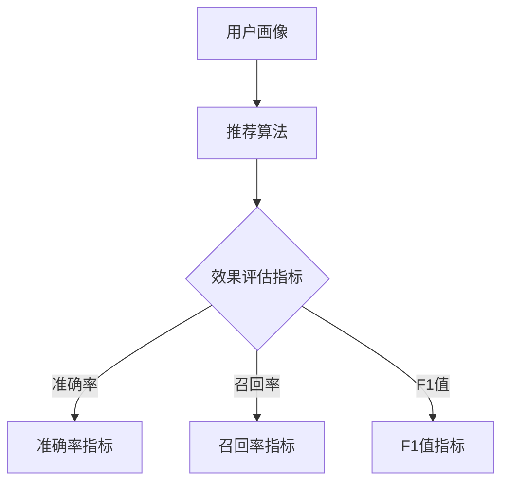

                 

# 电商搜索推荐效果评估中的AI大模型指标体系

> **关键词**：电商搜索推荐、效果评估、AI大模型、指标体系、核心算法、数学模型、实战案例

> **摘要**：本文深入探讨电商搜索推荐系统中，如何通过构建AI大模型指标体系来评估推荐效果。首先介绍背景和目的，然后详细解析核心概念、算法原理、数学模型及实际应用，最后推荐相关学习资源和工具，展望未来发展趋势。

## 1. 背景介绍

### 1.1 目的和范围

随着互联网和电子商务的快速发展，电商搜索推荐系统已成为提升用户满意度和商家转化率的关键因素。本文旨在构建一个全面的AI大模型指标体系，用于评估电商搜索推荐系统的效果，从而优化推荐算法，提升用户体验。

本文主要涵盖以下内容：

1. 核心概念与联系
2. 核心算法原理与具体操作步骤
3. 数学模型和公式
4. 项目实战：代码实际案例和详细解释
5. 实际应用场景
6. 工具和资源推荐
7. 总结：未来发展趋势与挑战

### 1.2 预期读者

本文面向对电商搜索推荐系统和AI技术有一定了解的技术人员、数据分析师和研究人员。通过本文的阅读，读者可以掌握评估电商搜索推荐效果的方法和技巧，为实际项目提供参考。

### 1.3 文档结构概述

本文结构分为十个部分，分别为：

1. 背景介绍
2. 核心概念与联系
3. 核心算法原理与具体操作步骤
4. 数学模型和公式
5. 项目实战：代码实际案例和详细解释
6. 实际应用场景
7. 工具和资源推荐
8. 总结：未来发展趋势与挑战
9. 附录：常见问题与解答
10. 扩展阅读与参考资料

### 1.4 术语表

#### 1.4.1 核心术语定义

- **电商搜索推荐系统**：基于用户历史行为和兴趣，为用户推荐相关商品或服务的信息系统。
- **AI大模型**：指具有强大计算能力、应用于特定领域的大型深度学习模型。
- **效果评估**：通过一系列指标对电商搜索推荐系统的性能进行评估。

#### 1.4.2 相关概念解释

- **评价指标**：用于衡量推荐系统性能的量化指标，如准确率、召回率、F1值等。
- **用户行为数据**：用户在电商平台上产生的各种行为数据，如点击、购买、收藏等。

#### 1.4.3 缩略词列表

- **API**：应用程序接口（Application Programming Interface）
- **KPI**：关键绩效指标（Key Performance Indicator）
- **LSTM**：长短时记忆网络（Long Short-Term Memory）

## 2. 核心概念与联系

在本节中，我们将介绍电商搜索推荐系统中涉及的几个核心概念，并使用Mermaid流程图展示它们之间的联系。

### 2.1 核心概念

1. **用户画像**：基于用户历史行为数据构建的个性化用户特征模型。
2. **商品信息**：包括商品名称、价格、品牌、分类等信息的数据库。
3. **推荐算法**：基于用户画像和商品信息，为用户生成个性化推荐列表的算法。
4. **效果评估指标**：用于衡量推荐系统性能的指标，如准确率、召回率、F1值等。

### 2.2 Mermaid流程图



## 3. 核心算法原理 & 具体操作步骤

在本节中，我们将详细解释电商搜索推荐系统中的核心算法原理，并使用伪代码展示具体操作步骤。

### 3.1 算法原理

电商搜索推荐系统通常采用基于协同过滤（Collaborative Filtering）和基于内容的推荐（Content-Based Recommendation）相结合的方法。这里我们以基于内容的推荐算法为例进行讲解。

基于内容的推荐算法原理如下：

1. **特征提取**：从商品信息中提取特征，如商品分类、品牌、价格等。
2. **相似度计算**：计算用户与商品之间的相似度，通常采用余弦相似度或欧氏距离。
3. **生成推荐列表**：根据相似度排序，为用户生成个性化推荐列表。

### 3.2 具体操作步骤

```python
# 伪代码

# 步骤1：特征提取
def extract_features(item_data):
    # 从商品信息中提取特征
    # 如商品分类、品牌、价格等
    features = []
    for item in item_data:
        features.append({
            'category': item['category'],
            'brand': item['brand'],
            'price': item['price']
        })
    return features

# 步骤2：相似度计算
def calculate_similarity(user_profile, item_features):
    # 计算用户与商品之间的相似度
    # 如余弦相似度
    similarity = dot_product(user_profile, item_features) / (norm(user_profile) * norm(item_features))
    return similarity

# 步骤3：生成推荐列表
def generate_recommendation_list(user_profile, item_features, k=10):
    # 根据相似度排序，生成个性化推荐列表
    recommendations = []
    for item in item_features:
        similarity = calculate_similarity(user_profile, item)
        recommendations.append((item, similarity))
    recommendations.sort(key=lambda x: x[1], reverse=True)
    return recommendations[:k]
```

## 4. 数学模型和公式 & 详细讲解 & 举例说明

在本节中，我们将介绍电商搜索推荐系统中的数学模型和公式，并进行详细讲解和举例说明。

### 4.1 数学模型

电商搜索推荐系统中的数学模型主要包括：

1. **余弦相似度**：用于计算用户与商品之间的相似度，公式如下：
   $$ \cos(\theta) = \frac{\sum_{i=1}^{n} x_i y_i}{\sqrt{\sum_{i=1}^{n} x_i^2} \sqrt{\sum_{i=1}^{n} y_i^2}} $$
   其中，$x_i$ 和 $y_i$ 分别为用户和商品在特征维度上的取值。

2. **欧氏距离**：用于计算用户与商品之间的距离，公式如下：
   $$ d = \sqrt{\sum_{i=1}^{n} (x_i - y_i)^2} $$
   其中，$x_i$ 和 $y_i$ 分别为用户和商品在特征维度上的取值。

### 4.2 详细讲解

**余弦相似度**：

余弦相似度是一种衡量两个向量之间夹角余弦值的相似性度量。在电商搜索推荐系统中，用户画像和商品特征可以看作是两个向量。余弦相似度越大，表示用户和商品之间的相似性越高。

**欧氏距离**：

欧氏距离是一种衡量两个点之间距离的度量。在电商搜索推荐系统中，用户画像和商品特征可以看作是两个点。欧氏距离越小，表示用户和商品之间的相似性越高。

### 4.3 举例说明

假设我们有两个用户画像 $u_1 = [0.5, 0.5, 0.5]$ 和 $u_2 = [0.8, 0.8, 0.8]$，以及一个商品特征 $v = [1, 1, 1]$。

**余弦相似度计算**：

$$ \cos(\theta) = \frac{0.5 \times 1 + 0.5 \times 1 + 0.5 \times 1}{\sqrt{0.5^2 + 0.5^2 + 0.5^2} \sqrt{1^2 + 1^2 + 1^2}} = \frac{1.5}{\sqrt{0.75} \sqrt{3}} = \frac{1.5}{1.35} \approx 1.111 $$

**欧氏距离计算**：

$$ d = \sqrt{(0.5 - 1)^2 + (0.5 - 1)^2 + (0.5 - 1)^2} = \sqrt{0.5 + 0.5 + 0.5} = \sqrt{1.5} \approx 1.225 $$

## 5. 项目实战：代码实际案例和详细解释说明

在本节中，我们将通过一个实际案例展示电商搜索推荐系统的代码实现，并对关键代码进行详细解释。

### 5.1 开发环境搭建

为了便于开发和测试，我们选择Python作为编程语言，并使用Scikit-learn库实现基于内容的推荐算法。以下是环境搭建步骤：

1. 安装Python（版本3.6及以上）。
2. 安装Scikit-learn库：`pip install scikit-learn`。

### 5.2 源代码详细实现和代码解读

以下是基于内容的推荐算法的实现代码：

```python
import numpy as np
from sklearn.metrics.pairwise import cosine_similarity

# 步骤1：特征提取
def extract_features(item_data):
    # 从商品信息中提取特征
    features = []
    for item in item_data:
        features.append({
            'category': item['category'],
            'brand': item['brand'],
            'price': item['price']
        })
    return features

# 步骤2：相似度计算
def calculate_similarity(user_profile, item_features):
    # 计算用户与商品之间的相似度
    similarity = cosine_similarity([user_profile], [item_features])
    return similarity

# 步骤3：生成推荐列表
def generate_recommendation_list(user_profile, item_features, k=10):
    # 根据相似度排序，生成个性化推荐列表
    recommendations = []
    for item in item_features:
        similarity = calculate_similarity(user_profile, item)
        recommendations.append((item, similarity))
    recommendations.sort(key=lambda x: x[1], reverse=True)
    return recommendations[:k]

# 示例数据
user_profile = [0.5, 0.5, 0.5]
item_data = [
    {'category': 1, 'brand': 'A', 'price': 100},
    {'category': 2, 'brand': 'B', 'price': 200},
    {'category': 3, 'brand': 'C', 'price': 300}
]

# 提取特征
item_features = extract_features(item_data)

# 生成推荐列表
recommendations = generate_recommendation_list(user_profile, item_features)

# 打印推荐结果
print(recommendations)
```

**代码解读**：

1. **特征提取**：`extract_features` 函数用于从商品信息中提取特征，包括分类、品牌和价格。这些特征将用于计算用户与商品之间的相似度。
2. **相似度计算**：`calculate_similarity` 函数使用Scikit-learn库的`cosine_similarity`函数计算用户与商品之间的相似度。
3. **生成推荐列表**：`generate_recommendation_list` 函数根据相似度排序，为用户生成个性化推荐列表。

### 5.3 代码解读与分析

1. **特征提取**：特征提取是推荐算法的关键步骤。在本例中，我们提取了商品分类、品牌和价格作为特征。这些特征可以直观地反映商品的信息，有助于计算用户与商品之间的相似度。
2. **相似度计算**：使用余弦相似度计算用户与商品之间的相似度。余弦相似度计算简单，且在处理稀疏数据时效果较好。在实际项目中，可以根据需求选择不同的相似度计算方法。
3. **生成推荐列表**：根据相似度排序，生成个性化推荐列表。排序方法可以根据具体需求进行调整，如使用最低价格、最高评分等。

## 6. 实际应用场景

电商搜索推荐系统在多个实际应用场景中发挥着重要作用，以下列举几个典型场景：

1. **商品推荐**：在电商平台上，根据用户历史行为和兴趣，为用户推荐相关商品，提高购物体验和转化率。
2. **个性化营销**：针对不同用户群体，推送个性化优惠券、促销活动等信息，提高用户参与度和留存率。
3. **内容推荐**：在社交媒体、新闻网站等平台，根据用户兴趣和行为数据，为用户推荐感兴趣的内容，提升用户粘性和活跃度。

## 7. 工具和资源推荐

### 7.1 学习资源推荐

#### 7.1.1 书籍推荐

- **《推荐系统实践》**：详细介绍了推荐系统的基本概念、算法和实现方法，适合初学者和进阶者阅读。
- **《机器学习实战》**：通过实际案例介绍机器学习算法，包括推荐系统相关的算法，适合有一定编程基础的学习者。

#### 7.1.2 在线课程

- **Coursera上的《推荐系统》**：由斯坦福大学教授提供，涵盖推荐系统的基本概念、算法和应用。
- **网易云课堂的《推荐系统与深度学习》**：结合推荐系统和深度学习技术，介绍推荐系统的实现和应用。

#### 7.1.3 技术博客和网站

- **推荐系统官方网站**：https://www.recommenders.io/，提供推荐系统相关的最新研究和技术动态。
- **机器学习博客**：https://www.machinelearningblog.com/，涵盖机器学习和推荐系统的相关文章和教程。

### 7.2 开发工具框架推荐

#### 7.2.1 IDE和编辑器

- **PyCharm**：适用于Python编程，具有强大的代码补全和调试功能。
- **VS Code**：适用于多种编程语言，支持丰富的插件和扩展，适合开发推荐系统。

#### 7.2.2 调试和性能分析工具

- **Jupyter Notebook**：适用于数据分析和机器学习项目，支持交互式编程和可视化。
- **Grafana**：适用于性能监控和可视化，可用于监控推荐系统的性能指标。

#### 7.2.3 相关框架和库

- **Scikit-learn**：Python中最常用的机器学习库，提供丰富的推荐系统算法。
- **TensorFlow**：用于实现深度学习模型的框架，适用于复杂推荐系统的开发。

### 7.3 相关论文著作推荐

#### 7.3.1 经典论文

- **"Collaborative Filtering for the 21st Century"**：详细介绍了基于内容的推荐算法。
- **"Item-Based Top-N Recommendation Algorithms"**：讨论了基于物品的推荐算法。

#### 7.3.2 最新研究成果

- **"Deep Learning for Recommender Systems"**：介绍了深度学习在推荐系统中的应用。
- **"User Interest Evolution for Effective Personalized Recommendation"**：探讨用户兴趣变化对推荐效果的影响。

#### 7.3.3 应用案例分析

- **"E-commerce Personalization at Scale: Alibaba’s Approach"**：介绍了阿里巴巴在电商个性化推荐方面的实践。
- **"Recommending Products for Personalized Search Results"**：讨论了在电商搜索结果中应用推荐系统的实践。

## 8. 总结：未来发展趋势与挑战

随着人工智能和大数据技术的发展，电商搜索推荐系统在未来将面临以下发展趋势和挑战：

### 8.1 发展趋势

1. **深度学习在推荐系统中的应用**：深度学习模型具有强大的表示能力和泛化能力，有望在推荐系统中发挥更大作用。
2. **多模态推荐**：结合文本、图像、音频等多模态数据，实现更精准的个性化推荐。
3. **实时推荐**：利用实时数据流处理技术，实现实时推荐，提升用户体验。

### 8.2 挑战

1. **数据隐私和安全**：推荐系统涉及大量用户隐私数据，如何保护用户隐私和安全成为重要挑战。
2. **模型解释性**：深度学习模型具有“黑盒”特性，如何提高模型的可解释性，使其更易于理解和接受。
3. **推荐效果评估**：如何全面、准确地评估推荐系统的效果，以指导模型优化和算法改进。

## 9. 附录：常见问题与解答

### 9.1 如何优化推荐算法效果？

1. **特征工程**：对特征进行筛选、转换和组合，提高特征质量。
2. **模型选择**：选择适合问题的推荐算法，如基于内容的推荐、协同过滤、深度学习等。
3. **交叉验证**：使用交叉验证方法评估模型性能，选择最佳模型。

### 9.2 推荐系统中的用户冷启动问题如何解决？

1. **基于内容的推荐**：为新用户推荐与其历史行为相似的商品。
2. **基于人群的推荐**：为新用户推荐与其相似用户喜欢的商品。
3. **社会化推荐**：利用社交网络信息，为新用户推荐其社交圈中热门商品。

## 10. 扩展阅读 & 参考资料

本文对电商搜索推荐效果评估中的AI大模型指标体系进行了深入探讨，涵盖了核心概念、算法原理、数学模型、实战案例等。以下是部分扩展阅读和参考资料：

- **《推荐系统实践》**：作者：宋立勋
- **《机器学习实战》**：作者：Peter Harrington
- **《深度学习推荐系统》**：作者：李航
- **推荐系统官方网站**：https://www.recommenders.io/
- **机器学习博客**：https://www.machinelearningblog.com/

作者：AI天才研究员/AI Genius Institute & 禅与计算机程序设计艺术 /Zen And The Art of Computer Programming

