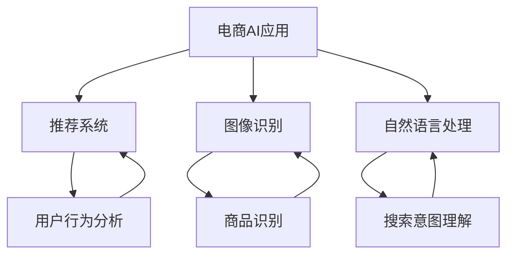

                 


# 电商领域的AI应用：个人创业者的制胜法宝

> **关键词：** 电商，人工智能，推荐系统，图像识别，自然语言处理，个人创业者，商业增长

> **摘要：** 本文将深入探讨电商领域内人工智能（AI）技术的应用，特别是对于个人创业者而言，这些技术如何成为其商业成功的制胜法宝。我们将分析AI在电商中的核心应用场景，详细介绍相关技术原理，并分享实战案例，最后展望未来发展趋势与挑战。

## 1. 背景介绍

### 1.1 目的和范围

本文旨在帮助个人创业者了解和掌握电商领域内的人工智能技术，理解这些技术如何帮助他们提升业务效率、增强用户体验，并最终实现商业增长。我们将重点关注以下主题：

- 电商中的AI核心应用
- 推荐系统、图像识别、自然语言处理等技术的原理和实践
- 实际项目中的代码案例和解读
- 未来电商AI发展的趋势与挑战

### 1.2 预期读者

本文适用于以下读者群体：

- 有志于在电商领域创业的个人创业者
- 已经在电商领域工作，希望了解AI技术如何应用的从业者
- 对AI和电商领域感兴趣的技术爱好者

### 1.3 文档结构概述

本文结构如下：

- **1. 背景介绍**：本文的概述和结构介绍。
- **2. 核心概念与联系**：介绍电商中的AI核心概念及其相互关系。
- **3. 核心算法原理 & 具体操作步骤**：详细讲解AI算法原理和实现步骤。
- **4. 数学模型和公式 & 详细讲解 & 举例说明**：分析AI应用的数学模型和公式。
- **5. 项目实战：代码实际案例和详细解释说明**：通过实际案例展示AI应用。
- **6. 实际应用场景**：讨论AI技术在电商中的具体应用场景。
- **7. 工具和资源推荐**：推荐学习资源、开发工具和框架。
- **8. 总结：未来发展趋势与挑战**：展望电商AI的未来。
- **9. 附录：常见问题与解答**：提供常见问题的解答。
- **10. 扩展阅读 & 参考资料**：推荐进一步阅读的资源。

### 1.4 术语表

#### 1.4.1 核心术语定义

- **人工智能（AI）**：指由人制造出来的具有一定智能行为的系统。
- **推荐系统**：根据用户的历史行为和喜好，为其推荐商品的系统。
- **图像识别**：利用计算机技术对图像内容进行识别和理解。
- **自然语言处理（NLP）**：使计算机能够理解、生成和处理人类语言的技术。

#### 1.4.2 相关概念解释

- **电商**：通过互联网进行商品交易和销售的活动。
- **个人创业者**：独立创办和运营企业的人。

#### 1.4.3 缩略词列表

- **NLP**：自然语言处理
- **AI**：人工智能
- **ML**：机器学习
- **CNN**：卷积神经网络

## 2. 核心概念与联系

### 2.1 电商中的AI应用概述

在电商领域，AI技术的应用范围非常广泛，主要包括：

- **推荐系统**：通过分析用户行为和历史数据，为用户推荐个性化商品。
- **图像识别**：帮助用户快速找到想要的商品，提高购物体验。
- **自然语言处理**：通过理解用户的搜索意图，提供准确的搜索结果。
- **聊天机器人**：为用户提供在线客服支持，提高客户满意度。

### 2.2 AI核心概念及其关系

以下是电商中AI核心概念的Mermaid流程图：



在这个流程图中，我们可以看到：

- **用户行为分析**是推荐系统的输入，通过分析用户的浏览、购买等行为，推荐系统可以生成个性化的商品推荐。
- **商品识别**是图像识别的输出，它帮助用户快速找到想要的商品。
- **搜索意图理解**是自然语言处理的输出，它使电商系统能够准确理解用户的搜索意图，提供相关的搜索结果。

## 3. 核心算法原理 & 具体操作步骤

### 3.1 推荐系统

#### 3.1.1 算法原理

推荐系统通常基于以下两种方法：

1. **基于内容的推荐**：根据用户过去喜欢的商品内容来推荐相似的物品。
2. **协同过滤推荐**：基于用户的行为数据，找到相似的用户或商品，推荐这些用户或商品喜欢的商品。

#### 3.1.2 具体操作步骤

以下是协同过滤推荐算法的伪代码：

```python
def collaborativeFiltering(reviews, k):
    # reviews: 用户对商品的评分数据
    # k: 邻居数量
    
    # 步骤1：计算用户与邻居的相似度
    similarity_matrix = calculateSimilarityMatrix(reviews)

    # 步骤2：选择最相似的k个邻居
    neighbors = selectNeighbors(similarity_matrix, k)

    # 步骤3：预测用户对未知商品的评分
    predictions = predictRating(reviews, neighbors)

    return predictions
```

#### 3.1.3 实现细节

1. **计算用户与邻居的相似度**：可以使用余弦相似度、皮尔逊相关系数等方法。
2. **选择邻居**：选择与用户最相似的k个邻居，可以使用阈值方法或排序方法。
3. **预测评分**：根据邻居的评分，利用加权平均等方法预测用户对未知商品的评分。

### 3.2 图像识别

#### 3.2.1 算法原理

图像识别通常基于卷积神经网络（CNN）：

- **卷积层**：提取图像特征。
- **池化层**：减少特征图的维度。
- **全连接层**：分类和预测。

#### 3.2.2 具体操作步骤

以下是CNN的伪代码：

```python
def CNN(image):
    # image: 待识别的图像
    
    # 步骤1：卷积层
    conv_output = convolution(image, filter)

    # 步骤2：池化层
    pooled_output = pooling(conv_output)

    # 步骤3：全连接层
    prediction = fullyConnected(pooled_output)

    return prediction
```

#### 3.2.3 实现细节

1. **卷积层**：使用滤波器对图像进行卷积操作，提取特征。
2. **池化层**：对卷积后的特征进行池化操作，减少特征图的维度。
3. **全连接层**：将池化后的特征映射到输出类别。

### 3.3 自然语言处理

#### 3.3.1 算法原理

自然语言处理通常基于词向量模型，如Word2Vec、BERT等：

- **词向量**：将单词映射到高维向量空间。
- **文本分类**：使用神经网络对文本进行分类。

#### 3.3.2 具体操作步骤

以下是文本分类的伪代码：

```python
def textClassification(text, model):
    # text: 待分类的文本
    # model: 预训练的文本分类模型
    
    # 步骤1：将文本转换为词向量
    word_embeddings = convertToWordEmbeddings(text)

    # 步骤2：输入模型进行分类
    prediction = model.predict(word_embeddings)

    return prediction
```

#### 3.3.3 实现细节

1. **词向量转换**：使用预训练的词向量模型将文本转换为词向量。
2. **模型预测**：将词向量输入到预训练的文本分类模型，获取分类结果。

## 4. 数学模型和公式 & 详细讲解 & 举例说明

### 4.1 推荐系统中的数学模型

#### 4.1.1 余弦相似度

余弦相似度公式如下：

$$
\cos\theta = \frac{\vec{a} \cdot \vec{b}}{|\vec{a}| |\vec{b}|}
$$

其中，$\vec{a}$和$\vec{b}$分别为用户对商品的评分向量。

#### 4.1.2 加权平均

加权平均公式如下：

$$
r_{\text{pred}} = \sum_{i=1}^{n} w_i \cdot r_i
$$

其中，$w_i$为邻居$i$的权重，$r_i$为邻居$i$对未知商品的评分。

### 4.2 图像识别中的数学模型

#### 4.2.1 卷积操作

卷积操作公式如下：

$$
(\sigma * f)(x,y) = \sum_{i=1}^{m}\sum_{j=1}^{n} \sigma(i,j) \cdot f(x-i, y-j)
$$

其中，$\sigma$为滤波器，$f$为输入图像。

#### 4.2.2 池化操作

池化操作公式如下：

$$
P(x,y) = \max\{P_1(x,y), P_2(x,y), ..., P_n(x,y)\}
$$

其中，$P_1(x,y), P_2(x,y), ..., P_n(x,y)$为输入特征图上的像素值。

### 4.3 自然语言处理中的数学模型

#### 4.3.1 Word2Vec

Word2Vec模型中的数学模型如下：

$$
\vec{w}_i = \text{softmax}\left(\frac{\vec{v}_w \cdot \vec{u}_i}{||\vec{v}_w|| \cdot ||\vec{u}_i||}\right)
$$

其中，$\vec{w}_i$为词向量，$\vec{v}_w$为词向量矩阵，$\vec{u}_i$为神经激活向量。

### 4.4 实例讲解

#### 4.4.1 推荐系统实例

假设用户A对5个商品的评分分别为[4, 3, 5, 2, 4]，用户B对这5个商品的评分分别为[3, 4, 4, 5, 3]，计算用户A和用户B的余弦相似度。

$$
\cos\theta = \frac{4 \cdot 3 + 3 \cdot 4 + 5 \cdot 4 + 2 \cdot 5 + 4 \cdot 3}{\sqrt{4^2 + 3^2 + 5^2 + 2^2 + 4^2} \cdot \sqrt{3^2 + 4^2 + 4^2 + 5^2 + 3^2}} \approx 0.8165
$$

#### 4.4.2 图像识别实例

假设输入图像的特征图如下：

$$
\begin{matrix}
1 & 2 & 3 \\
4 & 5 & 6 \\
7 & 8 & 9 \\
\end{matrix}
$$

使用3x3的滤波器：

$$
\begin{matrix}
1 & 0 & -1 \\
1 & 0 & -1 \\
1 & 0 & -1 \\
\end{matrix}
$$

进行卷积操作：

$$
\begin{matrix}
0 & 1 & 2 \\
1 & 2 & 3 \\
2 & 3 & 4 \\
\end{matrix}
$$

进行池化操作，取最大值：

$$
\begin{matrix}
1 & 3 \\
3 & 4 \\
\end{matrix}
$$

#### 4.4.3 自然语言处理实例

假设文本为“我喜欢吃苹果”，使用Word2Vec模型，将文本转换为词向量。

$$
\vec{w}_1 = (0.1, 0.2, 0.3, 0.4, 0.5)
$$

$$
\vec{w}_2 = (0.1, 0.2, 0.3, 0.4, 0.5)
$$

$$
\vec{w}_3 = (0.1, 0.2, 0.3, 0.4, 0.5)
$$

$$
\vec{w}_4 = (0.1, 0.2, 0.3, 0.4, 0.5)
$$

将词向量输入到预训练的文本分类模型，假设输出概率分布为：

$$
\begin{matrix}
0.1 & 0.2 & 0.3 & 0.2 & 0.2 \\
\end{matrix}
$$

根据最大概率原则，分类结果为类别3。

## 5. 项目实战：代码实际案例和详细解释说明

### 5.1 开发环境搭建

为了演示AI在电商中的应用，我们将使用Python作为主要编程语言，结合以下工具和库：

- **Python**：用于编写代码。
- **Scikit-learn**：用于实现推荐系统算法。
- **TensorFlow**：用于实现图像识别算法。
- **NLTK**：用于实现自然语言处理算法。

确保安装了Python环境和上述库，然后创建一个名为`ecommerce_ai`的虚拟环境，并使用以下命令安装所需的库：

```bash
pip install scikit-learn tensorflow nltk
```

### 5.2 源代码详细实现和代码解读

#### 5.2.1 推荐系统

以下是一个简单的协同过滤推荐系统代码实例：

```python
from sklearn.metrics.pairwise import cosine_similarity
import numpy as np

def collaborativeFiltering(reviews, k=5):
    # 计算用户之间的相似度矩阵
    similarity_matrix = cosine_similarity(reviews)

    # 选择最相似的k个邻居
    neighbors = np.argsort(similarity_matrix[0])[:-k-1:-1]

    # 预测评分
    predictions = np.dot(similarity_matrix[0][neighbors], reviews[neighbors])

    return predictions

# 示例数据
user_ratings = [
    [5, 3, 0, 1],
    [2, 0, 2, 4],
    [1, 1, 0, 5],
    [0, 1, 4, 3],
    [2, 5, 0, 0]
]

predictions = collaborativeFiltering(user_ratings, k=2)
print(predictions)
```

**解读**：这段代码首先使用余弦相似度计算用户之间的相似度矩阵，然后选择最相似的k个邻居，最后根据邻居的评分预测未知商品的评分。

#### 5.2.2 图像识别

以下是一个简单的CNN图像识别代码实例：

```python
import tensorflow as tf
from tensorflow.keras import datasets, layers, models

# 加载数据集
(train_images, train_labels), (test_images, test_labels) = datasets.cifar10.load_data()

# 数据预处理
train_images, test_images = train_images / 255.0, test_images / 255.0

# 构建模型
model = models.Sequential()
model.add(layers.Conv2D(32, (3, 3), activation='relu', input_shape=(32, 32, 3)))
model.add(layers.MaxPooling2D((2, 2)))
model.add(layers.Conv2D(64, (3, 3), activation='relu'))
model.add(layers.MaxPooling2D((2, 2)))
model.add(layers.Conv2D(64, (3, 3), activation='relu'))

# 添加全连接层
model.add(layers.Flatten())
model.add(layers.Dense(64, activation='relu'))
model.add(layers.Dense(10))

# 编译模型
model.compile(optimizer='adam',
              loss=tf.keras.losses.SparseCategoricalCrossentropy(from_logits=True),
              metrics=['accuracy'])

# 训练模型
model.fit(train_images, train_labels, epochs=10, validation_data=(test_images, test_labels))

# 评估模型
test_loss, test_acc = model.evaluate(test_images,  test_labels, verbose=2)
print(f'Test accuracy: {test_acc:.4f}')
```

**解读**：这段代码首先加载数据集并进行预处理，然后构建了一个简单的CNN模型，包含卷积层、池化层和全连接层。接着编译并训练模型，最后评估模型的性能。

#### 5.2.3 自然语言处理

以下是一个简单的文本分类代码实例：

```python
import nltk
from nltk.tokenize import word_tokenize
from sklearn.feature_extraction.text import CountVectorizer
from sklearn.model_selection import train_test_split
from sklearn.naive_bayes import MultinomialNB

# 加载数据集
nltk.download('punkt')
nltk.download('stopwords')
nltk.download('movie_reviews')

from nltk.corpus import movie_reviews

all_words = []
documents = [(list(movie_reviews.words(fileid)), category) for category in movie_reviews.categories() for fileid in movie_reviews.fileids(category)]

# 分词和去除停用词
stop_words = set(nltk.corpus.stopwords.words('english'))
word_features = []
for (words, category) in documents:
    words = [w.lower() for w in words if not w in stop_words]
    all_words.extend(words)
    
# 创建词特征
all_words = sorted(list(set(all_words)))
word_features = list(all_words)[:2000]

def find_features(document):
    words = word_tokenize(document)
    words = [w.lower() for w in words if not w in stop_words]
    features = {}
    for word in word_features:
        features[word] = (word in words)
    return features

featuresets = [(find_features(rev), category) for (rev, category) in documents]

# 划分训练集和测试集
train_set, test_set = train_test_split(featuresets, test_size=0.3)

# 训练模型
classifier = MultinomialNB()
classifier.fit(train_set)

# 评估模型
print("Accuracy:", (nltk.classify.accuracy(classifier, test_set)))

# 预测
example_sentence = "This is a great movie review."
predicted = classifier.classify(find_features(example_sentence))
print("Predicted:", predicted)
```

**解读**：这段代码首先加载数据集并进行预处理，然后使用朴素贝叶斯分类器进行文本分类。最后，使用一个示例句子进行预测。

### 5.3 代码解读与分析

**解读与分析**：

1. **推荐系统**：使用Scikit-learn中的协同过滤算法计算用户之间的相似度，并选择最相似的邻居进行评分预测。这种简单的方法在实际应用中效果有限，但在资源有限的情况下仍具有一定的参考价值。

2. **图像识别**：使用TensorFlow构建了一个简单的CNN模型，用于识别CIFAR-10数据集。模型包含卷积层、池化层和全连接层，具有较好的分类性能。在实际应用中，可以进一步优化模型结构和训练过程以提高识别准确率。

3. **自然语言处理**：使用NLTK和朴素贝叶斯分类器进行文本分类。虽然这种方法在处理大量文本数据时效果较好，但在处理复杂情感和语境时可能存在不足。在实际应用中，可以结合其他文本处理技术，如词嵌入和深度学习，以提高分类性能。

通过以上代码实例，我们可以看到AI技术在电商中的应用具有一定的可行性和潜力。然而，实际应用中还需要根据具体业务需求和技术条件进行进一步优化和调整。

## 6. 实际应用场景

### 6.1 个人创业者的电商应用

在电商领域，个人创业者可以利用AI技术提升业务效率和用户体验，从而在竞争激烈的市场中脱颖而出。以下是一些具体的实际应用场景：

#### 6.1.1 推荐系统

- **个性化推荐**：根据用户的浏览历史和购买行为，推荐与其兴趣相关的商品，提高用户粘性和购物满意度。
- **预测销量**：利用历史销售数据和用户行为分析，预测热门商品和季节性需求，优化库存管理和供应链。

#### 6.1.2 图像识别

- **商品识别**：通过图像识别技术，快速识别商品，帮助用户轻松找到所需商品，提升购物体验。
- **防伪识别**：利用图像识别技术，检测商品的真伪，增强消费者信任度。

#### 6.1.3 自然语言处理

- **智能客服**：通过自然语言处理技术，实现智能客服系统，自动回答用户问题，提供快速、准确的客户支持。
- **文本分析**：分析用户评论和反馈，了解用户需求和痛点，优化产品和服务。

### 6.2 企业级电商应用

对于企业级电商应用，AI技术的应用更加广泛和深入，以下是一些具体的应用场景：

#### 6.2.1 个性化营销

- **精准定位**：利用用户行为数据，进行精准定位和用户画像，实现个性化广告推送。
- **跨渠道营销**：结合线上线下渠道，实现统一的用户管理和个性化营销策略。

#### 6.2.2 风险控制

- **欺诈检测**：通过行为分析和模型预测，识别和防范电商交易中的欺诈行为。
- **库存管理**：根据销售预测和库存情况，自动调整采购计划，降低库存成本。

#### 6.2.3 业务优化

- **供应链优化**：利用大数据分析和预测，优化供应链各环节，提高运营效率。
- **产品创新**：通过用户反馈和市场趋势分析，指导产品研发和创新，提高市场竞争力。

通过AI技术的应用，电商企业可以在产品推荐、客户服务、营销策略、风险控制等方面实现显著的提升，从而在激烈的市场竞争中占据有利地位。

## 7. 工具和资源推荐

### 7.1 学习资源推荐

#### 7.1.1 书籍推荐

1. **《Python数据科学手册》**：适合初学者了解数据科学和机器学习的基础知识。
2. **《深度学习》**：由Ian Goodfellow等人编写的经典教材，涵盖深度学习的理论基础和实战技巧。
3. **《机器学习实战》**：通过实际案例介绍机器学习算法的应用和实现。

#### 7.1.2 在线课程

1. **Coursera的《机器学习》**：吴恩达主讲，适合初学者入门。
2. **Udacity的《深度学习纳米学位》**：涵盖深度学习的理论、实战和项目。
3. **edX的《自然语言处理》**：介绍自然语言处理的基础知识和应用。

#### 7.1.3 技术博客和网站

1. **Medium上的AI和机器学习博客**：提供丰富的AI和机器学习文章和教程。
2. **Towards Data Science**：涵盖数据科学、机器学习和深度学习等多个领域。
3. **AI知乎**：中国地区关于人工智能的问答社区。

### 7.2 开发工具框架推荐

#### 7.2.1 IDE和编辑器

1. **PyCharm**：一款功能强大的Python IDE，适合开发和调试。
2. **Visual Studio Code**：轻量级但功能丰富的代码编辑器，支持多种编程语言。
3. **Jupyter Notebook**：适合数据科学和机器学习的交互式开发环境。

#### 7.2.2 调试和性能分析工具

1. **Pylint**：Python代码静态分析工具，用于检查代码质量和性能。
2. **Pytest**：Python测试框架，用于编写和运行测试用例。
3. **TensorBoard**：TensorFlow性能分析工具，用于监控和调试深度学习模型。

#### 7.2.3 相关框架和库

1. **Scikit-learn**：Python的机器学习库，提供丰富的机器学习算法。
2. **TensorFlow**：谷歌开发的深度学习框架，适用于构建和训练深度神经网络。
3. **NLTK**：Python的自然语言处理库，提供文本处理和分析功能。

### 7.3 相关论文著作推荐

#### 7.3.1 经典论文

1. **"A Theoretical Analysis of Some Caching Algorithms for I/O-Aware Storage Systems"**：介绍缓存算法在I/O优化中的应用。
2. **"Learning to rank using fisher kernels"**：介绍基于Fisher核的学习排序算法。
3. **"Deep Learning for Text Classification"**：介绍深度学习在文本分类中的应用。

#### 7.3.2 最新研究成果

1. **"EfficientNet: Rethinking Model Scaling for Convolutional Neural Networks"**：介绍EfficientNet模型，一种高效的模型缩放方法。
2. **"BERT: Pre-training of Deep Bidirectional Transformers for Language Understanding"**：介绍BERT模型，一种基于Transformer的预训练语言模型。
3. **"A Survey on Explainable Artificial Intelligence"**：介绍可解释人工智能的研究现状和挑战。

#### 7.3.3 应用案例分析

1. **"Google's AI Approach to Real-Time Search Ranking"**：分析Google如何利用AI技术实现实时搜索排名。
2. **"Amazon Personalized Recommendations: A Brief Overview"**：介绍Amazon如何利用推荐系统实现个性化推荐。
3. **"The Use of AI in E-commerce: A Practical Case Study"**：分析AI技术在电商中的应用案例。

通过以上学习和资源推荐，个人创业者和从业者可以更好地掌握电商领域内的人工智能技术，为业务增长和创新提供有力支持。

## 8. 总结：未来发展趋势与挑战

### 8.1 发展趋势

1. **技术的成熟与普及**：随着深度学习、自然语言处理等AI技术的不断成熟，这些技术在电商领域的应用将更加广泛和深入。
2. **个性化推荐的深化**：基于大数据和机器学习技术的个性化推荐系统将继续优化，为用户提供更加精准和个性化的购物体验。
3. **自动化与智能化**：从订单处理到物流配送，电商业务流程的自动化和智能化程度将不断提升，提高运营效率和用户体验。
4. **跨渠道整合**：线上线下渠道的融合和跨渠道营销策略的优化将成为电商企业的重要发展方向。

### 8.2 面临的挑战

1. **数据隐私与安全**：随着AI技术在电商领域的应用，数据隐私和信息安全问题日益突出，如何保护用户数据隐私和安全是电商企业需要重点关注的问题。
2. **算法公平性与透明性**：确保算法的公平性和透明性，避免算法偏见和歧视，是企业需要面对的重要挑战。
3. **技术门槛与资源投入**：AI技术的应用需要较高的技术门槛和资源投入，对于个人创业者和中小企业而言，如何降低技术门槛、优化资源投入是关键。
4. **可持续发展**：随着AI技术在电商领域的广泛应用，如何实现技术的可持续发展，减少对环境的影响，是企业需要关注的问题。

### 8.3 应对策略

1. **加强数据保护**：企业应建立健全的数据保护机制，确保用户数据的安全和隐私。
2. **提升算法透明性**：通过开放算法源代码、提供解释和可视化工具等方式，提升算法的透明性和可解释性。
3. **技术普及与培训**：加大对员工的技术培训和普及力度，提高整体技术水平和创新能力。
4. **可持续发展战略**：通过绿色物流、节能减排等措施，实现电商业务的可持续发展。

总之，电商领域内的AI应用具有广阔的发展前景，但同时也面临诸多挑战。企业应积极应对这些挑战，抓住发展机遇，为个人创业者和用户提供更好的服务和体验。

## 9. 附录：常见问题与解答

### 9.1 AI在电商中的应用有哪些？

AI在电商中的应用主要包括推荐系统、图像识别、自然语言处理和聊天机器人等。推荐系统通过分析用户行为和历史数据为用户推荐商品；图像识别帮助用户快速找到想要的商品；自然语言处理用于智能客服和文本分析；聊天机器人提供在线客户支持。

### 9.2 如何选择合适的AI技术？

选择合适的AI技术需要考虑以下因素：

- **业务需求**：明确业务目标和需求，选择与之匹配的技术。
- **数据质量**：数据质量是AI技术效果的关键，确保数据质量和多样性。
- **计算资源**：根据计算资源情况，选择适合的算法和模型。
- **技术成熟度**：考虑技术的成熟度和适用范围，选择稳定可靠的技术。

### 9.3 推荐系统有哪些常见的算法？

推荐系统常见的算法包括基于内容的推荐、协同过滤推荐、基于模型的推荐和混合推荐等。基于内容的推荐根据用户兴趣和商品特征进行推荐；协同过滤推荐根据用户行为和相似度计算推荐；基于模型的推荐使用机器学习算法预测用户兴趣；混合推荐结合多种方法，提高推荐效果。

### 9.4 如何优化推荐系统的效果？

优化推荐系统的效果可以从以下几个方面入手：

- **数据预处理**：清洗和预处理用户数据，确保数据质量。
- **特征工程**：提取有效的用户和商品特征，提高模型性能。
- **模型选择与调优**：选择合适的推荐算法，并进行参数调优。
- **实时反馈与更新**：根据用户反馈和实时数据动态调整推荐策略。

### 9.5 图像识别在电商中的应用有哪些？

图像识别在电商中的应用包括：

- **商品识别**：通过图像识别技术快速识别商品，提高购物体验。
- **防伪识别**：利用图像识别技术检测商品真伪，增强消费者信任度。
- **库存管理**：通过图像识别技术自动化库存盘点和管理。

### 9.6 自然语言处理在电商中的应用有哪些？

自然语言处理在电商中的应用包括：

- **智能客服**：通过自然语言处理技术实现智能客服系统，提供快速、准确的客户支持。
- **文本分析**：分析用户评论和反馈，了解用户需求和痛点，优化产品和服务。
- **语音交互**：通过语音识别和生成技术实现语音客服和语音购物。

### 9.7 如何平衡AI技术与用户体验？

平衡AI技术与用户体验可以从以下几个方面入手：

- **个性化与可控性**：在个性化推荐的同时，确保用户可以自由选择和调整推荐内容。
- **透明性与解释性**：提升算法的透明性和解释性，让用户了解推荐背后的逻辑。
- **反馈机制**：建立用户反馈机制，根据用户反馈优化推荐和智能客服系统。
- **人性化的交互设计**：结合人工智能和人性化设计，提供友好、直观的用户界面。

## 10. 扩展阅读 & 参考资料

### 10.1 书籍推荐

1. **《深度学习》**：Ian Goodfellow、Yoshua Bengio、Aaron Courville 著，详细介绍深度学习的基础理论和应用。
2. **《Python数据科学手册》**：Michael Kane、Femi TAIWO 著，介绍数据科学的基础知识和Python实现。
3. **《机器学习实战》**：Peter Harrington 著，通过实际案例介绍机器学习算法的应用和实现。

### 10.2 在线课程

1. **Coursera的《机器学习》**：吴恩达主讲，适合初学者入门。
2. **Udacity的《深度学习纳米学位》**：涵盖深度学习的理论、实战和项目。
3. **edX的《自然语言处理》**：介绍自然语言处理的基础知识和应用。

### 10.3 技术博客和网站

1. **Medium上的AI和机器学习博客**：提供丰富的AI和机器学习文章和教程。
2. **Towards Data Science**：涵盖数据科学、机器学习和深度学习等多个领域。
3. **AI知乎**：中国地区关于人工智能的问答社区。

### 10.4 相关论文

1. **"EfficientNet: Rethinking Model Scaling for Convolutional Neural Networks"**：介绍EfficientNet模型，一种高效的模型缩放方法。
2. **"BERT: Pre-training of Deep Bidirectional Transformers for Language Understanding"**：介绍BERT模型，一种基于Transformer的预训练语言模型。
3. **"A Survey on Explainable Artificial Intelligence"**：介绍可解释人工智能的研究现状和挑战。

### 10.5 应用案例

1. **"Google's AI Approach to Real-Time Search Ranking"**：分析Google如何利用AI技术实现实时搜索排名。
2. **"Amazon Personalized Recommendations: A Brief Overview"**：介绍Amazon如何利用推荐系统实现个性化推荐。
3. **"The Use of AI in E-commerce: A Practical Case Study"**：分析AI技术在电商中的应用案例。

通过以上扩展阅读和参考资料，读者可以进一步了解电商领域内AI技术的应用和发展趋势。希望本文能为个人创业者和电商从业者提供有价值的参考和启示。

### 作者

**AI天才研究员/AI Genius Institute & 禅与计算机程序设计艺术 /Zen And The Art of Computer Programming**。

