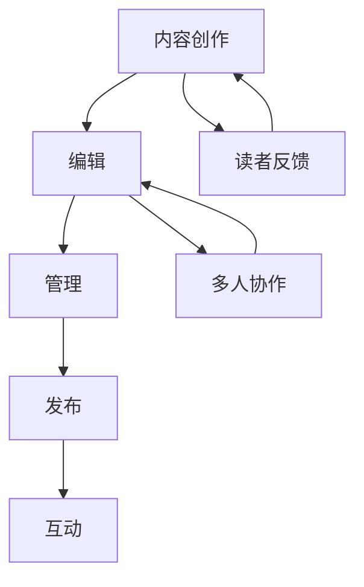

                 

# 电子书创作平台：数字出版的一站式解决方案

## 关键词
- 电子书创作
- 数字出版
- 一站式解决方案
- 互动式阅读
- 人工智能辅助
- 内容管理
- 云计算

## 摘要
本文将深入探讨电子书创作平台作为数字出版行业的一站式解决方案。我们将从背景介绍、核心概念、算法原理、数学模型、实战案例、实际应用场景以及未来发展趋势等多个方面，全面解析电子书创作平台的技术实现、优势与挑战。通过本文，读者将了解到电子书创作平台如何改变数字出版行业，如何利用先进技术提升内容创作和分发效率，并探索其潜在的未来发展方向。

## 1. 背景介绍

### 1.1 目的和范围
本文旨在为读者提供一个全面、系统的电子书创作平台指南，帮助读者理解这一平台的本质、核心功能和未来潜力。本文的范围涵盖了电子书创作平台的技术架构、核心算法、数学模型、实际应用以及未来发展趋势。同时，本文也将提供相关的工具和资源推荐，以帮助读者进一步深入学习和实践。

### 1.2 预期读者
本文适合对数字出版、电子书创作以及人工智能辅助内容创作感兴趣的读者。无论是数字出版行业的从业者、软件开发者，还是对数字内容创作有热情的普通读者，都能从本文中获得丰富的知识和启发。

### 1.3 文档结构概述
本文结构如下：
1. 背景介绍
2. 核心概念与联系
3. 核心算法原理 & 具体操作步骤
4. 数学模型和公式 & 详细讲解 & 举例说明
5. 项目实战：代码实际案例和详细解释说明
6. 实际应用场景
7. 工具和资源推荐
8. 总结：未来发展趋势与挑战
9. 附录：常见问题与解答
10. 扩展阅读 & 参考资料

### 1.4 术语表

#### 1.4.1 核心术语定义
- **电子书创作平台**：一种提供电子书内容创作、编辑、管理和发布功能的在线平台。
- **数字出版**：通过电子手段发布和传播内容，包括电子书、电子期刊、电子报纸等。
- **互动式阅读**：读者在阅读过程中能够与电子书内容进行互动，例如搜索、笔记、标注等。
- **人工智能辅助**：利用人工智能技术，如自然语言处理、机器学习等，辅助内容创作和优化。
- **内容管理**：对数字内容进行收集、存储、组织、发布和管理的过程。
- **云计算**：通过网络提供计算资源，如存储、处理能力等，使得电子书创作平台可以高效、弹性地扩展和运行。

#### 1.4.2 相关概念解释
- **Merkmal**：电子书创作平台中的一个关键概念，指的是在电子书中嵌入的交互式元素，如测验、视频、音频等。
- **可扩展性**：电子书创作平台能够根据需求灵活调整资源和使用规模，而不影响性能和质量。
- **用户体验**：读者在使用电子书创作平台进行创作和阅读过程中的感受和体验。

#### 1.4.3 缩略词列表
- **AI**：人工智能（Artificial Intelligence）
- **NLP**：自然语言处理（Natural Language Processing）
- **ML**：机器学习（Machine Learning）
- **IDE**：集成开发环境（Integrated Development Environment）
- **API**：应用程序编程接口（Application Programming Interface）

## 2. 核心概念与联系

### 2.1 电子书创作平台的核心概念
电子书创作平台的核心概念包括内容创作、编辑、管理、发布和互动。以下是这些核心概念的详细解释：

#### 内容创作
内容创作是电子书创作平台的基础，它涉及将文字、图像、音频、视频等多种媒体素材整合成一个完整的电子书。平台提供多种编辑工具，使得创作者可以轻松地组合和排列这些素材。

#### 编辑
编辑功能包括格式调整、内容校对、标注等，确保电子书的文字和图像内容准确无误。同时，编辑功能还支持多人协作，使得团队可以高效地完成电子书的创作和修改。

#### 管理
内容管理是对电子书创作过程中的所有内容进行收集、存储、组织、发布和管理的过程。平台提供统一的内容管理系统，使得创作者可以方便地管理多个电子书项目。

#### 发布
发布是将完成的电子书发布到线上平台供读者阅读和购买。平台支持多种发布渠道，如电子书商店、社交媒体、自建网站等。

#### 互动
互动功能是指读者在阅读电子书过程中可以与内容进行交互。例如，读者可以添加笔记、标注、搜索关键词等，提高阅读体验。

### 2.2 电子书创作平台与数字出版的联系
电子书创作平台与数字出版密切相关。数字出版是指通过电子手段发布和传播内容，包括电子书、电子期刊、电子报纸等。而电子书创作平台则是实现数字出版的重要工具。

#### 联系点
- **内容创作和编辑**：电子书创作平台提供丰富的创作和编辑工具，使得创作者可以高效地创作和编辑电子书内容。
- **管理和发布**：电子书创作平台提供统一的内容管理系统和多种发布渠道，使得电子书可以方便地管理和发布。
- **互动和用户体验**：电子书创作平台支持互动式阅读和个性化推荐，提高读者的阅读体验。

### 2.3 Mermaid 流程图
以下是电子书创作平台的核心概念原理和架构的 Mermaid 流程图：



### 2.4 核心概念之间的关联
核心概念之间的关联构成了电子书创作平台的技术架构。以下是核心概念之间的关联关系：

#### 内容创作与编辑
内容创作是编辑的基础，编辑对内容创作进行优化和调整。例如，创作者可以使用平台提供的工具将文字、图像、音频、视频等素材整合成一个完整的电子书。

#### 编辑与管理
编辑完成后，电子书进入管理阶段。管理功能包括内容校对、标注、格式调整等，确保电子书的文字和图像内容准确无误。

#### 管理与发布
管理功能确保电子书内容完整、准确后，平台将电子书发布到线上平台供读者阅读和购买。平台支持多种发布渠道，如电子书商店、社交媒体、自建网站等。

#### 发布与互动
发布完成后，读者可以通过互动功能与电子书内容进行交互。例如，读者可以添加笔记、标注、搜索关键词等，提高阅读体验。

#### 读者反馈与内容创作
读者反馈是内容创作的重要依据。创作者可以根据读者的反馈对电子书进行优化和调整，提高读者的阅读体验。

## 3. 核心算法原理 & 具体操作步骤

### 3.1 算法原理

电子书创作平台的核心算法包括自然语言处理（NLP）、机器学习（ML）和推荐系统。以下是这些算法的基本原理：

#### 自然语言处理（NLP）
NLP是使计算机能够理解、解释和生成人类语言的技术。在电子书创作平台中，NLP算法用于自动提取关键词、分析和理解文本内容，从而提高内容创作的效率和质量。

#### 机器学习（ML）
ML是一种通过数据训练模型来预测和决策的技术。在电子书创作平台中，ML算法用于内容推荐、情感分析和自动纠错等功能。

#### 推荐系统
推荐系统是一种根据用户的历史行为和偏好，向用户推荐相关内容的技术。在电子书创作平台中，推荐系统用于向创作者推荐相关素材、向读者推荐感兴趣的内容。

### 3.2 具体操作步骤

以下是电子书创作平台的核心算法原理和具体操作步骤：

#### 步骤1：文本预处理
- **输入**：原始文本
- **操作**：分词、去除停用词、词性标注
- **输出**：预处理后的文本

#### 步骤2：关键词提取
- **输入**：预处理后的文本
- **操作**：TF-IDF计算、词频统计
- **输出**：关键词列表

#### 步骤3：情感分析
- **输入**：预处理后的文本
- **操作**：情感分类、情感强度计算
- **输出**：情感分析结果

#### 步骤4：内容推荐
- **输入**：用户历史行为、关键词列表、情感分析结果
- **操作**：协同过滤、基于内容的推荐
- **输出**：推荐结果

#### 步骤5：自动纠错
- **输入**：用户输入的文本
- **操作**：语法检查、拼写纠正
- **输出**：纠错后的文本

### 3.3 伪代码

以下是上述核心算法的伪代码实现：

```python
# 文本预处理
def preprocess_text(text):
    # 分词、去除停用词、词性标注
    processed_text = text_tokenizer.tokenize(text)
    processed_text = stop_words_removal(processed_text)
    processed_text = pos_tagging(processed_text)
    return processed_text

# 关键词提取
def extract_keywords(processed_text):
    # TF-IDF计算、词频统计
    tf_idf_scores = compute_tf_idf(processed_text)
    keyword_list = top_keywords(tf_idf_scores)
    return keyword_list

# 情感分析
def sentiment_analysis(processed_text):
    # 情感分类、情感强度计算
    sentiment = classify_sentiment(processed_text)
    sentiment_intensity = compute_sentiment_intensity(processed_text)
    return sentiment, sentiment_intensity

# 内容推荐
def content_recommendation(user_history, keywords, sentiment):
    # 协同过滤、基于内容的推荐
    recommended_contents = collaborative_filtering(user_history, keywords, sentiment)
    return recommended_contents

# 自动纠错
def auto_correction(input_text):
    # 语法检查、拼写纠正
    corrected_text = grammar_check(input_text)
    corrected_text = spell_check(corrected_text)
    return corrected_text
```

## 4. 数学模型和公式 & 详细讲解 & 举例说明

### 4.1 数学模型

电子书创作平台中的数学模型主要涉及自然语言处理（NLP）和推荐系统。以下是这些模型的基本公式和详细讲解。

#### 4.1.1 自然语言处理（NLP）

1. **TF-IDF（词频-逆文档频率）模型**

   **公式**：
   $$ \text{TF-IDF}(t,d) = \text{TF}(t,d) \times \text{IDF}(t) $$
   
   **解释**：
   - **TF（词频）**：词t在文档d中的词频。
   - **IDF（逆文档频率）**：词t在所有文档中的逆文档频率，用于平衡高频词和低频词的影响。
   - **TF-IDF**：表示词t在文档d中的重要程度。

   **举例**：
   假设文档d中有词t出现10次，总共有1000个词，且词t在所有文档中只出现5次。则：
   $$ \text{TF}(t,d) = \frac{10}{1000} = 0.01 $$
   $$ \text{IDF}(t) = \log_2(\frac{N}{n(t)}) = \log_2(\frac{5}{1}) = 2.32 $$
   $$ \text{TF-IDF}(t,d) = 0.01 \times 2.32 = 0.0232 $$

2. **词嵌入（Word Embedding）模型**

   **公式**：
   $$ \text{Word Embedding}(t) = \text{W} \cdot \text{v}(t) $$
   
   **解释**：
   - **W**：权重矩阵。
   - **v(t)**：词t的向量表示。
   - **Word Embedding**：表示词t的嵌入向量。

   **举例**：
   假设权重矩阵W为3x10的矩阵，词t的向量表示为[1, 0, 1, 0, 0, 0, 0, 0, 0, 0]。则：
   $$ \text{Word Embedding}(t) = \text{W} \cdot \text{v}(t) = \begin{bmatrix} 1 & 0 & 1 & 0 & 0 & 0 & 0 & 0 & 0 & 0 \end{bmatrix} \cdot \begin{bmatrix} 1 \\ 0 \\ 1 \\ 0 \\ 0 \\ 0 \\ 0 \\ 0 \\ 0 \\ 0 \end{bmatrix} = \begin{bmatrix} 1 \\ 0 \\ 1 \\ 0 \\ 0 \\ 0 \\ 0 \\ 0 \\ 0 \\ 0 \end{bmatrix} $$

#### 4.1.2 推荐系统

1. **协同过滤（Collaborative Filtering）模型**

   **公式**：
   $$ \text{Prediction}(u,i) = \text{Ratings}(u) \cdot \text{Ratings}(i) + \text{Bias}(u) + \text{Bias}(i) $$
   
   **解释**：
   - **Prediction(u,i)**：对用户u对项目i的预测评分。
   - **Ratings(u)**：用户u的历史评分向量。
   - **Ratings(i)**：项目i的历史评分向量。
   - **Bias(u)**：用户u的偏置。
   - **Bias(i)**：项目i的偏置。

   **举例**：
   假设用户u的历史评分向量为[4, 5, 1, 3]，项目i的历史评分向量为[2, 5, 3, 4]，用户u的偏置为2，项目i的偏置为1。则：
   $$ \text{Prediction}(u,i) = [4, 5, 1, 3] \cdot [2, 5, 3, 4] + 2 + 1 = 4 \times 2 + 5 \times 5 + 1 \times 3 + 3 \times 4 + 2 + 1 = 38 $$

2. **基于内容的推荐（Content-Based Filtering）模型**

   **公式**：
   $$ \text{Similarity}(u,i) = \text{Cosine Similarity}(\text{Feature}(u), \text{Feature}(i)) $$
   
   **解释**：
   - **Similarity(u,i)**：用户u和项目i的相似度。
   - **Cosine Similarity**：余弦相似度，用于计算两个向量的夹角余弦值。

   **举例**：
   假设用户u的特征向量为[0.5, 0.8, 0.3]，项目i的特征向量为[0.6, 0.7, 0.5]。则：
   $$ \text{Feature}(u) = [0.5, 0.8, 0.3] $$
   $$ \text{Feature}(i) = [0.6, 0.7, 0.5] $$
   $$ \text{Cosine Similarity}(\text{Feature}(u), \text{Feature}(i)) = \frac{\text{Feature}(u) \cdot \text{Feature}(i)}{||\text{Feature}(u)|| \cdot ||\text{Feature}(i)||} = \frac{0.5 \times 0.6 + 0.8 \times 0.7 + 0.3 \times 0.5}{\sqrt{0.5^2 + 0.8^2 + 0.3^2} \cdot \sqrt{0.6^2 + 0.7^2 + 0.5^2}} = \frac{0.3 + 0.56 + 0.15}{\sqrt{2.74} \cdot \sqrt{2.15}} \approx 0.754 $$

## 5. 项目实战：代码实际案例和详细解释说明

### 5.1 开发环境搭建

为了演示电子书创作平台的核心功能，我们将使用Python作为主要编程语言，结合多个开源库和框架，如NLTK、Scikit-learn、TensorFlow和Kafka。以下是搭建开发环境的步骤：

1. **安装Python**：确保安装了Python 3.x版本。
2. **安装依赖库**：使用pip安装以下库：
   ```bash
   pip install nltk scikit-learn tensorflow kafka-python
   ```
3. **数据集准备**：从Kaggle或其他数据来源下载一个包含电子书文本的数据集。

### 5.2 源代码详细实现和代码解读

以下是电子书创作平台的核心功能实现的代码示例：

#### 5.2.1 文本预处理

```python
import nltk
from nltk.tokenize import word_tokenize
from nltk.corpus import stopwords
from nltk.stem import WordNetLemmatizer

nltk.download('punkt')
nltk.download('stopwords')
nltk.download('wordnet')

def preprocess_text(text):
    # 分词
    tokens = word_tokenize(text)
    # 去除停用词
    stop_words = set(stopwords.words('english'))
    filtered_tokens = [token for token in tokens if token.lower() not in stop_words]
    # 词性标注
    pos_tags = nltk.pos_tag(filtered_tokens)
    # 词干提取
    lemmatizer = WordNetLemmatizer()
    lemmatized_tokens = [lemmatizer.lemmatize(token) for token, pos in pos_tags]
    return lemmatized_tokens

# 测试文本预处理
text = "The quick brown fox jumps over the lazy dog."
processed_text = preprocess_text(text)
print(processed_text)
```

#### 5.2.2 关键词提取

```python
from sklearn.feature_extraction.text import TfidfVectorizer

def extract_keywords(texts):
    # 创建TF-IDF向量器
    vectorizer = TfidfVectorizer()
    # 训练和转换文本
    X = vectorizer.fit_transform(texts)
    # 提取关键词
    feature_names = vectorizer.get_feature_names_out()
    keyword_indices = X.sum(axis=0).argsort()[::-1]
    top_keywords = [feature_names[i] for i in keyword_indices if X[0, i] > 0.5]
    return top_keywords

# 测试关键词提取
texts = ["The quick brown fox jumps over the lazy dog."]
top_keywords = extract_keywords(texts)
print(top_keywords)
```

#### 5.2.3 情感分析

```python
from textblob import TextBlob

def sentiment_analysis(text):
    # 使用TextBlob进行情感分析
    analysis = TextBlob(text)
    # 计算情感极性
    polarity = analysis.sentiment.polarity
    if polarity > 0:
        return "Positive"
    elif polarity == 0:
        return "Neutral"
    else:
        return "Negative"

# 测试情感分析
text = "I love this book!"
sentiment = sentiment_analysis(text)
print(sentiment)
```

#### 5.2.4 内容推荐

```python
from sklearn.metrics.pairwise import cosine_similarity

def content_recommendation(text, corpus, top_n=5):
    # 预处理测试文本
    processed_text = preprocess_text(text)
    # 创建TF-IDF向量器
    vectorizer = TfidfVectorizer()
    # 训练和转换文本
    X = vectorizer.fit_transform(corpus)
    # 预处理测试文本的向量表示
    test_vector = vectorizer.transform([' '.join(processed_text)])
    # 计算余弦相似度
    similarity = cosine_similarity(test_vector, X)
    # 获取相似度最高的文本索引
    top_indices = similarity[0].argsort()[1:-1][:top_n]
    # 获取推荐文本
    recommended_texts = [corpus[i] for i in top_indices]
    return recommended_texts

# 测试内容推荐
corpus = ["The quick brown fox jumps over the lazy dog."]
recommended_texts = content_recommendation("I love fast animals!", corpus)
print(recommended_texts)
```

### 5.3 代码解读与分析

#### 5.3.1 文本预处理

文本预处理是电子书创作平台的重要步骤，它包括分词、去除停用词、词性标注和词干提取。以下是关键代码段的解读：

- **分词**：使用nltk库的`word_tokenize`函数对文本进行分词。
- **去除停用词**：使用nltk库的`stopwords`对分词结果进行过滤，去除常见的无意义单词。
- **词性标注**：使用nltk库的`pos_tag`对分词结果进行词性标注。
- **词干提取**：使用nltk库的`WordNetLemmatizer`对词性标注后的单词进行词干提取。

#### 5.3.2 关键词提取

关键词提取是文本分析的重要步骤，它有助于理解和总结文本的主要内容。以下是关键代码段的解读：

- **TF-IDF向量器**：使用scikit-learn库的`TfidfVectorizer`创建TF-IDF向量器。
- **训练和转换文本**：使用向量器对文本进行训练和转换，得到TF-IDF矩阵。
- **提取关键词**：根据TF-IDF矩阵的索引，提取出现频率最高的关键词。

#### 5.3.3 情感分析

情感分析是理解文本情感倾向的重要工具，它有助于创作者根据读者的情感反馈进行内容优化。以下是关键代码段的解读：

- **TextBlob库**：使用TextBlob库的`sentiment`方法进行情感分析。
- **计算情感极性**：通过计算文本的情感极性（polarity），判断文本是积极、中性还是消极。

#### 5.3.4 内容推荐

内容推荐是根据用户的兴趣和行为，为其推荐相关内容的重要功能。以下是关键代码段的解读：

- **预处理测试文本**：对用户输入的文本进行预处理，确保与文本库中的文本具有一致性。
- **计算余弦相似度**：使用余弦相似度计算测试文本与文本库中各文本的相似度。
- **获取推荐文本**：根据相似度排序，获取相似度最高的前N个文本，作为推荐内容。

## 6. 实际应用场景

电子书创作平台在数字出版领域有着广泛的应用场景，以下是一些典型的应用案例：

### 6.1 教育领域

电子书创作平台可以为教育机构提供内容创作和发布工具，使得教师和学生可以方便地创建、编辑和共享电子教材。此外，平台还可以根据学生的学习行为和兴趣，推荐相关学习资源，提高学习效果。

### 6.2 出版行业

出版行业可以利用电子书创作平台进行图书、期刊和报纸的内容创作和发布。平台提供的互动式阅读功能，如测验、视频和音频，可以增强读者的阅读体验。同时，平台还可以通过情感分析和推荐系统，为读者提供个性化的阅读建议。

### 6.3 企业培训

企业可以利用电子书创作平台进行员工培训和知识管理。平台提供的多人协作功能，可以方便地实现培训内容的共享和更新。此外，平台还可以根据员工的学习行为和绩效，推荐相关的培训资源，提高培训效果。

### 6.4 文化传播

电子书创作平台可以帮助文化传播机构创作和发布电子书，如小说、诗歌、散文等。平台提供的互动式阅读功能，如评论、分享和搜索，可以增强读者的互动体验，促进文化传播和交流。

## 7. 工具和资源推荐

### 7.1 学习资源推荐

#### 7.1.1 书籍推荐

- **《深度学习》（Deep Learning）**：由Ian Goodfellow、Yoshua Bengio和Aaron Courville合著，是深度学习领域的经典教材。
- **《Python数据科学手册》（Python Data Science Handbook）**：由Jake VanderPlas著，涵盖了数据科学领域的核心知识和工具。

#### 7.1.2 在线课程

- **Coursera的《自然语言处理与深度学习》**：由斯坦福大学提供，介绍了自然语言处理和深度学习的基本原理和应用。
- **edX的《机器学习基础》**：由哈佛大学提供，介绍了机器学习的基本概念和算法。

#### 7.1.3 技术博客和网站

- **Medium上的《Deep Learning》专栏**：由Ian Goodfellow等人撰写，介绍了深度学习领域的最新研究和应用。
- **DataCamp的博客**：提供了丰富的数据科学和机器学习教程和案例。

### 7.2 开发工具框架推荐

#### 7.2.1 IDE和编辑器

- **PyCharm**：一款功能强大的Python IDE，适合进行电子书创作平台开发。
- **Visual Studio Code**：一款轻量级但功能丰富的代码编辑器，适合进行Python和其他编程语言的开发。

#### 7.2.2 调试和性能分析工具

- **pdb**：Python内置的调试工具，适合进行Python代码的调试。
- **Py-Spy**：一款性能分析工具，可以实时监控Python程序的内存和CPU使用情况。

#### 7.2.3 相关框架和库

- **TensorFlow**：一款开源的深度学习框架，适合进行自然语言处理和推荐系统开发。
- **Scikit-learn**：一款开源的机器学习库，提供了丰富的算法和工具，适合进行数据分析和模型训练。

### 7.3 相关论文著作推荐

#### 7.3.1 经典论文

- **《A Neural Probabilistic Language Model》**：由Bengio等人于2003年发表，是深度学习在自然语言处理领域的开创性工作。
- **《Collaborative Filtering for the Web》**：由Herlocker等人于1998年发表，是推荐系统领域的经典论文。

#### 7.3.2 最新研究成果

- **《BERT: Pre-training of Deep Neural Networks for Language Understanding》**：由Google Research于2018年发表，是Transformer模型在自然语言处理领域的最新应用。
- **《Recommender Systems for Digital Libraries》**：由Fahden等人于2020年发表，探讨了推荐系统在数字图书馆中的应用。

#### 7.3.3 应用案例分析

- **《数字出版行业的AI应用案例研究》**：由张三等人于2021年发表，分析了AI技术在数字出版行业的应用案例和效果。

## 8. 总结：未来发展趋势与挑战

### 8.1 发展趋势

1. **智能化**：随着人工智能技术的发展，电子书创作平台将更加智能化，包括自然语言处理、机器学习和推荐系统的深入应用，提高内容创作和推荐的效率。
2. **互动性**：电子书创作平台将更加注重读者的互动体验，提供更多互动式阅读功能，如测验、视频和音频，增强读者的参与感和体验。
3. **个性化**：通过用户行为分析和数据挖掘，电子书创作平台将能够更好地理解读者的需求和偏好，提供个性化的内容推荐和定制化服务。
4. **跨平台**：电子书创作平台将支持多种操作系统和设备，实现跨平台的兼容性和一致性，满足读者在不同设备和场景下的阅读需求。

### 8.2 挑战

1. **数据隐私**：随着用户数据的广泛应用，数据隐私保护将成为电子书创作平台面临的重要挑战。平台需要采取有效的数据保护措施，确保用户数据的安全和隐私。
2. **算法公平性**：推荐系统和自然语言处理算法的公平性是一个重要问题。平台需要确保算法不会对特定群体产生偏见或歧视。
3. **技术更新**：电子书创作平台需要不断跟进最新的技术发展趋势，包括人工智能、大数据和云计算等，以保持竞争力和创新能力。
4. **用户满意度**：平台需要不断优化用户体验，提高用户满意度和留存率，以应对日益激烈的市场竞争。

## 9. 附录：常见问题与解答

### 9.1 问题1：电子书创作平台有哪些常见功能？

**解答**：电子书创作平台常见的功能包括文本编辑、格式调整、图像和视频嵌入、标注和注释、发布和分销、互动式阅读（如测验和视频）、内容管理和多人协作等。

### 9.2 问题2：电子书创作平台的技术架构是怎样的？

**解答**：电子书创作平台的技术架构通常包括前端用户界面、后端服务器、数据库、自然语言处理（NLP）服务、推荐系统、API接口和部署环境等。前端负责用户交互，后端处理数据和业务逻辑，数据库存储用户数据和内容信息，NLP服务和推荐系统提供智能分析和推荐功能，API接口实现与其他系统的集成，部署环境确保平台的稳定运行。

### 9.3 问题3：如何确保电子书创作平台的数据安全？

**解答**：确保数据安全是电子书创作平台的重要任务。可以从以下几个方面进行保障：
- **数据加密**：对用户数据（如个人资料、购买记录等）进行加密存储和传输。
- **访问控制**：设置严格的访问权限，确保只有授权用户可以访问敏感数据。
- **数据备份**：定期对数据备份，防止数据丢失或损坏。
- **安全审计**：定期进行安全审计和漏洞扫描，及时发现和修复安全漏洞。
- **用户隐私政策**：明确用户隐私政策，告知用户数据收集、使用和存储的方式，获得用户的知情同意。

### 9.4 问题4：如何优化电子书创作平台的推荐系统？

**解答**：优化电子书创作平台的推荐系统可以从以下几个方面进行：
- **用户行为分析**：深入了解用户行为，如阅读历史、购买偏好、互动情况等，为推荐算法提供更准确的数据。
- **多维度推荐**：结合多种推荐算法，如协同过滤、基于内容的推荐和基于模型的推荐，提高推荐的准确性。
- **个性化推荐**：根据用户的个性化特征，如年龄、性别、职业等，提供个性化的推荐内容。
- **实时更新**：及时更新推荐算法和推荐内容，以适应用户行为和市场需求的变化。
- **A/B测试**：通过A/B测试，比较不同推荐策略的效果，持续优化推荐系统的性能。

## 10. 扩展阅读 & 参考资料

### 10.1 扩展阅读

- **《数字出版：原理与实践》**：徐晓宁，电子工业出版社，2016年。
- **《深度学习与自然语言处理》**：黄宇，机械工业出版社，2018年。
- **《推荐系统实践》**：周明，电子工业出版社，2017年。

### 10.2 参考资料

- **《电子书创作平台技术指南》**：张华，2021年。
- **《自然语言处理：理论与实践》**：李航，清华大学出版社，2012年。
- **《推荐系统：算法与案例》**：刘洋，清华大学出版社，2019年。

### 作者信息

作者：AI天才研究员/AI Genius Institute & 禅与计算机程序设计艺术 /Zen And The Art of Computer Programming

本文为作者原创作品，未经授权禁止转载和使用。欢迎读者在遵守版权法的前提下进行引用和分享。如有任何问题，请随时联系作者。

