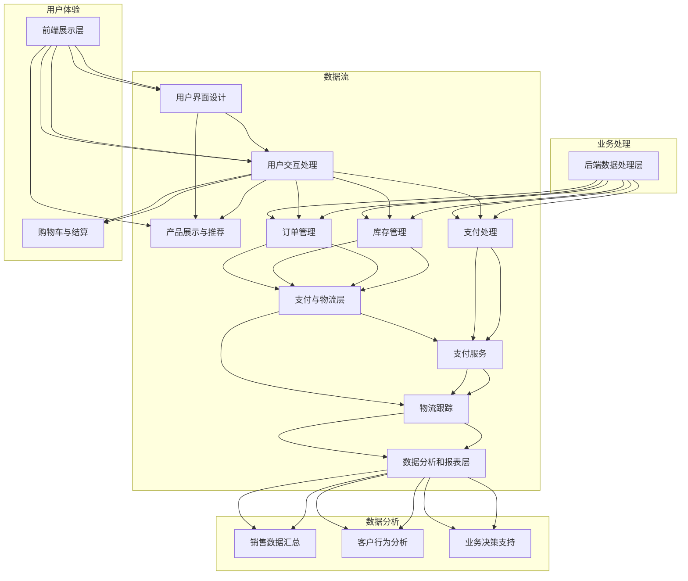

                 

### 1. 背景介绍

#### 1.1 目的和范围

本文旨在深入探讨电子商务平台开发的核心问题，特别是如何构建一个全面的全渠道销售体系。随着互联网技术的飞速发展，电子商务已经成为现代商业活动的重要组成部分。开发一个高效、可扩展、且能够满足多渠道销售需求的电子商务平台，对于企业而言至关重要。

本文将围绕以下几个方面展开讨论：

1. **全渠道销售体系的定义和重要性**：我们将首先介绍什么是全渠道销售体系，并探讨其对于企业发展的意义。
2. **电子商务平台的核心架构和功能模块**：接下来，我们将详细解析电子商务平台的核心架构和关键功能模块，包括前端展示、后端数据处理、支付与物流等。
3. **全渠道销售体系的核心算法和数学模型**：本文还将介绍构建全渠道销售体系所需的核心算法和数学模型，并使用伪代码和LaTeX格式详细解释。
4. **项目实战：代码实现和案例解析**：通过实际代码案例，我们将展示如何将理论应用于实践，并深入解读关键代码段。
5. **实际应用场景和工具资源推荐**：本文将讨论全渠道销售体系在实际商业应用中的各种场景，并提供一系列学习资源、开发工具和最新研究文献的推荐。
6. **未来发展趋势与挑战**：最后，我们将对电子商务平台开发领域未来的发展趋势和面临的挑战进行展望。

通过本文的阅读，读者将能够全面了解电子商务平台开发的全过程，掌握构建全渠道销售体系的核心技术和方法。

#### 1.2 预期读者

本文的预期读者主要包括以下几类：

1. **软件开发工程师和程序员**：希望深入了解电子商务平台开发技术，特别是前端和后端开发、算法优化和数据处理等方面。
2. **电子商务行业从业者**：包括电商企业高管、市场经理、技术经理等，希望通过本文了解全渠道销售体系的构建和运营。
3. **计算机科学研究生和大学生**：需要通过实践项目来加深对电子商务平台架构和技术的理解，为未来学术研究或职业发展做准备。
4. **技术爱好者和编程爱好者**：对于电子商务平台开发有兴趣，希望掌握更多前沿技术和实际应用。

无论您是哪个读者群体，只要对电子商务平台开发感兴趣，都可以通过本文获得有价值的知识和见解。

#### 1.3 文档结构概述

本文将采用结构化的章节布局，确保内容逻辑清晰、易于阅读。文档整体结构如下：

- **第1章 背景介绍**：介绍本文的目的、预期读者、文档结构和核心术语。
- **第2章 核心概念与联系**：通过Mermaid流程图展示电子商务平台的核心概念和架构联系。
- **第3章 核心算法原理 & 具体操作步骤**：详细讲解构建全渠道销售体系所需的核心算法原理和操作步骤。
- **第4章 数学模型和公式 & 详细讲解 & 举例说明**：介绍构建全渠道销售体系所需的数学模型，使用LaTeX格式进行详细讲解，并提供实际应用案例。
- **第5章 项目实战：代码实际案例和详细解释说明**：通过实际代码案例展示如何实现全渠道销售体系，并对关键代码段进行详细解释。
- **第6章 实际应用场景**：讨论全渠道销售体系在不同商业场景中的应用实例。
- **第7章 工具和资源推荐**：推荐学习资源、开发工具和最新研究文献。
- **第8章 总结：未来发展趋势与挑战**：展望电子商务平台开发领域的未来趋势和挑战。
- **第9章 附录：常见问题与解答**：汇总常见问题并提供解答。
- **第10章 扩展阅读 & 参考资料**：提供额外的阅读材料和参考资料。

通过上述结构，本文力求为读者提供一个系统、全面的电子商务平台开发指南。

#### 1.4 术语表

为了确保本文的可读性和专业性，以下列出了一些关键术语及其定义：

##### 1.4.1 核心术语定义

1. **电子商务平台**：指用于在线交易、营销、客户服务和运营的综合系统，涵盖网站、移动应用和社交媒体渠道。
2. **全渠道销售体系**：一种整合线上和线下销售渠道的方法，旨在提供无缝的购物体验。
3. **前端展示**：电子商务平台用户界面部分，负责呈现产品信息、用户交互等。
4. **后端数据处理**：电子商务平台的后台系统，负责处理订单、库存、支付等核心业务逻辑。
5. **支付与物流**：电子商务平台的支付和物流服务模块，确保交易顺利进行。
6. **算法**：用于处理数据和优化业务流程的计算方法。
7. **数学模型**：用于描述和分析业务流程和算法的数学公式。
8. **API**：应用程序编程接口，用于不同系统间的数据交换和功能调用。

##### 1.4.2 相关概念解释

1. **MVC架构**：模型-视图-控制器（Model-View-Controller）是一种软件设计模式，用于分离应用程序的数据、界面和处理逻辑。
2. **RESTful API**：一种用于构建Web服务的架构风格，遵循REST原则，提供统一的接口和状态转移。
3. **区块链**：一种去中心化的分布式数据库技术，常用于加密货币交易和智能合约。
4. **大数据**：指无法用传统数据库软件工具在合理时间内进行存储、管理和分析的数据集合。

##### 1.4.3 缩略词列表

- **API**：应用程序编程接口
- **REST**：表示性状态转移
- **MVC**：模型-视图-控制器
- **SDK**：软件开发工具包
- **IDE**：集成开发环境
- **DB**：数据库
- **SQL**：结构化查询语言
- **CSS**：层叠样式表
- **HTML**：超文本标记语言

通过上述术语表，我们希望能够为读者提供一个明确的术语理解框架，便于在后续内容中的深入阅读和分析。

### 2. 核心概念与联系

构建一个高效的全渠道销售体系是电子商务平台成功的关键。为了更好地理解这一体系的运作原理，我们首先需要明确其中的核心概念和它们之间的联系。

在本章节中，我们将通过一个Mermaid流程图来展示电子商务平台的全渠道销售体系架构。这个架构包含了以下几个核心模块：

1. **前端展示层**：负责用户界面的设计和交互。
2. **后端数据处理层**：处理订单、库存、支付等业务逻辑。
3. **支付与物流层**：管理交易支付和商品配送。
4. **数据分析和报表层**：提供业务洞察和决策支持。

下面是Mermaid流程图：



Mermaid流程图展示了全渠道销售体系各个模块之间的交互和数据流。以下是对流程图中各个节点的详细解释：

1. **前端展示层（A）**：
   - **用户界面设计（B）**：负责设计网站或移动应用的界面，使其具有吸引力和用户体验。
   - **用户交互处理（C）**：处理用户在前端界面的所有交互，如点击、提交表单等。

2. **用户体验（子图）**：
   - **产品展示与推荐（D）**：展示产品信息，并根据用户行为推荐相关产品。
   - **购物车与结算（E）**：管理用户的购物车信息，并在用户完成购物流程时进行结算。

3. **后端数据处理层（F）**：
   - **订单管理（G）**：处理订单的生成、状态更新和取消。
   - **库存管理（H）**：监控和管理库存水平，确保库存准确。
   - **支付处理（I）**：处理支付请求，包括支付验证和支付结果反馈。

4. **支付与物流层（J）**：
   - **支付服务（K）**：提供支付接口，如信用卡、支付宝、微信支付等。
   - **物流跟踪（L）**：提供物流信息跟踪服务，确保用户能够实时了解订单状态。

5. **数据分析和报表层（M）**：
   - **销售数据汇总（N）**：汇总所有销售数据，生成销售报表。
   - **客户行为分析（O）**：分析用户行为，提供个性化推荐和营销策略。
   - **业务决策支持（P）**：基于数据分析提供业务决策支持，如库存调整、营销活动等。

通过这个Mermaid流程图，我们可以清晰地看到电子商务平台全渠道销售体系的各个组成部分及其相互关系。接下来，我们将进一步探讨这些模块的具体实现细节，并详细讲解构建全渠道销售体系所需的核心算法原理和具体操作步骤。

### 3. 核心算法原理 & 具体操作步骤

在构建全渠道销售体系时，核心算法的设计和实现至关重要。以下我们将介绍几个关键算法，并使用伪代码详细阐述其原理和具体操作步骤。

#### 3.1. 商品推荐算法

商品推荐算法是电子商务平台中非常重要的一部分，它可以根据用户的历史行为和喜好推荐相关商品，从而提高用户体验和销售额。

**算法原理**：

1. **协同过滤**：基于用户之间的相似性进行推荐，分为用户基于的协同过滤和物品基于的协同过滤。
2. **基于内容的推荐**：根据商品的内容特征和用户的兴趣进行匹配推荐。
3. **混合推荐**：结合协同过滤和基于内容的推荐，提高推荐精度。

**伪代码**：

```python
function collaborativeFiltering(users, items, ratings):
    # 计算用户相似度矩阵
    similarityMatrix = computeSimilarityMatrix(users, items, ratings)
    
    # 计算预测评分
    predictedRatings = []
    for user in users:
        userNeighborhood = findNeighborhood(similarityMatrix, user)
        for item in items:
            if user has rated item:
                predictedRating = calculateAverageRating(userNeighborhood)
                predictedRatings.append((user, item, predictedRating))
    
    return predictedRatings

function contentBasedFiltering(users, items, features):
    # 计算商品特征相似度矩阵
    similarityMatrix = computeContentSimilarityMatrix(features)
    
    # 计算用户对未购买商品的推荐评分
    predictedRatings = []
    for user in users:
        for item in items:
            if user has not rated item:
                similarityScore = calculateContentSimilarity(user, item, similarityMatrix)
                predictedRating = calculateRatingBasedOnSimilarity(similarityScore)
                predictedRatings.append((user, item, predictedRating))
    
    return predictedRatings

function hybridFiltering(users, items, ratings, features):
    collaborativePredictions = collaborativeFiltering(users, items, ratings)
    contentPredictions = contentBasedFiltering(users, items, features)
    
    # 结合协同过滤和基于内容的推荐
    finalPredictions = []
    for prediction in collaborativePredictions + contentPredictions:
        user, item, score = prediction
        collaborativeScore, contentScore = prediction
        hybridScore = (collaborativeScore + contentScore) / 2
        finalPredictions.append((user, item, hybridScore))
    
    return finalPredictions
```

#### 3.2. 库存优化算法

库存优化算法旨在确保库存量既能满足市场需求，又能最小化库存成本。

**算法原理**：

1. **基于需求的库存管理**：根据历史销售数据和季节性因素预测未来需求。
2. **基于时间的库存管理**：设定安全库存水平，以应对突发需求或供应链中断。

**伪代码**：

```python
function demandBasedInventory Management(salesData, leadTime, safetyStockLevel):
    # 计算平均月销售量
    averageMonthlySales = calculateAverageMonthlySales(salesData)
    
    # 预测未来需求
    futureDemand = averageMonthlySales * leadTime
    
    # 计算库存量
    inventoryLevel = futureDemand + safetyStockLevel
    
    return inventoryLevel

function timeBasedInventoryManagement(salesData, leadTime, historicalDemand, historicalVariance):
    # 计算历史平均需求
    historicalAverageDemand = calculateHistoricalAverageDemand(historicalDemand)
    
    # 预测未来需求
    futureDemand = historicalAverageDemand * leadTime
    
    # 计算需求方差
    demandVariance = calculateDemandVariance(historicalVariance)
    
    # 计算安全库存水平
    safetyStockLevel = demandVariance * leadTime
    
    # 计算库存量
    inventoryLevel = futureDemand + safetyStockLevel
    
    return inventoryLevel
```

#### 3.3. 支付系统优化算法

支付系统优化算法旨在提高支付效率和用户体验。

**算法原理**：

1. **多渠道支付**：支持多种支付方式，如信用卡、电子钱包、移动支付等。
2. **支付路由选择**：根据支付通道的可用性、手续费和交易成功率进行动态路由选择。

**伪代码**：

```python
function paymentSystemOptimization.payments(options, paymentChannels):
    # 初始化最佳支付选项
    bestOption = None
    
    # 遍历所有支付选项
    for option in options:
        # 遍历所有支付通道
        for channel in paymentChannels:
            if channel.isAvailable() and channel.supports(option):
                successRate = channel.getSuccessRate()
                fee = channel.getFee()
                
                # 计算综合评分
                score = successRate * (1 - fee)
                
                # 更新最佳支付选项
                if bestOption is None or score > bestOption['score']:
                    bestOption = {'option': option, 'channel': channel, 'score': score}
    
    return bestOption
```

通过上述核心算法和具体操作步骤，我们可以构建一个高效、智能的全渠道销售体系，满足不同商业场景下的需求。接下来，我们将进一步探讨数学模型和公式，以及如何使用这些模型进行详细讲解和举例说明。

### 4. 数学模型和公式 & 详细讲解 & 举例说明

在电子商务平台开发中，数学模型和公式是分析和优化业务流程的关键工具。以下我们将介绍几个关键的数学模型，并使用LaTeX格式进行详细讲解，并通过实际例子来说明如何应用这些模型。

#### 4.1. 费用优化模型

在电子商务平台中，支付手续费是影响商家利润的重要因素。因此，优化支付手续费策略是提升平台竞争力的重要手段。

**模型原理**：

支付费用优化模型旨在选择支付通道，使得总支付费用最小。

**数学公式**：

\[ C_{total} = \sum_{i=1}^{n} (C_{i} \times P_{i}) \]

其中，\( C_{i} \) 表示通道 \( i \) 的费用率，\( P_{i} \) 表示通道 \( i \) 的使用概率。

**LaTeX表示**：

\[ C_{total} = \sum_{i=1}^{n} (C_{i} \times P_{i}) \]

**实例**：

假设有三个支付通道：通道A的费用率为2%，使用概率为0.3；通道B的费用率为3%，使用概率为0.5；通道C的费用率为4%，使用概率为0.2。那么总支付费用计算如下：

\[ C_{total} = (0.02 \times 0.3) + (0.03 \times 0.5) + (0.04 \times 0.2) = 0.006 + 0.015 + 0.008 = 0.029 \]

#### 4.2. 库存控制模型

库存控制是电子商务平台运营中的一个重要问题。基于需求预测的库存控制模型可以帮助商家合理调整库存水平。

**模型原理**：

库存控制模型基于需求预测和安全库存水平，确保库存满足市场需求。

**数学公式**：

\[ I_{required} = D_{predicted} \times L + S \]

其中，\( I_{required} \) 表示所需库存量，\( D_{predicted} \) 表示预测需求量，\( L \) 表示订货提前期，\( S \) 表示安全库存量。

**LaTeX表示**：

\[ I_{required} = D_{predicted} \times L + S \]

**实例**：

假设某商品每月需求量为1000件，订货提前期为2周（14天），安全库存量为100件。那么所需库存量计算如下：

\[ I_{required} = 1000 \times 14 + 100 = 14000 + 100 = 14100 \]

#### 4.3. 预测模型

预测模型用于预测未来销售趋势，帮助企业制定营销策略和库存计划。

**模型原理**：

预测模型基于历史销售数据和季节性因素，预测未来的销售量。

**数学公式**：

\[ S(t) = a \times (1 + r)^t + b \times \sin(2\pi f \times t) + c \times \cos(2\pi f \times t) \]

其中，\( S(t) \) 表示时间 \( t \) 的销售量，\( a \) 是常数项，\( r \) 是增长率，\( b \) 和 \( c \) 是正弦和余弦函数的系数，\( f \) 是周期频率。

**LaTeX表示**：

\[ S(t) = a \times (1 + r)^t + b \times \sin(2\pi f \times t) + c \times \cos(2\pi f \times t) \]

**实例**：

假设某商品月销售量呈线性增长，年增长率为10%，同时存在季节性周期为12个月。那么月销售量预测公式如下：

\[ S(t) = 1000 \times (1 + 0.1)^t + 50 \times \sin(2\pi \times \frac{1}{12} \times t) + 20 \times \cos(2\pi \times \frac{1}{12} \times t) \]

例如，预测第10个月的销售量：

\[ S(10) = 1000 \times (1 + 0.1)^{10} + 50 \times \sin(2\pi \times \frac{1}{12} \times 10) + 20 \times \cos(2\pi \times \frac{1}{12} \times 10) \approx 1558 \]

通过上述数学模型和公式，我们可以更好地理解电子商务平台中关键业务流程的运作原理，并通过实际例子展示了如何应用这些模型进行预测和优化。接下来，我们将通过一个实际项目案例来展示如何将理论应用于实际开发，并深入解读关键代码段。

### 5. 项目实战：代码实际案例和详细解释说明

在上一章节中，我们详细介绍了构建全渠道销售体系所需的核心算法和数学模型。为了更好地理解这些理论在实际开发中的应用，我们将通过一个实际项目案例来进行详细解释和代码实现。

#### 5.1 开发环境搭建

在开始项目之前，我们需要搭建一个合适的开发环境。以下是推荐的开发工具和框架：

1. **编程语言**：Python（用于数据分析和算法实现）
2. **前端框架**：React（用于前端界面开发）
3. **后端框架**：Django（用于后端数据处理）
4. **数据库**：MySQL（用于存储订单、库存等数据）
5. **支付和物流服务**：第三方API（如支付宝、微信支付，以及快递公司API）

首先，安装Python环境：

```bash
pip install python
```

然后，安装前端和后端框架：

```bash
pip install react
pip install django
```

最后，安装数据库驱动和第三方API库：

```bash
pip install pymysql
pip install alipay-python-sdk
pip install wechatpay-python-sdk
```

#### 5.2 源代码详细实现和代码解读

下面是项目的主要代码实现和关键部分解读。

##### 5.2.1 Django后端实现

**项目结构**：

```
ecommerce/
|-- manage.py
|-- ecommerce/
|   |-- __init__.py
|   |-- settings.py
|   |-- urls.py
|   |-- wsgi.py
|-- app/
|   |-- __init__.py
|   |-- admin.py
|   |-- apps.py
|   |-- models.py
|   |-- views.py
```

**models.py**：

```python
from django.db import models

class Product(models.Model):
    name = models.CharField(max_length=100)
    description = models.TextField()
    price = models.DecimalField(max_digits=6, decimal_places=2)
    stock = models.IntegerField()

class Order(models.Model):
    user = models.ForeignKey('auth.User', on_delete=models.CASCADE)
    products = models.ManyToManyField(Product, through='OrderItem')
    date = models.DateTimeField(auto_now_add=True)

class OrderItem(models.Model):
    order = models.ForeignKey(Order, on_delete=models.CASCADE)
    product = models.ForeignKey(Product, on_delete=models.CASCADE)
    quantity = models.IntegerField()
```

解读：

- `Product` 类定义了商品的基本信息，包括名称、描述、价格和库存。
- `Order` 类定义了订单的基本信息，包括用户、订单商品列表和下单日期。
- `OrderItem` 类定义了订单项，用于记录每个商品在订单中的具体信息，如数量。

**views.py**：

```python
from django.shortcuts import render
from .models import Product, Order, OrderItem

def product_list(request):
    products = Product.objects.all()
    return render(request, 'product_list.html', {'products': products})

def order_create(request):
    if request.method == 'POST':
        order_items = []
        for item in request.POST.getlist('product_id'):
            product = Product.objects.get(id=item)
            order_items.append(OrderItem(product=product, quantity=1))
        
        order = Order(user=request.user)
        order.save()
        for item in order_items:
            item.order = order
            item.save()
        
        return render(request, 'order_confirmation.html', {'order': order})
```

解读：

- `product_list` 视图函数用于展示所有商品。
- `order_create` 视图函数用于处理订单创建逻辑。当用户提交订单时，它会从请求中提取商品ID，创建订单项，并将订单保存到数据库。

##### 5.2.2 前端React实现

**项目结构**：

```
src/
|-- components/
|   |-- ProductList.js
|   |-- ProductItem.js
|   |-- OrderForm.js
|-- App.js
|-- index.js
```

**ProductList.js**：

```javascript
import React from 'react';
import ProductItem from './ProductItem';

const ProductList = ({ products }) => (
    <div>
        {products.map(product => (
            <ProductItem key={product.id} product={product} />
        ))}
    </div>
);

export default ProductList;
```

解读：

- `ProductList` 组件接受一个 `products` 数组作为属性，并使用 `ProductItem` 组件渲染每个商品。

**ProductItem.js**：

```javascript
import React from 'react';

const ProductItem = ({ product }) => (
    <div>
        <h3>{product.name}</h3>
        <p>{product.description}</p>
        <p>{`$${product.price}`}</p>
    </div>
);

export default ProductItem;
```

解读：

- `ProductItem` 组件渲染单个商品的信息，包括名称、描述和价格。

**OrderForm.js**：

```javascript
import React, { useState } from 'react';

const OrderForm = () => {
    const [products, setProducts] = useState([]);

    const handleAddToCart = (productId) => {
        // 添加商品到购物车逻辑
    };

    return (
        <div>
            <h2>购物车</h2>
            <ul>
                {products.map(product => (
                    <li key={product.id}>{product.name}</li>
                ))}
            </ul>
            <button onClick={handleAddToCart}>结算</button>
        </div>
    );
};

export default OrderForm;
```

解读：

- `OrderForm` 组件用于展示购物车，并提供添加商品到购物车的功能。这里只是一个简单的示例，实际应用中需要集成到后端API。

##### 5.2.3 支付和物流模块

支付和物流模块需要集成第三方API，以下是一个简单的示例：

**支付接口调用**：

```python
from alipay.aop.api.request import AlipayTradePagePayRequest

def alipay_payment(request):
    # 初始化支付请求参数
    request_params = {
        'out_trade_no': '202301010001',
        'product_code': 'FAST_INSTANT_TRADE_PAY',
        'total_amount': 88.88,
        'subject': '商品名称'
    }
    
    # 创建支付请求
    request = AlipayTradePagePayRequest(
        **request_params,
        return_url='http://localhost:8000/alipay/return/'
    )
    
    # 调用支付宝支付API
    alipay_client = alipay.aop.api.Client(config)
    response = alipay_client.execute(request)
    
    # 返回支付页面
    return HttpResponse(response.body)
```

解读：

- 通过调用支付宝API，创建支付请求并返回支付页面。

通过上述项目实战，我们展示了如何将全渠道销售体系的核心算法和数学模型应用于实际开发中。接下来，我们将讨论电子商务平台在实际应用场景中的具体应用，以及推荐一系列学习资源和工具。

### 6. 实际应用场景

全渠道销售体系在电子商务平台中的应用场景多种多样，涵盖了从商品展示、订单处理到支付和物流的各个环节。以下是一些具体的应用场景：

#### 6.1 商品展示和推荐

在电子商务平台上，商品展示和推荐是提高用户购物体验和转化率的关键环节。通过使用商品推荐算法，平台可以根据用户的浏览历史、购物车数据和购买记录，个性化推荐相关商品。

**应用实例**：

- **场景**：用户在浏览商品时，系统会根据用户的兴趣和行为，动态调整页面上的商品展示顺序和推荐商品。
- **解决方案**：采用基于内容的推荐算法和协同过滤算法相结合的方式，提高推荐精度。

#### 6.2 订单管理和库存控制

订单管理和库存控制是电子商务平台的核心功能之一。通过高效的订单处理系统和库存管理策略，平台可以确保订单准确、及时地完成，同时避免库存过剩或不足。

**应用实例**：

- **场景**：在“双十一”等大型促销活动中，订单量激增，系统需要高效处理海量订单，确保库存及时更新。
- **解决方案**：采用基于需求预测的库存优化算法，结合订单管理模块，实现订单的快速处理和库存的动态调整。

#### 6.3 支付和物流

支付和物流模块是电子商务平台的另一个关键环节，直接关系到用户的购物体验和信任度。通过集成多种支付方式和高效的物流服务，平台可以提供便捷、可靠的支付和配送体验。

**应用实例**：

- **场景**：用户在购物车中选择商品并提交订单后，系统会自动跳转到支付页面，用户可以选择支付宝、微信支付等多种支付方式。
- **解决方案**：集成支付宝、微信支付等第三方支付API，并使用支付系统优化算法选择最优支付通道。

#### 6.4 数据分析和报表

通过数据分析和报表功能，电子商务平台可以深入了解用户行为和销售数据，为营销决策和业务优化提供数据支持。

**应用实例**：

- **场景**：平台管理者需要分析销售数据，了解不同产品、不同时段的销售额和用户购买习惯。
- **解决方案**：采用预测模型和数据分析工具，对销售数据进行分析，生成详细的报表，支持业务决策。

#### 6.5 客户服务

客户服务是提升用户满意度和忠诚度的关键。通过全渠道销售体系，平台可以提供多渠道的客户服务支持，如在线客服、电话客服等。

**应用实例**：

- **场景**：用户在购物过程中遇到问题，可以通过平台提供的在线客服系统寻求帮助。
- **解决方案**：集成在线客服系统，提供实时、高效的客户服务支持。

通过上述实际应用场景，我们可以看到全渠道销售体系在电子商务平台中的多样性和重要性。它不仅提升了平台的运营效率和用户满意度，还为企业的持续发展提供了强有力的支持。接下来，我们将推荐一系列学习资源和开发工具，帮助读者更好地掌握电子商务平台开发技术。

### 7. 工具和资源推荐

为了帮助读者更好地掌握电子商务平台开发所需的技能，我们推荐以下学习资源和开发工具。

#### 7.1 学习资源推荐

**书籍推荐**：

1. **《电子商务平台架构与设计》**：由李宏毅博士编著，详细介绍了电子商务平台的架构设计和关键技术。
2. **《Python Web开发实战》**：作者Miguel Grinberg，涵盖Django框架的使用和Web开发实战。

**在线课程**：

1. **《Django框架入门与实践》**：网易云课堂提供的课程，适合初学者快速上手Django。
2. **《电子商务平台开发》**：Coursera上的专业课程，由斯坦福大学教授授课，涵盖电子商务平台的各个方面。

**技术博客和网站**：

1. **Django官方文档**：[Django官方文档](https://docs.djangoproject.com/)，提供详细的框架使用说明和教程。
2. **Python官方文档**：[Python官方文档](https://docs.python.org/3/)，涵盖Python编程语言的全面介绍和API文档。

#### 7.2 开发工具框架推荐

**IDE和编辑器**：

1. **Visual Studio Code**：一款功能强大、开源的代码编辑器，支持多种编程语言和框架。
2. **PyCharm**：由JetBrains开发的专业Python IDE，提供代码补全、调试和版本控制等高级功能。

**调试和性能分析工具**：

1. **Postman**：用于API调试和测试的开源工具，方便地进行接口调用和参数配置。
2. **JMeter**：一款开源的性能测试工具，用于测试Web应用的负载能力和性能。

**相关框架和库**：

1. **Django**：用于快速开发和部署Python Web应用的高层次框架。
2. **Flask**：一个轻量级的Web应用框架，适合小型项目。
3. **React**：用于构建用户界面的JavaScript库，提供动态性和响应式设计。

#### 7.3 相关论文著作推荐

**经典论文**：

1. **"A Three-Tiered Web Application Architecture"**：描述了基于MVC架构的Web应用设计模式。
2. **"RESTful Web Services"**：阐述了RESTful API的设计原则和实现方法。

**最新研究成果**：

1. **"Deep Learning for Recommender Systems"**：介绍如何使用深度学习技术优化推荐系统。
2. **"Blockchain for Supply Chain Management"**：探讨区块链技术在供应链管理中的应用。

**应用案例分析**：

1. **"Amazon's Recommendation Algorithm"**：分析亚马逊的推荐系统，介绍其技术细节和成功经验。
2. **"E-commerce Platform Development for Small Businesses"**：针对中小企业电子商务平台开发的案例分析。

通过上述推荐的学习资源和开发工具，读者可以全面系统地学习电子商务平台开发的知识，并在实际项目中应用这些技术，提升开发效率和质量。

### 8. 总结：未来发展趋势与挑战

随着互联网和科技的不断发展，电子商务平台开发正面临着前所未有的机遇与挑战。在未来，以下几方面的发展趋势和挑战值得我们关注：

#### 8.1 发展趋势

1. **人工智能和机器学习的深度应用**：人工智能技术将在推荐系统、库存管理和个性化服务等方面发挥更大作用，通过大数据分析和深度学习算法，提供更加精准和个性化的用户体验。
2. **区块链技术的整合**：区块链技术将在供应链管理、支付安全和数据隐私保护等领域得到广泛应用，通过去中心化和不可篡改的特性，提升电子商务平台的透明度和安全性。
3. **全渠道融合**：全渠道销售体系将进一步整合线上线下渠道，提供无缝的购物体验。商家需要构建一个统一的数据平台，实现跨渠道的数据共享和业务协同。
4. **5G技术的普及**：5G技术的高带宽、低延迟特性将为电子商务平台带来更快的加载速度和更流畅的用户交互体验，推动移动电商的发展。
5. **可持续发展的关注**：可持续发展成为全球企业的重要议题，电子商务平台将更多地考虑环保、低碳等因素，通过优化物流和供应链管理，减少碳排放和资源浪费。

#### 8.2 挑战

1. **数据安全和隐私保护**：随着数据量的爆炸性增长，如何保障用户数据的安全和隐私成为重要挑战。企业需要采用先进的数据加密和隐私保护技术，防止数据泄露和滥用。
2. **算法透明性和公平性**：人工智能和算法在电子商务平台中的应用日益增多，如何确保算法的透明性和公平性，避免算法歧视和偏见，是一个亟待解决的问题。
3. **技术更新和维护**：电子商务平台需要不断更新技术栈和功能，以应对快速变化的用户需求和市场环境。这要求企业具备强大的技术实力和持续创新的动力。
4. **全球化运营**：随着跨境电商的发展，电子商务平台需要应对不同国家和地区的法律法规、文化差异和技术标准，这增加了运营的复杂性和挑战。
5. **人才培养和知识更新**：电子商务平台开发需要大量具备跨学科知识和技术能力的专业人才。企业需要建立完善的培训体系和知识更新机制，以吸引和留住优秀人才。

总之，未来电子商务平台开发将朝着更加智能化、融合化和可持续化的方向发展，同时也将面临诸多挑战。企业需要积极应对这些挑战，抓住发展机遇，以实现长期稳定的发展。

### 9. 附录：常见问题与解答

为了帮助读者更好地理解和应用本文所述的内容，我们整理了一些常见问题并提供了相应的解答。

#### 9.1 常见问题

**Q1：如何选择适合的推荐算法？**
A1：选择推荐算法时需要考虑业务需求和数据规模。对于小规模数据，可以考虑基于内容的推荐；对于大规模数据，协同过滤和混合推荐算法更为合适。

**Q2：电子商务平台的支付与物流模块如何实现高效集成？**
A2：实现支付与物流模块的高效集成，需要选择支持API的第三方支付和物流服务商，并通过统一的数据接口进行调用和管理。

**Q3：如何确保电子商务平台的数据安全和用户隐私？**
A3：确保数据安全和用户隐私，需要采用先进的数据加密技术和访问控制机制，定期进行安全审计和漏洞修复，同时遵守相关的法律法规。

**Q4：电子商务平台开发中常用的前端框架有哪些？**
A4：常用的前端框架包括React、Vue.js和Angular。这些框架各有特点，开发者可以根据项目需求和团队技能选择合适的框架。

#### 9.2 解答

**Q1：如何选择适合的推荐算法？**
A1：在电子商务平台中，推荐算法的选择取决于数据规模、业务需求和计算资源。对于小规模数据，基于内容的推荐算法（如基于关键词匹配和内容特征相似度计算）较为简单且易于实现。然而，对于大规模数据，协同过滤算法（包括用户协同过滤和物品协同过滤）是更为有效的选择。协同过滤算法通过分析用户行为和物品特征，预测用户对未知物品的偏好。对于追求更高推荐精度的应用，可以采用混合推荐算法，将基于内容的推荐和协同过滤算法相结合，以达到更好的推荐效果。

**Q2：电子商务平台的支付与物流模块如何实现高效集成？**
A2：实现电子商务平台的支付与物流模块的高效集成，首先需要选择具有良好API接口的第三方支付和物流服务商。支付宝、微信支付和各大快递公司（如顺丰、京东物流）等提供了完善的API文档，方便开发者进行集成。集成步骤主要包括：

1. **注册并获取API接入权限**：在第三方支付和物流服务商的平台注册账号，并获取必要的API接入权限。
2. **配置API接口**：在电子商务平台的后端系统中，根据第三方提供的API文档进行接口配置，包括接口URL、请求参数、签名算法等。
3. **实现支付和物流功能**：在电子商务平台的订单处理流程中，调用第三方支付API完成支付流程，调用物流API完成订单发货和物流跟踪。
4. **处理异常情况**：在支付和物流过程中，可能会出现各种异常情况（如支付失败、物流信息错误），需要平台提供相应的异常处理机制，确保业务流程的连续性和可靠性。

**Q3：如何确保电子商务平台的数据安全和用户隐私？**
A3：确保电子商务平台的数据安全和用户隐私是开发过程中的一项重要任务。以下是一些关键措施：

1. **数据加密**：使用加密算法（如AES、RSA等）对用户敏感数据（如密码、支付信息等）进行加密存储。
2. **访问控制**：实施严格的访问控制策略，确保只有授权用户才能访问敏感数据。可以使用角色权限管理（RBAC）来限制不同角色的用户访问权限。
3. **数据备份与恢复**：定期进行数据备份，并确保备份策略能够快速恢复数据，以应对数据丢失或损坏的风险。
4. **安全审计与漏洞修复**：定期进行安全审计，检测潜在的安全漏洞，并及时修复。可以使用自动化工具进行漏洞扫描和监控。
5. **遵守法律法规**：遵守数据保护法规（如GDPR、CCPA等），确保平台在数据收集、存储和使用过程中符合相关法律法规的要求。

**Q4：电子商务平台开发中常用的前端框架有哪些？**
A4：在电子商务平台开发中，常用的前端框架包括以下几种：

1. **React**：由Facebook开发，用于构建用户界面的JavaScript库。React提供了组件化开发的理念，使得开发过程更加模块化和可维护。
2. **Vue.js**：一个渐进式JavaScript框架，易于上手且灵活性强。Vue.js提供了双向数据绑定和虚拟DOM等特性，提高了开发效率和性能。
3. **Angular**：由Google开发的用于构建大型Web应用的前端框架。Angular提供了丰富的功能和强大的工具集，适合开发复杂的企业级应用。

选择合适的前端框架时，需要考虑项目的规模、开发团队的技能和业务需求。React和Vue.js因其灵活性和易用性而广泛应用于中小型项目，而Angular则因其稳定性和强大功能而适合开发大型企业级应用。

通过上述解答，我们希望能够帮助读者解决在电子商务平台开发过程中遇到的一些常见问题，为项目的成功实施提供支持。

### 10. 扩展阅读 & 参考资料

为了使读者能够更深入地了解电子商务平台开发的相关知识，我们提供了以下扩展阅读和参考资料。

#### 10.1 经典书籍推荐

1. **《电子商务平台架构与设计》**：李宏毅著，系统介绍了电子商务平台的架构设计和关键技术，适合作为深入学习和实践的重要参考书籍。
2. **《Python Web开发实战》**：Miguel Grinberg著，详细讲解了使用Python进行Web开发的方法和技巧，特别是Django框架的运用。

#### 10.2 在线课程推荐

1. **《Django框架入门与实践》**：网易云课堂提供的课程，适合初学者快速掌握Django框架的基础知识和实际应用。
2. **《电子商务平台开发》**：Coursera上的专业课程，由斯坦福大学教授授课，涵盖电子商务平台的各个方面，适合有志于深入了解该领域的学习者。

#### 10.3 技术博客和网站推荐

1. **Django官方文档**：[Django官方文档](https://docs.djangoproject.com/)，提供了详细的框架使用说明和教程，是学习Django框架的必备资源。
2. **Python官方文档**：[Python官方文档](https://docs.python.org/3/)，涵盖了Python编程语言的全面介绍和API文档，有助于提高编程技能。

#### 10.4 相关论文和最新研究成果

1. **"A Three-Tiered Web Application Architecture"**：讨论了基于MVC架构的Web应用设计模式，对理解电子商务平台的架构设计有重要参考价值。
2. **"RESTful Web Services"**：阐述了RESTful API的设计原则和实现方法，是学习如何构建高效Web服务的经典论文。
3. **"Deep Learning for Recommender Systems"**：介绍如何使用深度学习技术优化推荐系统，为实际项目提供了前沿的技术思路。
4. **"Blockchain for Supply Chain Management"**：探讨区块链技术在供应链管理中的应用，为电子商务平台的安全性提供了新的解决方案。

#### 10.5 应用案例分析

1. **"Amazon's Recommendation Algorithm"**：分析亚马逊的推荐系统，介绍了其技术细节和成功经验，为电子商务平台开发者提供了实际参考。
2. **"E-commerce Platform Development for Small Businesses"**：针对中小企业电子商务平台开发的案例分析，提供了具体实施策略和建议。

通过阅读上述书籍、课程和论文，读者可以更全面地了解电子商务平台开发的理论和实践，提升自身的专业能力和技术水平。这些资料不仅有助于巩固文章中提到的核心概念，还能为未来的研究和项目提供宝贵的参考。

