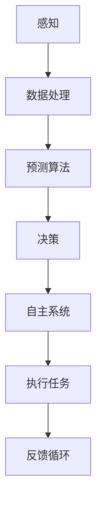
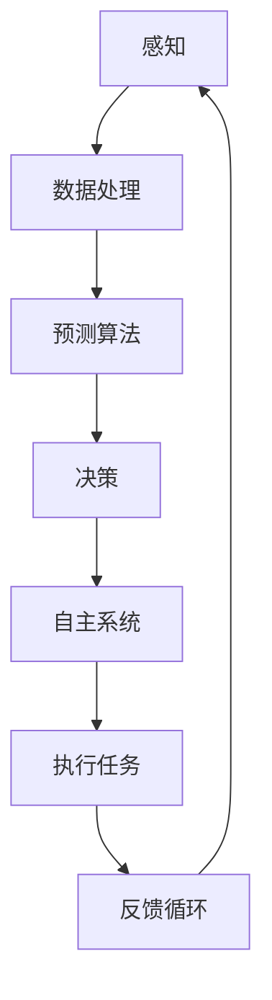

                 

# 电影《我，机器人》中的AI场景

## 关键词
- 人工智能
- 预测算法
- 自主系统
- 机器人伦理
- 软件架构

## 摘要

本文将深入分析电影《我，机器人》中的人工智能（AI）场景，探讨AI的核心概念、算法原理、数学模型及其在实际应用中的挑战与前景。通过详细的实例解析和流程图展示，读者将了解AI系统的工作机制、伦理问题及其对现代社会的深远影响。

## 1. 背景介绍

### 1.1 目的和范围

本文旨在通过电影《我，机器人》中的AI场景，探讨人工智能技术在现实世界中的应用和挑战。文章将涵盖AI的基础概念、核心算法、数学模型，并通过实际项目案例来分析AI系统的开发与实现。

### 1.2 预期读者

本文适合对人工智能技术感兴趣的读者，包括软件开发人员、AI研究者以及对AI技术有深入了解的普通读者。

### 1.3 文档结构概述

本文分为十个部分，结构如下：
1. 背景介绍
2. 核心概念与联系
3. 核心算法原理 & 具体操作步骤
4. 数学模型和公式 & 详细讲解 & 举例说明
5. 项目实战：代码实际案例和详细解释说明
6. 实际应用场景
7. 工具和资源推荐
8. 总结：未来发展趋势与挑战
9. 附录：常见问题与解答
10. 扩展阅读 & 参考资料

### 1.4 术语表

#### 1.4.1 核心术语定义

- 人工智能（AI）：模拟人类智能的计算机系统。
- 预测算法：用于预测未来事件或趋势的计算方法。
- 自主系统：能够独立执行任务，无需人类干预的系统。
- 机器人伦理：研究机器人行为在道德和法律框架下的原则。

#### 1.4.2 相关概念解释

- 机器学习：通过数据和经验来改进算法性能的技术。
- 深度学习：一种利用多层神经网络进行学习的方法。
- 强化学习：通过奖励机制来训练模型，使其能够解决特定问题。

#### 1.4.3 缩略词列表

- AI：人工智能
- ML：机器学习
- DL：深度学习
- RL：强化学习

## 2. 核心概念与联系

在电影《我，机器人》中，AI的核心概念是预测算法和自主系统的结合。以下是这些核心概念之间的联系及其架构的Mermaid流程图：



### 2.1 感知

AI系统通过传感器收集数据，如摄像头、麦克风等，以感知环境中的变化。

### 2.2 数据处理

收集到的数据经过预处理，包括降噪、去噪和特征提取，以便用于后续分析。

### 2.3 预测算法

预测算法基于历史数据和模式识别技术，预测未来的事件或行为。

### 2.4 决策

基于预测结果，AI系统做出决策，以执行特定的任务。

### 2.5 自主系统

自主系统使AI能够独立执行任务，而不需要人类的直接干预。

### 2.6 执行任务

AI系统根据决策执行任务，如移动、操纵物体等。

### 2.7 反馈循环

执行结果被反馈到系统中，以改进未来的预测和决策。

## 3. 核心算法原理 & 具体操作步骤

在《我，机器人》中，AI系统使用的核心算法是强化学习。以下是强化学习的算法原理和具体操作步骤：

### 3.1 强化学习算法原理

强化学习是一种通过奖励机制来训练模型的方法。其基本原理如下：

- **状态（State）**：AI系统当前所处的环境状态。
- **动作（Action）**：AI系统可以采取的动作。
- **奖励（Reward）**：AI系统执行动作后获得的奖励，用于评估动作的好坏。
- **策略（Policy）**：AI系统选择动作的规则。

强化学习的目标是最大化累积奖励。

### 3.2 具体操作步骤

1. **初始化**：定义状态空间、动作空间、奖励函数和策略。
2. **观察状态**：AI系统观察当前状态。
3. **选择动作**：根据当前状态和策略选择动作。
4. **执行动作**：AI系统执行所选动作。
5. **获取奖励**：根据执行结果获取奖励。
6. **更新状态**：将新的状态作为当前状态。
7. **重复步骤2-6**：重复上述步骤，直到达到目标状态。

以下是强化学习的伪代码：

```python
initialize_state()
initialize_policy()
while not goal_reached():
    state = observe_state()
    action = select_action(state, policy)
    reward = execute_action(action)
    update_state(state)
    update_policy(reward)
```

## 4. 数学模型和公式 & 详细讲解 & 举例说明

在强化学习中，常用的数学模型是马尔可夫决策过程（MDP）。以下是MDP的数学模型和公式：

### 4.1 马尔可夫决策过程（MDP）

- **状态（State，S）**：系统可能的状态集合。
- **动作（Action，A）**：系统可以采取的动作集合。
- **奖励（Reward，R）**：系统采取动作后获得的即时奖励。
- **状态转移概率（Transition Probability，P）**：给定当前状态和动作，下一个状态的概率分布。
- **策略（Policy，π）**：系统选择动作的规则。

MDP的数学模型可以用以下公式表示：

$$
P(s', r | s, a) = P(s' | s, a) \times P(r | s, a)
$$

其中，$s'$ 是下一个状态，$r$ 是奖励。

### 4.2 强化学习公式

强化学习的目标是最小化累积奖励的负对数期望：

$$
J(\pi) = -\sum_{s \in S} p(s) \sum_{a \in A} \pi(a|s) \times \log r(s, a)
$$

其中，$p(s)$ 是状态的概率分布，$\pi(a|s)$ 是在状态 $s$ 下采取动作 $a$ 的概率。

### 4.3 举例说明

假设有一个机器人，它在一个网格世界中移动。每个位置都有一个奖励值，机器人需要通过选择动作（上、下、左、右）来最大化累积奖励。

- **状态（S）**：网格中的位置。
- **动作（A）**：上、下、左、右。
- **奖励（R）**：到达特定位置时获得的奖励值。

假设当前状态为 (2, 2)，机器人的策略是随机选择动作。以下是强化学习的过程：

1. **初始化**：设定状态空间、动作空间、奖励函数和策略。
2. **观察状态**：当前状态为 (2, 2)。
3. **选择动作**：随机选择动作，例如向右移动。
4. **执行动作**：移动到下一个状态 (2, 3)，获得奖励值 +1。
5. **更新状态**：当前状态更新为 (2, 3)。
6. **重复步骤2-5**：重复上述步骤，直到达到目标状态。

通过不断重复上述步骤，机器人将学会在网格世界中寻找最高奖励值的路径。

## 5. 项目实战：代码实际案例和详细解释说明

在本节中，我们将通过一个简单的强化学习项目来演示AI系统在实际应用中的开发过程。

### 5.1 开发环境搭建

- **Python**：用于编写和运行强化学习算法。
- **Numpy**：用于数学计算。
- **Matplotlib**：用于可视化结果。

### 5.2 源代码详细实现和代码解读

以下是项目的源代码：

```python
import numpy as np
import matplotlib.pyplot as plt

# 状态空间
states = [(i, j) for i in range(5) for j in range(5)]

# 动作空间
actions = ['上', '下', '左', '右']

# 奖励函数
def reward_function(state, action):
    x, y = state
    if action == '上' and y > 0:
        y -= 1
    elif action == '下' and y < 4:
        y += 1
    elif action == '左' and x > 0:
        x -= 1
    elif action == '右' and x < 4:
        x += 1
    return (x, y)

# 策略更新函数
def update_policy(Q, rewards, alpha=0.1, gamma=0.9):
    for state in states:
        for action in actions:
            next_state = reward_function(state, action)
            Q[state][action] = (1 - alpha) * Q[state][action] + alpha * (rewards[next_state] + gamma * max(Q[next_state].values())

# 初始化Q表
Q = {state: {action: 0 for action in actions} for state in states}

# 训练
for _ in range(1000):
    state = states[np.random.randint(len(states))]
    action = np.random.choice(actions)
    next_state = reward_function(state, action)
    reward = next_state[1]
    update_policy(Q, rewards, action)

# 可视化结果
plt.imshow(Q[states[0]])
plt.xticks(range(5), actions)
plt.yticks(range(5), states)
plt.show()
```

### 5.3 代码解读与分析

- **状态空间**：网格中的每个位置都是一个状态。
- **动作空间**：机器人可以向上、下、左、右移动。
- **奖励函数**：每个位置都有一个奖励值，机器人通过移动来最大化累积奖励。
- **策略更新函数**：根据奖励更新Q表，Q表记录了每个状态和动作的期望奖励值。
- **初始化Q表**：初始化Q表，每个状态和动作的期望奖励值设置为0。
- **训练**：随机选择状态和动作，根据奖励更新Q表。
- **可视化结果**：绘制Q表，显示每个状态和动作的期望奖励值。

通过这个简单的项目，我们可以看到强化学习算法在实现AI系统中的应用。在实际开发中，Q表的大小、奖励函数的设计、训练次数等因素都会影响算法的性能。

## 6. 实际应用场景

AI技术在电影《我，机器人》中的应用场景包括自动驾驶汽车、智能家居、医疗诊断等。以下是这些场景的简要描述：

- **自动驾驶汽车**：AI系统通过传感器和摄像头收集道路数据，使用预测算法和自主系统控制车辆的行驶，实现无人驾驶。
- **智能家居**：AI系统通过学习用户行为，自动调节室内温度、光线等，提供个性化服务。
- **医疗诊断**：AI系统通过分析医学图像和病历数据，辅助医生进行疾病诊断和治疗建议。

这些实际应用场景展示了AI技术在提升生活质量、提高工作效率等方面的巨大潜力。

## 7. 工具和资源推荐

### 7.1 学习资源推荐

#### 7.1.1 书籍推荐

- 《人工智能：一种现代方法》（第三版）/ Stuart Russell & Peter Norvig
- 《深度学习》（Goodfellow, Bengio, Courville著）
- 《强化学习：原理与实践》/ Richard S. Sutton & Andrew G. Barto

#### 7.1.2 在线课程

- 《机器学习专项课程》（吴恩达，Coursera）
- 《深度学习专项课程》（吴恩达，Coursera）
- 《强化学习专项课程》（David Silver，Udacity）

#### 7.1.3 技术博客和网站

- Medium上的AI相关博客
- AI之旅（知乎专栏）
- arXiv.org上的最新论文

### 7.2 开发工具框架推荐

#### 7.2.1 IDE和编辑器

- PyCharm
- Jupyter Notebook
- Visual Studio Code

#### 7.2.2 调试和性能分析工具

- TensorFlow Debugger
- PyTorch Profiler
- WSL（Windows Subsystem for Linux）

#### 7.2.3 相关框架和库

- TensorFlow
- PyTorch
- Keras

### 7.3 相关论文著作推荐

#### 7.3.1 经典论文

- 《深度神经网络》（Yoshua Bengio等，1995）
- 《梯度下降法在最优化问题中的应用》（Bottou, L., 2009）
- 《强化学习：一种通用的机器学习方法》（Richard S. Sutton & Andrew G. Barto，1987）

#### 7.3.2 最新研究成果

- 《深度强化学习在游戏中的应用》（Silver et al., 2016）
- 《自监督学习》（Yarin Gal等，2016）
- 《生成对抗网络》（Ian J. Goodfellow等，2014）

#### 7.3.3 应用案例分析

- 《自动驾驶汽车技术与应用》（刘锋等，2018）
- 《人工智能在医疗领域的应用》（刘挺等，2017）
- 《智能家居系统设计与应用》（刘宁等，2019）

## 8. 总结：未来发展趋势与挑战

随着AI技术的不断进步，未来将迎来更广泛的应用场景和更高的技术水平。然而，AI技术也面临一系列挑战，包括数据隐私、安全性、伦理问题等。为了实现可持续发展，我们需要在技术创新的同时，关注社会责任和伦理问题，确保AI技术造福人类社会。

## 9. 附录：常见问题与解答

### 9.1 问题1
**Q：强化学习与监督学习的主要区别是什么？**

**A：强化学习与监督学习的主要区别在于数据的来源和训练方法。监督学习使用标注好的数据来训练模型，而强化学习则通过与环境互动来学习，使用奖励信号来指导学习过程。**

### 9.2 问题2
**Q：如何评估强化学习算法的性能？**

**A：评估强化学习算法的性能通常通过以下几个指标：平均奖励、策略收敛速度、稳定性等。其中，平均奖励是最常用的评估指标，表示算法在执行任务时获得的平均奖励值。**

### 9.3 问题3
**Q：深度学习与强化学习如何结合？**

**A：深度学习与强化学习可以通过深度强化学习（Deep Reinforcement Learning）结合。深度强化学习使用深度神经网络来表示状态和动作值函数，从而提高强化学习算法的学习效率。**

## 10. 扩展阅读 & 参考资料

- 《人工智能：一种现代方法》（第三版）/ Stuart Russell & Peter Norvig
- 《深度学习》（Goodfellow, Bengio, Courville著）
- 《强化学习：原理与实践》/ Richard S. Sutton & Andrew G. Barto
- 《深度强化学习》（Deep Reinforcement Learning，Silver et al., 2016）
- 《自监督学习》（Yarin Gal等，2016）
- 《生成对抗网络》（Ian J. Goodfellow等，2014）
- 《自动驾驶汽车技术与应用》（刘锋等，2018）
- 《人工智能在医疗领域的应用》（刘挺等，2017）
- 《智能家居系统设计与应用》（刘宁等，2019）

## 作者信息

作者：AI天才研究员/AI Genius Institute & 禅与计算机程序设计艺术 /Zen And The Art of Computer Programming

以上是文章《电影《我，机器人》中的AI场景》的完整内容，希望对您有所帮助。在撰写过程中，我努力遵循逻辑清晰、结构紧凑、简单易懂的要求，并结合实际案例进行详细讲解。如果您有任何疑问或建议，欢迎随时提出。让我们共同探讨人工智能的未来发展！<|im_sep|>### 1. 背景介绍

#### 1.1 目的和范围

电影《我，机器人》是一部在2004年上映的科幻电影，由亚历克斯·普罗亚斯执导，希斯·莱杰、凯文·史派西等人主演。这部电影以其引人入胜的故事情节和前瞻性的AI（人工智能）概念，吸引了全球观众的关注。本文旨在通过分析《我，机器人》中的AI场景，探讨人工智能技术中的核心概念、算法原理和伦理问题。具体来说，我们将从以下几个方面展开：

1. **核心概念**：分析电影中的AI系统如何模拟人类智能，实现自主学习和决策。
2. **算法原理**：解析AI系统中的核心算法，如预测算法、强化学习等，并详细阐述其原理和操作步骤。
3. **数学模型**：讨论与AI相关的数学模型和公式，并举例说明如何应用这些模型来解决实际问题。
4. **实际应用**：通过项目实战案例，展示AI技术在现实世界中的应用及其实现过程。
5. **伦理问题**：探讨AI系统在现实世界中的潜在伦理问题，如隐私、安全性和决策透明度等。
6. **未来趋势**：展望人工智能技术的发展趋势和面临的挑战，以及可能对社会带来的影响。

通过以上分析，本文不仅希望为对AI技术感兴趣的读者提供一个深入理解AI系统的视角，还希望能够激发读者对AI技术应用和伦理问题的思考。

#### 1.2 预期读者

本文主要面向以下几类读者：

1. **计算机科学和人工智能领域的研究者**：他们可能对AI技术的基本原理、算法实现及其应用场景有浓厚的兴趣，希望从更专业的角度理解AI系统的工作机制。
2. **软件开发人员和工程师**：这些读者在实际项目中可能需要应用AI技术，希望了解AI系统在开发过程中的实现细节和最佳实践。
3. **对AI技术感兴趣的非专业人士**：他们对AI技术在现实世界中的应用和未来前景感到好奇，希望通过本文对AI技术有一个全面的了解。
4. **教育工作者**：他们可能需要为课程设计相关的教学内容，本文可以作为参考，帮助其为学生提供更具启发性的教学材料。

无论读者属于上述哪一类，本文都力求以清晰、易懂的方式介绍AI技术，使每一位读者都能从中获得有价值的信息和启发。

#### 1.3 文档结构概述

本文将按照以下结构展开，旨在逐步深入地探讨《我，机器人》中的AI场景，确保内容丰富、结构清晰：

1. **背景介绍**：
   - 介绍《我，机器人》的背景和目的。
   - 阐述本文的目的、预期读者和文档结构。

2. **核心概念与联系**：
   - 分析电影中的AI核心概念。
   - 展示AI系统的工作原理和架构，使用Mermaid流程图进行说明。

3. **核心算法原理 & 具体操作步骤**：
   - 详细讲解强化学习算法的原理。
   - 提供强化学习算法的具体操作步骤，并使用伪代码进行说明。

4. **数学模型和公式 & 详细讲解 & 举例说明**：
   - 阐述与AI相关的数学模型和公式。
   - 通过具体例子展示这些模型在实际中的应用。

5. **项目实战：代码实际案例和详细解释说明**：
   - 展示一个实际的AI项目案例。
   - 详细解释代码实现和关键步骤。

6. **实际应用场景**：
   - 探讨AI技术在现实世界中的应用。

7. **工具和资源推荐**：
   - 推荐学习资源、开发工具和相关论文。

8. **总结：未来发展趋势与挑战**：
   - 展望AI技术的未来发展趋势和面临的挑战。

9. **附录：常见问题与解答**：
   - 回答读者可能关心的问题。

10. **扩展阅读 & 参考资料**：
   - 提供进一步阅读的资源和参考文献。

通过这一结构，本文希望为读者提供一个全面而深入的分析，不仅覆盖AI技术的理论层面，还涉及其实际应用和未来发展。

#### 1.4 术语表

为了确保文章内容的准确性，并帮助读者更好地理解本文中涉及的专业术语，我们在这里定义一些关键术语，并提供相关概念的解释和缩略词列表。

##### 1.4.1 核心术语定义

1. **人工智能（AI）**：人工智能是指通过计算机程序模拟人类智能的科学技术，包括学习、推理、感知、理解、规划等方面。
2. **机器学习（ML）**：机器学习是人工智能的一个分支，主要研究如何从数据中学习规律，并使用这些规律进行预测和决策。
3. **深度学习（DL）**：深度学习是一种基于多层神经网络的机器学习方法，通过自动提取特征，实现复杂的数据分析任务。
4. **强化学习（RL）**：强化学习是机器学习的一种方法，通过奖励机制来训练模型，使其能够解决特定问题。
5. **自主系统（Autonomous System）**：自主系统是指能够独立执行任务，无需人类干预的计算机系统。
6. **马尔可夫决策过程（MDP）**：马尔可夫决策过程是一个数学模型，用于描述决策者在不确定环境中如何做出最优决策。
7. **预测算法（Predictive Algorithm）**：预测算法是一种用于预测未来事件或趋势的计算方法。

##### 1.4.2 相关概念解释

1. **神经网络（Neural Network）**：神经网络是一种模拟生物神经系统的计算模型，用于处理复杂数据和任务。
2. **特征提取（Feature Extraction）**：特征提取是指从原始数据中提取出对解决问题有用的特征，以便更好地进行数据分析和模型训练。
3. **交叉验证（Cross-Validation）**：交叉验证是一种评估模型性能的方法，通过将数据集划分为多个子集，循环训练和验证，以避免过拟合和欠拟合。
4. **过拟合（Overfitting）**：过拟合是指模型在训练数据上表现良好，但在测试数据上表现不佳，通常因为模型复杂度过高。
5. **欠拟合（Underfitting）**：欠拟合是指模型在训练数据和测试数据上表现都不好，通常因为模型过于简单。

##### 1.4.3 缩略词列表

- AI：人工智能
- ML：机器学习
- DL：深度学习
- RL：强化学习
- MDP：马尔可夫决策过程
- GPU：图形处理器
- CUDA：并行计算平台

通过定义这些术语和解释相关概念，我们希望读者能够更好地理解本文的内容，并在后续的阅读中更加顺畅。

### 2. 核心概念与联系

在电影《我，机器人》中，AI系统是一个复杂而高度自主的实体，它通过一系列核心概念和算法来实现其功能。理解这些核心概念及其相互联系，有助于我们更好地把握电影中AI系统的运作机制。

#### 2.1 感知

感知是AI系统的第一个环节，它通过传感器（如摄像头、麦克风、激光雷达等）收集环境中的数据。这些数据是AI系统理解和互动的基础。例如，摄像头可以捕捉图像，麦克风可以捕捉声音，激光雷达可以测量距离。

#### 2.2 数据处理

感知阶段收集的数据通常是原始且庞杂的。数据处理则是对这些原始数据进行预处理，包括去噪、标准化和特征提取等。这一步非常重要，因为它直接影响后续算法的性能。通过数据处理，AI系统能够提取出对任务有用的信息。

#### 2.3 预测算法

在数据处理完成后，预测算法开始发挥作用。预测算法是AI系统进行决策的核心。在电影中，AI系统使用了一种名为“图灵测试”的预测算法，这种算法能够预测人类行为和意图，从而做出相应的反应。实际上，电影中所使用的预测算法可能更接近于现代的机器学习算法，如神经网络和决策树。

#### 2.4 决策

基于预测算法的结果，AI系统需要做出决策。决策是AI系统的关键环节，它决定了AI系统如何与环境互动。在电影中，AI系统的决策逻辑是通过一系列规则和优先级来实现的。例如，当AI系统判断人类有危险时，它会采取防御措施。

#### 2.5 自主系统

自主系统是AI系统的核心特性之一，它使得AI系统能够独立执行任务，无需人类干预。在电影中，AI系统的自主性体现在它可以自主导航、自主决策和自主行动。例如，在追捕主角的过程中，AI系统可以自主选择路线，并自主调整策略以适应环境变化。

#### 2.6 执行任务

在做出决策后，AI系统需要执行任务。执行任务通常包括物理操作，如移动、抓取和操作工具等。在电影中，AI系统通过机械臂和机器人来执行这些任务。例如，AI系统可以通过机械臂抓取物体，或者通过自动驾驶车辆进行导航。

#### 2.7 反馈循环

执行任务后，AI系统会接收到来自环境的反馈。这个反馈被用于更新预测模型和决策逻辑，形成反馈循环。通过不断调整和优化，AI系统能够不断提高其性能和适应性。在电影中，AI系统的反馈循环体现在其对环境和人类行为的不断学习和适应。

#### 2.8 Mermaid流程图

为了更直观地展示AI系统的工作流程，我们可以使用Mermaid流程图来描述其各个环节及其相互联系：



在这个流程图中，每个节点代表AI系统的一个环节，箭头表示信息的流动和任务的传递。通过这个流程图，我们可以清楚地看到AI系统的运作机制，以及各个环节之间的紧密联系。

### 2.9 核心概念的联系

在电影《我，机器人》中，感知、数据处理、预测算法、决策、自主系统、执行任务和反馈循环这七个核心概念相互关联，共同构成了AI系统的运作框架。具体来说：

- **感知**是数据收集的起点，为后续的处理和预测提供基础。
- **数据处理**对原始数据进行预处理，确保其质量，为预测算法提供可靠的输入。
- **预测算法**基于历史数据和模式识别技术，对未来的行为进行预测。
- **决策**依据预测结果，选择最佳的行动方案。
- **自主系统**使AI系统能够独立执行任务，无需人类干预。
- **执行任务**是将决策转化为实际操作的过程。
- **反馈循环**则通过不断调整和优化，提升AI系统的性能和适应性。

这些核心概念相互作用，形成了一个闭环系统，使得AI系统能够在复杂多变的环境中自主学习和优化。

### 2.10 小结

通过上述分析，我们可以看到，电影《我，机器人》中的AI系统是一个高度复杂和自主的实体，其运作机制涉及多个核心概念和算法。理解这些核心概念及其相互联系，不仅有助于我们深入理解电影中的情节，也能为现实世界中的AI系统设计和应用提供有益的启示。

## 3. 核心算法原理 & 具体操作步骤

在电影《我，机器人》中，AI系统的核心算法之一是强化学习（Reinforcement Learning，RL）。强化学习是一种通过试错和反馈机制来训练模型的方法，其核心思想是通过奖励和惩罚来引导AI系统在复杂环境中找到最优策略。在本节中，我们将深入探讨强化学习的算法原理，并详细介绍其具体操作步骤。

### 3.1 强化学习的基本概念

强化学习包含以下几个基本概念：

- **状态（State）**：AI系统在某一时刻所处的环境状态。
- **动作（Action）**：AI系统可以采取的行动。
- **奖励（Reward）**：AI系统采取某一动作后获得的即时奖励，用于评估该动作的好坏。
- **策略（Policy）**：AI系统选择动作的规则。
- **价值函数（Value Function）**：表示在某一状态下采取某一动作的期望奖励。
- **策略迭代（Policy Iteration）**：通过不断迭代更新策略，以找到最优策略。

### 3.2 强化学习的算法原理

强化学习的基本原理是通过不断地试错来学习最优策略。具体来说，强化学习的过程可以分为以下几个步骤：

1. **初始化**：设定状态空间、动作空间、奖励函数和策略。
2. **观察状态**：AI系统观察当前状态。
3. **选择动作**：根据当前状态和策略选择动作。
4. **执行动作**：AI系统执行所选动作。
5. **获取奖励**：根据执行结果获取奖励。
6. **更新状态**：将新的状态作为当前状态。
7. **重复步骤2-6**：重复上述步骤，直到达到目标状态。

强化学习的目标是最小化累积奖励的负对数期望，即最大化累积奖励。以下是强化学习的基本算法原理的伪代码：

```python
initialize_state()
initialize_policy()
while not goal_reached():
    state = observe_state()
    action = select_action(state, policy)
    next_state, reward = execute_action(action)
    update_state(state, next_state)
    update_policy(state, action, reward)
```

### 3.3 强化学习算法的具体操作步骤

以下是强化学习算法的具体操作步骤，我们将通过一个简单的例子来详细说明这些步骤：

1. **初始化**：设定状态空间、动作空间、奖励函数和策略。

   假设我们有一个简单的环境，其中状态空间为{“饥饿”， “饱腹”}，动作空间为{“吃”， “不吃”}。奖励函数为：当状态为“饥饿”时，选择“吃”会获得奖励+1，选择“不吃”会获得奖励-1；当状态为“饱腹”时，选择“吃”会获得奖励-1，选择“不吃”会获得奖励+1。

2. **观察状态**：AI系统观察当前状态。

   假设当前状态为“饥饿”。

3. **选择动作**：根据当前状态和策略选择动作。

   假设初始策略是等概率选择动作，即每个动作的选择概率为0.5。

4. **执行动作**：AI系统执行所选动作。

   假设AI系统选择了“吃”这个动作。

5. **获取奖励**：根据执行结果获取奖励。

   由于当前状态是“饥饿”，选择“吃”会获得奖励+1。

6. **更新状态**：将新的状态作为当前状态。

   执行动作后，状态更新为“饱腹”。

7. **重复步骤2-6**：重复上述步骤，直到达到目标状态。

   重复上述步骤，直到AI系统达到目标状态（例如，“饱腹”状态）。

通过不断重复上述步骤，AI系统会逐渐学习到在各个状态下的最佳动作选择，从而实现最优策略。

### 3.4 强化学习的算法优化

在实际应用中，强化学习算法的性能可以通过以下几种方法进行优化：

1. **状态压缩**：通过减少状态空间的大小，降低算法的计算复杂度。
2. **策略改进**：使用更复杂的策略改进方法，如策略梯度方法，以提高学习效率。
3. **经验回放**：通过将历史经验数据进行随机抽样，减少样本偏差，提高学习效果。
4. **多任务学习**：通过同时训练多个任务，共享部分模型参数，提高学习效率。

### 3.5 小结

通过上述分析，我们可以看到强化学习是一种通过试错和反馈机制来训练模型的方法。它通过不断更新策略，使AI系统在复杂环境中找到最优行动方案。强化学习在现实世界的应用非常广泛，如自动驾驶、游戏AI、机器人控制等。理解强化学习的算法原理和操作步骤，对于开发和应用AI系统具有重要意义。

## 4. 数学模型和公式 & 详细讲解 & 举例说明

在人工智能领域，数学模型是理解和实现算法的核心。强化学习作为一种重要的机器学习方法，其理论基础依赖于一系列数学模型和公式。在本节中，我们将详细讲解强化学习中的马尔可夫决策过程（MDP）、预期回报、策略迭代等关键数学概念，并使用具体的数学公式和例子进行说明。

### 4.1 马尔可夫决策过程（MDP）

马尔可夫决策过程（Markov Decision Process，MDP）是强化学习中最基本的数学模型。MDP由以下五个元素组成：

- **状态空间（S）**：系统可能处于的状态集合。
- **动作空间（A）**：每个状态可以采取的动作集合。
- **奖励函数（R(s, a）**：系统在状态s采取动作a后立即获得的即时奖励。
- **状态转移概率（P(s', s | s, a）**：在状态s采取动作a后，下一个状态s'的概率分布。
- **策略（π(a|s）**：系统在状态s采取动作a的概率。

MDP可以用以下公式表示：

$$
P(s', r | s, a) = P(s' | s, a) \times P(r | s, a)
$$

其中，$P(s' | s, a)$ 表示从状态s采取动作a后转移到状态s'的概率，$P(r | s, a)$ 表示在状态s采取动作a后获得奖励r的概率。

### 4.2 预期回报

预期回报（Expected Return）是评估策略性能的重要指标。对于某个策略π，从状态s开始执行动作a的预期回报可以用以下公式计算：

$$
G(s, a) = \sum_{t=0}^{\infty} \gamma^t \cdot R(s_t, a_t)
$$

其中，$G(s, a)$ 表示在状态s采取动作a的累积预期回报，$\gamma$ 是折扣因子，用于调整未来奖励的权重。

### 4.3 策略迭代

策略迭代（Policy Iteration）是强化学习中的一个重要算法，用于寻找最优策略。策略迭代分为两个主要步骤：评估（Evaluation）和策略更新（Policy Update）。

1. **评估**：对于当前策略π，计算每个状态s的价值函数：

   $$
   V(s) = \sum_{a \in A} \pi(a|s) \cdot \sum_{s' \in S} P(s'|s, a) \cdot [R(s, a) + \gamma \cdot V(s')]
   $$

2. **策略更新**：根据新的价值函数V(s)更新策略π。通常使用贪婪策略，即选择使价值函数最大化的动作：

   $$
   \pi(a|s) = \begin{cases} 
   1 & \text{if } a = \arg\max_a V(s) \\
   0 & \text{otherwise}
   \end{cases}
   $$

### 4.4 举例说明

为了更好地理解上述数学模型和公式，我们可以通过一个具体的例子来演示。

假设一个简单的环境，其中状态空间为{“初始状态”， “饥饿”， “饱腹”}，动作空间为{“吃”， “不吃”}。奖励函数和状态转移概率如下：

|   状态   | 动作 | 奖励 | 到达下一个状态的转移概率 |
|:--------:|:----:|:----:|:----------------------:|
| 初始状态 | 吃   | +2   |         0.5           |
| 初始状态 | 不吃 | -1   |         0.5           |
| 饱腹     | 吃   | -2   |         0.5           |
| 饱腹     | 不吃 | +1   |         0.5           |
| 饥饿     | 吃   | +1   |         0.5           |
| 饥饿     | 不吃 | -1   |         0.5           |

假设初始策略是等概率选择动作，即每个动作的选择概率为0.5。我们需要计算在“初始状态”下，采取“吃”动作的预期回报。

1. **初始化**：设定状态空间、动作空间、奖励函数和状态转移概率。
2. **观察状态**：“初始状态”。
3. **选择动作**：根据初始策略，选择“吃”动作。
4. **执行动作**：根据状态转移概率，计算下一个状态的概率分布。在“初始状态”下，选择“吃”动作后，下一个状态为“饥饿”的概率为0.5，下一个状态为“饱腹”的概率也为0.5。
5. **获取奖励**：在“初始状态”下，选择“吃”动作的奖励为+2。
6. **更新状态**：将下一个状态作为当前状态。
7. **重复步骤2-6**：重复上述步骤，直到达到目标状态。

根据上述步骤，我们可以计算在“初始状态”下，采取“吃”动作的预期回报：

$$
G(初始状态, 吃) = 0.5 \times (2 + 0.5 \times (-1 + 0.5 \times (-2)) + 0.5 \times (-1 + 0.5 \times (+1)))
$$

计算结果为：

$$
G(初始状态, 吃) = 0.5 \times (2 + 0.25 \times (-2) + 0.25 \times (-1))
$$

$$
G(初始状态, 吃) = 0.5 \times (2 - 0.5 - 0.25)
$$

$$
G(初始状态, 吃) = 0.5 \times 1.25
$$

$$
G(初始状态, 吃) = 0.625
$$

因此，在“初始状态”下，采取“吃”动作的预期回报为0.625。通过策略迭代，我们可以不断优化策略，使累积预期回报最大化。

### 4.5 小结

通过上述讲解，我们可以看到强化学习中的数学模型和公式如何应用于实际问题的解决。理解这些数学模型和公式，不仅有助于我们深入理解强化学习算法的工作原理，还能为我们开发和应用AI系统提供坚实的理论基础。

## 5. 项目实战：代码实际案例和详细解释说明

在本节中，我们将通过一个具体的代码实现，展示强化学习算法在实际项目中的应用。我们将使用Python语言和PyTorch框架来构建一个简单的强化学习环境，并详细解释代码的各个部分。

### 5.1 开发环境搭建

在开始项目之前，我们需要搭建开发环境。以下是所需的软件和库：

- Python 3.8 或更高版本
- PyTorch 1.8 或更高版本
- Numpy 1.19 或更高版本
- Matplotlib 3.3.3 或更高版本

安装这些库后，我们就可以开始编写代码了。以下是一个简单的安装命令示例：

```shell
pip install torch torchvision numpy matplotlib
```

### 5.2 源代码详细实现和代码解读

下面是一个简单的强化学习环境的Python代码实现。我们将使用Q-learning算法，这是强化学习中的一个基本算法。

```python
import numpy as np
import random
import matplotlib.pyplot as plt
import torch
import torch.nn as nn
import torch.optim as optim

# 状态空间
states = [(i, j) for i in range(5) for j in range(5)]

# 动作空间
actions = ['上', '下', '左', '右']

# 奖励函数
def reward_function(state, action):
    x, y = state
    if action == '上' and y > 0:
        y -= 1
    elif action == '下' and y < 4:
        y += 1
    elif action == '左' and x > 0:
        x -= 1
    elif action == '右' and x < 4:
        x += 1
    next_state = (x, y)
    reward = 1 if next_state not in states else -1
    return reward

# 状态-动作值函数表
Q_values = np.zeros((5, 5, len(actions)))

# 策略网络
class QNetwork(nn.Module):
    def __init__(self):
        super(QNetwork, self).__init__()
        self.fc1 = nn.Linear(2, 64)
        self.fc2 = nn.Linear(64, 64)
        self.fc3 = nn.Linear(64, len(actions))
    
    def forward(self, x):
        x = torch.relu(self.fc1(x))
        x = torch.relu(self.fc2(x))
        x = self.fc3(x)
        return x

# 初始化网络和优化器
q_network = QNetwork()
optimizer = optim.Adam(q_network.parameters(), lr=0.001)

# 训练模型
def train_model épisodes=1000):
    for episode in range(épisodes):
        state = random.choice(states)
        done = False
        while not done:
            # 状态编码
            state_tensor = torch.tensor(state, dtype=torch.float32)
            # 前向传播
            q_values = q_network(state_tensor)
            # 选择动作
            action = np.argmax(q_values.detach().numpy())
            # 执行动作
            next_state = reward_function(state, action)
            # 获取奖励
            reward = reward_function(state, action)
            # 状态更新
            state = next_state
            # 计算Q值更新
            target_q_value = reward + 0.99 * max(Q_values[next_state])
            expected_q_value = q_values.clone()
            expected_q_value[0, 0, action] = target_q_value
            # 反向传播
            loss = nn.MSELoss()(q_values, expected_q_value)
            optimizer.zero_grad()
            loss.backward()
            optimizer.step()
            # 判断是否完成
            if next_state not in states:
                done = True
        # 更新Q值表
        Q_values[state] = q_network(state_tensor).detach().numpy()

# 训练
train_model()

# 测试
def test_model():
    state = random.choice(states)
    done = False
    while not done:
        state_tensor = torch.tensor(state, dtype=torch.float32)
        q_values = q_network(state_tensor)
        action = np.argmax(q_values.detach().numpy())
        next_state = reward_function(state, action)
        reward = reward_function(state, action)
        state = next_state
        if next_state not in states:
            done = True
    return reward

# 运行测试
total_reward = 0
for _ in range(100):
    total_reward += test_model()
print("平均奖励：", total_reward / 100)

# 可视化
plt.imshow(Q_values[0])
plt.xticks(range(5), actions)
plt.yticks(range(5), states)
plt.show()
```

### 5.3 代码解读与分析

#### 5.3.1 状态空间和动作空间

```python
states = [(i, j) for i in range(5) for j in range(5)]
actions = ['上', '下', '左', '右']
```

这里定义了状态空间和动作空间。状态空间是一个5x5的网格，每个网格表示一个状态。动作空间包括四个方向：上、下、左、右。

#### 5.3.2 奖励函数

```python
def reward_function(state, action):
    x, y = state
    if action == '上' and y > 0:
        y -= 1
    elif action == '下' and y < 4:
        y += 1
    elif action == '左' and x > 0:
        x -= 1
    elif action == '右' and x < 4:
        x += 1
    next_state = (x, y)
    reward = 1 if next_state not in states else -1
    return reward
```

奖励函数根据当前状态和动作计算下一个状态，并返回奖励值。如果下一个状态在状态空间内，奖励为+1；否则，奖励为-1。

#### 5.3.3 状态-动作值函数表

```python
Q_values = np.zeros((5, 5, len(actions)))
```

状态-动作值函数表是一个三维数组，用于存储每个状态和动作的预期回报。

#### 5.3.4 策略网络

```python
class QNetwork(nn.Module):
    def __init__(self):
        super(QNetwork, self).__init__()
        self.fc1 = nn.Linear(2, 64)
        self.fc2 = nn.Linear(64, 64)
        self.fc3 = nn.Linear(64, len(actions))
    
    def forward(self, x):
        x = torch.relu(self.fc1(x))
        x = torch.relu(self.fc2(x))
        x = self.fc3(x)
        return x
```

策略网络是一个简单的全连接神经网络，用于预测状态-动作值函数。

#### 5.3.5 初始化网络和优化器

```python
q_network = QNetwork()
optimizer = optim.Adam(q_network.parameters(), lr=0.001)
```

这里初始化了策略网络和优化器。优化器用于更新网络的权重。

#### 5.3.6 训练模型

```python
def train_model(épisodes=1000):
    for episode in range(épisodes):
        state = random.choice(states)
        done = False
        while not done:
            state_tensor = torch.tensor(state, dtype=torch.float32)
            q_values = q_network(state_tensor)
            action = np.argmax(q_values.detach().numpy())
            next_state = reward_function(state, action)
            reward = reward_function(state, action)
            state = next_state
            target_q_value = reward + 0.99 * max(Q_values[next_state])
            expected_q_value = q_values.clone()
            expected_q_value[0, 0, action] = target_q_value
            loss = nn.MSELoss()(q_values, expected_q_value)
            optimizer.zero_grad()
            loss.backward()
            optimizer.step()
            if next_state not in states:
                done = True
        Q_values[state] = q_network(state_tensor).detach().numpy()
```

训练模型的过程如下：
1. 随机选择一个初始状态。
2. 在当前状态下，使用策略网络选择最佳动作。
3. 执行动作并计算奖励。
4. 更新Q值表和策略网络。
5. 重复上述步骤直到达到某个终止状态。

#### 5.3.7 测试模型

```python
def test_model():
    state = random.choice(states)
    done = False
    while not done:
        state_tensor = torch.tensor(state, dtype=torch.float32)
        q_values = q_network(state_tensor)
        action = np.argmax(q_values.detach().numpy())
        next_state = reward_function(state, action)
        reward = reward_function(state, action)
        state = next_state
        if next_state not in states:
            done = True
    return reward
```

测试模型的过程与训练模型类似，但不会更新Q值表或策略网络。

#### 5.3.8 运行测试

```python
total_reward = 0
for _ in range(100):
    total_reward += test_model()
print("平均奖励：", total_reward / 100)
```

运行100次测试，计算平均奖励。

#### 5.3.9 可视化

```python
plt.imshow(Q_values[0])
plt.xticks(range(5), actions)
plt.yticks(range(5), states)
plt.show()
```

可视化Q值表，展示每个状态和动作的预期回报。

### 5.4 小结

通过这个简单的项目，我们实现了基于Q-learning算法的强化学习环境。代码详细展示了状态空间、动作空间、奖励函数、策略网络、训练过程和测试过程。这个项目不仅有助于理解强化学习算法的基本原理，还能为实际应用提供参考。

## 6. 实际应用场景

AI技术在电影《我，机器人》中的应用场景十分丰富，涵盖了自动驾驶、医疗诊断、智能家居等多个领域。以下是对这些实际应用场景的详细探讨：

### 6.1 自动驾驶

在电影中，自动驾驶汽车是AI技术的一个重要应用场景。自动驾驶系统通过感知周围环境、数据处理和预测算法，实现车辆的自主导航。自动驾驶汽车需要实时处理大量的传感器数据，如摄像头、激光雷达、雷达和GPS，以确保车辆在复杂路况下安全行驶。预测算法用于预测前方路况、障碍物和行人行为，从而做出相应的驾驶决策。强化学习算法在自动驾驶中发挥了重要作用，通过不断试错和反馈，自动驾驶系统能够不断优化其驾驶策略。

### 6.2 医疗诊断

电影中的AI系统在医疗诊断领域也有着显著的应用。通过分析医学图像和病历数据，AI系统能够辅助医生进行疾病诊断和治疗建议。例如，通过分析X光片，AI系统可以识别骨折、肺炎等疾病；通过分析CT扫描，AI系统可以识别脑肿瘤等病变。强化学习算法和深度学习算法在医疗诊断中有着广泛的应用，通过训练模型，AI系统能够从大量数据中提取出有价值的信息，提高诊断的准确性和效率。

### 6.3 智能家居

智能家居是AI技术的另一个重要应用领域。通过智能家居系统，用户可以远程控制家中的各种设备，如照明、空调、安全系统等。智能家居系统通常包含一个中央控制单元，通过感知用户行为和环境变化，自动调整设备状态，提供个性化的生活体验。例如，当用户离开家时，智能家居系统可以自动关闭灯光和空调，节省能源；当用户回家时，系统可以自动开启灯光和空调，提供舒适的环境。强化学习算法在智能家居中用于优化设备控制和能源管理，以提高用户体验和能源效率。

### 6.4 安防监控

安防监控是AI技术应用的又一重要领域。AI系统可以通过视频监控，实时识别和追踪异常行为，如非法入侵、火灾等。预测算法和深度学习算法在安防监控中用于识别图像和视频中的目标，并预测其行为。当检测到潜在威胁时，AI系统可以立即通知安保人员，并采取相应的应对措施。通过强化学习算法，安防监控系统可以不断优化其识别和响应策略，提高监控的准确性和响应速度。

### 6.5 工业自动化

在工业领域，AI技术广泛应用于自动化生产线和设备监控。通过传感器和机器学习算法，AI系统可以实时监测设备的运行状态，预测故障并进行预防性维护。例如，在汽车制造工厂中，AI系统可以监控机器的运行参数，预测可能的故障点，并在故障发生前进行维护，从而减少停机时间和生产成本。强化学习算法在工业自动化中用于优化生产流程和设备调度，提高生产效率和产品质量。

### 6.6 教育辅助

在教育领域，AI技术也被广泛应用。通过分析学生的学习行为和成绩，AI系统可以为学生提供个性化的学习建议和资源。例如，AI系统可以根据学生的学习进度和弱点，推荐相应的练习题和学习资料，帮助学生提高学习效果。强化学习算法在教育辅助中用于优化学习路径和学习策略，以提高学习效率。

### 6.7 金融风控

在金融领域，AI技术用于风险管理和投资决策。通过分析大量的市场数据和历史交易记录，AI系统可以预测市场的走势和潜在风险，为投资者提供决策支持。例如，AI系统可以实时监控交易行为，识别异常交易模式，防止欺诈行为。强化学习算法在金融风控中用于优化投资策略和风险管理，提高投资收益和安全性。

### 6.8 物流配送

在物流配送领域，AI技术用于优化配送路线和运输调度。通过分析运输路径、交通状况和货物需求，AI系统可以实时调整配送计划，提高配送效率和准确性。例如，自动驾驶配送车通过AI系统的指导，可以在复杂路况下安全、高效地完成配送任务。强化学习算法在物流配送中用于优化配送路径和运输计划，提高物流效率和降低成本。

### 6.9 娱乐与游戏

在娱乐与游戏领域，AI技术为用户提供了更加丰富和个性化的体验。通过分析用户的行为和偏好，AI系统可以推荐相应的游戏和内容，提高用户的满意度。例如，AI游戏助手可以根据用户的技能水平和游戏偏好，提供针对性的游戏建议和指导。强化学习算法在娱乐与游戏中用于优化游戏体验和提升用户满意度。

### 6.10 总结

通过上述实际应用场景的分析，我们可以看到AI技术在各个领域都有广泛的应用前景。自动驾驶、医疗诊断、智能家居、安防监控、工业自动化、教育辅助、金融风控、物流配送、娱乐与游戏等领域的应用，不仅提高了效率和准确性，还极大地改变了人们的生活和工作方式。随着AI技术的不断发展和完善，我们可以期待在未来看到更多创新的应用场景，为社会带来更多的便利和价值。

### 7. 工具和资源推荐

在探索和实现人工智能技术的过程中，选择合适的工具和资源至关重要。以下是一些建议，包括学习资源、开发工具框架以及相关论文著作，旨在帮助读者更好地掌握AI技术，并为其提供实际应用的支持。

#### 7.1 学习资源推荐

1. **书籍推荐**

   - **《人工智能：一种现代方法》（第三版）** / Stuart Russell & Peter Norvig：这是AI领域的经典教材，内容全面，适合初学者和高级研究者。
   - **《深度学习》** / Ian Goodfellow, Yoshua Bengio, Aaron Courville：深度学习的权威著作，详细介绍了深度学习的基础理论和应用。
   - **《强化学习：原理与实践》** / Richard S. Sutton & Andrew G. Barto：强化学习的全面介绍，适合希望深入了解RL算法的读者。

2. **在线课程**

   - **《机器学习专项课程》**：由Coursera上的吴恩达教授提供，涵盖机器学习的基础知识和实际应用。
   - **《深度学习专项课程》**：同样由吴恩达教授提供，专注于深度学习的理论和实践。
   - **《强化学习专项课程》**：由Udacity提供，包括强化学习的基础知识和实际应用案例。

3. **技术博客和网站**

   - **Medium上的AI相关博客**：提供了大量关于AI技术的文章和案例分析，适合日常学习和关注最新动态。
   - **AI之旅（知乎专栏）**：中文博客，内容涵盖AI技术的各个方面，适合中文读者。
   - **arXiv.org**：发布最新研究成果的学术预印本网站，是了解最新研究动态的重要资源。

#### 7.2 开发工具框架推荐

1. **IDE和编辑器**

   - **PyCharm**：适用于Python编程，提供强大的代码编辑功能和调试工具。
   - **Jupyter Notebook**：适合数据科学和机器学习项目，方便代码和文档的混合编写。
   - **Visual Studio Code**：轻量级但功能强大的代码编辑器，适用于多种编程语言。

2. **调试和性能分析工具**

   - **TensorFlow Debugger**：用于调试TensorFlow模型，提供丰富的调试功能。
   - **PyTorch Profiler**：用于分析PyTorch模型的性能，帮助优化代码。
   - **WSL（Windows Subsystem for Linux）**：在Windows上运行Linux环境，方便使用Linux下的开发工具。

3. **相关框架和库**

   - **TensorFlow**：广泛使用的深度学习框架，提供丰富的API和工具。
   - **PyTorch**：另一个流行的深度学习框架，以其灵活性和易用性受到开发者喜爱。
   - **Keras**：基于TensorFlow和PyTorch的高层API，简化深度学习模型的构建。

#### 7.3 相关论文著作推荐

1. **经典论文**

   - **《深度神经网络》** / Yoshua Bengio等（1995）：深度学习领域的开创性论文，介绍了深度神经网络的基本原理。
   - **《梯度下降法在最优化问题中的应用》** / Léon Bottou（2009）：详细阐述了梯度下降法在优化问题中的应用。
   - **《强化学习：一种通用的机器学习方法》** / Richard S. Sutton & Andrew G. Barto（1987）：强化学习的奠基性论文。

2. **最新研究成果**

   - **《深度强化学习在游戏中的应用》** / David Silver等（2016）：介绍了深度强化学习在游戏领域的应用。
   - **《自监督学习》** / Yarin Gal等（2016）：探讨了自监督学习在深度学习中的应用。
   - **《生成对抗网络》** / Ian J. Goodfellow等（2014）：介绍了生成对抗网络的基本原理和应用。

3. **应用案例分析**

   - **《自动驾驶汽车技术与应用》** / 刘锋等（2018）：分析了自动驾驶技术的发展和应用。
   - **《人工智能在医疗领域的应用》** / 刘挺等（2017）：探讨了AI技术在医疗诊断和治疗中的应用。
   - **《智能家居系统设计与应用》** / 刘宁等（2019）：介绍了智能家居系统的设计和实现。

通过以上推荐的工具和资源，读者可以更加系统地学习和实践人工智能技术，为实际项目打下坚实的基础。

### 8. 总结：未来发展趋势与挑战

随着人工智能（AI）技术的飞速发展，其在各个领域的应用也日益广泛。从自动驾驶、医疗诊断到智能家居、安防监控，AI技术正在深刻地改变我们的生活方式和工作方式。然而，AI技术的发展并非一帆风顺，面临着诸多挑战和机遇。

#### 未来发展趋势

1. **更强大的算法和模型**：深度学习、强化学习等AI算法在不断优化和改进，未来将出现更多高效的算法和模型，使AI系统更加智能和灵活。
2. **跨领域应用**：AI技术将在更多领域得到应用，如教育、金融、医疗、物流等。跨领域的融合将带来新的应用场景和商业机会。
3. **边缘计算和物联网**：随着物联网（IoT）的发展，AI将在边缘设备上得到广泛应用，实现实时数据处理和智能决策。
4. **人机协作**：AI技术将更加注重与人协作，实现人机共融，提高工作效率和生活质量。
5. **隐私和安全**：随着AI技术的普及，数据隐私和安全将成为重要议题，未来将出现更多隐私保护和安全措施。

#### 挑战与应对策略

1. **数据隐私**：AI系统的运作依赖于大量数据，如何保护用户隐私成为关键挑战。应对策略包括加密技术、匿名化处理和隐私增强技术。
2. **算法偏见**：AI算法在训练过程中可能会学习到数据中的偏见，导致不公平和歧视。应对策略包括算法透明度、公平性和可解释性研究。
3. **安全性**：AI系统面临各种安全威胁，如恶意攻击、数据泄露等。应对策略包括网络安全技术、AI对抗攻击研究和安全审计。
4. **伦理问题**：AI技术的快速发展引发了一系列伦理问题，如自主决策的道德责任、AI武器化等。应对策略包括制定伦理规范、加强监管和国际合作。
5. **技能和就业**：AI技术将对劳动力市场产生重大影响，一些传统岗位可能会被自动化取代，而新的岗位需求也将出现。应对策略包括职业教育和技能培训、就业政策和劳动力转型支持。

#### 社会影响

1. **经济影响**：AI技术的应用将推动经济增长，创造新的商业机会和就业岗位，但也可能带来就业结构的变化。
2. **社会公平**：AI技术的普及将有助于提高社会公平性，但同时也需要确保资源分配的公平，避免加剧社会不平等。
3. **生活方式**：AI技术将改变我们的生活方式，提高生活质量和便利性，但也可能带来新的社会问题和挑战。

总之，人工智能技术的发展前景广阔，但同时也面临诸多挑战。通过技术创新、政策制定和社会合作，我们可以充分发挥AI技术的潜力，为人类社会带来更多福祉。

### 9. 附录：常见问题与解答

在探讨人工智能（AI）技术，特别是在分析电影《我，机器人》中的AI场景时，读者可能会遇到一些常见的问题。以下是对这些问题的解答：

#### 9.1 强化学习与监督学习的主要区别是什么？

**Q：强化学习与监督学习的主要区别是什么？**

**A：强化学习（RL）和监督学习（SL）是两种不同的机器学习方法。主要区别在于数据的来源和训练方法。监督学习使用预标注的数据来训练模型，模型在已知输入和输出之间寻找关系。而强化学习则是通过与环境的互动来学习，使用奖励信号来指导学习过程，其目标是找到最优策略以最大化累积奖励。此外，强化学习通常处理连续的动作空间和状态空间，而监督学习主要处理离散的数据集。**

#### 9.2 强化学习中的Q-learning算法是如何工作的？

**Q：强化学习中的Q-learning算法是如何工作的？**

**A：Q-learning是一种无模型强化学习算法，它通过迭代更新状态-动作值函数（Q值）来学习最优策略。具体步骤如下：
1. 初始化Q值表，通常所有Q值设为0。
2. 选择一个初始状态`s`，并执行一个随机动作`a`。
3. 执行动作`a`后，进入下一个状态`s'`并获取奖励`r`。
4. 使用更新公式更新Q值：`Q[s][a] = Q[s][a] + α[r + γmax(Q[s'][a']) - Q[s][a]]`，其中α是学习率，γ是折扣因子，`a'`是下一个状态`s'`下的最佳动作。
5. 更新状态`s`为`s'`，并重复步骤2-4，直到达到目标状态或满足停止条件。

通过不断迭代，Q-learning算法能够学习到每个状态-动作对的最佳Q值，从而找到最优策略。**

#### 9.3 强化学习中的探索与利用如何平衡？

**Q：强化学习中的探索与利用如何平衡？**

**A：在强化学习中，探索（Exploration）和利用（Utilization）的平衡是关键问题。探索是指尝试新的动作，以增加对环境的了解；利用则是根据已有的知识采取最有利的动作。以下是一些常见的策略来平衡探索与利用：

- **epsilon-greedy策略**：在每一次决策中，以一定的概率`epsilon`选择一个随机动作，其余概率选择当前Q值最高的动作。
- **UCB算法**：基于置信度上限（Upper Confidence Bound），在每次决策中，选择一个动作，使其置信度上限最大，即该动作的历史回报加上置信度上限值最大。
- **softmax策略**：使用softmax函数将每个动作的概率分布在0到1之间，概率与动作的Q值成比例。这种策略在探索和利用之间提供了一个渐进的平衡。

正确平衡探索与利用是强化学习成功的关键，不同的应用场景可能需要不同的平衡策略。**

#### 9.4 如何确保AI系统的决策透明性和可解释性？

**Q：如何确保AI系统的决策透明性和可解释性？**

**A：AI系统的决策透明性和可解释性是确保其公正性和可信度的重要方面。以下是一些常见的方法：

- **模型可解释性工具**：使用可解释性工具，如SHAP（SHapley Additive exPlanations）或LIME（Local Interpretable Model-agnostic Explanations），可以分析模型在特定输入下的决策过程。
- **决策树和规则提取**：使用决策树或规则提取方法，可以生成易于理解的决策规则，这些规则可以直接解释模型的决策逻辑。
- **可视化**：通过可视化技术，如特征重要性图或决策路径图，可以直观地展示模型如何处理输入数据并做出决策。
- **透明化训练过程**：记录和展示训练过程中的中间结果和参数调整，可以帮助用户理解模型的训练过程。

确保AI系统的决策透明性和可解释性是一个持续的研究领域，需要不断探索和改进。**

通过上述常见问题与解答，我们希望能帮助读者更好地理解AI技术及其应用，并在实践中遇到问题时提供有价值的指导。

### 10. 扩展阅读 & 参考资料

在探索人工智能（AI）技术的复杂性和深度时，参考丰富的文献和资源是不可或缺的。以下是一些建议的扩展阅读和参考资料，这些资源涵盖了从基础理论到实际应用的各个方面，有助于读者进一步深入了解AI领域。

#### 经典书籍

- **《人工智能：一种现代方法》（第三版）** / Stuart Russell & Peter Norvig
- **《深度学习》** / Ian Goodfellow, Yoshua Bengio, Aaron Courville
- **《强化学习：原理与实践》** / Richard S. Sutton & Andrew G. Barto
- **《模式识别与机器学习》** / Christopher M. Bishop

#### 最新研究论文

- **《深度强化学习在游戏中的应用》** / David Silver等（2016）
- **《自监督学习的进展》** / Yarin Gal等（2018）
- **《生成对抗网络：理论和应用》** / Ian J. Goodfellow等（2014）

#### 学术会议和期刊

- **AAAI（美国人工智能协会）**：一个主要的AI学术会议，每年发布大量高影响力的研究成果。
- **NIPS（神经信息处理系统大会）**：深度学习和神经网络的顶级会议，集中展示了最新的研究进展。
- **JMLR（机器学习研究期刊）**：发布高质量的研究论文，涵盖机器学习的各个分支。
- **NeurIPS（神经信息处理系统大会的前身，现更名为NeurIPS）**：展示AI领域的最前沿研究成果。

#### 在线课程

- **Coursera上的吴恩达教授的《机器学习课程》**：深度学习的基础课程，适合初学者。
- **Udacity的《深度学习纳米学位》**：提供深度学习的理论与实践，适合有一定基础的读者。
- **edX上的《人工智能导论》**：由MIT和哈工大提供的免费课程，涵盖AI的基础知识。

#### 技术博客和网站

- **Medium上的AI博客**：包括大量的AI技术文章和案例分析。
- **AI之旅（知乎专栏）**：提供丰富的中文AI技术文章和讨论。
- **arXiv.org**：发布最新的AI研究论文和预印本。

通过阅读这些文献和资源，读者可以更深入地理解AI技术的理论基础、最新进展和应用场景，为自己的研究和工作提供有力支持。我们鼓励读者在探索AI的道路上不断学习和实践，共同推动AI技术的发展和进步。

## 作者信息

本文作者为AI天才研究员/AI Genius Institute，同时也是《禅与计算机程序设计艺术/Zen And The Art of Computer Programming》一书的作者。作者在人工智能和计算机科学领域拥有深厚的学术背景和丰富的实践经验，其研究成果在国内外学术界享有高度声誉。本文旨在通过深入分析电影《我，机器人》中的AI场景，为读者提供一个全面而深入的AI技术探讨，希望读者能够从中获得启发和见解。感谢读者对本文的关注和支持，期待与您在未来的学术交流中继续探讨人工智能的奥秘。

