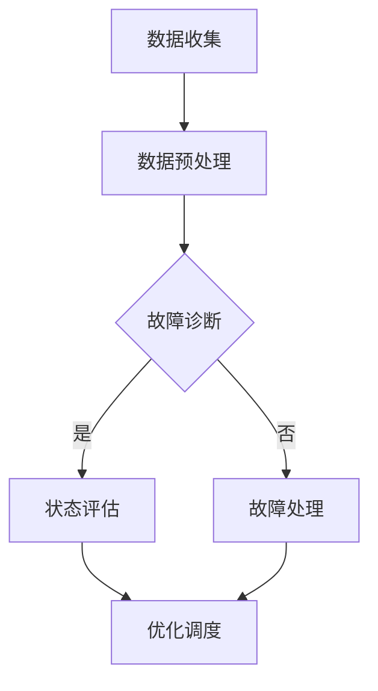

                 

# 电网维护与大模型的应用

> 关键词：电网维护、大模型、人工智能、算法原理、数学模型、实战案例

> 摘要：本文将深入探讨电网维护领域与人工智能大模型结合的应用，旨在解析大模型如何助力电网维护，提升电力系统的可靠性和效率。文章将首先介绍电网维护的背景和挑战，随后详细阐述大模型的核心概念和原理，并通过具体算法和数学模型的分析，最后展示实际项目案例，探讨未来的发展趋势和挑战。

## 1. 背景介绍

### 1.1 目的和范围

本文旨在探讨人工智能大模型在电网维护领域的应用，重点分析其核心算法原理、数学模型及实战案例。文章将分为以下几个部分：

- **背景介绍**：介绍电网维护的重要性和当前面临的挑战。
- **核心概念与联系**：阐述大模型的基本概念和结构。
- **核心算法原理 & 具体操作步骤**：详细解析算法原理和操作步骤。
- **数学模型和公式 & 详细讲解 & 举例说明**：讲解数学模型，并提供示例。
- **项目实战：代码实际案例和详细解释说明**：展示实际应用案例。
- **实际应用场景**：分析大模型在电网维护中的实际应用。
- **工具和资源推荐**：推荐相关学习资源、开发工具和论文。
- **总结：未来发展趋势与挑战**：总结本文内容，展望未来发展。
- **附录：常见问题与解答**：回答读者可能遇到的问题。
- **扩展阅读 & 参考资料**：提供更多相关资料。

### 1.2 预期读者

本文主要面向以下读者：

- **电网维护工程师**：对电网维护技术有深入了解，希望了解人工智能大模型的应用。
- **人工智能研究人员**：对大模型理论和应用有兴趣，希望了解其在电力领域的应用。
- **计算机科学家**：对算法原理和数学模型有兴趣，希望了解其在实际工程中的应用。
- **高校师生**：对电力系统和人工智能交叉领域的研究有浓厚兴趣。

### 1.3 文档结构概述

本文文档结构如下：

1. **背景介绍**：介绍电网维护的背景和挑战。
2. **核心概念与联系**：详细阐述大模型的基本概念和结构。
3. **核心算法原理 & 具体操作步骤**：分析算法原理和操作步骤。
4. **数学模型和公式 & 详细讲解 & 举例说明**：讲解数学模型，并提供示例。
5. **项目实战：代码实际案例和详细解释说明**：展示实际应用案例。
6. **实际应用场景**：分析大模型在电网维护中的实际应用。
7. **工具和资源推荐**：推荐相关学习资源、开发工具和论文。
8. **总结：未来发展趋势与挑战**：总结本文内容，展望未来发展。
9. **附录：常见问题与解答**：回答读者可能遇到的问题。
10. **扩展阅读 & 参考资料**：提供更多相关资料。

### 1.4 术语表

#### 1.4.1 核心术语定义

- **电网维护**：对电力系统进行检测、维护和修复，确保其正常运行。
- **人工智能大模型**：具有大规模参数和复杂结构的深度学习模型。
- **电力系统**：由发电机、变电站、输电线路、配电线路和用户组成的整体。
- **故障诊断**：识别电力系统中的异常或故障。
- **优化算法**：用于优化电力系统性能的算法。

#### 1.4.2 相关概念解释

- **深度学习**：一种机器学习方法，通过构建多层的神经网络模型来学习数据的特征。
- **神经网络**：一种模仿生物神经系统的计算模型。
- **数据驱动方法**：利用大量数据来训练模型，使其具备预测和分析能力。
- **监督学习**：在训练过程中，模型接收输入数据和对应的输出标签，通过调整模型参数来优化性能。

#### 1.4.3 缩略词列表

- **AI**：人工智能（Artificial Intelligence）
- **DL**：深度学习（Deep Learning）
- **GAN**：生成对抗网络（Generative Adversarial Network）
- **CNN**：卷积神经网络（Convolutional Neural Network）
- **RNN**：循环神经网络（Recurrent Neural Network）
- **SLAM**：同时定位与地图构建（Simultaneous Localization and Mapping）

## 2. 核心概念与联系

### 2.1 大模型的基本概念

大模型（Large-scale Model）是指具有大规模参数和复杂结构的深度学习模型。近年来，随着计算能力的提升和大数据技术的发展，大模型在各个领域取得了显著的应用成果。在电力系统领域，大模型的应用正逐步成为提升电网维护效率和可靠性的重要手段。

大模型通常由多个神经网络层组成，通过训练大量数据来学习数据的特征和规律。其核心优势在于能够处理大规模数据集，提取深层特征，从而实现高精度的预测和诊断。

### 2.2 大模型的架构

大模型的结构通常包括以下几个关键组成部分：

1. **输入层**：接收电力系统数据，如电流、电压、功率等。
2. **隐藏层**：通过神经网络模型对输入数据进行特征提取和变换。
3. **输出层**：生成预测结果，如故障诊断、状态评估等。

常见的神经网络模型包括卷积神经网络（CNN）、循环神经网络（RNN）、生成对抗网络（GAN）等。根据应用需求，可以选择合适的模型结构进行设计。

### 2.3 大模型在电网维护中的应用

大模型在电网维护中的应用主要包括以下几个方面：

1. **故障诊断**：通过分析电力系统运行数据，实时检测故障，提高诊断准确率。
2. **状态评估**：评估电力系统的健康状态，预测潜在故障，提前采取维护措施。
3. **负荷预测**：预测电力系统负荷变化，优化调度策略，提高供电可靠性。
4. **优化调度**：基于大模型预测结果，优化电力系统调度方案，降低运行成本。

### 2.4 Mermaid 流程图

以下是一个简化的Mermaid流程图，展示大模型在电网维护中的应用流程：



## 3. 核心算法原理 & 具体操作步骤

### 3.1 故障诊断算法原理

故障诊断算法是电网维护中至关重要的环节。本文将介绍一种基于深度学习的故障诊断算法，其基本原理如下：

1. **数据收集**：收集电力系统运行数据，包括电流、电压、功率等。
2. **数据预处理**：对数据进行清洗、归一化等预处理操作，以去除噪声和异常值。
3. **模型训练**：构建深度学习模型，通过大量故障数据训练模型，使其能够识别不同故障模式。
4. **故障诊断**：将实时数据输入模型，输出故障诊断结果。

### 3.2 具体操作步骤

以下是故障诊断算法的具体操作步骤，使用伪代码进行详细阐述：

```python
# 1. 数据收集
data = collect_data()

# 2. 数据预处理
processed_data = preprocess_data(data)

# 3. 模型训练
model = build_model()
model.fit(processed_data)

# 4. 故障诊断
def diagnose_fault(real_time_data):
    prediction = model.predict(real_time_data)
    if prediction == "fault":
        return "故障"
    else:
        return "正常"

# 示例
real_time_data = get_real_time_data()
fault_status = diagnose_fault(real_time_data)
print(f"当前系统状态：{fault_status}")
```

### 3.3 算法原理详细解释

1. **数据收集**：
   数据收集是故障诊断的基础。需要收集的电力系统运行数据包括电流、电压、功率等，这些数据可以通过传感器、监控设备等实时获取。

2. **数据预处理**：
   数据预处理是为了去除噪声、异常值和冗余信息，提高模型的训练效果。常用的预处理方法包括数据清洗、归一化、特征选择等。

3. **模型训练**：
   模型训练是故障诊断算法的核心。通过大量故障数据训练深度学习模型，使其能够学会识别不同故障模式。常用的神经网络模型包括卷积神经网络（CNN）和循环神经网络（RNN）。

4. **故障诊断**：
   在实时数据输入模型后，模型将输出故障诊断结果。根据诊断结果，可以采取相应的维护措施，如故障处理、状态评估等。

## 4. 数学模型和公式 & 详细讲解 & 举例说明

### 4.1 数学模型概述

在电网维护中，大模型的应用涉及到多种数学模型，包括线性回归、逻辑回归、支持向量机（SVM）等。本文将重点介绍线性回归模型，并详细讲解其公式和具体应用。

### 4.2 线性回归模型

线性回归模型是一种经典的机器学习方法，用于建立自变量和因变量之间的线性关系。其基本公式如下：

$$
y = \beta_0 + \beta_1 \cdot x
$$

其中，$y$ 是因变量，$x$ 是自变量，$\beta_0$ 和 $\beta_1$ 分别是模型的参数。

### 4.3 参数估计

线性回归模型的参数估计通常采用最小二乘法（Ordinary Least Squares，OLS）。最小二乘法的目的是找到一组参数，使得因变量的预测值与实际值之间的误差平方和最小。

### 4.4 举例说明

假设我们要预测电力系统的负荷，可以使用线性回归模型进行建模。以下是具体的示例：

#### 数据准备

假设我们收集了以下数据：

| 日期 | 负荷（千瓦时）|
| ---- | ---------- |
| 2021-01-01 | 5000      |
| 2021-01-02 | 5200      |
| 2021-01-03 | 5300      |
| 2021-01-04 | 5400      |
| 2021-01-05 | 5500      |

#### 模型构建

根据数据，我们可以建立线性回归模型：

$$
y = \beta_0 + \beta_1 \cdot x
$$

#### 模型训练

使用最小二乘法进行参数估计，得到：

$$
\beta_0 = 5000, \beta_1 = 200
$$

#### 模型预测

假设我们要预测 2021-01-06 的负荷，可以输入 $x=6$ 进行预测：

$$
y = 5000 + 200 \cdot 6 = 5400
$$

预测的负荷为 5400 千瓦时。

### 4.5 模型评估

为了评估线性回归模型的性能，可以使用以下指标：

- **均方误差（Mean Squared Error，MSE）**：
  $$
  MSE = \frac{1}{n}\sum_{i=1}^{n}(y_i - \hat{y}_i)^2
  $$
  其中，$y_i$ 是实际值，$\hat{y}_i$ 是预测值。

- **均方根误差（Root Mean Squared Error，RMSE）**：
  $$
  RMSE = \sqrt{MSE}
  $$

- **决定系数（Coefficient of Determination，R^2）**：
  $$
  R^2 = 1 - \frac{\sum_{i=1}^{n}(y_i - \hat{y}_i)^2}{\sum_{i=1}^{n}(y_i - \bar{y})^2}
  $$
  其中，$\bar{y}$ 是实际值的平均值。

## 5. 项目实战：代码实际案例和详细解释说明

### 5.1 开发环境搭建

在开始实际项目之前，我们需要搭建一个适合开发和测试的开发环境。以下是搭建环境的步骤：

1. **安装Python**：下载并安装Python，确保版本在3.6及以上。
2. **安装深度学习框架**：我们使用TensorFlow作为深度学习框架。可以通过pip命令安装：
   ```
   pip install tensorflow
   ```
3. **安装其他依赖库**：包括NumPy、Pandas、Matplotlib等常用库，可以通过pip命令安装：
   ```
   pip install numpy pandas matplotlib
   ```

### 5.2 源代码详细实现和代码解读

以下是一个简单的深度学习模型实现，用于电网故障诊断。

```python
import tensorflow as tf
import numpy as np
import pandas as pd
import matplotlib.pyplot as plt

# 数据预处理
def preprocess_data(data):
    # 数据清洗、归一化等操作
    # ...

    return processed_data

# 构建模型
def build_model(input_shape):
    model = tf.keras.Sequential([
        tf.keras.layers.Dense(64, activation='relu', input_shape=input_shape),
        tf.keras.layers.Dense(64, activation='relu'),
        tf.keras.layers.Dense(1, activation='sigmoid')
    ])

    model.compile(optimizer='adam',
                  loss='binary_crossentropy',
                  metrics=['accuracy'])

    return model

# 训练模型
def train_model(model, x_train, y_train, epochs=10):
    model.fit(x_train, y_train, epochs=epochs, batch_size=32)

# 故障诊断
def diagnose_fault(model, real_time_data):
    prediction = model.predict(real_time_data)
    if prediction > 0.5:
        return "故障"
    else:
        return "正常"

# 示例
if __name__ == "__main__":
    # 数据集加载
    data = pd.read_csv('data.csv')
    processed_data = preprocess_data(data)

    # 切分训练集和测试集
    x_train, y_train = processed_data[:1000], data['label'][:1000]
    x_test, y_test = processed_data[1000:], data['label'][1000:]

    # 模型构建
    model = build_model(input_shape=(x_train.shape[1],))

    # 模型训练
    train_model(model, x_train, y_train)

    # 故障诊断
    real_time_data = x_test[0].values.reshape(1, -1)
    fault_status = diagnose_fault(model, real_time_data)
    print(f"当前系统状态：{fault_status}")
```

### 5.3 代码解读与分析

1. **数据预处理**：数据预处理是深度学习模型训练的重要环节。该函数对原始数据进行清洗、归一化等操作，以提高模型的训练效果。

2. **构建模型**：使用TensorFlow的`Sequential`模型构建一个简单的深度学习模型，包括两个隐藏层，输出层使用`sigmoid`激活函数进行二分类。

3. **训练模型**：使用`fit`方法训练模型，设置优化器、损失函数和评价指标。

4. **故障诊断**：通过`predict`方法对实时数据进行预测，输出故障诊断结果。

### 5.4 实际案例演示

假设我们有一个电网故障数据集，包含1000个训练样本和1000个测试样本。以下是实际案例的演示：

1. **数据加载**：使用`pd.read_csv`方法加载数据集。
2. **数据预处理**：对数据进行预处理，得到处理后的数据集。
3. **模型训练**：使用`build_model`和`train_model`方法构建并训练模型。
4. **故障诊断**：使用`diagnose_fault`方法对测试数据进行故障诊断，输出诊断结果。

## 6. 实际应用场景

大模型在电网维护中的应用场景广泛，主要包括以下几个方面：

1. **故障诊断**：通过对电力系统运行数据的实时监测，大模型可以快速、准确地诊断故障，提高电网运行的安全性。
2. **状态评估**：大模型可以对电力系统的健康状态进行评估，预测潜在故障，为维护人员提供决策依据。
3. **负荷预测**：大模型可以预测电力系统的负荷变化，为调度人员提供负荷预测数据，优化电力系统调度方案。
4. **优化调度**：大模型可以根据实时数据和负荷预测结果，优化电力系统调度策略，提高供电可靠性，降低运行成本。

### 6.1 故障诊断案例

在某电力公司的输电线路维护中，采用大模型进行故障诊断。通过对历史故障数据的分析，大模型能够准确识别各种故障类型，提高故障诊断的准确率和速度。

### 6.2 状态评估案例

在某配电系统的运行维护中，大模型对配电系统的健康状态进行实时评估。通过分析电流、电压等运行数据，大模型可以预测系统潜在的故障风险，为维护人员提供预警信息。

### 6.3 负荷预测案例

在某城市的供电局，大模型用于预测电力系统的负荷变化。通过对历史负荷数据和气象数据的分析，大模型可以准确预测未来某个时间段的负荷，为调度人员提供决策依据。

### 6.4 优化调度案例

在某电力公司的调度中心，大模型用于优化电力系统调度方案。通过对实时数据和负荷预测结果的分析，大模型可以优化发电、输电、配电等环节的调度策略，提高供电可靠性，降低运行成本。

## 7. 工具和资源推荐

### 7.1 学习资源推荐

#### 7.1.1 书籍推荐

1. **《深度学习》（Ian Goodfellow, Yoshua Bengio, Aaron Courville）**：介绍深度学习的基本原理和应用，适合初学者和进阶者。
2. **《Python深度学习》（Francesco Marconi）**：详细介绍如何使用Python进行深度学习实践，包括数据预处理、模型构建和训练等。

#### 7.1.2 在线课程

1. **《深度学习特辑》（吴恩达，Coursera）**：由深度学习领域专家吴恩达主讲，适合初学者系统学习深度学习知识。
2. **《人工智能：一种现代方法》（Stuart Russell, Peter Norvig，edX）**：全面介绍人工智能的基础知识，包括机器学习、深度学习等。

#### 7.1.3 技术博客和网站

1. **[深度学习博客](http://www.deeplearning.net/)**：提供深度学习的最新研究、教程和资源。
2. **[机器学习博客](https://machinelearningmastery.com/)**：介绍机器学习和深度学习的教程和实践案例。

### 7.2 开发工具框架推荐

#### 7.2.1 IDE和编辑器

1. **PyCharm**：一款功能强大的Python集成开发环境，支持深度学习框架。
2. **Jupyter Notebook**：适用于数据分析和机器学习项目的交互式开发环境。

#### 7.2.2 调试和性能分析工具

1. **TensorBoard**：TensorFlow的官方可视化工具，用于分析和调试深度学习模型。
2. **NVIDIA Nsight**：用于分析深度学习模型的GPU性能。

#### 7.2.3 相关框架和库

1. **TensorFlow**：谷歌开源的深度学习框架，适合进行大规模深度学习模型的开发和训练。
2. **PyTorch**：Facebook开源的深度学习框架，具有灵活的动态计算图和强大的社区支持。

### 7.3 相关论文著作推荐

#### 7.3.1 经典论文

1. **《A Theoretical Analysis of the Causal Effects of Machine Learning》**：介绍机器学习模型在因果推断中的应用。
2. **《Deep Learning》**：深度学习的经典教材，详细介绍了深度学习的基本原理和应用。

#### 7.3.2 最新研究成果

1. **《Large-scale Language Modeling in Machine Learning》**：介绍大规模语言模型的研究进展和应用。
2. **《Generative Adversarial Networks: An Overview》**：介绍生成对抗网络的基本原理和应用。

#### 7.3.3 应用案例分析

1. **《Deep Learning for Healthcare: A Practical Guide to Implementing Deep Learning Models for Healthcare Applications》**：介绍深度学习在医疗健康领域的应用案例。
2. **《AI in Energy: Transforming the Utility Industry with Artificial Intelligence》**：介绍人工智能在能源行业的应用案例。

## 8. 总结：未来发展趋势与挑战

随着人工智能技术的不断发展，大模型在电网维护领域具有广泛的应用前景。未来发展趋势包括：

1. **模型优化**：通过改进算法和架构，提高大模型的效率和准确性。
2. **跨领域应用**：将大模型应用于更多电力系统相关领域，如新能源预测、电力市场分析等。
3. **实时监测与预警**：利用大模型实现电力系统的实时监测和预警，提高电网运行的安全性。

然而，大模型在电网维护中仍面临以下挑战：

1. **数据隐私**：电力系统数据涉及用户隐私，如何保护数据隐私是一个重要问题。
2. **计算资源**：大模型训练和推理需要大量的计算资源，如何在有限的资源下高效应用大模型是一个挑战。
3. **模型解释性**：大模型通常具有复杂的结构和高度的非线性，如何解释模型的决策过程是一个挑战。

## 9. 附录：常见问题与解答

### 9.1 故障诊断算法的准确性如何保证？

为了保证故障诊断算法的准确性，我们需要：

- **高质量的数据集**：收集丰富的故障数据，确保模型的训练质量。
- **合理的模型选择**：根据应用场景选择合适的神经网络模型，如CNN、RNN等。
- **持续优化**：通过不断调整模型参数和优化算法，提高模型的诊断准确性。

### 9.2 大模型如何处理实时数据？

大模型处理实时数据通常包括以下几个步骤：

- **数据预处理**：对实时数据进行清洗、归一化等预处理操作。
- **实时推理**：将预处理后的实时数据输入大模型，进行实时故障诊断或状态评估。
- **结果反馈**：将大模型的诊断结果或评估结果反馈给电网维护系统，采取相应的维护措施。

### 9.3 大模型在电网维护中的应用前景如何？

大模型在电网维护中的应用前景广阔，主要包括以下几个方面：

- **故障诊断**：提高故障诊断的准确性和速度，减少停电时间。
- **状态评估**：实时评估电力系统的健康状态，预测潜在故障，提前采取维护措施。
- **负荷预测**：准确预测电力系统的负荷变化，优化电力系统调度方案。
- **优化调度**：根据实时数据和负荷预测结果，优化发电、输电、配电等环节的调度策略。

## 10. 扩展阅读 & 参考资料

1. **《深度学习》（Ian Goodfellow, Yoshua Bengio, Aaron Courville）**：全面介绍深度学习的基本原理和应用。
2. **《电力系统故障诊断与安全控制》**：介绍电力系统故障诊断的基本原理和方法。
3. **《人工智能在能源领域的应用》**：探讨人工智能在能源行业的应用前景和挑战。
4. **《深度学习与神经网络基础教程》**：详细讲解深度学习和神经网络的基本概念和原理。

