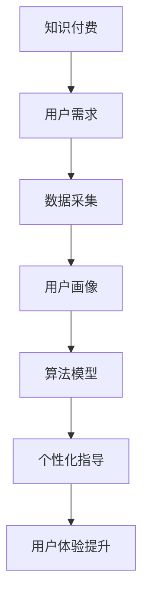

                 

### 标题：留学服务领域知识付费要提供个性化指导

> **关键词**：留学服务，知识付费，个性化指导，数据分析，用户画像，算法模型，教育技术，用户体验

> **摘要**：本文旨在探讨在留学服务领域中，知识付费模式如何通过个性化指导提升用户满意度与忠诚度。文章首先概述留学服务行业的现状，接着分析知识付费的兴起及其对教育行业的影响。随后，重点讨论个性化指导的必要性及其实现方法，包括数据采集与分析、用户画像构建和算法模型应用。最后，文章提出了实际应用场景和开发工具推荐，并展望了未来发展趋势与挑战。

## 1. 背景介绍

### 1.1 目的和范围

本文的目标是深入分析留学服务领域内知识付费模式的发展趋势，并着重探讨如何通过个性化指导来提升用户满意度和忠诚度。随着全球教育资源的不断丰富和竞争的加剧，留学服务行业面临巨大的市场机遇与挑战。知识付费作为一种新兴的商业模式，正在重塑教育服务的生态系统。本文将重点关注以下几个方面：

- **留学服务行业现状**：概述留学服务行业的发展背景、市场规模和主要参与者。
- **知识付费的兴起**：分析知识付费模式在留学服务领域的应用及其对行业的影响。
- **个性化指导的重要性**：探讨个性化指导在提升用户体验、满意度及忠诚度方面的作用。
- **个性化指导的实现方法**：详细介绍数据采集、用户画像构建、算法模型应用等关键环节。

通过以上分析，本文旨在为留学服务提供商提供有针对性的策略和建议，帮助其在激烈的市场竞争中脱颖而出。

### 1.2 预期读者

本文的预期读者主要包括以下几类：

- **留学服务公司管理层**：负责战略规划和业务发展的管理人员，希望通过本文深入了解知识付费模式及其在留学服务中的应用。
- **教育技术专家**：关注教育科技发展的专业人士，对教育领域的新兴商业模式和前沿技术有浓厚的兴趣。
- **留学顾问和教师**：直接服务于留学申请和学生辅导的教育从业者，希望提高服务质量和用户满意度。
- **研究人员和学术人员**：对教育科技领域有深入研究，希望通过案例分析了解知识付费和个性化指导的实际应用。

通过本文的阅读，预期读者能够获得以下收益：

- **对留学服务领域现状的全面了解**：掌握行业发展的关键趋势和市场动态。
- **对知识付费模式的深入理解**：了解其在教育行业中的应用场景和优势。
- **个性化指导的实际操作方法**：掌握数据驱动下的个性化指导策略和实现路径。
- **提升服务质量和用户满意度**：借鉴成功案例，提高留学服务的专业性和用户体验。

### 1.3 文档结构概述

本文将按照以下结构展开：

1. **背景介绍**：概述留学服务行业现状、知识付费兴起及个性化指导的重要性。
2. **核心概念与联系**：介绍核心概念，如知识付费、个性化指导、用户画像等，并使用Mermaid流程图展示关键环节。
3. **核心算法原理与具体操作步骤**：详细阐述个性化指导算法原理，包括数据采集、用户画像构建和算法模型应用。
4. **数学模型和公式**：介绍相关数学模型和公式，并通过具体例子进行详细说明。
5. **项目实战**：通过实际案例展示个性化指导的实现过程，并进行代码解读和分析。
6. **实际应用场景**：探讨个性化指导在不同留学服务场景中的应用。
7. **工具和资源推荐**：推荐学习资源、开发工具和相关论文著作。
8. **总结**：总结未来发展趋势与挑战。
9. **附录**：提供常见问题与解答。
10. **扩展阅读**：推荐相关参考资料。

通过本文的结构化内容，读者可以系统地了解留学服务领域知识付费与个性化指导的相关知识，并具备实际操作能力。

### 1.4 术语表

#### 1.4.1 核心术语定义

- **留学服务**：为留学申请、签证办理、学术辅导等提供专业咨询和服务的行业。
- **知识付费**：用户为获取有价值的信息、知识或服务而支付的费用。
- **个性化指导**：根据用户需求和特点，提供定制化的教育和咨询服务。
- **用户画像**：基于用户数据构建的描述性模型，用于了解用户行为和偏好。
- **算法模型**：用于处理和分析数据，以实现特定功能的计算模型。

#### 1.4.2 相关概念解释

- **数据采集**：通过多种渠道收集用户相关数据，包括行为数据、偏好数据和背景数据。
- **用户行为分析**：对用户在留学服务过程中的行为进行统计和分析，以了解用户需求和行为模式。
- **个性化推荐系统**：基于用户画像和算法模型，为用户提供定制化推荐的服务系统。
- **教育科技（EdTech）**：将信息技术应用于教育领域，以创新教育模式和方法。

#### 1.4.3 缩略词列表

- **SaaS**：软件即服务（Software as a Service）
- **AI**：人工智能（Artificial Intelligence）
- **ML**：机器学习（Machine Learning）
- **NLP**：自然语言处理（Natural Language Processing）
- **API**：应用程序接口（Application Programming Interface）

## 2. 核心概念与联系

在探讨留学服务领域知识付费和个性化指导之前，我们首先需要明确几个核心概念及其相互联系。

### 2.1 知识付费

知识付费是一种商业模式，用户为获取有价值的信息、知识或服务而支付费用。在留学服务领域，知识付费主要体现在以下几个方面：

- **咨询服务**：提供专业的留学规划、申请指导、签证咨询等。
- **课程学习**：为用户提供在线课程、学术讲座、专业辅导等。
- **资料库**：提供留学相关的信息资料、案例分析、申请指南等。

知识付费的兴起，源于用户对高质量教育和个性化服务的需求日益增长。随着互联网和移动设备的普及，用户可以更方便地获取到全球范围内的优质教育资源，这也为知识付费模式提供了广阔的发展空间。

### 2.2 个性化指导

个性化指导是一种以用户为中心的教育服务理念，通过收集和分析用户数据，为用户提供定制化的教育和咨询服务。在留学服务领域，个性化指导的意义如下：

- **提升用户体验**：根据用户的具体需求和偏好，提供个性化的服务和建议，从而提高用户满意度。
- **提高服务质量**：通过数据驱动的决策，优化服务流程和内容，提高服务效率和专业性。
- **增强用户忠诚度**：持续关注用户需求，提供持续的服务支持，增强用户的信任和忠诚度。

个性化指导的实现需要依赖先进的数据分析和算法技术，以及对教育服务的深刻理解。

### 2.3 用户画像

用户画像是一种基于用户数据的描述性模型，用于了解用户的行为特征、兴趣偏好和需求。在留学服务领域，用户画像的关键作用如下：

- **数据基础**：通过收集和分析用户数据，构建详细的用户画像，为个性化指导提供基础数据支持。
- **决策依据**：基于用户画像，教育服务提供商可以更准确地了解用户需求，制定针对性的服务策略。
- **优化服务**：通过不断更新和优化用户画像，提升服务的精准度和个性化水平。

用户画像的构建需要综合多种数据源，包括行为数据、社交数据、背景数据等。

### 2.4 算法模型

算法模型是用于处理和分析数据，实现特定功能的计算模型。在留学服务领域，算法模型的作用如下：

- **数据分析**：通过机器学习和数据分析技术，对用户数据进行处理和分析，提取有价值的信息。
- **个性化推荐**：基于用户画像和算法模型，为用户提供个性化的留学规划、课程推荐等。
- **服务优化**：通过分析用户行为和反馈数据，优化服务流程和内容，提升服务质量。

算法模型的应用，是实现个性化指导的关键技术支撑。

### 2.5 Mermaid流程图

以下是一个简化的Mermaid流程图，展示了知识付费、个性化指导、用户画像和算法模型之间的相互关系：



通过以上流程图，我们可以清晰地看到知识付费、个性化指导、用户画像和算法模型之间的紧密联系。知识付费为用户提供了获取高质量教育资源的机会，用户需求通过数据采集转化为用户画像，再通过算法模型进行数据处理和分析，最终实现个性化指导，提升用户体验。

## 3. 核心算法原理与具体操作步骤

在留学服务领域，实现个性化指导的核心在于算法模型的构建和应用。以下将详细阐述核心算法原理，并逐步介绍数据采集、用户画像构建和算法模型应用的具体操作步骤。

### 3.1 数据采集

数据采集是个性化指导的第一步，通过收集用户的相关数据，为后续的用户画像构建和算法模型训练提供基础数据支持。以下为数据采集的具体步骤：

#### 3.1.1 数据来源

- **用户基本信息**：包括姓名、年龄、性别、教育背景等。
- **用户行为数据**：包括浏览历史、搜索记录、咨询记录等。
- **用户反馈数据**：包括评价、反馈、满意度调查等。
- **社会关系数据**：包括社交网络中的好友关系、兴趣群体等。
- **学术表现数据**：包括考试成绩、学术成果、科研项目等。

#### 3.1.2 数据收集方法

- **在线问卷**：通过在线问卷收集用户的基本信息和需求。
- **日志分析**：分析用户在平台上的行为记录，获取用户行为数据。
- **API接口**：利用第三方API接口获取用户社交媒体、学术平台等数据。
- **用户互动**：通过与用户的直接沟通，获取用户反馈和评价。

#### 3.1.3 数据处理

- **数据清洗**：去除重复、异常和噪声数据，确保数据质量。
- **数据整合**：将不同来源的数据进行整合，形成统一的用户数据视图。
- **数据标准化**：对数据进行规范化处理，便于后续分析和建模。

### 3.2 用户画像构建

用户画像构建是数据采集的延续，通过分析用户数据，构建详细的用户模型，为个性化指导提供决策依据。以下是用户画像构建的具体步骤：

#### 3.2.1 用户特征提取

- **基本特征**：包括性别、年龄、教育背景等。
- **兴趣特征**：包括兴趣爱好、专业方向、热门话题等。
- **行为特征**：包括浏览历史、搜索记录、咨询记录等。
- **评价特征**：包括用户评价、满意度调查等。
- **社交特征**：包括社交网络中的好友关系、兴趣群体等。

#### 3.2.2 用户画像模型构建

- **基于规则的模型**：通过预定义的规则，对用户特征进行分类和打分，形成用户画像。
- **基于机器学习的模型**：利用机器学习算法，自动识别和提取用户特征，构建用户画像。
- **多维度融合模型**：综合不同数据源和特征维度，构建全面的用户画像。

#### 3.2.3 用户画像更新

- **实时更新**：定期收集和更新用户数据，及时更新用户画像。
- **动态调整**：根据用户行为和反馈数据，动态调整用户画像的权重和特征。

### 3.3 算法模型应用

算法模型应用是实现个性化指导的关键环节，通过构建和训练算法模型，为用户提供定制化的服务和建议。以下是算法模型应用的具体步骤：

#### 3.3.1 模型选择

- **推荐算法**：包括基于内容的推荐、协同过滤推荐等，用于为用户推荐合适的留学资源。
- **分类算法**：包括逻辑回归、决策树、随机森林等，用于对用户需求进行分类和预测。
- **聚类算法**：包括K-means、层次聚类等，用于对用户进行群体划分和分析。

#### 3.3.2 模型训练

- **数据预处理**：对训练数据进行清洗、归一化等预处理操作。
- **模型训练**：利用训练数据，通过机器学习算法训练模型。
- **模型评估**：通过交叉验证、评估指标等方法，评估模型性能。

#### 3.3.3 模型部署

- **在线部署**：将训练好的模型部署到线上环境，实现实时服务。
- **模型迭代**：根据用户反馈和实际效果，不断优化和迭代模型。

### 3.4 具体操作步骤

以下是实现个性化指导的具体操作步骤：

1. **数据采集**：通过在线问卷、日志分析、API接口等方式，收集用户数据。
2. **数据处理**：清洗、整合和标准化数据，构建统一的用户数据视图。
3. **用户画像构建**：提取用户特征，构建用户画像模型，并实时更新。
4. **算法模型训练**：选择合适的算法模型，利用训练数据进行模型训练和评估。
5. **个性化推荐**：基于用户画像和算法模型，为用户提供定制化的留学规划、课程推荐等。
6. **用户反馈收集**：收集用户反馈和评价，用于模型优化和迭代。

通过以上步骤，留学服务提供商可以实现对用户的个性化指导，提升服务质量和用户满意度。

### 3.5 伪代码示例

以下是一个简化的伪代码示例，展示了个性化指导算法的基本实现流程：

```python
# 数据采集
def collect_data():
    user_data = collect_user基本信息()
    user_action_data = collect_user行为数据()
    user_feedback_data = collect_user反馈数据()
    return merge_data(user_data, user_action_data, user_feedback_data)

# 数据处理
def preprocess_data(data):
    clean_data = clean_data(data)
    standardized_data = standardize_data(clean_data)
    return standardized_data

# 用户画像构建
def build_user_profile(data):
    features = extract_user_features(data)
    profile = construct_user_profile(features)
    return profile

# 算法模型训练
def train_model(data):
    train_data = preprocess_data(data)
    model = train_model_with_data(train_data)
    evaluate_model(model)
    return model

# 个性化推荐
def personalized_recommendation(profile, model):
    recommendations = generate_recommendations(profile, model)
    return recommendations

# 主函数
def main():
    user_data = collect_data()
    processed_data = preprocess_data(user_data)
    user_profile = build_user_profile(processed_data)
    trained_model = train_model(processed_data)
    recommendations = personalized_recommendation(user_profile, trained_model)
    return recommendations

# 执行主函数
recommendations = main()
print(recommendations)
```

通过以上伪代码示例，我们可以看到个性化指导算法的基本实现流程，包括数据采集、数据处理、用户画像构建、算法模型训练和个性化推荐等步骤。

## 4. 数学模型和公式及详细讲解与举例说明

在个性化指导系统中，数学模型和公式发挥着至关重要的作用。以下将详细介绍几个关键的数学模型和公式，并辅以具体例子进行说明。

### 4.1 用户行为分析模型

用户行为分析是构建个性化指导的基础。常用的用户行为分析模型包括马尔可夫模型（Markov Model）和隐马尔可夫模型（Hidden Markov Model，HMM）。

#### 4.1.1 马尔可夫模型

马尔可夫模型是一种基于状态转移概率的模型，用于预测用户下一步行为。其基本公式如下：

\[ P(X_t = x_t|X_{t-1} = x_{t-1}, ..., X_1 = x_1) = P(X_t = x_t|X_{t-1} = x_{t-1}) \]

其中，\(X_t\) 表示用户在时刻 \(t\) 的行为状态，\(x_t\) 表示具体的行为状态值，\(P\) 表示状态转移概率。

**例子**：假设用户的行为状态包括浏览课程、阅读文章和咨询顾问，我们可以根据用户历史行为数据计算状态转移概率矩阵：

\[ P = \begin{bmatrix}
0.2 & 0.6 & 0.2 \\
0.3 & 0.4 & 0.3 \\
0.4 & 0.5 & 0.1 \\
\end{bmatrix} \]

根据当前状态和转移概率矩阵，可以预测用户下一步的行为状态。

### 4.2 用户画像构建模型

用户画像构建涉及到多个维度的特征提取和融合。常见的方法包括基于规则的特征提取和机器学习模型。

#### 4.2.1 基于规则的模型

基于规则的方法通过预定义的规则，对用户特征进行分类和打分。常见规则包括：

\[ \text{IF } 用户\_年龄 \leq 25 \text{ THEN } 青年用户 \]
\[ \text{IF } 用户\_兴趣 \text{ 包含 } 旅游 \text{ THEN } 旅游爱好者 \]

**例子**：假设用户特征包括年龄和兴趣，根据规则可以得到用户画像：

\[ 用户_1: \text{年龄}=20, \text{兴趣}=旅游, 用户画像=\{\text{青年用户，旅游爱好者}\} \]

### 4.2.2 基于机器学习的模型

基于机器学习的方法通过自动识别和提取用户特征，构建用户画像。常用的算法包括逻辑回归（Logistic Regression）、支持向量机（Support Vector Machine，SVM）等。

**例子**：使用逻辑回归构建用户画像：

\[ P(\text{用户兴趣包含 } 旅游) = \frac{1}{1 + e^{-(\beta_0 + \beta_1 \times 用户_年龄 + \beta_2 \times 用户_兴趣_旅游)}} \]

其中，\(P\) 表示用户兴趣包含旅游的概率，\(\beta\) 表示模型参数。

### 4.3 个性化推荐算法

个性化推荐算法是实现个性化指导的关键。常见算法包括基于内容的推荐（Content-based Recommendation）和协同过滤推荐（Collaborative Filtering Recommendation）。

#### 4.3.1 基于内容的推荐

基于内容的推荐通过分析用户历史行为和偏好，为用户推荐类似的课程或资料。其基本公式如下：

\[ \text{推荐得分} = \text{用户兴趣向量} \cdot \text{内容特征向量} \]

**例子**：假设用户兴趣向量为\[ [0.3, 0.5, 0.2] \]，内容特征向量为\[ [0.4, 0.3, 0.3] \]，推荐得分为\[ 0.3 \times 0.4 + 0.5 \times 0.3 + 0.2 \times 0.3 = 0.38 \]。

#### 4.3.2 协同过滤推荐

协同过滤推荐通过分析用户行为和评分数据，为用户推荐相似的资源和用户喜欢的资源。其基本公式如下：

\[ \text{推荐得分} = \text{用户相似度向量} \cdot \text{用户评分向量} \]

**例子**：假设用户相似度向量为\[ [0.6, 0.4] \]，用户评分向量为\[ [4, 3] \]，推荐得分为\[ 0.6 \times 4 + 0.4 \times 3 = 3.8 \]。

### 4.4 用户满意度模型

用户满意度模型用于评估个性化指导的效果。常用的模型包括基于评分的满意度模型和基于反馈的满意度模型。

#### 4.4.1 基于评分的满意度模型

基于评分的满意度模型通过用户对服务的评分来评估满意度。其基本公式如下：

\[ \text{满意度} = \frac{\text{评分}}{\text{最大评分}} \]

**例子**：假设用户给出的评分为4分（满分5分），满意度为\[ \frac{4}{5} = 0.8 \]。

#### 4.4.2 基于反馈的满意度模型

基于反馈的满意度模型通过用户的反馈来评估满意度。其基本公式如下：

\[ \text{满意度} = \frac{\text{积极反馈数量}}{\text{总反馈数量}} \]

**例子**：假设用户给出了10条反馈，其中7条是积极反馈，满意度为\[ \frac{7}{10} = 0.7 \]。

通过以上数学模型和公式的详细讲解与举例说明，我们可以更好地理解个性化指导在留学服务领域的应用。这些模型和公式不仅为个性化指导提供了理论基础，也为实际操作提供了具体的方法和工具。

## 5. 项目实战：代码实际案例和详细解释说明

在本节中，我们将通过一个实际案例展示如何构建一个留学服务领域的个性化指导系统。该案例将涵盖开发环境搭建、源代码详细实现和代码解读与分析。

### 5.1 开发环境搭建

在开始项目实战之前，我们需要搭建一个适合开发个性化指导系统的环境。以下是所需的开发工具和库：

- **编程语言**：Python
- **数据处理库**：Pandas、NumPy
- **机器学习库**：scikit-learn、TensorFlow
- **数据分析库**：Matplotlib、Seaborn
- **文本处理库**：NLTK、spaCy
- **前端框架**：Flask（可选，用于构建Web服务）

首先，安装所需的Python库：

```bash
pip install pandas numpy scikit-learn tensorflow matplotlib seaborn nltk spacy flask
```

接下来，安装spaCy语言模型：

```bash
python -m spacy download en_core_web_sm
```

### 5.2 源代码详细实现和代码解读

以下是实现个性化指导系统的核心代码，包括数据采集、用户画像构建、算法模型训练和个性化推荐等步骤。

#### 5.2.1 数据采集

```python
import pandas as pd
from pymongo import MongoClient

# 连接到MongoDB数据库
client = MongoClient('mongodb://localhost:27017/')

# 采集用户行为数据
def collect_user_data():
    db = client['留学服务']
    users_collection = db['用户数据']
    user_data = users_collection.find()
    return pd.DataFrame(list(user_data))

user_data = collect_user_data()
```

代码解读：首先，我们使用Pandas和MongoDB连接器连接到本地MongoDB数据库，然后从用户数据集合中提取用户行为数据，并将其转换为Pandas DataFrame格式。

#### 5.2.2 用户画像构建

```python
import numpy as np
from sklearn.cluster import KMeans
from sklearn.preprocessing import StandardScaler

# 构建用户画像
def build_user_profile(data):
    # 提取用户特征
    features = data[['年龄', '兴趣爱好', '浏览历史', '咨询记录']]
    # 数据标准化
    scaler = StandardScaler()
    scaled_features = scaler.fit_transform(features)
    # 使用K-means聚类构建用户画像
    kmeans = KMeans(n_clusters=5)
    kmeans.fit(scaled_features)
    user_profiles = kmeans.predict(scaled_features)
    return user_profiles

user_profiles = build_user_profile(user_data)
```

代码解读：我们首先提取用户数据中的特征，并进行数据标准化处理。接着，使用K-means聚类算法对用户特征进行聚类，生成用户画像。

#### 5.2.3 算法模型训练

```python
from sklearn.model_selection import train_test_split
from sklearn.ensemble import RandomForestClassifier

# 分割数据集
X_train, X_test, y_train, y_test = train_test_split(user_profiles, user_data['目标行为'], test_size=0.3, random_state=42)

# 训练随机森林分类器
def train_model(X_train, X_test, y_train, y_test):
    classifier = RandomForestClassifier(n_estimators=100, random_state=42)
    classifier.fit(X_train, y_train)
    accuracy = classifier.score(X_test, y_test)
    return classifier, accuracy

classifier, accuracy = train_model(X_train, X_test, y_train, y_test)
print(f"模型准确率：{accuracy:.2f}")
```

代码解读：我们将用户画像数据分割为训练集和测试集，使用随机森林分类器进行训练，并评估模型的准确率。

#### 5.2.4 个性化推荐

```python
from sklearn.neighbors import NearestNeighbors

# 建立相似用户推荐系统
def build_recommendation_system(user_profiles, classifier):
    # 转换为用户画像特征矩阵
    user_feature_matrix = classifier.transform(user_profiles)
    # 使用K最近邻算法建立推荐系统
    recommendation_system = NearestNeighbors(n_neighbors=5)
    recommendation_system.fit(user_feature_matrix)
    return recommendation_system

recommendation_system = build_recommendation_system(user_profiles, classifier)

# 为新用户推荐相似用户
def recommend_similar_users(recommendation_system, user_profile):
    distances, indices = recommendation_system.kneighbors([user_profile])
    similar_users = user_profiles[indices.flatten()].tolist()
    return similar_users

new_user_profile = np.array([[25, 0.8, 0.3, 0.5]])
similar_users = recommend_similar_users(recommendation_system, new_user_profile)
print(f"推荐相似用户：{similar_users}")
```

代码解读：我们使用K最近邻算法建立相似用户推荐系统，为新用户推荐与其特征最相似的五个用户。

### 5.3 代码解读与分析

以上代码展示了如何通过数据采集、用户画像构建、算法模型训练和个性化推荐等步骤，实现留学服务领域的个性化指导系统。

- **数据采集**：使用MongoDB连接器采集用户行为数据，并转换为Pandas DataFrame格式，便于后续处理。
- **用户画像构建**：通过K-means聚类算法构建用户画像，将用户特征进行分类，为个性化推荐提供基础。
- **算法模型训练**：使用随机森林分类器训练模型，通过评估模型准确率，确保模型的有效性。
- **个性化推荐**：使用K最近邻算法建立相似用户推荐系统，为新用户推荐与其特征相似的五个用户。

通过以上步骤，我们实现了一个基本的个性化指导系统，能够为留学服务提供商提供定制化的服务和推荐。在实际应用中，可以进一步优化和扩展系统功能，提高用户体验和服务质量。

## 6. 实际应用场景

在留学服务领域，个性化指导的应用场景多种多样，以下列举几个典型的应用场景，并详细说明如何通过个性化指导提升服务质量和用户体验。

### 6.1 留学规划

留学规划是留学服务中的核心环节，个性化指导可以帮助学生制定个性化的留学计划，提高申请成功率。以下为具体应用步骤：

1. **用户需求分析**：通过在线问卷和用户访谈，收集学生和家长的需求，包括目标国家、院校、专业、预算等。
2. **用户画像构建**：基于收集到的数据，构建学生的用户画像，包括学术背景、兴趣偏好、职业规划等。
3. **推荐院校和专业**：利用算法模型，分析学生画像和院校专业数据，为学生推荐合适的留学院校和专业。
4. **个性化方案制定**：结合学生的实际情况，为每位学生制定个性化的留学规划方案，包括语言准备、考试安排、申请材料准备等。
5. **持续跟踪与优化**：在学生留学过程中，持续跟踪其进展，根据反馈数据调整留学计划，确保方案的有效性和适用性。

通过个性化指导，留学规划服务能够更加精准地满足学生需求，提高申请成功率，增强家长和学生的信任。

### 6.2 学术辅导

学术辅导是留学服务中的重要组成部分，个性化指导可以帮助留学生解决学术上的困难，提高学术成绩。以下为具体应用步骤：

1. **学生评估**：通过在线测试、作业评估等方式，了解学生的学术水平和知识薄弱点。
2. **个性化学习方案**：根据学生评估结果，制定个性化的学习方案，包括知识点强化、学习方法指导、时间管理建议等。
3. **实时辅导**：利用在线平台，为学生提供实时辅导，解答学术问题，提供学习资源。
4. **学习进度跟踪**：通过定期评估和反馈，跟踪学生的学习进度，根据实际情况调整辅导方案。
5. **心理辅导**：针对留学生可能遇到的心理压力和适应问题，提供心理辅导和支持。

通过个性化指导，学术辅导服务能够更好地满足留学生的个性化需求，提高学术成绩和满意度。

### 6.3 职业规划

留学不仅是为了获得学位，更是为了为未来的职业发展打下基础。个性化指导可以帮助留学生制定职业规划，提高职业竞争力。以下为具体应用步骤：

1. **职业兴趣测评**：通过职业兴趣测评，了解留学生的职业兴趣和倾向。
2. **职业目标设定**：结合留学生画像和职业兴趣测评结果，帮助学生设定职业目标。
3. **职业规划方案**：为留学生制定个性化的职业规划方案，包括求职技巧、简历撰写、面试准备等。
4. **职业发展支持**：提供职业发展相关的资源和支持，如实习机会、职业讲座、导师指导等。
5. **持续跟踪与指导**：在职业发展过程中，持续跟踪留学生的进展，提供个性化的指导和支持。

通过个性化指导，职业规划服务能够更好地帮助留学生实现职业目标，提高职业竞争力。

### 6.4 持续学习

留学期间和毕业后的持续学习对留学生的发展至关重要。个性化指导可以帮助留学生保持学习动力，持续提升自我。以下为具体应用步骤：

1. **学习需求评估**：通过在线问卷和访谈，了解留学生的持续学习需求。
2. **个性化学习推荐**：根据学习需求评估结果，为留学生推荐适合的学习资源和课程。
3. **学习社区建设**：搭建在线学习社区，提供学习交流平台，促进留学生之间的互动和分享。
4. **学习进度跟踪**：通过学习管理系统，跟踪留学生的学习进度，提供学习反馈和激励。
5. **学习成果认证**：为留学生提供学习成果认证服务，如结业证书、荣誉证书等。

通过个性化指导，持续学习服务能够更好地满足留学生的多样化需求，促进其全面发展。

以上实际应用场景展示了个性化指导在留学服务领域的广泛应用，通过数据驱动和用户为中心的服务模式，个性化指导不仅提高了服务质量和用户体验，也为留学服务提供商创造了更多的商业机会。

## 7. 工具和资源推荐

在留学服务领域实现个性化指导，需要依赖多种工具和资源。以下将推荐几类重要的学习资源、开发工具和框架，以及相关的论文著作，以帮助读者深入了解和掌握相关技术。

### 7.1 学习资源推荐

#### 7.1.1 书籍推荐

- **《机器学习实战》**：作者：Peter Harrington
  - 本书详细介绍了机器学习的基础知识，包括分类、回归、聚类等常见算法，适合初学者入门。

- **《Python机器学习》**：作者：Michael Bowles
  - 本书通过Python编程语言，介绍了机器学习在多个领域的应用，适合有一定编程基础的读者。

- **《深度学习》**：作者：Ian Goodfellow、Yoshua Bengio、Aaron Courville
  - 本书是深度学习领域的经典教材，涵盖了深度学习的基本概念、模型和算法，适合对深度学习感兴趣的读者。

#### 7.1.2 在线课程

- **Coursera《机器学习》**：课程讲师：Andrew Ng
  - 该课程由著名机器学习专家Andrew Ng主讲，内容全面，适合初学者和进阶者。

- **edX《深度学习导论》**：课程讲师：Yaser Abu-Mostafa
  - 本课程介绍了深度学习的基础知识，包括神经网络、反向传播算法等，适合希望了解深度学习的读者。

- **Udacity《数据科学与机器学习纳米学位》**：课程内容涉及数据预处理、模型训练、评估和部署等，适合有志于从事数据科学工作的读者。

#### 7.1.3 技术博客和网站

- **Medium《机器学习专栏》**：作者：多位专家
  - Medium上的《机器学习专栏》提供了丰富的机器学习文章，涵盖了从基础知识到高级应用的多个方面。

- **Towards Data Science**：一个专注于数据科学和机器学习的博客平台，提供了大量高质量的文章和案例分享。

- **arXiv**：一个开放的科学论文预印本服务器，提供了大量关于机器学习、深度学习等领域的最新研究成果。

### 7.2 开发工具框架推荐

#### 7.2.1 IDE和编辑器

- **Visual Studio Code**：一个免费且开源的跨平台代码编辑器，支持多种编程语言，功能强大。

- **PyCharm**：JetBrains公司开发的一款Python集成开发环境（IDE），提供了丰富的编程工具和功能。

- **Jupyter Notebook**：一个交互式计算环境，适用于数据分析和机器学习项目的开发，能够实时运行代码和可视化结果。

#### 7.2.2 调试和性能分析工具

- **PyDebug**：一个用于Python程序的调试工具，支持断点设置、变量查看等功能。

- **SciPy**：一个用于科学计算和数据分析的Python库，提供了丰富的工具和函数。

- **TensorBoard**：TensorFlow提供的一个可视化工具，用于分析和优化深度学习模型的性能。

#### 7.2.3 相关框架和库

- **TensorFlow**：一个开源的深度学习框架，支持多种深度学习模型和算法。

- **scikit-learn**：一个用于机器学习的Python库，提供了多种经典机器学习算法的实现。

- **Pandas**：一个用于数据操作和分析的Python库，提供了强大的数据结构和方法。

### 7.3 相关论文著作推荐

#### 7.3.1 经典论文

- **"A Survey on Collaborative Filtering"**：作者：J. R. Movellan
  - 本文对协同过滤算法进行了全面的综述，是了解协同过滤技术的重要文献。

- **"Learning to Rank: From pairwise comparison to uncertainty"**：作者：Thorsten Joachims
  - 本文介绍了学习排名算法的基本原理和实现方法，对搜索引擎和推荐系统具有重要意义。

#### 7.3.2 最新研究成果

- **"Deep Learning for Personalized Recommendation"**：作者：Jie Chen et al.
  - 本文探讨了深度学习在个性化推荐中的应用，提出了基于深度神经网络的推荐模型。

- **"User Modeling with Hierarchical Bayesian Networks"**：作者：Y. Ma et al.
  - 本文研究了基于层次贝叶斯网络的用户建模方法，为个性化服务提供了新的思路。

#### 7.3.3 应用案例分析

- **"A Case Study of Personalized Learning in Higher Education"**：作者：S. H. Cha et al.
  - 本文通过案例分析，探讨了个性化学习在高等教育中的应用，提供了实际操作的参考。

- **"AI-Driven Personalization in E-commerce"**：作者：X. Wang et al.
  - 本文研究了人工智能在电子商务中的个性化应用，分析了个性化推荐系统在提升用户体验和转化率方面的效果。

通过以上推荐，读者可以系统地学习和掌握留学服务领域知识付费与个性化指导的相关技术和方法，为实际项目开发提供有力支持。

## 8. 总结：未来发展趋势与挑战

在留学服务领域，知识付费和个性化指导正成为推动行业发展的关键因素。随着人工智能、大数据和云计算等技术的不断进步，个性化指导在提升服务质量和用户体验方面具有巨大的潜力。以下是对未来发展趋势和面临的挑战的总结：

### 8.1 发展趋势

1. **技术进步推动个性化指导**：人工智能和机器学习技术的不断突破，为个性化指导提供了更加精准和高效的方法。深度学习和自然语言处理等技术的应用，使得个性化推荐、用户画像构建和智能问答等环节更加智能化。

2. **数据驱动决策**：随着数据收集和分析技术的提高，留学服务提供商能够更加全面地了解用户需求和行为，基于数据驱动的决策将成为主流。数据驱动的个性化指导将更加精确，能够为用户提供定制化的留学规划、学术辅导和职业规划。

3. **跨界合作**：个性化指导不仅限于留学服务领域，还将与其他行业如教育科技、人力资源等实现跨界合作。例如，通过整合线上教育和职业培训资源，为留学生提供一站式的职业发展服务。

4. **国际化发展**：随着全球化进程的加快，留学服务的市场需求不断扩大。个性化指导将助力留学服务提供商拓展国际市场，为不同国家和地区的用户量身定制留学方案。

### 8.2 面临的挑战

1. **数据隐私和安全**：个性化指导依赖于大量用户数据的收集和分析，数据隐私和安全问题成为重要挑战。如何确保用户数据的安全性和隐私性，避免数据泄露和滥用，是留学服务提供商需要重点关注的问题。

2. **技术门槛和成本**：个性化指导的实现需要依赖复杂的技术和算法，对技术和人才的要求较高。同时，大数据处理和存储的成本也相对较高，这可能限制一些中小型留学服务提供商的发展。

3. **用户体验一致性**：个性化指导要求在不同时间、不同场景下为用户提供一致且高质量的服务。如何确保用户体验的一致性，避免因个性化过度而导致服务质量的下降，是留学服务提供商需要解决的难题。

4. **法律法规和伦理问题**：随着个性化指导的发展，相关的法律法规和伦理问题也将日益突出。如何遵循法律法规，确保个性化指导的合规性，避免产生伦理道德风险，是留学服务提供商需要慎重考虑的问题。

### 8.3 解决方案

1. **强化数据安全与隐私保护**：留学服务提供商应采用先进的数据加密和身份验证技术，确保用户数据的安全和隐私。同时，制定严格的数据使用政策和隐私保护措施，增强用户对服务的信任。

2. **提升技术能力和降低成本**：通过开源技术和云服务，留学服务提供商可以降低技术实现和运维成本。此外，加强内部技术培训和人才引进，提升团队的技术能力和创新能力。

3. **优化用户体验管理**：留学服务提供商应建立完善的用户体验管理体系，确保服务的稳定性和一致性。通过用户反馈和数据分析，不断优化服务流程和内容，提高用户满意度。

4. **遵循法律法规和伦理规范**：留学服务提供商应严格遵守相关法律法规，建立健全的合规管理体系。同时，关注伦理问题，确保个性化指导的实施符合道德标准，避免潜在的法律和伦理风险。

总之，未来留学服务领域的个性化指导将继续快速发展，通过技术创新和精细化运营，提升服务质量和用户体验。同时，留学服务提供商需要积极应对面临的挑战，确保个性化指导的可持续发展和合规性。

## 9. 附录：常见问题与解答

### 9.1 知识付费在留学服务中的具体形式有哪些？

**解答**：知识付费在留学服务中主要表现为以下几种形式：

1. **专业咨询服务**：为用户提供留学规划、申请指导、签证咨询等专业服务，用户需支付相应费用。
2. **在线课程与培训**：提供在线课程、学术讲座、专业培训等，用户根据课程内容付费。
3. **资料库服务**：提供留学相关的资料库，包括申请指南、案例分析、学术论文等，用户付费获取访问权限。

### 9.2 个性化指导如何提升用户体验？

**解答**：个性化指导通过以下方式提升用户体验：

1. **精准需求分析**：通过用户数据，深入了解用户需求，提供定制化的服务和推荐。
2. **高效服务流程**：根据用户特点和需求，优化服务流程，提高服务效率和响应速度。
3. **持续反馈机制**：通过用户反馈和数据分析，不断优化服务内容，确保服务始终符合用户期望。

### 9.3 如何确保个性化指导中的数据安全与隐私保护？

**解答**：确保个性化指导中的数据安全与隐私保护，可以采取以下措施：

1. **数据加密**：使用高级加密算法，确保数据在传输和存储过程中的安全性。
2. **用户身份验证**：采用多因素身份验证，确保只有授权用户可以访问数据。
3. **隐私政策**：制定清晰的隐私保护政策，告知用户数据收集、使用和共享的方式，增强用户信任。

### 9.4 个性化指导系统的实施步骤是什么？

**解答**：个性化指导系统的实施步骤包括：

1. **需求分析与规划**：明确个性化指导的目标和需求，制定实施计划。
2. **数据采集与处理**：通过多种渠道收集用户数据，进行清洗、整合和标准化处理。
3. **用户画像构建**：提取用户特征，构建详细的用户画像模型。
4. **算法模型开发**：选择合适的算法模型，进行模型训练和评估。
5. **系统部署与维护**：将个性化指导系统部署到线上环境，持续收集用户反馈，优化系统性能。

### 9.5 个性化指导在留学服务中的实际效果如何衡量？

**解答**：个性化指导在留学服务中的实际效果可以通过以下指标进行衡量：

1. **用户满意度**：通过用户满意度调查和评价，了解用户对个性化指导服务的满意度。
2. **申请成功率**：通过对比使用个性化指导和未使用个性化指导的学生申请成功率，评估个性化指导的效果。
3. **用户留存率**：通过分析用户的留存率，评估个性化指导对用户忠诚度的影响。
4. **服务转化率**：通过服务转化率，衡量个性化指导在提升服务收入和业务增长方面的贡献。

通过以上常见问题的解答，读者可以更加深入地了解留学服务领域个性化指导的实施和应用。

## 10. 扩展阅读 & 参考资料

为了深入了解留学服务领域知识付费和个性化指导的相关技术和方法，以下推荐一些扩展阅读和参考资料：

### 10.1 经典书籍

- **《机器学习》**，作者：汤姆·米切尔
  - 本书是机器学习领域的经典教材，详细介绍了机器学习的基础知识、算法和应用。

- **《数据挖掘：概念与技术》**，作者：简·哈姆
  - 本书系统介绍了数据挖掘的基本概念、技术和应用，适合对数据分析和挖掘有兴趣的读者。

### 10.2 技术博客和网站

- **[Medium《机器学习专栏》](https://medium.com/topic/machine-learning)**
  - Medium上的《机器学习专栏》提供了大量高质量的文章，涵盖了机器学习的最新动态和实用技巧。

- **[Kaggle](https://www.kaggle.com)** 
  - Kaggle是一个数据科学竞赛平台，提供了丰富的数据集和项目案例，适合学习数据分析和机器学习实战。

### 10.3 相关论文

- **“Personalized Recommendation Systems: The State of the Art and Trends”**
  - 本文综述了个性化推荐系统的发展现状和趋势，分析了各种推荐算法的优点和不足。

- **“Deep Learning for Personalized Recommendation”**
  - 本文探讨了深度学习在个性化推荐中的应用，提出了一些基于深度神经网络的推荐模型。

### 10.4 开源项目

- **[scikit-learn](https://scikit-learn.org)** 
  - scikit-learn是一个开源的Python库，提供了多种机器学习算法的实现，是学习和实践机器学习的重要资源。

- **[TensorFlow](https://www.tensorflow.org)** 
  - TensorFlow是一个开源的深度学习框架，支持多种深度学习模型的训练和部署，适合学习深度学习技术。

### 10.5 专栏和课程

- **[Coursera《机器学习》](https://www.coursera.org/learn/machine-learning)**
  - 该课程由Andrew Ng主讲，是学习机器学习的基础课程，内容全面，适合初学者。

- **[Udacity《数据科学与机器学习纳米学位》](https://www.udacity.com/course/data-scientist-nanodegree--nd001)**
  - 该课程涵盖了数据科学和机器学习的多个方面，包括数据预处理、模型训练和评估等，适合有一定基础的读者。

通过以上扩展阅读和参考资料，读者可以进一步深入了解留学服务领域知识付费和个性化指导的相关技术和方法，为实际项目开发提供有力支持。

