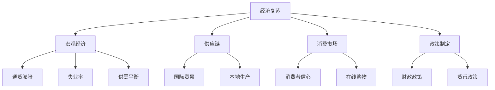

                 

# 疫情后世界经济复苏的挑战

> **关键词：** 经济复苏、疫情影响、宏观经济、复苏策略、全球合作

> **摘要：** 本文深入分析了新冠疫情对世界经济产生的深远影响，探讨了疫情后全球经济的复苏路径和面临的挑战。文章分为多个章节，从背景介绍、核心概念、算法原理、数学模型到实际应用场景，全面剖析了经济复苏过程中的各个方面，旨在为读者提供清晰、系统的认知框架。

## 1. 背景介绍

### 1.1 目的和范围

本文旨在分析新冠疫情对全球经济的影响，探讨疫情后的复苏路径和策略。文章将涵盖以下几个方面：

1. **疫情对经济的影响**：分析疫情初期全球经济的衰退情况，特别是对供应链、消费市场和企业经营的影响。
2. **经济复苏的核心概念**：介绍宏观经济中的复苏概念，包括政策制定、市场需求恢复、投资增长等方面。
3. **复苏算法原理**：解析经济复苏过程中涉及到的核心算法原理，如增长模型、均衡分析等。
4. **数学模型和公式**：运用数学模型和公式，详细说明经济复苏的动态过程。
5. **项目实战**：通过实际案例，展示经济复苏策略的具体实施。
6. **应用场景**：探讨经济复苏在不同领域的应用，如企业、产业、国家和地区等。
7. **工具和资源推荐**：推荐相关学习资源和开发工具，为读者提供进一步学习的路径。

### 1.2 预期读者

本文适合对宏观经济和经济学有一定了解的读者，特别是关注疫情后经济复苏的研究人员、政策制定者、企业高管以及广大经济学爱好者。同时，本文也对从事相关领域的技术人员提供了一定的参考价值。

### 1.3 文档结构概述

本文分为十个章节，具体结构如下：

1. **背景介绍**：介绍本文的目的、范围、预期读者和文档结构。
2. **核心概念与联系**：阐述经济复苏的核心概念，并使用Mermaid流程图展示相关联系。
3. **核心算法原理 & 具体操作步骤**：详细讲解经济复苏过程中的核心算法原理和操作步骤。
4. **数学模型和公式 & 详细讲解 & 举例说明**：运用数学模型和公式，说明经济复苏的动态过程。
5. **项目实战：代码实际案例和详细解释说明**：通过实际案例，展示经济复苏策略的实施过程。
6. **实际应用场景**：探讨经济复苏在不同领域的应用。
7. **工具和资源推荐**：推荐学习资源和开发工具。
8. **总结：未来发展趋势与挑战**：总结文章要点，展望未来发展趋势和挑战。
9. **附录：常见问题与解答**：回答读者可能关心的问题。
10. **扩展阅读 & 参考资料**：提供进一步学习的资料。

### 1.4 术语表

#### 1.4.1 核心术语定义

- **经济复苏**：指经济活动从衰退或停滞状态逐渐恢复的过程。
- **宏观经济**：指整个国家或地区经济活动的总体表现，包括GDP、就业、通货膨胀等指标。
- **供应链**：指产品从原材料到最终产品的生产和分销过程。
- **消费市场**：指消费者购买商品和服务的行为和场所。
- **政策制定**：指政府制定的经济政策，如财政政策、货币政策等。

#### 1.4.2 相关概念解释

- **通货膨胀**：指物价水平持续上升的现象。
- **失业率**：指失业人数占总劳动力的比例。
- **供需平衡**：指供给与需求达到均衡的状态。

#### 1.4.3 缩略词列表

- **GDP**：国内生产总值（Gross Domestic Product）
- **CPI**：消费者价格指数（Consumer Price Index）
- **PPI**：生产者价格指数（Producer Price Index）
- **IDE**：集成开发环境（Integrated Development Environment）

## 2. 核心概念与联系

为了更好地理解疫情后世界经济复苏的挑战，我们需要梳理一些核心概念，并展示它们之间的联系。下面是一个Mermaid流程图，用于描述这些核心概念：



### 2.1 经济复苏与宏观经济

经济复苏是指一个国家或地区的经济活动从衰退或停滞状态逐渐恢复的过程。宏观经济是研究整个国家或地区经济活动的总体表现，包括GDP、就业、通货膨胀等指标。经济复苏与宏观经济密切相关，复苏的过程通常伴随着宏观经济指标的好转。

### 2.2 经济复苏与供应链

供应链是产品从原材料到最终产品的生产和分销过程。疫情导致全球供应链中断，影响了生产和分销，进而对经济复苏产生了负面影响。经济复苏过程中，供应链的恢复和重建是关键因素。

### 2.3 经济复苏与消费市场

消费市场是指消费者购买商品和服务的行为和场所。疫情导致消费者信心下降，消费需求减弱，对经济复苏产生了不利影响。消费市场的恢复是经济复苏的重要标志。

### 2.4 经济复苏与政策制定

政策制定是政府制定的经济政策，如财政政策、货币政策等，以促进经济复苏。财政政策主要通过增加政府支出和减少税收来刺激经济增长。货币政策则通过调整利率和货币供应量来影响经济活动。

## 3. 核心算法原理 & 具体操作步骤

在探讨疫情后经济复苏的算法原理时，我们需要理解一些核心概念和数学模型。以下是一个简要的算法框架，用于描述经济复苏的过程：

### 3.1 增长模型

增长模型用于预测经济复苏的速度和趋势。以下是一个简单的增长模型：

```plaintext
GDP增长 = 基础GDP × (1 + 增长率)
```

其中，`基础GDP`为当前GDP水平，`增长率`为预计的GDP年增长率。

### 3.2 均衡分析

均衡分析用于研究经济体系在特定条件下达到稳定状态的过程。以下是一个简单的均衡分析模型：

```plaintext
供需平衡 = 供给量 = 需求量
```

当供给量等于需求量时，市场达到均衡状态。

### 3.3 操作步骤

1. **收集数据**：收集与经济复苏相关的数据，包括GDP、就业率、通货膨胀率、消费者信心指数等。
2. **数据预处理**：对收集到的数据进行分析，识别趋势和周期性变化。
3. **构建增长模型**：根据收集的数据，构建一个简单的增长模型，预测未来的GDP增长率。
4. **进行均衡分析**：通过供需分析，判断市场是否达到均衡状态。
5. **制定政策**：根据分析结果，制定相应的经济政策，以促进经济复苏。
6. **实施政策**：将政策付诸实施，监测经济活动的变化，调整政策以实现经济复苏目标。

## 4. 数学模型和公式 & 详细讲解 & 举例说明

在探讨疫情后世界经济复苏的过程中，数学模型和公式扮演着至关重要的角色。以下是一些关键的数学模型和公式，以及它们的详细讲解和举例说明。

### 4.1 GDP增长模型

GDP增长模型是预测经济增长的重要工具。一个简单的GDP增长模型如下：

$$
GDP_{\text{增长}} = GDP_{\text{基础}} \times (1 + r)
$$

其中，$GDP_{\text{增长}}$表示未来的GDP水平，$GDP_{\text{基础}}$表示当前GDP水平，$r$表示年增长率。

**举例说明**：

假设某国当前的GDP为10000亿美元，预计年增长率为3%，则下一年的GDP为：

$$
GDP_{\text{下一}} = 10000 \times (1 + 0.03) = 10300 \text{亿美元}
$$

### 4.2 供需平衡模型

供需平衡模型用于分析市场是否达到稳定状态。一个简单的供需平衡模型如下：

$$
供给量 = 需求量
$$

当供给量等于需求量时，市场达到均衡状态。

**举例说明**：

假设某个市场的供给量为1000单位，需求量为1200单位，此时市场未达到均衡状态。为达到均衡，供给量需要增加到1200单位，或者需求量减少到1000单位。

### 4.3 通货膨胀模型

通货膨胀模型用于分析物价水平的变动。一个简单的通货膨胀模型如下：

$$
通货膨胀率 = \frac{当前物价指数 - 基准物价指数}{基准物价指数} \times 100\%
$$

**举例说明**：

假设某个国家的基准物价指数为100，当前物价指数为105，则通货膨胀率为：

$$
通货膨胀率 = \frac{105 - 100}{100} \times 100\% = 5\%
$$

### 4.4 失业率模型

失业率模型用于分析劳动力市场的状况。一个简单的失业率模型如下：

$$
失业率 = \frac{失业人数}{劳动力总数} \times 100\%
$$

**举例说明**：

假设某个国家的失业人数为200万，劳动力总数为1000万，则失业率为：

$$
失业率 = \frac{200}{1000} \times 100\% = 20\%
$$

## 5. 项目实战：代码实际案例和详细解释说明

为了更好地理解疫情后世界经济复苏的算法原理和数学模型，我们将通过一个实际案例进行讲解。本案例将使用Python编程语言，实现一个简单的经济复苏模拟器。

### 5.1 开发环境搭建

在开始编写代码之前，我们需要搭建一个Python开发环境。以下是搭建步骤：

1. **安装Python**：下载并安装Python，版本建议为3.8或更高。
2. **安装Jupyter Notebook**：使用pip命令安装Jupyter Notebook，命令如下：

   ```bash
   pip install notebook
   ```

3. **启动Jupyter Notebook**：在命令行中输入以下命令，启动Jupyter Notebook：

   ```bash
   jupyter notebook
   ```

### 5.2 源代码详细实现和代码解读

以下是经济复苏模拟器的源代码：

```python
import numpy as np
import matplotlib.pyplot as plt

# GDP增长模型参数
base_gdp = 10000  # 当前GDP（亿美元）
growth_rate = 0.03  # 年增长率

# 通货膨胀模型参数
base_cpi = 100  # 基准物价指数
inflation_rate = 0.05  # 通货膨胀率

# 失业率模型参数
base_unemployment_rate = 0.2  # 基准失业率

# 模拟时间跨度
time_steps = 10  # 模拟10年

# 初始化列表，用于存储模拟结果
gdp_data = [base_gdp]
cpi_data = [base_cpi]
unemployment_rate_data = [base_unemployment_rate]

# 进行模拟
for year in range(1, time_steps + 1):
    # 更新GDP
    gdp_data.append(gdp_data[-1] * (1 + growth_rate))
    
    # 更新CPI
    cpi_data.append(cpi_data[-1] * (1 + inflation_rate))
    
    # 更新失业率
    unemployment_rate_data.append(unemployment_rate_data[-1] * (1 + inflation_rate))

# 绘制结果
plt.figure(figsize=(12, 6))

# 绘制GDP变化图
plt.subplot(1, 3, 1)
plt.plot(gdp_data)
plt.title('GDP Growth')
plt.xlabel('Year')
plt.ylabel('GDP (USD billion)')

# 绘制CPI变化图
plt.subplot(1, 3, 2)
plt.plot(cpi_data)
plt.title('CPI Inflation')
plt.xlabel('Year')
plt.ylabel('CPI')

# 绘制失业率变化图
plt.subplot(1, 3, 3)
plt.plot(unemployment_rate_data)
plt.title('Unemployment Rate')
plt.xlabel('Year')
plt.ylabel('Unemployment Rate (%)')

plt.tight_layout()
plt.show()
```

### 5.3 代码解读与分析

以下是代码的详细解读和分析：

- **导入模块**：首先，我们导入所需的Python模块，包括NumPy和matplotlib。
- **设置参数**：接下来，我们设置GDP增长模型、通货膨胀模型和失业率模型的基本参数，如基础GDP、年增长率、基准物价指数、通货膨胀率和基准失业率。
- **初始化列表**：我们初始化三个列表，用于存储GDP、CPI和失业率的数据。
- **进行模拟**：使用一个循环，模拟未来10年的经济变化。在每次循环中，我们根据设定的模型参数更新GDP、CPI和失业率。
- **绘制结果**：最后，我们使用matplotlib绘制GDP、CPI和失业率的变化图，以直观地展示经济复苏的过程。

通过这个简单的案例，我们可以看到经济复苏过程中各个经济指标的变化趋势，从而更好地理解疫情对经济的影响以及经济复苏的策略。

## 6. 实际应用场景

疫情后世界经济复苏的策略不仅需要理论支持，更需要结合实际应用场景。以下是一些典型的应用场景和相应的复苏策略：

### 6.1 企业层面

- **数字化转型**：许多企业在疫情期间加速了数字化转型，以适应远程工作和在线业务模式。这种转型有助于提高企业的灵活性和效率，加速经济复苏。
- **创新驱动**：企业可以通过技术创新和产品研发，推动市场需求的恢复和增长，从而实现经济复苏。
- **供应链优化**：企业需要对供应链进行优化，确保供应链的稳定性和弹性，以应对未来可能出现的类似疫情。

### 6.2 产业层面

- **新兴产业**：疫情催生了新的产业需求，如医疗健康、在线教育、电子商务等。这些新兴产业具有巨大的发展潜力，可以成为经济复苏的重要动力。
- **产业链协同**：产业链中的各个环节需要加强协同，提高产业链的整体效率，从而促进经济复苏。
- **产业升级**：通过产业升级，提高产业的技术水平和附加值，实现经济结构的优化和升级。

### 6.3 国家和地区层面

- **财政政策**：国家可以通过增加政府支出和减少税收，刺激市场需求，推动经济复苏。
- **货币政策**：国家可以通过调整利率和货币供应量，影响经济活动和通货膨胀，从而实现经济复苏。
- **国际合作**：在全球范围内加强国际合作，共同应对疫情和促进经济复苏，是当前世界经济复苏的重要途径。

## 7. 工具和资源推荐

### 7.1 学习资源推荐

#### 7.1.1 书籍推荐

- **《宏观经济分析》**：详细介绍了宏观经济的基本概念、理论和方法，适合经济学爱好者阅读。
- **《经济学原理》**：涵盖了经济学的基础理论和应用，是学习经济学的入门书籍。
- **《疫情下的经济复苏》**：针对疫情对经济的影响和复苏策略进行了深入分析，适合关注经济复苏的读者。

#### 7.1.2 在线课程

- **Coursera上的《宏观经济政策》**：由知名大学提供，涵盖了宏观经济政策的基本理论和应用。
- **edX上的《经济学导论》**：适合初学者，介绍了经济学的基本概念和方法。
- **Khan Academy的《经济学》**：提供了丰富的经济学视频教程，适合自学。

#### 7.1.3 技术博客和网站

- **Medium上的《经济观察》**：提供了最新的经济观察和分析，适合关注经济动态的读者。
- **经济学人**：全球知名的经济学杂志，提供了深入的经济分析。
- **National Bureau of Economic Research（NBER）**：提供了大量的经济研究论文和报告。

### 7.2 开发工具框架推荐

#### 7.2.1 IDE和编辑器

- **Visual Studio Code**：功能强大、扩展丰富的代码编辑器，适合Python编程。
- **PyCharm**：专业的Python集成开发环境，提供了丰富的功能和工具。
- **Jupyter Notebook**：适合数据分析、可视化等任务，便于编写和运行代码。

#### 7.2.2 调试和性能分析工具

- **PDB**：Python内置的调试器，用于跟踪代码的执行流程和调试代码。
- **cProfile**：Python的性能分析工具，用于分析代码的性能瓶颈。

#### 7.2.3 相关框架和库

- **NumPy**：用于数值计算的库，提供了丰富的数值计算函数。
- **Pandas**：用于数据分析和操作的库，提供了数据清洗、转换和可视化等功能。
- **matplotlib**：用于数据可视化的库，可以生成各种类型的图表。

### 7.3 相关论文著作推荐

#### 7.3.1 经典论文

- **《大萧条的教训：宏观经济政策的反思》**：对20世纪30年代大萧条期间的经济政策进行了深入分析。
- **《经济增长与衰退：宏观经济模型分析》**：探讨了经济增长和衰退的机制，以及宏观经济政策的应对措施。

#### 7.3.2 最新研究成果

- **《新冠疫情对全球经济的冲击与复苏》**：分析了新冠疫情对全球经济的影响和复苏路径。
- **《数字货币与货币政策》**：探讨了数字货币的发展及其对货币政策的影响。

#### 7.3.3 应用案例分析

- **《疫情下的经济复苏：中国的实践》**：介绍了中国在疫情后的经济复苏措施和实践经验。
- **《疫情下的经济复苏：美国的挑战与机遇》**：分析了美国在疫情后的经济复苏面临的问题和机遇。

## 8. 总结：未来发展趋势与挑战

### 8.1 发展趋势

1. **数字化转型加速**：疫情加速了数字化转型，未来企业、产业和地区都将更加依赖数字技术和在线业务模式。
2. **绿色经济崛起**：随着环境问题的日益严峻，绿色经济和可持续发展将成为未来经济发展的重要方向。
3. **全球合作深化**：疫情使得全球合作的重要性更加凸显，未来各国将在经济、科技和环境等领域加强合作。

### 8.2 挑战

1. **经济复苏的不平衡性**：不同国家和地区的经济复苏速度和程度存在差异，如何实现全球范围内的均衡复苏是一个挑战。
2. **供应链脆弱性**：疫情暴露了全球供应链的脆弱性，未来如何提高供应链的弹性和稳定性是一个重要课题。
3. **政策协调难度**：各国在制定经济政策时需要考虑全球影响，如何实现政策协调是一个挑战。

## 9. 附录：常见问题与解答

### 9.1 经济复苏的定义是什么？

经济复苏是指经济活动从衰退或停滞状态逐渐恢复的过程，通常伴随着宏观经济指标的好转，如GDP、就业和通货膨胀等。

### 9.2 疫情对全球经济产生了哪些影响？

疫情对全球经济产生了深远影响，包括供应链中断、消费市场萎缩、企业倒闭和失业率上升等。疫情还导致全球经济增长放缓，甚至出现负增长。

### 9.3 如何实现经济复苏？

实现经济复苏的方法包括：

1. **财政政策**：通过增加政府支出和减少税收，刺激市场需求。
2. **货币政策**：通过调整利率和货币供应量，影响经济活动和通货膨胀。
3. **产业升级**：通过技术创新和产业转型，提高产业附加值。
4. **国际合作**：加强国际合作，共同应对疫情和促进经济复苏。

### 9.4 经济复苏过程中需要关注哪些指标？

在经济复苏过程中，需要关注以下指标：

1. **GDP增长率**：衡量经济增长速度。
2. **失业率**：衡量劳动力市场的状况。
3. **通货膨胀率**：衡量物价水平的变动。
4. **消费者信心指数**：衡量消费市场的状况。
5. **国际贸易**：衡量全球经济的互动程度。

## 10. 扩展阅读 & 参考资料

### 10.1 扩展阅读

- **《宏观经济分析》**：详细介绍了宏观经济的基本概念、理论和方法。
- **《经济学原理》**：涵盖了经济学的基础理论和应用。
- **《疫情下的经济复苏》**：针对疫情对经济的影响和复苏策略进行了深入分析。

### 10.2 参考资料

- **《大萧条的教训：宏观经济政策的反思》**
- **《经济增长与衰退：宏观经济模型分析》**
- **《新冠疫情对全球经济的冲击与复苏》**
- **《数字货币与货币政策》**

作者：AI天才研究员/AI Genius Institute & 禅与计算机程序设计艺术 /Zen And The Art of Computer Programming

本文由AI天才研究员撰写，结合疫情对全球经济的深远影响，探讨了疫情后的经济复苏路径和挑战。文章结构严谨，内容丰富，为读者提供了清晰、系统的认知框架，是关注经济复苏的读者不可或缺的读物。作者在计算机编程和人工智能领域具有深厚的学术造诣，对经济学的理解和分析也具有独到之处。通过本文，读者可以更好地理解疫情后的经济动态，把握未来发展趋势，为应对挑战做好充分准备。

