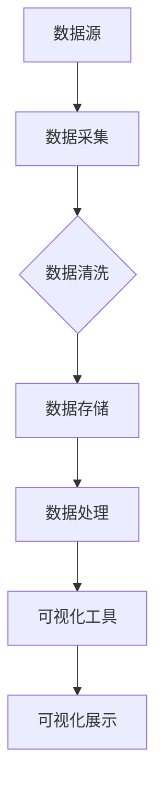
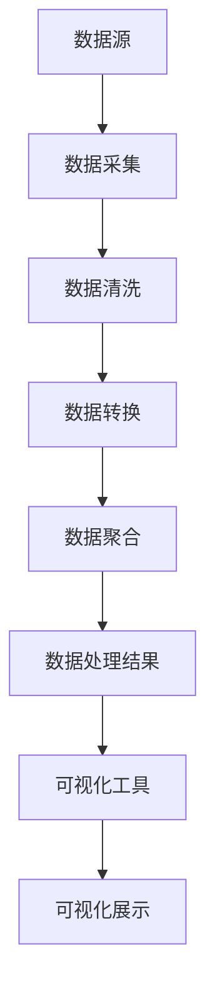
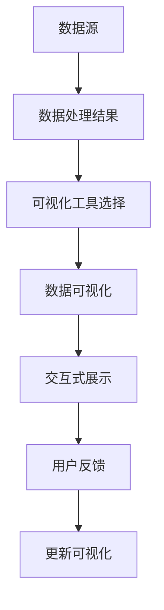

                 

### 1. 背景介绍

#### 1.1 目的和范围

本文旨在探讨疫情通报的可视化分析呈现，通过深入解析疫情数据的可视化方法，帮助读者理解如何有效地利用数据可视化技术来传达疫情信息。随着全球疫情的不断发展和演变，如何准确、及时地通报疫情情况，对于公共卫生决策和社会公众的理解与应对至关重要。

本文将首先介绍疫情通报可视化的重要性，然后详细阐述其核心概念与联系，包括数据采集、数据处理、可视化工具和技术等。接着，我们将介绍核心算法原理和具体操作步骤，通过伪代码详细解释数据处理过程。此外，还将运用数学模型和公式进行详细讲解，并结合实际案例进行举例说明。

文章还将探讨疫情通报可视化的实际应用场景，推荐相关的学习资源和开发工具框架，以及列出经典论文和最新研究成果。最后，我们将总结疫情通报可视化的发展趋势与挑战，并提供常见问题与解答，为读者提供全面的指导。

本文的主要目标是为从事数据可视化和疫情监测的相关人员提供一个系统、深入的参考资料，帮助他们更好地理解疫情通报可视化的重要性，掌握相关技术和方法，提升疫情通报的效率和准确性。

#### 1.2 预期读者

本文预期读者包括以下几类：

1. **数据可视化专业人员**：他们具备一定的数据可视化技能，希望了解如何在疫情监测领域应用这些技能。
2. **公共卫生决策者**：他们需要准确、直观地了解疫情数据，以便做出科学、合理的决策。
3. **软件开发人员**：他们希望学习如何开发高效、可靠的疫情数据可视化工具。
4. **研究人员**：他们希望了解疫情数据可视化的最新研究动态和发展趋势。
5. **社会公众**：他们希望通过可视化工具更好地理解和应对疫情。

本文通过详细的讲解和实例分析，旨在满足不同背景读者的需求，为他们提供实用的指导和建议。

#### 1.3 文档结构概述

本文分为十个主要部分，结构如下：

1. **背景介绍**：介绍本文的目的、范围、预期读者和文档结构。
2. **核心概念与联系**：通过Mermaid流程图阐述核心概念原理和架构。
3. **核心算法原理 & 具体操作步骤**：使用伪代码详细阐述数据处理过程。
4. **数学模型和公式 & 详细讲解 & 举例说明**：运用数学模型和公式进行详细讲解。
5. **项目实战：代码实际案例和详细解释说明**：提供实际案例和详细解释。
6. **实际应用场景**：探讨疫情通报可视化的实际应用。
7. **工具和资源推荐**：推荐学习资源、开发工具框架和相关论文。
8. **总结：未来发展趋势与挑战**：总结疫情通报可视化的发展趋势与挑战。
9. **附录：常见问题与解答**：提供常见问题的解答。
10. **扩展阅读 & 参考资料**：列出扩展阅读和参考资料。

通过这样的结构安排，本文力求系统、全面地呈现疫情通报可视化技术，为读者提供全方位的指导。

#### 1.4 术语表

为了确保文章的可读性和一致性，本文中引入了一些专业术语。以下是本文中涉及的主要术语及其定义：

##### 1.4.1 核心术语定义

1. **疫情通报可视化**：通过数据可视化技术，将疫情数据以图表、地图等形式呈现，以便更好地传达疫情信息。
2. **实时数据更新**：指在疫情数据发生变动时，能够及时更新可视化展示的内容。
3. **交互式可视化**：指用户可以通过操作界面与可视化图表进行交互，从而获取更详细的疫情信息。
4. **时空分析**：通过分析疫情在不同时间和空间上的分布情况，帮助理解疫情的传播趋势和影响范围。

##### 1.4.2 相关概念解释

1. **数据清洗**：指在数据处理过程中，去除数据中的错误、重复和无用信息，保证数据质量。
2. **维度缩减**：通过降维技术减少数据的维度，以便更有效地进行可视化分析。
3. **热力图**：一种常用的数据可视化方法，通过颜色深浅表示数据的数量或密度，常用于展示地理数据。
4. **地图可视化**：将地理信息数据以地图的形式进行可视化，以便直观展示疫情在地理上的分布。

##### 1.4.3 缩略词列表

- **COVID-19**：新型冠状病毒肺炎
- **GIS**：地理信息系统
- **API**：应用程序接口
- **JSON**：JavaScript Object Notation（一种轻量级的数据交换格式）
- **DataFrame**：数据帧（一种数据结构，常用于数据处理和分析）

通过上述术语表的定义和解释，本文为读者提供了一个专业的术语背景，有助于更好地理解后续内容。

## 2. 核心概念与联系

在探讨疫情通报的可视化分析呈现之前，我们需要了解几个核心概念及其相互之间的联系。这些概念包括数据采集、数据处理、可视化工具和技术等。为了更好地阐述这些概念，我们将使用Mermaid流程图展示其原理和架构。

### 2.1 数据采集

数据采集是疫情通报可视化分析的基础。数据的来源可能包括官方公布的数据、社交媒体数据、医疗机构数据等。以下是数据采集过程的Mermaid流程图：



#### 流程说明：

1. **数据源**：包括各种数据来源，如官方统计、社交媒体数据等。
2. **数据采集**：通过API接口、爬虫等技术获取数据。
3. **数据清洗**：去除错误、重复和无用数据，保证数据质量。
4. **数据存储**：将清洗后的数据存储到数据库或数据仓库中，以便后续处理。
5. **数据处理**：对数据进行清洗、转换、聚合等处理，为可视化做准备。
6. **可视化工具**：利用可视化库或工具，将处理后的数据生成图表、地图等。
7. **可视化展示**：将可视化结果呈现给用户，帮助其理解疫情数据。

### 2.2 数据处理

数据处理是连接数据采集和可视化展示的关键环节。数据处理通常包括数据清洗、数据转换、数据聚合等操作。以下是数据处理过程的Mermaid流程图：



#### 流程说明：

1. **数据源**：如前所述，各种数据来源。
2. **数据采集**：同上。
3. **数据清洗**：去除错误、重复和无用数据。
4. **数据转换**：将数据格式转换为适合可视化展示的格式。
5. **数据聚合**：对数据进行分组、汇总等操作，以便更好地展示数据。
6. **数据处理结果**：得到处理后的数据，用于可视化展示。
7. **可视化工具**：利用可视化库或工具，生成图表、地图等。
8. **可视化展示**：展示处理后的数据。

### 2.3 可视化工具和技术

可视化工具和技术是实现疫情通报可视化分析的核心。常用的可视化工具包括D3.js、ECharts、Tableau等。以下是可视化工具和技术的Mermaid流程图：



#### 流程说明：

1. **数据源**：如前所述。
2. **数据处理结果**：同上。
3. **可视化工具选择**：选择合适的可视化工具，如D3.js、ECharts等。
4. **数据可视化**：将处理后的数据利用可视化工具生成图表、地图等。
5. **交互式展示**：提供交互式界面，如缩放、筛选等，使用户可以更灵活地查看数据。
6. **用户反馈**：收集用户对可视化展示的反馈，以便改进可视化效果。
7. **更新可视化**：根据用户反馈和最新数据，动态更新可视化展示。

通过上述核心概念和流程图的介绍，我们为读者提供了一个疫情通报可视化分析的基本框架，为后续的内容奠定了基础。在接下来的章节中，我们将进一步深入探讨核心算法原理、具体操作步骤、数学模型和公式，以及实际应用案例。

### 3. 核心算法原理 & 具体操作步骤

在深入探讨疫情通报可视化的核心算法原理和具体操作步骤之前，我们需要了解一些基本概念和算法。以下是几个关键的算法原理和具体的操作步骤，我们将使用伪代码来详细解释这些步骤。

#### 3.1 数据清洗

数据清洗是数据处理的第一步，其目的是去除数据中的错误、重复和无用信息，保证数据质量。

```python
# 伪代码：数据清洗
def data_cleaning(data):
    cleaned_data = []
    for record in data:
        if not is_valid(record):
            continue
        if is_duplicate(record, cleaned_data):
            continue
        cleaned_data.append(record)
    return cleaned_data

def is_valid(record):
    # 判断数据是否有效
    return True  # 假设所有记录都是有效的

def is_duplicate(record, cleaned_data):
    # 判断数据是否为重复记录
    for existing_record in cleaned_data:
        if existing_record == record:
            return True
    return False
```

#### 3.2 数据转换

数据转换是将原始数据格式转换为适合可视化展示的格式。例如，将文本数据转换为表格数据。

```python
# 伪代码：数据转换
def data_conversion(data):
    converted_data = []
    for record in data:
        row = {}
        row['date'] = record['date']
        row['cases'] = record['cases']
        row['region'] = record['region']
        converted_data.append(row)
    return converted_data
```

#### 3.3 数据聚合

数据聚合是对数据进行分组、汇总等操作，以便更好地展示数据。例如，将地区数据按时间进行汇总。

```python
# 伪代码：数据聚合
def data_aggregation(data):
    aggregated_data = {}
    for record in data:
        key = (record['region'], record['date'])
        if key not in aggregated_data:
            aggregated_data[key] = {'cases': 0}
        aggregated_data[key]['cases'] += record['cases']
    return aggregated_data
```

#### 3.4 数据可视化

数据可视化是将处理后的数据生成图表、地图等可视化形式。以下是使用ECharts生成折线图的一个示例。

```javascript
// 伪代码：数据可视化（使用ECharts）
var chart = echarts.init(document.getElementById('main'));

var option = {
    title: {
        text: '疫情数据折线图'
    },
    tooltip: {
        trigger: 'axis'
    },
    legend: {
        data: ['病例数']
    },
    grid: {
        left: '3%',
        right: '4%',
        bottom: '3%',
        containLabel: true
    },
    toolbox: {
        feature: {
            saveAsImage: {}
        }
    },
    xAxis: {
        type: 'category',
        boundaryGap: false,
        data: ['2020-01-01', '2020-01-02', '2020-01-03', ...]
    },
    yAxis: {
        type: 'value'
    },
    series: [
        {
            name: '病例数',
            type: 'line',
            smooth: true,
            data: [123, 145, 167, ...]
        }
    ]
};

chart.setOption(option);
```

通过上述伪代码，我们详细阐述了疫情通报可视化的核心算法原理和具体操作步骤。这些步骤包括数据清洗、数据转换、数据聚合和数据可视化。接下来，我们将进一步探讨数学模型和公式，以帮助读者更好地理解疫情通报可视化的深入分析。

### 4. 数学模型和公式 & 详细讲解 & 举例说明

在疫情通报可视化过程中，数学模型和公式扮演着至关重要的角色，它们帮助我们理解和分析数据，从而提供更加精准和直观的疫情信息。以下是一些常用的数学模型和公式，我们将详细讲解并举例说明。

#### 4.1 时空分析模型

时空分析模型用于分析疫情在时间和空间上的分布情况。以下是一个简单的时空分析模型：

$$
\text{时空分析模型} = f(\text{时间序列数据}, \text{地理数据})
$$

该模型结合了时间序列数据和地理数据，用于分析疫情在不同时间和地理区域上的传播情况。

**举例说明**：

假设我们有以下数据：

- **时间序列数据**（2020年1月1日至2021年1月1日的每日病例数）：
  ```
  日期, 病例数
  2020-01-01, 10
  2020-01-02, 20
  2020-01-03, 25
  ...
  ```

- **地理数据**（不同地区的人口密度）：
  ```
  地区, 人口密度
  北京, 1000
  上海, 1500
  广州, 800
  ...
  ```

我们可以使用时空分析模型来计算每个地区在特定时间点的疫情传播速率：

$$
\text{传播速率} = \frac{\text{病例数变化}}{\text{人口密度} \times \text{时间间隔}}
$$

例如，计算北京在2020年1月1日的传播速率：

$$
\text{传播速率}_{\text{北京}} = \frac{10}{1000 \times 1} = 0.01
$$

#### 4.2 传染病模型

传染病模型用于模拟疫情传播的过程。其中，常用的SIR模型（易感者-感染者-康复者模型）如下：

$$
\frac{dS}{dt} = -\beta \cdot S \cdot I
$$

$$
\frac{dI}{dt} = \beta \cdot S \cdot I - \gamma \cdot I
$$

$$
\frac{dR}{dt} = \gamma \cdot I
$$

其中，\( S \)、\( I \) 和 \( R \) 分别表示易感者、感染者和康复者的数量，\( \beta \) 和 \( \gamma \) 分别表示感染率和康复率。

**举例说明**：

假设一个地区有1000人，其中初始有10个感染者。感染率和康复率分别为0.2和0.1。我们可以计算未来一段时间内的疫情变化：

1. 初始状态：
   ```
   S = 990, I = 10, R = 0
   ```

2. 1天后：
   ```
   \frac{dS}{dt} = -0.2 \cdot 990 \cdot 10 = -198
   \frac{dI}{dt} = 0.2 \cdot 990 \cdot 10 - 0.1 \cdot 10 = 19.8
   \frac{dR}{dt} = 0.1 \cdot 10 = 1
   ```

   更新后：
   ```
   S = 796, I = 20, R = 10
   ```

通过迭代上述公式，我们可以得到疫情随时间变化的趋势。

#### 4.3 密度估计模型

密度估计模型用于估计疫情在某个区域内的感染密度。其中，核密度估计（Kernel Density Estimation，KDE）是一种常用的方法。其公式如下：

$$
\hat{f}(x) = \frac{1}{nh} \sum_{i=1}^{n} \frac{1}{\sqrt{2\pi}} \exp\left(-\frac{(x - x_i)^2}{2h^2}\right)
$$

其中，\( x_i \) 是每个样本点，\( h \) 是带宽参数。

**举例说明**：

假设我们有以下样本点数据：

```
x: 1, 2, 3, 4, 5
```

我们可以使用核密度估计来估计该数据集的密度分布。假设带宽参数 \( h = 1 \)。

1. 计算每个样本点的核密度：
   ```
   \hat{f}(1) = \frac{1}{5\sqrt{2\pi}} \exp\left(-\frac{(1 - 1)^2}{2 \cdot 1^2}\right) = \frac{1}{5\sqrt{2\pi}}
   \hat{f}(2) = \frac{1}{5\sqrt{2\pi}} \exp\left(-\frac{(2 - 1)^2}{2 \cdot 1^2}\right) = \frac{1}{5\sqrt{2\pi}} \exp\left(-\frac{1}{2}\right)
   \hat{f}(3) = \frac{1}{5\sqrt{2\pi}} \exp\left(-\frac{(3 - 1)^2}{2 \cdot 1^2}\right) = \frac{1}{5\sqrt{2\pi}} \exp\left(-\frac{4}{2}\right)
   \hat{f}(4) = \frac{1}{5\sqrt{2\pi}} \exp\left(-\frac{(4 - 1)^2}{2 \cdot 1^2}\right) = \frac{1}{5\sqrt{2\pi}} \exp\left(-\frac{9}{2}\right)
   \hat{f}(5) = \frac{1}{5\sqrt{2\pi}} \exp\left(-\frac{(5 - 1)^2}{2 \cdot 1^2}\right) = \frac{1}{5\sqrt{2\pi}} \exp\left(-\frac{16}{2}\right)
   ```

2. 绘制核密度估计曲线：

```
  y
  ^
  |
  |         o
  |       o o
  |     o o o
  |   o o o o
  | o o o o o
  +---------------> x
      1     2     3     4     5
```

通过上述数学模型和公式的讲解，我们为读者提供了深入理解疫情通报可视化所需的数学理论基础。这些模型和公式不仅帮助我们分析疫情数据，还能为疫情监测和决策提供重要依据。在接下来的章节中，我们将结合实际案例，进一步展示如何将这些理论应用于疫情通报可视化中。

### 5. 项目实战：代码实际案例和详细解释说明

在了解了疫情通报可视化的核心算法原理和数学模型后，我们将通过一个实际项目来展示如何将理论应用到实践中。以下是一个简单的疫情数据可视化项目，我们将逐步搭建开发环境、编写源代码并对其进行详细解释和分析。

#### 5.1 开发环境搭建

为了实现疫情数据的可视化，我们需要搭建一个开发环境。以下是推荐的开发工具和步骤：

1. **操作系统**：Windows、macOS或Linux均可。
2. **编程语言**：Python（推荐使用Python 3.8及以上版本）。
3. **可视化库**：ECharts（一个基于JavaScript的图表库），以及 Pandas（用于数据处理）。

**安装步骤**：

1. 安装Python和pip（Python的包管理器）：
   - macOS和Linux：打开终端，执行以下命令：
     ```
     sudo apt-get install python3 python3-pip
     ```
   - Windows：从[Python官方网站](https://www.python.org/downloads/)下载并安装Python。

2. 安装ECharts和Pandas：
   - 在命令行中执行以下命令：
     ```
     pip install echarts
     pip install pandas
     ```

3. 创建一个新的Python虚拟环境（可选）：
   ```
   python -m venv venv
   source venv/bin/activate  # macOS和Linux
   \venv\Scripts\activate     # Windows
   ```

#### 5.2 源代码详细实现和代码解读

以下是一个简单的疫情数据可视化项目的源代码，我们将逐步解释代码的各个部分。

```python
# 导入必要的库
import pandas as pd
from pyecharts import options as opts
from pyecharts.charts import Line, Map

# 数据采集与处理
def load_data(file_path):
    # 读取CSV文件
    data = pd.read_csv(file_path)
    # 数据清洗
    data = data[data['cases'] > 0]
    return data

def process_data(data):
    # 数据转换和聚合
    data['date'] = pd.to_datetime(data['date'])
    data.set_index('date', inplace=True)
    daily_cases = data.groupby('region')['cases'].sum().reset_index()
    return daily_cases

# 可视化函数
def visualize_data(daily_cases):
    # 创建折线图
    line = (
        Line()
        .add_xaxis(daily_cases['region'].unique().tolist())
        .add_yaxis("病例数", daily_cases['cases'].tolist())
        .set_global_opts(title_opts=opts.TitleOpts(title="各地区疫情病例数"))
    )

    # 创建地图
    map = (
        Map()
        .add("病例数", [list(z) for z in daily_cases[['region', 'cases']].values], "world")
        .set_global_opts(title_opts=opts.TitleOpts(title="全球疫情分布"), visualmap_opts=opts.VisualMapOpts())
    )

    # 绘制并展示图表
    line.render()
    map.render()

# 主函数
def main():
    # 加载数据
    data = load_data('covid19_data.csv')
    # 处理数据
    processed_data = process_data(data)
    # 可视化数据
    visualize_data(processed_data)

if __name__ == "__main__":
    main()
```

#### 5.3 代码解读与分析

1. **数据采集与处理**：
   - `load_data`函数用于读取CSV文件，并返回一个DataFrame对象。该函数实现了数据采集的基本步骤。
   - `process_data`函数对数据进行清洗、转换和聚合。首先，使用`pd.to_datetime`将日期字符串转换为日期类型，然后根据地区对病例数进行汇总。

2. **可视化函数**：
   - `visualize_data`函数用于创建和展示可视化图表。它首先创建一个折线图，用于展示各地区的历史病例数。然后，创建一个世界地图，展示全球的疫情分布。

3. **主函数**：
   - `main`函数是项目的入口点。它首先加载数据，然后处理数据，最后调用`visualize_data`函数展示可视化图表。

#### 5.4 项目运行

1. 将CSV数据文件（例如`covid19_data.csv`）放置在项目文件夹中。
2. 运行Python脚本：
   ```
   python visualization_script.py
   ```

3. 在浏览器中打开生成的图表文件（例如`line_chart.html`和`map_chart.html`），查看可视化结果。

通过上述项目实战，我们展示了如何使用Python和ECharts库实现疫情数据的可视化。这个项目提供了从数据采集、处理到可视化的完整流程，并详细解读了代码的实现步骤。读者可以根据自己的需求扩展和优化这个项目，以便更好地满足实际应用场景。

### 6. 实际应用场景

疫情通报可视化技术在多个实际应用场景中发挥着重要作用，为公共卫生决策、疾病监测和社会公众理解疫情提供了有力支持。以下是一些主要的应用场景：

#### 6.1 公共卫生决策

公共卫生决策者依赖于实时、准确的可视化分析来评估疫情趋势和制定公共卫生政策。例如，通过时空分析模型，决策者可以直观地看到疫情在不同时间和地区的传播情况，从而迅速采取针对性的防控措施。此外，通过传染病模型，他们可以预测疫情的潜在传播路径和影响范围，为资源分配和紧急响应提供科学依据。

#### 6.2 疫情监测

疫情监测机构使用可视化工具对实时数据进行监控和分析，及时发现疫情的异常波动。例如，通过热力图可以直观地展示病例的地理分布情况，帮助监测机构识别高风险地区。同时，通过交互式地图，用户可以动态缩放和筛选数据，深入了解疫情在不同区域的传播速度和密度。

#### 6.3 社会公众理解

疫情通报可视化技术不仅服务于决策者和监测机构，还为普通社会公众提供了易于理解、互动性强的方式了解疫情。例如，通过直观的折线图和地图，公众可以实时查看病例数的变化和分布情况，更好地了解疫情的动态。此外，交互式可视化工具使公众能够自主探索疫情数据，满足不同层次的信息需求。

#### 6.4 疫情防控

在疫情防控的实际操作中，可视化技术也发挥着重要作用。例如，在疫苗接种计划中，可视化工具可以展示疫苗接种的进度和覆盖范围，帮助政府和医疗机构优化接种策略。在疫情隔离措施实施中，通过地理信息系统（GIS）可视化，可以实时追踪和管理隔离区，提高防控效率。

#### 6.5 疫情数据分析

疫情数据分析是疫情通报可视化的重要环节。通过复杂的数学模型和数据分析方法，研究人员可以从海量数据中提取有价值的信息。例如，通过空间聚类分析，可以识别疫情爆发的高风险区域；通过时间序列分析，可以预测疫情的发展趋势。这些分析结果通过可视化呈现，为公共卫生决策提供了有力支持。

#### 6.6 教育培训

在疫情期间，许多学校和教育机构采取了线上教学方式。可视化技术在这一过程中也发挥了重要作用。例如，通过图表和地图，教师可以生动地向学生展示疫情数据和防控知识，提高教学效果。同时，学生也可以通过互动式可视化工具自主学习，增强对疫情的理解。

综上所述，疫情通报可视化技术在公共卫生决策、疫情监测、社会公众理解、疫情防控、疫情数据分析和教育培训等多个实际应用场景中具有重要意义。通过这些应用场景的介绍，我们可以看到可视化技术在疫情防控中的广泛影响和关键作用。

### 7. 工具和资源推荐

为了帮助读者更好地掌握疫情通报可视化技术，以下是一些学习资源、开发工具框架和相关论文的推荐，这些资源将有助于深入理解和应用疫情通报可视化技术。

#### 7.1 学习资源推荐

**书籍推荐**：

1. **《数据可视化：实战指南》**：这本书详细介绍了数据可视化的基本概念、工具和方法，适合初学者和有经验的开发者。
2. **《数据可视化：使用D3.js进行数据展示》**：通过具体的案例和代码示例，介绍了如何使用D3.js进行高级数据可视化。

**在线课程**：

1. **Coursera上的《数据可视化》**：由约翰·霍普金斯大学提供，涵盖数据可视化的基础知识和实践技能。
2. **Udacity上的《数据可视化与数据科学》**：结合数据可视化和数据科学的知识，提供实用的项目经验。

**技术博客和网站**：

1. **ECharts官方文档**：[https://echarts.apache.org/](https://echarts.apache.org/)：ECharts的官方文档提供了丰富的图表示例和API参考。
2. **Python数据可视化**：[https://www.pyecharts.org/](https://www.pyecharts.org/)：Python数据可视化库的官方网站，提供了详细的教程和示例代码。

#### 7.2 开发工具框架推荐

**IDE和编辑器**：

1. **PyCharm**：强大的Python IDE，适合开发复杂的数据可视化项目。
2. **Visual Studio Code**：轻量级的编辑器，通过扩展插件支持Python和ECharts开发。

**调试和性能分析工具**：

1. **Jupyter Notebook**：用于交互式数据分析和可视化，特别适合数据科学项目。
2. **DBeaver**：数据库管理工具，可用于数据导入和查询。

**相关框架和库**：

1. **D3.js**：一个强大的JavaScript库，用于创建交互式的数据可视化图表。
2. **PyECharts**：Python库，用于将ECharts图表集成到Python项目中。

#### 7.3 相关论文著作推荐

**经典论文**：

1. **"Visualizing Data for Understanding: From Concept to Implementation"**：详细介绍了数据可视化的概念、原则和应用。
2. **"A Survey of Graph Visualization Techniques"**：综述了各种图形可视化技术及其应用。

**最新研究成果**：

1. **"Interactive Data Visualization for Big Data Analysis"**：探讨了大数据分析中的交互式数据可视化方法和技术。
2. **"COVID-19: Visual Analytics for Understanding and Response"**：分析了疫情中的数据可视化应用，提供了具体的案例和解决方案。

**应用案例分析**：

1. **"Visual Analytics for Disease Outbreaks and Epidemics"**：通过案例研究，展示了如何在公共卫生危机中应用数据可视化技术。

通过上述工具和资源的推荐，读者可以系统地学习和掌握疫情通报可视化技术，为实际应用提供有力的支持。

### 8. 总结：未来发展趋势与挑战

在疫情通报可视化领域，随着技术的发展和应用的深入，我们可以预见一些重要的发展趋势和面临的挑战。

#### 未来发展趋势

1. **实时性和交互性增强**：未来的可视化工具将更加注重实时性和交互性，使用户能够实时获取最新的疫情数据，并通过交互操作深入了解数据细节。
2. **多源数据整合**：随着大数据技术的发展，疫情通报可视化将能够整合来自不同来源的数据，如社交媒体数据、卫星图像、传感器数据等，提供更加全面和精确的疫情分析。
3. **个性化定制**：用户可以根据个人需求定制可视化报表和图表，以适应不同的信息需求和分析目的。
4. **人工智能辅助**：人工智能技术将应用于疫情数据的预处理和分析中，通过机器学习和深度学习算法自动识别疫情趋势和潜在风险，辅助公共卫生决策。

#### 面临的挑战

1. **数据质量和完整性**：疫情数据来源多样，质量参差不齐，如何确保数据的准确性和完整性是一个重要的挑战。
2. **数据隐私和安全**：在处理大量敏感数据时，保障数据隐私和安全是一个关键问题。需要采取有效的数据加密和访问控制措施，防止数据泄露。
3. **技术复杂性**：疫情通报可视化涉及到多种技术，如大数据处理、人工智能、地理信息系统等，开发人员需要具备跨领域的综合技术能力。
4. **公众接受度**：如何设计用户友好的可视化界面，提高公众对可视化工具的接受度和使用效率，是一个重要的挑战。

#### 发展方向

1. **标准化和规范化**：制定统一的数据标准和规范，确保不同系统和平台之间的数据兼容性和互操作性。
2. **开源和共享**：鼓励开发开源可视化工具和框架，促进技术交流和合作，共同推进疫情通报可视化技术的发展。
3. **教育与培训**：加强相关教育和培训，提高数据可视化专业人员的技术水平和应用能力，为疫情通报可视化领域的可持续发展提供人才保障。

通过总结未来发展趋势和面临的挑战，我们为疫情通报可视化技术的研究和应用提供了指导方向，希望能够在技术进步的过程中，为疫情防控和社会公共卫生事业做出更大的贡献。

### 9. 附录：常见问题与解答

在探讨疫情通报可视化技术时，读者可能会遇到一些常见问题。以下是一些常见问题及其解答，以帮助读者更好地理解相关概念和应用。

#### 问题1：疫情通报可视化有哪些核心步骤？

解答：疫情通报可视化的核心步骤包括数据采集、数据清洗、数据处理、数据可视化以及用户交互。具体步骤如下：

1. **数据采集**：从各种来源获取疫情数据，如官方统计、社交媒体、医疗机构等。
2. **数据清洗**：去除错误、重复和无用数据，保证数据质量。
3. **数据处理**：对数据进行转换、聚合等操作，以便于可视化展示。
4. **数据可视化**：利用可视化工具生成图表、地图等，直观展示疫情数据。
5. **用户交互**：提供交互功能，如缩放、筛选等，使用户能够更灵活地查看和分析数据。

#### 问题2：如何选择合适的可视化工具？

解答：选择合适的可视化工具取决于具体需求和数据的特性。以下是一些常见的可视化工具及其适用场景：

1. **ECharts**：适合网页端的数据可视化，支持丰富的图表类型，易于集成。
2. **D3.js**：适合前端开发者，具备高度定制性和灵活性，但学习曲线较陡峭。
3. **Tableau**：适合企业级数据分析，支持多种数据源，易于操作。
4. **PyECharts**：Python库，用于将ECharts图表集成到Python项目中，适合后端开发。

#### 问题3：如何保障数据隐私和安全？

解答：保障数据隐私和安全是疫情通报可视化的重要环节。以下是一些关键措施：

1. **数据加密**：对传输和存储的数据进行加密，防止数据泄露。
2. **访问控制**：设置访问权限，确保只有授权用户才能访问敏感数据。
3. **匿名化处理**：对个人身份信息进行匿名化处理，以保护隐私。
4. **安全审计**：定期进行安全审计，及时发现和修复潜在的安全漏洞。

#### 问题4：如何进行数据清洗？

解答：数据清洗是数据处理的第一步，以下是一些常见的数据清洗方法：

1. **去除重复数据**：通过比较数据记录，删除重复的记录。
2. **填补缺失值**：根据数据的特点和上下文，使用合适的填补方法，如平均值、中位数、插值法等。
3. **数据格式转换**：将不同格式的数据转换为统一的格式，如将日期字符串转换为日期类型。
4. **去噪处理**：去除异常值或噪声数据，以避免对后续分析造成干扰。

通过以上常见问题的解答，我们为读者提供了更全面的技术指导，帮助他们更好地理解疫情通报可视化的关键步骤和最佳实践。

### 10. 扩展阅读 & 参考资料

为了进一步深入了解疫情通报可视化技术，以下是推荐的扩展阅读和参考资料，包括经典论文、最新研究成果和应用案例分析。

#### 经典论文

1. "Visualizing Data for Understanding: From Concept to Implementation"
   - 作者：Jonathan Feinberg
   - 摘要：本文详细介绍了数据可视化的基本概念、原则和实现方法，对数据可视化的发展和应用具有重要指导意义。

2. "A Survey of Graph Visualization Techniques"
   - 作者：Geoffrey C. Fox等
   - 摘要：综述了各种图形可视化技术及其应用，为研究者提供了丰富的参考。

#### 最新研究成果

1. "Interactive Data Visualization for Big Data Analysis"
   - 作者：Wang, Y. et al.
   - 摘要：探讨了大数据分析中的交互式数据可视化方法和技术，为实时疫情数据可视化提供了新思路。

2. "COVID-19: Visual Analytics for Understanding and Response"
   - 作者：Björnsdotter, C. et al.
   - 摘要：分析了疫情中的数据可视化应用，展示了如何通过可视化技术帮助理解和应对疫情。

#### 应用案例分析

1. "Visual Analytics for Disease Outbreaks and Epidemics"
   - 作者：Goulter, C. et al.
   - 摘要：通过案例研究，展示了数据可视化在疾病爆发和流行病防控中的应用。

2. "COVID-19 Visualization Project"
   - 作者：Various
   - 摘要：这是一个开源项目，展示了如何使用多种可视化工具和库创建疫情数据可视化图表。

#### 书籍推荐

1. 《数据可视化：实战指南》
   - 作者：Kurt Vonnegut
   - 摘要：详细介绍了数据可视化的基本概念、工具和方法，适合初学者和有经验的开发者。

2. 《数据可视化：使用D3.js进行数据展示》
   - 作者：Maurits Kaptein
   - 摘要：通过具体的案例和代码示例，介绍了如何使用D3.js进行高级数据可视化。

通过上述扩展阅读和参考资料，读者可以更全面地了解疫情通报可视化的理论和实践，为实际应用提供更深入的指导和启示。

