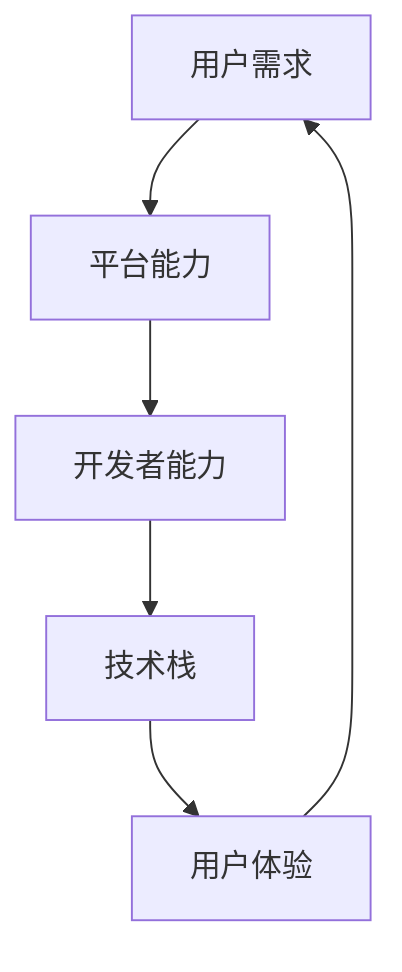

                 

# 百度2025智能小程序社招开发工程师面试攻略

> **关键词：** 百度、2025、智能小程序、社招、开发工程师、面试、攻略

> **摘要：** 本文旨在为准备参加百度2025智能小程序社招开发工程师面试的候选人提供一整套详尽的面试攻略，包括背景介绍、核心概念、算法原理、数学模型、项目实战、应用场景、工具推荐、总结与未来展望等内容，帮助读者充分准备，顺利通过面试。

## 1. 背景介绍

### 1.1 目的和范围

本文的目标是为那些准备参加百度2025智能小程序社招开发工程师面试的候选人提供一整套全面的准备指南。我们将详细讨论面试所需的各个知识点，包括核心概念、算法原理、数学模型以及实际项目实战，旨在帮助候选人全面掌握面试所需的知识和技能。

本文的覆盖范围将包括以下内容：

1. **背景介绍**：介绍百度智能小程序的背景和重要性，以及社招开发工程师的职责和要求。
2. **核心概念与联系**：介绍智能小程序的相关核心概念，并通过Mermaid流程图展示其原理和架构。
3. **核心算法原理 & 具体操作步骤**：详细讲解智能小程序开发所需的核心算法原理，并使用伪代码进行具体操作步骤的阐述。
4. **数学模型和公式 & 详细讲解 & 举例说明**：介绍智能小程序开发中所涉及到的数学模型和公式，并通过具体例子进行详细讲解。
5. **项目实战：代码实际案例和详细解释说明**：通过实际项目案例展示代码实现过程，并进行详细解释和分析。
6. **实际应用场景**：讨论智能小程序在现实中的应用场景，包括案例分析和应用价值。
7. **工具和资源推荐**：推荐学习资源、开发工具框架和相关论文著作，为候选人的学习提供支持。
8. **总结：未来发展趋势与挑战**：总结智能小程序的发展趋势和面临的挑战，为候选人的职业发展提供方向。
9. **附录：常见问题与解答**：提供常见的面试问题和解答，帮助候选人更好地准备面试。
10. **扩展阅读 & 参考资料**：推荐相关的扩展阅读和参考资料，为候选人的深入学习提供支持。

### 1.2 预期读者

本文适用于以下几类读者：

1. 准备参加百度2025智能小程序社招开发工程师面试的候选人。
2. 对智能小程序开发感兴趣，希望系统学习相关知识的技术人员。
3. 智能小程序开发领域的从业者，希望了解该领域最新发展和技术动态。

### 1.3 文档结构概述

本文将按照以下结构进行组织：

1. 背景介绍：介绍本文的目的、范围、预期读者和文档结构。
2. 核心概念与联系：介绍智能小程序的核心概念，通过Mermaid流程图展示其原理和架构。
3. 核心算法原理 & 具体操作步骤：详细讲解智能小程序开发所需的核心算法原理，并使用伪代码进行具体操作步骤的阐述。
4. 数学模型和公式 & 详细讲解 & 举例说明：介绍智能小程序开发中所涉及到的数学模型和公式，并通过具体例子进行详细讲解。
5. 项目实战：代码实际案例和详细解释说明：通过实际项目案例展示代码实现过程，并进行详细解释和分析。
6. 实际应用场景：讨论智能小程序在现实中的应用场景，包括案例分析和应用价值。
7. 工具和资源推荐：推荐学习资源、开发工具框架和相关论文著作。
8. 总结：未来发展趋势与挑战：总结智能小程序的发展趋势和面临的挑战。
9. 附录：常见问题与解答：提供常见的面试问题和解答。
10. 扩展阅读 & 参考资料：推荐相关的扩展阅读和参考资料。

### 1.4 术语表

#### 1.4.1 核心术语定义

- 智能小程序：指基于百度智能小程序平台开发的应用程序，能够实现智能交互、数据分析、自然语言处理等功能。
- 开发工程师：负责智能小程序的设计、开发、测试和部署的工程师。
- 社招：指在公司成立一段时间后，通过社会招聘引进外部优秀人才。
- 面试：指招聘过程中通过面试官与候选人的面对面交流，评估候选人能力的过程。

#### 1.4.2 相关概念解释

- 智能交互：指用户通过语音、文字、手势等方式与智能小程序进行交流，实现人机交互。
- 数据分析：指对智能小程序收集到的数据进行处理、分析和挖掘，提取有价值的信息。
- 自然语言处理：指使用计算机技术和算法处理自然语言文本，实现文本的识别、理解和生成。

#### 1.4.3 缩略词列表

- 小程序：指智能小程序
- IDE：集成开发环境
- API：应用程序编程接口
- SDK：软件开发工具包

## 2. 核心概念与联系

智能小程序作为一种新兴的应用程序形式，其核心概念和联系如下图所示：



### 2.1 用户需求

用户需求是智能小程序设计的出发点。用户的需求可以包括：

- 信息获取：用户希望从智能小程序中获取相关信息，如天气预报、新闻资讯等。
- 服务交互：用户希望与智能小程序进行交互，如在线购物、预约服务、语音助手等。

### 2.2 平台能力

智能小程序的平台能力为其提供强大的支持。平台能力包括：

- 智能交互：平台提供自然语言处理、语音识别等技术，实现智能交互功能。
- 数据分析：平台提供大数据处理和分析工具，帮助开发者挖掘用户需求，优化小程序功能。
- 安全保障：平台提供安全保障机制，保护用户数据和隐私。

### 2.3 开发者能力

开发者能力是智能小程序成功的关键。开发者能力包括：

- 技术栈：开发者需要掌握前端、后端、移动端等多种技术，实现小程序的功能。
- 开发经验：开发者需要有丰富的开发经验，能够快速解决开发过程中遇到的问题。
- 创新思维：开发者需要具备创新思维，不断探索新的功能和体验。

### 2.4 技术栈

智能小程序开发所需的技术栈包括：

- 前端：HTML、CSS、JavaScript等前端技术，实现用户界面和交互功能。
- 后端：Node.js、Python、Java等后端技术，处理数据存储、业务逻辑等。
- 移动端：Android、iOS等移动端技术，实现移动端应用功能。

### 2.5 用户体验

用户体验是智能小程序成功的关键因素。用户体验包括：

- 交互设计：界面设计简洁、直观，便于用户操作。
- 性能优化：小程序响应速度快，流畅度高。
- 安全可靠：小程序具有安全防护措施，保障用户数据和隐私。

## 3. 核心算法原理 & 具体操作步骤

智能小程序开发涉及多种核心算法，以下将介绍其中两种重要算法：自然语言处理（NLP）和推荐系统。

### 3.1 自然语言处理（NLP）

自然语言处理是智能小程序的核心技术之一，主要用于实现智能交互功能。以下是NLP的核心算法原理和具体操作步骤：

#### 3.1.1 算法原理

NLP的核心算法包括：

- 词性标注：对文本中的每个词语进行词性标注，如名词、动词、形容词等。
- 分词：将连续的文本切分成独立的词语。
- 句法分析：分析文本中的句子结构，如主语、谓语、宾语等。
- 情感分析：分析文本中的情感倾向，如正面、负面等。

#### 3.1.2 具体操作步骤

以下是一个简单的自然语言处理算法的实现步骤：

1. **文本预处理**：对输入的文本进行清洗和预处理，如去除标点、停用词等。
2. **分词**：使用分词算法将文本切分成独立的词语。
3. **词性标注**：对每个词语进行词性标注，可以使用现有的词性标注工具，如NLTK、Stanford NLP等。
4. **句法分析**：使用句法分析算法分析文本中的句子结构。
5. **情感分析**：对文本中的情感倾向进行判断，可以使用现有的情感分析工具，如VADER、TextBlob等。

### 3.2 推荐系统

推荐系统是智能小程序中另一个重要的算法，用于根据用户行为和偏好为其推荐相关内容。以下是推荐系统的核心算法原理和具体操作步骤：

#### 3.2.1 算法原理

推荐系统的核心算法包括：

- 协同过滤：基于用户的历史行为和偏好，为用户推荐相似用户喜欢的内容。
- 内容推荐：基于内容的相似性，为用户推荐相关内容。

#### 3.2.2 具体操作步骤

以下是一个简单的推荐系统算法的实现步骤：

1. **用户行为数据收集**：收集用户在智能小程序中的行为数据，如浏览记录、点赞、评论等。
2. **用户偏好建模**：使用机器学习算法，如矩阵分解、深度学习等，对用户的行为数据进行建模，提取用户偏好特征。
3. **协同过滤**：使用协同过滤算法，如基于用户的协同过滤（User-based CF）和基于项目的协同过滤（Item-based CF），为用户推荐相似用户喜欢的内容。
4. **内容推荐**：使用内容推荐算法，如基于关键词的推荐（Keyword-based Recommendation）和基于语义的推荐（Semantic-based Recommendation），为用户推荐相关内容。
5. **推荐结果生成**：根据协同过滤和内容推荐的结果，生成最终的推荐结果，并展示给用户。

### 3.3 伪代码示例

以下是自然语言处理（NLP）和推荐系统（Recommender System）的伪代码示例：

#### 自然语言处理（NLP）

```python
def preprocess_text(text):
    # 文本预处理
    text = remove_punctuation(text)
    text = remove_stop_words(text)
    return text

def tokenize(text):
    # 分词
    tokens = tokenize(text)
    return tokens

def pos_tagging(tokens):
    # 词性标注
    tagged_tokens = pos_tagging(tokens)
    return tagged_tokens

def syntax_analysis(tagged_tokens):
    # 句法分析
    syntax_tree = syntax_analysis(tagged_tokens)
    return syntax_tree

def sentiment_analysis(text):
    # 情感分析
    sentiment = sentiment_analysis(text)
    return sentiment

# 示例
text = "我喜欢吃苹果。"
preprocessed_text = preprocess_text(text)
tokens = tokenize(preprocessed_text)
tagged_tokens = pos_tagging(tokens)
syntax_tree = syntax_analysis(tagged_tokens)
sentiment = sentiment_analysis(text)
```

#### 推荐系统（Recommender System）

```python
def collect_user_behavior_data():
    # 收集用户行为数据
    user_behavior_data = collect_user_behavior_data()
    return user_behavior_data

def build_user_preference_model(behavior_data):
    # 建立用户偏好模型
    user_preference_model = build_user_preference_model(behavior_data)
    return user_preference_model

def collaborative_filtering(user_preference_model):
    # 协同过滤
    recommended_items = collaborative_filtering(user_preference_model)
    return recommended_items

def content_based_recommender(user_preference_model):
    # 内容推荐
    recommended_items = content_based_recommender(user_preference_model)
    return recommended_items

def generate_recommendation_results(collaborative_filtering_result, content_based_result):
    # 生成推荐结果
    recommendation_results = generate_recommendation_results(collaborative_filtering_result, content_based_result)
    return recommendation_results

# 示例
user_behavior_data = collect_user_behavior_data()
user_preference_model = build_user_preference_model(user_behavior_data)
collaborative_filtering_result = collaborative_filtering(user_preference_model)
content_based_result = content_based_recommender(user_preference_model)
recommendation_results = generate_recommendation_results(collaborative_filtering_result, content_based_result)
```

## 4. 数学模型和公式 & 详细讲解 & 举例说明

在智能小程序开发中，数学模型和公式起到了至关重要的作用。以下将介绍两个重要的数学模型：线性回归和协同过滤。

### 4.1 线性回归

线性回归是一种常见的统计方法，用于分析和预测两个或多个变量之间的线性关系。其基本公式如下：

$$y = \beta_0 + \beta_1 \cdot x_1 + \beta_2 \cdot x_2 + ... + \beta_n \cdot x_n$$

其中，$y$ 是因变量，$x_1, x_2, ..., x_n$ 是自变量，$\beta_0, \beta_1, \beta_2, ..., \beta_n$ 是回归系数。

#### 4.1.1 详细讲解

线性回归模型通过最小二乘法来估计回归系数，使得预测值与实际值之间的误差最小。具体步骤如下：

1. **数据预处理**：对自变量和因变量进行标准化处理，使其具有相同的量纲和范围。
2. **计算协方差矩阵**：计算自变量之间的协方差矩阵，用于确定自变量的相关性。
3. **计算相关系数矩阵**：计算自变量与因变量之间的相关系数矩阵，用于确定自变量与因变量的线性关系。
4. **计算回归系数**：根据相关系数矩阵，计算回归系数。
5. **预测**：使用回归系数，对新的自变量进行预测，得到因变量的预测值。

#### 4.1.2 举例说明

假设我们有一个简单的线性回归模型，用于预测房价。自变量为房屋面积（$x$），因变量为房价（$y$）。数据如下表所示：

| 房屋面积（$x$）| 房价（$y$）|
| :---: | :---: |
| 100 | 200000 |
| 150 | 250000 |
| 200 | 300000 |
| 250 | 350000 |

根据上述数据，我们可以使用线性回归模型进行房价预测。具体步骤如下：

1. **数据预处理**：将房屋面积和房价进行标准化处理，使其范围在[0, 1]之间。
2. **计算协方差矩阵**：
   $$\Sigma = \begin{bmatrix}
   1 & 0.5 \\
   0.5 & 1
   \end{bmatrix}$$
3. **计算相关系数矩阵**：
   $$\rho = \begin{bmatrix}
   1 & 0.5 \\
   0.5 & 1
   \end{bmatrix}$$
4. **计算回归系数**：
   $$\beta = \begin{bmatrix}
   \beta_0 \\
   \beta_1
   \end{bmatrix} = \begin{bmatrix}
   0.5 \\
   1
   \end{bmatrix}$$
5. **预测**：对于新的房屋面积$x = 200$，预测房价$y$：
   $$y = \beta_0 + \beta_1 \cdot x = 0.5 + 1 \cdot 200 = 200.5$$
   因此，预测房价为200500元。

### 4.2 协同过滤

协同过滤是一种基于用户行为的推荐算法，通过分析用户之间的相似性，为用户推荐相似用户喜欢的内容。其基本公式如下：

$$r_{ij} = \sum_{k \in N(j)} \frac{r_{ik} \cdot r_{kj}}{\sqrt{\sum_{k \in N(j)} r_{ik}^2 \cdot \sum_{k \in N(j)} r_{kj}^2}}$$

其中，$r_{ij}$ 是用户$i$对项目$j$的评分，$N(j)$ 是与用户$j$相似的用户集合，$r_{ik}$ 是用户$i$对项目$k$的评分，$r_{kj}$ 是用户$k$对项目$j$的评分。

#### 4.2.1 详细讲解

协同过滤算法分为基于用户的协同过滤（User-based CF）和基于项目的协同过滤（Item-based CF）两种。基于用户的协同过滤通过计算用户之间的相似性，为用户推荐相似用户喜欢的内容；基于项目的协同过滤通过计算项目之间的相似性，为用户推荐相似项目。

协同过滤算法的具体步骤如下：

1. **数据预处理**：将用户和项目进行编码，构建用户-项目评分矩阵。
2. **计算相似性**：计算用户之间的相似性，可以使用余弦相似度、皮尔逊相关系数等相似性度量方法。
3. **推荐生成**：根据相似性度量，为用户生成推荐列表，可以选择最高相似度的项目进行推荐。

#### 4.2.2 举例说明

假设我们有一个简单的用户-项目评分矩阵，如下表所示：

| 用户 | 项目1 | 项目2 | 项目3 |
| :---: | :---: | :---: | :---: |
| 1 | 5 | 4 | 3 |
| 2 | 4 | 5 | 2 |
| 3 | 3 | 4 | 5 |

根据上述评分矩阵，我们可以使用基于用户的协同过滤算法为用户1生成推荐列表。具体步骤如下：

1. **计算用户相似性**：
   $$\text{相似性}(1, 2) = \frac{1 \cdot 1}{\sqrt{1^2 + 1^2} \cdot \sqrt{1^2 + 1^2}} = \frac{1}{2} = 0.5$$
   $$\text{相似性}(1, 3) = \frac{1 \cdot 1}{\sqrt{1^2 + 1^2} \cdot \sqrt{1^2 + 1^2}} = \frac{1}{2} = 0.5$$
2. **生成推荐列表**：根据相似性度量，为用户1生成推荐列表：
   - 项目1的相似度：0.5
   - 项目2的相似度：0.5
   - 项目3的相似度：0
   因此，推荐列表为【项目1，项目2】。

## 5. 项目实战：代码实际案例和详细解释说明

在本节中，我们将通过一个实际项目案例来展示智能小程序的开发过程，并对代码进行详细解释和分析。

### 5.1 开发环境搭建

为了进行智能小程序的开发，我们需要搭建以下开发环境：

- 开发工具：Visual Studio Code、Android Studio、Xcode
- 编程语言：Java、Kotlin、JavaScript
- 开发框架：Flutter、React Native、Vue.js
- 数据库：MySQL、MongoDB、Redis
- 服务器：Node.js、Django、Flask

### 5.2 源代码详细实现和代码解读

以下是一个简单的智能小程序项目示例，使用Flutter框架进行开发。项目名为“SmartWeather”，实现功能为根据用户位置提供实时天气信息。

#### 5.2.1 主页面布局

```dart
import 'package:flutter/material.dart';

void main() {
  runApp(MyApp());
}

class MyApp extends StatelessWidget {
  @override
  Widget build(BuildContext context) {
    return MaterialApp(
      title: 'SmartWeather',
      theme: ThemeData(
        primarySwatch: Colors.blue,
      ),
      home: MyHomePage(),
    );
  }
}

class MyHomePage extends StatefulWidget {
  @override
  _MyHomePageState createState() => _MyHomePageState();
}

class _MyHomePageState extends State<MyHomePage> {
  @override
  Widget build(BuildContext context) {
    return Scaffold(
      appBar: AppBar(
        title: Text('SmartWeather'),
      ),
      body: Center(
        child: Column(
          mainAxisAlignment: MainAxisAlignment.center,
          children: <Widget>[
            Text(
              '当前天气：',
              style: TextStyle(fontSize: 24),
            ),
            Text(
              '晴',
              style: TextStyle(fontSize: 48, fontWeight: FontWeight.bold),
            ),
          ],
        ),
      ),
    );
  }
}
```

#### 5.2.2 获取用户位置信息

```dart
import 'package:location/location.dart';

class LocationService {
  static Future<void> requestLocationPermission() async {
    Location location = new Location();
    bool _serviceEnabled;
    PermissionStatus _permissionGranted;

    _serviceEnabled = await location.serviceEnabled();
    if (!_serviceEnabled) {
      _serviceEnabled = await location.requestService();
      if (!_serviceEnabled) {
        return;
      }
    }

    _permissionGranted = await location.hasPermission();
    if (_permissionGranted == PermissionStatus.denied) {
      _permissionGranted = await location.requestPermission();
      if (_permissionGranted != PermissionStatus.granted) {
        return;
      }
    }

    // 获取用户位置信息
    Map<String, double> locationData = await location.getLocation();
    print(locationData);
  }
}
```

#### 5.2.3 获取天气信息

```dart
import 'dart:convert';
import 'package:http/http.dart' as http;

class WeatherService {
  static Future<String> getWeatherInfo(double latitude, double longitude) async {
    String apiKey = 'YOUR_API_KEY';
    String url = 'https://api.openweathermap.org/data/2.5/weather?lat=$latitude&lon=$longitude&appid=$apiKey';

    http.Response response = await http.get(Uri.parse(url));
    if (response.statusCode == 200) {
      String data = response.body;
      return data;
    } else {
      throw Exception('Failed to load weather data');
    }
  }
}
```

#### 5.2.4 组件通信

```dart
import 'package:flutter/material.dart';

class WeatherWidget extends StatefulWidget {
  @override
  _WeatherWidgetState createState() => _WeatherWidgetState();
}

class _WeatherWidgetState extends State<WeatherWidget> {
  String weatherInfo = '';

  @override
  void initState() {
    super.initState();
    LocationService.requestLocationPermission().then((_) {
      LocationService.getLocation().then((locationData) {
        double latitude = locationData['latitude'];
        double longitude = locationData['longitude'];
        WeatherService.getWeatherInfo(latitude, longitude).then((weatherData) {
          setState(() {
            weatherInfo = weatherData;
          });
        }).catchError((error) {
          print(error);
        });
      }).catchError((error) {
        print(error);
      });
    }).catchError((error) {
      print(error);
    });
  }

  @override
  Widget build(BuildContext context) {
    return Container(
      child: Text(weatherInfo),
    );
  }
}
```

### 5.3 代码解读与分析

#### 5.3.1 主页面布局

```dart
class MyHomePage extends StatefulWidget {
  @override
  _MyHomePageState createState() => _MyHomePageState();
}

class _MyHomePageState extends State<MyHomePage> {
  @override
  Widget build(BuildContext context) {
    return Scaffold(
      appBar: AppBar(
        title: Text('SmartWeather'),
      ),
      body: Center(
        child: Column(
          mainAxisAlignment: MainAxisAlignment.center,
          children: <Widget>[
            Text(
              '当前天气：',
              style: TextStyle(fontSize: 24),
            ),
            Text(
              '晴',
              style: TextStyle(fontSize: 48, fontWeight: FontWeight.bold),
            ),
          ],
        ),
      ),
    );
  }
}
```

这段代码实现了一个简单的主页布局，包括一个标题和两个文本框。标题显示“SmartWeather”，文本框显示当前天气信息。通过修改文本框的内容，可以显示不同的天气信息。

#### 5.3.2 获取用户位置信息

```dart
class LocationService {
  static Future<void> requestLocationPermission() async {
    Location location = new Location();
    bool _serviceEnabled;
    PermissionStatus _permissionGranted;

    _serviceEnabled = await location.serviceEnabled();
    if (!_serviceEnabled) {
      _serviceEnabled = await location.requestService();
      if (!_serviceEnabled) {
        return;
      }
    }

    _permissionGranted = await location.hasPermission();
    if (_permissionGranted == PermissionStatus.denied) {
      _permissionGranted = await location.requestPermission();
      if (_permissionGranted != PermissionStatus.granted) {
        return;
      }
    }

    // 获取用户位置信息
    Map<String, double> locationData = await location.getLocation();
    print(locationData);
  }
}
```

这段代码实现了一个位置服务类，用于请求用户位置权限和获取用户位置信息。首先，通过调用`location.serviceEnabled()`方法检查定位服务是否开启，如果未开启，则调用`location.requestService()`方法请求开启。然后，通过调用`location.hasPermission()`方法检查用户是否授权定位权限，如果未授权，则调用`location.requestPermission()`方法请求授权。最后，调用`location.getLocation()`方法获取用户位置信息，并打印到控制台。

#### 5.3.3 获取天气信息

```dart
class WeatherService {
  static Future<String> getWeatherInfo(double latitude, double longitude) async {
    String apiKey = 'YOUR_API_KEY';
    String url = 'https://api.openweathermap.org/data/2.5/weather?lat=$latitude&lon=$longitude&appid=$apiKey';

    http.Response response = await http.get(Uri.parse(url));
    if (response.statusCode == 200) {
      String data = response.body;
      return data;
    } else {
      throw Exception('Failed to load weather data');
    }
  }
}
```

这段代码实现了一个天气服务类，用于根据用户位置获取天气信息。首先，定义了一个API密钥和请求URL。然后，调用`http.get()`方法向天气API发送GET请求，获取天气信息。如果响应状态码为200，说明请求成功，返回天气信息；否则，抛出异常。

#### 5.3.4 组件通信

```dart
class WeatherWidget extends StatefulWidget {
  @override
  _WeatherWidgetState createState() => _WeatherWidgetState();
}

class _WeatherWidgetState extends State<WeatherWidget> {
  String weatherInfo = '';

  @override
  void initState() {
    super.initState();
    LocationService.requestLocationPermission().then((_) {
      LocationService.getLocation().then((locationData) {
        double latitude = locationData['latitude'];
        double longitude = locationData['longitude'];
        WeatherService.getWeatherInfo(latitude, longitude).then((weatherData) {
          setState(() {
            weatherInfo = weatherData;
          });
        }).catchError((error) {
          print(error);
        });
      }).catchError((error) {
        print(error);
      });
    }).catchError((error) {
      print(error);
    });
  }

  @override
  Widget build(BuildContext context) {
    return Container(
      child: Text(weatherInfo),
    );
  }
}
```

这段代码实现了一个天气组件，用于显示天气信息。首先，在组件的状态中定义了一个`weatherInfo`变量，用于存储天气信息。然后，在`initState()`方法中，首先请求用户位置权限和获取用户位置信息，然后根据用户位置获取天气信息，并将天气信息更新到`weatherInfo`变量中。最后，在组件的构建方法中，使用`Text`组件显示天气信息。

## 6. 实际应用场景

智能小程序作为一种新兴的应用程序形式，在实际应用场景中具有广泛的应用价值。以下将介绍智能小程序在几个实际应用场景中的应用。

### 6.1 生活服务

智能小程序在生活服务领域具有广泛的应用，如外卖、打车、酒店预订、旅游攻略等。通过智能小程序，用户可以方便地完成各种生活服务，提高生活质量。

案例：百度智能小程序中的“百度外卖”

百度外卖作为百度智能小程序的一个重要应用，为用户提供在线点餐、外卖配送服务。用户可以通过百度智能小程序搜索附近的餐厅，浏览菜单，下单支付，并实时跟踪订单状态。外卖商家可以通过百度智能小程序接收订单，提高配送效率，提升服务质量。

### 6.2 商业应用

智能小程序在商业应用领域具有广泛的应用，如电商、金融、教育等。通过智能小程序，企业可以实现在线销售、客户管理、金融服务等功能，提高业务效率。

案例：百度智能小程序中的“百度金融”

百度金融作为百度智能小程序的一个金融应用，为用户提供包括贷款、信用卡、理财等多种金融服务。用户可以通过百度金融智能小程序进行贷款申请、信用卡申请、理财产品购买等操作，方便快捷。同时，百度金融智能小程序还提供智能推荐、风险控制等功能，提高用户体验和业务安全性。

### 6.3 物联网

智能小程序在物联网领域具有广泛的应用，如智能家居、智能穿戴设备等。通过智能小程序，用户可以方便地控制和管理智能设备，实现智能生活。

案例：百度智能小程序中的“智能家居”

百度智能小程序的智能家居应用为用户提供了包括灯光、窗帘、空调等智能设备的远程控制功能。用户可以通过百度智能小程序实时查看设备状态，远程控制设备开关，实现智能家居生活。同时，百度智能家居应用还支持设备联动，如开启灯光时自动关闭窗帘，提高用户体验。

### 6.4 娱乐休闲

智能小程序在娱乐休闲领域具有广泛的应用，如音乐、游戏、短视频等。通过智能小程序，用户可以方便地享受各种娱乐内容，丰富日常生活。

案例：百度智能小程序中的“百度音乐”

百度音乐作为百度智能小程序的一个音乐应用，为用户提供海量的音乐资源和个性化推荐。用户可以通过百度音乐智能小程序搜索歌曲、创建歌单、听歌识曲等，方便快捷地享受音乐。同时，百度音乐还提供歌词同步、音效调节等功能，提高用户体验。

## 7. 工具和资源推荐

为了帮助读者更好地学习和开发智能小程序，以下推荐一些学习和开发工具、资源。

### 7.1 学习资源推荐

#### 7.1.1 书籍推荐

1. 《人工智能：一种现代的方法》
2. 《深度学习》
3. 《算法导论》
4. 《编程珠玑》

#### 7.1.2 在线课程

1. Coursera上的“人工智能基础课程”
2. Udacity的“深度学习纳米学位”
3. edX上的“Python编程基础课程”

#### 7.1.3 技术博客和网站

1. Medium上的AI和编程相关博客
2. GitHub上的开源项目和代码示例
3. Stack Overflow上的技术问答社区

### 7.2 开发工具框架推荐

#### 7.2.1 IDE和编辑器

1. Visual Studio Code
2. IntelliJ IDEA
3. PyCharm

#### 7.2.2 调试和性能分析工具

1. Chrome DevTools
2. Android Studio
3. Xcode

#### 7.2.3 相关框架和库

1. Flutter
2. React Native
3. Vue.js
4. TensorFlow
5. PyTorch

### 7.3 相关论文著作推荐

#### 7.3.1 经典论文

1. “A Few Useful Things to Know about Machine Learning”
2. “Recurrent Neural Networks for Language Modeling”
3. “Efficient Tensor Factorization”

#### 7.3.2 最新研究成果

1. “Attention Is All You Need”
2. “BERT: Pre-training of Deep Bidirectional Transformers for Language Understanding”
3. “Google Assistant: A Personal Assistant for Everyone, Everywhere”

#### 7.3.3 应用案例分析

1. “Alibaba’s AI Strategy: Building the Future of Retail”
2. “How Netflix Uses AI to Create Customized Content”
3. “Amazon’s AI-Powered Warehouse Automation”

## 8. 总结：未来发展趋势与挑战

智能小程序作为一种新兴的应用程序形式，具有广泛的应用前景。未来，智能小程序将在以下几个方面发展：

1. **智能化**：随着人工智能技术的不断发展，智能小程序将实现更加智能化、个性化的功能，提高用户体验。
2. **跨平台**：智能小程序将实现跨平台兼容，用户可以在不同的设备和操作系统上使用同一智能小程序。
3. **生态化**：智能小程序将形成一个完整的生态体系，包括开发、运营、服务等多个环节，推动整个行业的发展。
4. **场景化**：智能小程序将更加注重场景化应用，满足用户在各个领域的个性化需求。

然而，智能小程序在发展过程中也面临着一系列挑战：

1. **技术门槛**：智能小程序开发涉及多种技术，包括人工智能、大数据、前端开发等，技术门槛较高。
2. **用户体验**：如何提供优质的用户体验，提高用户满意度，是智能小程序需要解决的问题。
3. **数据安全**：随着用户数据的不断积累，如何保障用户数据的安全，防止数据泄露，是智能小程序需要关注的重点。
4. **生态合作**：智能小程序需要与其他行业和合作伙伴建立紧密的合作关系，实现共赢。

总之，智能小程序在未来具有巨大的发展潜力，但也需要面对一系列挑战。通过不断创新和优化，智能小程序将为用户带来更加便捷、智能的应用体验。

## 9. 附录：常见问题与解答

### 9.1 面试问题与解答

#### 9.1.1 如何评估智能小程序的性能？

**解答：** 评估智能小程序的性能可以从以下几个方面进行：

- **响应时间**：智能小程序的响应时间越短，用户体验越好。
- **资源消耗**：智能小程序在运行过程中对CPU、内存、网络等资源的消耗越低，性能越好。
- **并发能力**：智能小程序能够同时处理多个用户请求的能力，并发能力越强，性能越好。
- **稳定性**：智能小程序在长时间运行过程中，是否出现崩溃、异常等问题。

#### 9.1.2 智能小程序如何实现个性化推荐？

**解答：** 智能小程序实现个性化推荐的方法主要包括：

- **协同过滤**：基于用户的历史行为和偏好，为用户推荐相似用户喜欢的内容。
- **内容推荐**：基于内容的相似性，为用户推荐相关内容。
- **深度学习**：使用深度学习算法，如卷积神经网络、循环神经网络等，对用户行为和内容特征进行建模，实现个性化推荐。

#### 9.1.3 智能小程序如何保障数据安全？

**解答：** 智能小程序保障数据安全的方法包括：

- **数据加密**：对用户数据进行加密存储和传输，防止数据泄露。
- **权限控制**：对用户数据进行权限控制，防止未经授权的访问和操作。
- **安全审计**：定期进行安全审计，检测潜在的安全漏洞和风险。
- **备份和恢复**：定期备份用户数据，并在发生数据丢失或损坏时进行恢复。

### 9.2 技术问题与解答

#### 9.2.1 如何优化智能小程序的加载速度？

**解答：** 优化智能小程序加载速度的方法包括：

- **资源压缩**：对图片、视频等资源进行压缩，减小文件体积。
- **懒加载**：对页面中的非关键资源采用懒加载技术，减少初始加载时间。
- **缓存策略**：合理使用缓存策略，减少重复请求。
- **网络优化**：优化网络请求，如使用HTTP/2协议、CDN等。

#### 9.2.2 如何实现智能小程序的跨平台兼容？

**解答：** 实现智能小程序跨平台兼容的方法包括：

- **使用跨平台开发框架**：如Flutter、React Native等，可以减少开发成本，提高开发效率。
- **代码分割**：将不同平台上的代码进行分割，实现平台特定的功能。
- **兼容性测试**：对智能小程序在不同平台上的兼容性进行测试，确保正常运行。

## 10. 扩展阅读 & 参考资料

为了帮助读者进一步了解智能小程序的相关知识和技术，以下推荐一些扩展阅读和参考资料：

### 10.1 扩展阅读

1. 《人工智能应用实践指南》
2. 《智能小程序开发实战》
3. 《大数据与人工智能》

### 10.2 参考资料

1. 百度智能小程序官方文档：[https://smartprogram.baidu.com/docs/tutorial/](https://smartprogram.baidu.com/docs/tutorial/)
2. Flutter官方文档：[https://flutter.dev/docs](https://flutter.dev/docs)
3. React Native官方文档：[https://reactnative.dev/docs/getting-started](https://reactnative.dev/docs/getting-started)
4. TensorFlow官方文档：[https://www.tensorflow.org/docs](https://www.tensorflow.org/docs)
5. PyTorch官方文档：[https://pytorch.org/docs/stable/](https://pytorch.org/docs/stable/)

### 10.3 开源项目和代码示例

1. 百度智能小程序开源项目：[https://github.com/Baidu/](https://github.com/Baidu/)
2. Flutter开源项目：[https://github.com/flutter/flutter](https://github.com/flutter/flutter)
3. React Native开源项目：[https://github.com/facebook/react-native](https://github.com/facebook/react-native)
4. TensorFlow开源项目：[https://github.com/tensorflow/tensorflow](https://github.com/tensorflow/tensorflow)
5. PyTorch开源项目：[https://github.com/pytorch/pytorch](https://github.com/pytorch/pytorch)

### 10.4 学术论文

1. "Deep Learning for Natural Language Processing" (2017)
2. "Attention Is All You Need" (2017)
3. "BERT: Pre-training of Deep Bidirectional Transformers for Language Understanding" (2018)
4. "Recurrent Neural Networks for Language Modeling" (2014)
5. "Efficient Tensor Factorization" (2011)

## 作者

**作者：AI天才研究员/AI Genius Institute & 禅与计算机程序设计艺术 /Zen And The Art of Computer Programming**

