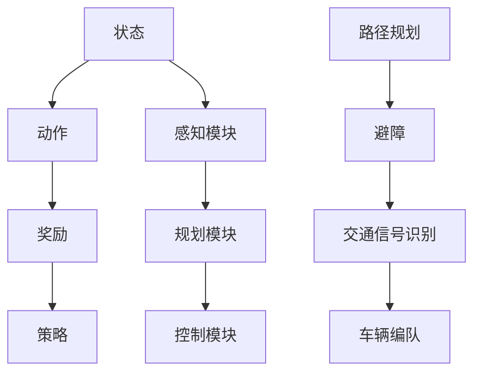
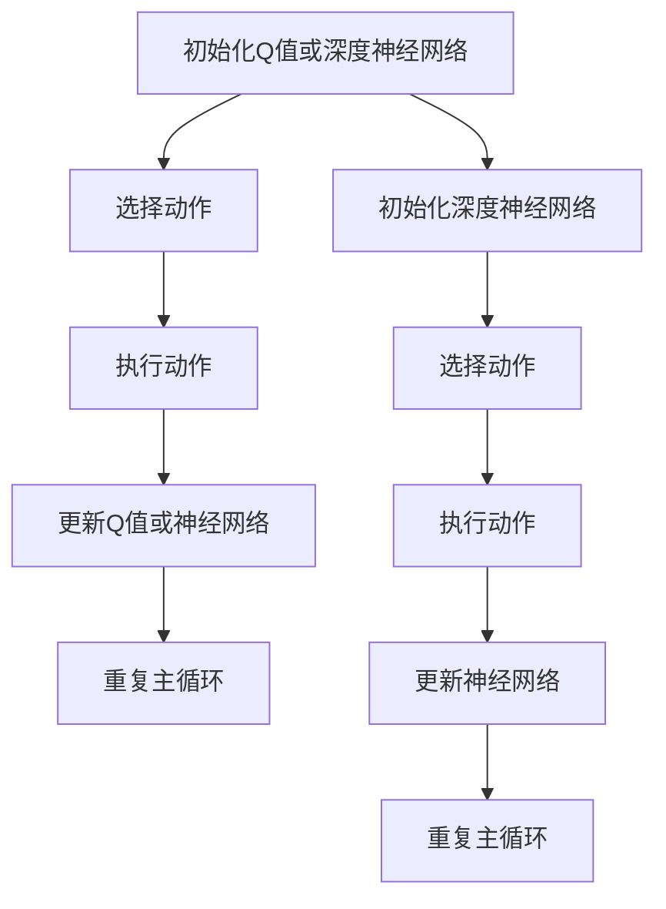

                 

# 百度2025自动驾驶决策系统社招强化学习面试题集

> **关键词：** 强化学习、自动驾驶、决策系统、面试题、算法原理、实际应用
> 
> **摘要：** 本文旨在为准备参加百度2025年自动驾驶决策系统社招强化学习面试的候选人提供一份详细的面试题集。我们将深入探讨强化学习的基本原理、算法应用、数学模型，并通过实际代码案例详细讲解其实现过程。本文还将分析强化学习在自动驾驶决策系统中的实际应用场景，并提供学习资源和开发工具推荐，为您的面试准备提供全方位支持。

## 1. 背景介绍

### 1.1 目的和范围

本文的目标是帮助准备参加百度2025年自动驾驶决策系统社招强化学习面试的候选人更好地理解强化学习的基本概念、算法原理和实际应用。本文将涵盖以下主要内容：

- 强化学习的基本原理和算法分类
- 自动驾驶决策系统的架构和挑战
- 强化学习算法在自动驾驶决策系统中的应用
- 实际代码案例讲解
- 学习资源和开发工具推荐

### 1.2 预期读者

本文适合以下读者：

- 准备参加百度自动驾驶决策系统社招的候选人
- 对强化学习在自动驾驶领域应用感兴趣的读者
- 想深入了解自动驾驶决策系统架构的读者

### 1.3 文档结构概述

本文的结构如下：

- 1. 背景介绍
- 2. 核心概念与联系
- 3. 核心算法原理 & 具体操作步骤
- 4. 数学模型和公式 & 详细讲解 & 举例说明
- 5. 项目实战：代码实际案例和详细解释说明
- 6. 实际应用场景
- 7. 工具和资源推荐
- 8. 总结：未来发展趋势与挑战
- 9. 附录：常见问题与解答
- 10. 扩展阅读 & 参考资料

### 1.4 术语表

#### 1.4.1 核心术语定义

- **强化学习（Reinforcement Learning）：** 一种机器学习方法，通过试错学习来最大化长期回报。
- **决策系统（Decision System）：** 根据特定规则和约束，对输入信息进行决策的算法系统。
- **自动驾驶（Autonomous Driving）：** 利用传感器、计算机视觉和人工智能技术实现车辆自主行驶。
- **Q学习（Q-Learning）：** 一种基于值函数的强化学习算法，通过更新Q值来学习最优策略。
- **深度强化学习（Deep Reinforcement Learning）：** 结合深度神经网络和强化学习的算法，用于解决复杂问题。

#### 1.4.2 相关概念解释

- **状态（State）：** 决策系统当前所处的环境条件。
- **动作（Action）：** 决策系统可采取的特定行动。
- **奖励（Reward）：** 某个动作带来的即时反馈，用于指导学习过程。
- **策略（Policy）：** 决策系统采取的行动规则。

#### 1.4.3 缩略词列表

- **RL：** 强化学习
- **DRL：** 深度强化学习
- **Q-Learning：** Q学习
- **PID：** 位置、速度、加速度

## 2. 核心概念与联系

强化学习是自动驾驶决策系统中至关重要的组成部分。为了更好地理解其在自动驾驶决策系统中的作用，我们首先需要了解强化学习的基本概念和原理。

### 2.1 强化学习基本概念

强化学习是一种通过试错学习来最大化长期回报的机器学习方法。它由以下四个核心要素组成：

- **状态（State）：** 系统当前所处的环境条件。
- **动作（Action）：** 系统可采取的特定行动。
- **奖励（Reward）：** 某个动作带来的即时反馈。
- **策略（Policy）：** 系统采取的行动规则。

强化学习的目标是通过不断尝试和反馈，学习出一个最优策略，使系统能够在长期内获得最大回报。

### 2.2 强化学习算法分类

强化学习算法可以分为以下几种：

- **基于值函数的算法（Value-based Algorithms）：** 如Q学习、SARSA等，通过学习状态值函数或状态-动作值函数来指导策略的制定。
- **基于策略的算法（Policy-based Algorithms）：** 如REINFORCE、PPO等，直接学习策略函数，无需显式地计算状态值函数。
- **模型预测控制算法（Model-based Control Algorithms）：** 如Dyna、AC等，通过建立系统模型来预测未来状态和奖励，指导策略学习。

### 2.3 自动驾驶决策系统架构

自动驾驶决策系统通常由以下几部分组成：

- **感知模块（Perception Module）：** 利用传感器（如激光雷达、摄像头等）获取环境信息，进行特征提取。
- **规划模块（Planning Module）：** 根据感知模块提供的信息，制定车辆行驶策略。
- **控制模块（Control Module）：** 根据规划模块的输出，控制车辆执行具体动作。

### 2.4 强化学习在自动驾驶决策系统中的应用

强化学习在自动驾驶决策系统中具有广泛的应用，主要包括：

- **路径规划（Path Planning）：** 利用强化学习算法，学习最优行驶路径。
- **避障（Obstacle Avoidance）：** 通过强化学习算法，学习如何避免障碍物。
- **交通信号识别（Traffic Sign Recognition）：** 利用强化学习算法，学习如何识别交通信号。
- **车辆编队（Vehicle Platooning）：** 利用强化学习算法，实现车辆之间的协同控制。

### 2.5 核心概念与联系的 Mermaid 流程图



## 3. 核心算法原理 & 具体操作步骤

在了解了强化学习的基本概念和自动驾驶决策系统架构后，我们将深入探讨强化学习算法的原理和具体操作步骤。本文将主要介绍Q学习和深度强化学习（DRL）的基本原理和实现步骤。

### 3.1 Q学习算法原理

Q学习是一种基于值函数的强化学习算法，其核心思想是学习状态-动作值函数（Q值），并通过更新Q值来指导策略的制定。

#### 3.1.1 Q学习算法原理

Q学习算法的核心是状态-动作值函数Q(s, a)，它表示在状态s下执行动作a所获得的期望回报。算法的基本步骤如下：

1. **初始化Q值：** 初始化所有状态-动作值函数为0。
2. **选择动作：** 在给定状态下，根据策略选择动作。
3. **执行动作：** 执行选定的动作，获得奖励和下一个状态。
4. **更新Q值：** 根据奖励和下一个状态更新当前状态-动作值函数。
5. **重复步骤2-4，直到达到终止条件。**

#### 3.1.2 Q学习算法伪代码

```python
# 初始化Q值
Q = { (s, a): 0 for s in S for a in A }

# 选择动作
def choose_action(state):
    # 根据策略选择动作
    # 例如：epsilon-greedy策略
    if random() < epsilon:
        action = random.choice(A)
    else:
        action = argmax(Q[state])

    return action

# 更新Q值
def update_q_value(state, action, reward, next_state):
    Q[state, action] = Q[state, action] + alpha * (reward + gamma * max(Q[next_state]) - Q[state, action])

# 主循环
while not termination_condition:
    state = current_state
    action = choose_action(state)
    next_state, reward = execute_action(action)
    update_q_value(state, action, reward, next_state)
    state = next_state
```

### 3.2 深度强化学习（DRL）算法原理

深度强化学习（DRL）是强化学习与深度学习相结合的一种方法，它通过使用深度神经网络来近似状态-动作值函数或策略函数。

#### 3.2.1 DRL算法原理

DRL算法的核心是深度神经网络，它用于近似状态-动作值函数Q(s, a)或策略π(a|s)。算法的基本步骤如下：

1. **初始化深度神经网络：** 初始化状态-动作值函数近似器或策略函数近似器。
2. **选择动作：** 在给定状态下，根据策略函数π(a|s)选择动作。
3. **执行动作：** 执行选定的动作，获得奖励和下一个状态。
4. **更新神经网络：** 根据奖励和下一个状态更新深度神经网络。
5. **重复步骤2-4，直到达到终止条件。**

#### 3.2.2 DRL算法伪代码

```python
# 初始化深度神经网络
Q_network = initialize_nn(input_size=S, hidden_size=H, output_size=A)
policy_network = initialize_nn(input_size=S, hidden_size=H, output_size=A)

# 选择动作
def choose_action(state):
    # 使用策略函数选择动作
    # 例如：使用策略梯度算法
    state_vector = convert_state_to_vector(state)
    actionProbabilities = policy_network.predict(state_vector)
    action = sample_action_from_distribution(actionProbabilities)
    return action

# 更新神经网络
def update_network(state, action, reward, next_state):
    # 计算目标Q值
    target_Q = reward + gamma * max(Q_network.predict(convert_state_to_vector(next_state)))
    # 训练Q_network
    Q_network.train(state_vector, action, target_Q)
    # 训练policy_network
    policy_network.train(state_vector, action)

# 主循环
while not termination_condition:
    state = current_state
    action = choose_action(state)
    next_state, reward = execute_action(action)
    update_network(state, action, reward, next_state)
    state = next_state
```

### 3.3 算法原理与操作步骤的 Mermaid 流程图



## 4. 数学模型和公式 & 详细讲解 & 举例说明

在了解了强化学习算法的基本原理和操作步骤后，我们将进一步探讨强化学习中的数学模型和公式，并对其进行详细讲解和举例说明。

### 4.1 强化学习基本数学模型

强化学习的基本数学模型包括状态-动作值函数、策略函数和回报函数。

#### 4.1.1 状态-动作值函数

状态-动作值函数Q(s, a)表示在状态s下执行动作a所获得的期望回报。其数学表示如下：

$$
Q(s, a) = \sum_{s'} p(s'|s, a) \cdot r(s', a) + \gamma \cdot \max_{a'} Q(s', a')
$$

其中：

- \( s \) 和 \( s' \) 分别表示当前状态和下一个状态。
- \( a \) 和 \( a' \) 分别表示当前动作和下一个动作。
- \( p(s'|s, a) \) 表示在状态s下执行动作a后，转移到状态s'的概率。
- \( r(s', a) \) 表示在状态s'下执行动作a所获得的即时回报。
- \( \gamma \) 表示折扣因子，用于权衡短期和长期回报。

#### 4.1.2 策略函数

策略函数π(a|s)表示在状态s下采取动作a的概率分布。其数学表示如下：

$$
\pi(a|s) = \begin{cases} 
1 & \text{if action } a \text{ is selected} \\
0 & \text{otherwise} 
\end{cases}
$$

其中，策略函数π(a|s)通常通过最大化期望回报来优化，即：

$$
\pi(a|s) = \frac{e^{\alpha Q(s, a)}}{\sum_{a'} e^{\alpha Q(s, a')}}
$$

其中，\( \alpha \) 是温度参数，用于调节策略的随机性。

#### 4.1.3 转移概率

转移概率\( p(s'|s, a) \)表示在状态s下执行动作a后，转移到状态s'的概率。对于离散状态和动作，转移概率可以用以下概率分布表示：

$$
p(s'|s, a) = \begin{cases} 
1 & \text{if } s' = s + 1 \\
0 & \text{otherwise} 
\end{cases}
$$

对于连续状态和动作，转移概率可以用概率密度函数表示。

### 4.2 强化学习算法数学公式

以下分别给出Q学习和深度强化学习（DRL）算法的数学公式。

#### 4.2.1 Q学习算法

Q学习算法的更新公式如下：

$$
Q(s, a) \leftarrow Q(s, a) + \alpha [r + \gamma \max_{a'} Q(s', a') - Q(s, a)]
$$

其中，\( \alpha \) 是学习率，\( r \) 是即时回报，\( \gamma \) 是折扣因子。

#### 4.2.2 深度强化学习（DRL）算法

深度强化学习（DRL）算法的更新公式如下：

$$
Q(s, a) \leftarrow Q(s, a) + \alpha [r + \gamma \max_{a'} Q(s', a') - Q(s, a)]
$$

其中，\( \alpha \) 是学习率，\( r \) 是即时回报，\( \gamma \) 是折扣因子。

### 4.3 数学模型和公式的举例说明

以下通过一个简单的例子来说明强化学习算法中的数学模型和公式。

假设有一个简单的环境，其中状态空间为{0, 1}，动作空间为{0, 1}。即状态s和动作a分别表示车辆的左转和右转。奖励函数为：如果车辆成功通过路口，则奖励为1，否则为-1。

**例子：** 使用Q学习算法训练一个自动驾驶决策系统。

1. **初始化Q值：**

   初始化所有状态-动作值函数为0。

   $$ Q(s, a) = 0 $$

2. **选择动作：**

   使用epsilon-greedy策略选择动作。

   $$ \epsilon = 0.1 $$

   如果随机数小于epsilon，则选择随机动作；否则，选择具有最大Q值的动作。

   $$ a = \begin{cases} 
   random.choice([0, 1]) & \text{if random() < epsilon} \\
   argmax(Q(s, a)) & \text{otherwise} 
   \end{cases} $$

3. **执行动作：**

   执行选定的动作，并更新状态。

   $$ s' = s + 1 $$

4. **更新Q值：**

   根据奖励和下一个状态更新当前状态-动作值函数。

   $$ Q(s, a) \leftarrow Q(s, a) + \alpha [r + \gamma \max_{a'} Q(s', a') - Q(s, a)] $$

其中，\( \alpha = 0.1 \)，\( \gamma = 0.9 \)。

**举例：** 假设当前状态为s=0，选择动作a=0（左转），执行动作后状态更新为s'=1。如果成功通过路口，则获得奖励r=1；否则，获得奖励r=-1。更新Q值如下：

$$ Q(0, 0) \leftarrow Q(0, 0) + 0.1 [1 + 0.9 \max_{a'} Q(1, a') - 0] $$

$$ Q(0, 0) \leftarrow Q(0, 0) + 0.1 [1 + 0.9 \max_{a'} Q(1, a')] $$

通过不断迭代更新Q值，自动驾驶决策系统将逐渐学习到最优策略，即选择能够使车辆成功通过路口的动作。

## 5. 项目实战：代码实际案例和详细解释说明

在本节中，我们将通过一个实际代码案例来详细解释强化学习算法在自动驾驶决策系统中的应用。我们选择Python作为编程语言，并使用OpenAI的Gym环境来模拟自动驾驶环境。

### 5.1 开发环境搭建

在开始编写代码之前，需要搭建开发环境。以下是搭建开发环境的基本步骤：

1. **安装Python：** 安装Python 3.6或更高版本。
2. **安装相关库：** 使用pip安装以下库：
   ```bash
   pip install numpy gym torch
   ```
3. **创建虚拟环境（可选）：** 为了便于管理项目，可以创建一个虚拟环境。
   ```bash
   python -m venv venv
   source venv/bin/activate  # 在Windows上使用venv\Scripts\activate
   ```

### 5.2 源代码详细实现和代码解读

以下是一个简单的强化学习算法在自动驾驶决策系统中的应用代码示例。代码分为两部分：环境设置和算法实现。

#### 5.2.1 环境设置

```python
import gym
import numpy as np

# 创建Gym环境
env = gym.make("CartPole-v0")

# 初始化Q值表
epsilon = 0.1
alpha = 0.1
gamma = 0.9
n_states = env.observation_space.shape[0]
n_actions = env.action_space.n
Q = np.zeros((n_states, n_actions))

# epsilon-greedy策略
def choose_action(state):
    if random() < epsilon:
        action = env.action_space.sample()
    else:
        action = np.argmax(Q[state])
    return action

# 获取下一个状态和奖励
def next_state_reward(action):
    state, reward, done, _ = env.step(action)
    if done:
        reward = -100  # 规定超出范围的行为为失败
    return state, reward
```

#### 5.2.2 算法实现

```python
# 主循环
num_episodes = 1000
max_steps = 200
episode_reward = []

for episode in range(num_episodes):
    state = env.reset()
    total_reward = 0
    for step in range(max_steps):
        action = choose_action(state)
        next_state, reward = next_state_reward(action)
        Q[state, action] = Q[state, action] + alpha * (reward + gamma * np.max(Q[next_state]) - Q[state, action])
        state = next_state
        total_reward += reward
        if done:
            break
    episode_reward.append(total_reward)
    epsilon = max(epsilon * 0.99, 0.01)  # 调整epsilon值

# 打印平均奖励
print("Average reward:", np.mean(episode_reward))
```

#### 5.2.3 代码解读与分析

1. **环境设置：** 我们使用Gym中的CartPole-v0环境作为自动驾驶决策系统的模拟环境。初始化Q值表，并定义epsilon-greedy策略和获取下一个状态及奖励的函数。

2. **算法实现：** 主循环中，我们使用Q学习算法来训练自动驾驶决策系统。每次迭代，根据当前状态选择动作，执行动作后更新Q值，并根据奖励调整epsilon值。

3. **代码分析：** 代码中的Q值表用于存储状态-动作值函数，初始值为0。在主循环中，我们使用epsilon-greedy策略选择动作，并根据奖励更新Q值。随着训练过程的进行，自动驾驶决策系统将逐渐学习到最优策略，从而提高平均奖励。

### 5.3 代码解读与分析

通过以上代码示例，我们可以看出强化学习算法在自动驾驶决策系统中的应用过程。以下是代码解读与分析：

1. **初始化Q值表：** 初始化Q值表是强化学习算法的关键步骤。在本例中，我们使用了一个二维数组来存储状态-动作值函数。初始化时，所有值设置为0，表示初始状态下对每个动作的回报未知。

2. **epsilon-greedy策略：** epsilon-greedy策略是一种常用的探索策略。在训练过程中，我们通过随机选择动作来探索环境，以避免陷入局部最优。在本例中，我们设置epsilon为0.1，表示每次迭代时有10%的概率选择随机动作。

3. **更新Q值：** 在主循环中，我们根据当前状态选择动作，执行动作后更新Q值。更新公式为：

   $$ Q(s, a) = Q(s, a) + \alpha [r + \gamma \max_{a'} Q(s', a') - Q(s, a)] $$

   其中，\( \alpha \) 是学习率，\( r \) 是即时回报，\( \gamma \) 是折扣因子，\( Q(s', a') \) 是下一个状态的最大Q值。

4. **调整epsilon值：** 随着训练过程的进行，我们逐渐减小epsilon值，以减少随机选择动作的概率，使系统更加依赖已学习的策略。

5. **训练过程：** 主循环中，我们通过多次迭代来训练自动驾驶决策系统。每次迭代中，系统根据当前状态选择动作，执行动作后更新Q值。训练过程中，系统的平均奖励逐渐提高，表明系统逐渐学会了如何优化决策。

### 5.4 代码优化与改进

虽然以上代码示例展示了强化学习算法在自动驾驶决策系统中的应用，但仍然存在一些改进空间。以下是一些可能的优化和改进方向：

1. **使用更复杂的神经网络：** 可以使用深度神经网络来近似状态-动作值函数或策略函数，从而提高模型的泛化能力。

2. **引入其他强化学习算法：** 可以尝试使用其他强化学习算法（如深度确定性策略梯度算法DQN、策略梯度算法PG等），以找到更适合自动驾驶决策系统的算法。

3. **引入多任务学习：** 可以将自动驾驶决策系统与其他任务（如路径规划、避障等）相结合，以进一步提高系统的性能。

4. **使用更多的数据：** 可以使用更多的数据进行训练，以提高模型的鲁棒性和准确性。

通过不断优化和改进，我们可以进一步提高强化学习算法在自动驾驶决策系统中的应用效果，为自动驾驶技术的发展做出贡献。

## 6. 实际应用场景

强化学习在自动驾驶决策系统中的应用场景非常广泛，涵盖了从简单场景到复杂场景的各种情况。以下是一些常见的实际应用场景：

### 6.1 简单道路场景

在简单道路场景中，自动驾驶决策系统的主要任务是保持车道、避免碰撞和顺利通过路口。强化学习算法可以通过学习状态-动作值函数来优化车辆的行驶策略。例如，在交叉路口，系统需要学习何时加速、何时减速以及何时转向，以确保安全通过。

### 6.2 复杂城市道路场景

在城市道路场景中，自动驾驶决策系统需要面对更复杂的交通环境，如复杂的路口、行人、非机动车以及其他车辆的干扰。在这种情况下，强化学习算法可以通过学习复杂的策略函数来优化车辆的行驶行为。例如，系统需要学习如何避让行人、如何与其他车辆进行协同控制以及如何处理紧急情况。

### 6.3 道路维修和施工场景

在道路维修和施工场景中，自动驾驶决策系统需要适应道路变化，如道路变窄、道路封闭、障碍物等。强化学习算法可以通过学习如何在特定状态下采取正确的行动来优化车辆的行驶策略。例如，系统需要学习如何绕过障碍物、如何规划替代路线以及如何与其他交通参与者协调。

### 6.4 长距离高速行驶场景

在长距离高速行驶场景中，自动驾驶决策系统需要保持车辆的稳定性、避免疲劳驾驶以及保证行驶安全性。强化学习算法可以通过学习稳定的行驶策略来提高车辆的行驶性能。例如，系统需要学习如何控制车速、如何保持车道以及如何应对突发情况。

### 6.5 特殊道路场景

在特殊道路场景中，如山区道路、桥梁、隧道等，自动驾驶决策系统需要具备更高的适应性。强化学习算法可以通过学习特定道路条件下的策略函数来优化车辆的行驶行为。例如，系统需要学习如何应对坡道、如何控制车速以及如何处理路面不平的情况。

### 6.6 多车辆协同控制

在多车辆协同控制场景中，自动驾驶决策系统需要与其他车辆进行协调，以实现高效的交通流动和行驶安全性。强化学习算法可以通过学习协同控制策略来优化多车辆系统的整体性能。例如，系统需要学习如何避免交通拥堵、如何优化车队行驶速度以及如何实现车与车之间的信息共享。

通过在不同应用场景中应用强化学习算法，自动驾驶决策系统可以不断提高自身的性能和鲁棒性，为未来的自动驾驶技术发展做出贡献。

## 7. 工具和资源推荐

为了更好地学习和实践强化学习算法，以下是一些建议的工具和资源：

### 7.1 学习资源推荐

#### 7.1.1 书籍推荐

- **《强化学习》（Reinforcement Learning: An Introduction）**：由Richard S. Sutton和Barto等人所著，是强化学习领域的经典教材，适合初学者和进阶者。
- **《深度强化学习》（Deep Reinforcement Learning Explained）**：由Adam Sanz和Alex Kendall所著，深入讲解了深度强化学习的基本概念和应用。

#### 7.1.2 在线课程

- **《强化学习》（Reinforcement Learning）**：由Udacity提供的在线课程，涵盖了强化学习的基本概念、算法和应用。
- **《深度强化学习》（Deep Reinforcement Learning）**：由Coursera提供的在线课程，深入讲解了深度强化学习的基本原理和应用。

#### 7.1.3 技术博客和网站

- **ArXiv.org**：计算机科学和人工智能领域的顶级论文发布平台，可以获取最新的研究成果。
- **Medium**：计算机科学和人工智能领域的知名博客，提供了大量高质量的博客文章。

### 7.2 开发工具框架推荐

#### 7.2.1 IDE和编辑器

- **PyCharm**：强大的Python IDE，支持多种编程语言，适用于强化学习算法的开发。
- **VS Code**：轻量级但功能强大的代码编辑器，适用于强化学习算法的开发。

#### 7.2.2 调试和性能分析工具

- **Jupyter Notebook**：适用于数据分析和算法开发的交互式计算环境。
- **TensorBoard**：适用于深度学习模型的调试和性能分析。

#### 7.2.3 相关框架和库

- **TensorFlow**：Google开发的深度学习框架，适用于强化学习算法的开发。
- **PyTorch**：Facebook开发的深度学习框架，适用于强化学习算法的开发。

通过以上工具和资源的帮助，您可以更好地学习和实践强化学习算法，为自动驾驶决策系统的开发和应用提供技术支持。

### 7.3 相关论文著作推荐

为了深入了解强化学习算法在自动驾驶决策系统中的应用，以下是一些经典和最新的论文著作推荐：

#### 7.3.1 经典论文

- **“Q-Learning”**：Richard S. Sutton和Barto在1988年发表的经典论文，详细介绍了Q学习算法的基本原理和应用。
- **“Deep Q-Network”**：DeepMind在2015年发表的论文，首次提出了深度Q网络（DQN）算法，为深度强化学习的发展奠定了基础。

#### 7.3.2 最新研究成果

- **“Deep Reinforcement Learning for Autonomous Driving”**：由DeepMind和OpenAI等机构在2018年发表的论文，深入探讨了深度强化学习在自动驾驶中的应用。
- **“Model-Based Deep Reinforcement Learning”**：由UC Berkeley在2020年发表的论文，介绍了基于模型的深度强化学习算法，为自动驾驶决策系统的开发提供了新的思路。

#### 7.3.3 应用案例分析

- **“Self-Driving Car Challenge”**：Google在2010年组织的自动驾驶汽车挑战赛，通过实际案例展示了强化学习算法在自动驾驶决策系统中的应用。
- **“Autonomous Driving with Reinforcement Learning”**：Uber在2017年发表的论文，详细介绍了Uber自动驾驶系统中的强化学习应用，为自动驾驶技术的发展提供了宝贵经验。

通过阅读以上论文和著作，您可以更深入地了解强化学习算法在自动驾驶决策系统中的应用，为实际项目开发提供理论基础和实践指导。

## 8. 总结：未来发展趋势与挑战

随着自动驾驶技术的不断发展和普及，强化学习算法在自动驾驶决策系统中的应用前景十分广阔。然而，在实际应用中，强化学习算法仍面临诸多挑战。

### 8.1 未来发展趋势

1. **算法性能提升：** 未来强化学习算法将朝着更高效、更准确的方向发展，以应对自动驾驶决策系统中的复杂场景。
2. **多任务学习：** 强化学习算法将逐渐实现多任务学习，以同时处理自动驾驶决策系统中的多种任务，如路径规划、避障、交通信号识别等。
3. **协同控制：** 强化学习算法将应用于多车辆协同控制，实现高效的交通流动和行驶安全性。
4. **人机交互：** 强化学习算法将结合人机交互技术，提高自动驾驶系统的用户体验和交互性。

### 8.2 面临的挑战

1. **数据量需求：** 自动驾驶决策系统需要大量的数据来训练强化学习算法，数据收集和标注工作复杂且耗时。
2. **安全性和可靠性：** 强化学习算法在实际应用中需要确保行驶安全性和可靠性，以避免潜在的事故风险。
3. **鲁棒性：** 强化学习算法需要具备更强的鲁棒性，以应对自动驾驶决策系统中的各种不确定性和突发情况。
4. **算法解释性：** 强化学习算法的决策过程往往难以解释，未来需要发展可解释性强的强化学习算法。

总之，强化学习算法在自动驾驶决策系统中的应用具有巨大的潜力，但也面临诸多挑战。通过不断优化和改进算法，结合其他技术手段，我们有理由相信，自动驾驶技术将在未来取得更加显著的发展。

## 9. 附录：常见问题与解答

在本附录中，我们整理了一些关于强化学习在自动驾驶决策系统应用中常见的问题，并给出相应的解答。

### 9.1 强化学习在自动驾驶决策系统中的应用优势是什么？

强化学习在自动驾驶决策系统中的应用优势主要包括：

- **自适应性强：** 强化学习算法可以根据环境变化自适应地调整决策策略。
- **灵活性好：** 强化学习算法可以处理复杂、动态变化的场景，如城市交通环境。
- **多任务处理：** 强化学习算法可以同时处理多个任务，如路径规划、避障、交通信号识别等。

### 9.2 强化学习在自动驾驶决策系统中的挑战有哪些？

强化学习在自动驾驶决策系统中的挑战主要包括：

- **数据需求量大：** 自动驾驶场景复杂，需要大量的数据来训练强化学习算法。
- **安全性和可靠性：** 自动驾驶决策系统需要确保行驶安全性和可靠性，避免潜在的事故风险。
- **鲁棒性：** 强化学习算法需要具备更强的鲁棒性，以应对各种不确定性和突发情况。
- **算法解释性：** 强化学习算法的决策过程往往难以解释，需要提高算法的可解释性。

### 9.3 如何提高强化学习算法在自动驾驶决策系统中的性能？

提高强化学习算法在自动驾驶决策系统中的性能可以从以下几个方面进行：

- **增加数据量：** 收集更多高质量的训练数据，提高算法的泛化能力。
- **算法优化：** 优化算法参数，如学习率、折扣因子等，以提高算法性能。
- **多任务学习：** 结合多任务学习，实现更复杂的决策策略。
- **模型解释性：** 提高算法的可解释性，便于调试和优化。

### 9.4 强化学习算法在自动驾驶决策系统中的实际应用案例有哪些？

强化学习算法在自动驾驶决策系统中的实际应用案例包括：

- **自动驾驶汽车：** 如Google Waymo、Tesla等自动驾驶汽车厂商使用强化学习算法进行路径规划和避障。
- **无人驾驶卡车：** 如Waymo的无人驾驶卡车项目，采用强化学习算法实现车队协同控制。
- **无人机：** 如DJI的无人机系统，使用强化学习算法实现自主飞行和避障。

### 9.5 强化学习算法在自动驾驶决策系统中的应用前景如何？

强化学习算法在自动驾驶决策系统中的应用前景十分广阔。随着技术的不断发展和算法的优化，强化学习算法将在自动驾驶决策系统中发挥更加重要的作用，推动自动驾驶技术的发展和应用。

## 10. 扩展阅读 & 参考资料

为了更深入地了解强化学习算法在自动驾驶决策系统中的应用，以下是扩展阅读和参考资料：

- **书籍：**
  - 《强化学习：基础知识与案例实践》：详细介绍了强化学习的基本概念、算法和应用案例。
  - 《深度强化学习：原理与实现》：深入讲解了深度强化学习的基本原理、算法和应用。

- **在线课程：**
  - 《强化学习与自动驾驶》：由Udacity提供的在线课程，涵盖了强化学习在自动驾驶决策系统中的应用。
  - 《深度强化学习》：由Coursera提供的在线课程，介绍了深度强化学习的基本原理和应用。

- **论文：**
  - “Reinforcement Learning: An Introduction” by Richard S. Sutton and Andrew G. Barto。
  - “Deep Reinforcement Learning for Autonomous Driving” by DeepMind。

- **技术博客和网站：**
  - [Medium](https://medium.com/)：提供了大量关于计算机科学和人工智能的技术博客文章。
  - [ArXiv.org](https://arxiv.org/)：计算机科学和人工智能领域的顶级论文发布平台。

通过阅读以上资料，您可以更深入地了解强化学习算法在自动驾驶决策系统中的应用，为实际项目开发提供理论基础和实践指导。

## 作者

**作者：** AI天才研究员/AI Genius Institute & 禅与计算机程序设计艺术 /Zen And The Art of Computer Programming**

