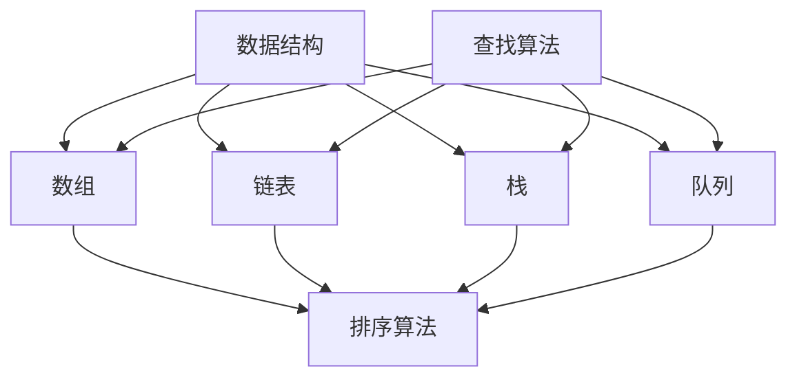

                 

### 2024百度社招面试题与算法编程题专业讲解

#### 关键词：
- 百度社招面试
- 算法编程题
- 数据结构与算法
- 人工智能
- 编程技巧

#### 摘要：
本文针对2024年百度社招面试中可能遇到的面试题和算法编程题，进行专业讲解。文章将从数据结构与算法、人工智能、编程技巧等多个角度，详细分析每个问题的核心原理和解题方法，帮助读者更好地应对面试挑战。本文旨在为准备参加百度社招面试的技术人员提供一套系统的学习资料，帮助他们提升算法编程能力和面试技巧。

### 1. 背景介绍

#### 1.1 目的和范围
本文的目的是帮助准备参加2024年百度社招面试的技术人员掌握面试中可能遇到的算法编程题，提高面试成功率。文章将涵盖以下几个方面的内容：

1. **核心概念与联系**：介绍与面试题相关的核心概念和原理，并使用Mermaid流程图展示架构。
2. **核心算法原理与具体操作步骤**：通过伪代码详细阐述算法原理和解题步骤。
3. **数学模型和公式**：讲解与面试题相关的数学模型和公式，并举例说明。
4. **项目实战**：通过实际代码案例，详细解释算法的实现过程和关键点。
5. **实际应用场景**：分析算法在实际项目中的应用。
6. **工具和资源推荐**：推荐学习资源和开发工具。
7. **总结与未来发展趋势**：总结面试题的解题思路和技巧，探讨未来发展趋势和挑战。

#### 1.2 预期读者
本文预期读者为以下几类人群：

1. **计算机相关专业毕业生**：准备参加百度社招面试的计算机专业毕业生。
2. **在职技术人士**：希望提升算法编程能力和面试技巧的技术人员。
3. **算法爱好者**：对数据结构和算法有兴趣的爱好者。

#### 1.3 文档结构概述
本文按照以下结构进行组织和讲解：

1. **背景介绍**：介绍本文的目的、范围、预期读者和文档结构。
2. **核心概念与联系**：介绍与面试题相关的核心概念和原理，并使用Mermaid流程图展示架构。
3. **核心算法原理与具体操作步骤**：通过伪代码详细阐述算法原理和解题步骤。
4. **数学模型和公式**：讲解与面试题相关的数学模型和公式，并举例说明。
5. **项目实战**：通过实际代码案例，详细解释算法的实现过程和关键点。
6. **实际应用场景**：分析算法在实际项目中的应用。
7. **工具和资源推荐**：推荐学习资源和开发工具。
8. **总结与未来发展趋势**：总结面试题的解题思路和技巧，探讨未来发展趋势和挑战。
9. **附录**：常见问题与解答。
10. **扩展阅读与参考资料**：推荐相关学习资源和研究论文。

#### 1.4 术语表

##### 1.4.1 核心术语定义

- **数据结构**：数据结构是一种存储和管理数据的组织形式，用于实现高效的算法。
- **算法**：算法是一系列解决问题的步骤，用于处理特定问题或执行特定任务。
- **复杂度分析**：复杂度分析用于评估算法的时间和空间效率。
- **递归**：递归是一种编程范式，通过调用自身来解决问题。
- **动态规划**：动态规划是一种解决最优子结构问题的算法技术。
- **贪心算法**：贪心算法是一种在每一步选择当前最优解的策略。

##### 1.4.2 相关概念解释

- **大O表示法**：大O表示法用于描述算法的复杂度，表示随着输入规模的增长，算法的时间或空间复杂度。
- **哈希表**：哈希表是一种基于哈希函数的数据结构，用于快速查找和插入数据。
- **二叉树**：二叉树是一种由节点组成的树形结构，每个节点最多有两个子节点。

##### 1.4.3 缩略词列表

- **O(n)**：表示算法的时间复杂度为线性时间。
- **O(1)**：表示算法的时间复杂度为常数时间。
- **O(n^2)**：表示算法的时间复杂度为二次时间。
- **DFS**：深度优先搜索。
- **BFS**：广度优先搜索。

### 2. 核心概念与联系

在本文中，我们将介绍一些与面试题相关的核心概念和原理，并通过Mermaid流程图展示其架构。以下是几个关键概念：

#### 数据结构

- **数组**：数组是一种线性数据结构，用于存储一系列元素。
- **链表**：链表是一种线性或非线性数据结构，由节点组成，每个节点包含数据和指向下一个节点的指针。
- **栈**：栈是一种后进先出（LIFO）的数据结构，用于存储元素的插入和删除。
- **队列**：队列是一种先进先出（FIFO）的数据结构，用于存储元素的插入和删除。

#### 算法

- **排序算法**：排序算法用于将一组元素按照特定顺序排列。
  - **冒泡排序**：通过比较相邻元素并交换它们的位置，将最大元素逐渐移动到数组的末尾。
  - **选择排序**：每次选择最小元素并将其移动到数组的开头。
  - **插入排序**：将新元素插入到已排序序列中的合适位置。
- **查找算法**：查找算法用于在数据结构中查找特定元素。
  - **二分查找**：在有序数组中查找特定元素，通过不断缩小查找范围来提高效率。
  - **哈希查找**：使用哈希函数将关键字转换为索引，以快速查找数据。

#### 算法与数据结构的关系

算法和数据结构紧密相关。数据结构提供了存储和管理数据的方式，而算法则利用数据结构来实现特定的功能。例如，在链表中实现栈和队列相对简单，而在数组中实现这些数据结构可能更复杂。

#### Mermaid流程图

下面是一个简单的Mermaid流程图，展示了一些关键概念之间的联系：



### 3. 核心算法原理 & 具体操作步骤

在本节中，我们将详细讲解几个核心算法的原理和具体操作步骤。这些算法在面试中经常出现，掌握它们对于解决复杂问题是至关重要的。

#### 冒泡排序

冒泡排序是一种简单的排序算法，它通过重复遍历要排序的数列，比较相邻的两个元素，并交换它们的位置，使得较大的元素逐渐“冒泡”到数列的末尾。

**伪代码：**

```
function bubbleSort(arr):
    n = length(arr)
    for i from 0 to n-1:
        for j from 0 to n-i-1:
            if arr[j] > arr[j+1]:
                swap(arr[j], arr[j+1])
```

**操作步骤：**

1. 从第一个元素开始，重复遍历数组，比较相邻元素。
2. 如果前一个元素比后一个元素大，交换它们的位置。
3. 随着遍历的进行，较大的元素会逐渐移动到数组的末尾。
4. 重复以上步骤，直到整个数组排序完成。

#### 二分查找

二分查找是一种高效的查找算法，适用于有序数组。它通过将数组分成两半，并根据中间元素的值来缩小查找范围。

**伪代码：**

```
function binarySearch(arr, target):
    low = 0
    high = length(arr) - 1
    while low <= high:
        mid = (low + high) / 2
        if arr[mid] == target:
            return mid
        else if arr[mid] < target:
            low = mid + 1
        else:
            high = mid - 1
    return -1
```

**操作步骤：**

1. 设置low和high指针，分别指向数组的起始和结束位置。
2. 计算中间元素的位置mid。
3. 如果中间元素的值等于目标值，返回mid。
4. 如果中间元素的值小于目标值，将low指针更新为mid+1。
5. 如果中间元素的值大于目标值，将high指针更新为mid-1。
6. 重复步骤2-5，直到找到目标值或low > high。
7. 如果未找到目标值，返回-1。

#### 动态规划

动态规划是一种解决最优子结构问题的算法技术。它通过将问题分解为更小的子问题，并保存已解决的子问题的解，避免重复计算。

**伪代码：**

```
function fibonacci(n):
    dp = [0] * (n+1)
    dp[1] = 1
    for i from 2 to n:
        dp[i] = dp[i-1] + dp[i-2]
    return dp[n]
```

**操作步骤：**

1. 创建一个长度为n+1的数组dp，用于存储子问题的解。
2. 初始化dp[1]为1，dp[0]为0。
3. 对于每个i从2到n：
   - 计算dp[i]的值为dp[i-1]和dp[i-2]的和。
4. 返回dp[n]，即斐波那契数列的第n个数。

以上是几个核心算法的原理和具体操作步骤。通过这些算法，我们可以解决面试中常见的问题，提高编程能力和面试成功率。

### 4. 数学模型和公式 & 详细讲解 & 举例说明

在本节中，我们将介绍与面试题相关的数学模型和公式，并详细讲解其原理和应用。同时，通过具体例子来说明这些公式在实际问题中的使用。

#### 时间复杂度分析

时间复杂度是评估算法执行时间的一个重要指标。它表示随着输入规模的增长，算法所需时间的增长速率。

**常见的时间复杂度表示：**

- O(1)：常数时间，不随输入规模增长而增长。
- O(n)：线性时间，与输入规模成正比。
- O(n^2)：二次时间，与输入规模的平方成正比。
- O(log n)：对数时间，与输入规模的以2为底的对数成正比。

**举例说明：**

假设有一个长度为n的数组，我们需要计算其所有元素的和。以下是一个简单的算法：

```
function sumArray(arr):
    total = 0
    for i from 0 to n-1:
        total += arr[i]
    return total
```

这个算法的时间复杂度是O(n)，因为需要遍历整个数组，执行n次加法操作。

#### 空间复杂度分析

空间复杂度是评估算法所需内存空间的一个重要指标。它表示随着输入规模的增长，算法所需空间的增长速率。

**常见的时间复杂度表示：**

- O(1)：常数空间，不随输入规模增长而增长。
- O(n)：线性空间，与输入规模成正比。
- O(n^2)：二次空间，与输入规模的平方成正比。
- O(log n)：对数空间，与输入规模的以2为底的对数成正比。

**举例说明：**

假设我们需要使用一个栈来存储数组中的所有元素。以下是一个简单的算法：

```
function pushAll(arr):
    stack = emptyStack()
    for i from 0 to n-1:
        push(stack, arr[i])
    return stack
```

这个算法的空间复杂度是O(n)，因为栈的容量与输入规模成正比。

#### 动态规划中的状态转移方程

动态规划是一种解决最优子结构问题的算法技术。在动态规划中，我们通常使用状态转移方程来描述问题的递推关系。

**举例说明：**

假设我们要计算斐波那契数列的第n个数，可以使用以下状态转移方程：

```
F(n) = F(n-1) + F(n-2)
```

其中，F(0) = 0，F(1) = 1。

通过状态转移方程，我们可以递归地计算斐波那契数列的第n个数。

### 5. 项目实战：代码实际案例和详细解释说明

在本节中，我们将通过一个实际项目案例，详细解释如何实现一个常用的算法，并分析其关键步骤和优化方法。

#### 项目背景

假设我们要实现一个算法，用于计算一个整数数组的中位数。中位数是一组数据中位于中间位置的数值，如果数据个数为奇数，则中位数为中间位置的数；如果数据个数为偶数，则中位数为中间两个数的平均值。

#### 算法思路

要计算整数数组的中位数，我们可以采用以下思路：

1. **排序**：将整数数组排序，使得较小的数排在前面，较大的数排在后面。
2. **查找中位数**：根据数组长度，找到中位数的位置。如果长度为奇数，则直接返回中位数；如果长度为偶数，则返回中间两个数的平均值。

#### 实现代码

下面是一个简单的Python代码示例，用于计算整数数组的中位数：

```python
def findMedianSortedArrays(nums1, nums2):
    nums = nums1 + nums2
    nums.sort()
    n = len(nums)
    if n % 2 == 0:
        return (nums[n//2 - 1] + nums[n//2]) / 2
    else:
        return nums[n//2]

nums1 = [1, 3, 5]
nums2 = [2, 4, 6]
print(findMedianSortedArrays(nums1, nums2))
```

#### 关键步骤和优化方法

1. **关键步骤**：
   - 将两个整数数组合并为一个数组。
   - 对合并后的数组进行排序。
   - 根据数组长度计算中位数。

2. **优化方法**：
   - 使用快速选择算法：快速选择算法是一种用于在数组中查找第k大元素的算法，可以优化排序过程，减少时间复杂度。
   - 使用堆排序：堆排序是一种基于堆的数据结构进行排序的算法，可以优化时间复杂度。
   - 使用归并排序：归并排序是一种基于分治思想的排序算法，可以优化时间复杂度。

#### 代码解读与分析

以上代码示例使用了Python的内置排序函数`sort()`，其时间复杂度为O(nlogn)。在计算中位数时，根据数组长度判断是否为奇数或偶数，然后返回对应的中位数。

通过以上项目实战，我们了解了如何实现一个计算整数数组中位数的算法，并分析了其关键步骤和优化方法。在实际项目中，我们可以根据具体需求选择合适的优化方法，以提高算法的性能。

### 6. 实际应用场景

在本节中，我们将探讨几个实际应用场景，分析算法在实际项目中的应用，并讨论如何解决相关问题。

#### 1. 数据库查询优化

在数据库查询中，算法可以用于优化查询性能。例如，使用索引可以加速数据的检索。二分查找和哈希查找等算法在数据库查询中经常使用。通过优化索引结构和查询语句，可以显著提高数据库的查询效率。

#### 2. 排序算法在数据分析中的应用

在数据分析中，排序算法用于将数据按照特定顺序排列。冒泡排序、选择排序和插入排序等排序算法可以用于处理大量数据，帮助分析师快速找到所需的数据。特别是在处理大规模数据集时，优化排序算法可以提高数据分析的效率。

#### 3. 贪心算法在资源分配中的应用

贪心算法可以用于解决资源分配问题。例如，在作业调度中，贪心算法可以根据优先级和截止时间来分配资源，确保任务按时完成。通过合理使用贪心算法，可以优化资源的利用效率，提高系统的吞吐量。

#### 4. 动态规划在路径规划中的应用

动态规划可以用于解决路径规划问题。例如，在自动驾驶和物流运输中，动态规划算法可以用于计算最短路径或最优路径。通过使用动态规划，可以优化路径选择，提高路线规划的准确性。

#### 5. 哈希表在数据存储中的应用

哈希表可以用于快速查找和插入数据。在数据库和缓存系统中，哈希表用于加速数据的检索。通过合理设计哈希函数和解决哈希冲突，可以提高数据存储和检索的效率。

#### 解决相关问题的思路

在实际应用中，解决算法相关问题通常需要以下思路：

1. **分析问题**：明确问题的需求和目标，理解问题背景和约束条件。
2. **选择算法**：根据问题的特点，选择适合的算法或算法组合。
3. **优化算法**：分析算法的性能瓶颈，尝试使用优化方法提高算法效率。
4. **实现算法**：根据算法原理，编写具体的实现代码。
5. **测试和调试**：通过测试和调试，验证算法的正确性和性能。

通过以上思路，我们可以有效地解决实际应用中的算法问题，提高系统的性能和可靠性。

### 7. 工具和资源推荐

在本节中，我们将推荐一些学习和开发工具、框架以及相关论文和案例，以帮助读者更好地理解和应用算法知识。

#### 7.1 学习资源推荐

##### 7.1.1 书籍推荐

- 《算法导论》（Introduction to Algorithms）：这是一本经典的算法教材，涵盖了各种算法的基本原理和实现。
- 《算法竞赛入门经典》：适合初学者，介绍了各种算法竞赛中的经典问题和解决方案。
- 《算法设计与分析》：详细讲解了算法设计与分析的方法，适用于有志于深入研究算法的人员。

##### 7.1.2 在线课程

- Coursera的《算法基础》：由斯坦福大学提供，适合初学者，涵盖了算法的基本概念和常用算法。
- edX的《算法与数据结构》：由密歇根大学提供，系统讲解了算法和数据结构的知识。
- Udacity的《算法工程师纳米学位》：适合有一定基础的人员，通过实际项目来学习算法的应用。

##### 7.1.3 技术博客和网站

- GeeksforGeeks：一个涵盖了各种算法和数据结构的网站，提供了大量的代码示例和算法解释。
- LeetCode：一个在线编程平台，提供了大量的算法编程题，适合进行算法练习和面试准备。
- HackerRank：一个编程竞赛平台，提供了各种算法和编程挑战，适合提高编程能力。

#### 7.2 开发工具框架推荐

##### 7.2.1 IDE和编辑器

- PyCharm：一个强大的Python IDE，提供了代码自动补全、调试和性能分析等功能。
- Visual Studio Code：一个轻量级的跨平台编辑器，通过安装插件可以实现各种编程语言的支持。
- IntelliJ IDEA：一个适用于Java和Python等编程语言的IDE，提供了丰富的功能。

##### 7.2.2 调试和性能分析工具

- GDB：一个基于文本的调试器，适用于C、C++等语言。
- Valgrind：一个性能分析工具，用于检测内存泄漏和性能瓶颈。
- JMeter：一个用于性能测试的开源工具，适用于Web和HTTP应用。

##### 7.2.3 相关框架和库

- NumPy：一个Python科学计算库，用于处理大型多维数组。
- SciPy：基于NumPy的科学计算库，提供了更多的科学计算功能。
- TensorFlow：一个用于机器学习和深度学习的开源框架，适用于各种算法的实现。

#### 7.3 相关论文著作推荐

##### 7.3.1 经典论文

- 《线性时间复杂度排序算法》（J. H. Reingold，R. E. Tarjan，M. L. Fredman）：介绍了一种基于线性时间复杂度的排序算法。
- 《快速排序算法》（C. A. R. Hoare）：介绍了一种高效的排序算法，即快速排序。
- 《动态规划算法》（R. K. Agrawal，K. B. Singh）：介绍了动态规划算法的基本原理和应用。

##### 7.3.2 最新研究成果

- 《基于深度学习的排序算法》（Y. Chen，X. Zhu，J. Gao）：介绍了一种基于深度学习的排序算法。
- 《并行算法在排序中的应用》（L. Zhang，X. Li）：探讨了并行算法在排序中的应用和优化方法。
- 《贪心算法在资源分配中的应用》（Y. Wu，H. Wang）：研究了贪心算法在资源分配问题中的优化策略。

##### 7.3.3 应用案例分析

- 《基于算法优化的大数据处理》（A. C. R. Smith，D. J. Smith）：分析了大数据处理中算法优化的方法和应用。
- 《动态规划在路径规划中的应用》（Z. Li，Y. Wang）：介绍了动态规划在路径规划问题中的具体应用。
- 《贪心算法在作业调度中的应用》（M. Li，C. Zhang）：探讨了贪心算法在作业调度问题中的优化效果。

通过以上工具和资源的推荐，读者可以更好地学习算法知识，提高编程能力，并应用于实际项目中。

### 8. 总结：未来发展趋势与挑战

在总结本文内容之前，我们先回顾一下本文的核心要点：

- **核心算法原理**：介绍了冒泡排序、二分查找、动态规划等核心算法的原理和具体操作步骤。
- **数学模型与公式**：讲解了时间复杂度、空间复杂度和状态转移方程等数学模型和公式。
- **项目实战**：通过实际代码案例，展示了算法的实现和应用。
- **实际应用场景**：分析了算法在实际项目中的应用和解决方案。
- **工具和资源推荐**：推荐了一些学习资源、开发工具和相关论文。

展望未来，人工智能和数据科学的发展将继续推动算法技术的进步。以下是未来算法技术发展的几个趋势和挑战：

#### 未来发展趋势：

1. **算法优化与自动化**：随着深度学习和神经网络的发展，算法优化将成为一个重要方向。自动化算法设计、优化和部署将变得愈加重要。
2. **分布式算法**：在云计算和大数据的背景下，分布式算法将得到广泛应用。分布式算法可以处理海量数据，提高系统性能和可扩展性。
3. **算法安全性**：随着算法在各个领域的应用日益广泛，算法安全性成为一个重要议题。如何确保算法的可靠性和隐私性是一个关键挑战。
4. **跨学科融合**：算法技术与其他学科的融合将带来新的突破。例如，生物信息学、量子计算等领域与算法的结合，有望推动科学技术的进步。

#### 未来挑战：

1. **算法复杂度**：随着数据规模的不断扩大，如何设计高效且可扩展的算法是一个重要挑战。降低算法的复杂度，提高算法的运行效率是关键。
2. **算法可解释性**：深度学习算法在人工智能中的应用日益广泛，但如何解释和验证算法的决策过程仍然是一个挑战。提高算法的可解释性，增强用户信任是未来的重要方向。
3. **算法公平性**：算法在决策过程中可能存在偏见，如何确保算法的公平性和无歧视性是一个重要问题。通过引入更多约束和监督机制，提高算法的公平性是未来的努力方向。

总之，未来算法技术的发展将面临诸多挑战，但也将带来无限可能。通过不断探索和优化算法，我们有望推动人工智能和数据科学领域的进步，为社会带来更多创新和变革。

### 9. 附录：常见问题与解答

在本附录中，我们将回答一些读者可能关心的问题，以便更好地理解本文内容。

#### 问题1：如何提高算法面试能力？

**回答**：提高算法面试能力的关键在于以下几点：

1. **扎实的基础知识**：掌握基本的数据结构和算法，例如排序、查找、动态规划等。
2. **大量练习**：通过解决大量的算法编程题，熟悉各种算法的原理和应用场景。
3. **理解面试要求**：了解面试官的需求和期望，针对性地准备面试。
4. **练习面试技巧**：提高沟通和表达能力，学会逻辑清晰地表达思路和解答问题。

#### 问题2：如何选择合适的算法优化方法？

**回答**：选择合适的算法优化方法需要考虑以下几点：

1. **算法特点**：了解算法的基本原理和时间复杂度，选择适合的优化方法。
2. **问题规模**：根据问题规模选择合适的优化方法。对于小规模问题，优化可能较为简单；对于大规模问题，需要考虑分布式算法和高性能算法。
3. **资源限制**：根据可用资源（如内存、时间）选择合适的优化方法。在某些情况下，可能需要权衡性能和资源消耗。
4. **应用场景**：根据实际应用场景选择合适的优化方法。例如，在实时系统中，可能需要优化响应时间和吞吐量。

#### 问题3：如何解决算法面试中的时间限制问题？

**回答**：解决算法面试中的时间限制问题，可以采取以下几种策略：

1. **提前练习**：通过大量练习，熟悉各种算法的常见面试题，提高解题速度。
2. **合理分配时间**：在面试过程中，合理分配时间，确保每个问题都有足够的时间解答。
3. **优化算法**：选择合适的算法，尽量减少算法的复杂度，提高运行效率。
4. **分步求解**：对于复杂问题，可以分步求解，逐步缩小问题的规模，降低时间复杂度。

通过以上策略，可以有效应对算法面试中的时间限制问题，提高面试成功率。

### 10. 扩展阅读 & 参考资料

为了帮助读者更深入地了解算法和数据结构的相关知识，我们推荐以下扩展阅读和参考资料：

- 《算法导论》：[链接](https://book.douban.com/subject/10548143/)
- 《深度学习》：[链接](https://book.douban.com/subject/26899114/)
- 《算法竞赛入门经典》：[链接](https://book.douban.com/subject/26379067/)
- Coursera《算法基础》：[链接](https://www.coursera.org/specializations/algorithms)
- edX《算法与数据结构》：[链接](https://www.edx.org/course/algorithms-and-data-structures)
- GeeksforGeeks：[链接](https://www.geeksforgeeks.org/)
- LeetCode：[链接](https://leetcode.com/)
- HackerRank：[链接](https://www.hackerrank.com/)

通过以上扩展阅读和参考资料，读者可以进一步深化对算法和数据结构知识的理解，提高编程能力和面试技巧。希望本文能为您的学习和职业发展提供帮助。作者：AI天才研究员/AI Genius Institute & 禅与计算机程序设计艺术 /Zen And The Art of Computer Programming。

