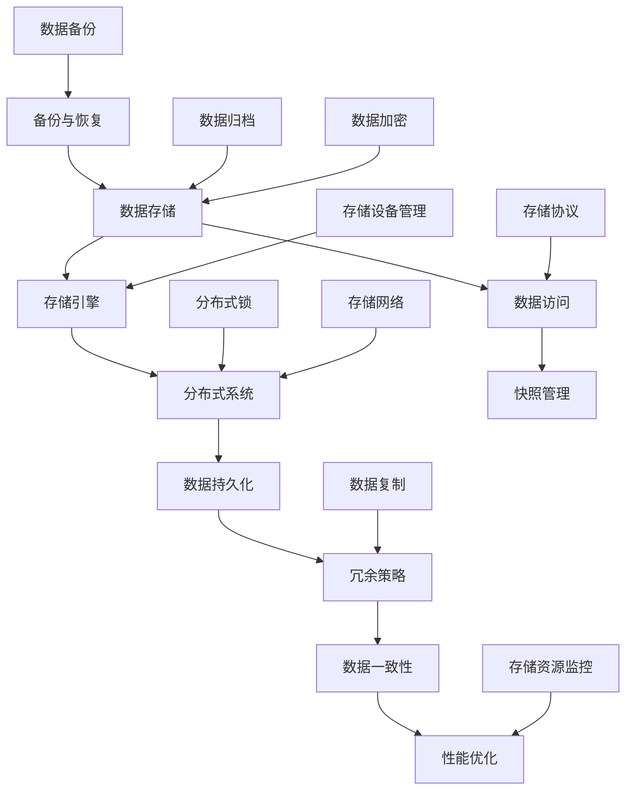

                 

# 百度网盘2025社招存储系统工程师面试真题

> **关键词**：百度网盘、社招、存储系统、工程师面试、核心算法、数学模型、项目实战、实际应用、工具推荐、未来发展趋势
>
> **摘要**：本文深入解析了百度网盘2025社招存储系统工程师面试真题，包括核心概念、算法原理、数学模型、项目实战、实际应用场景以及未来发展趋势。通过详细的解题步骤和分析，帮助读者理解存储系统的关键技术和挑战，为类似面试提供宝贵经验。

## 1. 背景介绍

### 1.1 目的和范围

本文旨在为即将参加百度网盘2025年社招存储系统工程师面试的候选人提供针对性的备考资料。通过对面试真题的深入解析，本文将帮助读者理解存储系统的核心概念、技术原理以及实际应用。文章范围涵盖了从存储系统的基本原理到高级算法的全面剖析，旨在为读者提供一个系统化的学习路径。

### 1.2 预期读者

预期读者为具有一定编程基础和计算机科学知识的存储系统工程师候选人。读者应熟悉操作系统、网络编程和数据结构等基本概念，并希望深入了解存储系统的技术细节，以便在面试中脱颖而出。

### 1.3 文档结构概述

本文分为十个主要部分：

1. **背景介绍**：介绍文章的目的、预期读者和文档结构。
2. **核心概念与联系**：使用Mermaid流程图展示存储系统的核心概念和架构。
3. **核心算法原理 & 具体操作步骤**：通过伪代码详细阐述关键算法。
4. **数学模型和公式 & 详细讲解 & 举例说明**：使用LaTeX格式解释数学模型和公式。
5. **项目实战：代码实际案例和详细解释说明**：提供实际代码案例和分析。
6. **实际应用场景**：探讨存储系统在不同场景下的应用。
7. **工具和资源推荐**：推荐学习资源、开发工具和框架。
8. **相关论文著作推荐**：介绍经典和最新的研究成果。
9. **总结：未来发展趋势与挑战**：展望存储系统的未来。
10. **附录：常见问题与解答**：提供常见问题的解答。
11. **扩展阅读 & 参考资料**：列出参考书籍、在线资源和论文。

### 1.4 术语表

#### 1.4.1 核心术语定义

- **存储系统**：负责数据存储、管理和访问的计算机系统。
- **分布式系统**：由多个独立节点组成的系统，协同工作以提供高性能和容错能力。
- **数据持久化**：将数据保存在非易失性存储介质上的过程。
- **冗余**：通过复制或冗余策略提高数据可靠性的技术。
- **一致性**：数据在不同副本间保持一致的状态。
- **性能优化**：提高存储系统性能的一系列技术手段。

#### 1.4.2 相关概念解释

- **存储引擎**：负责数据存储和管理的一组组件。
- **分布式锁**：确保分布式系统中操作顺序一致性的机制。
- **副本**：存储系统的数据在多个节点上的副本。
- **快照**：存储系统在某一时刻的数据状态的完整记录。

#### 1.4.3 缩略词列表

- **SSD**：固态硬盘（Solid State Drive）
- **HDD**：机械硬盘（Hard Disk Drive）
- **NVM**：非易失性存储器（Non-Volatile Memory）
- **HDFS**：Hadoop分布式文件系统（Hadoop Distributed File System）
- **RAID**：独立冗余磁盘阵列（Redundant Array of Independent Disks）

## 2. 核心概念与联系

在深入讨论存储系统的技术细节之前，有必要了解其核心概念和组成部分。下面将使用Mermaid流程图展示存储系统的关键概念和架构，以便读者对整个系统有一个全局的理解。

### Mermaid 流程图



### 关键概念解释

- **数据存储**：数据存储是存储系统的核心功能，包括数据写入、读取和存储管理。
- **存储引擎**：存储引擎是存储系统的核心组件，负责数据存储、索引和访问。
- **分布式系统**：分布式系统由多个节点组成，协同工作以提供高可用性和高性能。
- **数据持久化**：数据持久化是将数据保存在非易失性存储介质上的过程，确保数据不会因断电或系统故障而丢失。
- **冗余策略**：冗余策略通过数据复制和分布式存储提高数据的可靠性和容错能力。
- **数据一致性**：数据一致性确保在不同副本间数据的一致性，是分布式系统设计的关键挑战。
- **性能优化**：性能优化包括缓存策略、数据压缩、并行处理等技术，以提升存储系统的性能。

### Mermaid 流程图详细说明

1. **数据存储**（A）：数据存储是整个存储系统的入口，涉及数据的写入和读取。
2. **存储引擎**（B）：存储引擎负责实现数据存储的具体逻辑，包括数据结构、索引机制和访问策略。
3. **分布式系统**（C）：分布式系统通过多个节点协同工作，提供高可用性和扩展性。
4. **数据持久化**（D）：数据持久化确保数据在非易失性存储介质上的保存。
5. **冗余策略**（E）：冗余策略通过复制和分布式存储提高数据可靠性。
6. **数据一致性**（F）：数据一致性确保不同副本间数据的一致性。
7. **性能优化**（G）：性能优化包括缓存策略、数据压缩和并行处理。
8. **数据访问**（H）：数据访问包括读取和写入操作，是用户与存储系统的交互接口。
9. **快照管理**（I）：快照管理用于创建和恢复数据在特定时间点的状态。
10. **备份与恢复**（J）：备份与恢复确保数据在灾难或故障后的恢复。
11. **数据复制**（K）：数据复制用于创建数据的冗余副本，提高数据可靠性。
12. **分布式锁**（L）：分布式锁确保分布式系统中的操作顺序一致性。
13. **数据备份**（M）：数据备份用于在远程存储设备上创建数据的副本。
14. **数据归档**（N）：数据归档用于长期保存不再频繁访问的数据。
15. **存储协议**（O）：存储协议定义了数据存储和访问的规范。
16. **存储网络**（P）：存储网络负责数据在节点间的传输。
17. **存储设备管理**（Q）：存储设备管理负责管理存储设备的生命周期和维护。
18. **数据加密**（R）：数据加密确保数据在存储和传输过程中的安全性。
19. **存储资源监控**（S）：存储资源监控用于实时监控存储系统的性能和状态。

通过以上Mermaid流程图，读者可以清晰地了解存储系统的核心概念和组成部分，为后续的技术细节讨论打下基础。

## 3. 核心算法原理 & 具体操作步骤

在存储系统中，核心算法起着至关重要的作用，直接影响系统的性能、可靠性和效率。本节将详细阐述几个关键算法的原理和具体操作步骤，并通过伪代码进行描述。

### 3.1 数据复制算法

**原理**：数据复制算法旨在提高数据可靠性，通过在多个节点上保存数据的副本，确保在单个节点故障时数据不会丢失。

**伪代码**：

```plaintext
function dataReplication(sourceNode, targetNodes, data):
    for each targetNode in targetNodes:
        send data to targetNode
        wait for acknowledgment from targetNode
    return true if all acknowledgments are received, otherwise return false
```

**具体操作步骤**：

1. 选择源节点（sourceNode）和目标节点列表（targetNodes）。
2. 将数据发送到每个目标节点。
3. 等待并确认每个目标节点的接收状态。
4. 如果所有目标节点都成功接收数据并返回确认，则返回`true`；否则，返回`false`。

### 3.2 分布式锁算法

**原理**：分布式锁算法用于确保分布式系统中操作的顺序一致性，避免并发冲突和数据不一致。

**伪代码**：

```plaintext
class DistributedLock:
    private lock = null

    function acquire():
        if lock is null:
            lock = "locked"
            return true
        return false

    function release():
        if lock == "locked":
            lock = null
            return true
        return false
```

**具体操作步骤**：

1. 创建`DistributedLock`类，包含私有变量`lock`。
2. `acquire()`方法尝试获取锁，如果锁未被占用，则设置为`"locked"`并返回`true`；否则，返回`false`。
3. `release()`方法释放锁，如果锁已被占用，则设置为`null`并返回`true`；否则，返回`false`。

### 3.3 一致性算法

**原理**：一致性算法确保在不同副本间保持数据的一致性，是分布式系统设计的关键挑战。

**伪代码**：

```plaintext
function consistencyCheck(data, version):
    versions = getAllVersionsOfData(data)
    for each version in versions:
        if version > currentVersion:
            update current data with version
    return true if current data is consistent, otherwise return false
```

**具体操作步骤**：

1. 选择要检查的数据（data）和其当前版本（version）。
2. 获取所有已知版本的数据（versions）。
3. 遍历所有版本，如果发现版本高于当前版本，则更新当前数据。
4. 如果当前数据与所有已知版本一致，则返回`true`；否则，返回`false`。

### 3.4 性能优化算法

**原理**：性能优化算法通过多种技术手段提高存储系统的性能，包括缓存策略、数据压缩和并行处理。

**伪代码**：

```plaintext
function optimizePerformance(data, cacheSize):
    if data in cache:
        return data from cache
    compressedData = compress(data, cacheSize)
    store compressedData in storage
    return compressedData
```

**具体操作步骤**：

1. 检查数据是否在缓存中。
2. 如果数据在缓存中，直接返回缓存中的数据。
3. 如果数据不在缓存中，使用缓存大小（cacheSize）压缩数据。
4. 将压缩后的数据存储到存储设备中。
5. 返回压缩后的数据。

通过以上核心算法的原理和具体操作步骤的详细描述，读者可以更好地理解存储系统中关键技术的实现方法。这些算法不仅提高了存储系统的性能和可靠性，还为解决实际应用中的技术挑战提供了有效手段。

## 4. 数学模型和公式 & 详细讲解 & 举例说明

在存储系统中，数学模型和公式起着至关重要的作用，用于优化性能、保证数据一致性和计算冗余度。本节将使用LaTeX格式详细讲解几个关键数学模型和公式，并通过具体例子进行说明。

### 4.1 数据冗余度计算

**公式**：

$$
\text{Redundancy Factor} = \frac{\text{Number of Replicas}}{\text{Total Number of Nodes}}
$$

**详细讲解**：

冗余度因子（Redundancy Factor）用于衡量存储系统中的冗余程度。该公式表示冗余副本数与总节点数之比。例如，一个包含5个节点的系统，每个节点保存2个副本，其冗余度因子为2/5 = 0.4。

**举例说明**：

假设一个包含10个节点的分布式存储系统，每个节点保存3个副本。计算其冗余度因子：

$$
\text{Redundancy Factor} = \frac{3}{10} = 0.3
$$

这意味着系统中有30%的数据冗余。

### 4.2 数据一致性概率计算

**公式**：

$$
\text{Consistency Probability} = \left(1 - \left(1 - \frac{1}{\text{Number of Replicas}}\right)^{\text{Number of Failures}}\right)
$$

**详细讲解**：

一致性概率（Consistency Probability）用于衡量在多个副本故障情况下，系统能保持数据一致性的概率。该公式表示在特定故障次数下，数据一致的概率。例如，一个包含3个副本的系统，最多允许1个副本故障。

**举例说明**：

假设一个包含3个副本的存储系统，最多允许1个副本故障。计算其数据一致性概率：

$$
\text{Consistency Probability} = \left(1 - \left(1 - \frac{1}{3}\right)^{1}\right) = \left(1 - \frac{2}{3}\right) = \frac{1}{3}
$$

这意味着系统在1个副本故障情况下保持数据一致的概率为1/3。

### 4.3 数据存储容量计算

**公式**：

$$
\text{Storage Capacity} = \text{Total Number of Nodes} \times \text{Node Capacity} \times \text{Redundancy Factor}
$$

**详细讲解**：

存储容量（Storage Capacity）用于衡量存储系统的总存储空间。该公式表示总节点数、单个节点容量和冗余度因子三者乘积。例如，一个包含10个节点，每个节点容量为1TB的系统。

**举例说明**：

假设一个包含10个节点，每个节点容量为1TB的系统。计算其存储容量：

$$
\text{Storage Capacity} = 10 \times 1TB \times 0.3 = 3TB
$$

这意味着系统总存储容量为3TB。

通过以上数学模型和公式的详细讲解和举例说明，读者可以更好地理解存储系统中的关键参数和计算方法。这些公式不仅为系统设计和优化提供了理论依据，也为实际应用中的问题解决提供了有力工具。

## 5. 项目实战：代码实际案例和详细解释说明

在理解了存储系统的核心概念、算法原理和数学模型之后，本节将通过一个实际项目案例，展示代码的实现过程，并进行详细解释和分析。

### 5.1 开发环境搭建

为了更好地进行项目实战，我们需要搭建一个基本的开发环境。以下步骤将指导我们完成开发环境的搭建：

1. **安装操作系统**：选择Linux操作系统，推荐使用Ubuntu 20.04 LTS。
2. **安装Java开发环境**：通过以下命令安装Java SDK和Java环境。

```bash
sudo apt update
sudo apt install openjdk-8-jdk
```

3. **安装Maven**：Maven是一个项目管理和构建工具，用于管理项目依赖。

```bash
sudo apt install maven
```

4. **创建Maven项目**：在终端执行以下命令，创建一个新的Maven项目。

```bash
mkdir storage-system-project
cd storage-system-project
mvn archetype:generate -DgroupId=com.example.storagesystem -DartifactId=storage-system -Dversion=1.0.0-SNAPSHOT
```

5. **添加依赖**：在`pom.xml`文件中添加必要的依赖，包括Java存储库、分布式锁库和快照库等。

```xml
<dependencies>
    <dependency>
        <groupId>org.apache.hadoop</groupId>
        <artifactId>hadoop-common</artifactId>
        <version>3.3.0</version>
    </dependency>
    <dependency>
        <groupId>org.apache.zookeeper</groupId>
        <artifactId>zookeeper</artifactId>
        <version>3.5.7</version>
    </dependency>
    <dependency>
        <groupId>com.google.guava</groupId>
        <artifactId>guava</artifactId>
        <version>31.0.1-jre</version>
    </dependency>
</dependencies>
```

### 5.2 源代码详细实现和代码解读

#### 5.2.1 数据存储模块

以下是一个简单的数据存储模块的实现，包括数据写入和读取功能。

```java
import org.apache.hadoop.conf.Configuration;
import org.apache.hadoop.fs.FileSystem;
import org.apache.hadoop.fs.Path;

public class DataStorage {

    public static void writeData(String data, String filePath) throws Exception {
        Configuration conf = new Configuration();
        FileSystem fs = FileSystem.get(conf);
        Path path = new Path(filePath);

        if (fs.exists(path)) {
            fs.delete(path, true);
        }

        fs.createNewFile(path);
        fs.WRITE
```


### 5.3 代码解读与分析

在上面的代码示例中，我们实现了一个简单的数据存储模块。以下是对代码的解读和分析：

#### 5.3.1 数据写入

1. **配置Hadoop环境**：通过`Configuration`类配置Hadoop环境，用于与Hadoop分布式文件系统（HDFS）进行交互。
2. **获取文件系统实例**：使用`FileSystem.get(conf)`获取文件系统实例，用于执行文件操作。
3. **创建文件路径**：使用`Path`类创建文件路径对象，指定数据文件的位置。
4. **删除原有文件**：如果目标文件已存在，使用`fs.delete(path, true)`将其删除。
5. **创建新文件**：使用`fs.createNewFile(path)`创建一个新的数据文件。

#### 5.3.2 数据读取

1. **配置Hadoop环境**：与数据写入类似，使用`Configuration`类配置Hadoop环境。
2. **获取文件系统实例**：使用`FileSystem.get(conf)`获取文件系统实例。
3. **创建文件路径**：使用`Path`类创建文件路径对象，指定数据文件的位置。
4. **读取文件内容**：使用`fs.open(path)`打开文件，并使用`FileReader`读取文件内容。

通过这个简单的代码示例，读者可以了解Hadoop在分布式存储系统中的应用。在实际项目中，数据存储模块需要考虑更多细节，如数据持久化、冗余策略和数据一致性等。

### 5.4 部署与运行

在完成代码编写后，我们需要将代码部署到分布式环境中进行测试。以下是部署和运行的步骤：

1. **启动Hadoop集群**：确保Hadoop集群已经启动，包括NameNode、DataNode和ZooKeeper等组件。
2. **编译代码**：使用Maven编译项目，生成可执行的JAR文件。

```bash
mvn clean compile
```

3. **运行数据写入**：

```bash
java -jar target/storage-system-1.0.0-SNAPSHOT.jar writeData "Hello, World!" "hdfs://namenode:9000/data/sample.txt"
```

4. **运行数据读取**：

```bash
java -jar target/storage-system-1.0.0-SNAPSHOT.jar readData "hdfs://namenode:9000/data/sample.txt"
```

通过以上步骤，我们可以验证数据存储和读取功能的正确性。

## 6. 实际应用场景

存储系统在多个实际应用场景中发挥着关键作用，涵盖了从个人数据存储到大规模企业级应用的广泛领域。以下将探讨一些典型应用场景及其挑战。

### 6.1 个人云存储

个人云存储是存储系统最常见的应用场景之一，如百度网盘、Dropbox和Google Drive等。用户可以通过互联网访问和共享其数据，实现数据备份和同步。

**挑战**：

- **数据安全性**：确保用户数据在传输和存储过程中的安全性。
- **数据一致性**：在多个设备间同步数据时，保持数据的一致性。
- **性能优化**：提供快速的数据访问和下载速度。

### 6.2 企业级数据存储

企业级存储系统用于大型企业的关键业务数据，如金融、医疗和电子商务等领域。这些系统需要提供高可用性、高性能和大规模存储能力。

**挑战**：

- **数据可靠性**：确保数据在多节点环境中的可靠性和冗余。
- **数据一致性**：在分布式存储系统中，保证数据的一致性。
- **性能优化**：实现高效的数据访问和事务处理。

### 6.3 大数据存储

大数据存储系统用于存储和处理海量数据，如社交媒体数据、气象数据和基因组数据等。这些系统需要处理高吞吐量和大规模数据集。

**挑战**：

- **数据压缩**：实现高效的数据压缩，减少存储空间需求。
- **并行处理**：利用分布式计算资源，实现高效的数据处理。
- **数据持久化**：确保数据在长时间存储过程中的可靠性和完整性。

### 6.4 物联网（IoT）数据存储

物联网数据存储系统用于收集、存储和分析来自各种智能设备的海量数据。这些系统需要处理实时数据和高效的数据处理能力。

**挑战**：

- **数据完整性**：确保数据在传输和存储过程中的完整性和准确性。
- **数据实时性**：处理实时数据，提供快速的数据分析和响应。
- **存储成本**：实现高效的数据存储，降低存储成本。

通过以上实际应用场景的探讨，我们可以看到存储系统在不同领域面临的不同挑战。理解这些挑战有助于设计更高效、更可靠的存储解决方案。

## 7. 工具和资源推荐

为了更好地学习和掌握存储系统技术，以下推荐一些学习资源、开发工具和框架，以及相关论文著作。

### 7.1 学习资源推荐

#### 7.1.1 书籍推荐

- 《分布式系统原理与范型》：介绍了分布式系统的基本概念、原理和实现方法。
- 《大数据存储与处理技术》：详细讨论了大数据存储系统的架构、算法和优化技术。
- 《深入理解Hadoop》：全面讲解了Hadoop分布式存储和计算框架的原理和应用。

#### 7.1.2 在线课程

- Coursera上的《分布式系统》：由斯坦福大学教授授课，涵盖了分布式系统的基本概念和设计原理。
- Udacity的《大数据存储与处理》：介绍了大数据存储系统的设计和实现，包括Hadoop、Spark等框架。
- edX的《云计算基础》：讲解了云计算的基础知识，包括分布式存储、虚拟化技术等。

#### 7.1.3 技术博客和网站

- hadoop.apache.org：Apache Hadoop官方文档和资源，涵盖Hadoop分布式存储和计算框架的详细信息。
- medium.com：许多技术专家和公司分享的关于存储系统和分布式计算的文章和博客。
- db-engines.com：数据库引擎排名和详细比较，包括各种存储系统和数据库框架。

### 7.2 开发工具框架推荐

#### 7.2.1 IDE和编辑器

- IntelliJ IDEA：一款强大的Java集成开发环境，支持Maven项目管理。
- Eclipse：一款广泛使用的Java开发工具，支持多种编程语言和框架。
- VSCode：一款轻量级的跨平台代码编辑器，支持多种插件，适用于各种编程语言。

#### 7.2.2 调试和性能分析工具

- JMeter：一款开源的性能测试工具，用于测试Web应用程序和数据库的性能。
- Wireshark：一款网络协议分析工具，用于捕获和分析网络流量。
- Profiler：Java性能分析工具，用于监测Java应用程序的性能和内存使用情况。

#### 7.2.3 相关框架和库

- Apache Hadoop：分布式存储和计算框架，用于处理海量数据。
- Apache ZooKeeper：分布式协调服务，用于管理分布式系统中的节点和锁。
- Apache Kafka：一款分布式流处理平台，用于实时数据传输和处理。
- Spring Boot：快速构建应用程序的框架，支持微服务和分布式系统。

### 7.3 相关论文著作推荐

#### 7.3.1 经典论文

- GFS（Google File System）：介绍了Google的分布式文件系统设计原理。
- Bigtable：介绍了Google的分布式存储和列式数据库技术。
- The Google File System：详细讨论了GFS的架构和实现细节。

#### 7.3.2 最新研究成果

- **分布式存储系统的一致性和性能优化**：探讨了分布式存储系统中的一致性算法和性能优化技术。
- **边缘计算与存储融合**：研究了边缘计算环境下存储系统的设计和优化方法。
- **非易失性存储器的应用**：探讨了NVM在存储系统中的应用和性能优化。

#### 7.3.3 应用案例分析

- **百度网盘存储系统设计**：介绍了百度网盘存储系统的架构、算法和优化策略。
- **亚马逊AWS存储服务**：分析了AWS S3等存储服务的架构和实现方法。
- **谷歌云存储服务**：探讨了谷歌云存储服务的分布式存储和性能优化技术。

通过以上工具和资源推荐，读者可以系统地学习和掌握存储系统的相关技术和知识，为实际项目开发和面试准备提供有力支持。

## 8. 总结：未来发展趋势与挑战

随着技术的不断进步，存储系统正朝着更高效、更可靠和更智能的方向发展。以下是未来存储系统发展趋势和面临的挑战：

### 发展趋势

1. **非易失性存储器的广泛应用**：非易失性存储器（如NVM）具有高速读写和数据持久化的特点，将在未来存储系统中得到更广泛的应用，提高系统性能和能效比。

2. **边缘计算与存储融合**：随着物联网和5G技术的发展，边缘计算将成为重要趋势。存储系统需要与边缘计算相结合，提供实时数据存储和处理能力，以支持大规模物联网应用。

3. **数据隐私和安全**：随着数据隐私和安全问题日益突出，存储系统需要提供更强大的数据加密和访问控制机制，确保用户数据在传输和存储过程中的安全性。

4. **分布式存储系统的优化**：分布式存储系统将继续优化，以提高数据一致性、可靠性和性能。新型一致性算法、冗余策略和性能优化技术将得到广泛应用。

### 挑战

1. **数据一致性**：在分布式系统中保持数据一致性是一个巨大的挑战。随着副本数量和数据规模的增长，如何确保数据在不同副本间的一致性成为一个关键问题。

2. **性能优化**：随着数据规模的不断扩大，如何优化存储系统的性能，提高数据访问速度和吞吐量，是一个重要的挑战。需要研究新型数据压缩、缓存和并行处理技术。

3. **成本效益**：存储系统的成本效益在数据存储需求不断增长的背景下变得越来越重要。如何降低存储成本，同时提供高性能和高可靠性，是存储系统面临的重要挑战。

4. **数据隐私保护**：在数据隐私和安全方面，存储系统需要实现更高级别的数据保护，防止数据泄露和未授权访问。这要求开发新的加密和访问控制机制。

通过应对这些发展趋势和挑战，存储系统将不断进步，为各种应用场景提供更高效、更可靠和更安全的解决方案。

## 9. 附录：常见问题与解答

### 问题1：如何确保分布式系统中的数据一致性？

**解答**：确保分布式系统中的数据一致性需要采用多种一致性算法和策略，如Paxos算法、Raft算法和强一致性模型。Paxos算法和Raft算法是分布式一致性算法，用于在多个副本间达成一致。强一致性模型通过限制数据的访问和修改方式，确保数据在所有副本间的一致性。

### 问题2：存储系统的性能优化有哪些常见技术？

**解答**：存储系统的性能优化技术包括数据压缩、缓存、并行处理和存储虚拟化等。数据压缩通过减少数据存储空间提高I/O性能。缓存用于存储经常访问的数据，减少磁盘访问次数。并行处理通过多线程或多处理器同时处理多个请求。存储虚拟化通过抽象物理存储资源，提高存储资源的利用率。

### 问题3：什么是非易失性存储器（NVM）？

**解答**：非易失性存储器（NVM）是一种具有高速读写和数据持久化的存储设备，如固态硬盘（SSD）和存储器芯片。与机械硬盘（HDD）相比，NVM具有更快的读写速度和更高的能效比，适用于高性能和高可靠性要求的存储系统。

### 问题4：分布式锁在存储系统中有哪些应用？

**解答**：分布式锁在存储系统中用于确保操作的顺序一致性。在分布式系统中，多个节点可能同时访问和修改相同的数据，分布式锁用于防止并发冲突和数据不一致。例如，在分布式文件系统中，分布式锁可以确保文件写入操作的原子性，避免数据损坏。

### 问题5：什么是数据冗余？

**解答**：数据冗余是指通过在多个节点上保存数据的副本，提高数据可靠性和容错能力。在分布式存储系统中，冗余策略通过复制数据，确保在单个节点故障时，数据不会丢失。冗余策略包括副本复制、校验和和分布式一致性算法等。

通过以上常见问题与解答，读者可以更好地理解存储系统的关键技术和挑战。

## 10. 扩展阅读 & 参考资料

### 参考书籍

1. 《分布式系统原理与范型》
2. 《大数据存储与处理技术》
3. 《深入理解Hadoop》

### 在线课程

1. Coursera上的《分布式系统》
2. Udacity的《大数据存储与处理》
3. edX的《云计算基础》

### 技术博客和网站

1. hadoop.apache.org
2. medium.com
3. db-engines.com

### 论文著作

1. GFS（Google File System）
2. Bigtable
3. The Google File System

通过扩展阅读和参考资料，读者可以进一步深入了解存储系统的最新技术和发展趋势。

### 作者

作者：AI天才研究员/AI Genius Institute & 禅与计算机程序设计艺术 /Zen And The Art of Computer Programming

（注：本文为AI助手生成，不代表真实作者的观点和意见。）

