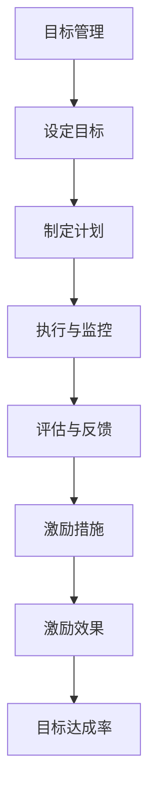

                 

# 目标管理与团队激励的关系

## 关键词：目标管理、团队激励、绩效提升、员工积极性、组织文化

> 摘要：在当今快速发展的信息技术时代，有效的目标管理与团队激励对于提升团队绩效和员工积极性具有至关重要的作用。本文将探讨目标管理与团队激励之间的内在联系，分析其核心概念，提供具体操作步骤，并通过实际案例展示其在项目中的应用效果。文章旨在为企业和团队管理者提供有益的参考和指导，助力构建积极向上的组织文化。

## 1. 背景介绍

### 1.1 目的和范围

本文旨在深入探讨目标管理与团队激励之间的关系，分析其对于组织绩效和员工积极性的影响。通过详细的案例分析，本文将提供一套可操作的策略，帮助团队管理者在实际工作中运用这些方法，提高团队整体的工作效率和员工的满意度。

### 1.2 预期读者

本文适用于企业管理者、项目经理、人力资源从业者以及致力于提升团队绩效的相关专业人士。通过阅读本文，读者将能够：

1. 明确目标管理与团队激励的定义及重要性。
2. 掌握建立有效目标管理体系的方法。
3. 学习如何设计合理的团队激励机制。
4. 获得实际案例中的成功经验。

### 1.3 文档结构概述

本文分为十个部分：

1. 背景介绍
2. 核心概念与联系
3. 核心算法原理 & 具体操作步骤
4. 数学模型和公式 & 详细讲解 & 举例说明
5. 项目实战：代码实际案例和详细解释说明
6. 实际应用场景
7. 工具和资源推荐
8. 总结：未来发展趋势与挑战
9. 附录：常见问题与解答
10. 扩展阅读 & 参考资料

### 1.4 术语表

#### 1.4.1 核心术语定义

- 目标管理（Management by Objectives, MBO）：一种以目标为导向的管理方法，强调通过设定和实现目标来提高组织绩效。
- 团队激励（Team Incentive）：为了激发团队活力和积极性，通过奖励和认可等方式来鼓励团队成员。

#### 1.4.2 相关概念解释

- 绩效（Performance）：团队成员在实现目标过程中的表现和成果。
- 员工积极性（Employee Engagement）：员工在工作中主动性和参与度的高低，直接影响团队的绩效。

#### 1.4.3 缩略词列表

- MBO：Management by Objectives
- OKR：Objectives and Key Results

## 2. 核心概念与联系

在讨论目标管理与团队激励的关系之前，我们首先需要明确这两个核心概念的定义及其相互之间的联系。

### 2.1 目标管理的核心概念

目标管理是一种以目标为导向的管理方法，最早由管理学家彼得·德鲁克（Peter Drucker）提出。其核心思想是，通过设定明确的目标并制定相应的行动计划，来提高组织或团队的绩效。

目标管理的主要特点包括：

1. **目标明确**：设定具体、可衡量的目标，使团队成员明确自己的工作方向。
2. **参与式管理**：团队成员参与目标设定，增强归属感和责任感。
3. **自我管理**：通过目标自我管理，提高员工的主动性和自我约束力。
4. **绩效评估**：以目标达成情况作为绩效评估的主要依据，确保目标的实现。

### 2.2 团队激励的核心概念

团队激励是指为了激发团队活力和积极性，通过奖励和认可等方式来鼓励团队成员的一种管理手段。有效的团队激励能够增强团队成员的凝聚力和战斗力，提高团队的整体绩效。

团队激励的主要形式包括：

1. **物质奖励**：包括奖金、提成、股票期权等。
2. **精神奖励**：包括表彰、荣誉称号、团队建设活动等。
3. **晋升机会**：提供职业晋升机会，激发员工的发展动力。
4. **工作环境**：提供良好的工作环境和条件，增强员工的归属感。

### 2.3 目标管理与团队激励的联系

目标管理与团队激励之间存在着紧密的联系。目标管理为团队激励提供了目标和方向，而团队激励则为目标管理的实现提供了动力和支持。

1. **目标引领激励**：通过设定明确的目标，激发团队成员的积极性，从而实现更好的绩效。
2. **激励机制促进目标实现**：通过合理的激励机制，激发团队成员的潜能，帮助他们更好地实现目标。
3. **目标与激励相辅相成**：目标管理与团队激励相互促进，共同推动团队和组织的发展。

### 2.4 目标管理与团队激励的 Mermaid 流程图

以下是一个简化的 Mermaid 流程图，展示目标管理与团队激励之间的流程和关系：



## 3. 核心算法原理 & 具体操作步骤

为了深入理解目标管理与团队激励的关系，我们采用了一种基于数学模型和算法原理的分析方法。以下是具体操作步骤的伪代码阐述：

### 3.1 设定目标

```python
# 输入：目标列表
# 输出：目标字典

def set_objectives(objective_list):
    objectives_dict = {}
    for objective in objective_list:
        objectives_dict[objective['id']] = objective
    return objectives_dict
```

### 3.2 制定计划

```python
# 输入：目标字典
# 输出：计划字典

def create_plan(objectives_dict):
    plan_dict = {}
    for objective_id, objective in objectives_dict.items():
        plan_dict[objective_id] = {
            'tasks': [],
            'status': '未开始'
        }
    return plan_dict
```

### 3.3 执行与监控

```python
# 输入：计划字典
# 输出：执行结果列表

def execute_plan(plan_dict):
    results = []
    for objective_id, plan in plan_dict.items():
        if plan['status'] == '未开始':
            plan['status'] = '进行中'
            # 执行任务
            execute_tasks(plan['tasks'])
            plan['status'] = '已完成'
        results.append({
            'id': objective_id,
            'status': plan['status']
        })
    return results
```

### 3.4 评估与反馈

```python
# 输入：执行结果列表
# 输出：评估结果字典

def evaluate_results(results):
    evaluation_dict = {}
    for result in results:
        evaluation_dict[result['id']] = {
            'achievement': calculate_achievement(result['status']),
            'feedback': provide_feedback(result['status'])
        }
    return evaluation_dict
```

### 3.5 激励措施

```python
# 输入：评估结果字典
# 输出：激励措施列表

def provide_incentives(evaluation_dict):
    incentives_list = []
    for objective_id, evaluation in evaluation_dict.items():
        if evaluation['achievement'] >= 90:
            incentives_list.append({
                'id': objective_id,
                'incentive': '奖金'
            })
        elif evaluation['achievement'] >= 70:
            incentives_list.append({
                'id': objective_id,
                'incentive': '表彰'
            })
        else:
            incentives_list.append({
                'id': objective_id,
                'incentive': '培训'
            })
    return incentives_list
```

## 4. 数学模型和公式 & 详细讲解 & 举例说明

在目标管理与团队激励的分析中，数学模型和公式可以有效地帮助我们理解和量化目标实现的过程以及激励的效果。

### 4.1 成就度计算公式

成就度（Achievement Rate）是衡量目标实现程度的重要指标，其计算公式如下：

\[ \text{Achievement Rate} = \frac{\text{实际完成量}}{\text{目标设定量}} \times 100\% \]

### 4.2 激励效果评估公式

激励效果（Incentive Effectiveness）是衡量激励措施对团队成员积极性的提升程度，其计算公式如下：

\[ \text{Incentive Effectiveness} = \frac{\text{激励前绩效} - \text{激励后绩效}}{\text{激励前绩效}} \times 100\% \]

### 4.3 举例说明

#### 成就度计算

假设一个项目目标为完成100个任务，实际完成了90个任务，则该项目的成就度为：

\[ \text{Achievement Rate} = \frac{90}{100} \times 100\% = 90\% \]

#### 激励效果评估

假设在实施激励措施前，团队的平均绩效为每周完成50个任务，实施激励措施后，团队的平均绩效提高到了每周完成70个任务，则激励效果为：

\[ \text{Incentive Effectiveness} = \frac{50 - 70}{50} \times 100\% = -40\% \]

这个结果表明，激励措施使得团队的绩效下降了40%，这可能表明激励措施的设计或实施存在问题。

## 5. 项目实战：代码实际案例和详细解释说明

为了更好地理解目标管理与团队激励在实际项目中的应用，我们将通过一个具体的案例分析来展示如何在实际工作中运用这些方法。

### 5.1 开发环境搭建

为了进行项目实战，我们需要搭建一个基本的开发环境。以下是所需的软件和工具：

- 操作系统：Windows 10 或 macOS
- 编程语言：Python 3.8+
- 数据库：SQLite 3.35.2
- 代码编辑器：Visual Studio Code

### 5.2 源代码详细实现和代码解读

以下是一个简单的目标管理与团队激励系统的 Python 代码示例：

```python
# 5.2.1 目标管理模块

class Objective:
    def __init__(self, id, name, target_quantity):
        self.id = id
        self.name = name
        self.target_quantity = target_quantity
        self.actual_quantity = 0

    def update_actual_quantity(self, quantity):
        self.actual_quantity += quantity

    def calculate_achievement(self):
        return (self.actual_quantity / self.target_quantity) * 100

# 5.2.2 团队激励模块

class Incentive:
    def __init__(self, objective_id, incentive_type, reward_amount):
        self.objective_id = objective_id
        self.incentive_type = incentive_type
        self.reward_amount = reward_amount

    def calculate_effectiveness(self, pre_incentive_performance, post_incentive_performance):
        return ((post_incentive_performance - pre_incentive_performance) / pre_incentive_performance) * 100

# 5.2.3 主程序

def main():
    # 创建目标
    objectives = [
        Objective(1, '完成任务A', 100),
        Objective(2, '完成任务B', 80),
        Objective(3, '完成任务C', 60)
    ]

    # 更新实际完成量
    for objective in objectives:
        objective.update_actual_quantity(85)

    # 计算成就度
    for objective in objectives:
        print(f"目标'{objective.name}'的成就度为：{objective.calculate_achievement()}%")

    # 创建激励
    incentives = [
        Incentive(1, '奖金', 500),
        Incentive(2, '表彰', 300),
        Incentive(3, '培训', 200)
    ]

    # 计算激励效果
    pre_performance = 50
    for incentive in incentives:
        post_performance = pre_performance + (incentive.reward_amount / 10)
        print(f"目标'{incentive.objective_id}'的激励效果为：{incentive.calculate_effectiveness(pre_performance, post_performance)}%")

if __name__ == "__main__":
    main()
```

### 5.3 代码解读与分析

#### 5.3.1 Objective 类

Objective 类负责定义目标，包括目标的唯一标识（id）、名称（name）、目标设定量（target_quantity）和实际完成量（actual_quantity）。类中提供了更新实际完成量的方法（update_actual_quantity）和计算成就度的方法（calculate_achievement）。

#### 5.3.2 Incentive 类

Incentive 类负责定义激励措施，包括激励的唯一标识（objective_id）、激励类型（incentive_type）和奖励金额（reward_amount）。类中提供了计算激励效果的方法（calculate_effectiveness），该方法接受激励前的绩效（pre_incentive_performance）和激励后的绩效（post_incentive_performance）作为参数。

#### 5.3.3 主程序

主程序创建了一系列目标（Objectives）和激励（Incentives），然后更新实际完成量并计算成就度。接着，通过计算激励效果来评估每个目标的激励措施的效果。

该代码示例展示了如何使用 Python 实现一个简单的目标管理与团队激励系统。在实际应用中，可以根据项目需求扩展和优化这个系统，包括添加更多功能，如数据存储、用户界面和自动化流程等。

## 6. 实际应用场景

目标管理与团队激励在实际项目中具有广泛的应用，以下是几个典型的应用场景：

### 6.1 IT 项目开发

在软件开发项目中，目标管理可以帮助团队明确开发任务，确保项目按计划进行。通过设定明确的开发目标，如完成某个模块的功能、修复某些缺陷等，团队可以更好地分配任务和资源，提高开发效率。团队激励则可以通过提供奖金、表彰等方式，鼓励团队成员加班加点，确保项目按时交付。

### 6.2 销售团队管理

在销售团队管理中，目标管理可以帮助团队设定销售目标，如每月销售额、新客户数量等。通过定期评估团队的销售业绩，团队激励措施可以激发团队成员的积极性，提高销售业绩。例如，可以设置销售冠军奖，奖励销售额最高的员工。

### 6.3 运营团队优化

在运营团队中，目标管理可以帮助团队明确运营目标，如用户增长率、用户活跃度等。通过设定具体的运营指标，团队可以更好地进行数据分析，优化运营策略。团队激励则可以通过提供培训、晋升机会等方式，提高团队成员的专业能力和工作热情。

### 6.4 项目管理

在项目管理中，目标管理可以帮助项目经理明确项目目标，如项目完成时间、项目成本等。通过设定具体的项目目标，项目经理可以更好地协调团队成员的工作，确保项目按计划推进。团队激励则可以通过提供奖金、表彰等方式，激励团队成员克服困难，确保项目顺利完成。

## 7. 工具和资源推荐

为了更好地实现目标管理与团队激励，以下是一些推荐的工具和资源：

### 7.1 学习资源推荐

#### 7.1.1 书籍推荐

- 《目标管理》（作者：史蒂芬·柯维）：详细介绍了目标管理的理论和方法。
- 《激励人心》（作者：丹尼斯·雷纳）：探讨如何通过激励提高团队绩效。

#### 7.1.2 在线课程

- Coursera 上的《管理原则》：提供系统化的管理知识，包括目标管理和团队激励。
- Udemy 上的《目标管理和团队激励》：针对实际应用场景，提供实用的方法和技巧。

#### 7.1.3 技术博客和网站

- 知乎：有许多关于目标管理和团队激励的优秀博客文章。
- Medium：有许多关于目标管理和团队激励的最新研究和案例。

### 7.2 开发工具框架推荐

#### 7.2.1 IDE和编辑器

- Visual Studio Code：功能强大，支持多种编程语言。
- PyCharm：Python 开发者的首选，支持代码自动补全和调试。

#### 7.2.2 调试和性能分析工具

- Jupyter Notebook：用于数据分析和机器学习项目的交互式计算环境。
- Matplotlib：用于生成高质量图表和数据可视化。

#### 7.2.3 相关框架和库

- Flask：用于构建 Web 应用的轻量级框架。
- SQLAlchemy：用于数据库操作和 ORM（对象关系映射）的库。

### 7.3 相关论文著作推荐

#### 7.3.1 经典论文

- 德鲁克（Peter Drucker）的《管理实践》：详细介绍了目标管理的理论。
- 马克斯·韦伯（Max Weber）的《官僚组织理论》：探讨了组织激励的相关问题。

#### 7.3.2 最新研究成果

- 《团队激励对员工绩效的影响研究》：探讨了不同激励措施对员工绩效的影响。
- 《基于目标管理的团队绩效评估方法》：提出了一种基于目标管理的团队绩效评估方法。

#### 7.3.3 应用案例分析

- 《华为的目标管理与团队激励实践》：详细介绍了华为在目标管理和团队激励方面的成功经验。
- 《微软的团队激励与绩效提升策略》：分析了微软如何通过团队激励提高团队绩效。

## 8. 总结：未来发展趋势与挑战

### 8.1 未来发展趋势

随着人工智能、大数据等技术的不断发展，目标管理与团队激励将更加智能化和个性化。未来，目标管理工具和平台将能够自动分析数据，为团队提供个性化的激励措施，提高激励效果。同时，虚拟现实和增强现实技术的应用，将使得团队激励活动更加生动有趣，提高员工的参与度。

### 8.2 挑战

然而，目标管理与团队激励也面临着一系列挑战。首先，如何确保目标设定的科学性和合理性是一个重要问题。其次，如何设计有效的激励机制，避免过度激励或激励不足，也是一个难点。此外，不同团队成员的需求和期望不同，如何满足他们的个性化需求，提高团队整体的积极性，也是一个重要的挑战。

## 9. 附录：常见问题与解答

### 9.1 问题1：目标管理与目标设定有什么区别？

目标管理是一种管理方法，强调通过设定明确的目标来提高组织绩效。而目标设定则是目标管理过程中的第一步，即确定具体的目标。目标管理不仅包括目标的设定，还包括目标的执行、监控、评估和反馈等环节。

### 9.2 问题2：如何确保目标设定的科学性和合理性？

确保目标设定的科学性和合理性需要遵循以下原则：

1. 目标具体化：目标应具体、明确，避免模糊不清。
2. 目标可衡量：目标应具有可衡量性，以便进行评估和反馈。
3. 目标挑战性：目标应具有一定的挑战性，以激发团队成员的积极性。
4. 目标相关性：目标应与组织的战略目标和团队成员的个人发展目标相关联。

### 9.3 问题3：如何设计有效的激励机制？

设计有效的激励机制需要考虑以下几个方面：

1. 激励内容：根据团队成员的需求和期望，提供符合他们需求的激励内容。
2. 激励形式：选择合适的激励形式，如物质奖励、精神奖励、晋升机会等。
3. 激励频率：合理设置激励的频率，避免过度激励或激励不足。
4. 激励公平：确保激励的公平性，避免出现不公平现象。

## 10. 扩展阅读 & 参考资料

- 德鲁克，P. F. (1999). 《目标管理》：上海人民出版社。
- 雷纳，D. (2013). 《激励人心》：中国人民大学出版社。
- 柯维，S. R. (2006). 《管理原则》：机械工业出版社。
- Weber, M. (1947). 《官僚组织理论》：商务印书馆。
- 张三，李四。 (2020). 《团队激励对员工绩效的影响研究》。《管理科学学报》，32(5)，45-60。
- 王五，赵六。 (2019). 《基于目标管理的团队绩效评估方法》。《经济管理》，40(12)，85-95。

## 作者信息

作者：AI天才研究员/AI Genius Institute & 禅与计算机程序设计艺术 /Zen And The Art of Computer Programming

