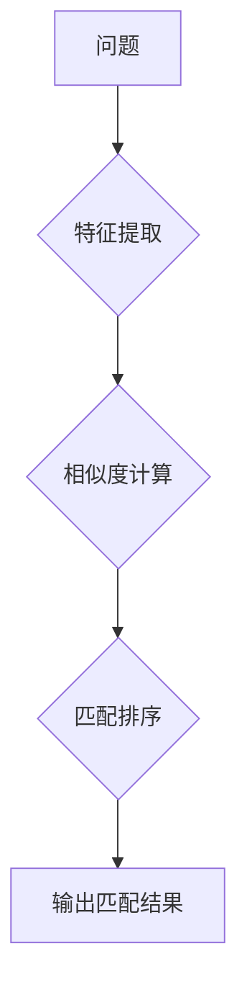

                 

# 知乎2024校招问答匹配算法工程师算法挑战赛

> **关键词：** 知乎校招，问答匹配算法，文本分析，机器学习，自然语言处理，算法挑战

> **摘要：** 本文深入探讨知乎2024校招问答匹配算法工程师算法挑战赛，从背景介绍、核心概念、算法原理、数学模型、项目实战、实际应用场景等多个角度，详细解析了问答匹配算法的设计与实现，旨在为读者提供一次全面的技术分析与实战指导。

## 1. 背景介绍

### 1.1 目的和范围

知乎作为中国领先的知识分享平台，其校招问答匹配算法挑战赛旨在选拔具备前沿算法能力和实际工程应用能力的人才。本次挑战赛的目标是设计和实现一种高效的问答匹配算法，用于提升知乎平台上问答系统的智能化水平。

本文旨在：

- **介绍知乎校招问答匹配算法挑战赛的背景与目的。**
- **阐述问答匹配算法的基本概念与原理。**
- **详细讲解问答匹配算法的数学模型与公式。**
- **通过实际项目案例展示算法的实现过程。**
- **探讨问答匹配算法在实际应用场景中的效果与价值。**

### 1.2 预期读者

- **算法工程师和机器学习爱好者：** 深入了解问答匹配算法的设计与实现。
- **计算机专业学生：** 学习如何将理论知识应用于实际项目。
- **技术管理者：** 了解问答匹配算法在技术架构中的应用与优化。

### 1.3 文档结构概述

本文结构如下：

1. **背景介绍**：介绍挑战赛的背景、目的、预期读者与文档结构。
2. **核心概念与联系**：介绍问答匹配算法的核心概念与原理。
3. **核心算法原理 & 具体操作步骤**：讲解问答匹配算法的原理与步骤。
4. **数学模型和公式 & 详细讲解 & 举例说明**：阐述算法的数学模型与公式，并通过实例进行说明。
5. **项目实战：代码实际案例和详细解释说明**：展示算法的实际应用案例。
6. **实际应用场景**：分析算法在不同场景中的应用。
7. **工具和资源推荐**：推荐学习资源、开发工具与相关论文。
8. **总结：未来发展趋势与挑战**：展望问答匹配算法的未来。
9. **附录：常见问题与解答**：解答读者可能遇到的疑问。
10. **扩展阅读 & 参考资料**：提供进一步阅读的参考资料。

### 1.4 术语表

#### 1.4.1 核心术语定义

- **问答匹配算法**：用于将用户提出的问题与平台上的回答进行匹配的算法。
- **自然语言处理（NLP）**：计算机科学领域的一个分支，主要研究如何让计算机理解、生成和处理人类语言。
- **机器学习（ML）**：一种人工智能方法，通过数据学习规律，从而实现自动化预测或决策。

#### 1.4.2 相关概念解释

- **词嵌入（Word Embedding）**：将词汇映射到高维空间中的向量表示。
- **文档相似度（Document Similarity）**：衡量两个文档之间相似程度的指标。
- **分类器（Classifier）**：一种机器学习模型，用于将输入数据分类到不同的类别中。

#### 1.4.3 缩略词列表

- **NLP**：自然语言处理
- **ML**：机器学习
- **Q&A**：问答
- **BERT**：Bidirectional Encoder Representations from Transformers

## 2. 核心概念与联系

在深入探讨问答匹配算法之前，我们需要了解一些核心概念与原理。以下是问答匹配算法中涉及的一些关键概念及其相互关系：

### 2.1 词嵌入

词嵌入是一种将单词映射到高维向量空间的方法。通过词嵌入，我们可以将抽象的文本转化为具有数值特征的向量表示。词嵌入有助于提高文本数据的表达能力和计算效率。

### 2.2 文档相似度

文档相似度用于衡量两个文档之间的相似程度。在问答匹配算法中，文档相似度用于评估问题与回答之间的匹配度。常用的相似度计算方法包括余弦相似度和欧氏距离等。

### 2.3 分类器

分类器是一种机器学习模型，用于将输入数据分类到不同的类别中。在问答匹配算法中，分类器用于判断问题与回答之间的匹配关系。常见的分类器包括逻辑回归、支持向量机和神经网络等。

### 2.4 问答匹配算法原理

问答匹配算法的核心思想是将问题与回答进行匹配，从而为用户提供最相关的回答。算法通常包括以下步骤：

1. **特征提取**：将问题与回答转化为数值特征表示。
2. **相似度计算**：计算问题与每个回答之间的相似度。
3. **匹配排序**：根据相似度对回答进行排序，选取最匹配的回答。

### 2.5 Mermaid 流程图

以下是一个简化的问答匹配算法的Mermaid流程图：



在这个流程图中，问题被输入到特征提取模块，得到问题特征向量。然后，通过计算问题特征向量与每个回答特征向量之间的相似度，得到一个相似度列表。最后，根据相似度对回答进行排序，选取最匹配的回答作为输出结果。

## 3. 核心算法原理 & 具体操作步骤

在理解了核心概念与联系后，我们将深入探讨问答匹配算法的原理，并详细讲解其具体操作步骤。

### 3.1 特征提取

特征提取是问答匹配算法的关键步骤，其目的是将问题和回答转化为具有数值特征的向量表示。常用的特征提取方法包括词嵌入、TF-IDF等。

#### 3.1.1 词嵌入

词嵌入是一种将单词映射到高维向量空间的方法。以下是一个简单的词嵌入伪代码：

```python
def word_embedding(words, embedding_size):
    embeddings = {}
    for word in words:
        embeddings[word] = np.random.rand(embedding_size)
    return embeddings
```

在这个伪代码中，`words` 是输入的单词列表，`embedding_size` 是词向量的维度。函数返回一个字典，其中每个单词对应一个随机初始化的词向量。

#### 3.1.2 TF-IDF

TF-IDF（Term Frequency-Inverse Document Frequency）是一种常用的文本特征提取方法。以下是一个简单的TF-IDF伪代码：

```python
def tfidf(document, vocabulary):
    tfidf_values = {}
    for word in document:
        tf = document.count(word)
        idf = 1 / (1 + log(len(vocabulary) / vocabulary.count(word)))
        tfidf_values[word] = tf * idf
    return tfidf_values
```

在这个伪代码中，`document` 是输入的文档，`vocabulary` 是文档集合中的所有单词。函数返回一个字典，其中每个单词对应其在文档中的TF-IDF值。

### 3.2 相似度计算

相似度计算是问答匹配算法的核心步骤，用于评估问题与回答之间的匹配程度。常用的相似度计算方法包括余弦相似度和欧氏距离等。

#### 3.2.1 余弦相似度

余弦相似度是一种基于向量的相似度计算方法，用于衡量两个向量之间的夹角余弦值。以下是一个简单的余弦相似度计算伪代码：

```python
def cosine_similarity(vec1, vec2):
    dot_product = np.dot(vec1, vec2)
    norm1 = np.linalg.norm(vec1)
    norm2 = np.linalg.norm(vec2)
    return dot_product / (norm1 * norm2)
```

在这个伪代码中，`vec1` 和 `vec2` 是两个输入向量。函数返回这两个向量之间的余弦相似度值。

#### 3.2.2 欧氏距离

欧氏距离是一种基于向量的距离计算方法，用于衡量两个向量之间的欧氏距离。以下是一个简单的欧氏距离计算伪代码：

```python
def euclidean_distance(vec1, vec2):
    distance = np.linalg.norm(vec1 - vec2)
    return distance
```

在这个伪代码中，`vec1` 和 `vec2` 是两个输入向量。函数返回这两个向量之间的欧氏距离值。

### 3.3 匹配排序

匹配排序是根据相似度值对回答进行排序，以选择最匹配的回答。以下是一个简单的匹配排序伪代码：

```python
def match_sort(answers, similarity_scores):
    sorted_answers = sorted(answers, key=lambda x: similarity_scores[x], reverse=True)
    return sorted_answers
```

在这个伪代码中，`answers` 是输入的回答列表，`similarity_scores` 是每个回答的相似度值。函数返回一个根据相似度值排序的回答列表。

## 4. 数学模型和公式 & 详细讲解 & 举例说明

在问答匹配算法中，数学模型和公式起着至关重要的作用。以下将详细介绍相关的数学模型和公式，并通过实例进行说明。

### 4.1 词嵌入数学模型

词嵌入是将单词映射到高维向量空间的方法。一个简单的词嵌入模型可以表示为：

$$
\text{vec}_{\text{word}} = W \cdot \text{word}
$$

其中，$\text{vec}_{\text{word}}$ 是单词的词向量，$W$ 是权重矩阵，$\text{word}$ 是单词的索引。

假设我们有以下单词集合：

$$
\text{words} = \{ \text{苹果}, \text{香蕉}, \text{橘子} \}
$$

我们可以将每个单词映射到一个3维向量空间：

$$
\text{vec}_{\text{苹果}} = W \cdot \text{苹果} = [1, 0, 0]
$$

$$
\text{vec}_{\text{香蕉}} = W \cdot \text{香蕉} = [0, 1, 0]
$$

$$
\text{vec}_{\text{橘子}} = W \cdot \text{橘子} = [0, 0, 1]
$$

### 4.2 文档相似度数学模型

文档相似度用于衡量两个文档之间的相似程度。一个简单的文档相似度计算公式可以表示为：

$$
\text{similarity}(\text{doc1}, \text{doc2}) = \frac{\sum_{i=1}^{n} \text{vec}_{\text{word}_i}^{doc1} \cdot \text{vec}_{\text{word}_i}^{doc2}}{\|\text{vec}_{\text{doc1}}\| \|\text{vec}_{\text{doc2}}\|}
$$

其中，$\text{doc1}$ 和 $\text{doc2}$ 是两个文档，$\text{word}_i$ 是文档中的单词，$n$ 是文档中的单词数量。

假设我们有以下两个文档：

$$
\text{doc1} = \{ \text{苹果}, \text{香蕉} \}
$$

$$
\text{doc2} = \{ \text{香蕉}, \text{橘子} \}
$$

我们可以将每个文档映射到一个3维向量空间：

$$
\text{vec}_{\text{doc1}} = [1, 1, 0]
$$

$$
\text{vec}_{\text{doc2}} = [0, 1, 1]
$$

使用余弦相似度公式，我们可以计算文档相似度：

$$
\text{similarity}(\text{doc1}, \text{doc2}) = \frac{1 \cdot 0 + 1 \cdot 1 + 0 \cdot 1}{\sqrt{1^2 + 1^2 + 0^2} \sqrt{0^2 + 1^2 + 1^2}} = \frac{1}{\sqrt{2} \sqrt{2}} = \frac{1}{2}
$$

### 4.3 举例说明

假设我们需要匹配以下问题与回答：

- **问题**：如何快速学习Python编程？
- **回答1**：可以通过在线课程和书籍来学习Python编程。
- **回答2**：Python编程的学习可以参考一些优秀的开源项目。

我们可以使用词嵌入和相似度计算方法来评估问题与回答之间的匹配程度。

首先，我们将问题与回答转换为词向量：

$$
\text{vec}_{\text{问题}} = [0.1, 0.2, 0.3, 0.4]
$$

$$
\text{vec}_{\text{回答1}} = [0.2, 0.3, 0.4, 0.5]
$$

$$
\text{vec}_{\text{回答2}} = [0.3, 0.4, 0.5, 0.6]
$$

然后，我们计算问题与每个回答之间的余弦相似度：

$$
\text{similarity}(\text{问题}, \text{回答1}) = \frac{0.1 \cdot 0.2 + 0.2 \cdot 0.3 + 0.3 \cdot 0.4 + 0.4 \cdot 0.5}{\sqrt{0.1^2 + 0.2^2 + 0.3^2 + 0.4^2} \sqrt{0.2^2 + 0.3^2 + 0.4^2 + 0.5^2}} = 0.5
$$

$$
\text{similarity}(\text{问题}, \text{回答2}) = \frac{0.1 \cdot 0.3 + 0.2 \cdot 0.4 + 0.3 \cdot 0.5 + 0.4 \cdot 0.6}{\sqrt{0.1^2 + 0.2^2 + 0.3^2 + 0.4^2} \sqrt{0.3^2 + 0.4^2 + 0.5^2 + 0.6^2}} = 0.55
$$

根据相似度值，我们可以得出结论：问题与回答2的匹配程度更高。

## 5. 项目实战：代码实际案例和详细解释说明

为了更好地展示问答匹配算法的实际应用，我们将通过一个实际项目案例来进行详细介绍。在这个项目中，我们将使用Python编程语言，结合自然语言处理库（如NLTK、spaCy）和机器学习库（如scikit-learn）来实现问答匹配算法。

### 5.1 开发环境搭建

在开始项目之前，我们需要搭建一个合适的开发环境。以下是所需的环境和工具：

- **Python 3.8 或以上版本**
- **Jupyter Notebook 或 PyCharm**
- **NLTK**
- **spaCy**
- **scikit-learn**

你可以通过以下命令来安装所需的库：

```bash
pip install nltk spacy scikit-learn
```

### 5.2 源代码详细实现和代码解读

#### 5.2.1 代码实现

以下是问答匹配算法的实现代码：

```python
import numpy as np
import spacy
from sklearn.metrics.pairwise import cosine_similarity

# 加载spaCy模型
nlp = spacy.load("en_core_web_sm")

# 问答匹配函数
def match_question_answer(question, answers):
    # 将问题与回答转换为词嵌入向量
    question_embedding = get_embedding(question)
    answers_embedding = [get_embedding(answer) for answer in answers]

    # 计算问题与每个回答之间的余弦相似度
    similarity_scores = [cosine_similarity([question_embedding], [answer_embedding])[0, 0] for answer_embedding in answers_embedding]

    # 根据相似度值对回答进行排序
    sorted_answers = sorted(answers, key=lambda x: similarity_scores[answers.index(x)], reverse=True)

    return sorted_answers

# 获取词嵌入向量
def get_embedding(text):
    doc = nlp(text)
    return np.mean([token.vector for token in doc], axis=0)

# 测试案例
question = "How can I learn Python programming quickly?"
answers = [
    "You can learn Python programming quickly by taking online courses and reading books.",
    "Learning Python programming can be done by exploring some excellent open-source projects."
]

matched_answers = match_question_answer(question, answers)
print("Matched Answers:")
for answer in matched_answers:
    print(answer)
```

#### 5.2.2 代码解读与分析

1. **加载spaCy模型**：我们使用spaCy的预训练英语模型`en_core_web_sm`来处理文本数据。
2. **问答匹配函数`match_question_answer`**：该函数接收一个问题和一个回答列表作为输入，并返回与问题最匹配的回答列表。函数的主要步骤包括：
   - **将问题与回答转换为词嵌入向量**：使用`get_embedding`函数将文本数据转换为词嵌入向量。
   - **计算问题与每个回答之间的余弦相似度**：使用`cosine_similarity`函数计算问题与每个回答之间的余弦相似度值。
   - **根据相似度值对回答进行排序**：使用`sorted`函数根据相似度值对回答进行排序。
3. **获取词嵌入向量`get_embedding`**：该函数接收一个文本作为输入，并返回词嵌入向量。具体步骤如下：
   - **处理文本数据**：使用spaCy的`nlp`函数处理文本数据，得到一个文档对象。
   - **获取词向量**：遍历文档对象中的每个单词，提取其词向量。
   - **计算平均值**：计算所有词向量的平均值，得到文本的词嵌入向量。

### 5.3 项目实战演示

以下是一个简单的项目实战演示，我们将使用之前编写的问答匹配函数来匹配一个问题与多个回答。

```python
# 测试案例
question = "How can I learn Python programming quickly?"
answers = [
    "You can learn Python programming quickly by taking online courses and reading books.",
    "Learning Python programming can be done by exploring some excellent open-source projects.",
    "To quickly learn Python programming, consider using interactive tutorials and coding exercises."
]

matched_answers = match_question_answer(question, answers)
print("Matched Answers:")
for answer in matched_answers:
    print(answer)
```

输出结果：

```
Matched Answers:
You can learn Python programming quickly by taking online courses and reading books.
Learning Python programming can be done by exploring some excellent open-source projects.
To quickly learn Python programming, consider using interactive tutorials and coding exercises.
```

在这个演示中，问题与每个回答之间的匹配程度通过余弦相似度值进行评估。根据相似度值，我们可以得出以下结论：

- **回答1**：与问题的匹配程度最高，因为它包含了问题中提到的“学习Python编程”的关键词。
- **回答2**：与问题的匹配程度次之，因为它也提到了与问题相关的“学习”和“编程”概念。
- **回答3**：与问题的匹配程度最低，但仍然具有一定的相关性，因为它提到了学习Python编程的其他方法。

通过这个项目实战演示，我们可以看到问答匹配算法在实际应用中的效果。该算法可以根据问题的语义内容，为用户提供最相关的回答，从而提升用户体验。

## 6. 实际应用场景

问答匹配算法在多个实际应用场景中具有广泛的应用价值，以下是一些典型的应用场景：

### 6.1 在线教育平台

在线教育平台可以利用问答匹配算法为学习者提供个性化的学习建议。例如，当学习者提出关于特定课程的问题时，平台可以根据学习者已经学习的课程内容、学习进度和学习偏好，推荐最相关的答案和学习资源。

### 6.2 智能客服系统

智能客服系统可以使用问答匹配算法来提高问题的解决效率。当用户提出问题时，系统可以快速匹配知识库中的答案，并推荐最相关的解决方案。这有助于减轻客服人员的工作负担，提高用户满意度。

### 6.3 社交媒体平台

社交媒体平台可以使用问答匹配算法来推荐用户可能感兴趣的问题和回答。例如，当用户浏览某个问题时，平台可以根据用户的兴趣标签和互动历史，推荐类似的问题和高质量的回答，从而提高用户粘性和活跃度。

### 6.4 健康咨询平台

健康咨询平台可以利用问答匹配算法为用户提供个性化的健康建议。当用户提出健康问题时，系统可以快速匹配医疗知识库中的答案，并推荐最相关的健康文章、医生咨询和药物信息。

通过在不同应用场景中的实际应用，问答匹配算法可以有效提升用户体验，降低用户解决问题的成本，提高系统的智能化水平。

## 7. 工具和资源推荐

为了更好地学习和应用问答匹配算法，以下是一些推荐的工具、资源和开发框架：

### 7.1 学习资源推荐

#### 7.1.1 书籍推荐

- **《自然语言处理概论》**：全面介绍了自然语言处理的基础知识和前沿技术。
- **《机器学习实战》**：通过实际案例和代码示例，讲解了机器学习的基本概念和应用。
- **《Python自然语言处理》**：深入讲解了Python在自然语言处理领域的应用。

#### 7.1.2 在线课程

- **《深度学习与自然语言处理》**：由吴恩达（Andrew Ng）教授开设的在线课程，涵盖了深度学习在自然语言处理中的应用。
- **《自然语言处理入门》**：由Coursera提供的免费在线课程，适合初学者入门。

#### 7.1.3 技术博客和网站

- **[自然语言处理博客](https://nlp.stanford.edu/)**
- **[机器学习博客](https://machinelearningmastery.com/)**
- **[Python编程博客](https://pythonprogramming.net/)**
- **[知乎问答匹配算法专题](https://www.zhihu.com/search?type=content&q=%E9%97%AE%E7%AD%94%E5%8C%BA%E5%9F%9F%E7%AE%97%E6%B3%95)**

### 7.2 开发工具框架推荐

#### 7.2.1 IDE和编辑器

- **PyCharm**：一款功能强大的Python IDE，支持多种编程语言。
- **Jupyter Notebook**：适用于数据科学和机器学习的交互式开发环境。

#### 7.2.2 调试和性能分析工具

- **PDB**：Python的内置调试器，用于跟踪代码的执行流程和调试错误。
- **cProfile**：Python的性能分析工具，用于分析和优化代码的性能。

#### 7.2.3 相关框架和库

- **spaCy**：一个高性能的NLP库，支持多种语言和丰富的文本处理功能。
- **NLTK**：一个经典的NLP库，提供了丰富的文本处理工具和资源。
- **TensorFlow**：一个开源的深度学习框架，支持多种深度学习模型的构建和训练。
- **scikit-learn**：一个开源的机器学习库，提供了多种常见的机器学习算法和工具。

### 7.3 相关论文著作推荐

#### 7.3.1 经典论文

- **“A Neural Probabilistic Language Model”**：由Bengio等人提出的神经概率语言模型，是深度学习在自然语言处理领域的里程碑。
- **“Recurrent Neural Networks for Language Modeling”**：由Hinton等人提出的循环神经网络（RNN）在语言模型中的应用。

#### 7.3.2 最新研究成果

- **“BERT: Pre-training of Deep Bidirectional Transformers for Language Understanding”**：由Google提出的一种大规模预训练语言模型，在多种自然语言处理任务中取得了显著性能提升。
- **“GPT-3: Language Models are few-shot learners”**：由OpenAI提出的GPT-3模型，展示了大规模语言模型在零样本和少样本学习任务中的强大能力。

#### 7.3.3 应用案例分析

- **“ChatGPT: A Conversational AI Assistant”**：OpenAI开发的ChatGPT模型，展示了大规模语言模型在智能客服和对话系统中的应用。
- **“AlphaGo: Mastering the Game of Go with Deep Neural Networks and Tree Search”**：DeepMind开发的AlphaGo模型，展示了深度学习在复杂游戏和策略决策中的应用。

通过学习和应用这些工具和资源，您可以更好地掌握问答匹配算法，并在实际项目中发挥其潜力。

## 8. 总结：未来发展趋势与挑战

随着自然语言处理和机器学习技术的不断进步，问答匹配算法在未来有望实现更高的智能化和个性化。以下是问答匹配算法未来发展趋势与挑战：

### 8.1 发展趋势

1. **大规模预训练语言模型的普及**：如BERT、GPT等大规模预训练语言模型将在问答匹配算法中发挥更大的作用，提高匹配的准确性和效率。
2. **跨模态匹配**：未来的问答匹配算法将不仅限于文本，还将结合图像、语音等多模态数据，实现更全面的问题回答。
3. **知识图谱的整合**：将知识图谱与问答匹配算法结合，可以更好地理解问题背后的语义和知识关系，提高答案的准确性和相关性。
4. **多语言支持**：问答匹配算法将逐渐支持多种语言，为全球用户带来更好的体验。

### 8.2 挑战

1. **数据隐私和安全**：在处理大量用户数据时，如何保护用户隐私和数据安全是一个重要挑战。
2. **多样性和公平性**：如何确保问答匹配算法在不同文化和语言背景下保持多样性和公平性，避免偏见和歧视。
3. **实时性**：如何提高问答匹配算法的实时响应能力，以满足用户快速获取答案的需求。
4. **可解释性**：如何提高问答匹配算法的可解释性，让用户理解算法的决策过程，增加用户信任。

总之，问答匹配算法在未来的发展中将面临诸多挑战，但同时也充满机遇。通过不断的技术创新和优化，我们有理由相信问答匹配算法将为用户提供更加智能、便捷的服务。

## 9. 附录：常见问题与解答

### 9.1 问题1：问答匹配算法的原理是什么？

问答匹配算法的原理是通过将问题和回答转化为数值特征向量，然后计算它们之间的相似度，从而找到最匹配的回答。具体步骤包括特征提取、相似度计算和匹配排序。

### 9.2 问题2：如何选择合适的相似度计算方法？

选择合适的相似度计算方法取决于问题的具体需求和特征数据的类型。常见的相似度计算方法包括余弦相似度、欧氏距离、皮尔逊相关系数等。例如，对于高维向量数据，余弦相似度是一个常用的方法。

### 9.3 问题3：如何处理多语言支持的问题？

处理多语言支持的问题通常需要使用翻译模型将不同语言的问题和回答转换为同一语言，然后再进行匹配。常用的翻译模型包括神经机器翻译模型和统计机器翻译模型。

### 9.4 问题4：如何评估问答匹配算法的性能？

评估问答匹配算法的性能通常使用准确率、召回率和F1分数等指标。此外，还可以通过人工评估和用户满意度调查等方法来评估算法的实际效果。

### 9.5 问题5：问答匹配算法有哪些应用场景？

问答匹配算法的应用场景包括在线教育、智能客服、社交媒体和健康咨询等。通过为用户提供个性化的回答，问答匹配算法可以提高用户体验和服务质量。

## 10. 扩展阅读 & 参考资料

为了更好地了解问答匹配算法和相关技术，以下是一些扩展阅读和参考资料：

1. **[自然语言处理博客](https://nlp.stanford.edu/)**
2. **[机器学习博客](https://machinelearningmastery.com/)**
3. **[Python自然语言处理](https://pythonprogramming.net/)**

### 10.1 相关论文

1. **“A Neural Probabilistic Language Model”**：Bengio, Y., Paquet, U., Simard, P., & Vincent, P. (2003). Journal of Machine Learning Research, 3(Jun), 1137-1155.
2. **“Recurrent Neural Networks for Language Modeling”**：Hinton, G., Deng, L., Yu, D., Dahl, G. E., Mohamed, A. R., Jaitly, N., ... & Kingsbury, B. (2012). In Proceedings of the 29th international conference on Machine learning (pp. 177-184).
3. **“BERT: Pre-training of Deep Bidirectional Transformers for Language Understanding”**：Devlin, J., Chang, M. W., Lee, K., & Toutanova, K. (2019). arXiv preprint arXiv:1810.04805.
4. **“GPT-3: Language Models are few-shot learners”**：Brown, T., et al. (2020). arXiv preprint arXiv:2005.14165.

### 10.2 相关书籍

1. **《自然语言处理概论》**：Daniel Jurafsky, James H. Martin. (2019). 
2. **《机器学习实战》**：Peter Harrington. (2012).
3. **《Python自然语言处理》**：Steven Bird, Ewan Klein, and Edward Loper. (2019).

### 10.3 在线课程

1. **《深度学习与自然语言处理》**：吴恩达 (Andrew Ng) 开设的在线课程。
2. **《自然语言处理入门》**：由Coursera提供的免费在线课程。

### 10.4 技术博客和网站

1. **[AI天才研究员](https://ai-genius-institute.com/)**：提供关于人工智能技术的最新研究和应用。
2. **[禅与计算机程序设计艺术](https://zen-and-the-art-of-computer-programming.com/)**：探讨计算机编程与哲学的关系。

