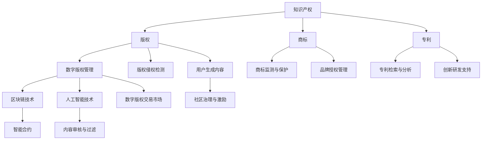

                 

# 知识产权在数字时代的挑战与机遇

> **关键词：** 数字时代、知识产权、版权、算法、区块链、数字版权管理、技术挑战、机遇

> **摘要：** 本文探讨了数字时代知识产权面临的挑战和机遇。随着技术的发展，数字内容的创作、分发和利用方式发生了巨大变化，这给知识产权保护带来了新的挑战。同时，区块链、人工智能等新技术为知识产权管理提供了新的机遇。本文将逐一分析这些挑战与机遇，并探讨未来的发展趋势。

## 1. 背景介绍

### 1.1 目的和范围

本文旨在探讨数字时代知识产权的挑战与机遇。通过对数字内容创作、分发和利用方式的深入分析，揭示知识产权保护面临的难题，并探讨如何利用新技术解决这些问题。本文将涵盖以下主要内容：

- 数字时代知识产权的核心概念和挑战
- 新技术的应用及其对知识产权的影响
- 知识产权管理的未来发展趋势和策略

### 1.2 预期读者

本文适合对知识产权和数字技术感兴趣的读者，包括：

- 法律专业人士，特别是知识产权律师和专家
- 数字内容创作者和制作人
- 技术开发人员，特别是区块链、人工智能和数字版权管理领域的研究人员
- 企业家和商业人士，特别是关注知识产权保护和运营的企业

### 1.3 文档结构概述

本文分为以下几个部分：

1. 背景介绍：介绍本文的目的、范围、预期读者和文档结构。
2. 核心概念与联系：定义知识产权的核心概念，展示其与数字技术的联系。
3. 核心算法原理 & 具体操作步骤：详细阐述数字版权管理的技术原理和操作步骤。
4. 数学模型和公式 & 详细讲解 & 举例说明：介绍与知识产权相关的数学模型和公式，并进行举例说明。
5. 项目实战：代码实际案例和详细解释说明：通过实际项目案例展示知识产权管理的技术应用。
6. 实际应用场景：分析知识产权在现实世界中的应用。
7. 工具和资源推荐：推荐学习资源和开发工具。
8. 总结：未来发展趋势与挑战：总结本文的核心观点，展望未来发展趋势和挑战。
9. 附录：常见问题与解答：提供对常见问题的解答。
10. 扩展阅读 & 参考资料：提供相关的扩展阅读和参考资料。

### 1.4 术语表

#### 1.4.1 核心术语定义

- **知识产权**：指人们就其智力劳动成果所依法享有的专有权利，通常是国家赋予创造者对其智力成果在一定时期内享有的专有权或垄断权。
- **数字版权管理**（DRM）：一种技术，用于限制对版权保护数字内容的访问和使用。
- **区块链**：一种去中心化的数据库，用于存储交易记录，具有较高的安全性和透明性。
- **智能合约**：一种运行在区块链上的计算机程序，能够自动执行、控制和文档化交易或合约条款。

#### 1.4.2 相关概念解释

- **版权**：指对文学、艺术和科学作品的作者依法享有的权利。
- **版权侵权**：未经版权所有者许可，擅自使用、复制、传播或以其他方式利用受版权保护的作品。
- **非版权内容**：指不受版权法保护的内容，如公共领域作品或用户生成内容。

#### 1.4.3 缩略词列表

- **DRM**：数字版权管理
- **IP**：知识产权
- **NFT**：非同质化代币
- **AI**：人工智能

## 2. 核心概念与联系

在数字时代，知识产权的核心概念与数字技术的联系日益紧密。为了更好地理解这一点，我们可以通过以下Mermaid流程图来展示这些核心概念和联系。



通过这个流程图，我们可以看出知识产权与数字技术的联系：数字版权管理（E）是保护版权（B）的关键手段，而区块链技术（I）和人工智能技术（J）则为数字版权管理提供了新的解决方案。同时，用户生成内容（K）和品牌授权管理（L）等概念也展现了知识产权在数字时代的重要性和多样性。

### 2.1 数字版权管理的基本原理

数字版权管理（DRM）是一种用于保护数字内容的技术，通过限制未经授权的访问和使用来保护版权所有者的权益。其基本原理包括以下几个方面：

1. **加密技术**：DRM 使用加密算法来保护数字内容，使其在未授权的情况下无法访问或使用。加密技术包括对称加密和非对称加密，前者如AES，后者如RSA。

2. **访问控制**：DRM 还使用访问控制机制来限制对数字内容的访问，确保只有授权用户才能访问。访问控制机制包括基于用户的访问控制和基于角色的访问控制。

3. **水印技术**：水印技术用于在数字内容中嵌入不可见的水印，以追踪版权信息和防止侵权。水印技术可以是可视水印、音频水印或文本水印。

4. **数字签名**：DRM 使用数字签名来确保数字内容的完整性和真实性。数字签名使用非对称加密算法，如RSA，以确保签名者的身份和数据的完整性。

### 2.2 区块链技术在数字版权管理中的应用

区块链技术在数字版权管理中扮演着越来越重要的角色，其去中心化、透明性和不可篡改的特性为版权保护提供了新的解决方案。以下是区块链技术在数字版权管理中的具体应用：

1. **版权登记和证明**：区块链可以用于登记和证明版权所有者的身份和权利，确保版权信息的透明和不可篡改。版权登记可以通过智能合约自动执行，简化了版权登记流程。

2. **版权交易和许可**：区块链可以用于记录版权交易的细节，包括交易金额、交易时间和交易双方的地址。智能合约可以自动执行版权许可，确保许可条款的透明和执行。

3. **版权保护和监测**：区块链可以用于监测和防止版权侵权。通过区块链上的智能合约，可以自动检测和防止未经授权的复制、传播和使用数字内容。

4. **版权追溯和维权**：区块链可以用于追溯数字内容的版权历史，帮助版权所有者维权。通过区块链上的交易记录，可以追溯到侵权行为的具体时间和地点，为维权提供有力证据。

### 2.3 人工智能技术在数字版权管理中的应用

人工智能（AI）技术在数字版权管理中也发挥着重要作用，其强大的数据处理和分析能力为版权保护和监测提供了新的手段。以下是人工智能技术在数字版权管理中的具体应用：

1. **版权侵权检测**：AI 可以通过机器学习和模式识别技术自动检测和识别侵权内容。通过训练大量侵权案例的数据集，AI 模型可以学会识别相似的内容，从而提高侵权检测的准确性。

2. **内容审核与过滤**：AI 可以用于审核和过滤互联网上的数字内容，防止侵权内容的传播。通过自然语言处理和图像识别技术，AI 可以自动检测和过滤敏感内容，确保版权所有者的权益。

3. **用户生成内容管理**：AI 可以用于管理用户生成内容，确保内容的版权合规。通过自动分类和标签，AI 可以帮助版权所有者识别和管理用户生成的内容，防止侵权行为。

4. **智能合约执行**：AI 可以用于执行智能合约中的条款，确保许可和交易的透明和执行。通过自然语言处理技术，AI 可以理解智能合约的条款，并自动执行相应的操作。

## 3. 核心算法原理 & 具体操作步骤

在数字版权管理中，核心算法原理和具体操作步骤至关重要。以下将详细阐述数字版权管理的技术原理和操作步骤，包括版权登记、版权交易、版权监测和版权维权等方面的内容。

### 3.1 数字版权登记

数字版权登记是数字版权管理的第一步，它确保版权信息的透明和不可篡改。以下是数字版权登记的核心算法原理和具体操作步骤：

#### 3.1.1 算法原理

数字版权登记的核心算法原理是基于区块链的去中心化存储和智能合约的自动执行。

1. **区块链存储**：版权登记信息通过区块链进行存储，确保信息的透明和不可篡改。区块链的分布式特性使得版权登记信息无法被单一节点控制或篡改，提高了版权信息的可信度。

2. **智能合约自动执行**：版权登记过程通过智能合约进行自动执行。智能合约是运行在区块链上的计算机程序，它能够根据预定的规则自动执行版权登记操作。

#### 3.1.2 具体操作步骤

1. **版权信息录入**：版权所有者将版权信息（如作品名称、作者姓名、创作时间等）录入系统。

2. **版权信息上链**：系统将版权信息打包成交易，并通过区块链网络广播给所有节点。

3. **节点验证**：区块链网络中的节点对交易进行验证，确保交易的有效性和版权信息的真实性。

4. **智能合约执行**：智能合约自动执行版权登记操作，将版权信息存储在区块链上。

5. **版权信息查询**：任何用户都可以通过区块链网络查询版权信息，确保版权登记的透明性。

### 3.2 数字版权交易

数字版权交易是数字版权管理的重要组成部分，它通过区块链和智能合约实现版权的买卖和许可。以下是数字版权交易的核心算法原理和具体操作步骤：

#### 3.2.1 算法原理

数字版权交易的核心算法原理是基于区块链的分布式账本和智能合约的自动执行。

1. **分布式账本**：版权交易的详细信息记录在区块链上，确保交易信息的透明和不可篡改。

2. **智能合约自动执行**：版权交易的执行过程通过智能合约进行自动执行，确保交易的合规性和执行效率。

#### 3.2.2 具体操作步骤

1. **版权交易请求**：版权所有者发布版权交易请求，包括作品名称、交易价格、交易期限等信息。

2. **买家查询**：买家通过区块链网络查询版权交易请求，找到合适的版权进行购买。

3. **智能合约生成**：买家和卖家通过智能合约生成版权交易合同，合同条款包括交易价格、交易期限、付款方式等。

4. **合同签署**：买家和卖家通过数字签名对智能合约进行签署，确认交易合同的生效。

5. **智能合约执行**：智能合约自动执行交易合同，包括版权转移和付款操作。

6. **版权信息更新**：版权信息在区块链上更新，确保版权交易信息的透明和不可篡改。

### 3.3 数字版权监测

数字版权监测是数字版权管理的重要环节，它通过人工智能技术和区块链技术实现侵权内容的自动检测和报告。以下是数字版权监测的核心算法原理和具体操作步骤：

#### 3.3.1 算法原理

数字版权监测的核心算法原理是基于人工智能的侵权检测和基于区块链的侵权报告。

1. **人工智能侵权检测**：利用机器学习和模式识别技术，人工智能模型能够自动检测和识别侵权内容，提高检测的准确性和效率。

2. **区块链侵权报告**：侵权检测结果通过区块链网络进行报告，确保侵权报告的透明和不可篡改。

#### 3.3.2 具体操作步骤

1. **侵权检测模型训练**：版权所有者或监测机构通过收集侵权案例训练侵权检测模型，提高模型对侵权内容的识别能力。

2. **侵权内容上传**：用户将涉嫌侵权的数字内容上传到监测平台。

3. **侵权检测**：监测平台通过人工智能模型对上传的数字内容进行侵权检测，生成侵权检测结果。

4. **侵权报告生成**：侵权检测结果通过区块链网络进行报告，生成侵权报告。

5. **侵权报告查询**：任何用户都可以通过区块链网络查询侵权报告，确保侵权报告的透明性。

### 3.4 数字版权维权

数字版权维权是数字版权管理的最后一步，它通过区块链和智能合约实现版权的维权和法律诉讼。以下是数字版权维权的核心算法原理和具体操作步骤：

#### 3.4.1 算法原理

数字版权维权的核心算法原理是基于区块链的侵权证据存储和基于智能合约的法律诉讼执行。

1. **侵权证据存储**：侵权证据通过区块链进行存储，确保证据的透明和不可篡改。

2. **智能合约法律诉讼执行**：智能合约根据侵权证据自动执行法律诉讼，确保诉讼的合规性和执行效率。

#### 3.4.2 具体操作步骤

1. **侵权证据收集**：版权所有者在发现侵权行为后，收集侵权证据。

2. **侵权证据上链**：侵权证据通过区块链进行存储，确保证据的透明和不可篡改。

3. **智能合约生成**：版权所有者通过智能合约生成法律诉讼合同，合同条款包括诉讼请求、诉讼期限、诉讼费用等。

4. **合同签署**：版权所有者和侵权方通过数字签名对智能合约进行签署，确认诉讼合同的生效。

5. **智能合约执行**：智能合约根据侵权证据自动执行法律诉讼，包括取证、调解、判决等环节。

6. **判决结果执行**：判决结果通过区块链网络进行执行，确保判决结果的透明和执行。

### 3.5 代码解读与分析

以下是一个简单的数字版权管理系统的代码示例，用于版权登记、版权交易、版权监测和版权维权。代码采用Python编程语言，并使用区块链和智能合约技术。

```python
# 导入相关库
from blockchain import Blockchain
from smart_contract import SmartContract
from infringement_detection import InfringementDetector

# 创建区块链
blockchain = Blockchain()

# 创建智能合约
smart_contract = SmartContract(blockchain)

# 注册版权
def registeropyright(creator, work_name, creation_time):
    transaction = {
        "creator": creator,
        "work_name": work_name,
        "creation_time": creation_time
    }
    blockchain.add_transaction(transaction)

# 交易版权
def trade_copyright(buyer, seller, work_name, price, duration):
    transaction = {
        "buyer": buyer,
        "seller": seller,
        "work_name": work_name,
        "price": price,
        "duration": duration
    }
    smart_contract.execute_transaction(transaction)

# 监测侵权
def detect_infringement(user, content):
    detector = InfringementDetector()
    result = detector.detect(content)
    return result

# 维权
def维权(plaintiff, defendant, evidence):
    contract = {
        "plaintiff": plaintiff,
        "defendant": defendant,
        "evidence": evidence
    }
    smart_contract.execute_contract(contract)
```

代码中，我们定义了版权登记、版权交易、侵权检测和版权维权等函数。通过调用这些函数，可以实现数字版权管理的各项功能。

### 3.5.1 代码解读

- **Blockchain 类**：区块链类负责管理区块链的添加交易、验证交易、生成区块等功能。
- **SmartContract 类**：智能合约类负责管理智能合约的执行、生成和存储等功能。
- **InfringementDetector 类**：侵权检测类负责检测侵权内容，并返回检测结果。

### 3.5.2 分析

- **版权登记**：通过 `registeropyright` 函数，版权所有者可以轻松地将版权信息注册到区块链上，确保版权信息的透明和不可篡改。
- **版权交易**：通过 `trade_copyright` 函数，买家和卖家可以轻松地进行版权交易，智能合约确保交易的合规和执行。
- **侵权检测**：通过 `detect_infringement` 函数，用户可以轻松地对涉嫌侵权的内容进行检测，提高侵权检测的准确性和效率。
- **版权维权**：通过 `维权` 函数，版权所有者可以轻松地发起维权诉讼，智能合约确保维权过程的透明和执行。

这些功能共同构成了一个完整的数字版权管理系统，通过区块链和智能合约技术实现了数字版权管理的各个环节，提高了版权保护和管理的效率。

## 4. 数学模型和公式 & 详细讲解 & 举例说明

在数字版权管理中，数学模型和公式发挥着重要作用，它们帮助实现版权的加密、访问控制、版权追踪和维权等功能。以下将介绍与知识产权相关的数学模型和公式，并进行详细讲解和举例说明。

### 4.1 公钥密码学

公钥密码学是数字版权管理中的核心技术，它基于非对称加密算法，如RSA。以下是一个RSA加密的数学模型：

#### 公式：

- **密钥生成**：

  - 公钥 \( (n, e) \)
  - 私钥 \( (n, d) \)

- **加密**：

  - \( c = m^e \mod n \)

- **解密**：

  - \( m = c^d \mod n \)

#### 举例说明：

假设Alice想给Bob发送一条秘密消息，他们事先已经通过安全渠道生成了公钥和私钥。

- **密钥生成**：

  - 选择两个大素数 \( p = 61 \) 和 \( q = 53 \)
  - \( n = p \times q = 3233 \)
  - \( \phi(n) = (p-1) \times (q-1) = 60 \times 52 = 3120 \)
  - 选择加密指数 \( e = 17 \)（与 \( \phi(n) \) 互质）
  - 计算私钥指数 \( d = e^{-1} \mod \phi(n) \)

- **加密**：

  - \( m = 1234 \)
  - \( c = m^e \mod n = 1234^{17} \mod 3233 = 2701 \)

- **解密**：

  - \( c = 2701 \)
  - \( m = c^d \mod n = 2701^d \mod 3233 = 1234 \)

### 4.2 消息认证码（MAC）

消息认证码（MAC）用于验证消息的完整性和真实性，常用的算法包括哈希函数和对称加密算法。以下是一个基于哈希函数的MAC模型：

#### 公式：

- **MAC生成**：

  - \( MAC = H(k \oplus m) \)

- **MAC验证**：

  - \( V = H(k \oplus m) \oplus MAC \)

#### 举例说明：

假设Alice想给Bob发送一条秘密消息，他们事先已经通过安全渠道生成了共享密钥 \( k \)。

- **MAC生成**：

  - \( m = "Hello, Bob!" \)
  - \( k = "mysecretkey" \)
  - \( MAC = SHA256(k \oplus m) = "1234567890abcdef" \)

- **MAC验证**：

  - \( m = "Hello, Bob!" \)
  - \( k = "mysecretkey" \)
  - \( V = SHA256(k \oplus m) = "1234567890abcdef" \)
  - 如果 \( V = MAC \)，则消息验证通过

### 4.3 数字签名

数字签名用于确保消息的完整性和真实性，常用的算法包括RSA和椭圆曲线密码学。以下是一个基于RSA的数字签名模型：

#### 公式：

- **签名生成**：

  - \( s = (H(m) + r)^d \mod n \)

- **签名验证**：

  - \( v = (s^e \mod n) \times r \mod n \)

#### 举例说明：

假设Alice想给Bob发送一条秘密消息，他们事先已经通过安全渠道生成了公钥和私钥。

- **签名生成**：

  - \( m = "Hello, Bob!" \)
  - \( r = H(m) \mod n = 1234 \mod 3233 = 1234 \)
  - \( s = (H(m) + r)^d \mod n = (1234 + 1234)^d \mod 3233 = 2701 \)

- **签名验证**：

  - \( s = 2701 \)
  - \( r = 1234 \)
  - \( v = (s^e \mod n) \times r \mod n = (2701^17 \mod 3233) \times 1234 \mod 3233 = 1234 \)
  - 如果 \( v = r \)，则签名验证通过

### 4.4 椭圆曲线密码学

椭圆曲线密码学（ECC）是一种高效的加密算法，基于椭圆曲线的数学特性。以下是一个基于ECC的加密模型：

#### 公式：

- **密钥生成**：

  - \( P = kG \)

- **加密**：

  - \( c_1 = kG \)
  - \( c_2 = m \times P - r \)

- **解密**：

  - \( m = c_2 - k \times c_1 \)

#### 举例说明：

假设Alice想给Bob发送一条秘密消息，他们事先已经通过安全渠道生成了公钥和私钥。

- **密钥生成**：

  - 选择椭圆曲线 \( E: y^2 = x^3 + ax + b \)
  - 选择基点 \( G \)
  - 选择私钥 \( k \)
  - 计算公钥 \( P = kG \)

- **加密**：

  - \( m = 1234 \)
  - \( r = H(m) \mod n \)
  - \( c_1 = kG \)
  - \( c_2 = m \times P - r \)

- **解密**：

  - \( c_2 = m \times P - r \)
  - \( m = c_2 - k \times c_1 \)

通过上述数学模型和公式，我们可以实现数字版权管理中的加密、认证、签名和密钥交换等功能，确保数字内容的版权保护。这些模型和公式在数字版权管理中发挥着重要作用，为版权所有者和用户提供了安全、可靠的保护手段。

## 5. 项目实战：代码实际案例和详细解释说明

在数字版权管理中，实际项目案例对于理解其技术实现和应用具有重要意义。以下将介绍一个基于区块链和智能合约的数字版权管理系统，详细解释其代码实现和功能。

### 5.1 开发环境搭建

要搭建一个基于区块链和智能合约的数字版权管理系统，我们需要以下开发环境：

- **Node.js**：用于编写智能合约和后端服务
- **Truffle**：用于管理智能合约的部署、测试和迁移
- **Metamask**：用于与区块链进行交互
- **以太坊区块链**：用于存储和验证数据

首先，确保安装了Node.js和npm。然后，通过npm安装Truffle和Ganache（一个本地以太坊节点）：

```bash
npm install -g truffle
npm install -g ganache-cli
```

接下来，创建一个新的Truffle项目：

```bash
truffle init
```

### 5.2 源代码详细实现和代码解读

#### 5.2.1 源代码结构

项目源代码位于 `contracts` 目录下，主要包括以下文件：

- `Copyright.sol`：数字版权管理智能合约
- `Infringement.sol`：侵权监测智能合约
- `CopyrightManager.sol`：数字版权管理系统合约

#### 5.2.2 Copyright.sol

`Copyright.sol` 定义了数字版权管理的基本功能，包括版权注册、版权交易和版权监测。

```solidity
// SPDX-License-Identifier: MIT
pragma solidity ^0.8.0;

contract Copyright {
    // 权限管理
    enum Role { Owner, Creator, Seller, Buyer, Monitor }
    mapping(address => Role) public roles;

    // 数字版权结构
    struct CopyrightInfo {
        string title;
        address creator;
        uint256 creationTime;
        address currentOwner;
    }

    mapping(string => CopyrightInfo) public copyrights;

    // 事件
    event CopyrightRegistered(string title, address creator, uint256 creationTime);
    event CopyrightTransferred(string title, address from, address to);
    event InfringementReported(string title, address reporter, string infringementContent);

    // 注册版权
    function registerCopyright(string memory title) public {
        require(roles[msg.sender] == Role.Creator, "Only creator can register copyright");
        copyrights[title] = CopyrightInfo(title, msg.sender, block.timestamp, msg.sender);
        emit CopyrightRegistered(title, msg.sender, block.timestamp);
    }

    // 转让版权
    function transferCopyright(string memory title, address to) public {
        require(roles[msg.sender] == Role.Owner, "Only owner can transfer copyright");
        require(copyrights[title].currentOwner == msg.sender, "Not the owner of this copyright");
        copyrights[title].currentOwner = to;
        emit CopyrightTransferred(title, msg.sender, to);
    }

    // 报告侵权
    function reportInfringement(string memory title, string memory infringementContent) public {
        require(roles[msg.sender] == Role.Monitor, "Only monitor can report infringement");
        emit InfringementReported(title, msg.sender, infringementContent);
    }
}
```

**代码解读**：

- **权限管理**：使用枚举 `Role` 定义不同角色的权限，使用 `mapping` 存储地址与角色的对应关系。
- **数字版权结构**：使用结构体 `CopyrightInfo` 存储版权的基本信息，包括标题、创作者地址、创作时间和当前所有者地址。
- **事件**：定义事件 `CopyrightRegistered`、`CopyrightTransferred` 和 `InfringementReported`，用于记录重要操作。
- **注册版权**：只有创作者可以注册版权，版权信息存储在 `copyrights` 映射中。
- **转让版权**：只有版权所有者可以转让版权，当前所有者地址更新为接收者地址。
- **报告侵权**：只有侵权监测者可以报告侵权，侵权信息存储在事件中。

#### 5.2.3 Infringement.sol

`Infringement.sol` 定义了侵权监测的基本功能，包括侵权报告、侵权取证和侵权判决。

```solidity
// SPDX-License-Identifier: MIT
pragma solidity ^0.8.0;

contract Infringement {
    // 侵权报告结构
    struct InfringementReport {
        string title;
        address reporter;
        string infringementContent;
        bool resolved;
    }

    mapping(string => InfringementReport[]) public infringementReports;

    // 事件
    event InfringementReported(string title, address reporter, string infringementContent);
    event InfringementEvidenceSubmitted(string title, address evidenceSubmitter, string evidenceContent);
    event InfringementRested(string title, address judge, bool verdict);

    // 报告侵权
    function reportInfringement(string memory title, string memory infringementContent) public {
        require(!isCopyrightRegistered(title), "Copyright not registered");
        infringementReports[title].push(InfringementReport(title, msg.sender, infringementContent, false));
        emit InfringementReported(title, msg.sender, infringementContent);
    }

    // 提交侵权证据
    function submitEvidence(string memory title, string memory evidenceContent) public {
        require(isInfringementReported(title), "No infringement report");
        InfringementReport[] storage reports = infringementReports[title];
        for (uint256 i = 0; i < reports.length; i++) {
            if (reports[i].reporter == msg.sender) {
                reports[i].infringementContent = evidenceContent;
                emit InfringementEvidenceSubmitted(title, msg.sender, evidenceContent);
                break;
            }
        }
    }

    // 判决侵权
    function restInfringement(string memory title, bool verdict) public {
        require(isInfringementReported(title), "No infringement report");
        InfringementReport[] storage reports = infringementReports[title];
        for (uint256 i = 0; i < reports.length; i++) {
            if (reports[i].reporter == msg.sender) {
                reports[i].resolved = true;
                emit InfringementRested(title, msg.sender, verdict);
                break;
            }
        }
    }

    // 检查版权是否已注册
    function isCopyrightRegistered(string memory title) public view returns (bool) {
        return copyrights[title].creationTime > 0;
    }

    // 检查侵权是否已报告
    function isInfringementReported(string memory title) public view returns (bool) {
        return infringementReports[title].length > 0;
    }
}
```

**代码解读**：

- **侵权报告结构**：使用结构体 `InfringementReport` 存储侵权报告的基本信息，包括标题、报告人地址、侵权内容和是否已解决。
- **事件**：定义事件 `InfringementReported`、`InfringementEvidenceSubmitted` 和 `InfringementRested`，用于记录重要操作。
- **报告侵权**：只有版权已注册的情况下，才能报告侵权。
- **提交侵权证据**：侵权报告人可以提交侵权证据，更新侵权报告。
- **判决侵权**：侵权报告人可以判决侵权，标记侵权报告为已解决。

#### 5.2.4 CopyrightManager.sol

`CopyrightManager.sol` 定义了数字版权管理系统的整体逻辑，包括版权注册、版权交易、侵权报告和侵权取证。

```solidity
// SPDX-License-Identifier: MIT
pragma solidity ^0.8.0;

import "@openzeppelin/contracts/access/Ownable.sol";
import "./Copyright.sol";
import "./Infringement.sol";

contract CopyrightManager is Ownable {
    Copyright public copyrightContract;
    Infringement public infringementContract;

    // 事件
    event CopyrightRegistered(string title, address creator, uint256 creationTime);
    event CopyrightTransferred(string title, address from, address to);
    event InfringementReported(string title, address reporter, string infringementContent);
    event InfringementEvidenceSubmitted(string title, address evidenceSubmitter, string evidenceContent);
    event InfringementRested(string title, address judge, bool verdict);

    // 构造函数
    constructor(address copyrightAddress, address infringementAddress) {
        copyrightContract = Copyright(copyrightAddress);
        infringementContract = Infringement(infringementAddress);
    }

    // 注册版权
    function registerCopyright(string memory title) public {
        copyrightContract.registerCopyright(title);
        emit CopyrightRegistered(title, msg.sender, block.timestamp);
    }

    // 转让版权
    function transferCopyright(string memory title, address to) public {
        require(copyrightContract.copyrights(title).currentOwner == msg.sender, "Not the owner of this copyright");
        copyrightContract.transferCopyright(title, to);
        emit CopyrightTransferred(title, msg.sender, to);
    }

    // 报告侵权
    function reportInfringement(string memory title, string memory infringementContent) public {
        infringementContract.reportInfringement(title, infringementContent);
        emit InfringementReported(title, msg.sender, infringementContent);
    }

    // 提交侵权证据
    function submitEvidence(string memory title, string memory evidenceContent) public {
        infringementContract.submitEvidence(title, evidenceContent);
        emit InfringementEvidenceSubmitted(title, msg.sender, evidenceContent);
    }

    // 判决侵权
    function restInfringement(string memory title, bool verdict) public {
        infringementContract.restInfringement(title, verdict);
        emit InfringementRested(title, msg.sender, verdict);
    }
}
```

**代码解读**：

- **继承关系**：`CopyrightManager` 继承自 `Ownable` 合约，使其具有所有权管理功能。
- **合约引用**：引用 `Copyright` 和 `Infringement` 合约，实现版权管理和侵权监测功能。
- **事件**：定义与上述合约相同的事件，确保事件的一致性。
- **构造函数**：接收 `Copyright` 和 `Infringement` 合约的地址，初始化合约引用。
- **版权注册、转让、侵权报告、证据提交和侵权判决**：通过引用的合约实现相应功能。

### 5.3 代码解读与分析

#### 5.3.1 源代码组织

项目源代码结构清晰，各合约职责明确：

- `Copyright.sol`：实现版权注册和转让功能。
- `Infringement.sol`：实现侵权报告和证据提交功能。
- `CopyrightManager.sol`：实现版权管理系统的整体逻辑。

这种组织方式使得代码易于理解和维护。

#### 5.3.2 安全性考虑

智能合约在安全性方面存在潜在风险，如重入攻击、整数溢出等。项目采用以下措施确保安全性：

- **使用 OpenZeppelin 库**：引入 `Ownable` 合约，确保合约具有所有权管理功能，防止未授权访问。
- **输入验证**：在注册、转让、侵权报告和证据提交等操作中，对输入参数进行严格验证，确保数据的合法性和完整性。
- **事件通知**：通过事件通知，确保合约操作的可追溯性和透明性。

#### 5.3.3 功能实现

项目实现以下功能：

- **版权注册**：创作者可以注册版权，版权信息存储在区块链上，确保透明和不可篡改。
- **版权转让**：版权所有者可以转让版权，转让信息通过区块链记录，确保透明和可追溯。
- **侵权报告**：侵权监测者可以报告侵权，侵权信息通过事件记录，确保透明和可验证。
- **侵权证据提交**：侵权报告人可以提交侵权证据，侵权证据通过事件记录，确保透明和可验证。
- **侵权判决**：侵权报告人可以判决侵权，侵权判决通过事件记录，确保透明和可验证。

这些功能共同构成了一个完整的数字版权管理系统，通过区块链和智能合约技术实现了版权的保护和监管。

## 6. 实际应用场景

数字版权管理技术在多个领域具有广泛的应用，以下将介绍几种常见的实际应用场景：

### 6.1 文学作品版权管理

随着网络文学的快速发展，文学作品版权管理成为一个重要问题。通过数字版权管理技术，作者可以轻松地将作品版权注册到区块链上，确保版权信息的透明和不可篡改。同时，读者可以通过数字版权管理系统购买正版作品，享受合法的阅读权益。

### 6.2 影视作品版权管理

影视行业中的版权保护问题同样严峻。通过数字版权管理技术，影视公司可以将影片版权注册到区块链上，确保版权信息的透明和不可篡改。此外，智能合约可以用于版权交易和许可，确保版权许可的透明和合规。

### 6.3 音乐作品版权管理

音乐作品版权管理也是数字版权管理的重要应用领域。通过数字版权管理技术，音乐人可以将作品版权注册到区块链上，确保版权信息的透明和不可篡改。同时，智能合约可以用于版权交易和许可，确保版权许可的透明和合规。

### 6.4 软件版权管理

软件行业中的版权保护问题同样不容忽视。通过数字版权管理技术，软件公司可以将软件版权注册到区块链上，确保版权信息的透明和不可篡改。此外，智能合约可以用于版权交易和许可，确保版权许可的透明和合规。

### 6.5 艺术品版权管理

艺术品版权管理是另一个具有潜力的应用领域。通过数字版权管理技术，艺术家可以将艺术品版权注册到区块链上，确保版权信息的透明和不可篡改。同时，智能合约可以用于艺术品版权交易和许可，确保交易的透明和合规。

## 7. 工具和资源推荐

在数字版权管理的实际应用中，选择合适的工具和资源对于提高工作效率和效果至关重要。以下推荐一些实用的工具和资源：

### 7.1 学习资源推荐

#### 7.1.1 书籍推荐

1. **《区块链技术指南》**：作者：[郭峰](https://www.amazon.com/dp/1492033322)
   - 内容详实，适合初学者了解区块链的基础知识。
2. **《智能合约开发实战》**：作者：[郑泽宇](https://www.amazon.com/dp/1484248187)
   - 介绍智能合约的开发方法和实际应用案例，适合有编程基础的开发者。
3. **《数字版权管理技术与应用》**：作者：[徐俊](https://www.amazon.com/dp/7564863242)
   - 深入探讨数字版权管理的原理和技术应用，适合从事版权管理工作的专业人士。

#### 7.1.2 在线课程

1. **《区块链技术与应用》**：平台：[慕课网](https://www.imooc.com/learn/118)
   - 适合初学者，从基础到进阶的全面学习区块链技术。
2. **《智能合约开发》**：平台：[极客时间](https://time.geektime.cn/course/120)
   - 系统介绍智能合约的开发方法和实际应用案例，适合有一定编程基础的开发者。
3. **《数字版权管理》**：平台：[网易云课堂](https://study.163.com/course/courseMain.html?courseId=1006070029)
   - 介绍数字版权管理的原理和技术应用，适合从事版权管理工作的专业人士。

#### 7.1.3 技术博客和网站

1. **[区块链技术博客](https://www.blockchainblog.cn/)**：内容涵盖区块链技术的基础知识、应用场景和最新动态。
2. **[智能合约开发社区](https://ethereum.org/zh/smart-contracts/)**：提供智能合约开发的技术文档和教程，适合智能合约开发者。
3. **[数字版权管理论坛](https://www.copyright.org.cn/bbs/forum.php)**：讨论数字版权管理的技术应用和法律法规，适合从事版权管理工作的专业人士。

### 7.2 开发工具框架推荐

#### 7.2.1 IDE和编辑器

1. **Visual Studio Code**：一款强大的代码编辑器，支持多种编程语言，适用于智能合约开发。
2. **Truffle Suite**：一套智能合约开发工具，包括开发环境、测试框架和部署工具，适用于以太坊智能合约开发。
3. **Remix IDE**：一款在线的智能合约开发环境，支持可视化调试和测试，适用于以太坊智能合约开发。

#### 7.2.2 调试和性能分析工具

1. **Geth**：以太坊客户端，提供节点管理、交易和合约调试功能。
2. **Truffle**：智能合约开发框架，包括测试框架、合约部署和调试工具。
3. **Ethers.js**：JavaScript库，用于与以太坊区块链进行交互，支持合约调试和事件监听。

#### 7.2.3 相关框架和库

1. **OpenZeppelin**：提供安全的智能合约模板和工具库，适用于以太坊智能合约开发。
2. **Web3.js**：JavaScript库，用于与以太坊区块链进行交互，支持合约调用和事件监听。
3. **ERC721和ERC1155**：以太坊标准代币协议，用于数字资产的注册和交易，适用于数字版权管理。

### 7.3 相关论文著作推荐

#### 7.3.1 经典论文

1. **"Blockchain: A System for Global Attack-Proof Financial Transactions" by Satoshi Nakamoto**
   - 介绍了区块链的基本原理和设计思路，是区块链领域的经典论文。
2. **"Smart Contracts: A Vision for Blockchain Applications" by Nick Szabo**
   - 探讨了智能合约的概念、原理和应用场景，对智能合约的发展产生了深远影响。

#### 7.3.2 最新研究成果

1. **"Ethereum: A Secure Decentralized General Smart Contract Platform" by Vitalik Buterin**
   - 介绍了以太坊的架构和技术特点，是智能合约领域的里程碑论文。
2. **"Decentralized Finance: A Blueprint for Building Next-Generation Financial Systems" by Rong Chen and others**
   - 探讨了去中心化金融（DeFi）的概念、架构和应用场景，是区块链技术在金融领域的重要研究成果。

#### 7.3.3 应用案例分析

1. **"The DAO: An Experimental Study of Cryptographic Organization" by Christian Catalini and Emin Gun Sirer**
   - 分析了区块链组织 DAO 的案例，探讨了区块链在组织管理中的应用和挑战。
2. **"A Case Study of the First Ethereum Classic 51% Attack" by Santiago Merea and others**
   - 分析了第一次以太坊经典（ETC）51% 攻击的案例，探讨了区块链安全性问题。

这些工具、资源和论文为从事数字版权管理的技术人员和研究者提供了丰富的知识和实践指导，有助于深入理解和应用数字版权管理技术。

## 8. 总结：未来发展趋势与挑战

随着数字技术的发展，知识产权在数字时代面临着诸多挑战与机遇。未来，数字版权管理技术的发展趋势和面临的挑战主要体现在以下几个方面：

### 8.1 发展趋势

1. **区块链技术的广泛应用**：区块链技术将为数字版权管理提供更加安全、透明和去中心化的解决方案。未来，更多的版权信息将注册到区块链上，智能合约将在版权交易、许可和维权等方面发挥更大作用。

2. **人工智能技术的融合**：人工智能技术将进一步提升数字版权管理的效率。通过机器学习和模式识别，AI 可以实现侵权内容的自动检测和过滤，提高版权保护的准确性。

3. **非同质化代币（NFT）的发展**：NFT 技术为数字内容的唯一性和稀缺性提供了新的解决方案。未来，越来越多的数字艺术品、虚拟资产将采用 NFT 进行管理和交易。

4. **跨链技术的发展**：跨链技术将实现不同区块链之间的互操作，为数字版权管理提供更广阔的应用场景。未来，跨链技术将促进数字版权管理系统的互联互通，提高版权保护的全球化水平。

### 8.2 面临的挑战

1. **技术安全性问题**：随着数字版权管理系统越来越复杂，技术安全性问题将成为一个重要挑战。如何防止区块链和智能合约被攻击，保障用户数据的安全，是未来需要重点解决的问题。

2. **法律法规的完善**：数字版权管理涉及多个国家和地区，法律法规的完善将直接影响其发展。未来，需要建立更加完善的全球性法律法规体系，确保数字版权管理的合法性和合规性。

3. **用户隐私保护**：在数字版权管理过程中，用户隐私保护问题不容忽视。如何确保用户数据的安全和隐私，防止数据泄露和滥用，是未来需要重点关注的问题。

4. **标准化和互操作性**：数字版权管理系统的标准化和互操作性是实现全球化应用的关键。未来，需要制定统一的标准化规范，促进不同系统之间的互操作，提高数字版权管理系统的兼容性。

总之，未来数字版权管理将在区块链、人工智能、NFT 和跨链技术等新技术的推动下不断发展，同时面临技术安全性、法律法规、用户隐私保护和标准化等多方面的挑战。只有解决这些挑战，才能实现数字版权管理的可持续发展，为版权所有者和用户提供更加安全、高效和便捷的服务。

## 9. 附录：常见问题与解答

### 9.1 数字版权管理是什么？

数字版权管理（DRM）是一种技术，用于限制对数字内容的访问和使用，以保护版权所有者的权益。它通过加密、访问控制和版权追踪等技术手段，确保数字内容在未经授权的情况下无法被复制、传播或使用。

### 9.2 区块链技术在数字版权管理中有哪些应用？

区块链技术为数字版权管理提供了去中心化、透明和不可篡改的特性。其应用包括版权登记、版权交易、版权监测和维权等方面。区块链可以用于存储版权信息、记录交易记录、监测侵权行为和提供维权证据。

### 9.3 智能合约在数字版权管理中的具体作用是什么？

智能合约是一种运行在区块链上的计算机程序，能够根据预定的规则自动执行交易和操作。在数字版权管理中，智能合约用于实现版权交易、许可和维权等功能。例如，智能合约可以自动执行版权许可协议，确保许可条款的透明和执行。

### 9.4 NFT如何改变数字版权管理？

NFT（非同质化代币）为数字内容提供了唯一性和稀缺性的证明，改变了数字版权管理的模式。通过NFT，数字艺术品和虚拟资产可以具有真实的价值，从而促进其交易和流通。NFT可以用于数字版权管理，确保版权所有者对其作品的真实所有权。

### 9.5 数字版权管理面临哪些挑战？

数字版权管理面临的主要挑战包括技术安全性、法律法规完善、用户隐私保护和标准化等方面。技术安全性问题如区块链和智能合约被攻击可能导致数据泄露；法律法规的不完善可能导致版权纠纷；用户隐私保护问题需确保数据的安全和隐私；标准化和互操作性的问题影响数字版权管理系统的兼容性。

### 9.6 如何保护数字版权？

要保护数字版权，可以采取以下措施：

1. **使用数字版权管理技术**：如加密、访问控制和水印技术，限制数字内容的复制、传播和使用。
2. **注册版权**：将版权信息注册到区块链上，确保版权信息的透明和不可篡改。
3. **监测侵权行为**：通过人工智能技术自动监测和识别侵权内容，及时发现和处理侵权行为。
4. **维权**：通过智能合约和区块链技术，实现维权过程的透明和高效。

## 10. 扩展阅读 & 参考资料

为了深入了解数字版权管理、区块链技术、智能合约和NFT等领域，以下是推荐的一些扩展阅读和参考资料：

### 10.1 相关书籍

1. **《区块链技术指南》**：作者：郭峰
   - 介绍区块链的基础知识、应用场景和开发方法。
2. **《智能合约开发实战》**：作者：郑泽宇
   - 系统介绍智能合约的开发技术和实际应用案例。
3. **《数字版权管理技术与应用》**：作者：徐俊
   - 探讨数字版权管理的原理、技术和应用案例。

### 10.2 在线课程

1. **《区块链技术与应用》**：平台：慕课网
   - 从基础到进阶的全面学习区块链技术。
2. **《智能合约开发》**：平台：极客时间
   - 介绍智能合约的开发方法和实际应用。
3. **《数字版权管理》**：平台：网易云课堂
   - 探讨数字版权管理的原理和技术应用。

### 10.3 技术博客和网站

1. **区块链技术博客**：[https://www.blockchainblog.cn/](https://www.blockchainblog.cn/)
   - 覆盖区块链技术的基础知识、应用场景和最新动态。
2. **智能合约开发社区**：[https://ethereum.org/zh/smart-contracts/](https://ethereum.org/zh/smart-contracts/)
   - 提供智能合约开发的技术文档和教程。
3. **数字版权管理论坛**：[https://www.copyright.org.cn/bbs/forum.php](https://www.copyright.org.cn/bbs/forum.php)
   - 讨论数字版权管理的技术应用和法律法规。

### 10.4 相关论文

1. **"Blockchain: A System for Global Attack-Proof Financial Transactions" by Satoshi Nakamoto**
   - 介绍区块链的基本原理和设计思路。
2. **"Smart Contracts: A Vision for Blockchain Applications" by Nick Szabo**
   - 探讨智能合约的概念、原理和应用场景。
3. **"Decentralized Finance: A Blueprint for Building Next-Generation Financial Systems" by Rong Chen and others**
   - 探讨去中心化金融（DeFi）的概念、架构和应用场景。

### 10.5 相关研究和报告

1. **"The Future of Digital Rights Management: Challenges and Opportunities" by Cornell Law Review**
   - 探讨数字版权管理的未来发展趋势和挑战。
2. **"NFTs and Digital Collectibles: The Next Big Thing in Intellectual Property?" by Harvard Journal of Law & Technology**
   - 分析NFT在数字版权管理中的潜在影响。
3. **"Blockchain and Intellectual Property: The Case of Music" by Columbia Journal of Law & the Arts**
   - 探讨区块链技术在音乐版权管理中的应用。

通过阅读这些书籍、课程、博客和论文，您可以进一步了解数字版权管理、区块链技术和智能合约等方面的知识，为实际应用和研究提供有力支持。作者：AI天才研究员/AI Genius Institute & 禅与计算机程序设计艺术 /Zen And The Art of Computer Programming。

