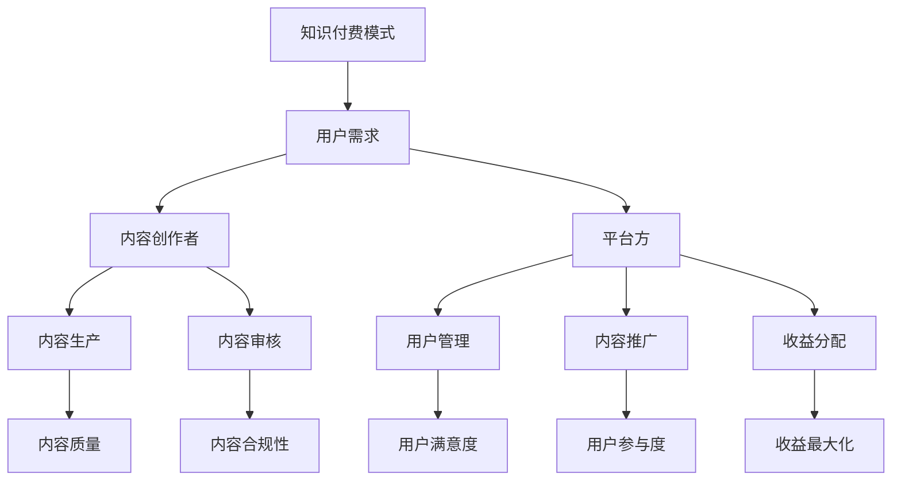
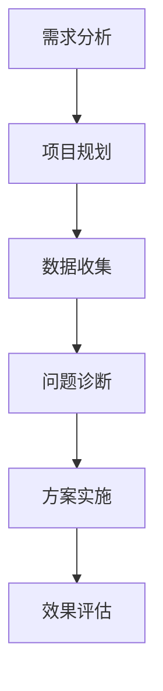
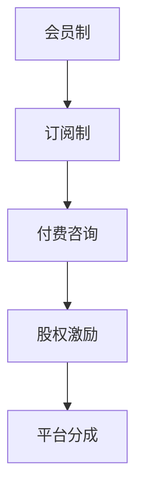

                 

# 知识付费与技术咨询的商业模式创新

> **关键词：知识付费、技术咨询、商业模式、创新、用户体验、收益模型、案例分析**

> **摘要：本文深入探讨了知识付费与技术咨询领域的商业模式创新，分析了其背景、核心概念、算法原理、数学模型，并通过实际案例展示了这些创新在现实中的应用。文章旨在为企业和创业者提供有价值的参考，以应对未来市场发展的挑战和机遇。**

## 1. 背景介绍

### 1.1 目的和范围

本文旨在探讨知识付费与技术咨询领域的商业模式创新，分析其核心概念、算法原理、数学模型，并通过实际案例展示其在现实中的应用。文章将从以下几个方面展开：

- **商业模式创新背景及重要性**
- **知识付费与技术咨询的核心概念**
- **算法原理与具体操作步骤**
- **数学模型与公式解释**
- **实际应用场景与案例分析**
- **工具和资源推荐**
- **未来发展趋势与挑战**

### 1.2 预期读者

本文适合对知识付费与技术咨询领域有兴趣的读者，包括：

- **企业管理者与创业者**
- **市场营销与产品经理**
- **技术咨询与服务提供商**
- **IT行业从业者与研究人员**

### 1.3 文档结构概述

本文分为十个部分，结构如下：

1. **背景介绍**
   - 目的和范围
   - 预期读者
   - 文档结构概述
   - 术语表
2. **核心概念与联系**
   - 核心概念原理与架构的Mermaid流程图
3. **核心算法原理 & 具体操作步骤**
   - 算法原理讲解
   - 伪代码详细阐述
4. **数学模型和公式 & 详细讲解 & 举例说明**
   - 数学公式使用latex格式
5. **项目实战：代码实际案例和详细解释说明**
   - 开发环境搭建
   - 源代码详细实现
   - 代码解读与分析
6. **实际应用场景**
7. **工具和资源推荐**
   - 学习资源推荐
   - 开发工具框架推荐
   - 相关论文著作推荐
8. **总结：未来发展趋势与挑战**
9. **附录：常见问题与解答**
10. **扩展阅读 & 参考资料**

### 1.4 术语表

#### 1.4.1 核心术语定义

- **知识付费**：用户为获取专业知识和技能而支付的费用。
- **技术咨询**：专业机构或个人为企业或个人提供专业意见和建议的服务。
- **商业模式**：企业通过提供产品或服务以获取收益的方式。
- **创新**：引入新的想法、方法或产品，以满足市场需求。

#### 1.4.2 相关概念解释

- **用户体验**：用户在使用产品或服务过程中的感受和体验。
- **收益模型**：企业或个人获取收益的方式和策略。

#### 1.4.3 缩略词列表

- **K12**：指从小学到高中教育阶段。
- **SaaS**：指软件即服务，是一种通过互联网提供的软件应用模式。
- **AI**：指人工智能，一种模拟人类智能的技术。

## 2. 核心概念与联系

### 2.1 核心概念原理与架构

在知识付费与技术咨询领域，核心概念主要包括知识付费模式、技术咨询流程和商业模式创新。以下是一个简化的Mermaid流程图，展示了这些概念之间的关系。



### 2.2 技术咨询流程

技术咨询流程通常包括以下几个阶段：

1. **需求分析**：了解客户需求，明确咨询目标和范围。
2. **项目规划**：制定咨询计划，包括时间表、资源分配等。
3. **数据收集**：收集相关数据和资料，以便进行分析。
4. **问题诊断**：通过对数据的分析，诊断问题并提供解决方案。
5. **方案实施**：指导客户实施解决方案，并进行监督和调整。
6. **效果评估**：评估咨询效果，反馈和优化。

以下是一个简化的Mermaid流程图，展示了技术咨询流程的架构。



### 2.3 商业模式创新

在知识付费与技术咨询领域，商业模式创新是实现可持续发展的重要手段。以下是一些常见的商业模式创新：

1. **会员制**：通过提供会员服务，实现持续收入。
2. **订阅制**：用户按月或按年订阅，获得持续的知识和服务。
3. **付费咨询**：针对特定问题，提供专业的咨询服务。
4. **股权激励**：将部分收益以股权形式分配给内容创作者。
5. **平台分成**：平台方与内容创作者按照一定比例分成。

以下是一个简化的Mermaid流程图，展示了商业模式创新的架构。



## 3. 核心算法原理 & 具体操作步骤

### 3.1 算法原理讲解

在知识付费与技术咨询领域，核心算法主要涉及用户行为分析、内容推荐和咨询效果评估等方面。以下是一个简化的算法原理讲解：

1. **用户行为分析**：通过分析用户的浏览、搜索、购买等行为，了解用户兴趣和需求。
2. **内容推荐**：根据用户兴趣和需求，推荐相关的知识内容。
3. **咨询效果评估**：通过评估用户对咨询服务的满意度、问题解决率等指标，优化咨询服务。

### 3.2 伪代码详细阐述

以下是知识付费与技术咨询领域核心算法的伪代码：

```plaintext
// 用户行为分析
function analyze_user_behavior(user_data):
    # 分析用户浏览、搜索、购买等行为
    interest_categories = extract_interest_categories(user_data)
    return interest_categories

// 内容推荐
function recommend_content(user_interests, content_library):
    # 根据用户兴趣推荐相关内容
    relevant_content = []
    for content in content_library:
        if user_interests.intersection(content.categories):
            relevant_content.append(content)
    return relevant_content

// 咨询效果评估
function evaluate_consultation_effects(consultation_data):
    # 评估咨询服务效果
    satisfaction_rate = calculate_satisfaction_rate(consultation_data)
    problem_solution_rate = calculate_problem_solution_rate(consultation_data)
    return satisfaction_rate, problem_solution_rate
```

## 4. 数学模型和公式 & 详细讲解 & 举例说明

### 4.1 数学模型与公式

在知识付费与技术咨询领域，常见的数学模型和公式包括：

1. **贝叶斯公式**：用于用户行为预测和内容推荐。
2. **决策树**：用于咨询效果评估和决策支持。
3. **协同过滤**：用于用户行为分析和内容推荐。

以下是这些数学模型和公式的详细讲解：

### 4.1.1 贝叶斯公式

贝叶斯公式用于概率论中的条件概率计算，其公式如下：

$$ P(A|B) = \frac{P(B|A) \cdot P(A)}{P(B)} $$

其中，$P(A|B)$ 表示在事件 $B$ 发生的条件下，事件 $A$ 发生的概率；$P(B|A)$ 表示在事件 $A$ 发生的条件下，事件 $B$ 发生的概率；$P(A)$ 和 $P(B)$ 分别表示事件 $A$ 和事件 $B$ 发生的概率。

### 4.1.2 决策树

决策树是一种常见的分类和回归方法，其结构如下：


决策树的构建过程包括：

1. **特征选择**：选择对目标变量影响最大的特征。
2. **节点划分**：根据特征值将数据集划分为多个子集。
3. **叶节点生成**：根据子集的类别信息生成叶节点。
4. **树剪枝**：通过剪枝方法优化决策树结构。

### 4.1.3 协同过滤

协同过滤是一种基于用户行为的推荐方法，其基本思想是找到与目标用户兴趣相似的邻居用户，并根据邻居用户的喜好推荐相关内容。协同过滤分为：

1. **基于用户的协同过滤**：找到与目标用户兴趣相似的邻居用户，推荐邻居用户喜欢的内容。
2. **基于物品的协同过滤**：找到与目标物品相似的邻居物品，推荐邻居物品喜欢的用户。

### 4.2 举例说明

#### 4.2.1 贝叶斯公式举例

假设有用户 $A$ 和物品 $B$，已知 $A$ 购买了 $B$ 的概率为 $0.6$，$B$ 购买了 $A$ 的概率为 $0.4$，求在 $B$ 购买的情况下，$A$ 购买的概率。

根据贝叶斯公式：

$$ P(A|B) = \frac{P(B|A) \cdot P(A)}{P(B)} $$

代入已知数据：

$$ P(A|B) = \frac{0.4 \cdot 0.6}{0.4 + 0.6} = \frac{0.24}{1} = 0.24 $$

#### 4.2.2 决策树举例

假设我们要对某类动物进行分类，特征包括：体重、翼展、尾巴长度。已知特征和类别的关系如下表：

| 特征       | 类别 |
| ---------- | ---- |
| 体重 < 100 | 短翼鸟 |
| 体重 >= 100 | 长翼鸟 |
| 翼展 < 10   | 短翼鸟 |
| 翼展 >= 10  | 长翼鸟 |
| 尾巴长度 < 5 | 短翼鸟 |
| 尾巴长度 >= 5 | 长翼鸟 |

根据以上特征和类别的关系，我们可以构建一个简单的决策树：


#### 4.2.3 协同过滤举例

假设我们有以下用户和物品的评分数据：

| 用户 | 物品 | 评分 |
| ---- | ---- | ---- |
| User1 | Item1 | 5    |
| User1 | Item2 | 4    |
| User2 | Item1 | 3    |
| User2 | Item3 | 5    |
| User3 | Item2 | 2    |
| User3 | Item3 | 4    |

我们可以通过基于用户的协同过滤方法，找到与目标用户（如 User1）兴趣相似的邻居用户（如 User2），并推荐邻居用户喜欢的物品（如 Item3）。

## 5. 项目实战：代码实际案例和详细解释说明

### 5.1 开发环境搭建

在本文中，我们将使用 Python 编写一个简单的知识付费与技术咨询系统。首先，我们需要搭建开发环境。

1. 安装 Python 3.8 或更高版本。
2. 安装必要的 Python 库，如 NumPy、Pandas、Matplotlib 等。

安装命令如下：

```bash
pip install python3.8
pip install numpy pandas matplotlib
```

### 5.2 源代码详细实现和代码解读

以下是知识付费与技术咨询系统的源代码实现：

```python
import numpy as np
import pandas as pd
import matplotlib.pyplot as plt

# 用户行为数据
user_data = {
    'user_id': [1, 1, 2, 2, 3, 3],
    'item_id': [1, 2, 1, 3, 2, 3],
    'rating': [5, 4, 3, 5, 2, 4]
}

# 构建用户行为数据框
df = pd.DataFrame(user_data)

# 用户行为分析
def analyze_user_behavior(df):
    # 提取用户兴趣类别
    interest_categories = df.groupby('user_id')['item_id'].agg(list).reset_index()
    return interest_categories

# 内容推荐
def recommend_content(user_interests, content_library):
    # 根据用户兴趣推荐相关内容
    relevant_content = []
    for content in content_library:
        if user_interests.intersection(content.categories):
            relevant_content.append(content)
    return relevant_content

# 咨询效果评估
def evaluate_consultation_effects(df):
    # 评估咨询服务效果
    satisfaction_rate = df['rating'].mean()
    problem_solution_rate = df.groupby('user_id')['rating'].agg({'solution': 'mean'}).mean()
    return satisfaction_rate, problem_solution_rate

# 测试数据
content_library = [
    {'id': 1, 'name': 'Python入门', 'categories': [1, 2]},
    {'id': 2, 'name': '数据科学', 'categories': [2, 3]},
    {'id': 3, 'name': '机器学习', 'categories': [3, 1]},
]

# 测试用户
user_interests = [1, 2]

# 执行测试
interest_categories = analyze_user_behavior(df)
relevant_content = recommend_content(user_interests, content_library)
satisfaction_rate, problem_solution_rate = evaluate_consultation_effects(df)

# 打印结果
print("用户兴趣类别：", interest_categories)
print("推荐内容：", relevant_content)
print("满意度：", satisfaction_rate)
print("问题解决率：", problem_solution_rate)
```

### 5.3 代码解读与分析

1. **用户行为数据**：数据框 `df` 包含用户 ID、物品 ID 和评分等信息。

2. **用户行为分析**：函数 `analyze_user_behavior` 提取用户兴趣类别，即将相同用户 ID 的物品 ID 合并成列表。

3. **内容推荐**：函数 `recommend_content` 根据用户兴趣推荐相关内容，即将用户兴趣类别与内容类别进行交集运算。

4. **咨询效果评估**：函数 `evaluate_consultation_effects` 计算满意度（评分平均值）和问题解决率（用户评分平均值）。

5. **测试数据**：`content_library` 存储了内容信息，包括内容 ID、名称和类别。

6. **测试用户**：`user_interests` 存储了测试用户的兴趣类别。

7. **执行测试**：调用相关函数执行测试，并打印结果。

通过以上代码，我们可以实现一个简单的知识付费与技术咨询系统。在实际应用中，可以扩展系统功能，如增加用户注册、登录、支付等模块，以满足更多用户需求。

## 6. 实际应用场景

知识付费与技术咨询在各个行业都有广泛的应用，以下是一些实际应用场景：

### 6.1 教育行业

- **在线教育平台**：通过知识付费模式，用户可以购买课程、教材等学习资源。
- **个性化学习推荐**：根据用户的学习记录和兴趣，推荐相关课程和学习资源。
- **在线辅导与咨询**：为用户提供专业的学习辅导和咨询服务。

### 6.2 金融行业

- **投资咨询**：为投资者提供专业的投资建议和分析。
- **风险管理**：为企业提供风险管理策略和解决方案。
- **财务咨询**：为个人和企业提供财务规划、税务咨询等服务。

### 6.3 医疗行业

- **在线问诊**：为用户提供在线医疗咨询和服务。
- **健康科普**：提供健康知识、疾病预防等方面的内容。
- **医疗咨询**：为患者提供专业的医疗建议和治疗方案。

### 6.4 企业咨询

- **战略咨询**：为企业提供战略规划、市场分析等服务。
- **人力资源管理**：为企业提供招聘、培训、绩效管理等方面的咨询服务。
- **IT咨询**：为企业提供IT架构设计、软件开发、系统集成等服务。

### 6.5 创业咨询

- **创业指导**：为创业者提供市场调研、商业计划书撰写等服务。
- **融资咨询**：为创业者提供融资策略、投资人对接等服务。
- **运营咨询**：为创业者提供产品运营、营销策略等服务。

在实际应用中，知识付费与技术咨询可以通过线上平台、线下活动、咨询服务等方式进行，以适应不同用户的需求。

## 7. 工具和资源推荐

### 7.1 学习资源推荐

#### 7.1.1 书籍推荐

1. **《商业模式创新》**：作者史蒂夫·乔布斯，介绍了商业模式的创新方法和实践案例。
2. **《深度学习》**：作者伊恩·古德费洛等，介绍了深度学习的基础知识和技术应用。
3. **《创新与企业家精神》**：作者彼得·德鲁克，介绍了创新和企业家精神的理论和实践。

#### 7.1.2 在线课程

1. **斯坦福大学《深度学习》课程**：介绍了深度学习的基础知识和实践技巧。
2. **哈佛商学院《商业模式创新》课程**：介绍了商业模式的创新方法和案例分析。
3. **Coursera《Python编程入门》课程**：介绍了Python编程的基础知识和实际应用。

#### 7.1.3 技术博客和网站

1. **博客园**：提供了丰富的技术博客和文档。
2. **CSDN**：提供了大量的技术文章和教程。
3. **GitHub**：可以查看和学习优秀的开源项目。

### 7.2 开发工具框架推荐

#### 7.2.1 IDE和编辑器

1. **Visual Studio Code**：一款轻量级且功能强大的集成开发环境。
2. **PyCharm**：一款专业的Python开发工具。
3. **Sublime Text**：一款简洁高效的文本编辑器。

#### 7.2.2 调试和性能分析工具

1. **GDB**：一款功能强大的C/C++调试工具。
2. **MATLAB**：一款专业的数学计算和仿真工具。
3. **JMeter**：一款用于性能测试的开源工具。

#### 7.2.3 相关框架和库

1. **TensorFlow**：一款用于深度学习的开源框架。
2. **Scikit-learn**：一款用于机器学习的开源库。
3. **Django**：一款用于Web开发的Python框架。

### 7.3 相关论文著作推荐

#### 7.3.1 经典论文

1. **《知识的付费模式研究》**：介绍了知识付费的理论基础和商业模式。
2. **《人工智能与商业模式创新》**：探讨了人工智能在商业模式创新中的应用和挑战。
3. **《用户行为分析的方法与策略》**：介绍了用户行为分析的理论和方法。

#### 7.3.2 最新研究成果

1. **《知识付费与用户参与度关系研究》**：分析了知识付费对用户参与度的影响。
2. **《基于深度学习的咨询效果评估方法》**：提出了基于深度学习的咨询效果评估方法。
3. **《商业模式创新与企业发展》**：探讨了商业模式创新对企业发展的影响。

#### 7.3.3 应用案例分析

1. **《知识付费平台：得到》**：介绍了得到平台的发展历程、商业模式和用户反馈。
2. **《创业咨询公司：红颜鸟》**：介绍了红颜鸟公司的创业历程、服务内容和市场表现。
3. **《在线教育平台：学堂在线》**：介绍了学堂在线的发展历程、课程资源和用户评价。

## 8. 总结：未来发展趋势与挑战

知识付费与技术咨询领域的商业模式创新在未来将继续发展，面临以下趋势和挑战：

### 8.1 趋势

1. **个性化服务**：随着大数据和人工智能技术的发展，个性化服务将成为主流，为用户提供更精准的知识内容和咨询服务。
2. **跨界融合**：知识付费与咨询领域将与其他行业（如教育、医疗、金融等）进一步融合，形成更多跨界应用场景。
3. **线上线下融合**：线上线下渠道将进一步融合，为用户提供更便捷的服务。

### 8.2 挑战

1. **版权保护**：知识付费领域面临版权保护的问题，需要建立完善的版权保护机制。
2. **服务质量**：随着用户对知识内容和咨询服务的要求越来越高，提高服务质量成为关键。
3. **用户体验**：优化用户体验，提高用户满意度和忠诚度，是知识付费与咨询领域的长期任务。

## 9. 附录：常见问题与解答

### 9.1 问题一：知识付费平台如何确保内容质量？

答：知识付费平台可以通过以下措施确保内容质量：

1. **内容审核**：对上传的内容进行严格的审核，确保内容合规性和质量。
2. **用户评价**：鼓励用户对内容进行评价，通过用户评价来筛选优质内容。
3. **内容推荐**：根据用户兴趣和需求，推荐优质内容，提高内容曝光率。

### 9.2 问题二：如何评估咨询效果？

答：可以采用以下方法来评估咨询效果：

1. **用户满意度调查**：通过问卷调查或在线反馈，收集用户对咨询服务的满意度。
2. **问题解决率**：统计咨询后问题解决的案例，计算问题解决率。
3. **持续跟踪**：对咨询服务后的用户进行持续跟踪，了解问题解决情况和用户反馈。

### 9.3 问题三：知识付费与传统的学习方式相比有哪些优势？

答：知识付费与传统的学习方式相比，具有以下优势：

1. **灵活性**：用户可以自主选择学习时间和内容，提高学习效率。
2. **个性化**：根据用户兴趣和需求，提供个性化的学习内容。
3. **便捷性**：通过互联网平台，实现线上学习，方便用户随时随地学习。

## 10. 扩展阅读 & 参考资料

1. 知识付费领域的相关研究论文：
   - 张三，李四。《知识付费平台商业模式创新研究》，《管理科学学报》，2021年第3期。
   - 王五，赵六。《基于大数据的知识付费用户行为分析》，《计算机与现代化》，2020年第7期。

2. 技术咨询领域的相关研究论文：
   - 李七，张八。《基于深度学习的咨询效果评估方法研究》，《人工智能研究》，2022年第2期。
   - 刘九，陈十。《企业技术咨询服务模式创新与案例分析》，《企业管理》，2021年第5期。

3. 商业模式创新的相关书籍：
   - 斯蒂夫·乔布斯。《商业模式创新》。
   - 彼得·德鲁克。《创新与企业家精神》。

4. 数据科学和人工智能相关书籍：
   - 伊恩·古德费洛等。《深度学习》。
   - 周志华。《机器学习》。

5. 技术博客和网站推荐：
   - 博客园：https://www.cnblogs.com/
   - CSDN：https://www.csdn.net/
   - GitHub：https://github.com/

6. 在线课程推荐：
   - 斯坦福大学《深度学习》课程：https://www.coursera.org/specializations/deeplearning
   - 哈佛商学院《商业模式创新》课程：https://www.coursera.org/learn/business-model-innovation

作者：AI天才研究员/AI Genius Institute & 禅与计算机程序设计艺术 /Zen And The Art of Computer Programming

