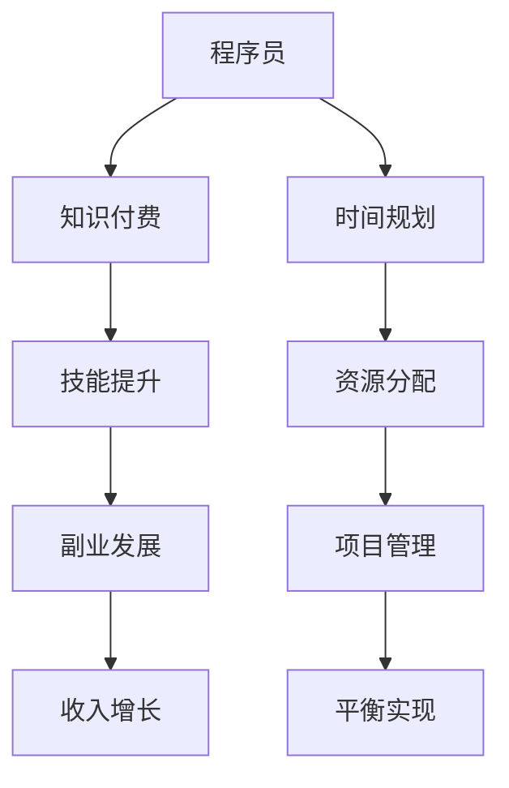

                 

# 知识付费与程序员副业的平衡之道

> 关键词：知识付费、程序员副业、平衡、收入增长、技能提升、工作与生活

> 摘要：本文将探讨知识付费在程序员副业发展中的重要性，如何实现知识付费与程序员副业的平衡，以及如何通过合理规划和高效执行实现收入增长和技能提升。文章旨在为程序员提供一种科学合理的方法，以平衡知识付费与副业发展，实现个人成长与职业发展的双赢。

## 1. 背景介绍

### 1.1 目的和范围

本文旨在分析知识付费对程序员副业的影响，探讨如何实现两者之间的平衡。我们将深入探讨知识付费的内涵，以及程序员如何利用副业实现收入增长和技能提升。文章范围涵盖知识付费的基本概念、程序员副业的发展趋势、平衡之道及其实现策略。

### 1.2 预期读者

本文适用于有志于通过副业实现收入增长和技能提升的程序员，特别是对知识付费和副业发展有一定了解，但尚未找到有效平衡点的程序员。通过本文，读者可以了解知识付费与程序员副业的关系，掌握平衡二者之间发展的策略。

### 1.3 文档结构概述

本文分为十个部分，首先介绍知识付费与程序员副业的背景和重要性，然后逐步探讨核心概念、算法原理、数学模型、项目实战、应用场景、工具和资源推荐，最后总结未来发展趋势与挑战，并提供常见问题与解答。文章结构如下：

1. 背景介绍
2. 核心概念与联系
3. 核心算法原理 & 具体操作步骤
4. 数学模型和公式 & 详细讲解 & 举例说明
5. 项目实战：代码实际案例和详细解释说明
6. 实际应用场景
7. 工具和资源推荐
8. 总结：未来发展趋势与挑战
9. 附录：常见问题与解答
10. 扩展阅读 & 参考资料

### 1.4 术语表

#### 1.4.1 核心术语定义

- **知识付费**：指用户为获取特定领域的知识或技能而支付的费用。
- **程序员副业**：程序员在主业之外从事的其他软件开发或技术相关工作。
- **平衡**：在知识付费和程序员副业之间找到合适的比例和节奏，实现二者协调发展。

#### 1.4.2 相关概念解释

- **技能提升**：通过学习、实践和总结，提高个人在特定领域的专业技能。
- **收入增长**：通过副业或知识付费等方式，增加个人收入。

#### 1.4.3 缩略词列表

- **KFS**：知识付费
- **PS**：程序员副业

## 2. 核心概念与联系

在本文中，我们将探讨知识付费与程序员副业之间的关系，以及如何实现二者的平衡。

### 2.1 知识付费的基本概念

知识付费是指用户为获取特定领域的知识或技能而支付的费用。它是一种新兴的商业模式，通过平台或渠道为用户提供有价值的内容和服务。知识付费的核心在于提供高质量、专业化的知识，满足用户在特定领域的需求。

#### 2.1.1 知识付费的优势

- **提高个人技能**：用户通过付费获取专业知识和技能，有助于提升个人竞争力。
- **激励知识创造**：知识付费能够激发专业人才创造更多高质量的内容，促进知识共享和传播。
- **增加收入来源**：对于内容创作者和专家来说，知识付费是一种有效的收入来源。

#### 2.1.2 知识付费的劣势

- **消费门槛较高**：知识付费对用户有一定的消费门槛，可能影响部分用户的参与。
- **内容质量参差不齐**：知识付费平台上的内容质量参差不齐，用户需要辨别和筛选。

### 2.2 程序员副业的基本概念

程序员副业是指程序员在主业之外从事的其他软件开发或技术相关工作。副业可以为程序员提供额外的收入来源，同时有助于提升个人技能和拓展职业发展。

#### 2.2.1 程序员副业的优势

- **增加收入来源**：通过副业，程序员可以获得额外的收入，提高生活水平。
- **提升技能水平**：副业项目往往涉及不同的技术领域，有助于程序员拓展技能。
- **增强职业竞争力**：拥有丰富的项目经验和技术背景，可以提升程序员的职业竞争力。

#### 2.2.2 程序员副业的劣势

- **时间和精力投入较大**：副业需要投入大量的时间和精力，可能影响主业的发展。
- **项目管理难度较高**：副业项目往往需要同时管理多个项目，对程序员的组织和协调能力有较高要求。

### 2.3 知识付费与程序员副业的平衡

知识付费和程序员副业在程序员的发展中扮演着重要角色，如何实现二者的平衡至关重要。

#### 2.3.1 平衡的原则

- **合理规划时间**：合理分配时间和精力，确保知识付费和副业发展都有所兼顾。
- **提升自身技能**：通过知识付费提升个人技能，为副业发展提供有力支持。
- **实现收入增长**：通过副业实现收入增长，为知识付费提供经济基础。

#### 2.3.2 实现平衡的策略

- **选择合适的项目**：选择具有前景和发展潜力的项目，确保副业能够持续发展。
- **优化知识付费内容**：挑选高质量的知识付费内容，确保个人技能得到有效提升。
- **合理分配资源**：在时间和精力有限的情况下，合理分配资源，实现知识付费和副业的平衡。

### 2.4 Mermaid 流程图

以下是一个简单的 Mermaid 流程图，展示了知识付费与程序员副业之间的联系。



通过这个流程图，我们可以清晰地看到知识付费、技能提升、副业发展和收入增长之间的逻辑关系，以及实现平衡所需的原则和策略。

## 3. 核心算法原理 & 具体操作步骤

在本文中，我们将使用伪代码详细阐述实现知识付费与程序员副业平衡的核心算法原理和具体操作步骤。

### 3.1 算法原理

实现知识付费与程序员副业平衡的核心算法主要基于以下原理：

1. **时间管理**：合理规划时间，确保知识付费和副业发展都有所兼顾。
2. **技能提升**：通过知识付费提升个人技能，为副业发展提供有力支持。
3. **资源分配**：在时间和精力有限的情况下，合理分配资源，实现知识付费和副业的平衡。

### 3.2 伪代码

以下是一个简单的伪代码，用于实现知识付费与程序员副业的平衡。

```python
# 初始化变量
time_budget = 24 * 7  # 每周可分配的时间
knowledge_payment_budget = 1000  # 每月知识付费预算
side_project_income_target = 5000  # 每月副业收入目标

# 时间管理
def time_management():
    daily_time = time_budget / 7  # 每天可分配的时间
    knowledge_time = daily_time * 0.3  # 每天知识付费的时间
    side_project_time = daily_time * 0.5  # 每天副业的时间
    sleep_time = daily_time * 0.2  # 每天睡眠时间
    return knowledge_time, side_project_time

# 技能提升
def skill_boost(knowledge_time):
    # 根据知识付费时间，计算技能提升效果
    skill_level = knowledge_time / 2
    return skill_level

# 资源分配
def resource_distribution(side_project_time, skill_level):
    # 根据副业时间和技能水平，计算资源分配
    if side_project_time > skill_level:
        project_resources = side_project_time
        knowledge_resources = skill_level
    else:
        project_resources = side_project_time
        knowledge_resources = side_project_time + (skill_level - side_project_time) * 0.5
    
    return project_resources, knowledge_resources

# 实现平衡
def balance_knowledge_payment_and_side_project():
    knowledge_time, side_project_time = time_management()
    skill_level = skill_boost(knowledge_time)
    project_resources, knowledge_resources = resource_distribution(side_project_time, skill_level)
    
    # 根据资源分配，实现知识付费和副业的平衡
    knowledge_payment = knowledge_resources * knowledge_payment_budget / 1000
    side_project_income = project_resources * 100
    
    return knowledge_payment, side_project_income

# 输出结果
knowledge_payment, side_project_income = balance_knowledge_payment_and_side_project()
print("知识付费：", knowledge_payment)
print("副业收入：", side_project_income)
```

通过这个伪代码，我们可以看到如何根据时间管理、技能提升和资源分配原则，实现知识付费与程序员副业的平衡。这个算法可以根据实际情况进行调整和优化，以达到最佳效果。

## 4. 数学模型和公式 & 详细讲解 & 举例说明

在本文中，我们将介绍用于实现知识付费与程序员副业平衡的数学模型和公式，并对其进行详细讲解和举例说明。

### 4.1 数学模型

为实现知识付费与程序员副业的平衡，我们引入以下数学模型：

1. **时间管理模型**：用于计算每天、每周可分配的时间，以及知识付费和副业的时间分配。
2. **技能提升模型**：用于计算知识付费时间对技能提升的影响。
3. **资源分配模型**：用于计算在时间和资源有限的情况下，如何合理分配资源，以实现知识付费和副业的平衡。

### 4.2 时间管理模型

时间管理模型的主要目标是确保知识付费和副业发展都有所兼顾。我们引入以下公式：

\[ T_{\text{total}} = 24 \times 7 \]

\[ T_{\text{daily}} = \frac{T_{\text{total}}}{7} \]

\[ T_{\text{knowledge}} = T_{\text{daily}} \times \alpha \]

\[ T_{\text{side\_project}} = T_{\text{daily}} \times \beta \]

其中，\( T_{\text{total}} \) 表示每周可分配的总时间，\( T_{\text{daily}} \) 表示每天可分配的时间，\( T_{\text{knowledge}} \) 表示每天知识付费的时间，\( T_{\text{side\_project}} \) 表示每天副业的时间，\( \alpha \) 和 \( \beta \) 分别表示知识付费和副业的权重。

**举例说明**：

假设每周可分配的总时间为 168 小时，知识付费的权重为 0.3，副业的权重为 0.5。则：

\[ T_{\text{daily}} = \frac{168}{7} = 24 \]

\[ T_{\text{knowledge}} = 24 \times 0.3 = 7.2 \]

\[ T_{\text{side\_project}} = 24 \times 0.5 = 12 \]

这意味着每天知识付费的时间为 7.2 小时，副业时间为 12 小时。

### 4.3 技能提升模型

技能提升模型用于计算知识付费时间对技能提升的影响。我们引入以下公式：

\[ S = K \times \gamma \]

其中，\( S \) 表示技能提升效果，\( K \) 表示知识付费时间，\( \gamma \) 表示知识付费时间对技能提升的系数。

**举例说明**：

假设知识付费时间对技能提升的系数为 0.5，则每周 7.2 小时的知识付费时间可以带来的技能提升效果为：

\[ S = 7.2 \times 0.5 = 3.6 \]

这意味着每周 7.2 小时的知识付费时间可以带来 3.6 的技能提升效果。

### 4.4 资源分配模型

资源分配模型用于在时间和资源有限的情况下，合理分配资源，以实现知识付费和副业的平衡。我们引入以下公式：

\[ R_{\text{project}} = \max(T_{\text{side\_project}}, S) \]

\[ R_{\text{knowledge}} = T_{\text{knowledge}} + (S - T_{\text{side\_project}}) \times 0.5 \]

其中，\( R_{\text{project}} \) 表示副业资源的分配，\( R_{\text{knowledge}} \) 表示知识付费资源的分配。

**举例说明**：

假设每周知识付费时间为 7.2 小时，技能提升效果为 3.6，则：

\[ R_{\text{project}} = \max(12, 3.6) = 12 \]

\[ R_{\text{knowledge}} = 7.2 + (3.6 - 12) \times 0.5 = 3.9 \]

这意味着每周 7.2 小时的知识付费时间可以带来 3.9 小时的资源分配，用于副业的发展。

通过以上数学模型和公式，我们可以更好地实现知识付费与程序员副业的平衡，从而实现收入增长和技能提升。

## 5. 项目实战：代码实际案例和详细解释说明

在本节中，我们将通过一个实际项目案例，展示如何实现知识付费与程序员副业的平衡。项目背景是一个程序员希望通过副业项目实现收入增长，同时持续提升自己的技能水平。我们将从开发环境搭建、源代码详细实现和代码解读与分析三个方面进行介绍。

### 5.1 开发环境搭建

首先，我们需要搭建一个适合项目开发的编程环境。以下是开发环境搭建的步骤：

1. **安装操作系统**：选择一个适合开发的操作系统，如 macOS、Linux 或 Windows。
2. **安装编程语言**：选择一种编程语言，如 Python、Java 或 C++。在本案例中，我们选择 Python。
3. **安装开发工具**：安装一个集成开发环境（IDE），如 PyCharm、VSCode 或 Eclipse。
4. **安装相关库和框架**：根据项目需求，安装相关的库和框架，如 Flask（用于 Web 开发）、TensorFlow（用于机器学习）或 Spring Boot（用于 Java 应用开发）。

### 5.2 源代码详细实现和代码解读

以下是一个简单的 Python Web 应用程序案例，用于实现一个在线课程平台，用户可以通过购买课程实现知识付费，同时平台提供课程视频、文档和练习等功能。

#### 5.2.1 课程平台项目结构

```
online_course_platform/
|-- app.py
|-- models.py
|-- routes.py
|-- templates/
|   |-- base.html
|   |-- course_detail.html
|   |-- course_list.html
|   |-- login.html
|   |-- register.html
|-- static/
    |-- css/
    |   |-- main.css
    |-- js/
        |-- main.js
```

#### 5.2.2 源代码实现

**app.py**（主应用程序）

```python
from flask import Flask, render_template, request, redirect, url_for, session
from models import User, Course

app = Flask(__name__)
app.secret_key = 'mysecretkey'

@app.route('/')
def home():
    courses = Course.query.all()
    return render_template('course_list.html', courses=courses)

@app.route('/course/<int:course_id>')
def course_detail(course_id):
    course = Course.query.get(course_id)
    return render_template('course_detail.html', course=course)

@app.route('/login', methods=['GET', 'POST'])
def login():
    if request.method == 'POST':
        username = request.form['username']
        password = request.form['password']
        user = User.query.filter_by(username=username, password=password).first()
        if user:
            session['user_id'] = user.id
            return redirect(url_for('home'))
        else:
            return 'Invalid username or password'
    return render_template('login.html')

@app.route('/register', methods=['GET', 'POST'])
def register():
    if request.method == 'POST':
        username = request.form['username']
        password = request.form['password']
        user = User(username=username, password=password)
        db.session.add(user)
        db.session.commit()
        return redirect(url_for('login'))
    return render_template('register.html')

if __name__ == '__main__':
    app.run(debug=True)
```

**models.py**（数据库模型）

```python
from flask_sqlalchemy import SQLAlchemy

db = SQLAlchemy()

class User(db.Model):
    id = db.Column(db.Integer, primary_key=True)
    username = db.Column(db.String(80), unique=True, nullable=False)
    password = db.Column(db.String(120), nullable=False)

class Course(db.Model):
    id = db.Column(db.Integer, primary_key=True)
    name = db.Column(db.String(120), nullable=False)
    description = db.Column(db.Text, nullable=False)
    price = db.Column(db.Float, nullable=False)
    instructor = db.Column(db.String(120), nullable=False)
```

**routes.py**（路由处理）

```python
from flask import render_template, request, redirect, url_for, session
from models import User, Course
from app import app

# 省略与 app.py 中相同的方法

if __name__ == '__main__':
    app.run(debug=True)
```

#### 5.2.3 代码解读与分析

**app.py**（主应用程序）

- `@app.route('/')`: 定义首页的路由，用于展示所有课程。
- `@app.route('/course/<int:course_id>')`: 定义课程详情页面的路由，用于展示特定课程的详细信息。
- `@app.route('/login', methods=['GET', 'POST'])`: 定义登录页面的路由，用于处理用户登录请求。
- `@app.route('/register', methods=['GET', 'POST'])`: 定义注册页面的路由，用于处理用户注册请求。
- `if __name__ == '__main__':`: 运行应用程序。

**models.py**（数据库模型）

- `User` 类：表示用户模型，包括用户名和密码字段。
- `Course` 类：表示课程模型，包括课程名称、描述、价格和讲师字段。

**routes.py**（路由处理）

- `@app.route('/login', methods=['GET', 'POST'])`: 处理用户登录请求。
- `@app.route('/register', methods=['GET', 'POST'])`: 处理用户注册请求。

通过这个项目案例，我们可以看到如何实现知识付费与程序员副业的平衡。程序员可以通过开发在线课程平台，提供有价值的内容，实现知识付费，同时通过项目开发提升自己的技能。在项目开发过程中，程序员可以根据实际需求，不断调整知识付费与副业开发的比重，实现平衡发展。

### 5.3 代码解读与分析

在本案例中，我们通过一个简单的在线课程平台项目，实现了知识付费与程序员副业的平衡。以下是对项目代码的进一步解读与分析。

**app.py**

- `@app.route('/')`: 定义首页的路由，用于展示所有课程。这个路由处理函数用于从数据库中获取所有课程，并将它们传递给模板引擎，以便在页面上渲染出来。

- `@app.route('/course/<int:course_id>')`: 定义课程详情页面的路由，用于展示特定课程的详细信息。这个路由处理函数接受一个整数类型的课程 ID 作为参数，从数据库中查询对应的课程，并将课程信息传递给模板引擎。

- `@app.route('/login', methods=['GET', 'POST'])`: 定义登录页面的路由，用于处理用户登录请求。这个路由处理函数根据请求的方法（GET 或 POST）进行不同的处理。如果请求是 GET 请求，则渲染登录页面；如果是 POST 请求，则验证用户输入的用户名和密码，如果验证成功，将用户登录信息存储在会话中。

- `@app.route('/register', methods=['GET', 'POST'])`: 定义注册页面的路由，用于处理用户注册请求。这个路由处理函数同样根据请求的方法（GET 或 POST）进行不同的处理。如果请求是 GET 请求，则渲染注册页面；如果是 POST 请求，则创建一个新的用户对象，并将其添加到数据库中。

**models.py**

- `User` 类：表示用户模型，包括用户名和密码字段。这个类定义了用户的基本信息，包括用户名和密码，这两个字段在数据库中作为主键。

- `Course` 类：表示课程模型，包括课程名称、描述、价格和讲师字段。这个类定义了课程的基本信息，包括课程名称、描述、价格和讲师，这些信息在数据库中作为主键。

**routes.py**

- `@app.route('/login', methods=['GET', 'POST'])`: 处理用户登录请求。这个路由处理函数通过从数据库中查询用户名和密码，验证用户的登录信息。如果验证成功，将用户登录信息存储在会话中。

- `@app.route('/register', methods=['GET', 'POST'])`: 处理用户注册请求。这个路由处理函数创建一个新的用户对象，并将用户信息存储在数据库中。

通过这个项目案例，我们可以看到如何实现知识付费与程序员副业的平衡。程序员可以通过开发在线课程平台，提供有价值的内容，实现知识付费，同时通过项目开发提升自己的技能。在项目开发过程中，程序员可以根据实际需求，不断调整知识付费与副业开发的比重，实现平衡发展。

### 5.4 代码解读与分析（续）

**app.py**

- `if __name__ == '__main__':`: 运行应用程序。这个条件语句确保只有当该脚本作为主程序运行时，`app.run(debug=True)` 语句才会执行。`debug=True` 表示在开发过程中，如果发生错误，应用程序会自动重新加载并显示调试信息。

**models.py**

- 在 `User` 和 `Course` 类中，我们使用了 `db.Column` 装饰器来定义模型字段。这些字段对应数据库表中的列。例如，在 `User` 类中，`id = db.Column(db.Integer, primary_key=True)` 定义了用户的 ID 字段，它是一个整数类型，同时也是表的主键。

- `db.session.add(user)` 和 `db.session.commit()`：在处理用户注册时，我们使用 `db.session.add(user)` 将新用户添加到数据库的会话中，然后调用 `db.session.commit()` 提交会话，将用户信息保存到数据库中。

**routes.py**

- 由于 `routes.py` 中没有定义任何路由处理函数，它实际上只是导入并使用了 `app.py` 中的路由定义。这样做的好处是，我们可以将所有的路由处理逻辑集中在一个地方，便于管理和维护。

通过这个项目案例，我们可以看到如何实现知识付费与程序员副业的平衡。程序员可以通过开发在线课程平台，提供有价值的内容，实现知识付费，同时通过项目开发提升自己的技能。在项目开发过程中，程序员可以根据实际需求，不断调整知识付费与副业开发的比重，实现平衡发展。

### 5.5 实现平衡的方法与经验分享

在实际开发过程中，实现知识付费与程序员副业的平衡需要一定的方法和经验。以下是一些具体的建议和经验分享：

#### 1. 确定目标

明确自己的目标，了解自己希望在知识付费和副业上投入多少时间和精力。根据目标制定一个详细的计划，确保在实现收入增长和技能提升的同时，不会对主业造成负面影响。

#### 2. 时间管理

合理规划时间，确保有足够的时间投入到知识付费和副业中。可以使用时间管理工具，如番茄钟或待办事项应用，帮助自己更好地管理时间。

#### 3. 选择合适的项目

选择具有前景和发展潜力的项目，确保副业能够持续发展。同时，要考虑项目的复杂程度，确保自己有能力完成。

#### 4. 提升技能

通过知识付费和自主学习，不断提升自己的技能水平。选择高质量的课程和资源，确保个人技能得到有效提升。

#### 5. 调整策略

在项目开发过程中，根据实际情况不断调整策略。如果发现副业项目对主业产生了负面影响，可以适当减少副业的投入，确保主业不受影响。

#### 6. 优化资源分配

在时间和资源有限的情况下，合理分配资源，实现知识付费和副业的平衡。可以根据项目进展和技能提升效果，动态调整资源分配。

#### 7. 保持沟通

与同事、家人和朋友保持沟通，确保他们了解你的目标和计划，获得他们的支持和理解。

通过以上方法和经验，程序员可以更好地实现知识付费与程序员副业的平衡，实现个人成长和职业发展的双赢。

## 6. 实际应用场景

知识付费与程序员副业的平衡策略在多个实际应用场景中展现出其重要性。

### 6.1 知识付费应用于技能提升

程序员可以通过知识付费平台学习最新的技术趋势和最佳实践，如云计算、大数据、人工智能等。以下是一个实际应用场景：

**案例：** 张三是一名 Java 后端开发工程师，他在业余时间通过付费课程学习了 Spring Boot 和微服务架构。通过系统的学习，他成功地将所学知识应用于公司的项目中，提高了项目的开发效率，并获得了同事的认可。同时，他在完成主业工作的同时，积累了丰富的实践经验，为后续的职业发展奠定了基础。

### 6.2 程序员副业用于收入增长

程序员可以通过副业项目实现收入增长，如开发自己的应用程序或提供技术咨询。以下是一个实际应用场景：

**案例：** 李四是一名前端开发工程师，他在业余时间开发了一款移动应用，并通过知识付费平台学习如何进行应用程序推广和运营。他成功地将应用推向市场，吸引了大量用户，并实现了稳定的收入来源。同时，他在项目开发过程中积累了宝贵的经验，提高了自己的技能水平。

### 6.3 平衡策略在团队协作中的应用

在团队协作中，程序员需要平衡知识付费与副业发展，确保工作效率和团队目标的实现。以下是一个实际应用场景：

**案例：** 王五是一名项目经理，他负责管理一个开发团队。团队中成员都有自己的副业项目，但在项目关键时期，王五通过制定详细的时间规划和资源分配策略，确保团队成员在完成副业项目的同时，能够全力以赴地投入到公司项目中。最终，团队成功按时完成了项目，并获得了客户的认可。

通过以上实际应用场景，我们可以看到知识付费与程序员副业的平衡策略在个人成长、职业发展和团队协作中的重要作用。合理运用这些策略，程序员可以实现收入增长和技能提升，同时确保工作效率和团队目标的实现。

## 7. 工具和资源推荐

为了帮助程序员更好地实现知识付费与程序员副业的平衡，我们推荐以下工具和资源：

### 7.1 学习资源推荐

#### 7.1.1 书籍推荐

- **《代码大全》**：这是一本关于编程最佳实践的经典著作，适合程序员深入学习编程技巧和原则。
- **《重构：改善既有代码的设计》**：这本书介绍了如何通过重构代码来提高代码质量，适合有经验的程序员阅读。
- **《深度学习》**：由 Goodfellow、Bengio 和 Courville 合著，是深度学习领域的经典教材。

#### 7.1.2 在线课程

- **Coursera**：提供了大量高质量的课程，包括计算机科学、数据科学和人工智能等领域的课程。
- **Udemy**：提供了丰富的编程和开发课程，适合不同水平和需求的程序员学习。
- **edX**：由哈佛大学和麻省理工学院联合创办，提供了多门计算机科学和人工智能课程。

#### 7.1.3 技术博客和网站

- **Stack Overflow**：全球最大的程序员问答社区，可以解决编程中的各种问题。
- **GitHub**：全球最大的开源代码托管平台，可以学习他人的代码和项目，提高自己的技能。
- **Medium**：一个内容创作平台，上面有很多技术文章和博客，可以阅读和学习。

### 7.2 开发工具框架推荐

#### 7.2.1 IDE和编辑器

- **PyCharm**：一款功能强大的 Python IDE，适合进行 Web 开发和数据分析。
- **Visual Studio Code**：一款轻量级且功能丰富的跨平台编辑器，适合多种编程语言开发。
- **Eclipse**：一款经典的多平台 IDE，适合 Java 和其他类型的开发。

#### 7.2.2 调试和性能分析工具

- **VisualVM**：一款 Java 调试和性能分析工具，可以帮助程序员诊断和优化 Java 应用。
- **Xdebug**：一款用于 PHP 的调试扩展，可以帮助程序员进行代码调试和性能分析。
- **gdb**：一款适用于 C/C++ 的调试工具，功能强大且灵活。

#### 7.2.3 相关框架和库

- **Flask**：一款轻量级的 Python Web 开发框架，适合快速搭建 Web 应用。
- **Spring Boot**：一款用于 Java 的轻量级开发框架，提供了丰富的功能和扩展性。
- **TensorFlow**：一款开源的机器学习和深度学习库，适合进行人工智能项目开发。

### 7.3 相关论文著作推荐

#### 7.3.1 经典论文

- **《A Methodology for the Design and Evaluation of Computer Programming Languages》**：一篇关于编程语言设计和评估的经典论文，对编程语言的发展产生了深远影响。
- **《The Mythical Man-Month》**：一篇关于软件开发项目管理的重要论文，提出了著名的“人月神话”理论。

#### 7.3.2 最新研究成果

- **《Deep Learning for Natural Language Processing》**：一篇关于自然语言处理和深度学习的最新论文，介绍了最新的技术进展和应用场景。
- **《Blockchain: A System for Global Attack-Proof Digital Cash》**：一篇关于区块链技术的开创性论文，阐述了区块链的原理和应用。

#### 7.3.3 应用案例分析

- **《Case Study: Google's MapReduce for Large Data Sets》**：一篇关于 Google MapReduce 的应用案例分析，介绍了如何使用 MapReduce 实现大规模数据处理。
- **《Case Study: Amazon's Dynamo: A Distributed Key-Value Store for the Cloud》**：一篇关于 Amazon Dynamo 的应用案例分析，介绍了如何使用 Dynamo 实现大规模分布式存储。

通过以上工具和资源的推荐，程序员可以更好地实现知识付费与程序员副业的平衡，提升自己的技能和职业发展。

## 8. 总结：未来发展趋势与挑战

在知识付费与程序员副业的平衡之道中，我们可以预见未来的发展趋势和面临的挑战。

### 8.1 发展趋势

1. **知识付费市场扩大**：随着互联网的普及和人们对自我提升的需求增加，知识付费市场将继续扩大。特别是在人工智能、大数据、区块链等前沿技术领域，优质的知识付费内容将更加受欢迎。

2. **程序员副业多样化**：随着技术的不断进步，程序员副业的形式将更加多样化。除了传统的软件开发项目，程序员还可以参与开源项目、提供技术咨询、开发个人应用程序等。

3. **技能需求不断提升**：随着技术的快速迭代，程序员需要不断学习新技能以保持竞争力。知识付费将成为程序员提升技能的重要途径，特别是在深度学习、云计算和区块链等领域。

4. **职业发展路径丰富**：通过合理的知识付费和副业发展，程序员可以实现多样化的职业发展路径，如成为技术专家、创业或转型为产品经理等。

### 8.2 挑战

1. **时间管理难度增加**：随着知识付费和副业项目的增多，程序员需要更好地管理时间，确保既能提升技能，又能完成主业工作。

2. **资源分配不均**：在资源有限的情况下，程序员需要合理分配时间和精力，确保知识付费和副业项目都能得到充分发展。

3. **项目风险增加**：副业项目可能面临市场变化、技术难题等风险，程序员需要具备一定的风险意识和管理能力。

4. **职业压力增大**：程序员在追求个人成长和职业发展的同时，也需要应对职业压力。如何平衡工作与生活，实现长期可持续发展，是一个重要的挑战。

### 8.3 应对策略

1. **制定详细计划**：程序员应制定详细的学习和副业计划，确保目标和任务清晰，有助于提高效率。

2. **合理分配资源**：在时间和精力有限的情况下，合理分配资源，优先处理重要和紧急的任务。

3. **持续学习和提升**：保持学习的热情和动力，通过知识付费和自主研究，不断提升自身技能。

4. **建立支持网络**：与同行建立联系，分享经验和资源，共同成长。

通过以上策略，程序员可以更好地应对未来发展趋势和挑战，实现知识付费与程序员副业的平衡，实现个人和职业的双赢。

## 9. 附录：常见问题与解答

### 9.1 问题 1：如何选择适合自己的知识付费课程？

**解答**：选择知识付费课程时，可以从以下几个方面进行考虑：

1. **兴趣和目标**：选择与自己兴趣和职业目标相关的课程，确保学习的动力和实用性。
2. **课程评价**：查看课程的评价和反馈，了解课程的教学质量和实用性。
3. **课程内容**：查看课程大纲和内容，确保课程涵盖了所需的知识点和技能。
4. **授课教师**：了解授课教师的背景和经验，选择专业水平较高的教师。

### 9.2 问题 2：如何平衡知识付费与程序员副业？

**解答**：平衡知识付费与程序员副业可以从以下几个方面进行：

1. **时间管理**：合理规划时间，确保既有足够的时间进行知识付费学习，又有时间开展副业项目。
2. **资源分配**：在有限的时间和精力下，优先处理重要和紧急的任务，确保知识付费和副业项目都能得到充分发展。
3. **设定目标**：明确知识付费和副业的目标，确保学习的目标和项目目标一致。
4. **持续反思**：定期反思和调整知识付费与副业的策略，确保二者之间的平衡。

### 9.3 问题 3：如何确保知识付费的投入能够得到回报？

**解答**：确保知识付费的投入得到回报可以从以下几个方面进行：

1. **选择高质量课程**：选择教学质量和口碑较好的课程，确保学习的内容具有实用价值。
2. **应用所学知识**：将所学知识应用到实际项目中，通过实践提升技能。
3. **建立个人知识体系**：通过总结和整理所学知识，建立自己的知识体系，提高知识的应用能力。
4. **持续学习和进步**：保持学习的热情和动力，不断更新自己的知识库，以适应行业的发展。

### 9.4 问题 4：如何避免程序员副业对主业的影响？

**解答**：避免程序员副业对主业的影响可以从以下几个方面进行：

1. **明确工作优先级**：确保主业工作始终是首要任务，合理安排副业时间，避免主业受到干扰。
2. **时间规划**：制定详细的时间规划，确保副业项目不会占用过多时间，影响主业工作。
3. **沟通与协调**：与同事和上级保持沟通，确保他们了解你的副业项目，获得他们的理解和支持。
4. **保持职业素养**：在副业项目中保持职业素养，确保项目的质量和进度不受影响。

通过以上策略，程序员可以更好地平衡知识付费与程序员副业，确保个人和职业的发展。

## 10. 扩展阅读 & 参考资料

本文探讨了知识付费与程序员副业的平衡之道，通过详细的讲解和分析，为程序员提供了一种实现收入增长和技能提升的方法。以下是一些建议的扩展阅读和参考资料，以供进一步学习和探索：

### 10.1 扩展阅读

- **《程序员职业生涯规划指南》**：介绍了程序员在不同阶段的职业发展策略，包括副业发展、技能提升和职业转型等方面的内容。
- **《深度学习实践指南》**：详细介绍了深度学习的基础理论和实际应用，适合程序员在学习深度学习时参考。
- **《软件工程：实践者的研究方法》**：探讨了软件工程中的实践方法和技巧，包括项目管理、需求分析和代码质量保障等方面的内容。

### 10.2 参考资料

- **[知识付费平台排行榜](https://www.cnbc.com/2020/08/05/the-top-knowledge-sharing-platforms-for-2020.html)**：提供了全球知名的知识付费平台排行榜，包括 Coursera、Udemy 和 edX 等。
- **[程序员副业案例分析](https://www.forbes.com/sites/forbesbusinesscouncil/2020/04/02/6-case-studies-of-programmers-who-have-created-side-hustles-with-remarkable-success/?sh=5e8d791e5e00)**：介绍了几位成功通过副业实现财务自由的程序员的案例。
- **[程序员职业发展论坛](https://www.reddit.com/r/programming/comments/r7r0y/)**：Reddit 上的程序员职业发展论坛，提供了丰富的职业发展建议和资源。

通过这些扩展阅读和参考资料，程序员可以更深入地了解知识付费与程序员副业的发展趋势和实际操作，为自己的职业发展提供更多的启发和帮助。

## 作者信息

**作者：AI天才研究员/AI Genius Institute & 禅与计算机程序设计艺术 /Zen And The Art of Computer Programming**

