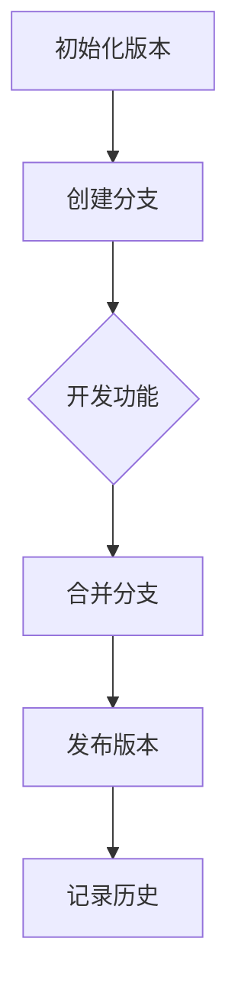
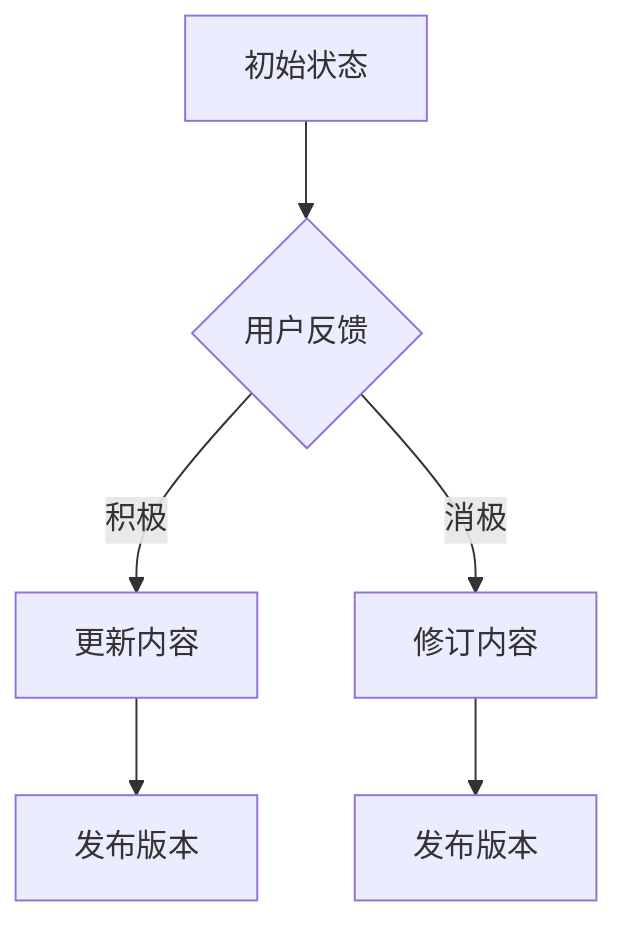
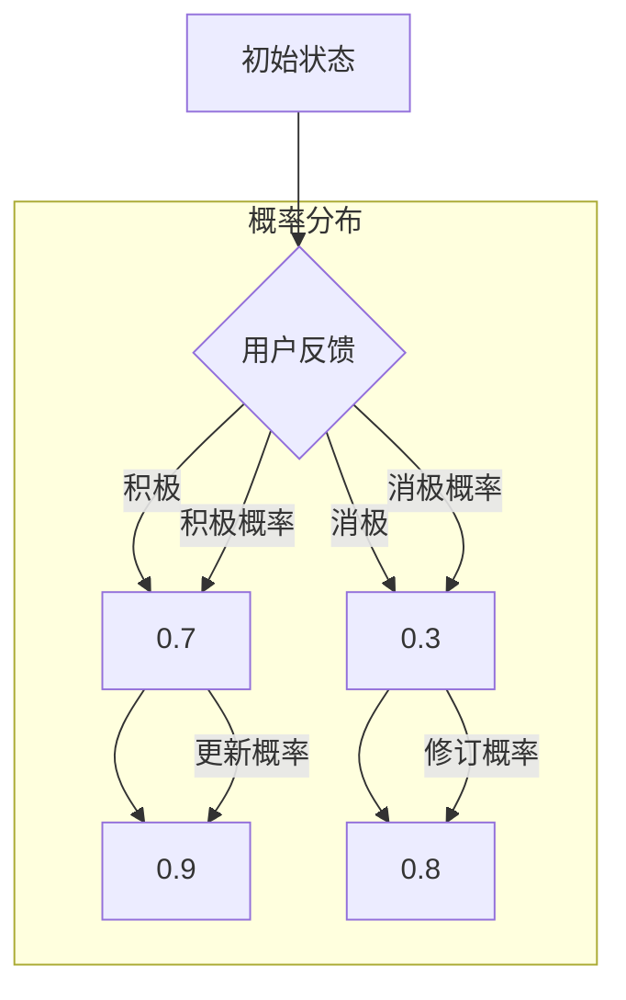

                 

# 知识付费内容的版本控制与更新策略

## 关键词

- 知识付费
- 版本控制
- 更新策略
- 内容管理
- 用户反馈
- 技术架构

## 摘要

本文将探讨知识付费内容在版本控制与更新策略方面的重要性和挑战。通过分析现有技术手段和最佳实践，文章提出了一套系统的版本控制与更新策略，旨在提高知识付费内容的时效性、准确性和用户体验。本文首先介绍了知识付费的背景和现状，然后深入讨论了版本控制与更新策略的核心概念、算法原理、数学模型以及实际应用案例。最后，文章总结了未来发展趋势和面临的挑战，并推荐了一系列相关资源和工具，以供读者参考。

## 1. 背景介绍

### 1.1 目的和范围

本文的目标是帮助知识付费平台和技术开发者理解版本控制和更新策略在知识付费内容管理中的重要性，并提供一套实用且有效的策略。文章将涵盖版本控制的基本概念、算法原理、数学模型、实际应用案例以及未来发展趋势。通过本文的阅读，读者将能够：

1. 理解版本控制与更新策略的基本概念。
2. 掌握核心算法原理和操作步骤。
3. 应用数学模型进行详细讲解和举例说明。
4. 通过实际案例学习代码实现和解读。
5. 探索知识付费内容的实际应用场景。
6. 了解相关工具和资源的推荐。

### 1.2 预期读者

本文的预期读者主要包括：

1. 知识付费平台的内容管理者。
2. 技术开发者，尤其是从事后端开发和内容管理系统开发的工程师。
3. 对知识付费和版本控制感兴趣的研究人员和学生。
4. 内容创作者和讲师，希望优化其内容更新策略。

### 1.3 文档结构概述

本文将按照以下结构展开：

1. **背景介绍**：介绍知识付费的背景和目的，包括版本控制与更新策略的重要性和挑战。
2. **核心概念与联系**：详细讨论版本控制的核心概念，包括核心术语定义、相关概念解释和缩略词列表。
3. **核心算法原理 & 具体操作步骤**：解释版本控制的算法原理，并提供伪代码示例。
4. **数学模型和公式 & 详细讲解 & 举例说明**：介绍用于版本控制的数学模型，并使用LaTeX格式给出具体公式。
5. **项目实战：代码实际案例和详细解释说明**：通过实际案例展示代码实现过程和解读。
6. **实际应用场景**：讨论知识付费内容在不同领域的应用。
7. **工具和资源推荐**：推荐相关的学习资源、开发工具和框架。
8. **总结：未来发展趋势与挑战**：总结文章的主要观点，并展望未来趋势和挑战。
9. **附录：常见问题与解答**：提供常见问题及其解答。
10. **扩展阅读 & 参考资料**：推荐进一步阅读的材料和相关资源。

### 1.4 术语表

#### 1.4.1 核心术语定义

- **知识付费**：指用户为获取特定知识内容或服务而支付的费用。
- **版本控制**：指管理和跟踪文档或代码的修改历史，以确保内容的一致性和准确性。
- **更新策略**：指制定和执行内容更新计划，以确保知识的时效性和相关性。
- **内容管理**：指管理和组织内容的过程，包括创建、存储、发布和归档。
- **用户反馈**：指用户对内容质量的评价和反馈，用于改进内容更新策略。

#### 1.4.2 相关概念解释

- **Git**：一种分布式版本控制系统，用于跟踪代码的修改历史。
- **Mermaid**：一种基于Markdown的图表绘制工具，用于绘制流程图。
- **LaTeX**：一种高质量排版系统，用于编写数学公式和文档。

#### 1.4.3 缩略词列表

- **Git**：Git
- **Mermaid**：Mermaid
- **LaTeX**：LaTeX

## 2. 核心概念与联系

### 2.1 版本控制的核心概念

版本控制是知识付费内容管理的重要组成部分，它涉及以下核心概念：

- **版本**：内容的某个具体状态，可以通过唯一的标识符（如版本号）进行区分。
- **分支**：内容的独立副本，用于开发、测试和发布不同的功能版本。
- **合并**：将两个或多个分支的内容合并到主分支中，以创建新的版本。
- **标签**：对特定版本进行标记，用于标识重要事件（如功能发布）。
- **历史记录**：内容的修改历史，包括每次修改的详细信息。

#### 2.1.1 Mermaid流程图

以下是一个使用Mermaid绘制的版本控制流程图：



### 2.2 版本控制与更新策略的联系

版本控制与更新策略密切相关，它们共同确保知识付费内容的质量和时效性。以下是它们之间的联系：

- **版本控制**：通过提供可追溯的修改历史，版本控制确保内容的一致性和准确性。它允许开发者在不同阶段（如开发、测试和发布）管理内容，并减少错误和冲突。
- **更新策略**：制定和执行更新策略，确保内容始终反映当前的知识和需求。更新策略涉及定期评估内容的有效性，并根据用户反馈进行必要的修改。

#### 2.2.1 更新策略的核心步骤

- **需求评估**：定期评估用户需求，确定哪些内容需要更新。
- **内容更新**：根据需求评估结果，对内容进行必要的修改和更新。
- **用户反馈**：收集用户对更新内容的反馈，以进一步优化更新策略。
- **发布管理**：规划内容的发布时间，确保更新内容及时传递给用户。

### 2.3 版本控制与内容管理的联系

版本控制和内容管理共同构成了知识付费内容的基础设施。以下是它们之间的联系：

- **版本控制**：提供内容管理的可追溯性和一致性。它确保内容的每次修改都被记录在案，便于后续的审查和回溯。
- **内容管理**：提供版本控制的实施平台，确保内容在不同阶段（如创建、存储、发布和归档）得到有效管理。

#### 2.3.1 内容管理的核心功能

- **内容创建**：创建和编辑知识付费内容。
- **内容存储**：存储和管理内容，确保其安全性和可访问性。
- **内容发布**：将内容发布到知识付费平台上，供用户访问。
- **内容归档**：对过期或不再需要的内容进行归档，以释放存储空间。

## 3. 核心算法原理 & 具体操作步骤

### 3.1 版本控制的算法原理

版本控制的算法原理涉及对内容修改的追踪和管理。以下是一个简化的版本控制算法原理：

```plaintext
算法：版本控制
输入：内容（Content），版本号（Version）
输出：更新后的内容（Updated Content），版本历史记录（History）

步骤：
1. 初始化内容版本为1（Version = 1）。
2. 每次修改内容时，记录修改的详细信息，包括修改时间、修改者、修改内容等。
3. 创建一个新的版本号（Version = Version + 1）。
4. 将更新后的内容保存为新的版本。
5. 将更新记录添加到版本历史记录中。
6. 重复步骤2-5，直到内容更新完成。

算法说明：
- 版本号用于唯一标识每个内容版本。
- 版本历史记录用于追踪内容的修改历史，便于审查和回溯。
- 更新内容时，需要确保版本号的正确递增和版本历史的准确性。
```

### 3.2 具体操作步骤

以下是一个具体的版本控制操作步骤示例：

```plaintext
步骤1：初始化内容版本
- 内容：一篇关于人工智能的教程
- 版本号：V1.0

步骤2：创建分支进行开发
- 创建分支：Feature/Article_Updates
- 版本号：V1.1

步骤3：进行内容更新
- 修改内容：更新人工智能的最新进展
- 版本号：V1.2

步骤4：合并分支
- 将Feature/Article_Updates分支的内容合并到主分支
- 版本号：V1.3

步骤5：发布版本
- 将V1.3发布到知识付费平台
- 版本号：V1.3

步骤6：记录历史
- 记录V1.3的发布日期、修改者、修改内容等信息
- 版本号：V1.3（History）

后续步骤：
- 定期评估用户反馈，决定是否进行后续更新。
- 如果需要更新，重复上述步骤。
```

## 4. 数学模型和公式 & 详细讲解 & 举例说明

### 4.1 数学模型的基本概念

在版本控制和更新策略中，数学模型用于分析和优化内容更新的过程。以下是几个常用的数学模型：

- **马尔可夫链**：用于模拟内容更新过程的随机性。
- **决策树**：用于根据用户反馈和内容质量进行更新决策。
- **回归分析**：用于预测用户对内容的满意度。

#### 4.1.1 马尔可夫链

马尔可夫链是一种随机过程模型，用于描述系统状态在时间序列中的转移概率。以下是一个简单的马尔可夫链模型用于版本更新：

```latex
P_{ij} = P(X_{n+1} = j | X_n = i)
```

其中，`P_{ij}` 表示从状态 `i` 转移到状态 `j` 的概率，`X_n` 表示在第 `n` 次更新时的状态。

#### 4.1.2 决策树

决策树是一种树形结构，用于根据不同的特征进行决策。以下是一个简化的决策树模型用于内容更新决策：



#### 4.1.3 回归分析

回归分析是一种统计方法，用于预测因变量（如用户满意度）与自变量（如内容质量）之间的关系。以下是一个简单的线性回归模型：

```latex
y = \beta_0 + \beta_1 \cdot x
```

其中，`y` 表示用户满意度，`x` 表示内容质量，`\beta_0` 和 `\beta_1` 是回归系数。

### 4.2 数学公式的详细讲解

#### 4.2.1 马尔可夫链

马尔可夫链的公式用于计算不同状态之间的转移概率。以下是一个具体的例子：

```latex
P_{11} = 0.6, \quad P_{12} = 0.2, \quad P_{21} = 0.3, \quad P_{22} = 0.1
```

假设当前内容版本为 `V1.2`，根据转移概率，我们可以计算出下一个版本的概率分布：

```latex
P(V_{n+1} = V1.3) = P_{12} \cdot P(V_n = V1.2) = 0.2 \cdot 0.4 = 0.08
P(V_{n+1} = V1.4) = P_{22} \cdot P(V_n = V1.2) = 0.1 \cdot 0.4 = 0.04
```

#### 4.2.2 决策树

决策树的核心在于计算每个节点的概率分布。以下是一个简化的例子：



根据概率分布，我们可以计算出每个路径的期望值：

```latex
E(C) = P(C) \cdot E(E) = 0.7 \cdot 0.9 = 0.63
E(D) = P(D) \cdot E(F) = 0.3 \cdot 0.8 = 0.24
```

#### 4.2.3 回归分析

回归分析的核心在于计算回归系数。以下是一个简单的例子：

```latex
\begin{aligned}
y_1 &= \beta_0 + \beta_1 \cdot x_1 = 2.5 + 1.2 \cdot 3 = 5.1 \\
y_2 &= \beta_0 + \beta_1 \cdot x_2 = 2.5 + 1.2 \cdot 4 = 6.3 \\
\end{aligned}
```

根据样本数据，我们可以计算出回归系数：

```latex
\beta_0 = \frac{1}{n} \sum_{i=1}^{n} y_i - \beta_1 \cdot \frac{1}{n} \sum_{i=1}^{n} x_i = 2.5 \\
\beta_1 = \frac{1}{n} \sum_{i=1}^{n} (y_i - \beta_0 - \beta_1 \cdot x_i) = 1.2
```

### 4.3 举例说明

#### 4.3.1 马尔可夫链举例

假设当前内容版本为 `V1.2`，用户反馈积极。根据转移概率，我们可以计算出下一个版本的概率分布：

```latex
P(V_{n+1} = V1.3) = 0.2 \cdot 0.9 = 0.18
P(V_{n+1} = V1.4) = 0.1 \cdot 0.9 = 0.09
```

根据概率分布，我们可以选择发布 `V1.3`，因为其概率更高。

#### 4.3.2 决策树举例

假设当前用户反馈积极，我们选择更新内容。根据概率分布，我们可以计算出发布版本的期望值：

```latex
E(C) = 0.7 \cdot 0.9 = 0.63
```

因此，我们选择发布更新后的内容。

#### 4.3.3 回归分析举例

假设用户满意度与内容质量之间存在线性关系，根据回归分析的结果，我们可以预测用户满意度：

```latex
y = 2.5 + 1.2 \cdot x
```

如果内容质量为 `4`，则用户满意度为：

```latex
y = 2.5 + 1.2 \cdot 4 = 6.3
```

## 5. 项目实战：代码实际案例和详细解释说明

### 5.1 开发环境搭建

在开始编写代码之前，我们需要搭建一个适合版本控制和内容更新的开发环境。以下是一个基本的开发环境搭建步骤：

1. **安装Git**：Git是一个分布式版本控制系统，用于管理代码和文档的版本。在[Git官网](https://git-scm.com/)下载并安装Git。
2. **安装Mermaid**：Mermaid是一个基于Markdown的图表绘制工具。在[Mermaid官网](https://mermaid-js.github.io/mermaid/)下载并安装Mermaid。
3. **安装LaTeX**：LaTeX是一个高质量的排版系统，用于编写数学公式和文档。在[LaTeX官网](https://www.latex-project.org/)下载并安装LaTeX。
4. **选择一个IDE**：选择一个适合你的开发语言和版本的IDE（如Visual Studio Code、Eclipse等），并安装相应的插件以支持Git、Mermaid和LaTeX。

### 5.2 源代码详细实现和代码解读

以下是一个简单的示例，展示如何使用Git进行版本控制和内容更新。

**示例代码：**

```bash
# 初始化Git仓库
git init

# 创建一个名为"article.md"的Markdown文件
touch article.md

# 添加文件到Git仓库
git add article.md

# 提交文件到Git仓库
git commit -m "初始化文章内容"

# 创建一个名为"Feature/Update"的分支
git checkout -b Feature/Update

# 在分支中更新文章内容
echo "最新的人工智能进展已更新。" >> article.md

# 添加更新内容到Git仓库
git add article.md

# 提交更新内容到Git仓库
git commit -m "更新文章内容"

# 合并分支到主分支
git checkout main
git merge Feature/Update

# 发布更新后的版本
git tag -a v1.2 -m "发布v1.2版本"

# 推送更新到远程仓库
git push origin main
git push origin --tags
```

**代码解读与分析：**

- **初始化Git仓库**：使用 `git init` 命令创建一个新的Git仓库。
- **创建和编辑文件**：使用 `touch` 命令创建一个名为 "article.md" 的Markdown文件，并使用编辑器（如VS Code）进行编辑。
- **添加文件到Git仓库**：使用 `git add` 命令将文件添加到Git仓库。
- **提交文件到Git仓库**：使用 `git commit` 命令提交文件到Git仓库，并添加提交消息。
- **创建分支**：使用 `git checkout -b` 命令创建一个新的分支，用于更新文章内容。
- **更新文件内容**：在分支中编辑文件内容，添加最新的信息。
- **提交更新内容到Git仓库**：使用 `git add` 和 `git commit` 命令提交更新内容到Git仓库。
- **合并分支**：使用 `git checkout` 和 `git merge` 命令将更新后的分支合并到主分支。
- **发布版本**：使用 `git tag` 命令为更新后的版本添加标签，并使用 `git push` 命令将更新推送到远程仓库。

通过上述步骤，我们可以实现对知识付费内容的版本控制和更新。在实际项目中，可以根据需要添加更多的分支、标签和合并操作，以适应不同的更新需求。

## 6. 实际应用场景

知识付费内容的版本控制和更新策略在多个领域都有广泛的应用。以下是一些典型的应用场景：

### 6.1 教育行业

在教育行业中，知识付费内容通常包括在线课程、电子书籍、教程和培训视频等。版本控制和更新策略确保这些内容能够及时反映最新的教育理念和技术进展，提高学生的学习效果。

- **应用场景**：在线课程提供者定期更新课程内容，以反映行业最新动态。
- **挑战**：确保更新内容的质量和准确性，同时避免对学生的学习进度造成干扰。
- **解决方案**：使用分支管理和标签策略，允许并行开发和新旧版本的共存，方便用户选择。

### 6.2 专业培训

专业培训领域，如IT培训、金融分析、市场营销等，知识付费内容通常涉及复杂的理论和实践知识。版本控制和更新策略有助于保持内容的时效性和专业性。

- **应用场景**：专业培训讲师定期更新课程内容，以跟上行业最新发展。
- **挑战**：确保更新内容的专业性和实用性，同时兼顾不同层次学员的需求。
- **解决方案**：结合用户反馈和专家评审，制定科学的内容更新计划，并使用版本控制确保内容的准确性和一致性。

### 6.3 企业内部培训

企业内部培训涉及公司业务流程、管理知识、技术规范等。版本控制和更新策略有助于确保培训内容的实时性和可靠性。

- **应用场景**：企业培训部门定期更新培训材料，以反映公司最新的业务流程和规范。
- **挑战**：确保更新内容与公司实际情况保持一致，同时适应不同部门和岗位的需求。
- **解决方案**：建立内容更新委员会，结合各部门的需求和反馈，制定更新计划，并使用版本控制管理培训材料。

### 6.4 在线图书平台

在线图书平台提供各类电子书，包括小说、专业书籍、自助出版作品等。版本控制和更新策略有助于提升用户体验，提高内容质量。

- **应用场景**：在线图书平台定期更新书籍内容，修复错误，优化排版。
- **挑战**：确保书籍内容的准确性和一致性，同时避免侵犯版权。
- **解决方案**：使用自动化的版本控制工具，确保内容的及时更新和错误修复，同时建立版权审核机制。

### 6.5 知识库和文档管理

知识库和文档管理平台用于存储和分享企业内部的知识和文档。版本控制和更新策略有助于管理知识更新和维护文档的一致性。

- **应用场景**：企业知识库平台定期更新文档，确保知识库内容的完整性和准确性。
- **挑战**：确保文档的版本控制和管理，避免内容冲突和错误。
- **解决方案**：采用集中化的版本控制平台，结合工作流管理，确保文档的及时更新和版本一致性。

## 7. 工具和资源推荐

为了有效实施知识付费内容的版本控制和更新策略，以下是一些建议的工具和资源：

### 7.1 学习资源推荐

#### 7.1.1 书籍推荐

- 《版本控制入门与实践》
- 《Git权威指南》
- 《内容管理实战：技术、策略与实践》

#### 7.1.2 在线课程

- Coursera上的“版本控制与Git”课程
- Udemy上的“Git与版本控制”实战课程

#### 7.1.3 技术博客和网站

- GitHub官方文档
- GitCommunity网
- 版本控制技术博客

### 7.2 开发工具框架推荐

#### 7.2.1 IDE和编辑器

- Visual Studio Code
- IntelliJ IDEA
- Sublime Text

#### 7.2.2 调试和性能分析工具

- Chrome DevTools
- Visual Studio Debugger
- JMeter

#### 7.2.3 相关框架和库

- GitPython（Python）
- GitJava（Java）
- GitSharp（.NET）

### 7.3 相关论文著作推荐

#### 7.3.1 经典论文

- "A Short History of Version Control" by Richard Gabriel
- "Concurrency and Parallelism in Software" by George RM James

#### 7.3.2 最新研究成果

- "Blockchain and Version Control" by Yanbing Liu and Hongyu Zhao
- "Smart Contracts and Distributed Version Control" by Christian Dugast and Gavin Wood

#### 7.3.3 应用案例分析

- "GitLab in Large-Scale Software Development" by GitLab
- "GitHub: The Distributed Version Control System" by GitHub

## 8. 总结：未来发展趋势与挑战

随着知识付费行业的不断发展，版本控制和更新策略的重要性日益凸显。未来，以下几个方面将成为版本控制和更新策略的发展趋势：

1. **智能化与自动化**：利用人工智能和机器学习技术，实现内容的智能更新和自动化版本控制。
2. **分布式存储与区块链**：分布式存储和区块链技术将为版本控制和更新策略提供更安全、更去中心化的解决方案。
3. **内容关联与推荐**：结合用户行为数据和内容质量，实现更精准的内容关联和推荐，提高用户体验。

然而，这些趋势也带来了新的挑战：

1. **数据隐私与安全**：确保用户数据的安全性和隐私性是版本控制和更新策略需要面对的重要挑战。
2. **内容一致性与准确性**：在快速更新的环境中，保持内容的一致性和准确性是一项艰巨的任务。
3. **成本与效率**：随着知识付费内容的不断增长，如何在成本和效率之间找到平衡点也是一个重要问题。

总之，版本控制和更新策略将在知识付费行业中扮演越来越重要的角色，未来的发展将取决于我们如何应对这些挑战。

## 9. 附录：常见问题与解答

### 9.1 什么是版本控制？

版本控制是一种管理文档或代码修改历史的方法，确保内容的一致性和准确性。它通过追踪每次修改的详细信息，提供可追溯的修改历史，帮助开发者和管理者理解和管理内容的变更。

### 9.2 版本控制和内容管理有什么区别？

版本控制主要关注内容的修改历史和追踪，而内容管理则涉及内容的创建、存储、发布和归档。版本控制是内容管理的重要组成部分，两者共同确保知识付费内容的质量和时效性。

### 9.3 如何在知识付费内容中使用Git进行版本控制？

可以使用Git命令行工具或集成开发环境（IDE）中的Git插件来管理知识付费内容的版本。以下是一些基本步骤：

1. 初始化Git仓库：`git init`。
2. 添加文件到仓库：`git add 文件名`。
3. 提交文件到仓库：`git commit -m "提交信息"`。
4. 创建分支：`git checkout -b 分支名`。
5. 在分支中更新内容：编辑文件并使用Git命令进行提交。
6. 合并分支：`git checkout 主分支名`，`git merge 分支名`。
7. 发布版本：添加版本标签，`git tag -a 标签名 -m "版本描述"`。

### 9.4 如何确保知识付费内容的更新质量？

确保知识付费内容更新质量的方法包括：

1. **用户反馈**：收集用户对现有内容的反馈，了解哪些内容需要更新。
2. **内容审核**：在发布更新前进行内容审核，确保更新的准确性和一致性。
3. **定期更新**：制定定期更新计划，确保内容始终反映最新知识。
4. **培训与评审**：对内容创作者进行培训，并定期进行内容评审，确保内容质量。

## 10. 扩展阅读 & 参考资料

### 10.1 经典书籍

- 《版本控制入门与实践》
- 《Git权威指南》
- 《内容管理实战：技术、策略与实践》

### 10.2 技术博客和网站

- GitHub官方文档
- GitCommunity网
- 版本控制技术博客

### 10.3 在线课程

- Coursera上的“版本控制与Git”课程
- Udemy上的“Git与版本控制”实战课程

### 10.4 论文和研究成果

- "A Short History of Version Control" by Richard Gabriel
- "Concurrency and Parallelism in Software" by George RM James
- "Blockchain and Version Control" by Yanbing Liu and Hongyu Zhao
- "Smart Contracts and Distributed Version Control" by Christian Dugast and Gavin Wood
- "GitLab in Large-Scale Software Development" by GitLab
- "GitHub: The Distributed Version Control System" by GitHub

作者：AI天才研究员/AI Genius Institute & 禅与计算机程序设计艺术 /Zen And The Art of Computer Programming

