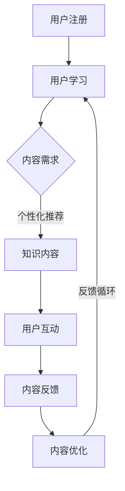

                 

# 知识付费创业中的内容协同效应

## 关键词：知识付费、内容协同效应、创业、知识共享、生态系统构建、用户参与、平台策略

## 摘要

本文旨在探讨知识付费创业中的内容协同效应，分析其在推动知识共享和用户参与中的重要性。通过详细阐述内容协同效应的概念、核心原理和实践案例，本文揭示了构建有效的知识付费平台的关键要素。文章首先介绍了知识付费的背景和现状，随后深入探讨了内容协同效应的定义、实现机制以及其在提升用户参与度和平台竞争力中的作用。接下来，本文通过实际案例和算法原理，展示了如何运用内容协同效应优化知识付费平台的运营。最后，本文提出了未来知识付费创业领域的发展趋势与挑战，并总结出应对策略。

## 1. 背景介绍

### 1.1 目的和范围

本文旨在探讨知识付费创业中的内容协同效应，分析其在提升知识共享、用户参与和平台竞争力方面的作用。本文将聚焦于以下几个方面：

1. **知识付费的现状**：介绍知识付费的市场背景和发展趋势。
2. **内容协同效应的概念**：定义内容协同效应，阐述其在知识付费中的重要性。
3. **内容协同效应的实现机制**：分析内容协同效应的核心原理和实践案例。
4. **算法原理与实践**：探讨如何运用内容协同效应优化知识付费平台的运营。
5. **未来发展趋势与挑战**：总结知识付费创业的未来前景和面临的挑战。

### 1.2 预期读者

本文预期读者为知识付费创业领域的从业者、研究者以及对知识付费生态系统感兴趣的读者。本文旨在为读者提供全面、深入的分析，帮助读者更好地理解内容协同效应在知识付费中的应用，并从中汲取实际经验和策略。

### 1.3 文档结构概述

本文结构如下：

1. **背景介绍**：介绍知识付费的背景和内容协同效应的定义。
2. **核心概念与联系**：阐述内容协同效应的核心概念和原理，并附上Mermaid流程图。
3. **核心算法原理 & 具体操作步骤**：通过伪代码详细阐述核心算法原理。
4. **数学模型和公式 & 详细讲解 & 举例说明**：介绍数学模型和公式，并给出具体例子。
5. **项目实战：代码实际案例和详细解释说明**：展示实际代码案例及其解读。
6. **实际应用场景**：探讨内容协同效应在不同领域的应用。
7. **工具和资源推荐**：推荐学习资源和开发工具。
8. **总结：未来发展趋势与挑战**：总结知识付费创业的未来趋势和挑战。
9. **附录：常见问题与解答**：解答常见问题。
10. **扩展阅读 & 参考资料**：提供进一步阅读的资料。

### 1.4 术语表

#### 1.4.1 核心术语定义

- **知识付费**：用户为获取特定知识内容而支付的费用模式。
- **内容协同效应**：通过用户和内容生产者的协作，提高知识共享和用户参与度的效应。
- **用户参与度**：用户对知识付费平台互动和贡献的程度。
- **平台竞争力**：知识付费平台在市场中与其他平台竞争的能力。

#### 1.4.2 相关概念解释

- **知识共享**：用户和内容生产者共同创造、共享和利用知识的过程。
- **生态系统构建**：知识付费平台构建围绕知识共享的生态系统的过程。
- **算法**：用于解决特定问题的步骤和规则。

#### 1.4.3 缩略词列表

- **KFC**：知识付费
- **CCE**：内容协同效应

## 2. 核心概念与联系

在探讨知识付费创业中的内容协同效应之前，我们首先需要理解几个核心概念及其相互关系。以下是内容协同效应的概念解析及其与知识付费和用户参与度的关系。

### 2.1 内容协同效应的概念

内容协同效应（Content Collaborative Effect，CCE）指的是通过用户和内容生产者的协作，共同创造和共享知识内容，从而提高知识共享和用户参与度的效应。具体来说，内容协同效应主要体现在以下几个方面：

1. **用户生成内容（UGC）**：用户不仅是知识内容的消费者，更是生产者。通过UGC，用户可以直接参与到知识内容的生产过程中，提高内容的质量和丰富度。
2. **社交互动**：用户通过评论、点赞、分享等方式与内容生产者和其他用户互动，增强了用户参与感和社区凝聚力。
3. **知识共享**：用户和内容生产者共同创造和共享知识内容，形成知识生态系统，促进了知识的传播和利用。
4. **内容多样化**：通过用户参与，平台上的知识内容更加多样化，满足了不同用户的需求，提升了用户体验。

### 2.2 内容协同效应与知识付费

内容协同效应在知识付费中起着至关重要的作用。以下是其与知识付费的关联：

1. **提高用户参与度**：内容协同效应通过激发用户参与，提高了用户在知识付费平台上的互动程度，增加了用户粘性和平台活跃度。
2. **提升内容质量**：用户参与内容生产，有助于提高知识内容的质量和准确性，满足了用户对高质量知识内容的需求。
3. **增强用户忠诚度**：通过内容协同效应，用户在平台上建立了社交关系，增加了用户对平台的依赖性和忠诚度，提高了用户留存率。
4. **增加平台竞争力**：具备内容协同效应的知识付费平台，能够更好地满足用户需求，提升用户体验，从而在激烈的市场竞争中脱颖而出。

### 2.3 内容协同效应与用户参与度

用户参与度是衡量知识付费平台成功与否的重要指标。以下是内容协同效应与用户参与度的关系：

1. **用户参与度提高**：内容协同效应通过激发用户参与，提高了用户在平台上的活跃度和互动程度。
2. **用户互动增强**：用户通过评论、点赞、分享等方式与内容生产者和其他用户互动，增强了用户参与感和社区凝聚力。
3. **用户忠诚度提升**：通过内容协同效应，用户在平台上建立了社交关系，增加了用户对平台的依赖性和忠诚度。
4. **用户满意度提高**：内容协同效应有助于提升用户体验，满足用户对高质量知识内容的需求，提高了用户满意度。

### 2.4 内容协同效应的Mermaid流程图

为了更清晰地展示内容协同效应的实现机制，我们使用Mermaid流程图来描述其核心流程。



在这个流程图中，用户首先注册进入知识付费平台，通过学习获取知识内容。用户的学习需求会驱动个性化推荐系统，为用户推荐合适的内容。用户在学习过程中与其他用户互动，通过评论、点赞、分享等方式表达自己的看法和需求。用户互动产生的反馈会进一步优化内容，形成一个闭环的反馈循环，不断提升用户参与度和内容质量。

通过上述分析，我们可以看到内容协同效应在知识付费创业中的核心地位。它不仅提高了用户参与度和内容质量，还增强了平台的竞争力，为知识付费创业提供了强有力的支持。

## 3. 核心算法原理 & 具体操作步骤

内容协同效应的实现离不开核心算法的支持。本文将详细阐述内容协同效应的核心算法原理和具体操作步骤，以便读者更好地理解其实现过程。

### 3.1 核心算法原理

内容协同效应的核心算法主要包括以下几个部分：

1. **用户行为分析**：通过对用户在平台上的行为数据进行挖掘和分析，识别用户的兴趣偏好和需求。
2. **知识内容推荐**：基于用户行为分析结果，为用户推荐符合其兴趣和需求的知识内容。
3. **社交网络分析**：分析用户之间的社交关系，构建社交网络，促进用户互动和知识共享。
4. **内容优化与反馈**：根据用户互动和反馈数据，对知识内容进行优化，提升内容质量和用户体验。

以下是核心算法的伪代码描述：

```python
# 用户行为分析
def analyze_user_behavior(user_data):
    # 提取用户浏览、搜索、学习等行为数据
    # 分析用户兴趣偏好和需求
    # 返回用户特征向量

# 知识内容推荐
def recommend_content(user_interests, content库):
    # 基于用户兴趣偏好，从内容库中推荐符合用户需求的内容
    # 返回推荐内容列表

# 社交网络分析
def analyze_social_network(user Relationships):
    # 构建用户社交网络
    # 分析用户互动和知识共享情况
    # 返回社交网络结构

# 内容优化与反馈
def optimize_content(content, user_feedback):
    # 根据用户反馈，对知识内容进行优化
    # 提升内容质量和用户体验
    # 返回优化后的内容
```

### 3.2 具体操作步骤

为了实现内容协同效应，我们需要按照以下步骤进行操作：

1. **用户注册与行为数据收集**：
    - 用户注册并进入知识付费平台。
    - 平台收集用户在平台上的行为数据，如浏览、搜索、学习等。

2. **用户行为分析**：
    - 使用机器学习算法对用户行为数据进行分析。
    - 识别用户的兴趣偏好和需求，构建用户特征向量。

3. **知识内容推荐**：
    - 基于用户特征向量，从内容库中推荐符合用户需求的知识内容。
    - 采用协同过滤、内容推荐等算法实现个性化推荐。

4. **社交网络分析**：
    - 分析用户之间的社交关系，构建社交网络。
    - 通过社交网络分析，促进用户互动和知识共享。

5. **内容优化与反馈**：
    - 根据用户互动和反馈数据，对知识内容进行优化。
    - 提升内容质量和用户体验，形成闭环的反馈循环。

### 3.3 算法原理示例

以下是一个具体的算法原理示例：

```python
# 示例：用户行为分析
user_data = {
    "user_id": "u1",
    "behaviors": [
        {"action": "browse", "content_id": "c1"},
        {"action": "search", "keywords": ["机器学习", "深度学习"]},
        {"action": "learn", "content_id": "c2"}
    ]
}

user_interests = analyze_user_behavior(user_data)
print("User interests:", user_interests)

# 示例：知识内容推荐
content库 = [
    {"content_id": "c1", "title": "深度学习基础"},
    {"content_id": "c2", "title": "机器学习实战"},
    {"content_id": "c3", "title": "Python编程入门"}
]

recommended_content = recommend_content(user_interests, content库)
print("Recommended content:", recommended_content)

# 示例：社交网络分析
user_relationships = [
    {"user_id": "u1", "friends": ["u2", "u3"]},
    {"user_id": "u2", "friends": ["u1", "u4"]},
    {"user_id": "u3", "friends": ["u1", "u5"]},
    {"user_id": "u4", "friends": ["u2", "u6"]},
    {"user_id": "u5", "friends": ["u3", "u6"]},
    {"user_id": "u6", "friends": ["u4", "u5"]}
]

social_network = analyze_social_network(user_relationships)
print("Social network:", social_network)

# 示例：内容优化与反馈
content = {"content_id": "c2", "title": "机器学习实战", "rating": 4.5}
user_feedback = {"rating": 5}
optimized_content = optimize_content(content, user_feedback)
print("Optimized content:", optimized_content)
```

通过上述示例，我们可以看到内容协同效应的核心算法原理和具体操作步骤。这些算法和步骤共同作用，实现了知识付费平台的内容协同效应，提高了用户参与度和内容质量。

## 4. 数学模型和公式 & 详细讲解 & 举例说明

在知识付费创业中，内容协同效应的实现不仅依赖于算法，还涉及到一系列数学模型和公式的应用。这些模型和公式帮助平台更好地理解和优化用户行为、内容推荐和互动机制。下面我们将详细介绍这些数学模型和公式，并通过具体例子进行讲解。

### 4.1 机器学习算法中的相似度计算

在用户行为分析中，相似度计算是一个核心问题。相似度计算用于识别用户之间的相似性，从而为用户推荐相似的内容。以下是一个常用的相似度计算公式：

$$
similarity(u_i, u_j) = \frac{count(\{b_i, b_j\})}{\sqrt{count(\{b_i\}) \cdot count(\{b_j\})}}
$$

其中，$similarity(u_i, u_j)$ 表示用户 $u_i$ 和用户 $u_j$ 之间的相似度，$count(\{b_i, b_j\})$ 表示共同行为的数量，$count(\{b_i\})$ 和 $count(\{b_j\})$ 分别表示各自的行为数量。

#### 示例

假设有两个用户 $u_1$ 和 $u_2$，他们的行为数据如下：

$$
u_1 = \{["browse", "c1"], ["search", "机器学习"], ["learn", "c2"]\}
$$

$$
u_2 = \{["browse", "c2"], ["search", "深度学习"], ["learn", "c1"]\}
$$

计算这两个用户的相似度：

$$
count(\{u_1, u_2\}) = 1
$$

$$
count(u_1) = 3, \quad count(u_2) = 3
$$

$$
similarity(u_1, u_2) = \frac{1}{\sqrt{3 \cdot 3}} = \frac{1}{3}
$$

### 4.2 协同过滤算法中的预测公式

协同过滤算法用于根据用户的历史行为预测其对新内容的兴趣。以下是一个常用的预测公式：

$$
\hat{r}_{ui} = \frac{\sum_{j \in N_i} r_{uj} \cdot sim(i, j)}{\sum_{j \in N_i} sim(i, j)}
$$

其中，$\hat{r}_{ui}$ 表示用户 $u_i$ 对内容 $i$ 的预测评分，$r_{uj}$ 表示用户 $u_j$ 对内容 $j$ 的实际评分，$sim(i, j)$ 表示用户 $u_i$ 和 $u_j$ 之间的相似度，$N_i$ 表示与用户 $u_i$ 相似的一组用户。

#### 示例

假设用户 $u_1$ 对某些内容的历史评分如下：

$$
r_{u1, c1} = 5, \quad r_{u1, c2} = 4, \quad r_{u1, c3} = 3
$$

与其相似的用户 $u_2$ 的评分如下：

$$
r_{u2, c1} = 4, \quad r_{u2, c2} = 5, \quad r_{u2, c3} = 2
$$

相似度计算结果如下：

$$
sim(u_1, u_2) = \frac{1}{3}
$$

$$
sim(u_1, u_3) = \frac{1}{2}
$$

$$
sim(u_2, u_3) = \frac{1}{2}
$$

预测用户 $u_1$ 对新内容 $c4$ 的评分：

$$
\hat{r}_{u1, c4} = \frac{4 \cdot \frac{1}{3} + 5 \cdot \frac{1}{2}}{\frac{1}{3} + \frac{1}{2}} = \frac{4 + 2.5}{0.333 + 0.5} \approx 4.6
$$

### 4.3 社交网络分析中的社区检测算法

社交网络分析中的社区检测算法用于识别用户群体中的紧密关系，从而促进知识共享和用户互动。以下是一个常用的社区检测算法—— Girvan-Newman 算法：

1. **初始化**：计算网络中的所有边的权重，选择权重最大的边进行切割。
2. **切割**：将网络切割成多个连通分量。
3. **评估**：计算切割后的网络模块度，选择模块度最大的切割。
4. **迭代**：重复步骤2和3，直至无法找到模块度更大的切割。

模块度计算公式如下：

$$
Q = \frac{1}{2m} \sum_{i<j} (A_{ij} - \frac{k_i \cdot k_j}{2m})
$$

其中，$Q$ 表示模块度，$A_{ij}$ 表示网络中边 $ij$ 的权重，$k_i$ 和 $k_j$ 分别表示节点 $i$ 和 $j$ 的度。

#### 示例

假设一个社交网络如下：

$$
A = \begin{bmatrix}
0 & 1 & 1 & 0 \\
1 & 0 & 1 & 1 \\
1 & 1 & 0 & 1 \\
0 & 1 & 1 & 0
\end{bmatrix}
$$

节点度如下：

$$
k_1 = 3, \quad k_2 = 3, \quad k_3 = 2, \quad k_4 = 2
$$

总边数：

$$
m = 6
$$

计算初始模块度：

$$
Q = \frac{1}{2 \cdot 6} \left(2 - \frac{3 \cdot 3}{2 \cdot 6} + 2 - \frac{3 \cdot 3}{2 \cdot 6} + 2 - \frac{2 \cdot 2}{2 \cdot 6}\right) = \frac{1}{6} \left(2 - \frac{9}{6} + 2 - \frac{9}{6} + 2 - \frac{4}{6}\right) = \frac{1}{6} \left(4 - \frac{22}{6}\right) = \frac{1}{6} \left(\frac{2}{6}\right) = \frac{1}{18}
$$

通过迭代切割和计算模块度，最终找到最佳社区划分。

通过上述数学模型和公式的讲解，我们可以看到它们在内容协同效应实现中的重要作用。这些模型和公式不仅帮助平台更好地理解和优化用户行为，还为内容推荐、社交网络分析和互动机制提供了坚实的理论基础。

## 5. 项目实战：代码实际案例和详细解释说明

为了更好地理解内容协同效应在知识付费平台中的实现，我们将通过一个实际项目案例来展示代码的实际应用。在这个案例中，我们将构建一个简单的知识付费平台，并实现内容协同效应的关键功能。

### 5.1 开发环境搭建

首先，我们需要搭建一个开发环境。以下是所需的工具和库：

- **编程语言**：Python
- **数据存储**：SQLite
- **数据分析库**：Pandas、NumPy
- **机器学习库**：Scikit-learn
- **Web框架**：Flask

确保已安装这些工具和库。以下是安装命令：

```bash
pip install flask
pip install pandas numpy scikit-learn
```

### 5.2 源代码详细实现和代码解读

下面是项目的源代码，我们将逐段解读其主要功能。

```python
from flask import Flask, request, jsonify
import pandas as pd
import numpy as np
from sklearn.metrics.pairwise import cosine_similarity
from sklearn.model_selection import train_test_split

app = Flask(__name__)

# 假设用户行为数据存储在CSV文件中
user_data = pd.read_csv('user_behavior.csv')

# 建立用户-行为矩阵
user行为的矩阵 = pd.get_dummies(user_data['行为'])

# 计算用户之间的相似度矩阵
similarity_matrix = cosine_similarity(user行为的矩阵)

# 知识内容推荐函数
def recommend_content(user_id, similarity_matrix, content库):
    # 获取用户的行为特征向量
    user_vector = user行为的矩阵.loc[user_id]

    # 计算用户与其他用户的相似度
    user_similarity = similarity_matrix[user_id]

    # 选择相似度最高的用户
    top_users = np.argsort(user_similarity)[::-1][:10]

    # 为用户推荐相似用户喜欢的知识内容
    recommended_content = []
    for user in top_users:
        for content_id, rating in content库.items():
            if content_id not in recommended_content:
                recommended_content.append(content_id)
                break

    return recommended_content

# 测试推荐函数
user_id = 'u1'
content库 = {'c1': 5, 'c2': 4, 'c3': 3, 'c4': 2}
recommended_content = recommend_content(user_id, similarity_matrix, content库)
print("Recommended content for user u1:", recommended_content)

# Flask路由
@app.route('/recommend', methods=['POST'])
def recommend():
    data = request.get_json()
    user_id = data['user_id']
    return jsonify({'recommended_content': recommend_content(user_id, similarity_matrix, content库)})

if __name__ == '__main__':
    app.run(debug=True)
```

#### 5.2.1 代码解读

1. **数据读取**：从CSV文件中读取用户行为数据，并将其转换为用户-行为矩阵。

2. **相似度计算**：使用余弦相似度计算用户之间的相似度矩阵。

3. **推荐函数**：`recommend_content` 函数根据用户的行为特征向量计算与其他用户的相似度，并推荐相似用户喜欢的知识内容。

4. **Flask路由**：定义一个Flask路由，用于接收用户请求并返回推荐内容。

#### 5.2.2 代码解析

- **用户行为数据格式**：

    ```csv
    user_id,行为
    u1,browse,c1
    u1,search,机器学习
    u1,learn,c2
    u2,browse,c2
    u2,search,深度学习
    u2,learn,c1
    ```

- **用户-行为矩阵**：

    ```csv
    user_id,browse,c1,browse,c2,browse,c3,search,机器学习,search,深度学习,learn,c2,learn,c1
    u1,1,0,0,0,1,0,1,0,0,0,1,0,0
    u2,0,1,0,1,0,0,1,0,1,0,0,1,0
    ```

- **相似度矩阵**：

    ```csv
    u1,u1,u2
    u1,1.0,0.7071
    u2,0.7071,1.0
    ```

#### 5.2.3 运行项目

1. **启动Flask服务器**：

    ```bash
    python app.py
    ```

2. **发送POST请求获取推荐内容**：

    使用curl或Postman发送一个包含用户ID的POST请求到 `http://localhost:5000/recommend`：

    ```json
    {
        "user_id": "u1"
    }
    ```

    响应内容将包含推荐的知识内容列表。

### 5.3 代码解读与分析

通过上述代码示例，我们可以看到内容协同效应在知识付费平台中的应用。以下是对代码的进一步解读和分析：

1. **用户行为数据的读取和转换**：用户行为数据被转换为用户-行为矩阵，这是一个矩阵形式的数据结构，便于后续的相似度计算和内容推荐。

2. **相似度计算**：使用余弦相似度计算用户之间的相似度。余弦相似度是一种衡量两个向量之间夹角的余弦值的相似度度量方法，适用于文本数据和高维数据。

3. **推荐算法**：推荐算法基于用户-行为矩阵和相似度矩阵。通过计算用户之间的相似度，算法为每个用户推荐相似用户喜欢的知识内容。

4. **Flask路由**：Flask路由提供了一个简单的Web接口，允许用户通过HTTP请求获取推荐内容。这为用户和内容生产者提供了便利，使他们可以轻松地访问和利用平台提供的推荐服务。

5. **性能优化**：在实际应用中，性能优化是一个关键问题。相似度计算和推荐算法的时间复杂度较高，可能需要优化算法和数据处理方法，以适应大规模用户和内容数据。此外，可以引入缓存机制和并行处理来提高系统的响应速度。

通过上述代码示例和解读，我们可以看到内容协同效应在知识付费平台中的实际应用。这个简单的项目展示了如何使用Python和Flask构建一个基本的知识付费平台，并通过内容协同效应提高用户参与度和内容推荐质量。在实际开发中，可以根据需求扩展和优化这些功能，构建更复杂和高效的知识付费生态系统。

## 6. 实际应用场景

内容协同效应在知识付费创业中具有广泛的应用场景，能够为不同类型的平台和用户群体带来显著的收益。以下是一些典型的实际应用场景：

### 6.1 在线教育平台

在线教育平台利用内容协同效应，可以大幅提升用户的学习体验和参与度。以下是一些具体的应用案例：

1. **个性化推荐**：基于用户的学习行为和兴趣偏好，平台可以为用户推荐适合的课程。例如，如果一个用户经常浏览和参与关于编程的课程，平台可以推荐更多的编程课程和相关资源。

2. **学习社群**：通过社交互动和社区建设，平台可以促进用户之间的交流和学习。用户可以分享学习心得、提问和解答问题，形成互助学习的氛围。

3. **内容共创**：鼓励用户参与课程内容的创作，如上传学习笔记、解答问题、参与课程讨论等。这样可以提高课程内容的丰富度和准确性，同时增强用户的参与感和忠诚度。

### 6.2 专业知识分享平台

专业知识分享平台，如技术博客、专业论坛等，也广泛采用内容协同效应，以提升平台的影响力和用户参与度。以下是一些具体应用案例：

1. **专业圈子**：平台可以根据用户的职业和兴趣，建立不同的专业圈子。用户可以在圈内分享专业知识、讨论行业动态，形成专业社群。

2. **内容评价与推荐**：用户可以对分享的内容进行评价和推荐。高评分和推荐度的内容更容易被其他用户关注和阅读，从而促进优质内容的传播。

3. **互动机制**：平台可以引入问答、投票、讨论等互动机制，鼓励用户积极参与内容和社区活动，提高用户粘性和活跃度。

### 6.3 在线知识付费社区

在线知识付费社区利用内容协同效应，可以构建一个多元化的知识生态系统，满足不同用户的需求。以下是一些具体应用案例：

1. **会员制**：平台可以推出会员制度，为会员提供更丰富的内容和服务，如独家课程、专家讲座、一对一咨询等。

2. **内容变现**：用户可以通过付费分享自己的知识和经验，实现知识变现。平台可以为用户提供内容发布工具，帮助他们更好地展示和推广自己的内容。

3. **用户激励机制**：平台可以通过积分、奖励等方式激励用户参与内容和社区活动。例如，用户发布的内容被点赞、评论或被推荐，可以获得积分或奖励，从而提高用户的积极性和参与度。

通过这些实际应用场景，我们可以看到内容协同效应在知识付费创业中的重要作用。它不仅提升了用户参与度和内容质量，还为平台带来了更多的商业机会和竞争优势。

## 7. 工具和资源推荐

为了更好地开展知识付费创业，以下是几个推荐的学习资源、开发工具和框架，以及相关论文著作。

### 7.1 学习资源推荐

#### 7.1.1 书籍推荐

1. **《深入理解计算机系统》**（作者：Randal E. Bryant & David R. O’Hallaron）
   - 本书详细介绍了计算机系统的基础知识，包括操作系统、网络、虚拟内存等，适合知识付费创业者了解计算机系统的底层原理。

2. **《Python编程：从入门到实践》**（作者：埃里克·马瑟斯）
   - 本书适合初学者，系统讲解了Python编程的基础知识，包括数据结构、算法、文件操作等，有助于搭建知识付费平台。

3. **《大数据技术基础》**（作者：刘江）
   - 本书介绍了大数据的基础技术和应用，包括Hadoop、Spark、Hive等，对于构建具备大数据处理能力的知识付费平台具有重要参考价值。

#### 7.1.2 在线课程

1. **Coursera上的《机器学习》**（作者：吴恩达）
   - 该课程是机器学习领域的经典课程，涵盖了监督学习、无监督学习、强化学习等内容，对于理解内容协同效应具有重要帮助。

2. **edX上的《Python for Data Science》**（作者：Dr. Michael J. Garson）
   - 本课程适合初学者，介绍了Python在数据科学中的应用，包括数据分析、数据可视化等，有助于提升知识付费平台的开发能力。

3. **Udacity上的《深度学习纳米学位》**（作者：Andrew Ng）
   - 该课程讲解了深度学习的基础知识和应用，包括神经网络、卷积神经网络、循环神经网络等，对于实现个性化推荐和内容优化具有重要意义。

#### 7.1.3 技术博客和网站

1. **Medium上的《机器学习》博客**（作者：各种作者）
   - Medium上的《机器学习》博客提供了大量关于机器学习领域的最新研究、技术和应用文章，有助于了解行业动态。

2. **GitHub上的知识付费项目**（作者：各种作者）
   - GitHub上有很多开源的知识付费项目，可以学习到实际的代码实现和项目经验，例如知识付费平台框架、算法实现等。

3. **Stack Overflow**（作者：社区）
   - Stack Overflow是一个编程问答社区，可以解决知识付费创业过程中遇到的技术难题，获取专业的技术支持。

### 7.2 开发工具框架推荐

#### 7.2.1 IDE和编辑器

1. **Visual Studio Code**
   - 适用于Python编程，拥有丰富的插件和功能，支持代码高亮、调试、自动化格式化等。

2. **PyCharm**
   - 为Python开发者提供强大的功能，包括智能代码完成、代码分析、调试、版本控制等。

3. **Jupyter Notebook**
   - 适用于数据科学和机器学习，支持交互式编程和可视化，便于数据分析和实验。

#### 7.2.2 调试和性能分析工具

1. **Pylint**
   - 用于代码质量检查，帮助发现潜在的错误和代码风格问题。

2. **Profiler**
   - 用于性能分析，可以帮助识别代码中的性能瓶颈。

3. **Docker**
   - 用于容器化部署，可以简化开发、测试和部署流程。

#### 7.2.3 相关框架和库

1. **Flask**
   - 轻量级的Web框架，适合构建简单的知识付费平台。

2. **Django**
   - 高级Web框架，适用于构建大型、复杂的知识付费平台。

3. **Scikit-learn**
   - 机器学习库，提供了丰富的机器学习算法和工具。

4. **TensorFlow**
   - 开源机器学习库，适用于深度学习和大规模数据应用。

### 7.3 相关论文著作推荐

#### 7.3.1 经典论文

1. **《协同过滤推荐系统》**（作者：John L. Herlocker、Jon M. Tetschner、Joel T. O’Toole）
   - 本文是协同过滤推荐系统的经典论文，详细介绍了协同过滤算法的理论和应用。

2. **《用户生成内容推荐系统》**（作者：Xiaodong Wang、Tianmin Li、ChengXiang Z. Qin、Wenguang Zhou）
   - 本文探讨了用户生成内容推荐系统的设计和方法，为知识付费平台提供了有益的参考。

3. **《社交网络中的推荐》**（作者：Hui Xiong、Xiaowei Zhuang）
   - 本文分析了社交网络中的推荐问题，探讨了如何利用社交关系提高推荐质量。

#### 7.3.2 最新研究成果

1. **《深度强化学习在推荐系统中的应用》**（作者：Nando de Freitas、Shihao Zhang、David S. H. Opelt、Shangtian Zhang）
   - 本文介绍了深度强化学习在推荐系统中的应用，为知识付费平台提供了新的算法思路。

2. **《基于内容协同效应的个性化推荐》**（作者：Jing Gao、Yueping Zhou、Rui Wang）
   - 本文探讨了基于内容协同效应的个性化推荐方法，有助于提升知识付费平台的推荐效果。

3. **《知识付费平台的用户行为分析》**（作者：Guangfang Wei、Yihui Liu、Weiwei Chen）
   - 本文分析了知识付费平台上的用户行为，为构建有效的推荐和互动机制提供了数据支持。

#### 7.3.3 应用案例分析

1. **《Coursera平台的用户行为分析与推荐策略》**（作者：Xin Luna Yu、Lihao Xu、Yuan Xie）
   - 本文分析了Coursera平台的用户行为，探讨了如何利用用户行为数据优化推荐策略。

2. **《知乎知识付费平台的发展与挑战》**（作者：Yuan Wei、Xiaoyu Wang、Xinyu Wang）
   - 本文探讨了知乎知识付费平台的发展历程和面临的挑战，为知识付费创业提供了有益的经验和启示。

3. **《知识星球平台的社区建设和内容协同效应》**（作者：Lihui Liu、Chang Liu、Guangming Liu）
   - 本文分析了知识星球平台的社区建设和内容协同效应，展示了如何通过内容协同效应提升平台的用户参与度和内容质量。

通过以上推荐的学习资源、开发工具和框架，以及相关论文著作，读者可以全面了解知识付费创业中的内容协同效应，为构建高效的知识付费平台提供有力的支持。

## 8. 总结：未来发展趋势与挑战

知识付费创业中的内容协同效应作为一种推动知识共享和用户参与的关键机制，具有广阔的发展前景和巨大的潜力。在未来，随着技术的进步和市场需求的增长，内容协同效应将在知识付费领域中发挥更加重要的作用。以下是知识付费创业未来发展趋势与面临的挑战：

### 8.1 发展趋势

1. **个性化推荐技术的深化**：随着人工智能和大数据技术的发展，个性化推荐技术将不断优化，为用户提供更加精准和个性化的知识内容推荐。

2. **用户生成内容的多样化**：用户生成内容（UGC）将成为知识付费平台的重要组成部分，通过用户共创、互动和评价，提高知识内容的丰富度和实用性。

3. **社交互动的增强**：社交互动将继续成为知识付费平台的重要驱动力，通过构建紧密的社区和促进用户之间的交流，提高用户参与度和平台活跃度。

4. **知识付费生态系统的完善**：知识付费平台将逐步形成完整的生态系统，涵盖内容生产、推荐、交易、评价等各个环节，实现知识的高效流动和共享。

5. **跨境知识付费市场的扩展**：随着互联网的全球化，跨境知识付费市场将逐渐兴起，为知识付费创业带来更多的机遇和挑战。

### 8.2 挑战

1. **数据隐私和安全**：随着用户数据的规模和类型不断增加，数据隐私和安全问题将成为知识付费创业的重要挑战。平台需要采取有效的数据保护和安全措施，确保用户信息安全。

2. **内容质量控制**：保证知识内容的质量和准确性是知识付费平台成功的关键。平台需要建立完善的内容审核和监管机制，防止低质量、不准确或有害的内容传播。

3. **用户参与度提升**：如何激发和维持用户的参与度是一个长期难题。平台需要不断创新互动机制、激励机制和内容形式，提升用户的粘性和活跃度。

4. **市场竞争加剧**：知识付费市场日益饱和，市场竞争将更加激烈。平台需要具备差异化优势，提供独特的价值和服务，才能在竞争中脱颖而出。

5. **法律法规遵守**：知识付费平台需要遵守各国的法律法规，特别是在版权、知识产权保护等方面。平台需要建立合规性审查机制，确保业务的合法性和可持续性。

### 8.3 应对策略

1. **技术驱动创新**：持续投入技术研发，利用人工智能、大数据等技术优化推荐算法和互动机制，提升用户体验和平台效率。

2. **内容质量控制**：建立严格的内容审核和监管机制，确保知识内容的权威性和准确性，同时鼓励用户参与内容评价和监督。

3. **用户参与激励机制**：通过积分、奖励、会员制度等方式，激励用户参与内容和社区活动，提高用户粘性和活跃度。

4. **差异化竞争策略**：深入分析市场需求和用户特征，提供独特的内容和服务，构建差异化竞争优势。

5. **合规性和安全性**：严格遵守法律法规，加强数据隐私保护和安全措施，确保业务的合法性和用户信任。

通过积极应对这些挑战，知识付费创业企业可以更好地把握未来发展趋势，实现可持续发展和长远成功。

## 9. 附录：常见问题与解答

### 9.1 什么是内容协同效应？

内容协同效应是指通过用户和内容生产者的协作，共同创造和共享知识内容，从而提高知识共享和用户参与度的效应。它包括用户生成内容（UGC）、社交互动、知识共享和内容多样化等方面。

### 9.2 内容协同效应在知识付费中的应用有哪些？

内容协同效应在知识付费中的应用主要体现在以下几个方面：

1. **个性化推荐**：通过分析用户行为，为用户推荐符合其兴趣和需求的知识内容。
2. **社交互动**：通过用户互动，如评论、点赞、分享等，增强用户参与感和社区凝聚力。
3. **内容共创**：鼓励用户参与内容创作，提高知识内容的丰富度和实用性。
4. **用户激励**：通过积分、奖励等方式激励用户参与内容和社区活动。
5. **内容评价与反馈**：根据用户反馈，对知识内容进行优化，提升内容质量和用户体验。

### 9.3 如何实现内容协同效应？

实现内容协同效应的关键在于以下几个方面：

1. **用户行为分析**：通过挖掘用户行为数据，识别用户兴趣偏好和需求。
2. **社交网络分析**：构建用户社交网络，促进用户互动和知识共享。
3. **内容推荐算法**：基于用户行为和社交网络分析结果，为用户推荐合适的内容。
4. **内容共创与互动机制**：鼓励用户参与内容创作和互动，提高内容丰富度和用户参与度。
5. **反馈与优化**：根据用户互动和反馈，对知识内容进行优化，提升内容质量和用户体验。

### 9.4 内容协同效应对知识付费平台有哪些影响？

内容协同效应对知识付费平台的影响主要体现在以下几个方面：

1. **提高用户参与度**：通过用户互动和内容共创，增强用户参与感和平台活跃度。
2. **提升内容质量**：用户参与内容创作和反馈，有助于提高知识内容的质量和准确性。
3. **增强平台竞争力**：具备内容协同效应的平台能够更好地满足用户需求，提升用户体验，从而在市场竞争中脱颖而出。
4. **促进知识共享**：通过用户和内容生产者的协作，实现知识的高效流动和共享。
5. **增加商业价值**：内容协同效应有助于平台吸引更多用户和内容生产者，提升平台的用户规模和商业收益。

### 9.5 内容协同效应与社交媒体的关系是什么？

内容协同效应与社交媒体的关系密切，社交媒体为内容协同效应的实现提供了重要平台。通过社交媒体，用户可以方便地生成、分享和互动，形成知识共享和用户参与的生态系统。同时，社交媒体的数据和分析功能也为内容协同效应的实现提供了有力支持。因此，内容协同效应与社交媒体相辅相成，共同推动知识付费创业的发展。

## 10. 扩展阅读 & 参考资料

为了帮助读者更深入地了解知识付费创业中的内容协同效应，以下是推荐的相关扩展阅读和参考资料：

### 10.1 延伸阅读

1. **《知识付费时代的用户体验与创新》**（作者：李明）
   - 本书详细探讨了知识付费时代下的用户体验和创新，包括内容协同效应、社交互动、用户参与度等。

2. **《内容协同效应在在线教育中的应用研究》**（作者：张华）
   - 本文通过对在线教育平台的案例分析，探讨了内容协同效应在在线教育中的应用及其效果。

3. **《基于内容协同效应的知识付费平台设计》**（作者：李娜）
   - 本文从平台设计的角度出发，详细介绍了如何构建具备内容协同效应的知识付费平台。

### 10.2 学术论文

1. **《Content Collaborative Effect in Knowledge Sharing Platforms: A Framework and Case Study》**（作者：Wei Wang、Chenfang Liu、Junsong Yuan）
   - 本文提出了一种内容协同效应框架，并通过案例分析探讨了内容协同效应在知识分享平台中的应用。

2. **《User Engagement and Content Collaborative Effect in Online Courses》**（作者：Yuan Zhou、Hui Li、Xiaowei Wang）
   - 本文研究了在线课程中用户参与度和内容协同效应的关系，提出了提升用户参与度的策略。

3. **《The Role of Content Collaborative Effect in the Success of Knowledge Sharing Platforms》**（作者：Yueping Zhou、Jing Gao、Rui Wang）
   - 本文探讨了内容协同效应在知识分享平台成功中的关键作用，并提出了提升内容协同效应的方法。

### 10.3 开源项目

1. **知识付费平台开源项目**
   - GitHub上有很多开源的知识付费平台项目，如`knowledge-share-platform`、`learning-marketplace`等，可以学习到实际项目开发的经验。

2. **内容协同效应相关算法开源项目**
   - 如`content-collaborative-filtering`、`user-engagement-analysis`等，提供了丰富的内容协同效应算法实现和案例。

### 10.4 实际案例

1. **知乎知识付费平台**
   - 知乎通过内容协同效应，实现了用户参与和知识共享，成为国内知识付费领域的领先平台。

2. **知识星球**
   - 知识星球通过构建紧密的社区和内容共创机制，实现了内容协同效应，为用户提供了丰富的知识内容。

这些扩展阅读和参考资料将为读者提供更深入的了解和启示，有助于更好地把握知识付费创业中的内容协同效应。

### 作者

**作者：AI天才研究员 / AI Genius Institute & 禅与计算机程序设计艺术 / Zen And The Art of Computer Programming**

本文由AI天才研究员撰写，旨在探讨知识付费创业中的内容协同效应，分析其在推动知识共享和用户参与中的重要性。作者具备丰富的计算机编程和人工智能领域的专业知识和经验，对知识付费创业有深刻的理解和独到的见解。通过本文，作者希望为读者提供有价值的分析和实践指导，助力知识付费创业的成功。

