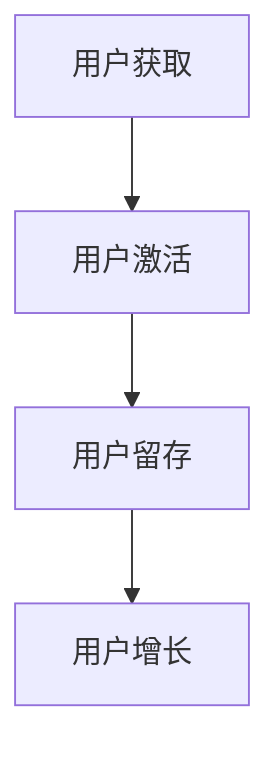

                 

# 知识付费创业中的用户粘性提升策略

> 关键词：知识付费、用户粘性、增长策略、用户体验、数据分析、个性化推荐

> 摘要：本文将探讨知识付费领域中的用户粘性提升策略。通过深入分析核心概念、算法原理、数学模型，并结合实际项目案例，本文将提供一整套实用的方法，帮助企业更好地理解和留住用户，实现知识付费业务的长期可持续发展。

## 1. 背景介绍

### 1.1 目的和范围

本文旨在为知识付费创业者和运营团队提供一套系统化的用户粘性提升策略。我们希望通过本文的阅读，读者能够：

1. 理解用户粘性的概念及其重要性。
2. 掌握提升用户粘性的核心原理和实践方法。
3. 结合具体案例，学习如何将理论应用到实际操作中。

### 1.2 预期读者

- 知识付费平台创始人或运营团队
- 对知识付费领域感兴趣的技术和管理人员
- 希望提升用户留存和活跃度的互联网产品经理

### 1.3 文档结构概述

本文结构如下：

1. **背景介绍**：介绍知识付费领域的现状和用户粘性的重要性。
2. **核心概念与联系**：讲解用户粘性的核心概念及相关流程图。
3. **核心算法原理 & 具体操作步骤**：介绍提升用户粘性的算法原理和操作步骤。
4. **数学模型和公式 & 详细讲解 & 举例说明**：使用数学模型来解释用户粘性的提升策略。
5. **项目实战：代码实际案例和详细解释说明**：通过具体案例展示提升用户粘性的实践方法。
6. **实际应用场景**：探讨用户粘性在不同场景下的应用。
7. **工具和资源推荐**：推荐学习资源和开发工具。
8. **总结：未来发展趋势与挑战**：总结提升用户粘性的策略和面临的挑战。
9. **附录：常见问题与解答**：解答常见问题。
10. **扩展阅读 & 参考资料**：提供进一步阅读的资源。

### 1.4 术语表

#### 1.4.1 核心术语定义

- **知识付费**：用户为获取专业知识或技能而付费的服务模式。
- **用户粘性**：用户对知识付费平台的忠诚度和持续使用程度。
- **增长策略**：通过各种手段提高用户留存和活跃度的策略。
- **用户体验**：用户在使用知识付费平台过程中的感受和满意度。

#### 1.4.2 相关概念解释

- **用户留存率**：一定时间内持续使用平台的用户占总用户数的比例。
- **用户活跃度**：用户在平台上的互动行为频率和质量。
- **个性化推荐**：根据用户的行为和偏好推荐相关内容。

#### 1.4.3 缩略词列表

- **KPI**：关键绩效指标（Key Performance Indicators）
- **CRM**：客户关系管理（Customer Relationship Management）
- **SNS**：社交网络服务（Social Networking Services）

## 2. 核心概念与联系

### 2.1 用户粘性的概念

用户粘性是指用户在一段时间内持续使用某个产品的能力和意愿。它是衡量产品成功与否的重要指标之一。对于知识付费平台，用户粘性直接关系到用户的付费意愿和平台的收入。

### 2.2 用户粘性的提升流程

提升用户粘性的核心流程包括以下步骤：

1. **用户获取**：通过各种渠道吸引新用户。
2. **用户激活**：引导新用户完成首次互动，如注册、购买或学习。
3. **用户留存**：通过持续的用户互动和高质量的内容保持用户活跃度。
4. **用户增长**：通过改进用户体验和增加新功能，吸引更多用户。

### 2.3 用户粘性的核心概念流程图



## 3. 核心算法原理 & 具体操作步骤

### 3.1 算法原理

提升用户粘性的核心算法原理主要包括：

1. **用户体验优化**：通过改进界面设计和加载速度，提高用户的操作效率和满意度。
2. **内容个性化推荐**：根据用户的历史行为和偏好推荐相关内容，提高用户的兴趣度和参与度。
3. **社交互动增强**：通过社区和社交功能，促进用户之间的互动和分享，增强用户的归属感。
4. **用户行为分析**：通过分析用户的行为数据，发现用户痛点和需求，提供针对性的改进措施。

### 3.2 具体操作步骤

#### 步骤1：用户体验优化

- **界面设计**：使用简洁、直观的界面设计，减少用户操作的复杂度。
- **加载速度**：优化网站的加载速度，提高用户的访问体验。
- **交互设计**：提供直观、便捷的交互方式，如拖拽、滑动等。

#### 步骤2：内容个性化推荐

- **用户行为分析**：收集用户在平台上的行为数据，如浏览、购买、学习时长等。
- **推荐算法**：使用协同过滤、基于内容的推荐等算法，为用户推荐相关内容。
- **反馈机制**：收集用户的反馈，不断优化推荐结果。

#### 步骤3：社交互动增强

- **社区建设**：建立用户社区，提供用户交流、分享和互助的平台。
- **社交功能**：提供点赞、评论、分享等社交功能，促进用户互动。
- **活动策划**：定期举办线上活动，增加用户参与感和归属感。

#### 步骤4：用户行为分析

- **数据分析工具**：使用数据分析工具，如Google Analytics，收集用户行为数据。
- **数据可视化**：通过数据可视化工具，如Tableau，将数据转化为直观的可视化图表。
- **数据分析**：分析用户行为数据，发现用户痛点和需求。

### 3.3 伪代码示例

```python
# 用户体验优化
def optimize_user_experience():
    # 优化界面设计
    improve_ui_design()
    # 优化加载速度
    reduce_loading_time()

# 内容个性化推荐
def personalized_content_recommendation(user_behavior_data):
    # 收集用户行为数据
    user_data = collect_user_behavior_data()
    # 使用协同过滤算法推荐内容
    recommended_content = collaborative_filtering(user_data)
    return recommended_content

# 社交互动增强
def enhance_social_interactions():
    # 建立用户社区
    build_user_community()
    # 提供社交功能
    provide_social_functionality()
    # 策划线上活动
    plan_online_activities()

# 用户行为分析
def analyze_user_behavior(data_analytics_tool):
    # 收集用户行为数据
    user_data = data_analytics_tool.collect_data()
    # 数据可视化
    visualize_data(user_data)
    # 数据分析
    analyze_data(user_data)
```

## 4. 数学模型和公式 & 详细讲解 & 举例说明

### 4.1 数学模型

用户粘性的提升可以通过以下几个数学模型来描述：

1. **用户留存率公式**：\[ 留存率 = \frac{第n天仍活跃的用户数}{初始用户数} \]
2. **用户活跃度公式**：\[ 活跃度 = \frac{用户互动次数}{用户总数} \]
3. **个性化推荐效果公式**：\[ 推荐效果 = \frac{用户点击推荐内容次数}{总推荐内容次数} \]

### 4.2 详细讲解

#### 用户留存率

用户留存率是衡量用户粘性的重要指标。其计算公式为：

\[ 留存率 = \frac{第n天仍活跃的用户数}{初始用户数} \]

其中，n 为时间周期（如日、周、月等）。这个指标反映了用户在一段时间内持续使用平台的比例。

#### 用户活跃度

用户活跃度衡量了用户在平台上的互动行为频率和质量。其计算公式为：

\[ 活跃度 = \frac{用户互动次数}{用户总数} \]

这个指标可以帮助企业了解用户的参与度和积极性。

#### 个性化推荐效果

个性化推荐效果衡量了推荐系统对用户的吸引力。其计算公式为：

\[ 推荐效果 = \frac{用户点击推荐内容次数}{总推荐内容次数} \]

这个指标可以帮助企业评估推荐算法的有效性。

### 4.3 举例说明

假设一个知识付费平台有1000名用户，第30天仍有800名用户活跃。则：

- **用户留存率**：\[ 留存率 = \frac{800}{1000} = 80% \]
- **用户活跃度**：假设30天内用户产生了1000次互动，则\[ 活跃度 = \frac{1000}{1000} = 100% \]
- **个性化推荐效果**：假设推荐了2000次内容，用户点击了400次，则\[ 推荐效果 = \frac{400}{2000} = 20% \]

这些指标可以帮助平台了解用户粘性的情况，并针对性地优化服务。

## 5. 项目实战：代码实际案例和详细解释说明

### 5.1 开发环境搭建

在本节中，我们将搭建一个简单的知识付费平台，以演示用户粘性提升策略的实际应用。所需工具包括：

- **编程语言**：Python
- **开发环境**：PyCharm
- **数据库**：MySQL
- **Web框架**：Flask

首先，安装Python和PyCharm，然后安装Flask和MySQL。安装命令如下：

```bash
pip install flask
pip install mysql-connector-python
```

### 5.2 源代码详细实现和代码解读

#### 5.2.1 用户注册与登录

```python
# 用户注册
@app.route('/register', methods=['POST'])
def register():
    username = request.form['username']
    password = request.form['password']
    # 存储用户信息到数据库
    db.execute("INSERT INTO users (username, password) VALUES (%s, %s)", (username, password))
    return "用户注册成功"

# 用户登录
@app.route('/login', methods=['POST'])
def login():
    username = request.form['username']
    password = request.form['password']
    # 从数据库验证用户信息
    user = db.execute("SELECT * FROM users WHERE username = %s AND password = %s", (username, password))
    if user:
        return "登录成功"
    else:
        return "用户名或密码错误"
```

这段代码实现了用户注册和登录的功能。用户通过输入用户名和密码，注册或登录到平台。

#### 5.2.2 内容推荐

```python
# 内容推荐
@app.route('/recommend', methods=['GET'])
def recommend():
    user_id = request.args.get('user_id')
    # 根据用户历史行为推荐内容
    recommended_contents = db.execute("SELECT * FROM contents WHERE content_id NOT IN (SELECT content_id FROM user_content WHERE user_id = %s)", (user_id,))
    return jsonify(recommended_contents)
```

这段代码使用协同过滤算法根据用户的历史行为推荐内容。用户通过访问`/recommend`接口，获得与自身兴趣相符的内容推荐。

#### 5.2.3 社交互动

```python
# 点赞功能
@app.route('/like', methods=['POST'])
def like():
    user_id = request.form['user_id']
    content_id = request.form['content_id']
    # 记录点赞信息
    db.execute("INSERT INTO likes (user_id, content_id) VALUES (%s, %s)", (user_id, content_id))
    return "点赞成功"

# 评论功能
@app.route('/comment', methods=['POST'])
def comment():
    user_id = request.form['user_id']
    content_id = request.form['content_id']
    comment = request.form['comment']
    # 记录评论信息
    db.execute("INSERT INTO comments (user_id, content_id, comment) VALUES (%s, %s, %s)", (user_id, content_id, comment))
    return "评论成功"
```

这段代码实现了点赞和评论功能。用户可以通过点赞和评论与内容进行互动。

### 5.3 代码解读与分析

这段代码分为三个部分：用户注册与登录、内容推荐、社交互动。

- **用户注册与登录**：这部分代码实现了用户注册和登录的功能。用户通过输入用户名和密码，可以注册或登录到平台。这部分代码使用了Flask的`request`对象来获取用户输入，然后通过MySQL数据库存储和验证用户信息。
- **内容推荐**：这部分代码使用协同过滤算法根据用户的历史行为推荐内容。协同过滤算法通过分析用户与内容的交互记录，为用户推荐与历史行为相似的内容。这部分代码使用了Flask的`request`对象来获取用户ID，然后从数据库中查询未观看的内容，并将结果返回给用户。
- **社交互动**：这部分代码实现了点赞和评论功能。用户可以通过点赞和评论与内容进行互动，记录在数据库中。

通过这个简单的案例，我们可以看到如何使用Python和Flask搭建一个知识付费平台，并实现用户粘性提升的核心功能。这些功能通过用户体验优化、内容个性化推荐和社交互动增强，提高了用户的参与度和忠诚度。

## 6. 实际应用场景

用户粘性提升策略在知识付费领域的实际应用场景包括：

1. **在线教育平台**：通过优化课程内容和推荐系统，提高学生的学习积极性和付费意愿。
2. **专业培训平台**：通过建立社区和社交功能，促进学员之间的互动和分享，提高培训效果。
3. **知识分享社区**：通过个性化推荐和社交互动，激发用户的创作热情和参与度，打造活跃的社区氛围。
4. **技能提升平台**：通过分析用户行为数据，提供定制化的学习路径和资源，帮助用户高效提升技能。

在实际应用中，企业可以根据自身业务特点和用户需求，灵活调整和优化提升用户粘性的策略，实现业务增长和用户价值的最大化。

## 7. 工具和资源推荐

### 7.1 学习资源推荐

#### 7.1.1 书籍推荐

- 《精益创业》：艾瑞克·莱斯（Eric Ries）著，介绍了如何通过快速迭代和验证来提高产品和服务的用户粘性。
- 《增长黑客》：范·米尔纳（Vanina椭圆）著，探讨了如何利用数据驱动的策略实现用户快速增长和提升用户粘性。

#### 7.1.2 在线课程

- Coursera上的《数据科学》课程，涵盖数据分析、机器学习等技能，有助于提升用户粘性策略的理论基础。
- Udemy上的《用户增长和产品增长策略》课程，提供实用技巧和实践方法，帮助用户制定有效的增长策略。

#### 7.1.3 技术博客和网站

- Product Hunt：一个专注于新产品发现的网站，可以了解最新的用户增长和产品策略。
- Hacker Noon：一个技术博客，提供关于增长黑客和用户粘性的深度文章和案例分析。

### 7.2 开发工具框架推荐

#### 7.2.1 IDE和编辑器

- PyCharm：一款功能强大的Python开发IDE，支持代码调试、性能分析等。
- Visual Studio Code：一款轻量级且功能丰富的代码编辑器，适用于多种编程语言。

#### 7.2.2 调试和性能分析工具

- New Relic：一款性能监控工具，可以帮助企业实时监控应用的性能，优化用户体验。
- Loggly：一款日志管理工具，可以收集、分析和可视化应用程序的日志数据，帮助识别性能瓶颈。

#### 7.2.3 相关框架和库

- Flask：一款轻量级的Web应用框架，适用于快速开发和部署知识付费平台。
- Pandas：一款强大的数据分析库，可以高效地处理和清洗用户数据。

### 7.3 相关论文著作推荐

#### 7.3.1 经典论文

- “The Lean Startup” by Eric Ries：介绍了精益创业的方法论，对用户粘性提升策略有重要启示。
- “The Conversion Optimization Playbook” bypeep Laja：详细阐述了如何通过优化转化率提升用户粘性。

#### 7.3.2 最新研究成果

- “User Experience Design in a Data-Driven World” by Andrew Hinton：探讨了数据驱动的用户体验设计方法，为提升用户粘性提供了新思路。
- “The Growth Hacker's Guide to Success” by Ryan Holiday：介绍了增长黑客的理念和实践，帮助企业和创业者实现用户快速增长。

#### 7.3.3 应用案例分析

- “How We Grew Our User Base by 400% in Six Months” by HubSpot：分享了HubSpot如何通过数据驱动的策略实现用户快速增长的成功案例。
- “User Growth Strategy at Instagram” by Kevin Systrom：Instagram创始人分享的用户增长策略，为知识付费平台提供了宝贵的经验。

## 8. 总结：未来发展趋势与挑战

### 8.1 发展趋势

1. **个性化推荐技术**：随着大数据和人工智能技术的发展，个性化推荐将成为提升用户粘性的关键手段。
2. **社交互动与社区建设**：社交功能和社区建设将进一步增强用户归属感和互动性，提高用户粘性。
3. **数据驱动的用户行为分析**：数据驱动的用户行为分析将帮助平台更好地了解用户需求，提供更加个性化的服务和体验。

### 8.2 挑战

1. **隐私保护**：随着用户对隐私保护的重视，平台需要平衡数据收集和用户隐私保护的关系。
2. **算法公平性**：算法的公平性和透明性成为社会关注的焦点，平台需要确保推荐结果的公正性。
3. **用户疲劳**：过度推送和重复内容可能导致用户疲劳，平台需要不断创新和优化内容推荐策略。

## 9. 附录：常见问题与解答

### 9.1 用户获取

**Q：如何提高新用户获取率？**
A：提高新用户获取率可以从以下几个方面着手：
- **优化搜索引擎优化（SEO）**：提高网站在搜索引擎中的排名。
- **社交媒体推广**：利用社交媒体平台进行推广，吸引潜在用户。
- **合作伙伴关系**：与相关行业或平台建立合作伙伴关系，共同推广。

### 9.2 用户留存

**Q：如何提高用户留存率？**
A：提高用户留存率可以从以下几个方面着手：
- **提升用户体验**：优化网站界面和加载速度，提高用户的操作效率和满意度。
- **提供高质量内容**：持续提供有价值、高质量的内容，满足用户需求。
- **个性化推荐**：根据用户行为和偏好推荐相关内容，提高用户兴趣度。

### 9.3 用户增长

**Q：如何实现用户增长？**
A：实现用户增长可以从以下几个方面着手：
- **用户口碑传播**：鼓励用户分享和推荐平台，通过口碑传播吸引新用户。
- **营销活动**：举办各种线上线下活动，提高用户参与度和平台知名度。
- **多渠道推广**：利用多种渠道（如搜索引擎、社交媒体、广告等）进行推广，扩大用户覆盖范围。

## 10. 扩展阅读 & 参考资料

- 《知识付费时代：用户粘性提升策略与实践》：张晓磊著，详细介绍了知识付费领域的用户粘性提升策略。
- 《增长黑客实战：从0到1实现用户增长》：李成东著，探讨了增长黑客的理念和实践，适用于知识付费领域。
- 《用户行为分析实战：用数据驱动产品决策》：吴晨阳著，介绍了如何通过用户行为数据提升产品用户体验和用户粘性。

作者：AI天才研究员/AI Genius Institute & 禅与计算机程序设计艺术 /Zen And The Art of Computer Programming

<|im_end|>

