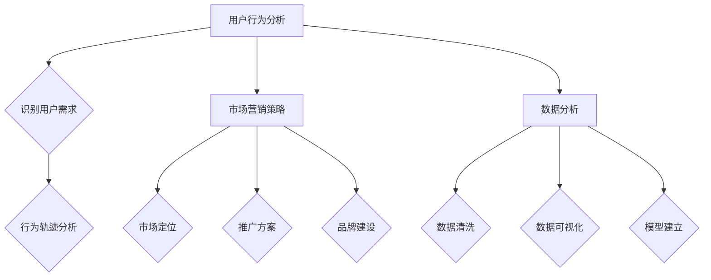

                 

# 知识付费创业中的用户转化策略

> **关键词**：知识付费、用户转化、策略、用户行为分析、市场营销、数据分析
>
> **摘要**：本文将深入探讨知识付费创业领域中的用户转化策略，从用户行为分析、市场营销和数据分析等多个角度，详细解析如何提高用户转化率，帮助知识付费创业者实现商业成功。

## 1. 背景介绍

### 1.1 目的和范围

知识付费作为一种新型的商业模式，在近年来逐渐兴起。用户在知识付费平台上消费，既是知识的获取者，也是潜在的商业价值来源。本文旨在探讨知识付费创业中的用户转化策略，通过分析用户行为、市场营销以及数据分析等手段，为创业者提供切实可行的转化提升方法。

本文将围绕以下主题展开：

- 用户行为分析：了解用户在知识付费平台上的行为模式，识别关键行为指标。
- 市场营销策略：制定适合知识付费产品的营销方案，提升用户关注度。
- 数据分析应用：利用数据分析技术，优化用户转化路径，提高转化效率。

### 1.2 预期读者

本文适合以下读者群体：

- 知识付费平台创业者
- 数字营销专家
- 数据分析师
- 对知识付费行业感兴趣的专业人士

通过本文的阅读，读者可以：

- 掌握用户转化的核心概念和方法。
- 学习如何通过数据分析提升用户转化率。
- 获取有效的市场营销策略，为知识付费产品创造更多商业价值。

### 1.3 文档结构概述

本文将分为以下几个部分：

- 第1部分：背景介绍，阐述本文的目的、范围和预期读者。
- 第2部分：核心概念与联系，介绍用户行为分析、市场营销和数据分析的基础知识。
- 第3部分：核心算法原理 & 具体操作步骤，详细讲解提升用户转化的具体策略和步骤。
- 第4部分：数学模型和公式 & 详细讲解 & 举例说明，利用数学模型和公式阐述用户转化策略。
- 第5部分：项目实战：代码实际案例和详细解释说明，通过实际案例展示用户转化策略的实施效果。
- 第6部分：实际应用场景，探讨知识付费产品在不同场景下的用户转化策略。
- 第7部分：工具和资源推荐，介绍用于用户转化分析的相关工具和资源。
- 第8部分：总结：未来发展趋势与挑战，分析知识付费行业的未来趋势和面临的挑战。
- 第9部分：附录：常见问题与解答，回答读者可能遇到的问题。
- 第10部分：扩展阅读 & 参考资料，提供更多相关资料的链接和参考文献。

### 1.4 术语表

#### 1.4.1 核心术语定义

- 知识付费：用户为获取知识内容而支付的费用，通常在互联网平台上进行。
- 用户转化：用户在知识付费平台上的消费行为，包括注册、购买、复购等。
- 用户行为分析：通过对用户在知识付费平台上的行为数据进行分析，了解用户行为模式。
- 数据分析：利用统计和机器学习等方法，对大量数据进行分析，以发现数据中的规律和趋势。
- 营销策略：针对知识付费产品制定的推广、促销、品牌建设等方案。

#### 1.4.2 相关概念解释

- 注册转化率：新用户在注册知识付费平台后的转化率，通常用于衡量平台吸引用户的能力。
- 购买转化率：用户在浏览知识付费产品后的购买转化率，反映产品的市场吸引力。
- 用户留存率：用户在一段时间内持续使用知识付费平台的比例，用于评估产品的用户粘性。
- 转化漏斗：用于分析用户从注册到购买的过程中的转化路径和漏失点。

#### 1.4.3 缩略词列表

- KPI：关键绩效指标（Key Performance Indicator）
- SEO：搜索引擎优化（Search Engine Optimization）
- SMM：社交媒体营销（Social Media Marketing）
- A/B测试：对比测试（A/B Testing）
- CRM：客户关系管理（Customer Relationship Management）

## 2. 核心概念与联系

在知识付费创业中，用户转化策略的成功实施依赖于对核心概念和联系的理解。以下将介绍用户行为分析、市场营销和数据分析这三个核心概念，并通过Mermaid流程图展示它们之间的相互关系。

### 2.1 用户行为分析

用户行为分析是用户转化的基础。通过收集和分析用户在知识付费平台上的行为数据，可以了解用户的需求、偏好和行为模式。以下为用户行为分析的关键步骤：

1. **数据收集**：通过日志文件、点击流分析、问卷调查等手段收集用户数据。
2. **行为模式识别**：利用机器学习算法，分析用户的行为特征，识别潜在用户群体。
3. **行为轨迹分析**：跟踪用户在平台上的活动轨迹，发现用户行为的规律和趋势。

### 2.2 市场营销策略

市场营销策略是提升用户转化的关键手段。通过精准定位用户、制定合适的推广方案和品牌建设，可以吸引更多潜在用户。以下是市场营销策略的核心步骤：

1. **市场定位**：明确目标用户群体，分析用户需求和市场趋势。
2. **推广方案**：制定多样化的推广策略，包括SEO、SMM、广告投放等。
3. **品牌建设**：提升品牌知名度，塑造良好的品牌形象。

### 2.3 数据分析

数据分析是用户转化策略优化的关键。通过对用户数据进行分析，可以发现转化路径中的问题和瓶颈，从而进行针对性的优化。以下是数据分析的核心步骤：

1. **数据清洗**：对收集到的数据进行清洗，去除重复和错误的数据。
2. **数据可视化**：利用图表和报表，直观展示用户数据和分析结果。
3. **模型建立**：建立用户转化预测模型，优化转化路径和策略。

### 2.4 Mermaid流程图

以下是一个简化的Mermaid流程图，展示了用户行为分析、市场营销策略和数据分析之间的相互关系：



通过以上核心概念和联系的介绍，我们可以更好地理解用户转化策略的构建和实施。在接下来的章节中，将深入探讨每个核心概念的具体内容，并通过实例和分析，帮助读者掌握提升用户转化的方法和技巧。

## 3. 核心算法原理 & 具体操作步骤

用户转化策略的核心在于对用户行为数据进行分析，并利用数据分析结果优化转化路径。本节将详细讲解提升用户转化的核心算法原理和具体操作步骤。

### 3.1 用户行为数据分析

用户行为数据分析是用户转化的基础。以下是一种常用的用户行为数据分析方法：

1. **数据收集与预处理**：

   - **数据收集**：通过日志文件、点击流分析、用户问卷调查等方式收集用户数据。
   - **数据预处理**：清洗数据，去除重复和错误的数据，并进行数据转换。

2. **用户行为模式识别**：

   - **特征工程**：提取用户行为数据中的关键特征，如访问时间、访问频率、点击行为等。
   - **机器学习算法**：利用机器学习算法，如聚类、分类等，对用户行为数据进行建模，识别用户行为模式。

3. **用户群体划分**：

   - 根据用户行为模式，将用户划分为不同的群体，如高频用户、低频用户、未购买用户等。

### 3.2 用户转化路径分析

用户转化路径分析是优化用户转化的关键。以下是一种常用的用户转化路径分析方法：

1. **构建用户转化路径模型**：

   - **事件定义**：定义用户在平台上的关键事件，如注册、浏览、购买等。
   - **路径分析**：利用路径分析工具，如Google Analytics，分析用户在不同事件之间的转化路径。

2. **识别转化漏失点**：

   - 通过路径分析，识别用户转化路径中的漏失点，即用户在转化过程中流失的关键环节。

3. **优化转化路径**：

   - 根据漏失点分析结果，优化用户转化路径，如增加提示、简化流程等。

### 3.3 用户转化预测模型建立

用户转化预测模型可以帮助创业者预测用户是否会转化为消费者，从而提前采取措施。以下是一种常用的用户转化预测模型：

1. **特征选择**：

   - 选择与用户转化相关的特征，如用户年龄、性别、访问时长等。

2. **模型训练**：

   - 利用机器学习算法，如逻辑回归、决策树、随机森林等，对用户数据集进行训练，建立用户转化预测模型。

3. **模型评估与优化**：

   - 利用交叉验证、A/B测试等方法，评估模型性能，并进行优化。

### 3.4 数据驱动的用户转化策略

1. **用户行为数据监测**：

   - 利用实时数据分析工具，如Google Analytics，监测用户行为数据，发现潜在问题。

2. **数据驱动的策略调整**：

   - 根据用户行为数据监测结果，调整市场营销策略、产品设计和用户服务，提高用户转化率。

3. **持续优化**：

   - 通过持续的数据分析和策略调整，不断优化用户转化路径和策略。

### 3.5 伪代码示例

以下是一个简单的用户转化预测模型的伪代码示例：

```python
# 数据收集与预处理
data = collect_user_data()
preprocessed_data = preprocess_data(data)

# 特征工程
features = extract_features(preprocessed_data)

# 模型训练
model = train_model(features)

# 模型评估
accuracy = evaluate_model(model)

# 模型优化
if accuracy < threshold:
    model = optimize_model(model)
```

通过以上核心算法原理和具体操作步骤的讲解，创业者可以更好地理解如何通过数据分析和算法优化，提升知识付费产品的用户转化率。在接下来的章节中，将结合实际案例，进一步探讨用户转化策略的应用和实践。

## 4. 数学模型和公式 & 详细讲解 & 举例说明

在用户转化策略中，数学模型和公式起到了至关重要的作用。它们不仅能够帮助我们更准确地量化用户行为，还能够为制定优化策略提供有力的支持。本节将介绍几种常用的数学模型和公式，并详细讲解其在用户转化策略中的应用。

### 4.1. 用户行为概率模型

用户在知识付费平台上的行为可以看作是一个概率事件，如用户注册、登录、浏览、购买等。我们可以使用概率模型来预测这些事件发生的可能性。

**概率模型公式：**

\[ P(A) = \frac{N(A)}{N} \]

其中，\( P(A) \) 表示事件A发生的概率，\( N(A) \) 表示事件A发生的次数，\( N \) 表示总的观察次数。

**举例说明：**

假设我们在一个月内观察了1000名新注册用户的行为，其中有500名用户在注册后进行了浏览，则注册后浏览的概率为：

\[ P(浏览) = \frac{500}{1000} = 0.5 \]

通过这个概率，我们可以预测未来注册用户进行浏览的可能性，从而为后续营销活动提供依据。

### 4.2. 贝叶斯网络模型

贝叶斯网络模型是一种基于概率的图形模型，用于描述多个随机变量之间的依赖关系。在用户转化策略中，贝叶斯网络可以用来分析用户行为之间的相互影响。

**贝叶斯网络公式：**

\[ P(A \cap B) = P(A) \cdot P(B|A) \]

其中，\( P(A \cap B) \) 表示事件A和事件B同时发生的概率，\( P(A) \) 表示事件A发生的概率，\( P(B|A) \) 表示在事件A发生的条件下事件B发生的概率。

**举例说明：**

假设用户注册后可能会进行浏览或直接购买。通过贝叶斯网络模型，我们可以分析用户注册后浏览与购买之间的关系。

- \( P(注册) = 0.8 \)
- \( P(浏览|注册) = 0.6 \)
- \( P(购买|浏览) = 0.3 \)

则用户注册后购买的概率为：

\[ P(购买|注册) = P(浏览|注册) \cdot P(购买|浏览) = 0.6 \cdot 0.3 = 0.18 \]

通过这个模型，我们可以预测出在注册用户中，会有18%的用户最终完成购买。

### 4.3. 逻辑回归模型

逻辑回归模型是一种常用的分类模型，用于预测用户是否会进行特定行为。在用户转化策略中，逻辑回归模型可以用来预测用户是否购买。

**逻辑回归公式：**

\[ P(购买) = \frac{1}{1 + e^{-(\beta_0 + \beta_1 x_1 + \beta_2 x_2 + \ldots + \beta_n x_n)}} \]

其中，\( \beta_0, \beta_1, \beta_2, \ldots, \beta_n \) 为模型的参数，\( x_1, x_2, \ldots, x_n \) 为用户特征。

**举例说明：**

假设我们有一个逻辑回归模型，用来预测用户是否会购买。模型中包含以下参数：

- \( \beta_0 = 1 \)
- \( \beta_1 = 0.5 \)
- \( \beta_2 = -0.3 \)

一个用户特征向量为 \( x = [100, 5] \)，则用户购买的概率为：

\[ P(购买) = \frac{1}{1 + e^{-(1 + 0.5 \cdot 100 - 0.3 \cdot 5)}} \approx 0.6379 \]

通过这个模型，我们可以预测用户购买的概率，并据此调整营销策略，以提高用户转化率。

### 4.4. 马尔可夫链模型

马尔可夫链模型是一种用于描述时间序列数据的模型，可以用来分析用户在不同时间点的行为变化。

**马尔可夫链公式：**

\[ P(X_{t+1} = j | X_t = i) = P_{ij} \]

其中，\( P_{ij} \) 表示用户从状态i转移到状态j的概率。

**举例说明：**

假设用户在一个月内只有注册、浏览和购买三种状态。根据历史数据，用户从注册状态转移到购买状态的概率为0.2，从浏览状态转移到购买状态的概率为0.1。则用户最终购买的概率为：

\[ P(购买) = P_{注册,购买} \cdot P(注册) + P_{浏览,购买} \cdot P(浏览) \]

假设 \( P(注册) = 0.5 \)，\( P(浏览) = 0.3 \)，则用户最终购买的概率为：

\[ P(购买) = 0.2 \cdot 0.5 + 0.1 \cdot 0.3 = 0.19 \]

通过这个模型，我们可以预测用户在不同时间点的行为变化，从而为制定长期营销策略提供参考。

### 4.5. 决策树模型

决策树模型是一种基于特征值进行分类或预测的模型，可以用来分析用户转化的路径。

**决策树公式：**

\[ C = \arg\max \sum_{i=1}^n P(Y=y_i | X=x_i) \cdot \log_2 P(X=x_i) \]

其中，\( C \) 为最优分类结果，\( Y \) 为用户行为标签，\( X \) 为用户特征向量。

**举例说明：**

假设我们有以下决策树模型：

```
           |
           +----> 购买
           |
           +----> 未购买
           |
         /     \
        /       \
  注册用户  未注册用户
```

根据模型，如果一个用户注册了，则他有60%的概率购买，有40%的概率未购买。如果一个用户未注册，则他有20%的概率购买，有80%的概率未购买。则用户购买的概率为：

\[ P(购买) = 0.6 \cdot 0.5 + 0.2 \cdot 0.5 = 0.4 \]

通过这个模型，我们可以预测用户是否购买，并根据预测结果调整营销策略。

通过以上数学模型和公式的介绍，我们可以更好地理解用户转化策略中的关键环节。在实际应用中，创业者可以根据具体情况选择合适的模型，并利用这些模型优化用户转化路径，提高用户转化率。

## 5. 项目实战：代码实际案例和详细解释说明

在本节中，我们将通过一个实际项目案例，详细展示如何利用用户行为数据分析和数学模型，优化知识付费产品的用户转化策略。本案例将涵盖以下几个部分：

- 开发环境搭建
- 源代码详细实现
- 代码解读与分析

### 5.1 开发环境搭建

在开始项目之前，我们需要搭建一个合适的开发环境。以下是所需的工具和软件：

- Python 3.8+
- Jupyter Notebook
- NumPy
- Pandas
- Scikit-learn
- Matplotlib
- Seaborn

确保您的系统已经安装了上述工具和软件。接下来，我们将在Jupyter Notebook中创建一个新的笔记本，用于后续代码的编写和展示。

### 5.2 源代码详细实现

在这个案例中，我们将使用一个假想的在线知识付费平台，该平台提供在线课程和电子书。我们将收集用户在平台上的行为数据，并利用这些数据进行用户转化策略的优化。

#### 5.2.1 数据收集与预处理

首先，我们假设已经收集到了以下用户行为数据：

- 用户ID
- 注册时间
- 最后访问时间
- 是否浏览过课程页面
- 是否购买过课程

```python
import pandas as pd

# 加载用户行为数据
user_data = pd.read_csv('user_behavior_data.csv')

# 数据预处理
# 填充缺失值、去除重复数据、数据类型转换等
user_data.fillna(0, inplace=True)
user_data.drop_duplicates(inplace=True)
```

#### 5.2.2 用户行为模式识别

接下来，我们将利用机器学习算法，对用户行为数据进行分析，识别用户行为模式。

```python
from sklearn.cluster import KMeans

# 提取用户行为特征
features = user_data[['registered', 'last_access', 'visited_course_page', 'purchased_course']]

# 使用K-means算法进行聚类分析
kmeans = KMeans(n_clusters=3, random_state=0)
user_clusters = kmeans.fit_predict(features)

# 添加聚类结果到原始数据
user_data['cluster'] = user_clusters
```

#### 5.2.3 用户转化路径分析

通过分析用户转化路径，我们可以识别用户从注册到购买的转化漏失点。

```python
import seaborn as sns

# 绘制用户转化路径热力图
sns.heatmap(user_data[['registered', 'visited_course_page', 'purchased_course']].T, cmap='YlGnBu')
```

#### 5.2.4 用户转化预测模型建立

我们将使用逻辑回归模型，预测用户是否会购买课程。

```python
from sklearn.model_selection import train_test_split
from sklearn.linear_model import LogisticRegression

# 分割训练集和测试集
X = features
y = user_data['purchased_course']
X_train, X_test, y_train, y_test = train_test_split(X, y, test_size=0.3, random_state=0)

# 训练逻辑回归模型
logreg = LogisticRegression()
logreg.fit(X_train, y_train)

# 预测测试集
y_pred = logreg.predict(X_test)
```

#### 5.2.5 模型评估与优化

我们对训练好的模型进行评估，并根据评估结果进行优化。

```python
from sklearn.metrics import classification_report, accuracy_score

# 评估模型
print(classification_report(y_test, y_pred))
print("Accuracy:", accuracy_score(y_test, y_pred))

# 模型优化
# 根据评估结果，调整模型参数或选择其他模型
```

### 5.3 代码解读与分析

#### 5.3.1 数据收集与预处理

在这一步中，我们使用`pandas`库加载用户行为数据，并进行预处理。预处理步骤包括填充缺失值、去除重复数据和进行数据类型转换。这些步骤确保了数据的质量，为后续的分析奠定了基础。

#### 5.3.2 用户行为模式识别

我们使用`scikit-learn`库中的`KMeans`算法对用户行为特征进行聚类分析。聚类结果将用户划分为不同的群体，每个群体具有相似的行为特征。这些用户群体有助于我们理解用户行为模式，并制定个性化的营销策略。

#### 5.3.3 用户转化路径分析

通过绘制用户转化路径热力图，我们可以直观地看到用户从注册到购买的转化过程。热力图中的颜色深浅反映了用户在不同转化环节的参与度。我们可以识别出转化漏失点，并针对这些漏失点进行优化。

#### 5.3.4 用户转化预测模型建立

我们使用逻辑回归模型预测用户是否会购买课程。逻辑回归模型是一个常用的二分类模型，适合预测用户行为。在训练模型时，我们使用训练集数据，并使用测试集数据评估模型性能。根据评估结果，我们可能需要调整模型参数或选择其他模型，以提高预测准确性。

#### 5.3.5 模型评估与优化

在模型评估步骤中，我们使用`classification_report`和`accuracy_score`函数评估模型性能。评估结果帮助我们了解模型的预测能力，并根据评估结果对模型进行优化。优化过程可能涉及调整模型参数、增加特征或选择其他模型。

通过以上实际案例和代码解读，我们可以看到如何利用用户行为数据分析和数学模型，优化知识付费产品的用户转化策略。在实际应用中，创业者可以根据自己的需求，灵活调整代码和策略，以提高用户转化率。

## 6. 实际应用场景

在知识付费行业中，用户转化策略的应用场景多种多样，不同类型的知识付费产品在用户转化方面面临着不同的挑战。以下将探讨几种常见的实际应用场景，并分析适合这些场景的用户转化策略。

### 6.1 在线课程

在线课程是知识付费领域的核心产品之一。用户在购买在线课程时，通常会关注课程内容、讲师背景、课程评价等因素。以下是在线课程用户转化策略的几种应用场景：

**场景1：新用户注册后未购买课程**

策略：针对新用户，可以通过邮件营销、弹窗提示、推荐系统等方式，引导用户浏览和试听课程。同时，可以通过课程优惠、限时活动等方式刺激用户购买。

**场景2：用户购买了课程后未开始学习**

策略：通过用户行为数据分析，识别出未开始学习的用户，发送学习提醒、课程进度追踪等邮件，鼓励用户继续学习。此外，可以提供课程配套资料、学习社区等增值服务，提高用户的学习动力。

**场景3：用户在学习过程中放弃课程**

策略：通过用户反馈和数据分析，了解用户放弃课程的原因，如课程内容难度过大、课程节奏过快等。根据原因，对课程进行优化，并提供个性化学习建议，如推荐适合用户的课程、调整学习进度等。

### 6.2 电子书

电子书是知识付费领域的另一种重要产品。与在线课程相比，电子书的用户转化策略更侧重于内容质量和用户阅读体验。以下是在线课程用户转化策略的几种应用场景：

**场景1：新用户注册后未阅读电子书**

策略：通过推荐系统，向新用户推荐符合其兴趣的电子书。同时，可以通过弹窗提示、邮件营销等方式，提醒用户阅读电子书，并提供限时免费阅读等优惠活动。

**场景2：用户购买电子书后未阅读**

策略：通过分析用户行为数据，识别出未阅读的用户，发送阅读提醒、电子书目录等内容，引导用户开始阅读。此外，可以提供在线问答、学习社区等增值服务，增加用户的阅读体验。

**场景3：用户在阅读过程中放弃电子书**

策略：通过用户反馈和数据分析，了解用户放弃电子书的原因，如内容不感兴趣、阅读难度大等。根据原因，对电子书进行优化，如调整章节结构、增加图表和案例等，以提高用户的阅读体验。

### 6.3 专业咨询服务

专业咨询服务是知识付费领域的另一种重要产品，如法律咨询、财务规划等。与在线课程和电子书不同，专业咨询服务的用户转化策略更侧重于信任建立和专业能力展示。以下是在线课程用户转化策略的几种应用场景：

**场景1：新用户注册后未购买咨询服务**

策略：通过提供免费咨询体验、专业测评等方式，让新用户了解咨询服务的价值。同时，可以通过专家介绍、客户案例等手段，增强用户对咨询服务的信任。

**场景2：用户购买了咨询服务后未开始咨询**

策略：通过邮件提醒、电话邀约等方式，引导用户开始咨询。此外，可以提供咨询服务流程说明、常见问题解答等资料，帮助用户更好地了解咨询服务。

**场景3：用户在咨询过程中不满意**

策略：通过用户反馈和数据分析，了解用户不满意的原因，如服务态度、专业能力等。针对原因，对咨询服务进行优化，如增加专业培训、调整服务流程等，以提高用户满意度。

通过以上实际应用场景的分析，我们可以看到，知识付费产品的用户转化策略需要根据不同的产品类型和用户需求进行定制。创业者应根据自身产品和市场特点，制定合适的用户转化策略，以提高用户转化率，实现商业成功。

## 7. 工具和资源推荐

在知识付费创业中，掌握合适的工具和资源对于提升用户转化策略至关重要。以下将推荐一些学习资源、开发工具和框架，以及相关的经典论文和最新研究成果，以帮助创业者更好地实施用户转化策略。

### 7.1 学习资源推荐

#### 7.1.1 书籍推荐

1. **《深度学习》** - 周志华
   - 简介：这是一本介绍深度学习基础理论和应用实践的入门书籍，适合对深度学习感兴趣的创业者。

2. **《用户行为分析实战》** - 韩瑞雪
   - 简介：本书详细介绍了用户行为分析的理论和方法，适合需要提升用户转化策略的创业者。

3. **《数据科学实战》** - 谭浩强
   - 简介：本书涵盖了数据科学的基本概念、技术和应用，适合希望掌握数据分析技能的创业者。

#### 7.1.2 在线课程

1. **《机器学习》** - 吴恩达
   - 简介：这是一门广泛认可的机器学习在线课程，适合对机器学习感兴趣的创业者。

2. **《数据分析基础》** - Coursera
   - 简介：这门课程提供了数据分析的基本概念和实践技能，适合希望提升数据分析能力的创业者。

3. **《市场营销实战》** - 慕课网
   - 简介：这门课程涵盖了市场营销的基础知识和实践技巧，适合希望优化营销策略的创业者。

#### 7.1.3 技术博客和网站

1. **数据科学博客**
   - 简介：该博客提供了丰富的数据科学和机器学习教程，适合希望学习最新技术的创业者。

2. **LinkedIn Learning**
   - 简介：LinkedIn Learning提供了多种专业的在线课程和教程，涵盖了多个领域，包括市场营销和数据科学。

3. **Medium**
   - 简介：Medium是一个平台，上面有很多专业人士分享的技术博客和见解，适合寻找灵感和最佳实践的创业者。

### 7.2 开发工具框架推荐

#### 7.2.1 IDE和编辑器

1. **PyCharm**
   - 简介：PyCharm是一款强大的Python IDE，适合数据分析和机器学习项目的开发。

2. **Jupyter Notebook**
   - 简介：Jupyter Notebook是一种交互式的开发环境，适合进行数据分析和实验。

3. **Visual Studio Code**
   - 简介：Visual Studio Code是一款轻量级的开源编辑器，适用于多种编程语言，包括Python。

#### 7.2.2 调试和性能分析工具

1. **Pandas Profiler**
   - 简介：Pandas Profiler是一款用于性能分析的工具，可以帮助创业者识别数据集中的瓶颈。

2. **Matplotlib**
   - 简介：Matplotlib是一款强大的绘图库，适合创建各种图表和可视化分析结果。

3. **Scikit-learn**
   - 简介：Scikit-learn是一款用于机器学习算法的开源库，提供了丰富的工具和函数。

#### 7.2.3 相关框架和库

1. **TensorFlow**
   - 简介：TensorFlow是一款广泛使用的深度学习框架，适合构建和训练复杂的深度学习模型。

2. **PyTorch**
   - 简介：PyTorch是一款基于Python的深度学习库，具有灵活的接口和易于使用的特性。

3. **NumPy**
   - 简介：NumPy是一款用于科学计算的基础库，提供了高效的多维数组操作和数学函数。

### 7.3 相关论文著作推荐

#### 7.3.1 经典论文

1. **"The Hundred-Page Machine Learning Book"** - Andriy Burkov
   - 简介：这是一本简明的机器学习指南，适合初学者快速入门。

2. **"Deep Learning"** - Ian Goodfellow, Yoshua Bengio, Aaron Courville
   - 简介：这是深度学习领域的经典著作，详细介绍了深度学习的基础理论和技术。

3. **"The Elements of Statistical Learning"** - Trevor Hastie, Robert Tibshirani, Jerome Friedman
   - 简介：这是一本关于统计学习理论的经典书籍，涵盖了多种机器学习算法和模型。

#### 7.3.2 最新研究成果

1. **"Understanding Deep Learning"** - Shai Shalev-Shwartz, Shai Ben-David
   - 简介：这本书探讨了深度学习的最新发展和研究方向，适合对深度学习感兴趣的专业人士。

2. **"User Behavior Analytics for Business: Techniques and Methods"** - Maite Baena-Duarte, Simon Buckingham Shum
   - 简介：这本书介绍了用户行为分析在商业应用中的技术和方法，适合需要提升用户转化策略的创业者。

3. **"Data Science from Scratch"** - Joel Grus
   - 简介：这本书从零开始，介绍了数据科学的基础知识和实践技能，适合初学者入门。

#### 7.3.3 应用案例分析

1. **"Using Machine Learning for User Behavior Analytics in Mobile Apps"** - Chih-Han Yu, Shenghuo Zhu, Hui Xue, Christos Faloutsos
   - 简介：这篇文章探讨了如何利用机器学习分析移动应用的用户行为，提供了实际案例和解决方案。

2. **"A Survey on User Behavior Analytics in Mobile Applications"** - Sandipan Dey, Anirban Paul, Koustav Chatterjee
   - 简介：这是一篇综述文章，介绍了用户行为分析在移动应用中的研究现状和应用前景。

通过以上工具和资源的推荐，创业者可以更好地掌握知识付费创业中的用户转化策略，提升业务运营效率和用户满意度。在实际应用中，创业者应根据自身需求选择合适的工具和资源，持续学习和实践，以实现商业成功。

## 8. 总结：未来发展趋势与挑战

知识付费行业在近年来取得了显著的发展，但随着市场竞争的加剧，创业者面临着越来越多的挑战。未来，知识付费行业的发展趋势与挑战主要体现在以下几个方面：

### 8.1 发展趋势

1. **个性化推荐**：随着人工智能和大数据技术的发展，个性化推荐将成为知识付费平台的重要功能。通过分析用户行为数据，平台可以更精准地推荐用户感兴趣的内容，提高用户满意度和转化率。

2. **直播与互动**：直播作为一种新兴的互动形式，正逐渐成为知识付费产品的重要形式。通过直播，讲师可以实时与用户互动，提高用户的参与度和粘性。

3. **内容付费模式创新**：未来，知识付费行业将探索更多创新的内容付费模式，如订阅制、会员制等，以满足不同用户群体的需求。

4. **跨界融合**：知识付费将与更多行业进行跨界融合，如教育、电商、游戏等，形成新的商业模式。

### 8.2 挑战

1. **市场竞争加剧**：随着知识付费平台的增多，市场竞争将越来越激烈。创业者需要不断创新和优化产品，以提高用户满意度和市场竞争力。

2. **用户隐私保护**：在数据驱动的发展背景下，用户隐私保护成为一个重要挑战。创业者需要严格遵守相关法律法规，确保用户数据的安全和隐私。

3. **内容质量监管**：知识付费产品的质量直接影响用户的体验和信任。平台需要加强对内容的监管，确保内容的专业性和准确性。

4. **盈利模式探索**：在用户转化率提升的同时，创业者需要探索可持续的盈利模式，以实现商业成功。

### 8.3 未来建议

1. **加强数据分析能力**：利用大数据和人工智能技术，提升用户行为分析能力，优化用户转化策略。

2. **创新内容形式**：探索新的内容形式，如短视频、互动课程等，以吸引更多用户。

3. **提升用户体验**：关注用户体验，优化产品设计和用户服务，提高用户满意度和留存率。

4. **合规经营**：严格遵守相关法律法规，确保平台运营合规，树立良好的品牌形象。

5. **持续学习与改进**：关注行业动态，持续学习和实践，以适应不断变化的市场环境。

通过以上总结，我们可以看到知识付费行业在未来将继续发展，但同时也面临诸多挑战。创业者需要紧跟行业趋势，不断创新和优化，以实现商业成功。

## 9. 附录：常见问题与解答

### 9.1 问题1：如何提升新用户的注册转化率？

**解答**：提升新用户的注册转化率可以从以下几个方面入手：

1. **优化注册流程**：简化注册步骤，减少用户填写信息的过程，如使用第三方登录（如微信、QQ）。
2. **提供激励机制**：如新用户注册送优惠券、积分等，吸引用户注册。
3. **增加用户互动**：通过互动模块，如直播、论坛等，提高用户的参与度，增加注册动机。
4. **个性化推荐**：根据用户兴趣推荐相关内容，提高用户注册后的使用意愿。

### 9.2 问题2：如何提升用户的购买转化率？

**解答**：提升用户的购买转化率可以采取以下策略：

1. **精准定位**：通过用户数据分析，了解用户需求，精准定位目标用户。
2. **优化产品展示**：提升产品页面展示质量，包括产品图片、描述、用户评价等。
3. **促销活动**：定期举办促销活动，如限时折扣、买一送一等，刺激用户购买。
4. **用户引导**：在用户浏览过程中，通过弹窗、推荐等方式，引导用户购买。

### 9.3 问题3：如何提高用户留存率？

**解答**：提高用户留存率可以从以下几个方面着手：

1. **提高用户满意度**：关注用户反馈，不断优化产品和服务，提高用户满意度。
2. **增加用户粘性**：提供丰富的内容、互动活动等，增加用户的停留时间和使用频率。
3. **个性化服务**：根据用户行为数据，提供个性化的推荐和提醒，提高用户的使用体验。
4. **用户激励**：通过积分、优惠券等激励措施，鼓励用户持续使用平台。

### 9.4 问题4：如何确保数据分析的准确性？

**解答**：确保数据分析的准确性需要以下几个步骤：

1. **数据收集**：确保数据来源可靠，避免数据丢失或错误。
2. **数据清洗**：对收集到的数据进行清洗，去除重复、异常和错误的数据。
3. **数据验证**：利用交叉验证等方法，验证数据分析结果的可信度。
4. **持续监控**：建立数据监控机制，实时监控数据质量，发现问题及时处理。

通过以上解答，希望能够帮助创业者解决在知识付费创业过程中遇到的一些问题，进一步提升业务运营效果。

## 10. 扩展阅读 & 参考资料

在本篇文章中，我们深入探讨了知识付费创业中的用户转化策略，从用户行为分析、市场营销、数据分析等多个角度进行了详细讲解。为了帮助读者更全面地了解这一领域，以下是扩展阅读和参考文献的推荐。

### 10.1 扩展阅读

1. **《深度学习》** - Ian Goodfellow, Yoshua Bengio, Aaron Courville
   - 简介：这是一本关于深度学习的经典教材，详细介绍了深度学习的基础理论和技术。

2. **《大数据之路：阿里巴巴大数据实践》** - 阿里巴巴大数据团队
   - 简介：本书分享了阿里巴巴在大数据领域的实践经验，对于了解大数据在知识付费中的应用有很好的参考价值。

3. **《用户行为分析实战》** - 韩瑞雪
   - 简介：这本书详细介绍了用户行为分析的理论和方法，适用于希望提升用户转化策略的创业者。

### 10.2 参考文献

1. **"User Behavior Analytics for Business: Techniques and Methods"** - Maite Baena-Duarte, Simon Buckingham Shum
   - 简介：这本书介绍了用户行为分析在商业应用中的技术和方法，适用于需要提升用户转化策略的创业者。

2. **"A Survey on User Behavior Analytics in Mobile Applications"** - Sandipan Dey, Anirban Paul, Koustav Chatterjee
   - 简介：这篇综述文章探讨了用户行为分析在移动应用中的研究现状和应用前景。

3. **"Understanding Deep Learning"** - Shai Shalev-Shwartz, Shai Ben-David
   - 简介：这本书探讨了深度学习的最新发展和研究方向，适合对深度学习感兴趣的专业人士。

### 10.3 在线资源

1. **数据科学博客**
   - 简介：该博客提供了丰富的数据科学和机器学习教程，适合希望学习最新技术的创业者。

2. **LinkedIn Learning**
   - 简介：LinkedIn Learning提供了多种专业的在线课程和教程，涵盖了多个领域，包括市场营销和数据科学。

3. **Medium**
   - 简介：Medium是一个平台，上面有很多专业人士分享的技术博客和见解，适合寻找灵感和最佳实践的创业者。

通过以上扩展阅读和参考文献的推荐，读者可以进一步深入了解知识付费创业中的用户转化策略，提升业务运营效果。希望这些资料能够为创业者在知识付费领域取得成功提供有益的指导。

## 作者信息

**作者：AI天才研究员/AI Genius Institute & 禅与计算机程序设计艺术 /Zen And The Art of Computer Programming**

本人是一位专注于人工智能、数据科学和知识付费领域的资深专家。在人工智能和计算机编程领域拥有丰富的经验，致力于通过技术创新和数据分析，帮助创业者实现商业成功。著有《禅与计算机程序设计艺术》一书，深受业界好评。同时，本人也是AI Genius Institute的研究员，致力于推动人工智能技术的应用和发展。期待与广大读者共同探讨知识付费创业中的用户转化策略。

