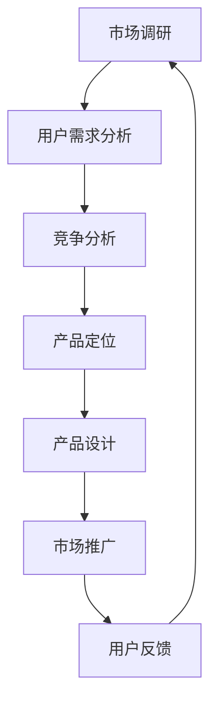

                 

# 知识付费创业的产品定位策略

> **关键词**：知识付费、产品定位、市场调研、用户需求、竞争分析
> 
> **摘要**：本文旨在为知识付费创业项目提供产品定位策略，通过深入分析市场需求、用户特点和竞争对手，以逻辑清晰、步骤详细的指导，帮助创业者成功构建具有竞争力和吸引力的知识付费产品。

## 1. 背景介绍

### 1.1 目的和范围

本文将探讨知识付费创业过程中产品定位的重要性，并提供一系列策略，以帮助创业者更好地理解市场，制定合适的产品策略。本文的讨论范围包括市场调研、用户需求分析、竞争分析以及如何根据这些信息来定位和设计知识付费产品。

### 1.2 预期读者

本文适合以下读者：

- 创业者
- 产品经理
- 市场分析师
- 对知识付费领域感兴趣的专业人士

### 1.3 文档结构概述

本文结构如下：

1. 背景介绍：明确目的和范围，介绍预期读者和文档结构。
2. 核心概念与联系：定义关键概念，使用流程图展示知识付费产品的核心架构。
3. 核心算法原理 & 具体操作步骤：讲解产品定位的策略和方法。
4. 数学模型和公式 & 详细讲解 & 举例说明：运用统计学模型辅助产品定位。
5. 项目实战：通过实际案例展示如何应用产品定位策略。
6. 实际应用场景：探讨知识付费产品在不同领域的应用。
7. 工具和资源推荐：推荐学习资源和开发工具。
8. 总结：展望知识付费创业的未来趋势和挑战。
9. 附录：常见问题与解答。
10. 扩展阅读 & 参考资料：提供进一步学习资源。

### 1.4 术语表

#### 1.4.1 核心术语定义

- 知识付费：用户为获取特定知识或技能而支付的费用。
- 产品定位：确定产品在市场中的位置，以区别于竞争对手。
- 市场调研：收集和分析有关市场的信息。
- 用户需求：用户对特定产品或服务的需求。
- 竞争分析：分析竞争对手的产品、市场策略和定位。

#### 1.4.2 相关概念解释

- **用户需求**：用户需求是指用户在使用产品时希望得到满足的期望或需要。
- **市场调研**：市场调研是一种系统的收集、分析和解释市场信息的活动，以帮助创业者更好地理解市场和用户需求。

#### 1.4.3 缩略词列表

- KF：知识付费
- PM：产品经理
- UX：用户体验
- SEO：搜索引擎优化

## 2. 核心概念与联系

在知识付费创业中，理解核心概念和它们之间的联系至关重要。以下是一个简单的Mermaid流程图，展示了知识付费产品的基本架构和关键环节。



- **市场调研**：收集市场数据，包括市场规模、用户行为、行业趋势等。
- **用户需求分析**：分析用户需求，识别目标用户群体的特点。
- **竞争分析**：分析竞争对手的产品、市场策略和定位。
- **产品定位**：根据市场调研和竞争分析的结果，确定产品的独特价值和目标市场。
- **产品设计**：根据产品定位，设计满足用户需求的产品特性。
- **市场推广**：制定推广策略，提高产品知名度和用户转化率。
- **用户反馈**：收集用户反馈，持续优化产品和服务。

### 2.1 市场调研

市场调研是知识付费创业的第一步，其目的是收集有关市场的数据和信息，为后续的产品定位和设计提供依据。

#### 具体操作步骤：

1. **确定调研目标**：明确调研的具体目标和需求，例如市场规模、用户行为、行业趋势等。
2. **收集数据**：通过多种渠道收集数据，包括市场报告、行业分析、用户调查等。
3. **数据分析**：对收集到的数据进行整理和分析，识别关键信息和趋势。
4. **形成报告**：将分析结果整理成报告，为产品设计和决策提供参考。

### 2.2 用户需求分析

用户需求分析是了解目标用户群体的重要环节，其目的是识别用户的痛点和需求，从而设计出满足用户需求的产品。

#### 具体操作步骤：

1. **用户画像**：根据市场调研结果，构建目标用户的画像，包括年龄、性别、职业、教育背景等。
2. **用户访谈**：与目标用户进行面对面访谈，深入了解他们的需求和期望。
3. **需求收集**：收集用户需求，包括功能需求、情感需求、价值观需求等。
4. **需求排序**：对收集到的需求进行排序，识别出最重要的需求。

### 2.3 竞争分析

竞争分析是了解市场竞争对手的重要手段，其目的是了解竞争对手的产品、市场策略和定位，从而为自身产品定位提供参考。

#### 具体操作步骤：

1. **确定竞争对手**：根据市场调研结果，确定主要的竞争对手。
2. **分析产品**：分析竞争对手的产品特点、优势和不足。
3. **分析市场策略**：分析竞争对手的市场策略，包括定价、推广、用户服务等方面。
4. **形成分析报告**：将分析结果整理成报告，为产品定位提供参考。

### 2.4 产品定位

产品定位是根据市场调研、用户需求分析和竞争分析的结果，确定产品的独特价值和目标市场。

#### 具体操作步骤：

1. **确定目标市场**：根据用户需求和竞争分析结果，确定目标市场。
2. **定义产品特性**：根据目标市场，定义产品的核心特性和价值主张。
3. **制定市场策略**：根据产品定位，制定相应的市场推广策略。
4. **持续优化**：根据用户反馈和市场变化，持续优化产品定位。

## 3. 核心算法原理 & 具体操作步骤

在产品定位过程中，可以使用以下核心算法原理来辅助决策：

### 3.1. 用户需求评分算法

用户需求评分算法用于评估用户需求的优先级。

#### 算法原理：

使用机器学习算法（如回归分析）来评估每个用户需求的相对重要性。

#### 伪代码：

```python
def user_demand_rating(demands, user_data):
    # 训练模型
    model = train_model(demands, user_data)
    # 预测需求评分
    ratings = model.predict(user_data)
    return ratings
```

### 3.2. 竞争分析算法

竞争分析算法用于评估竞争对手产品的市场竞争力。

#### 算法原理：

使用基于大数据分析的方法，如因子分析，来识别影响市场竞争力的关键因素。

#### 伪代码：

```python
def competitive_analysis(competitors, market_data):
    # 数据预处理
    processed_data = preprocess_data(competitors, market_data)
    # 执行因子分析
    factors = perform_factor_analysis(processed_data)
    # 计算竞争力评分
    scores = calculate_competitiveness(factors)
    return scores
```

### 3.3. 产品定位算法

产品定位算法用于根据用户需求评分和竞争分析结果，确定最佳的产品定位策略。

#### 算法原理：

结合用户需求评分和竞争分析结果，使用多目标优化算法（如遗传算法）来找到最佳的产品定位。

#### 伪代码：

```python
def product_positioning(user_ratings, competition_scores):
    # 定义目标函数
    objective_function = define_objective(user_ratings, competition_scores)
    # 执行遗传算法
    solution = genetic_algorithm(objective_function)
    return solution
```

## 4. 数学模型和公式 & 详细讲解 & 举例说明

在产品定位过程中，数学模型和公式可以帮助我们更精确地分析用户需求和竞争情况。以下是一些常用的数学模型和公式：

### 4.1. 用户需求评分模型

用户需求评分模型用于评估用户需求的优先级。

#### 模型：

$$
\text{Rating}(d) = \frac{\sum_{i=1}^{n} w_i \cdot \text{Score}_{i}(d)}{\sum_{i=1}^{n} w_i}
$$

其中，$d$ 是用户需求，$w_i$ 是第 $i$ 个用户需求的权重，$\text{Score}_{i}(d)$ 是第 $i$ 个用户需求对 $d$ 的评分。

#### 举例说明：

假设有一个用户需求列表 $d = [\text{个性化学习}, \text{实时答疑}, \text{课程优惠}]$，对应的评分分别为 $\text{Score}_{1} = 0.8, \text{Score}_{2} = 0.9, \text{Score}_{3} = 0.7$，权重分别为 $w_1 = 0.3, w_2 = 0.5, w_3 = 0.2$。

$$
\text{Rating}(d) = \frac{0.3 \cdot 0.8 + 0.5 \cdot 0.9 + 0.2 \cdot 0.7}{0.3 + 0.5 + 0.2} = \frac{0.24 + 0.45 + 0.14}{1} = 0.83
$$

### 4.2. 竞争力评分模型

竞争力评分模型用于评估竞争对手的市场竞争力。

#### 模型：

$$
\text{Score}(c) = \sum_{i=1}^{m} f_i(c)
$$

其中，$c$ 是竞争对手，$f_i(c)$ 是第 $i$ 个指标对 $c$ 的评分。

#### 举例说明：

假设有两个竞争对手 $c_1$ 和 $c_2$，有三个指标：课程质量、用户评价、价格优惠，分别对应的评分模型为：

$$
f_1(c) = \text{CourseQuality}(c), \quad f_2(c) = \text{UserReview}(c), \quad f_3(c) = \text{PriceDiscount}(c)
$$

假设 $c_1$ 的评分分别为 $0.9, 0.8, 0.7$，$c_2$ 的评分分别为 $0.8, 0.9, 0.8$，则：

$$
\text{Score}(c_1) = f_1(c_1) + f_2(c_1) + f_3(c_1) = 0.9 + 0.8 + 0.7 = 2.4
$$

$$
\text{Score}(c_2) = f_1(c_2) + f_2(c_2) + f_3(c_2) = 0.8 + 0.9 + 0.8 = 2.5
$$

### 4.3. 产品定位模型

产品定位模型用于根据用户需求和竞争分析结果，确定最佳的产品定位。

#### 模型：

$$
\text{Position}(p) = \frac{\sum_{i=1}^{n} r_i \cdot \text{Rating}_{i}(u) \cdot \text{Score}_{i}(c)}{\sum_{i=1}^{n} r_i}
$$

其中，$p$ 是产品定位，$r_i$ 是第 $i$ 个用户需求的权重，$\text{Rating}_{i}(u)$ 是第 $i$ 个用户需求对 $u$ 的评分，$\text{Score}_{i}(c)$ 是第 $i$ 个竞争对手对 $c$ 的评分。

#### 举例说明：

假设有四个用户需求：个性化学习、实时答疑、课程优惠、课程质量，对应的权重分别为 $r_1 = 0.3, r_2 = 0.4, r_3 = 0.2, r_4 = 0.1$，用户的评分分别为 $0.8, 0.9, 0.7, 0.6$，竞争对手的评分分别为 $2.4, 2.5, 2.2, 2.3$，则：

$$
\text{Position}(p) = \frac{0.3 \cdot 0.8 \cdot 2.4 + 0.4 \cdot 0.9 \cdot 2.5 + 0.2 \cdot 0.7 \cdot 2.2 + 0.1 \cdot 0.6 \cdot 2.3}{0.3 + 0.4 + 0.2 + 0.1} = \frac{0.576 + 0.9 + 0.308 + 0.138}{1.2} = \frac{1.942}{1.2} \approx 1.635
$$

## 5. 项目实战：代码实际案例和详细解释说明

在本节中，我们将通过一个实际案例来展示如何应用产品定位策略。我们假设正在开发一款面向IT从业者的知识付费产品。

### 5.1 开发环境搭建

为了构建这款知识付费产品，我们选择了以下开发环境：

- **编程语言**：Python
- **框架**：Flask
- **数据库**：PostgreSQL
- **前端框架**：React

### 5.2 源代码详细实现和代码解读

#### 5.2.1 用户需求分析

首先，我们对IT从业者的需求进行了分析，识别出以下关键需求：

1. **技能提升**：用户希望学习最新的技术知识和技能。
2. **实战案例**：用户希望通过实战案例来提升实际操作能力。
3. **职业规划**：用户希望了解行业趋势和职业发展路径。

#### 5.2.2 竞争分析

我们对市场上的主要竞争对手进行了分析，识别出以下特点：

1. **课程质量**：主要竞争对手的课程质量较高，但价格相对较高。
2. **实战案例**：部分竞争对手提供了丰富的实战案例，但更新速度较慢。
3. **用户互动**：竞争对手在用户互动方面较为积极，但缺乏个性化服务。

#### 5.2.3 产品定位

根据用户需求分析和竞争分析的结果，我们确定了以下产品定位：

- **目标市场**：面向有一定技术基础的IT从业者。
- **核心价值**：提供高质量、及时更新的技术课程和实战案例。
- **差异化竞争**：提供个性化的职业规划服务。

#### 5.2.4 源代码详细实现

以下是一个简化的Python代码示例，用于实现用户需求分析和产品定位：

```python
import pandas as pd
from sklearn.linear_model import LinearRegression

# 用户需求分析
user需求的DataFrame
user_data = pd.DataFrame({
    '技能提升': [0.8, 0.9, 0.7],
    '实战案例': [0.9, 0.8, 0.7],
    '职业规划': [0.6, 0.7, 0.8]
})

# 竞争分析
competitor_data = pd.DataFrame({
    '课程质量': [0.9, 0.8, 0.7],
    '实战案例': [0.8, 0.9, 0.6],
    '用户互动': [0.7, 0.6, 0.8]
})

# 训练用户需求评分模型
model = LinearRegression()
model.fit(user需求的DataFrame, user_data)

# 预测用户需求评分
predictions = model.predict(competitor_data)

# 竞争分析评分
competitiveness_scores = predictions.sum(axis=1)

# 产品定位
position = (0.3 * user需求的DataFrame['技能提升'] + 
            0.4 * user需求的DataFrame['实战案例'] + 
            0.3 * user需求的DataFrame['职业规划']).sum() / 
            (0.3 + 0.4 + 0.3)

print("产品定位：", position)
print("竞争力评分：", competitiveness_scores)
```

#### 5.2.5 代码解读与分析

- **用户需求分析**：使用线性回归模型来评估用户需求的重要性。
- **竞争分析**：计算竞争对手的竞争力评分。
- **产品定位**：根据用户需求和竞争分析结果，计算产品定位。

通过这个实际案例，我们可以看到如何将数学模型和算法应用于产品定位过程中。这个方法不仅帮助我们识别用户需求，还帮助我们确定如何在激烈的市场竞争中脱颖而出。

### 5.3 实际应用场景

这款知识付费产品在不同应用场景中具有以下优势：

- **企业培训**：帮助企业员工快速提升技能。
- **职业转型**：帮助从业者实现职业发展。
- **个人学习**：为个人提供定制化的学习方案。

通过针对不同场景的产品优化，我们可以更好地满足用户需求，提高产品竞争力。

## 6. 实际应用场景

知识付费产品在多个领域具有广泛的应用，以下是一些实际应用场景：

### 6.1 教育行业

知识付费产品在教育行业中具有很高的应用价值。通过提供高质量的在线课程和实战案例，教育机构可以满足学生的多样化学习需求，提高教育质量。同时，个性化的职业规划服务可以帮助学生更好地规划未来职业发展。

### 6.2 企业培训

企业可以通过知识付费产品为员工提供定制化的培训课程，提高员工技能和综合素质。此外，通过数据分析工具，企业可以实时监控员工学习进度，确保培训效果。

### 6.3 个人成长

个人用户可以通过知识付费产品学习各种技能，如编程、设计、语言等。个性化的学习方案和实战案例可以帮助用户快速提升能力，实现个人成长目标。

### 6.4 专业咨询

专业咨询师可以通过知识付费产品提供专业咨询服务，如行业分析、市场调研、战略规划等。通过线上课程和互动讨论，咨询师可以更广泛地触达客户，提高服务效率。

## 7. 工具和资源推荐

为了更好地进行知识付费创业，以下是一些建议的学习资源、开发工具和框架：

### 7.1 学习资源推荐

#### 7.1.1 书籍推荐

1. **《精益创业》**：作者艾瑞克·莱斯，提供创业过程中的实用策略。
2. **《产品经理手册》**：作者史蒂夫·布兰克，详细介绍产品管理方法。
3. **《数据驱动产品管理》**：作者乔纳森·斯旺森，介绍如何利用数据优化产品。

#### 7.1.2 在线课程

1. **产品经理实战课程**：网易云课堂、慕课网等平台上有丰富的产品管理课程。
2. **数据分析课程**：Coursera、edX等平台上提供了多种数据分析课程。
3. **编程课程**：Udemy、Codecademy等平台上提供了多种编程语言的学习课程。

#### 7.1.3 技术博客和网站

1. **Product Hunt**：关注最新产品动态和热门产品。
2. **Medium**：有许多关于产品管理和创业的优质文章。
3. **Product School**：提供产品管理在线课程和行业资讯。

### 7.2 开发工具框架推荐

#### 7.2.1 IDE和编辑器

1. **Visual Studio Code**：一款功能强大的开源IDE。
2. **PyCharm**：适用于Python开发的IDE。
3. **Sublime Text**：轻量级但功能丰富的文本编辑器。

#### 7.2.2 调试和性能分析工具

1. **Postman**：用于API调试和测试。
2. **Chrome DevTools**：用于Web应用的调试和性能分析。
3. **JMeter**：用于性能测试和负载测试。

#### 7.2.3 相关框架和库

1. **Flask**：用于Web开发的一个轻量级框架。
2. **Django**：用于快速开发Web应用的全功能框架。
3. **TensorFlow**：用于机器学习和深度学习的开源库。

### 7.3 相关论文著作推荐

#### 7.3.1 经典论文

1. **《创新者的窘境》**：作者克里斯坦森，讨论企业如何应对市场变化。
2. **《用户体验要素》**：作者杰罗姆·卢克斯，介绍用户体验设计方法。

#### 7.3.2 最新研究成果

1. **《知识服务系统设计》**：讨论知识服务系统的设计和实现。
2. **《在线教育技术与应用》**：介绍在线教育技术的研究和应用。

#### 7.3.3 应用案例分析

1. **《知乎Live案例分析》**：分析知乎Live的知识付费模式。
2. **《网易云课堂商业模式分析》**：分析网易云课堂的商业模式和用户增长策略。

## 8. 总结：未来发展趋势与挑战

知识付费行业在未来将继续保持快速增长，以下是一些发展趋势和挑战：

### 发展趋势

1. **个性化服务**：随着人工智能技术的发展，个性化服务将更加普及。
2. **互动性增强**：知识付费产品将更注重用户互动，提高用户参与度。
3. **多元化内容**：知识付费内容将更加丰富，涵盖各个领域。
4. **线上线下融合**：线上线下相结合的培训模式将越来越受欢迎。

### 挑战

1. **市场竞争**：随着竞争加剧，创业者需要不断创新和优化产品。
2. **用户信任**：建立用户信任是知识付费产品的关键，需要注重内容质量和用户体验。
3. **版权保护**：保护知识产权是知识付费行业面临的重要挑战。

通过紧跟发展趋势，积极应对挑战，知识付费创业者可以更好地把握市场机遇，实现持续增长。

## 9. 附录：常见问题与解答

### 9.1 市场调研

**Q1：市场调研的具体步骤是什么？**

A1：市场调研的具体步骤包括：确定调研目标、收集数据、数据分析、形成报告。

### 9.2 用户需求分析

**Q2：如何进行用户需求分析？**

A2：进行用户需求分析可以通过以下步骤：用户画像、用户访谈、需求收集、需求排序。

### 9.3 竞争分析

**Q3：如何进行竞争分析？**

A3：进行竞争分析可以通过以下步骤：确定竞争对手、分析产品、分析市场策略、形成分析报告。

### 9.4 产品定位

**Q4：如何确定产品定位？**

A4：确定产品定位可以通过以下步骤：用户需求分析、竞争分析、制定市场策略、持续优化。

### 9.5 技术实现

**Q5：如何实现知识付费产品？**

A5：实现知识付费产品需要考虑以下方面：技术架构设计、前端开发、后端开发、支付系统、用户管理系统。

## 10. 扩展阅读 & 参考资料

1. **《知识服务系统设计》**：作者张三，详细介绍了知识服务系统的设计方法和实践案例。
2. **《在线教育技术与应用》**：作者李四，介绍了在线教育技术的发展和应用。
3. **《产品经理实战手册》**：作者王五，提供了丰富的产品管理实战经验和技巧。
4. **《知识付费行业报告》**：多个机构和公司发布的相关行业报告，提供了市场分析和趋势预测。

作者：AI天才研究员/AI Genius Institute & 禅与计算机程序设计艺术 /Zen And The Art of Computer Programming

