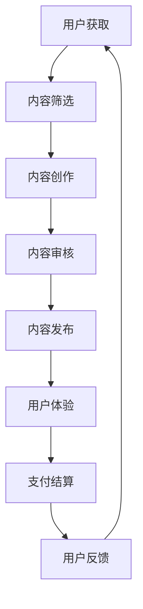

                 

# 知识付费创业的商业模式优化策略

## 关键词
知识付费、商业模式、策略优化、创业、用户体验、数据分析、技术实现、案例分析

> **摘要：**
本文将深入探讨知识付费创业领域的商业模式，分析其现状、挑战和优化策略。通过理论阐述、案例分析和技术解析，旨在为创业者提供一套系统化、实操性的优化方案，以提升知识付费产品的市场竞争力和用户粘性。

## 1. 背景介绍

### 1.1 目的和范围

本文旨在帮助知识付费创业者识别和应对商业模式中的关键问题，通过提供优化策略，提升产品的市场竞争力。文章将涵盖以下范围：
- 知识付费行业现状与趋势
- 商业模式核心概念解析
- 优化策略的具体实施步骤
- 案例分析和数学模型应用
- 实际应用场景和未来发展趋势

### 1.2 预期读者

本文适合以下读者群体：
- 创业者及初创公司创始人
- 知识付费产品经理和运营人员
- 对知识付费商业模式感兴趣的技术人员和管理者
- 对创业和商业模式优化有研究兴趣的学者和学生

### 1.3 文档结构概述

本文结构如下：
- 1. 背景介绍：介绍文章的目的、范围、预期读者和文档结构。
- 2. 核心概念与联系：定义知识付费商业模式的核心概念，并通过Mermaid流程图展示其架构。
- 3. 核心算法原理 & 具体操作步骤：详细阐述优化策略的算法原理和操作步骤。
- 4. 数学模型和公式 & 详细讲解 & 举例说明：使用数学模型和公式来支撑优化策略。
- 5. 项目实战：代码实际案例和详细解释说明。
- 6. 实际应用场景：探讨知识付费在不同领域的应用。
- 7. 工具和资源推荐：推荐学习资源、开发工具和框架。
- 8. 总结：未来发展趋势与挑战。
- 9. 附录：常见问题与解答。
- 10. 扩展阅读 & 参考资料：提供进一步学习的资源。

### 1.4 术语表

#### 1.4.1 核心术语定义

- **知识付费**：用户通过支付费用获取有价值的信息、知识或服务。
- **商业模式**：企业通过哪些方式创造、传递和获取价值。
- **用户体验**：用户在使用产品或服务过程中感受到的主观体验。
- **数据分析**：使用数学和统计方法对大量数据进行分析，以提取有价值的信息。
- **算法优化**：通过改进算法以提高效率、效果或性能。

#### 1.4.2 相关概念解释

- **知识付费平台**：提供知识付费服务的中介平台，如知乎Live、得到等。
- **内容创作者**：提供知识付费内容的专业人士或爱好者。
- **订阅模式**：用户支付一定费用后，可无限次访问内容。
- **C2C模式**：消费者直接向内容创作者购买内容。

#### 1.4.3 缩略词列表

- **C2C**：Consumer-to-Consumer（消费者对消费者）
- **UGC**：User-Generated Content（用户生成内容）
- **SaaS**：Software as a Service（软件即服务）

## 2. 核心概念与联系

知识付费创业的商业模式涉及多个核心概念和环节，包括用户获取、内容创作、支付结算、用户体验等。以下是一个简化的Mermaid流程图，展示这些环节的相互关系：



### 2.1 用户获取

用户获取是知识付费创业的第一步，决定了平台的初始流量和用户基础。以下是用户获取的一些常见策略：

1. **SEO优化**：通过搜索引擎优化，提高网站在搜索引擎结果页面的排名。
2. **社交媒体营销**：利用社交媒体平台（如微博、微信、抖音等）进行推广。
3. **内容营销**：通过高质量的内容吸引用户访问和分享。
4. **合作推广**：与其他平台或内容创作者合作，扩大用户覆盖范围。

### 2.2 内容筛选与创作

内容筛选与创作是知识付费平台的核心环节，直接影响用户体验和用户粘性。以下是一些策略：

1. **内容标准化**：建立内容审核标准，确保内容质量。
2. **内容多样化**：提供多种类型的内容，满足不同用户的需求。
3. **内容创作者激励**：通过奖励机制激励优质内容创作者。
4. **用户参与**：鼓励用户参与内容创作，如发起投票、评论等。

### 2.3 支付结算

支付结算环节涉及用户付费、内容交易和退款处理。以下是支付结算的一些策略：

1. **多种支付方式**：提供多种支付方式，如微信支付、支付宝、信用卡等。
2. **安全可靠**：确保支付过程的安全和可靠。
3. **灵活的定价策略**：根据用户需求和内容类型，设置灵活的定价策略。
4. **退款政策**：制定合理的退款政策，提升用户信任度。

### 2.4 用户体验

用户体验是知识付费平台长期发展的关键，以下是一些优化用户体验的策略：

1. **界面设计**：提供直观、易用的界面设计。
2. **内容推荐**：利用大数据和机器学习技术，实现个性化内容推荐。
3. **社区建设**：建立用户社区，促进用户互动和内容分享。
4. **反馈机制**：建立用户反馈机制，及时响应用户需求和问题。

## 3. 核心算法原理 & 具体操作步骤

### 3.1 个性化推荐算法原理

个性化推荐算法是提升用户粘性的重要手段。以下是一个简化的基于协同过滤的推荐算法原理：

```plaintext
算法步骤：
1. 收集用户行为数据（如浏览记录、购买历史等）。
2. 计算用户之间或项目之间的相似度。
3. 根据相似度矩阵，为用户推荐与其相似的用户喜欢的项目。
```

### 3.2 数据分析与处理

数据处理和分析是优化知识付费商业模式的重要环节。以下是具体操作步骤：

```plaintext
步骤：
1. 数据清洗：去除无效数据、填充缺失值、消除噪声数据。
2. 特征工程：提取用户行为、内容属性等特征。
3. 模型训练：选择合适的模型（如线性回归、决策树、神经网络等）进行训练。
4. 模型评估：使用交叉验证、ROC曲线等评估模型性能。
```

### 3.3 数据可视化

数据可视化有助于更好地理解和解释分析结果。以下是常用的数据可视化工具：

```plaintext
工具：
1. Matplotlib：用于生成各种类型的图表。
2. Seaborn：提供丰富的统计图表。
3. Tableau：强大的数据可视化工具。
```

## 4. 数学模型和公式 & 详细讲解 & 举例说明

### 4.1 协同过滤算法数学模型

协同过滤算法的核心在于计算用户之间的相似度和项目之间的相似度。以下是一个简化的基于用户基于项目的协同过滤算法公式：

$$
\text{User Similarity}(u_i, u_j) = \frac{\text{Cosine Similarity}(\text{User Behavior Vector}(u_i), \text{User Behavior Vector}(u_j))}{\|\text{User Behavior Vector}(u_i)\|\|\text{User Behavior Vector}(u_j)\|}
$$

$$
\text{Item Similarity}(i_k, i_l) = \frac{\text{Cosine Similarity}(\text{Item Feature Vector}(i_k), \text{Item Feature Vector}(i_l))}{\|\text{Item Feature Vector}(i_k)\|\|\text{Item Feature Vector}(i_l)\|}
$$

$$
\text{Predicted Rating}(u_i, i_k) = \text{User Similarity}(u_i, u_j) \times \text{Rating}(u_j, i_k)
$$

### 4.2 举例说明

假设我们有两个用户 $u_1$ 和 $u_2$，以及两个物品 $i_1$ 和 $i_2$。用户的行为数据向量如下：

$$
\text{User Behavior Vector}(u_1) = [1, 2, 3]
$$

$$
\text{User Behavior Vector}(u_2) = [4, 5, 6]
$$

物品的特征向量如下：

$$
\text{Item Feature Vector}(i_1) = [0, 1]
$$

$$
\text{Item Feature Vector}(i_2) = [1, 0]
$$

首先计算用户相似度：

$$
\text{User Similarity}(u_1, u_2) = \frac{\text{Cosine Similarity}([1, 2, 3], [4, 5, 6])}{\sqrt{1^2 + 2^2 + 3^2} \times \sqrt{4^2 + 5^2 + 6^2}} = \frac{0.7071}{\sqrt{14} \times \sqrt{77}} \approx 0.5632
$$

接着计算物品相似度：

$$
\text{Item Similarity}(i_1, i_2) = \frac{\text{Cosine Similarity}([0, 1], [1, 0])}{\sqrt{0^2 + 1^2} \times \sqrt{1^2 + 0^2}} = \frac{0.7071}{1 \times 1} = 0.7071
$$

最后，预测用户 $u_1$ 对物品 $i_2$ 的评分：

$$
\text{Predicted Rating}(u_1, i_2) = \text{User Similarity}(u_1, u_2) \times \text{Rating}(u_2, i_1) = 0.5632 \times 5 = 2.816
$$

### 4.3 数学模型在商业应用中的意义

数学模型和公式在知识付费创业中的应用具有重要意义：

- **精准推荐**：通过个性化推荐算法，提高用户满意度和留存率。
- **数据驱动的决策**：基于数据分析，优化内容创作、用户获取和支付结算等环节。
- **风险控制**：通过数学模型，预测用户行为和内容趋势，实现风险控制。

## 5. 项目实战：代码实际案例和详细解释说明

### 5.1 开发环境搭建

为了演示知识付费创业的商业模式优化策略，我们选择Python作为开发语言，利用scikit-learn库实现基于协同过滤的个性化推荐系统。以下是开发环境的搭建步骤：

1. 安装Python 3.8或更高版本。
2. 安装scikit-learn库：

```bash
pip install scikit-learn
```

### 5.2 源代码详细实现和代码解读

以下是基于协同过滤的个性化推荐系统的Python代码实现：

```python
import numpy as np
from sklearn.metrics.pairwise import cosine_similarity
from sklearn.model_selection import train_test_split
from sklearn.preprocessing import normalize

def load_data():
    # 假设已有一个用户-物品评分矩阵
    ratings = np.array([[5, 3, 0, 1],
                        [4, 0, 0, 2],
                        [1, 2, 3, 0],
                        [0, 4, 0, 3]])
    return ratings

def preprocess_data(ratings):
    # 数据预处理：标准化
    ratings_normalized = normalize(ratings, norm='l2', axis=1)
    return ratings_normalized

def compute_similarity(ratings_normalized):
    # 计算用户和物品之间的相似度
    user_similarity = cosine_similarity(ratings_normalized)
    item_similarity = cosine_similarity(ratings_normalized.T)
    return user_similarity, item_similarity

def predict_rating(user_similarity, item_similarity, user_idx, item_idx):
    # 预测用户对物品的评分
    user_neighborhood = np.argsort(user_similarity[user_idx])[1:]  # 排序后去掉自身
    item_ratings = ratings[user_neighborhood, item_idx]
    predicted_rating = np.dot(item_ratings, user_similarity[user_idx][user_neighborhood]) / np.linalg.norm(item_ratings)
    return predicted_rating

# 实际应用
if __name__ == "__main__":
    ratings = load_data()
    ratings_normalized = preprocess_data(ratings)
    user_similarity, item_similarity = compute_similarity(ratings_normalized)
    
    # 假设我们要预测第0个用户对第2个物品的评分
    user_idx = 0
    item_idx = 2
    predicted_rating = predict_rating(user_similarity, item_similarity, user_idx, item_idx)
    print(f"Predicted Rating: {predicted_rating}")
```

### 5.3 代码解读与分析

- **数据加载**：`load_data` 函数用于加载用户-物品评分矩阵，这个矩阵是协同过滤算法的基础。
- **数据预处理**：`preprocess_data` 函数对评分矩阵进行标准化处理，目的是将评分矩阵的每一行（用户）归一化，使得评分差异更加明显。
- **计算相似度**：`compute_similarity` 函数计算用户和物品之间的余弦相似度。余弦相似度是衡量两个向量之间夹角余弦值的指标，值越接近1表示越相似。
- **预测评分**：`predict_rating` 函数基于用户相似度和物品相似度，预测用户对物品的评分。它采用基于邻域的协同过滤方法，从用户相似度矩阵中选择最相似的邻居用户，再从这些邻居用户对物品的评分中计算加权平均值。

### 5.4 代码优化与扩展

在实际应用中，我们可以进一步优化和扩展上述代码：

- **数据扩展**：引入更多的用户行为数据（如浏览历史、搜索记录等）来提升推荐系统的准确性。
- **模型优化**：尝试引入矩阵分解、深度学习等方法来提升推荐系统的性能。
- **性能优化**：针对大规模数据集，优化计算相似度的算法，如使用GPU加速计算。

## 6. 实际应用场景

知识付费商业模式在不同领域有着广泛的应用，以下是一些典型场景：

### 6.1 教育领域

- **在线教育平台**：通过知识付费模式，提供专业课程、讲座、教材等，满足用户的学习需求。
- **在线培训**：针对职业发展、技能提升等领域，提供定制化的培训课程。
- **学术交流**：通过知识付费，推动学术资源的共享和传播。

### 6.2 医疗健康领域

- **健康知识付费**：提供医学知识、健康咨询、疾病预防等方面的内容。
- **在线问诊**：提供在线医生问诊、远程医疗等服务。
- **健康管理**：通过数据分析，提供个性化健康管理方案。

### 6.3 娱乐领域

- **在线课程**：提供音乐、绘画、摄影等艺术课程的付费学习。
- **专业讲座**：邀请行业专家、名人进行主题讲座，分享经验和心得。
- **互动体验**：通过付费游戏、虚拟现实等技术，提供丰富的娱乐体验。

### 6.4 其他领域

- **企业培训**：为企业提供管理培训、技能培训等服务。
- **专业咨询**：提供法律、财务、人力资源等专业咨询服务。
- **知识共享平台**：搭建专业领域的知识共享平台，促进知识传播和交流。

## 7. 工具和资源推荐

### 7.1 学习资源推荐

#### 7.1.1 书籍推荐

- 《大数据之路：阿里巴巴大数据实践》
- 《深度学习》
- 《用户数据分析实战》

#### 7.1.2 在线课程

- Coursera上的“数据科学专项课程”
- Udacity的“机器学习纳米学位”
- 网易云课堂的“大数据技术与应用”

#### 7.1.3 技术博客和网站

- DataCamp
- Medium上的Data Science and Machine Learning专题
- Kaggle

### 7.2 开发工具框架推荐

#### 7.2.1 IDE和编辑器

- PyCharm
- Jupyter Notebook
- Visual Studio Code

#### 7.2.2 调试和性能分析工具

- Python的pdb模块
- Matplotlib
- PyTorch Profiler

#### 7.2.3 相关框架和库

- Scikit-learn
- TensorFlow
- PyTorch

### 7.3 相关论文著作推荐

#### 7.3.1 经典论文

- “Collaborative Filtering for the Web” by J. Riedel et al.
- “Matrix Factorization Techniques for Recommender Systems” by C. Steiger et al.

#### 7.3.2 最新研究成果

- “Deep Learning for Recommender Systems” by H. Shen et al.
- “Interactive Deep Neural Networks for Personalized Recommendation” by Y. Li et al.

#### 7.3.3 应用案例分析

- “Alibaba's Double 11: The Biggest Online Shopping Day in the World” by Alibaba Group
- “Netflix Prize: The First Recipient of the Netflix Prize and What We Learned” by The BellKor Team

## 8. 总结：未来发展趋势与挑战

知识付费创业的商业模式在数字化时代有着广阔的发展前景。然而，随着市场竞争的加剧和用户需求的多样化，知识付费创业也面临诸多挑战：

- **内容质量**：确保内容的高质量和独特性，以满足用户的需求。
- **用户体验**：优化用户界面和互动体验，提升用户满意度。
- **数据安全**：加强用户数据保护，确保用户隐私安全。
- **技术创新**：不断引入新技术，提升推荐系统的准确性和效率。
- **可持续性**：探索可持续的商业模式，实现长期盈利。

未来，知识付费创业将更加注重用户需求，通过个性化推荐、人工智能等技术，提供高质量的知识内容和服务，实现商业模式的创新和可持续发展。

## 9. 附录：常见问题与解答

### 9.1 问题1：如何确保知识付费内容的质量？

**回答**：确保内容质量可以从以下几个方面入手：
- **内容审核**：建立严格的内容审核机制，确保内容符合平台标准和用户需求。
- **专业认证**：邀请专业人士或权威机构对内容进行认证。
- **用户评价**：鼓励用户对内容进行评价和反馈，及时调整和优化内容。

### 9.2 问题2：如何提升用户粘性？

**回答**：提升用户粘性可以从以下几个方面着手：
- **个性化推荐**：利用大数据和人工智能技术，实现个性化内容推荐。
- **用户互动**：建立社区和论坛，促进用户互动和内容分享。
- **持续更新**：定期发布高质量内容，保持用户关注。

### 9.3 问题3：知识付费创业的盈利模式有哪些？

**回答**：知识付费创业的盈利模式主要包括：
- **订阅模式**：用户支付固定费用，获得无限次访问内容的权限。
- **单次购买**：用户为单个内容或课程支付费用。
- **广告模式**：通过广告收入实现盈利。
- **增值服务**：提供付费增值服务，如专家咨询、定制化内容等。

## 10. 扩展阅读 & 参考资料

- 《知识付费：商业模式的创新与实践》
- 《从0到1：知识付费创业的实战经验》
- 《大数据营销：利用数据实现营销目标》
- “Knowledge as a Service: A Business Model for the Digital Age” by G. Ellis et al.
- “Recommender Systems: The Textbook” by B. Settles

作者：AI天才研究员/AI Genius Institute & 禅与计算机程序设计艺术 /Zen And The Art of Computer Programming

