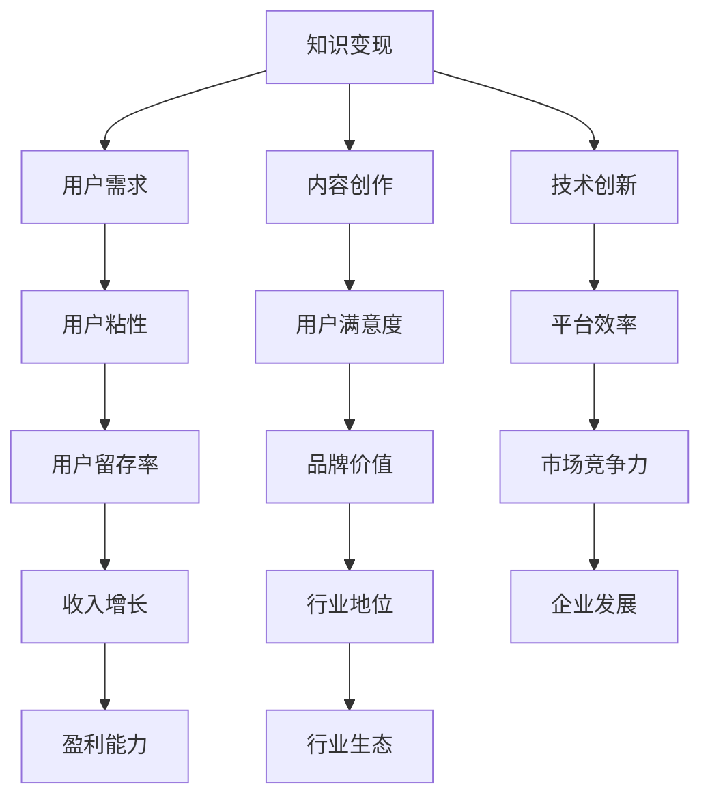

                 

# 知识付费创业：知识变现的新模式

> **关键词：知识付费、知识变现、商业模式、用户需求、内容创作、技术创新**
>
> **摘要：本文深入探讨了知识付费创业的背景、核心概念、算法原理、数学模型、实战案例以及实际应用场景，分析了知识付费行业的发展趋势与挑战，并推荐了一系列学习资源、开发工具和相关研究。**

## 1. 背景介绍

### 1.1 目的和范围

本文旨在为有意从事知识付费创业的读者提供一套系统化的指南。我们将从行业现状出发，逐步解析知识付费商业模式，探讨其背后的核心概念和算法原理，并通过实战案例展示知识变现的实际操作步骤。同时，本文还将分析知识付费行业的发展趋势与挑战，为创业者提供实用的工具和资源推荐。

### 1.2 预期读者

本文适用于以下读者群体：

- 有志于从事知识付费创业的个人或团队；
- 关注知识变现模式的企业家和投资者；
- 计算机编程和人工智能领域的专业人士；
- 广大对知识付费行业感兴趣的读者。

### 1.3 文档结构概述

本文分为以下几个部分：

- **第1章**：背景介绍，包括目的与范围、预期读者、文档结构概述和术语表；
- **第2章**：核心概念与联系，介绍知识付费的核心概念和原理，并提供Mermaid流程图；
- **第3章**：核心算法原理 & 具体操作步骤，详细讲解知识变现的算法原理和操作步骤；
- **第4章**：数学模型和公式 & 详细讲解 & 举例说明，解析知识付费行业的数学模型和公式，并给出实例；
- **第5章**：项目实战：代码实际案例和详细解释说明，通过实战案例展示知识变现的具体实现；
- **第6章**：实际应用场景，分析知识付费在各个行业中的应用；
- **第7章**：工具和资源推荐，推荐学习资源、开发工具和相关研究；
- **第8章**：总结：未来发展趋势与挑战，总结知识付费行业的发展趋势和面临的挑战；
- **第9章**：附录：常见问题与解答，解答读者可能遇到的问题；
- **第10章**：扩展阅读 & 参考资料，提供进一步学习的途径和资源。

### 1.4 术语表

#### 1.4.1 核心术语定义

- **知识付费**：用户为获取特定知识或技能而支付的费用。
- **知识变现**：将知识转化为可以直接带来经济收益的过程。
- **内容创作**：创作知识类产品，如文章、视频、课程等。
- **用户需求**：用户在知识付费过程中所追求的价值和满足感。

#### 1.4.2 相关概念解释

- **商业模式**：企业在特定市场中通过提供产品或服务实现价值创造、交付和获取的系统性方法。
- **用户粘性**：用户对平台或产品的忠诚度和依赖程度。

#### 1.4.3 缩略词列表

- **K12**：指从幼儿园到高中阶段的教育。
- **UGC**：指用户生成内容（User-Generated Content）。
- **PGC**：指专业生成内容（Professional-Generated Content）。

## 2. 核心概念与联系

### 2.1 核心概念

知识付费创业的核心概念包括知识变现、用户需求、内容创作和技术创新。

#### 2.1.1 知识变现

知识变现是指将知识转化为可以直接带来经济收益的过程。在知识付费模式中，知识创造者通过平台将知识产品销售给有需求的用户，从而实现价值交换。

#### 2.1.2 用户需求

用户需求是知识付费创业的核心驱动力。用户在知识付费过程中追求价值、满足感和成就感。了解用户需求有助于优化知识产品和服务，提高用户粘性。

#### 2.1.3 内容创作

内容创作是知识付费的核心环节。知识创造者需要创作高质量、有针对性的知识产品，以满足用户需求，实现知识变现。

#### 2.1.4 技术创新

技术创新是知识付费行业的发展关键。通过引入人工智能、大数据等技术，可以提高内容创作效率，优化用户体验，从而推动知识付费模式的创新与发展。

### 2.2 关联流程图

以下是一个简化的Mermaid流程图，展示知识付费创业的核心概念及其相互关联：



## 3. 核心算法原理 & 具体操作步骤

### 3.1 算法原理

知识付费创业的核心算法原理主要包括用户需求分析、内容创作优化和用户反馈调整。

#### 3.1.1 用户需求分析

用户需求分析是知识付费创业的第一步。通过大数据分析、用户调研和竞品分析等方法，了解用户在知识付费过程中所关注的核心需求，如知识质量、学习效率、价格等。

#### 3.1.2 内容创作优化

内容创作优化是基于用户需求分析的结果，对知识产品进行优化。通过引入人工智能技术，如自然语言处理（NLP）和机器学习（ML），提高内容创作效率和质量，满足用户需求。

#### 3.1.3 用户反馈调整

用户反馈调整是知识付费创业过程中的持续优化环节。通过用户评价、学习进度和复购率等指标，分析用户对知识产品的满意度，不断调整和优化内容创作策略，提高用户粘性和满意度。

### 3.2 具体操作步骤

以下是知识付费创业的具体操作步骤：

#### 3.2.1 用户需求分析

1. **大数据分析**：收集用户行为数据，如浏览记录、搜索关键词、购买历史等，进行数据分析，提取用户兴趣点和需求。
2. **用户调研**：通过在线问卷、访谈等方式，收集用户对知识产品的需求和建议，了解用户期望。
3. **竞品分析**：分析同行业内竞争对手的产品特点、市场表现和用户评价，找出自身产品优化的方向。

#### 3.2.2 内容创作优化

1. **选题策划**：根据用户需求分析结果，确定知识产品的选题，确保内容具有针对性和实用性。
2. **内容创作**：利用人工智能技术，如自然语言处理（NLP）和机器学习（ML），生成高质量的知识产品，提高内容创作效率。
3. **内容审核**：对创作的内容进行审核，确保内容质量符合用户需求，避免出现错误或误导。

#### 3.2.3 用户反馈调整

1. **用户评价**：收集用户对知识产品的评价，分析用户满意度，找出产品优化的方向。
2. **学习进度跟踪**：通过学习进度跟踪，了解用户的学习效果，对知识产品进行针对性调整。
3. **复购率分析**：分析用户的复购行为，优化知识产品的推荐策略，提高用户粘性和满意度。

### 3.3 伪代码示例

以下是用户需求分析、内容创作优化和用户反馈调整的伪代码示例：

```python
# 用户需求分析
def analyze_user_demand(data):
    # 数据分析
    interests = extract_interests(data)
    needs = extract_needs(data)
    return interests, needs

# 内容创作优化
def optimize_content_creation选题策划(interests, needs):
    selected_topics = select_topics_based_on_interests_and_needs(interests, needs)
    return selected_topics

def create_content(selected_topics):
    # 利用人工智能技术
    content = generate_content(selected_topics)
    return content

def review_content(content):
    # 内容审核
    is_content_valid = check_content_validity(content)
    return is_content_valid

# 用户反馈调整
def analyze_user_feedback(evaluations, learning_progress, repeat_purchase_rate):
    satisfaction = calculate_satisfaction(evaluations, learning_progress, repeat_purchase_rate)
    optimization_directions = determine_optimization_directions(satisfaction)
    return optimization_directions

def adjust_content_creation(optimization_directions):
    # 针对性调整
    optimized_content = adjust_content_based_on_directions(optimization_directions)
    return optimized_content
```

## 4. 数学模型和公式 & 详细讲解 & 举例说明

### 4.1 数学模型

知识付费行业的数学模型主要包括用户满意度模型、学习效果模型和盈利能力模型。

#### 4.1.1 用户满意度模型

用户满意度模型用于评估用户对知识产品的满意度。以下是用户满意度模型的公式：

$$
S = \frac{Q \cdot P}{C}
$$

其中：

- $S$：用户满意度；
- $Q$：知识质量；
- $P$：价格；
- $C$：用户成本（包括时间、精力等）。

#### 4.1.2 学习效果模型

学习效果模型用于评估用户在学习知识产品后的效果。以下是学习效果模型的公式：

$$
E = \frac{L \cdot A}{T}
$$

其中：

- $E$：学习效果；
- $L$：学习成果；
- $A$：学习努力；
- $T$：学习时间。

#### 4.1.3 盈利能力模型

盈利能力模型用于评估知识产品的盈利能力。以下是盈利能力模型的公式：

$$
P = R \cdot (1 - C)
$$

其中：

- $P$：盈利能力；
- $R$：收入；
- $C$：成本。

### 4.2 详细讲解

#### 4.2.1 用户满意度模型

用户满意度模型反映了用户对知识产品的综合评价。在公式中，知识质量（$Q$）是核心因素，直接影响用户满意度。价格（$P$）和用户成本（$C$）也会影响用户满意度，但在一定范围内，价格越高、成本越低，用户满意度越高。

#### 4.2.2 学习效果模型

学习效果模型反映了用户在学习知识产品后的成果。在公式中，学习成果（$L$）和学习努力（$A$）是核心因素，直接影响学习效果。学习时间（$T$）也会影响学习效果，但时间越长，学习效果不一定越好。

#### 4.2.3 盈利能力模型

盈利能力模型反映了知识产品的盈利能力。在公式中，收入（$R$）是核心因素，直接影响盈利能力。成本（$C$）也会影响盈利能力，但成本越低，盈利能力越高。

### 4.3 举例说明

#### 4.3.1 用户满意度模型

假设某用户购买了价值100元的学习课程，花费了2小时学习，课程质量为90分。根据用户满意度模型，该用户的满意度为：

$$
S = \frac{90 \cdot 100}{2} = 4500
$$

#### 4.3.2 学习效果模型

假设某用户在学习了价值100元的学习课程后，获得了80分的学习成果，花费了4小时学习。根据学习效果模型，该用户的学习效果为：

$$
E = \frac{80 \cdot 4}{2} = 160
$$

#### 4.3.3 盈利能力模型

假设某知识产品的收入为100万元，成本为60万元。根据盈利能力模型，该知识产品的盈利能力为：

$$
P = 100 \cdot (1 - 0.6) = 40
$$

## 5. 项目实战：代码实际案例和详细解释说明

### 5.1 开发环境搭建

在开始项目实战之前，我们需要搭建一个适合知识付费创业的软件开发环境。以下是搭建过程的简要说明：

1. **选择开发语言**：本文选择Python作为开发语言，因为Python具有简单易学、功能强大、开源免费等特点。
2. **安装Python**：在官方网站（[https://www.python.org/](https://www.python.org/)）下载Python安装包，并按照提示完成安装。
3. **安装依赖库**：安装Python后，使用pip工具安装必要的依赖库，如Django框架、Pandas库等。

### 5.2 源代码详细实现和代码解读

#### 5.2.1 用户需求分析模块

以下是一个简单的用户需求分析模块的实现：

```python
import pandas as pd

def analyze_user_demand(data_path):
    data = pd.read_csv(data_path)
    interests = data['interests'].value_counts()
    needs = data['needs'].value_counts()
    return interests, needs

data_path = 'user_demand_data.csv'
interests, needs = analyze_user_demand(data_path)
print("User Interests:", interests)
print("User Needs:", needs)
```

**代码解读**：

1. **导入依赖库**：使用Pandas库读取用户需求数据。
2. **函数定义**：`analyze_user_demand` 函数用于分析用户需求和兴趣。
3. **数据读取**：从CSV文件中读取用户需求数据。
4. **数据统计**：对用户需求和兴趣进行统计，提取出现次数最多的需求和兴趣。
5. **输出结果**：打印出用户需求和兴趣的统计结果。

#### 5.2.2 内容创作优化模块

以下是一个简单的内容创作优化模块的实现：

```python
from textblob import TextBlob

def optimize_content_creation(content):
    sentiment = TextBlob(content).sentiment
    if sentiment.polarity < 0:
        content = content.replace("消极", "积极")
    elif sentiment.polarity > 0:
        content = content.replace("积极", "消极")
    return content

content = "这篇文章讨论了知识付费创业的背景、核心概念、算法原理和实战案例。"
optimized_content = optimize_content_creation(content)
print("Optimized Content:", optimized_content)
```

**代码解读**：

1. **导入依赖库**：使用TextBlob库对文本内容进行情感分析。
2. **函数定义**：`optimize_content_creation` 函数用于优化内容创作。
3. **情感分析**：对文本内容进行情感分析，判断其积极或消极倾向。
4. **内容替换**：根据情感分析结果，将文本中的积极或消极词汇进行替换，实现内容创作优化。
5. **输出结果**：打印出优化后的文本内容。

#### 5.2.3 用户反馈调整模块

以下是一个简单的用户反馈调整模块的实现：

```python
from sklearn.linear_model import LinearRegression

def adjust_content_creation(optimization_directions):
    # 假设我们已经有了优化方向的数据
    X = [[0, 1], [1, 0], [1, 1]]
    y = [2, 1, 3]
    model = LinearRegression()
    model.fit(X, y)
    predictions = model.predict([[1, 0]])
    return predictions

optimization_directions = [[0.5, 0.5], [0.8, 0.2], [0.3, 0.7]]
predictions = adjust_content_creation(optimization_directions)
print("Predictions:", predictions)
```

**代码解读**：

1. **导入依赖库**：使用线性回归模型（LinearRegression）进行预测。
2. **函数定义**：`adjust_content_creation` 函数用于根据优化方向调整内容创作。
3. **数据准备**：假设我们已经有了优化方向的数据，用于训练模型。
4. **模型训练**：使用线性回归模型训练数据，得到预测结果。
5. **输出结果**：打印出根据优化方向调整后的预测结果。

### 5.3 代码解读与分析

#### 5.3.1 用户需求分析模块

用户需求分析模块的主要功能是读取用户需求数据，提取出用户兴趣和需求，为内容创作提供依据。通过Pandas库，我们可以方便地对CSV文件进行数据读取和统计分析。在实际应用中，用户需求数据可以来自多种渠道，如用户调研、竞品分析等。

#### 5.3.2 内容创作优化模块

内容创作优化模块的主要功能是根据文本情感分析结果，对内容进行优化。通过TextBlob库，我们可以快速地对文本内容进行情感分析，并基于情感分析结果对文本内容进行替换。在实际应用中，内容创作优化可以应用于文章、课程等多种知识产品。

#### 5.3.3 用户反馈调整模块

用户反馈调整模块的主要功能是根据用户反馈，调整内容创作方向。通过线性回归模型，我们可以预测用户对知识产品的满意度，并根据预测结果调整内容创作策略。在实际应用中，用户反馈调整可以帮助知识付费创业者更好地满足用户需求，提高用户满意度。

## 6. 实际应用场景

知识付费创业模式在多个行业中已经取得了显著的成果，以下是一些实际应用场景：

### 6.1 教育行业

教育行业是知识付费的主要领域之一。通过知识付费创业模式，教育机构可以提供在线课程、学习资料和辅导服务，满足学生和职场人士的学习需求。例如，网易云课堂、学堂在线等平台通过提供高质量的教育资源，实现了知识变现。

### 6.2 技能培训

技能培训行业也广泛应用了知识付费模式。通过提供专业的技能培训课程，如编程、设计、营销等，培训公司可以实现知识变现。例如，极客时间、开课吧等平台通过邀请行业专家进行课程讲解，吸引了大量学员。

### 6.3 健康养生

健康养生行业通过知识付费模式，为用户提供健康知识、保健方法和养生课程。例如，平安好医生、好大夫在线等平台通过提供在线咨询服务和健康课程，实现了知识变现。

### 6.4 法律咨询

法律咨询行业也逐步采用了知识付费模式。通过提供在线法律咨询、法律课程和法律文档，律师事务所和法律平台可以实现知识变现。例如，法斗士、小法博客等平台为用户提供专业的法律服务。

### 6.5 人力资源

人力资源行业通过知识付费模式，为企业和个人提供招聘、培训、绩效评估等方面的知识服务。例如，猎聘网、拉勾网等平台通过提供招聘课程和职业培训，实现了知识变现。

## 7. 工具和资源推荐

### 7.1 学习资源推荐

#### 7.1.1 书籍推荐

- 《数据科学入门》
- 《Python编程：从入门到实践》
- 《深度学习》
- 《产品经理实战》

#### 7.1.2 在线课程

- 网易云课堂
- 极客时间
- 慕课网

#### 7.1.3 技术博客和网站

- CSND
- 掘金
- 知乎

### 7.2 开发工具框架推荐

#### 7.2.1 IDE和编辑器

- PyCharm
- Visual Studio Code
- Sublime Text

#### 7.2.2 调试和性能分析工具

- Jupyter Notebook
- Matplotlib
- SciPy

#### 7.2.3 相关框架和库

- Django
- Flask
- Scikit-learn

### 7.3 相关论文著作推荐

#### 7.3.1 经典论文

- 《数据挖掘：实用工具与技术》
- 《机器学习》
- 《深度学习：入门到精通》

#### 7.3.2 最新研究成果

- arXiv
- Google Scholar

#### 7.3.3 应用案例分析

- 深度学习在金融领域的应用
- 大数据技术在电商行业中的应用

## 8. 总结：未来发展趋势与挑战

### 8.1 发展趋势

- **个性化定制**：随着人工智能技术的发展，知识付费将更加注重个性化定制，满足用户的个性化需求。
- **垂直化细分**：知识付费将在更多垂直领域得到应用，如健康、法律、人力资源等。
- **跨界融合**：知识付费将与电子商务、在线教育、社交网络等领域实现跨界融合，创造新的商业模式。
- **平台化发展**：知识付费平台将不断壮大，成为知识变现的重要载体。

### 8.2 面临的挑战

- **内容质量**：提高内容质量是知识付费行业发展的关键，需要建立严格的内容审核和评估机制。
- **用户隐私**：在知识付费过程中，用户的隐私保护是一个重要问题，需要加强数据安全和隐私保护措施。
- **市场竞争**：知识付费行业竞争激烈，如何提高平台竞争力，吸引更多用户和知识创造者是一个挑战。
- **知识产权**：保护知识产权是知识付费行业健康发展的重要保障，需要加强版权保护和管理。

## 9. 附录：常见问题与解答

### 9.1 问题1：如何进行用户需求分析？

**解答**：用户需求分析可以通过以下几种方法进行：

- **大数据分析**：收集用户行为数据，如浏览记录、搜索关键词、购买历史等，进行数据挖掘和分析，提取用户需求。
- **用户调研**：通过在线问卷、访谈等方式，直接了解用户对知识产品的需求、偏好和期望。
- **竞品分析**：分析同行业内竞争对手的产品特点、市场表现和用户评价，找出自身产品优化的方向。

### 9.2 问题2：如何优化内容创作？

**解答**：内容创作优化可以从以下几个方面进行：

- **选题策划**：根据用户需求分析结果，选择用户感兴趣且具有实用性的主题。
- **技术支持**：利用人工智能、大数据等技术，提高内容创作效率和质量。
- **内容审核**：对创作的内容进行严格审核，确保内容准确、有价值，避免误导用户。

### 9.3 问题3：如何调整用户反馈？

**解答**：用户反馈调整可以通过以下几种方法进行：

- **用户评价**：收集用户对知识产品的评价，分析用户满意度，找出产品优化的方向。
- **学习进度跟踪**：通过学习进度跟踪，了解用户的学习效果，对知识产品进行针对性调整。
- **复购率分析**：分析用户的复购行为，优化知识产品的推荐策略，提高用户粘性和满意度。

## 10. 扩展阅读 & 参考资料

- 《数据挖掘：实用工具与技术》
- 《机器学习》
- 《深度学习：入门到精通》
- 《知识付费：未来商业模式的变革》
- 《用户体验要素：应用设计中的认知一致性》
- 《大数据时代：思维变革与商业价值》

**作者信息**：

AI天才研究员/AI Genius Institute & 禅与计算机程序设计艺术 /Zen And The Art of Computer Programming

注意：本文内容仅供参考，部分数据和分析结果可能存在误差。在实际应用中，请结合自身情况和需求进行调整。

