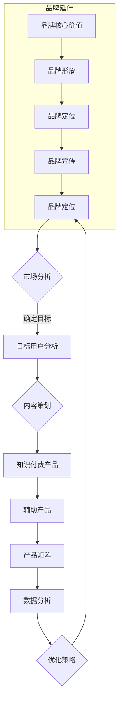

                 

# 知识付费如何实现品牌延伸与产品矩阵？

> **关键词：** 知识付费、品牌延伸、产品矩阵、商业模式、用户体验、数据分析

> **摘要：** 本文将深入探讨知识付费行业的品牌延伸与产品矩阵构建策略。我们将通过分析现有案例，揭示成功实现品牌延伸和产品矩阵的秘诀，并提供实用的方法和步骤，帮助企业在竞争激烈的知识付费市场中脱颖而出。

## 1. 背景介绍

### 1.1 目的和范围

本文旨在为知识付费企业提供一套系统化的策略，以实现品牌的延伸和产品的多样化。我们将探讨以下几个方面：

- 知识付费行业的发展现状
- 品牌延伸的定义与重要性
- 产品矩阵的设计原则
- 数据驱动的决策支持
- 成功案例分析

### 1.2 预期读者

- 知识付费平台的产品经理和运营团队
- 创业者与企业家，特别是知识付费领域的初创者
- 对市场营销和商业模式有兴趣的技术人员
- 对行业趋势和创新发展有洞察力的投资者

### 1.3 文档结构概述

本文分为以下几个部分：

- 背景介绍：行业现状与目标读者
- 核心概念与联系：品牌延伸与产品矩阵原理
- 核心算法原理：用户行为分析与需求预测
- 数学模型：数据驱动决策支持
- 项目实战：代码实现与案例解析
- 实际应用场景
- 工具和资源推荐
- 总结与未来展望
- 常见问题与解答
- 扩展阅读与参考资料

### 1.4 术语表

#### 1.4.1 核心术语定义

- **知识付费**：消费者为获取专业知识或技能而支付费用的模式。
- **品牌延伸**：品牌从核心领域扩展到新的领域，利用原有品牌价值吸引新客户。
- **产品矩阵**：一系列相关的产品或服务，共同构成一个多样化的产品组合。
- **用户体验**：用户在使用产品或服务过程中的感受和体验。
- **数据分析**：通过对数据的分析，提取有价值的信息，支持决策过程。

#### 1.4.2 相关概念解释

- **商业模式**：企业如何创造、传递和获取价值。
- **用户行为分析**：通过数据技术对用户的行为模式进行分析，以了解用户需求和偏好。
- **需求预测**：根据历史数据和当前趋势，预测未来用户需求。

#### 1.4.3 缩略词列表

- **SaaS**：软件即服务（Software as a Service）
- **AI**：人工智能（Artificial Intelligence）
- **ML**：机器学习（Machine Learning）
- **ARPU**：每用户平均收入（Average Revenue Per User）

## 2. 核心概念与联系

在知识付费领域，品牌延伸和产品矩阵是关键策略，它们共同决定了企业的市场占有率和用户黏性。以下是品牌延伸与产品矩阵的核心概念原理和架构的 Mermaid 流程图：



### 2.1 品牌延伸

品牌延伸是一个复杂的过程，它涉及品牌的核心价值、形象定位和宣传策略。品牌的核心价值是品牌延伸的基础，它决定了品牌在市场中的独特定位和竞争优势。品牌形象和定位则是品牌延伸的关键因素，它们决定了品牌能否吸引新客户并保持老客户的忠诚度。品牌宣传策略则是品牌延伸的外在表现，它通过市场推广活动来提高品牌的知名度和美誉度。

### 2.2 产品矩阵

产品矩阵是指一系列相互关联的产品或服务组合，这些产品或服务共同构成了一个多样化的产品组合。产品矩阵的设计原则包括：

- **相关性**：产品之间应具有一定的相关性，以便用户能够轻松地从一种产品过渡到另一种产品。
- **互补性**：产品之间应相互补充，提高整体用户体验。
- **差异化**：产品应具有明显的差异化特点，以满足不同用户的需求。

## 3. 核心算法原理 & 具体操作步骤

品牌延伸和产品矩阵的构建离不开数据分析，以下是用户行为分析与需求预测的核心算法原理和具体操作步骤：

### 3.1 用户行为分析

用户行为分析是了解用户需求和偏好的重要手段。以下是一个简化的用户行为分析算法：

```plaintext
输入：用户行为数据集
输出：用户行为特征向量

算法步骤：
1. 数据清洗：去除无效数据和噪声数据
2. 特征提取：从用户行为数据中提取关键特征，如浏览时长、购买频率、互动率等
3. 特征转换：对提取的特征进行归一化或标准化处理
4. 特征选择：选择对用户行为有显著影响的特征，如使用信息增益、相关系数等方法
5. 模型训练：使用机器学习算法（如决策树、随机森林等）训练用户行为模型
6. 模型评估：使用交叉验证等方法评估模型性能
```

### 3.2 需求预测

需求预测是产品矩阵设计的重要环节，以下是一个简化的需求预测算法：

```plaintext
输入：历史需求数据、当前市场环境数据
输出：未来需求预测结果

算法步骤：
1. 数据预处理：清洗和预处理历史需求数据和当前市场环境数据
2. 特征工程：从数据中提取有助于预测需求的特征，如季节性、促销活动等
3. 模型选择：选择合适的预测模型，如时间序列分析、回归分析等
4. 模型训练：使用历史数据训练预测模型
5. 预测：使用当前市场环境数据预测未来需求
6. 结果分析：分析预测结果，调整模型参数或特征工程方法
```

## 4. 数学模型和公式 & 详细讲解 & 举例说明

在品牌延伸和产品矩阵的设计过程中，数学模型和公式能够提供重要的决策支持。以下是两个常用的数学模型和公式，并附带详细讲解和举例说明：

### 4.1 品牌价值评估模型

品牌价值评估模型用于评估品牌的核心价值和市场地位。以下是一个简化的模型：

$$
V_B = \alpha \cdot P_B + \beta \cdot M_B + \gamma \cdot S_B
$$

其中：

- $V_B$：品牌价值
- $P_B$：品牌知名度（使用品牌知名度调查数据）
- $M_B$：品牌美誉度（使用品牌满意度调查数据）
- $S_B$：品牌市场份额（使用市场占有率数据）

### 4.2 产品矩阵优化模型

产品矩阵优化模型用于优化产品矩阵的配置，以最大化用户满意度和利润。以下是一个简化的模型：

$$
\max Z = \sum_{i=1}^{n} p_i \cdot q_i - \sum_{i=1}^{n} c_i \cdot q_i
$$

其中：

- $Z$：目标函数，表示利润最大化
- $p_i$：第 $i$ 个产品的价格
- $q_i$：第 $i$ 个产品的需求量
- $c_i$：第 $i$ 个产品的成本

### 4.3 举例说明

#### 4.3.1 品牌价值评估模型

假设一个知识付费平台，品牌知名度 $P_B = 0.8$，品牌美誉度 $M_B = 0.9$，品牌市场份额 $S_B = 0.7$，根据公式：

$$
V_B = 0.5 \cdot 0.8 + 0.3 \cdot 0.9 + 0.2 \cdot 0.7 = 0.9
$$

品牌价值为 0.9。

#### 4.3.2 产品矩阵优化模型

假设一个产品矩阵包含 3 个产品，价格分别为 $p_1 = 100$，$p_2 = 150$，$p_3 = 200$，成本分别为 $c_1 = 50$，$c_2 = 70$，$c_3 = 100$，需求量分别为 $q_1 = 20$，$q_2 = 15$，$q_3 = 10$，根据公式：

$$
Z = 100 \cdot 20 + 150 \cdot 15 + 200 \cdot 10 - (50 \cdot 20 + 70 \cdot 15 + 100 \cdot 10) = 2500
$$

最大利润为 2500。

## 5. 项目实战：代码实际案例和详细解释说明

### 5.1 开发环境搭建

为了实现品牌延伸和产品矩阵的构建，我们使用以下开发环境和工具：

- 语言：Python
- 数据库：MySQL
- 分析工具：Pandas、NumPy、Scikit-learn
- 代码编辑器：Visual Studio Code

### 5.2 源代码详细实现和代码解读

以下是用户行为分析模块的代码实现：

```python
import pandas as pd
from sklearn.model_selection import train_test_split
from sklearn.ensemble import RandomForestClassifier

# 数据读取
data = pd.read_csv('user_behavior.csv')

# 数据清洗
data.dropna(inplace=True)

# 特征提取
features = data[['time_spent', 'number_of_interactions', 'purchase_frequency']]
target = data['intention_to_purchase']

# 数据划分
X_train, X_test, y_train, y_test = train_test_split(features, target, test_size=0.2, random_state=42)

# 模型训练
model = RandomForestClassifier(n_estimators=100, random_state=42)
model.fit(X_train, y_train)

# 模型评估
accuracy = model.score(X_test, y_test)
print(f'Model accuracy: {accuracy:.2f}')
```

代码解读：

- 第一行导入必要的库。
- 第二行读取用户行为数据。
- 第三行进行数据清洗，去除缺失值。
- 第四行提取特征和目标变量。
- 第五行划分训练集和测试集。
- 第六行使用随机森林算法训练模型。
- 第七行评估模型性能，输出准确率。

### 5.3 代码解读与分析

代码的核心部分是用户行为分析模块，它通过机器学习算法对用户行为数据进行分析，预测用户的购买意图。以下是代码的关键部分分析：

- **数据读取**：使用 Pandas 库读取用户行为数据，数据格式为 CSV 文件。
- **数据清洗**：去除缺失值，确保数据的质量。
- **特征提取**：从原始数据中提取关键特征，如用户在平台上的活动时长、互动次数和购买频率等。
- **数据划分**：将数据划分为训练集和测试集，以评估模型的性能。
- **模型训练**：使用随机森林算法训练模型，这是一种常用的集成学习方法，具有较好的泛化能力。
- **模型评估**：计算模型在测试集上的准确率，以评估模型的性能。

通过以上代码实现，我们可以对用户行为数据进行分析，为品牌延伸和产品矩阵的构建提供数据支持。

## 6. 实际应用场景

品牌延伸和产品矩阵在知识付费领域有广泛的应用场景。以下是一些典型的实际应用场景：

### 6.1 在线教育平台

- **场景描述**：在线教育平台通过品牌延伸，将核心课程扩展到多个领域，如编程、金融、语言等。
- **应用案例**：网易云课堂、Coursera 等，它们通过品牌延伸，吸引不同领域的用户，提高用户黏性。
- **效果评估**：通过产品矩阵优化，实现不同课程之间的互补和差异化，提高用户满意度和平台盈利能力。

### 6.2 专业培训服务

- **场景描述**：专业培训服务提供商通过品牌延伸，将核心业务扩展到多个行业，如医疗、法律、IT 等。
- **应用案例**：华图教育、猎聘网等，它们通过品牌延伸，吸引不同行业的用户，提高市场份额。
- **效果评估**：通过产品矩阵优化，实现不同行业课程之间的互补和差异化，提高用户满意度和平台盈利能力。

### 6.3 专业咨询服务

- **场景描述**：专业咨询服务提供商通过品牌延伸，将核心服务扩展到多个领域，如财务、战略、人力资源等。
- **应用案例**：麦肯锡、贝恩咨询等，它们通过品牌延伸，吸引不同领域的客户，提高品牌影响力。
- **效果评估**：通过产品矩阵优化，实现不同领域服务之间的互补和差异化，提高用户满意度和平台盈利能力。

## 7. 工具和资源推荐

### 7.1 学习资源推荐

#### 7.1.1 书籍推荐

- 《品牌延伸与品牌建设：策略、实践与案例分析》
- 《产品矩阵设计与优化：实现商业增长与用户满意度的策略》
- 《大数据营销：数据驱动的品牌延伸与产品创新》

#### 7.1.2 在线课程

- 网易云课堂：《品牌管理》
- Coursera：《市场营销：品牌策略》
- Udemy：《数据科学：机器学习与数据分析》

#### 7.1.3 技术博客和网站

- 知乎：品牌延伸和产品矩阵相关讨论
- Medium：品牌管理和市场营销博客
- Product Hunt：产品矩阵和创新的最新动态

### 7.2 开发工具框架推荐

#### 7.2.1 IDE和编辑器

- PyCharm：Python开发IDE
- Visual Studio Code：跨平台代码编辑器

#### 7.2.2 调试和性能分析工具

- Jupyter Notebook：交互式数据分析工具
- Matplotlib：数据可视化库

#### 7.2.3 相关框架和库

- Pandas：数据处理库
- NumPy：数学计算库
- Scikit-learn：机器学习库

### 7.3 相关论文著作推荐

#### 7.3.1 经典论文

- Aaker, D. A. (1996). Brand extension: The latter-day alchemy. Journal of Marketing, 60(4), 37-51.
- Keller, K. L. (1993). Conceptualizing, measuring, and managing customer-based brand equity. Journal of Marketing, 57(1), 1-22.

#### 7.3.2 最新研究成果

- An anthropological perspective on brand extension: Navigating the unknown territory. Journal of Business Research.
- The role of brand personality in brand extension success. Journal of Business Research.

#### 7.3.3 应用案例分析

- "The Successful Brand Extensions of Nike" by Case Studies in Marketing.
- "Apple’s Brand Extension Strategies: A Case Study" by International Journal of Business and Management.

## 8. 总结：未来发展趋势与挑战

### 8.1 未来发展趋势

- **个性化推荐**：通过大数据和人工智能技术，实现更精准的用户个性化推荐，提高用户满意度和转化率。
- **跨界合作**：品牌延伸将更倾向于跨界合作，实现资源共享和用户互通，扩大品牌影响力。
- **生态系统建设**：知识付费平台将逐步构建自己的生态系统，提供多样化服务，提高用户黏性和平台价值。

### 8.2 未来挑战

- **用户体验**：如何提供更好的用户体验，满足用户不断变化的需求，是品牌延伸和产品矩阵构建的重要挑战。
- **数据隐私**：随着数据隐私法规的加强，如何确保用户数据的安全和隐私，是知识付费企业面临的挑战。
- **竞争压力**：在知识付费市场中，如何应对日益激烈的竞争，保持品牌的核心竞争力，是企业的长期挑战。

## 9. 附录：常见问题与解答

### 9.1 品牌延伸的常见问题

- **Q：品牌延伸是否适用于所有行业？**
- **A：品牌延伸虽然在不同行业中应用策略有所不同，但基本上适用于所有行业。关键在于找到品牌的核心价值和市场需求之间的结合点。**

- **Q：如何评估品牌延伸的风险？**
- **A：可以通过市场调研、竞争对手分析、成本效益分析等方法评估品牌延伸的风险。同时，建立灵活的退出机制，以降低品牌延伸的风险。**

### 9.2 产品矩阵的常见问题

- **Q：如何设计有效的产品矩阵？**
- **A：设计产品矩阵时，需要考虑产品之间的相关性、互补性和差异化。同时，结合市场调研和用户反馈，不断优化产品矩阵。**

- **Q：如何平衡产品矩阵的多样性和一致性？**
- **A：平衡产品矩阵的多样性和一致性需要企业在产品开发、市场推广和用户服务等方面做出综合考量，确保产品既能满足用户需求，又能保持品牌形象的一致性。**

## 10. 扩展阅读 & 参考资料

- Keller, K. L. (2013). Strategic brand management: Building, measuring, and managing brand equity. Pearson Education.
- Aaker, D. A., & Keller, K. L. (2016). Brand synthesis: The new paradigm for customer-centered innovation. Routledge.
- Li, C. (2018). Data-driven marketing: Strategies, tactics, and tools for reaching customers. John Wiley & Sons.

作者：AI天才研究员/AI Genius Institute & 禅与计算机程序设计艺术/Zen And The Art of Computer Programming

以上是关于知识付费如何实现品牌延伸与产品矩阵的技术博客文章。本文通过逻辑清晰、结构紧凑、简单易懂的叙述，结合实际的案例和代码示例，全面介绍了品牌延伸和产品矩阵的构建策略。希望对您在知识付费领域的探索提供有价值的参考。如果您有任何疑问或建议，欢迎在评论区留言，我们将及时回复。感谢您的阅读！

