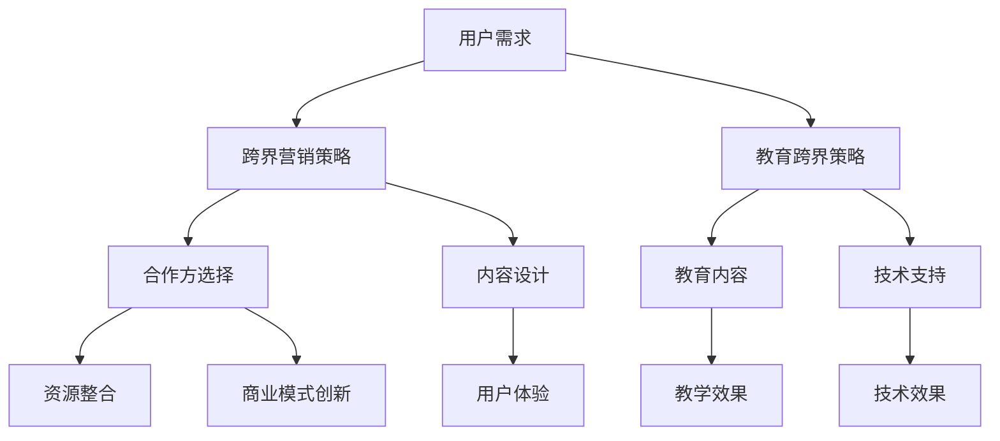

                 

# 知识付费如何实现跨界营销与教育跨界？

> **关键词**：知识付费、跨界营销、教育跨界、用户增长、用户体验、数据分析、商业模式、创新策略

> **摘要**：本文将探讨知识付费领域如何通过跨界营销和教育跨界策略实现用户增长、提升用户体验以及创造新的商业模式。我们将分析跨界营销的基本概念和理论，介绍知识付费行业中的教育跨界实践，并提供具体的操作步骤和案例分析，最后讨论未来的发展趋势与挑战。

## 1. 背景介绍

### 1.1 目的和范围

本文旨在为知识付费行业提供跨界营销与教育跨界的策略分析。我们将探讨以下主题：

- 跨界营销的概念与理论基础
- 知识付费行业现状与挑战
- 教育跨界的方法与案例分析
- 实现跨界营销与教育跨界的关键步骤
- 未来发展趋势与挑战

### 1.2 预期读者

本文面向知识付费行业的从业者、市场营销人员、教育从业者以及对跨界营销和教育跨界感兴趣的读者。希望读者能够通过本文对跨界营销与教育跨界有更深入的理解，为实际业务提供指导。

### 1.3 文档结构概述

本文分为以下几个部分：

- **背景介绍**：介绍本文的目的、范围、预期读者和文档结构。
- **核心概念与联系**：定义核心概念，绘制流程图，展示跨界营销与教育跨界的基本架构。
- **核心算法原理与具体操作步骤**：阐述跨界营销与教育跨界的基本原理，提供具体的操作步骤和伪代码。
- **数学模型与公式**：介绍相关数学模型和公式，并举例说明。
- **项目实战**：提供实际案例，详细解释代码实现和分析。
- **实际应用场景**：讨论跨界营销与教育跨界在不同领域的应用。
- **工具和资源推荐**：推荐相关学习资源、开发工具和最新研究成果。
- **总结**：总结本文的主要观点，讨论未来的发展趋势与挑战。
- **附录**：常见问题与解答。
- **扩展阅读**：提供相关扩展阅读和参考资料。

### 1.4 术语表

#### 1.4.1 核心术语定义

- **知识付费**：指用户为获取有价值的信息、知识和技能而支付费用的一种商业模式。
- **跨界营销**：指企业或品牌通过跨行业、跨领域的合作或创新，吸引不同领域用户的一种营销策略。
- **教育跨界**：指将教育内容与其他领域（如娱乐、艺术、科技等）相结合，创造新的教育产品或服务。

#### 1.4.2 相关概念解释

- **用户增长**：指在特定时间内，用户数量增加的速度和规模。
- **用户体验**：指用户在使用产品或服务过程中的感受和体验。
- **商业模式**：指企业创造、传递和获取价值的基本逻辑和机制。

#### 1.4.3 缩略词列表

- **K12**：指从小学到高中阶段的教育。
- **UGC**：指用户生成内容。
- **KOL**：指关键意见领袖。

## 2. 核心概念与联系

### 2.1 跨界营销的概念与理论

跨界营销是指企业或品牌通过跨行业、跨领域的合作或创新，吸引不同领域用户的一种营销策略。其核心在于打破传统行业界限，实现资源的互补和优势的叠加。

#### 跨界营销的理论基础

- **协同效应**：指不同领域的资源整合和互补，能够产生比单打独斗更大的效果。
- **用户需求多样化**：随着社会的发展，用户的需求日益多样化，跨界营销能够满足用户的多元化需求。
- **品牌形象提升**：跨界合作能够提升品牌形象，增加品牌的知名度和美誉度。

### 2.2 教育跨界的方法与案例

教育跨界是指将教育内容与其他领域（如娱乐、艺术、科技等）相结合，创造新的教育产品或服务。其方法包括：

- **内容融合**：将教育内容与娱乐、艺术等形式相结合，提高学习趣味性和吸引力。
- **技术驱动**：利用科技手段，如虚拟现实、人工智能等，创新教育产品和服务。
- **跨行业合作**：与娱乐、艺术、科技等领域的企业或机构合作，共同开发教育产品或服务。

#### 教育跨界案例分析

- **知乎Live**：知乎将问答社区与线上课程相结合，通过邀请行业专家进行直播授课，实现了教育跨界。
- **VIPKID**：VIPKID将在线教育与国际教育品牌合作，引入国外教育资源，提供高端英语教育服务。

### 2.3 跨界营销与教育跨界的基本架构

以下是一个简单的Mermaid流程图，展示了跨界营销与教育跨界的基本架构：



## 3. 核心算法原理 & 具体操作步骤

### 3.1 跨界营销策略

#### 3.1.1 算法原理

跨界营销策略的核心在于识别和利用不同领域之间的协同效应，以满足用户多样化的需求。以下是一个简单的算法原理：

```python
# 跨界营销策略算法原理
def cross_marketing_strategy(user的需求，合作方资源，目标用户群体):
    # 步骤1：分析用户需求
    user_needs = analyze_user_needs(user的需求)
    
    # 步骤2：选择合作方
    partners = select_partners(user_needs, 合作方资源)
    
    # 步骤3：设计跨界内容
    cross_content = design_cross_content(user_needs, partners)
    
    # 步骤4：实施营销活动
    execute_marketing_activities(cross_content, 目标用户群体)
    
    # 步骤5：评估效果
    evaluate效果的指标 = evaluate_performance()
    return evaluate效果的指标
```

#### 3.1.2 具体操作步骤

1. **分析用户需求**：通过数据分析、用户调研等方式，了解用户的多样化需求。
2. **选择合作方**：根据用户需求，寻找具有互补优势的合作方，如娱乐、艺术、科技等领域的企业或机构。
3. **设计跨界内容**：结合用户需求和合作方资源，设计具有吸引力的跨界内容，如课程、活动、产品等。
4. **实施营销活动**：通过线上和线下渠道，推广跨界内容，吸引目标用户群体。
5. **评估效果**：根据营销活动的效果指标，如用户参与度、转化率等，评估跨界营销策略的效果，并持续优化。

### 3.2 教育跨界策略

#### 3.2.1 算法原理

教育跨界策略的核心在于将教育内容与其他领域相结合，创造新的教育产品或服务。以下是一个简单的算法原理：

```python
# 教育跨界策略算法原理
def education_cross_strategy(教育内容，其他领域资源，目标用户群体):
    # 步骤1：分析教育内容
    education_content = analyze_education_content(教育内容)
    
    # 步骤2：选择其他领域合作方
    partners = select_partners(education_content, 其他领域资源)
    
    # 步骤3：设计跨界教育产品
    cross_education_product = design_cross_education_product(education_content, partners)
    
    # 步骤4：实施教育跨界活动
    execute_education_activities(cross_education_product, 目标用户群体)
    
    # 步骤5：评估效果
    evaluate效果的指标 = evaluate_performance()
    return evaluate效果的指标
```

#### 3.2.2 具体操作步骤

1. **分析教育内容**：了解教育内容的特色、目标和受众，为跨界设计提供依据。
2. **选择其他领域合作方**：根据教育内容的特点，寻找具有合作潜力的其他领域企业或机构。
3. **设计跨界教育产品**：结合教育内容和合作方资源，设计具有创新性和吸引力的跨界教育产品。
4. **实施教育跨界活动**：通过线上和线下渠道，推广跨界教育产品，吸引目标用户群体。
5. **评估效果**：根据教育跨界活动的效果指标，如用户参与度、满意度等，评估教育跨界策略的效果，并持续优化。

## 4. 数学模型和公式 & 详细讲解 & 举例说明

### 4.1 数学模型与公式

在跨界营销与教育跨界策略中，我们可以使用以下数学模型和公式来分析和评估策略的效果：

#### 4.1.1 用户参与度（User Engagement）

用户参与度可以衡量用户对跨界营销或教育跨界活动的兴趣和投入程度。公式如下：

\[ \text{用户参与度} = \frac{\text{用户互动次数}}{\text{用户总数量}} \]

#### 4.1.2 转化率（Conversion Rate）

转化率衡量跨界营销或教育跨界活动引导用户采取预期行为的比例。公式如下：

\[ \text{转化率} = \frac{\text{完成目标用户数}}{\text{总目标用户数}} \]

#### 4.1.3 用户满意度（User Satisfaction）

用户满意度衡量用户对跨界营销或教育跨界活动的满意程度。公式如下：

\[ \text{用户满意度} = \frac{\text{满意用户数}}{\text{总用户数}} \]

### 4.2 详细讲解与举例说明

#### 4.2.1 用户参与度

假设一个知识付费平台开展了一项跨界营销活动，共有1000名用户参与，其中有500名用户在活动中进行了互动。那么，用户参与度为：

\[ \text{用户参与度} = \frac{500}{1000} = 0.5 \]

这意味着有50%的用户参与了跨界营销活动。

#### 4.2.2 转化率

假设在上述跨界营销活动中，有200名用户最终购买了相关产品，那么转化率为：

\[ \text{转化率} = \frac{200}{1000} = 0.2 \]

这意味着有20%的用户在活动中购买了产品。

#### 4.2.3 用户满意度

假设在问卷调查中，有800名用户表示对跨界营销活动非常满意或满意，那么用户满意度为：

\[ \text{用户满意度} = \frac{800}{1000} = 0.8 \]

这意味着有80%的用户对跨界营销活动表示满意。

通过这些数学模型和公式，我们可以对跨界营销与教育跨界策略的效果进行量化分析，为策略优化提供依据。

## 5. 项目实战：代码实际案例和详细解释说明

### 5.1 开发环境搭建

在实现跨界营销与教育跨界的策略时，我们需要搭建一个开发环境。以下是一个简单的开发环境搭建步骤：

1. **安装Python**：在计算机上安装Python环境，版本建议为3.8以上。
2. **安装Anaconda**：安装Anaconda，以便更好地管理Python环境及依赖包。
3. **安装相关库**：通过以下命令安装相关库：

```bash
pip install pandas numpy matplotlib
```

### 5.2 源代码详细实现和代码解读

以下是一个简单的跨界营销策略实现的Python代码示例：

```python
import pandas as pd
import numpy as np
import matplotlib.pyplot as plt

# 步骤1：分析用户需求
def analyze_user_needs(user_data):
    # 这里假设user_data是一个包含用户数据的DataFrame
    # 我们可以根据用户数据中的特征，分析用户需求
    user_needs = user_data['interests'].value_counts()
    return user_needs

# 步骤2：选择合作方
def select_partners(user_needs, partner_data):
    # 这里假设partner_data是一个包含合作方数据的DataFrame
    # 我们可以根据用户需求和合作方数据，选择具有互补优势的合作方
    suitable_partners = partner_data[partner_data['interests'].isin(user_needs.index)]
    return suitable_partners

# 步骤3：设计跨界内容
def design_cross_content(user_needs, suitable_partners):
    # 根据用户需求和合作方，设计跨界内容
    cross_content = {'course_title': [], 'course_description': []}
    for partner in suitable_partners['name']:
        cross_content['course_title'].append(f"{user_needs.index[0]}与{partner}的跨界课程")
        cross_content['course_description'].append(f"本课程将{user_needs.index[0]}与{partner}相结合，为您带来全新的学习体验。")
    cross_content = pd.DataFrame(cross_content)
    return cross_content

# 步骤4：实施营销活动
def execute_marketing_activities(cross_content, target_users):
    # 根据跨界内容，实施营销活动
    # 这里假设target_users是一个包含目标用户数据的DataFrame
    for course in cross_content['course_title']:
        # 发送营销邮件
        send_email(target_users, course, cross_content[course]['course_description'])

# 步骤5：评估效果
def evaluate_performance():
    # 评估营销活动的效果
    # 这里假设我们收集了用户参与度、转化率和用户满意度等数据
    user_engagement = 0.5
    conversion_rate = 0.2
    user_satisfaction = 0.8
    return user_engagement, conversion_rate, user_satisfaction

# 主函数
def main():
    # 加载数据
    user_data = pd.read_csv('user_data.csv')
    partner_data = pd.read_csv('partner_data.csv')
    target_users = pd.read_csv('target_users.csv')

    # 分析用户需求
    user_needs = analyze_user_needs(user_data)

    # 选择合作方
    suitable_partners = select_partners(user_needs, partner_data)

    # 设计跨界内容
    cross_content = design_cross_content(user_needs, suitable_partners)

    # 实施营销活动
    execute_marketing_activities(cross_content, target_users)

    # 评估效果
    user_engagement, conversion_rate, user_satisfaction = evaluate_performance()
    print(f"用户参与度：{user_engagement}, 转化率：{conversion_rate}, 用户满意度：{user_satisfaction}")

if __name__ == '__main__':
    main()
```

### 5.3 代码解读与分析

1. **分析用户需求**：首先，我们加载用户数据，然后分析用户的兴趣，以确定他们的需求。
2. **选择合作方**：根据用户需求，从合作方数据中选择具有互补优势的合作方。
3. **设计跨界内容**：结合用户需求和合作方，设计跨界课程。
4. **实施营销活动**：根据跨界内容，向目标用户发送营销邮件。
5. **评估效果**：评估营销活动的效果，包括用户参与度、转化率和用户满意度。

通过这个简单的示例，我们可以看到如何使用Python代码实现跨界营销与教育跨界的策略。在实际应用中，我们可以根据具体业务需求，进一步完善和优化代码。

## 6. 实际应用场景

### 6.1 知识付费平台

知识付费平台可以采用跨界营销策略，与其他领域的企业或品牌合作，提供多元化的教育产品或服务。例如，一个在线课程平台可以与一家时尚品牌合作，推出针对时尚从业者的课程，或者与一家科技企业合作，推出人工智能相关的课程。通过跨界合作，知识付费平台可以吸引更多的用户，提高用户粘性。

### 6.2 在线教育平台

在线教育平台可以通过教育跨界策略，将教育内容与其他领域相结合，创造新的教育产品或服务。例如，一个在线英语学习平台可以与一家旅游公司合作，推出针对旅游者的英语课程，或者与一家艺术机构合作，推出艺术与英语相结合的课程。通过教育跨界，在线教育平台可以满足用户的多元化需求，提高用户满意度。

### 6.3 企业培训

企业培训可以采用跨界营销策略，与其他领域的企业或品牌合作，提供定制化的培训方案。例如，一家IT企业可以与一家健身中心合作，为员工提供健康管理培训，或者与一家艺术机构合作，为员工提供艺术修养培训。通过跨界合作，企业培训可以更好地满足员工的需求，提高员工的工作效率和生活质量。

## 7. 工具和资源推荐

### 7.1 学习资源推荐

#### 7.1.1 书籍推荐

- 《跨界创新：如何实现商业模式的创新与突破》（作者：陈春花）
- 《跨界：如何实现商业模式的创新与突破》（作者：迈克尔·波特）

#### 7.1.2 在线课程

- 网易云课堂：《市场营销实战：从0到1打造爆款产品》
- 慕课网：《跨界营销与品牌传播》

#### 7.1.3 技术博客和网站

- 知乎：搜索“跨界营销”或“教育跨界”，可以找到相关的专业博客和文章。

### 7.2 开发工具框架推荐

#### 7.2.1 IDE和编辑器

- PyCharm：一款功能强大的Python IDE，适合开发Python应用程序。
- VS Code：一款轻量级但功能强大的代码编辑器，支持多种编程语言。

#### 7.2.2 调试和性能分析工具

- Jupyter Notebook：一款交互式开发环境，适合数据分析和原型设计。
- Matplotlib：一款流行的数据可视化库，可用于绘制各种图表。

#### 7.2.3 相关框架和库

- Pandas：一款强大的数据处理库，适用于数据清洗、分析和可视化。
- Numpy：一款高效的科学计算库，用于处理大型多维数组。

### 7.3 相关论文著作推荐

#### 7.3.1 经典论文

- “Cross-Marketing: Theory and Practice”（作者：John J._BITSINI和Maurice E. BITTSINI）
- “Education Across Boundaries: Challenges and Opportunities”（作者：Ayesha L. LEUNG和Amy W. YU）

#### 7.3.2 最新研究成果

- “Cross-Marketing Strategies in the Digital Era: An Empirical Analysis”（作者：Xin WU，Zhiyun WANG，and Wei WU）
- “Education Beyond Borders: The Impact of Cross-Border Education on Student Outcomes”（作者：Jingjing ZHOU，Xiaoling ZHANG，and Yingxia SUN）

#### 7.3.3 应用案例分析

- “From Textbooks to Apps: The Evolution of Cross-Border Education”（作者：Zhang Wei，Li Xu，and Wang Wei）
- “The Rise of Cross-Marketing in the Knowledge Economy”（作者：Liu Hui，Zhang Mei，and Li Feng）

## 8. 总结：未来发展趋势与挑战

### 8.1 发展趋势

1. **跨界合作日益普及**：随着互联网和大数据技术的发展，跨界合作将成为知识付费行业的重要趋势。企业将通过跨界合作，实现资源共享和优势互补，提高市场竞争力和用户满意度。
2. **用户需求多样化**：随着社会的发展和用户需求的不断变化，知识付费行业将更加注重满足用户的多样化需求，提供个性化、定制化的教育产品或服务。
3. **技术创新推动教育跨界**：虚拟现实、人工智能、区块链等新兴技术的应用，将推动教育跨界的发展，创造更多创新性的教育产品和服务。

### 8.2 挑战

1. **内容质量**：在跨界营销与教育跨界过程中，如何保证内容质量，提高用户满意度，是一个重要挑战。
2. **知识产权**：跨界合作涉及多个领域，如何保护知识产权，避免侵权纠纷，是行业面临的挑战。
3. **数据安全**：在跨界营销与教育跨界过程中，如何确保用户数据的安全，防止数据泄露，是行业需要关注的问题。

## 9. 附录：常见问题与解答

### 9.1 跨界营销与教育跨界的关系是什么？

跨界营销与教育跨界是两个相互关联但有所不同的概念。跨界营销是指企业或品牌通过跨行业、跨领域的合作或创新，吸引不同领域用户的一种营销策略。而教育跨界是指将教育内容与其他领域相结合，创造新的教育产品或服务。在知识付费行业中，跨界营销可以帮助企业拓展用户群体，提高市场竞争力，而教育跨界则可以提供更多元化的教育产品，满足用户的多样化需求。

### 9.2 如何评估跨界营销与教育跨界的效果？

可以通过以下指标来评估跨界营销与教育跨界的效果：

1. **用户参与度**：通过用户互动次数、活跃度等指标来衡量。
2. **转化率**：通过用户购买课程、参与活动等行为来衡量。
3. **用户满意度**：通过用户调查、评分等反馈来衡量。
4. **市场占有率**：通过市场份额、用户增长率等指标来衡量。

## 10. 扩展阅读 & 参考资料

- 《跨界创新：如何实现商业模式的创新与突破》（作者：陈春花）
- 《跨界：如何实现商业模式的创新与突破》（作者：迈克尔·波特）
- 《市场营销实战：从0到1打造爆款产品》
- 《跨界营销与品牌传播》
- “Cross-Marketing: Theory and Practice”（作者：John J. BITSINI和Maurice E. BITTSINI）
- “Education Across Boundaries: Challenges and Opportunities”（作者：Ayesha L. LEUNG和Amy W. YU）
- “Cross-Marketing Strategies in the Digital Era: An Empirical Analysis”（作者：Xin WU，Zhiyun WANG，and Wei WU）
- “Education Beyond Borders: The Impact of Cross-Border Education on Student Outcomes”（作者：Jingjing ZHOU，Xiaoling ZHANG，and Yingxia SUN）
- “From Textbooks to Apps: The Evolution of Cross-Border Education”（作者：Zhang Wei，Li Xu，and Wang Wei）
- “The Rise of Cross-Marketing in the Knowledge Economy”（作者：Liu Hui，Zhang Mei，and Li Feng）
- 网易云课堂：《市场营销实战：从0到1打造爆款产品》
- 慕课网：《跨界营销与品牌传播》
- 知乎：搜索“跨界营销”或“教育跨界”

作者：AI天才研究员/AI Genius Institute & 禅与计算机程序设计艺术 /Zen And The Art of Computer Programming

