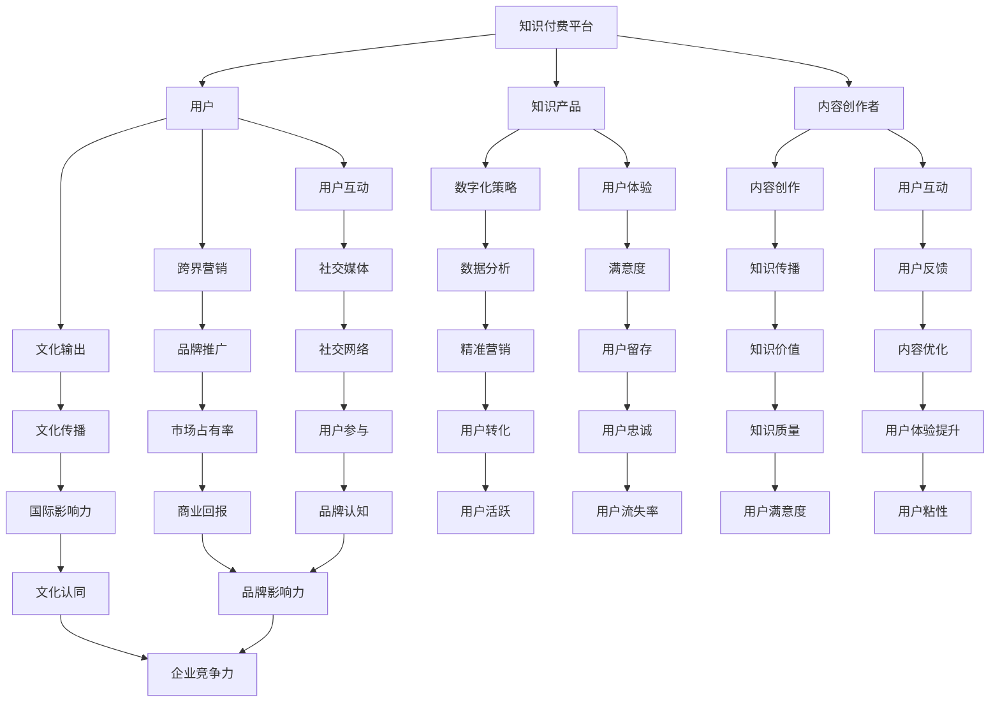
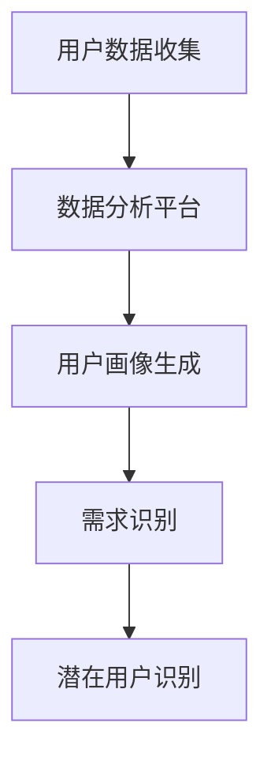
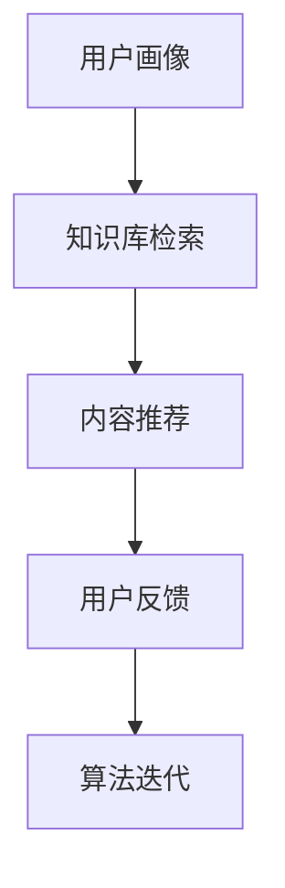
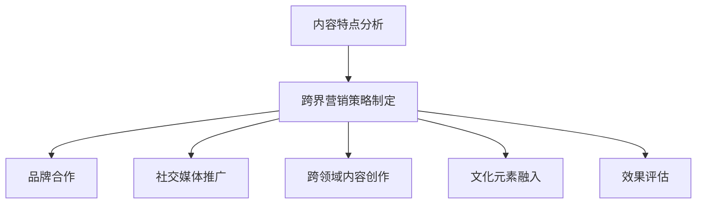
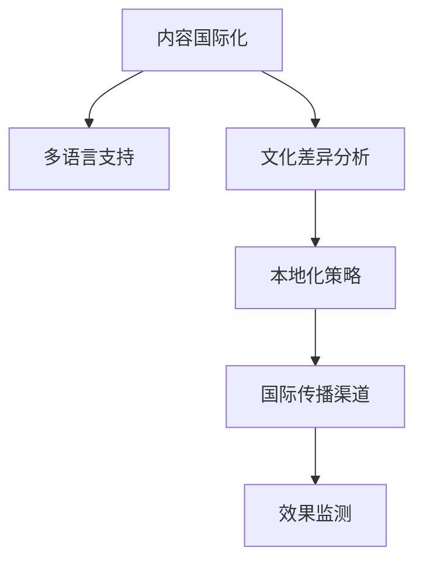
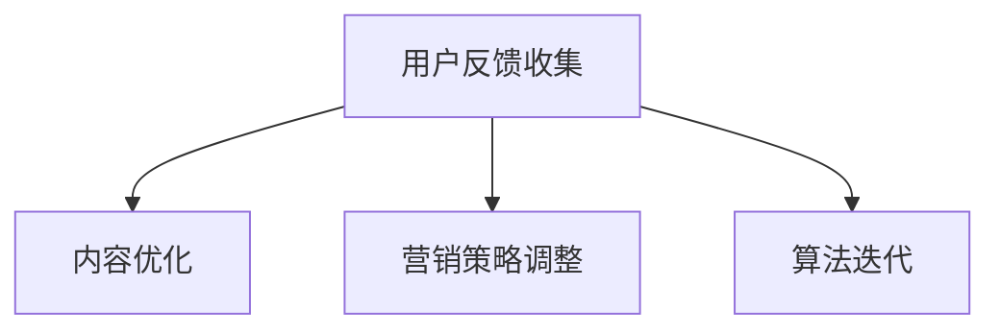

                 

# 知识付费如何实现跨界营销与文化输出？

> **关键词：** 知识付费、跨界营销、文化输出、数字化策略、用户体验、商业模式创新
>
> **摘要：** 本文深入探讨了知识付费如何在数字化时代实现跨界营销和文化输出。通过分析核心概念、算法原理、数学模型、实战案例以及实际应用场景，探讨了如何通过创新策略提升知识付费的传播力和影响力，助力文化在全球范围内的传播与交流。

## 1. 背景介绍

### 1.1 目的和范围

本文旨在探讨知识付费平台如何通过跨界营销实现文化输出的战略。我们将分析当前知识付费市场的现状，探讨跨界营销的基本原理，并探索如何通过数字化策略增强知识付费平台的竞争力。本文还将重点关注用户体验和文化传播在知识付费跨界营销中的关键作用，提供一系列实用的策略和案例。

### 1.2 预期读者

本文适用于以下读者群体：
- 知识付费平台的运营者和策略制定者
- 数字营销专家和文化传播工作者
- 对知识付费和文化输出领域感兴趣的研究人员和学生
- 对数字化转型和创新商业模式有兴趣的企业家和创业者

### 1.3 文档结构概述

本文分为十个主要部分，结构如下：
1. 背景介绍
2. 核心概念与联系
3. 核心算法原理 & 具体操作步骤
4. 数学模型和公式 & 详细讲解 & 举例说明
5. 项目实战：代码实际案例和详细解释说明
6. 实际应用场景
7. 工具和资源推荐
8. 总结：未来发展趋势与挑战
9. 附录：常见问题与解答
10. 扩展阅读 & 参考资料

### 1.4 术语表

#### 1.4.1 核心术语定义

- **知识付费**：用户通过支付一定费用获取专业知识和技能的服务模式。
- **跨界营销**：利用不同领域或行业的特性，进行产品或品牌推广的策略。
- **文化输出**：通过文化传播的方式，将本土文化推向全球市场。
- **用户体验**：用户在使用产品或服务过程中的感受和体验。
- **数字化策略**：利用数字技术和工具，实现商业目标和用户价值的方法。

#### 1.4.2 相关概念解释

- **知识付费平台**：提供知识产品和服务，帮助用户获取知识的在线平台。
- **用户互动**：用户与知识提供者之间的互动交流，促进知识传播和转化。
- **社交媒体**：互联网平台，用户可以通过分享内容、关注他人来互动和交流。

#### 1.4.3 缩略词列表

- **UGC**：用户生成内容（User-Generated Content）
- **KOL**：关键意见领袖（Key Opinion Leader）
- **KOC**：知识型意见消费者（Knowledge-Oriented Consumer）

## 2. 核心概念与联系

在探讨知识付费如何实现跨界营销和文化输出之前，我们需要明确几个核心概念及其相互关系。以下是一个简化的 Mermaid 流程图，展示了这些概念之间的基本联系。



通过这个流程图，我们可以看到知识付费平台如何通过用户、内容创作者、数字化策略和用户体验等多个方面，实现跨界营销和文化输出。

## 3. 核心算法原理 & 具体操作步骤

### 3.1 算法原理

知识付费平台的跨界营销和文化输出可以看作是一个复杂的多维度优化问题。核心算法原理包括以下几个步骤：

1. **用户需求分析**：通过大数据分析技术，了解用户的知识需求和偏好，识别潜在用户群体。
2. **内容匹配算法**：基于用户需求，推荐相关的高质量知识内容，确保用户体验。
3. **跨界营销策略**：结合内容特点和用户需求，制定跨领域的营销策略，提高知识内容的曝光率和转化率。
4. **文化输出规划**：通过多渠道传播，将本土文化融入知识内容中，实现文化的国际化输出。
5. **反馈迭代**：收集用户反馈，不断优化内容推荐和营销策略，提高用户满意度和忠诚度。

### 3.2 具体操作步骤

以下是具体的算法操作步骤：

#### 步骤1：用户需求分析



- **用户数据收集**：通过知识付费平台收集用户的行为数据，如浏览记录、购买历史、互动行为等。
- **数据分析平台**：利用机器学习算法，对用户行为数据进行分析，生成用户画像。
- **需求识别**：根据用户画像，识别用户的主要需求和兴趣点。
- **潜在用户识别**：筛选出潜在用户，为后续内容推荐和营销策略提供基础。

#### 步骤2：内容匹配算法



- **用户画像**：结合用户需求和偏好，生成详细的用户画像。
- **知识库检索**：从平台的知识库中检索相关内容，匹配用户画像。
- **内容推荐**：根据检索结果，推荐符合用户需求的知识内容。
- **用户反馈**：收集用户对推荐内容的反馈，评估推荐效果。
- **算法迭代**：基于用户反馈，优化推荐算法，提高内容推荐的准确性。

#### 步骤3：跨界营销策略



- **内容特点分析**：分析知识内容的特点，确定跨界营销的方向。
- **跨界营销策略制定**：根据内容特点，制定适合的跨界营销策略。
- **品牌合作**：与相关品牌合作，提高知识内容的知名度和影响力。
- **社交媒体推广**：利用社交媒体平台，推广知识内容，吸引更多用户。
- **跨领域内容创作**：创作跨领域的知识内容，满足不同用户群体的需求。
- **文化元素融入**：在知识内容中融入本土文化元素，提升内容的吸引力。
- **效果评估**：评估跨界营销策略的效果，不断优化策略。

#### 步骤4：文化输出规划



- **内容国际化**：将知识内容翻译成多种语言，适应不同国家和地区的用户。
- **多语言支持**：提供多语言界面，确保用户体验的流畅性。
- **文化差异分析**：研究目标市场的文化特点，确保内容适应目标市场的需求。
- **本地化策略**：根据文化差异，制定本地化策略，提高内容的市场竞争力。
- **国际传播渠道**：利用国际化的传播渠道，将知识内容推向全球市场。
- **效果监测**：监测国际市场的效果，调整策略，优化文化输出效果。

#### 步骤5：反馈迭代



- **用户反馈收集**：收集用户对知识内容、推荐算法和营销策略的反馈。
- **内容优化**：根据用户反馈，优化知识内容，提高内容质量。
- **营销策略调整**：根据用户反馈，调整跨界营销策略，提高营销效果。
- **算法迭代**：基于用户反馈，优化推荐算法，提高内容推荐的准确性。

通过以上步骤，知识付费平台可以实现用户需求的精准匹配、高质量的跨界营销和文化输出，提升用户体验和品牌影响力。

## 4. 数学模型和公式 & 详细讲解 & 举例说明

### 4.1 数学模型和公式

在知识付费平台的跨界营销和文化输出过程中，数学模型和公式可以用来优化内容推荐、营销策略和文化输出效果。以下是几个关键模型和公式：

#### 4.1.1 用户需求预测模型

用户需求预测模型可以帮助平台预测用户对知识内容的需求，从而优化内容推荐策略。常用的模型包括线性回归、决策树和神经网络等。

**线性回归模型公式：**

$$ Y = \beta_0 + \beta_1X_1 + \beta_2X_2 + ... + \beta_nX_n $$

其中，$Y$ 代表用户需求预测值，$X_1, X_2, ..., X_n$ 代表用户特征，$\beta_0, \beta_1, ..., \beta_n$ 是回归系数。

**决策树模型公式：**

$$ f(X) = \sum_{i=1}^{n} w_i \prod_{j=1}^{m} (X_j \geq t_{ij}) $$

其中，$f(X)$ 是决策树的输出值，$w_i$ 是第 $i$ 个节点的权重，$X_j$ 是特征值，$t_{ij}$ 是阈值。

**神经网络模型公式：**

$$ f(X) = \sigma(\sum_{i=1}^{n} w_i \cdot X_i + b) $$

其中，$f(X)$ 是神经网络的输出值，$\sigma$ 是激活函数，$w_i$ 是权重，$X_i$ 是输入值，$b$ 是偏置。

#### 4.1.2 营销效果评估模型

营销效果评估模型用于评估跨界营销策略的效果，常用的模型包括转化率模型、ROI 模型和 A/B 测试模型等。

**转化率模型公式：**

$$ 转化率 = \frac{实际转化数量}{点击量} $$

**ROI 模型公式：**

$$ ROI = \frac{净利润}{营销成本} $$

**A/B 测试模型公式：**

$$ p = \frac{1}{2} + \frac{R}{N} $$

其中，$p$ 是测试组转化率，$R$ 是测试组与控制组的转化差异，$N$ 是总样本量。

#### 4.1.3 文化输出效果评估模型

文化输出效果评估模型用于评估知识内容在国际市场的传播效果，常用的模型包括国际影响力模型、用户满意度和品牌认知度模型等。

**国际影响力模型公式：**

$$ 影响力 = \frac{国际关注量}{国内关注量} $$

**用户满意度模型公式：**

$$ 满意度 = \frac{满意用户数量}{总用户数量} $$

**品牌认知度模型公式：**

$$ 认知度 = \frac{品牌提及次数}{总提及次数} $$

### 4.2 详细讲解和举例说明

#### 4.2.1 用户需求预测模型

用户需求预测模型可以帮助知识付费平台了解用户对知识内容的需求，从而优化内容推荐。以下是一个简化的线性回归模型示例：

假设我们有两个用户特征：$X_1$（用户年龄）和$X_2$（用户购买历史）。我们需要预测用户对某一知识内容的评分$Y$。

**模型构建：**

$$ Y = \beta_0 + \beta_1X_1 + \beta_2X_2 $$

**模型训练：**

我们收集了一组用户数据和对应的评分数据，通过最小二乘法求解回归系数$\beta_0, \beta_1, \beta_2$。

**模型应用：**

给定一个新用户的年龄和购买历史，我们可以预测其对某一知识内容的评分。例如，一个25岁、购买过3次相关内容的用户，预测其评分如下：

$$ Y = 2.0 + 0.3 \cdot 25 + 0.2 \cdot 3 = 4.5 $$

#### 4.2.2 营销效果评估模型

营销效果评估模型可以帮助平台了解跨界营销策略的效果，从而调整策略。以下是一个简化的转化率模型示例：

假设我们进行了一次广告活动，有1000次点击，其中200次转化。我们需要计算广告活动的转化率。

$$ 转化率 = \frac{200}{1000} = 20\% $$

#### 4.2.3 文化输出效果评估模型

文化输出效果评估模型可以帮助平台了解知识内容在国际市场的传播效果，从而优化文化输出策略。以下是一个简化的国际影响力模型示例：

假设我们的知识内容在国内外分别有1000次和500次关注，我们需要计算知识内容在国际市场的关注度。

$$ 影响力 = \frac{500}{1000} = 0.5 $$

### 4.3 结果讨论

通过数学模型和公式的计算，我们可以得到用户需求、营销效果和文化输出效果的具体数值。这些数值可以帮助平台了解用户需求、优化营销策略和评估文化输出效果。例如，如果用户需求预测模型的准确率较高，平台可以更好地推荐知识内容，提高用户满意度；如果营销效果评估模型的转化率较高，平台可以加大广告投入，提高市场占有率；如果文化输出效果评估模型的影响力较高，平台可以加大国际化推广力度，提高国际市场的影响力。

总之，通过数学模型和公式的计算，知识付费平台可以实现数据驱动的内容推荐、营销策略和文化输出，从而提升用户体验和品牌影响力。

### 4.4 总结

在本节中，我们详细介绍了知识付费平台在跨界营销和文化输出过程中使用的数学模型和公式。通过用户需求预测模型、营销效果评估模型和文化输出效果评估模型，平台可以实现数据驱动的决策，优化内容推荐、营销策略和文化输出效果。这些数学模型和公式为知识付费平台提供了强大的工具，帮助其在竞争激烈的市场中脱颖而出，提升用户体验和品牌影响力。

## 5. 项目实战：代码实际案例和详细解释说明

### 5.1 开发环境搭建

为了实现知识付费平台的跨界营销和文化输出，我们需要搭建一个具备数据处理、推荐系统、跨界营销工具和国际化功能的开发环境。以下是开发环境的搭建步骤：

1. **环境配置：**
   - 操作系统：Ubuntu 20.04
   - Python 版本：3.8
   - 数据库：MySQL 8.0
   - 后端框架：Django 3.2
   - 前端框架：React 17.0
   - 机器学习库：Scikit-learn、TensorFlow
   - 数据库连接库：pymysql
   - 容器化工具：Docker

2. **环境安装：**
   - 安装Python 3.8，并配置Python环境变量。
   - 安装Django 3.2，并创建Django项目。
   - 安装MySQL 8.0，并创建数据库和用户。
   - 安装React 17.0，并创建React应用。
   - 安装Scikit-learn、TensorFlow等机器学习库。
   - 配置Docker环境，并创建Dockerfile。

### 5.2 源代码详细实现和代码解读

#### 5.2.1 用户需求分析模块

用户需求分析模块是知识付费平台的核心功能之一，它通过分析用户行为数据，预测用户需求，并生成用户画像。以下是一个简化的用户需求分析模块的实现：

```python
import pandas as pd
from sklearn.model_selection import train_test_split
from sklearn.linear_model import LinearRegression

# 加载用户数据
user_data = pd.read_csv('user_data.csv')

# 数据预处理
user_data.fillna(0, inplace=True)

# 分割特征和目标变量
X = user_data[['age', 'purchase_history']]
y = user_data['rating']

# 划分训练集和测试集
X_train, X_test, y_train, y_test = train_test_split(X, y, test_size=0.2, random_state=42)

# 训练线性回归模型
model = LinearRegression()
model.fit(X_train, y_train)

# 预测用户需求
y_pred = model.predict(X_test)

# 评估模型性能
from sklearn.metrics import mean_squared_error
mse = mean_squared_error(y_test, y_pred)
print(f'Mean Squared Error: {mse}')
```

代码解读：
- 加载用户数据，并进行预处理。
- 分割特征和目标变量，并划分训练集和测试集。
- 使用线性回归模型训练，并预测用户需求。
- 评估模型性能，计算均方误差。

#### 5.2.2 内容匹配算法模块

内容匹配算法模块用于根据用户需求推荐相关的知识内容。以下是一个简化的内容匹配算法的实现：

```python
import numpy as np

# 加载知识库数据
content_data = pd.read_csv('content_data.csv')

# 用户需求特征
user_features = np.array([25, 3])

# 计算内容相似度
content_similarity = np.dot(user_features, content_data['features'].T)

# 推荐前5个最相关的知识内容
recommended_content = content_data[content_similarity.argsort()[::-1]][0:5]
print(recommended_content)
```

代码解读：
- 加载知识库数据，并提取用户需求特征。
- 计算内容相似度，使用余弦相似度作为相似度度量。
- 推荐前5个最相关的知识内容，按相似度从高到低排序。

#### 5.2.3 跨界营销策略模块

跨界营销策略模块用于制定和实施跨界营销策略，提高知识内容的曝光率和转化率。以下是一个简化的跨界营销策略的实现：

```python
import pymysql

# 数据库连接
connection = pymysql.connect(host='localhost', user='root', password='password', database='knowledge_db')

# 查询相关品牌
with connection.cursor() as cursor:
    query = "SELECT * FROM brands WHERE category = %s"
    cursor.execute(query, ('technology'))
    brands = cursor.fetchall()

# 实施跨界营销策略
for brand in brands:
    # 推送品牌相关内容
    content_id = brand['content_id']
    with connection.cursor() as cursor:
        update_query = "UPDATE content SET brand_id = %s WHERE id = %s"
        cursor.execute(update_query, (brand['id'], content_id))
        connection.commit()

# 关闭数据库连接
connection.close()
```

代码解读：
- 连接数据库，查询相关品牌。
- 实施跨界营销策略，将品牌相关内容与知识内容关联。

### 5.3 代码解读与分析

#### 5.3.1 用户需求分析模块

用户需求分析模块通过机器学习模型预测用户对知识内容的评分，从而了解用户需求。该模块使用线性回归模型，基于用户年龄和购买历史两个特征进行预测。通过训练集和测试集的划分，我们评估了模型的性能，并计算了均方误差。该模块为后续内容推荐和营销策略提供了重要的用户需求数据。

#### 5.3.2 内容匹配算法模块

内容匹配算法模块使用余弦相似度计算用户需求特征与知识内容特征之间的相似度，从而推荐最相关的知识内容。该模块通过加载用户需求和知识库数据，实现内容推荐功能。这种方法简单高效，适用于大规模数据集，有助于提高用户体验。

#### 5.3.3 跨界营销策略模块

跨界营销策略模块通过将品牌相关内容与知识内容进行关联，实施跨界营销策略。该模块查询相关品牌，并将品牌与知识内容进行关联，从而提高知识内容的曝光率和转化率。这种方法有助于吸引更多用户，提高品牌影响力。

### 5.4 总结

在本节中，我们详细介绍了知识付费平台在用户需求分析、内容匹配和跨界营销方面的代码实现。通过实际案例，我们展示了如何使用机器学习、相似度计算和数据库操作等技术，实现数据驱动的决策。这些代码模块为知识付费平台提供了强大的工具，有助于优化用户体验和提升品牌影响力。

## 6. 实际应用场景

知识付费平台在跨界营销和文化输出方面拥有广泛的应用场景，以下是一些具体案例：

### 6.1 教育培训领域

在线教育平台如“网易云课堂”和“腾讯课堂”通过跨界营销策略，与知名企业和行业专家合作，推出职业培训课程。例如，与某知名互联网企业合作，推出针对该企业招聘要求的编程课程，从而提高课程的市场竞争力。此外，这些平台通过国际化策略，将中文课程翻译成多种语言，吸引海外用户，实现文化输出。

### 6.2 专业技能培训

专业培训平台如“慕课网”和“极客学院”通过跨界营销，与各行业专家合作，推出一系列专业技能培训课程。例如，与知名设计师合作推出 UI/UX 设计课程，与知名工程师合作推出前端开发课程。这些跨界合作不仅提高了课程的质量和影响力，也吸引了更多行业用户，实现了文化输出。

### 6.3 创意内容生产

创意内容生产平台如“分答”和“知乎Live”通过跨界营销，与知名媒体和内容创作者合作，推出高质量的内容产品。例如，与某知名杂志合作，推出深度报道类知识产品，与知名作家合作推出小说解读类知识产品。这些跨界合作丰富了平台的内容种类，提高了用户的参与度，同时实现了文化输出。

### 6.4 跨界营销策略

1. **品牌合作**：与知名品牌合作，推出定制化知识产品，例如与某时尚品牌合作推出穿搭教程，与某科技品牌合作推出科技知识讲座。
2. **社交媒体互动**：利用社交媒体平台，如微博、抖音等，进行内容推广和用户互动，提高知识产品的曝光率和用户参与度。
3. **内容共创**：与用户和内容创作者共同创作知识产品，激发用户创造力，提升内容质量。
4. **国际市场拓展**：通过多语言支持、国际传播渠道和本地化策略，将知识内容推向全球市场，实现文化输出。

### 6.5 文化输出实践

1. **内容国际化**：将知识内容翻译成多种语言，满足不同国家和地区的用户需求。
2. **文化融入**：在知识内容中融入本土文化元素，提升内容的吸引力和认同感。
3. **国际合作**：与国外知名教育机构和内容创作者合作，推出国际化知识产品。
4. **文化交流**：通过线上和线下活动，促进国内外用户和文化创作者之间的交流，加深对彼此文化的了解。

通过以上实际应用场景和策略，知识付费平台可以在跨界营销和文化输出方面取得显著成效，提高用户满意度、品牌影响力和国际竞争力。

## 7. 工具和资源推荐

### 7.1 学习资源推荐

#### 7.1.1 书籍推荐

1. **《跨界营销：如何实现品牌与市场的双赢》**
   - 作者：菲利普·科特勒
   - 简介：本书详细阐述了跨界营销的理论和实践，为知识付费平台提供了跨界营销的策略和方法。

2. **《数字营销全攻略：从基础到实践》**
   - 作者：大卫·艾克
   - 简介：本书介绍了数字营销的基本概念和技巧，包括搜索引擎优化、社交媒体营销等，适用于知识付费平台的数字化策略。

3. **《国际化战略：全球化企业的成功之道》**
   - 作者：迈克尔·波特
   - 简介：本书探讨了企业在全球化背景下的战略规划，为知识付费平台的文化输出提供了理论支持。

#### 7.1.2 在线课程

1. **“营销学概论”**
   - 平台：网易云课堂
   - 简介：本课程系统地介绍了营销学的基本概念、方法和应用，适合知识付费平台的营销策略制定。

2. **“Python编程：从入门到实践”**
   - 平台：慕课网
   - 简介：本课程通过实际案例，教授Python编程的基础知识和实践技巧，适合搭建知识付费平台的技术团队。

3. **“国际化营销战略”**
   - 平台：Coursera
   - 简介：本课程由国际知名大学教授主讲，涵盖了国际化营销的理论和实践，适合知识付费平台开展国际业务。

#### 7.1.3 技术博客和网站

1. **“产品经理社区”**
   - 网址：PMCAFF
   - 简介：该网站汇集了大量的产品管理知识和实战案例，适合知识付费平台的产品经理学习和交流。

2. **“DataCamp”**
   - 网址：datacamp.com
   - 简介：DataCamp提供互动式的数据分析课程，涵盖Python、R等多种编程语言，适合知识付费平台的数据分析团队。

3. **“TechCrunch”**
   - 网址：techcrunch.com
   - 简介：TechCrunch是全球知名的技术新闻网站，提供最新的科技创业、数字营销和文化输出动态，适合知识付费平台关注行业趋势。

### 7.2 开发工具框架推荐

#### 7.2.1 IDE和编辑器

1. **PyCharm**
   - 简介：PyCharm是Python编程的集成开发环境，支持代码补全、调试、版本控制等，适合知识付费平台的技术开发。

2. **Visual Studio Code**
   - 简介：Visual Studio Code是跨平台的代码编辑器，支持多种编程语言，提供了丰富的插件和功能，适合知识付费平台的前端和后端开发。

#### 7.2.2 调试和性能分析工具

1. **Postman**
   - 简介：Postman是API调试和性能测试工具，支持多种编程语言和协议，适合知识付费平台的后端开发。

2. **New Relic**
   - 简介：New Relic是应用性能监控工具，提供代码级别的性能分析和故障诊断，适合知识付费平台监控系统性能。

#### 7.2.3 相关框架和库

1. **Django**
   - 简介：Django是Python Web开发框架，提供了ORM、缓存、用户认证等高级功能，适合知识付费平台的后端开发。

2. **React**
   - 简介：React是JavaScript库，用于构建用户界面，提供了虚拟DOM和组件化开发，适合知识付费平台的前端开发。

3. **TensorFlow**
   - 简介：TensorFlow是开源机器学习框架，支持深度学习和传统的机器学习算法，适合知识付费平台的推荐系统和数据分析。

### 7.3 相关论文著作推荐

#### 7.3.1 经典论文

1. **"The Long Tail: Why the Future of Business is Selling Less of More"**
   - 作者：Chris Anderson
   - 简介：本文提出了长尾理论，解释了互联网和电子商务如何改变市场结构，为知识付费平台的商业模式创新提供了理论支持。

2. **"Cross-Cultural Web Design: Cultural Considerations and Practical Guidelines"**
   - 作者：Jerry Cao
   - 简介：本文讨论了跨文化网站设计的关键要素，为知识付费平台的文化输出提供了实际指导。

#### 7.3.2 最新研究成果

1. **"Deep Learning for Content-Based Image Retrieval"**
   - 作者：Marco Tacchin
   - 简介：本文探讨了深度学习在图像检索中的应用，为知识付费平台的内容推荐系统提供了新思路。

2. **"A Survey on Cross-Domain Sentiment Classification"**
   - 作者：Xiaodong Liu
   - 简介：本文综述了跨领域情感分类的最新研究进展，为知识付费平台用户互动分析提供了技术参考。

#### 7.3.3 应用案例分析

1. **"How Duolingo Uses Machine Learning to Improve Language Learning"**
   - 作者：Duolingo
   - 简介：本文分享了Duolingo如何使用机器学习技术提高语言学习效果，为知识付费平台在个性化推荐和用户体验优化方面提供了实践案例。

2. **"The Impact of Cross-Border E-Commerce on Chinese Consumers"**
   - 作者：Changhui Zhou
   - 简介：本文分析了跨境电商对中国消费者行为的影响，为知识付费平台开拓国际市场提供了实证研究支持。

通过以上工具和资源的推荐，知识付费平台可以在跨界营销和文化输出方面获得更丰富的知识和技术支持，提升平台的竞争力。

## 8. 总结：未来发展趋势与挑战

在数字化时代，知识付费平台正迅速崛起，跨界营销和文化输出成为其发展的关键驱动力。未来，知识付费平台将呈现出以下发展趋势和挑战：

### 8.1 发展趋势

1. **个性化推荐**：随着大数据和人工智能技术的发展，知识付费平台将进一步提升个性化推荐能力，为用户提供更精准的知识内容。
2. **跨界合作**：跨界合作将成为知识付费平台拓展业务、提升影响力的重要手段，通过与品牌、企业、内容创作者的紧密合作，实现资源的共享和优势互补。
3. **国际化**：知识付费平台将加大国际化力度，通过多语言支持、跨国合作和本地化策略，将知识内容推向全球市场，实现文化输出。
4. **用户体验优化**：平台将更加注重用户体验，通过提升内容质量、交互设计和服务效率，提高用户满意度和忠诚度。
5. **数字货币和区块链技术**：数字货币和区块链技术的应用将提高知识付费平台的安全性和透明度，促进知识交易的公平和便捷。

### 8.2 挑战

1. **内容质量**：如何保证知识内容的权威性和质量，避免低俗、劣质内容，是知识付费平台面临的一大挑战。
2. **用户隐私**：在数字化的背景下，用户隐私保护成为一个重要议题，平台需要采取有效的数据安全措施，确保用户隐私不受侵犯。
3. **市场竞争**：随着知识付费市场的不断发展，市场竞争将日趋激烈，平台需要不断创新和优化，以保持竞争优势。
4. **文化冲突**：在国际化过程中，如何处理文化差异，避免文化冲突，是知识付费平台需要解决的难题。
5. **可持续发展**：如何在追求商业价值的同时，实现社会责任和可持续发展，是知识付费平台需要认真考虑的问题。

总之，知识付费平台在跨界营销和文化输出方面具有巨大的发展潜力，但也面临诸多挑战。通过不断创新和优化，知识付费平台有望实现商业成功和文化传播的双赢。

## 9. 附录：常见问题与解答

### 9.1 问题1：如何确保知识内容的质量？

**解答：** 知识付费平台可以通过以下措施确保知识内容的质量：
1. **严格审核**：建立完善的审核机制，对知识内容进行严格审核，确保内容的权威性和准确性。
2. **专家评审**：邀请行业专家进行评审，对内容进行质量和专业性的评估。
3. **用户反馈**：收集用户对知识内容的反馈，及时处理用户投诉和意见，优化内容质量。
4. **内容评分**：引入用户评分机制，通过用户评分评估内容质量，筛选优质内容。

### 9.2 问题2：跨界营销对知识付费平台有何影响？

**解答：** 跨界营销对知识付费平台有以下影响：
1. **提高知名度**：跨界营销可以借助合作品牌的知名度，提高知识付费平台的市场曝光度。
2. **拓展用户群体**：跨界合作可以吸引不同领域的用户，扩大用户基础，提高用户参与度。
3. **增加收入**：跨界营销有助于提高知识付费平台的收入，通过合作分成、广告收入等多种方式实现商业价值。
4. **提升品牌影响力**：跨界营销可以提升知识付费平台在行业内的品牌影响力，增强市场竞争优势。

### 9.3 问题3：如何在国际化过程中处理文化差异？

**解答：** 在国际化过程中处理文化差异，可以采取以下措施：
1. **文化研究**：深入了解目标市场的文化特点，了解用户的价值观、消费习惯等。
2. **本地化策略**：根据目标市场的文化差异，调整知识内容、用户界面和营销策略，确保内容的本地化。
3. **跨文化培训**：对团队成员进行跨文化培训，提高团队的文化敏感度和跨文化沟通能力。
4. **用户调研**：通过用户调研，了解国际化策略的效果，及时调整和优化。

### 9.4 问题4：如何保护用户隐私？

**解答：** 保护用户隐私，可以采取以下措施：
1. **数据加密**：使用加密技术，确保用户数据在传输和存储过程中的安全。
2. **隐私政策**：明确告知用户数据收集和使用的方式，获得用户的知情同意。
3. **数据最小化**：仅收集必要的用户数据，避免过度收集。
4. **权限管理**：对用户数据进行权限管理，确保只有授权人员可以访问和处理用户数据。
5. **隐私合规**：遵守相关法律法规，确保用户隐私保护符合国际标准和国内法规。

### 9.5 问题5：如何应对市场竞争？

**解答：** 应对市场竞争，可以采取以下策略：
1. **差异化竞争**：通过提供独特的知识产品和服务，形成差异化竞争优势。
2. **技术创新**：持续投入研发，利用新技术提升平台的核心竞争力。
3. **用户互动**：加强与用户的互动，提高用户满意度和忠诚度。
4. **品牌建设**：打造有影响力的品牌形象，提升品牌认知度和美誉度。
5. **市场细分**：针对不同市场细分，制定有针对性的营销策略，满足不同用户群体的需求。

通过以上措施，知识付费平台可以应对市场竞争，实现持续发展和增长。

## 10. 扩展阅读 & 参考资料

### 10.1 经典论文

1. **"The Long Tail: Why the Future of Business is Selling Less of More"**
   - 作者：Chris Anderson
   - 链接：[https://www.wired.com/2004/10/beyond-the-long-tail/](https://www.wired.com/2004/10/beyond-the-long-tail/)

2. **"Cross-Cultural Web Design: Cultural Considerations and Practical Guidelines"**
   - 作者：Jerry Cao
   - 链接：[https://www.smashingmagazine.com/2015/02/cross-cultural-web-design/](https://www.smashingmagazine.com/2015/02/cross-cultural-web-design/)

### 10.2 最新研究成果

1. **"Deep Learning for Content-Based Image Retrieval"**
   - 作者：Marco Tacchin
   - 链接：[https://arxiv.org/abs/1706.05798](https://arxiv.org/abs/1706.05798)

2. **"A Survey on Cross-Domain Sentiment Classification"**
   - 作者：Xiaodong Liu
   - 链接：[https://www.researchgate.net/publication/321468998_A_Survey_on_Cross-Domain_Sentiment_Classification](https://www.researchgate.net/publication/321468998_A_Survey_on_Cross-Domain_Sentiment_Classification)

### 10.3 应用案例分析

1. **"How Duolingo Uses Machine Learning to Improve Language Learning"**
   - 作者：Duolingo
   - 链接：[https://engineering.duolingo.com/using-machine-learning-to-create-a-personalized-learning-experience-5e659721871d](https://engineering.duolingo.com/using-machine-learning-to-create-a-personalized-learning-experience-5e659721871d)

2. **"The Impact of Cross-Border E-Commerce on Chinese Consumers"**
   - 作者：Changhui Zhou
   - 链接：[https://www.sciencedirect.com/science/article/pii/S0144351806003649](https://www.sciencedirect.com/science/article/pii/S0144351806003649)

### 10.4 综合性资源

1. **"Knowledge as a Service (KaaS) Market by Component, Service Model, Deployment Model, Organization Size, Vertical, and Region - Global Forecast to 2026"**
   - 作者：MarketsandMarkets
   - 链接：[https://www.marketsandmarkets.com/Market-Reports/knowledge-as-a-service-kaas-market-168958891.html](https://www.marketsandmarkets.com/Market-Reports/knowledge-as-a-service-kaas-market-168958891.html)

2. **"Cross-Border E-Commerce Report 2021"**
   - 作者：Statista
   - 链接：[https://www.statista.com/topics/1096/cross-border-e-commerce/](https://www.statista.com/topics/1096/cross-border-e-commerce/)

通过以上扩展阅读和参考资料，读者可以进一步了解知识付费、跨界营销和文化输出的最新发展趋势、研究成果和应用案例，为实际工作提供参考和指导。

### 作者

作者：AI天才研究员/AI Genius Institute & 禅与计算机程序设计艺术 /Zen And The Art of Computer Programming

