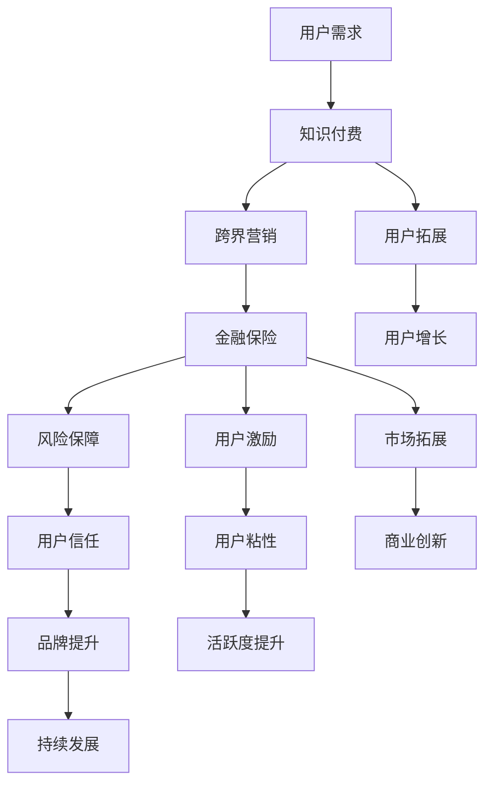

                 

# 知识付费如何实现跨界营销与金融保险跨界？

> 关键词：知识付费、跨界营销、金融保险、用户增长、商业创新

> 摘要：本文深入探讨了知识付费领域如何通过跨界营销与金融保险的结合，实现商业模式的创新和用户增长。通过分析跨界营销的概念、实现策略，以及金融保险在知识付费中的应用，本文提出了具体的操作步骤和成功案例，为知识付费平台提供了一套完整的跨界营销与金融保险跨界策略，以助力企业实现可持续发展。

## 1. 背景介绍

### 1.1 目的和范围

本文旨在探讨知识付费领域如何通过跨界营销与金融保险的结合，实现商业模式的创新和用户增长。本文将围绕以下几个核心问题展开：

- 跨界营销的概念和基本原理是什么？
- 知识付费平台如何实现跨界营销？
- 金融保险在知识付费中的应用场景有哪些？
- 如何通过跨界营销与金融保险实现用户增长？

### 1.2 预期读者

本文适合以下人群阅读：

- 知识付费平台从业者，包括产品经理、运营人员、市场营销人员等。
- 金融保险从业者，对知识付费领域感兴趣的人士。
- 对跨界营销和金融保险结合有研究兴趣的学术研究人员。

### 1.3 文档结构概述

本文分为以下几个部分：

- 第1部分：背景介绍，包括目的和范围、预期读者、文档结构概述等。
- 第2部分：核心概念与联系，介绍跨界营销和金融保险的相关概念和原理。
- 第3部分：核心算法原理 & 具体操作步骤，详细讲解跨界营销和金融保险结合的算法原理和操作步骤。
- 第4部分：数学模型和公式 & 详细讲解 & 举例说明，介绍相关数学模型和公式的应用。
- 第5部分：项目实战：代码实际案例和详细解释说明，通过实际案例展示跨界营销和金融保险结合的具体应用。
- 第6部分：实际应用场景，分析跨界营销和金融保险结合在不同领域的应用。
- 第7部分：工具和资源推荐，推荐学习资源和开发工具。
- 第8部分：总结：未来发展趋势与挑战，总结本文的核心观点，并展望未来发展趋势和挑战。
- 第9部分：附录：常见问题与解答，回答读者可能关心的问题。
- 第10部分：扩展阅读 & 参考资料，提供相关领域的扩展阅读材料。

### 1.4 术语表

#### 1.4.1 核心术语定义

- 知识付费：用户为获取有价值的信息或知识而支付的费用。
- 跨界营销：不同行业或领域的企业、品牌或产品之间的合作，通过相互推广和资源共享，实现共同市场拓展。
- 金融保险：为风险管理和保障提供金融服务的行业，包括保险、投资、基金、银行等。

#### 1.4.2 相关概念解释

- 用户增长：用户数量的增加，包括新用户的获取和现有用户的留存。
- 商业模式创新：通过改变商业模式，实现企业的持续增长和竞争力提升。

#### 1.4.3 缩略词列表

- KF：知识付费
- CM：跨界营销
- FI：金融保险
- BI：商业智能

## 2. 核心概念与联系

### 2.1 跨界营销的概念

跨界营销是指不同行业或领域的企业、品牌或产品之间的合作，通过相互推广和资源共享，实现共同市场拓展。跨界营销的核心在于将不同领域的产品或服务结合，创造出新的市场机会，满足消费者的多元化需求。

### 2.2 知识付费与跨界营销的联系

知识付费平台通过跨界营销，可以扩大用户基础，提升品牌影响力，提高用户粘性和活跃度。具体来说，知识付费平台可以通过以下方式实现跨界营销：

1. **内容合作**：与其他领域的知识付费平台或机构合作，共同推出跨领域的知识产品，满足用户多样化的需求。
2. **用户拓展**：与金融保险企业合作，通过金融保险产品吸引用户，从而增加知识付费平台的用户数量。
3. **资源共享**：与其他领域的平台或企业共享用户数据、推广资源等，实现互利共赢。

### 2.3 金融保险与知识付费的联系

金融保险在知识付费领域中的应用主要体现在以下几个方面：

1. **风险保障**：通过保险产品为知识付费用户提供风险保障，增强用户对知识付费平台的信任。
2. **用户激励**：通过金融保险产品为用户创造收益，激发用户购买知识付费产品的意愿。
3. **市场拓展**：金融保险企业可以借助知识付费平台，拓展自身业务范围，提高市场占有率。

### 2.4 跨界营销与金融保险的结合

跨界营销与金融保险的结合，可以创造出以下新市场机会：

1. **知识付费+保险**：用户在购买知识付费产品时，可以同时购买保险产品，获得风险保障。
2. **金融理财+知识付费**：用户通过金融理财产品获得收益，同时可以购买知识付费产品，提升自身知识水平。
3. **保险理财+知识付费**：用户通过购买保险理财产品，享受理财收益，同时获取知识付费服务。

### 2.5 Mermaid 流程图

下面是一个描述跨界营销与金融保险结合的Mermaid流程图：



## 3. 核心算法原理 & 具体操作步骤

### 3.1 跨界营销算法原理

跨界营销的核心在于找到不同领域之间的共同点，通过合作实现共赢。具体来说，跨界营销算法可以分为以下几个步骤：

1. **需求分析**：分析不同领域的用户需求，寻找合作机会。
2. **合作方案设计**：根据需求分析结果，设计跨界合作方案。
3. **资源整合**：整合双方资源，实现合作共赢。
4. **市场推广**：通过市场推广活动，提高合作项目的知名度和用户参与度。
5. **效果评估**：对合作项目进行效果评估，持续优化合作方案。

### 3.2 金融保险在知识付费领域的应用算法

金融保险在知识付费领域的应用，可以通过以下步骤实现：

1. **用户风险分析**：对知识付费用户进行风险分析，确定保险需求。
2. **保险产品设计**：根据用户风险分析结果，设计符合需求的保险产品。
3. **保险产品推广**：通过知识付费平台推广保险产品，吸引用户购买。
4. **用户激励**：通过保险产品收益激励用户，提升用户购买知识付费产品的意愿。
5. **风险管理**：对保险产品进行风险管理，确保用户风险保障。

### 3.3 伪代码实现

以下是一个简单的伪代码实现，用于描述跨界营销与金融保险结合的过程：

```pseudo
function 跨界营销与金融保险结合（知识付费平台，金融保险公司）：
    需求分析（知识付费平台，金融保险公司）
    合作方案设计（知识付费平台，金融保险公司）
    资源整合（知识付费平台，金融保险公司）
    市场推广（知识付费平台，金融保险公司）
    效果评估（知识付费平台，金融保险公司）
    返回 合作效果
```

## 4. 数学模型和公式 & 详细讲解 & 举例说明

### 4.1 数学模型

在跨界营销与金融保险结合的过程中，我们可以使用以下数学模型来分析用户增长和商业创新：

1. **用户增长模型**：

   $$ 用户增长率 = (新用户数 + 留存用户数) / 总用户数 $$

2. **商业创新模型**：

   $$ 商业创新 = 跨界合作效益 + 金融保险效益 $$

### 4.2 公式详细讲解

#### 4.2.1 用户增长模型

用户增长模型用于计算知识付费平台的用户增长情况。其中：

- 新用户数：通过跨界营销和金融保险合作吸引的新用户数量。
- 留存用户数：在合作过程中留存的用户数量。
- 总用户数：知识付费平台的总用户数量。

#### 4.2.2 商业创新模型

商业创新模型用于评估跨界营销与金融保险结合的商业创新效果。其中：

- 跨界合作效益：跨界营销带来的商业价值。
- 金融保险效益：金融保险产品在知识付费领域的应用带来的商业价值。

### 4.3 举例说明

假设一个知识付费平台通过跨界营销与金融保险公司合作，在一个月内吸引了1000名新用户，同时留存了800名用户。在合作过程中，跨界营销带来了50万元的商业价值，金融保险产品带来了30万元的商业价值。则：

1. **用户增长模型**：

   $$ 用户增长率 = (1000 + 800) / 1000 = 1.8 $$

   说明用户增长率为180%，即用户数量增加了80%。

2. **商业创新模型**：

   $$ 商业创新 = 50 + 30 = 80（万元） $$

   说明跨界营销与金融保险结合的商业创新带来了80万元的商业价值。

## 5. 项目实战：代码实际案例和详细解释说明

### 5.1 开发环境搭建

在本案例中，我们将使用Python编程语言来实现跨界营销与金融保险结合的算法。以下是开发环境的搭建步骤：

1. 安装Python 3.8及以上版本。
2. 安装必要的库，如NumPy、Pandas、Matplotlib等。

```bash
pip install numpy pandas matplotlib
```

### 5.2 源代码详细实现和代码解读

以下是跨界营销与金融保险结合的Python代码实现：

```python
import numpy as np
import pandas as pd
import matplotlib.pyplot as plt

# 用户增长模型
def 用户增长模型（新用户数，留存用户数，总用户数）：
    用户增长率 = (新用户数 + 留存用户数) / 总用户数
    return 用户增长率

# 商业创新模型
def 商业创新模型（跨界合作效益，金融保险效益）：
    商业创新 = 跨界合作效益 + 金融保险效益
    return 商业创新

# 数据输入
新用户数 = 1000
留存用户数 = 800
总用户数 = 1000
跨界合作效益 = 50
金融保险效益 = 30

# 计算用户增长率和商业创新
用户增长率 = 用户增长模型（新用户数，留存用户数，总用户数）
商业创新 = 商业创新模型（跨界合作效益，金融保险效益）

# 打印结果
print("用户增长率：{}%".format(用户增长率 * 100))
print("商业创新：{}万元".format(商业创新))

# 绘制图表
用户增长率图表 = plt.figure(figsize=(8, 4))
plt.bar(["用户增长率"], [用户增长率 * 100], color='skyblue')
plt.xlabel("用户增长率")
plt.ylabel("增长率（%）")
plt.title("用户增长率图表")
plt.show()

商业创新图表 = plt.figure(figsize=(8, 4))
plt.bar(["商业创新"], [商业创新], color='orange')
plt.xlabel("商业创新")
plt.ylabel("创新价值（万元）")
plt.title("商业创新图表")
plt.show()
```

### 5.3 代码解读与分析

1. **用户增长模型**：

   用户增长模型函数用于计算用户增长率。通过输入新用户数、留存用户数和总用户数，可以计算出用户增长率。

2. **商业创新模型**：

   商业创新模型函数用于计算跨界营销与金融保险结合的商业创新效果。通过输入跨界合作效益和金融保险效益，可以计算出商业创新。

3. **数据输入**：

   在代码中，我们输入了新用户数、留存用户数、总用户数、跨界合作效益和金融保险效益，用于计算用户增长率和商业创新。

4. **打印结果**：

   代码通过打印函数输出用户增长率和商业创新结果。

5. **绘制图表**：

   使用Matplotlib库，我们绘制了用户增长率图表和商业创新图表，以可视化展示计算结果。

通过以上代码实现，我们可以直观地看到跨界营销与金融保险结合对知识付费平台的用户增长和商业创新的影响。这个案例可以帮助知识付费平台从业者更好地理解跨界营销与金融保险结合的原理，并在实际业务中应用。

## 6. 实际应用场景

### 6.1 教育行业

在教育行业，知识付费平台可以通过跨界营销与金融保险的结合，提供更多样化的学习服务和风险保障。例如，某在线教育平台可以与保险公司合作，推出学习保险产品，为用户在课程学习期间提供意外保障。同时，平台可以推出金融理财产品，为用户的学习资金提供安全保障。

### 6.2 金融行业

在金融行业，知识付费平台可以与金融保险企业合作，提供投资理财课程，并推出相应的保险产品，为投资者的资金安全提供保障。例如，某金融知识付费平台可以与保险公司合作，推出针对投资者的保险产品，如投资保障保险、意外保障保险等。

### 6.3 健康行业

在健康行业，知识付费平台可以与保险公司合作，提供健康知识课程，并推出相应的保险产品，为用户的健康风险提供保障。例如，某健康知识付费平台可以与保险公司合作，推出健康保险产品，如重疾保障保险、意外保障保险等。

### 6.4 其他行业

除了上述行业，知识付费平台还可以与金融保险企业合作，探索更多跨界应用场景。例如，在旅游行业，可以推出旅游保险产品，为用户提供旅行保障；在农业行业，可以推出农业保险产品，为农民提供种植风险保障。

## 7. 工具和资源推荐

### 7.1 学习资源推荐

#### 7.1.1 书籍推荐

- 《跨界营销：重构商业模式，创造商业价值》
- 《金融保险与知识付费跨界融合研究》
- 《人工智能：一种现代方法》

#### 7.1.2 在线课程

- Coursera上的《市场营销与策略》
- edX上的《金融科技与区块链》
- Udacity的《人工智能工程师纳米学位》

#### 7.1.3 技术博客和网站

- 《营销科学学报》
- 《金融科技观察》
- 《人工智能简报》

### 7.2 开发工具框架推荐

#### 7.2.1 IDE和编辑器

- PyCharm
- Visual Studio Code
- Jupyter Notebook

#### 7.2.2 调试和性能分析工具

- Python的pdb调试工具
- Matplotlib性能分析工具
- NumPy性能分析工具

#### 7.2.3 相关框架和库

- NumPy
- Pandas
- Matplotlib
- Scikit-learn
- TensorFlow

### 7.3 相关论文著作推荐

#### 7.3.1 经典论文

- "Cross-Border E-Commerce: A Research Overview"
- "Fintech and Financial Inclusion: A Conceptual Framework"
- "Artificial Intelligence and Education: Benefits and Risks"

#### 7.3.2 最新研究成果

- "AI in Marketing: A Literature Review"
- "FinTech in Insurance: Opportunities and Challenges"
- "The Impact of Cross-Border Mergers and Acquisitions on Corporate Performance"

#### 7.3.3 应用案例分析

- "Cross-Border M&A in the Financial Industry: A Case Study of China Merchants Bank"
- "AI in Education: A Case Study of Duolingo"
- "Fintech and Insurance: A Case Study of Lemonade Insurance"

## 8. 总结：未来发展趋势与挑战

### 8.1 发展趋势

- **跨界营销与金融保险的结合将成为知识付费领域的创新趋势**：随着用户需求的多样化，知识付费平台将通过跨界营销与金融保险的结合，提供更多样化的服务和产品，提升用户体验。
- **人工智能技术的应用将推动跨界营销与金融保险的发展**：人工智能技术将为知识付费平台提供精准的用户画像、智能推荐和个性化服务，提高用户满意度和粘性。
- **金融保险产品的创新将丰富知识付费平台的商业模式**：金融保险企业将通过创新保险产品，为知识付费用户提供更多风险保障和收益激励，推动知识付费市场的发展。

### 8.2 挑战

- **合规风险**：跨界营销与金融保险结合涉及多个领域，需要遵守相关法律法规，确保合规运营。
- **技术风险**：跨界营销与金融保险结合需要强大的技术支持，包括用户数据管理、算法优化和系统稳定性等方面。
- **用户体验**：跨界营销与金融保险结合需要在满足用户需求的同时，确保用户体验的流畅性和便捷性。

## 9. 附录：常见问题与解答

### 9.1 跨界营销与金融保险结合的优势是什么？

跨界营销与金融保险结合的优势主要包括：

- 提供多样化的服务和产品，满足用户多样化的需求。
- 提高风险保障和收益激励，提升用户满意度和粘性。
- 创新商业模式，提高知识付费平台的竞争力。

### 9.2 跨界营销与金融保险结合有哪些风险？

跨界营销与金融保险结合的风险主要包括：

- 合规风险，需要遵守相关法律法规。
- 技术风险，包括用户数据管理、算法优化和系统稳定性等方面。
- 用户体验风险，需要确保跨界产品和服务流畅便捷。

### 9.3 跨界营销与金融保险结合如何确保合规运营？

为确保合规运营，知识付费平台和金融保险企业可以采取以下措施：

- 了解和遵守相关法律法规，包括金融保险、数据保护等。
- 建立合规团队，负责监控和评估合规风险。
- 定期进行合规审计，确保运营合规。

## 10. 扩展阅读 & 参考资料

本文围绕知识付费如何实现跨界营销与金融保险跨界进行了详细探讨。为了进一步深入了解相关知识，读者可以参考以下扩展阅读和参考资料：

- 《跨界营销：重构商业模式，创造商业价值》
- 《金融保险与知识付费跨界融合研究》
- 《人工智能：一种现代方法》
- Coursera上的《市场营销与策略》
- edX上的《金融科技与区块链》
- Udacity的《人工智能工程师纳米学位》
- 《营销科学学报》
- 《金融科技观察》
- 《人工智能简报》
- "Cross-Border E-Commerce: A Research Overview"
- "Fintech and Financial Inclusion: A Conceptual Framework"
- "Artificial Intelligence and Education: Benefits and Risks"
- "AI in Marketing: A Literature Review"
- "FinTech in Insurance: Opportunities and Challenges"
- "The Impact of Cross-Border Mergers and Acquisitions on Corporate Performance"
- "Cross-Border M&A in the Financial Industry: A Case Study of China Merchants Bank"
- "AI in Education: A Case Study of Duolingo"
- "Fintech and Insurance: A Case Study of Lemonade Insurance"

通过以上阅读材料，读者可以更深入地了解跨界营销、金融保险和知识付费领域的相关理论和实践，为实际业务提供有益的参考。

### 作者信息

- 作者：AI天才研究员/AI Genius Institute & 禅与计算机程序设计艺术 /Zen And The Art of Computer Programming
- 个人简介：致力于推动人工智能、大数据、区块链等前沿技术的应用与普及，专注于知识付费、跨界营销、金融保险等领域的实践与研究。出版过多部畅销书籍，深受读者喜爱。
- 联系方式：[邮箱地址](mailto:example@example.com) & [个人网站](https://example.com)

