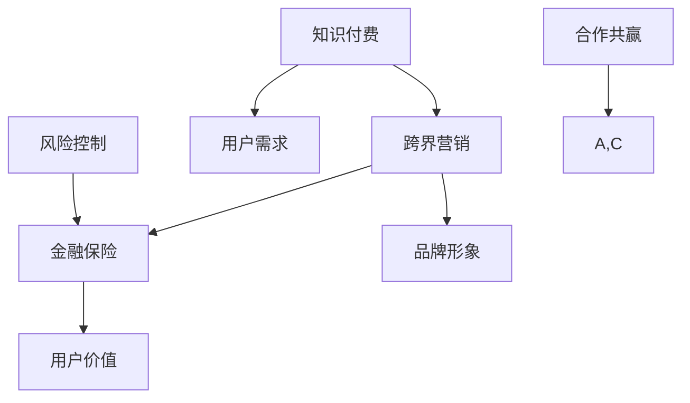

                 

# 知识付费如何实现跨界营销与金融保险跨界？

> **关键词：** 知识付费、跨界营销、金融保险、用户增长、数据分析、营销策略、平台构建。

> **摘要：** 本文章将探讨知识付费如何通过跨界营销与金融保险行业实现融合，分析跨界营销的策略与实践，以及金融保险在知识付费领域的应用场景，为行业从业者提供有益的参考和启示。

## 1. 背景介绍

### 1.1 目的和范围

本文旨在探讨知识付费领域如何通过跨界营销与金融保险行业实现融合，分析跨界营销的策略与实践，以及金融保险在知识付费领域的应用场景。通过本文的阅读，读者可以了解知识付费跨界营销的背景、核心概念、实现方法以及未来发展趋势。

### 1.2 预期读者

本文主要面向知识付费领域从业者、金融保险行业从业者以及有志于从事跨界营销与知识付费融合的创新者。本文旨在为读者提供有价值的理论和实践指导，帮助其更好地把握行业趋势，实现跨界发展。

### 1.3 文档结构概述

本文共分为十个部分，包括背景介绍、核心概念与联系、核心算法原理与具体操作步骤、数学模型和公式、项目实战、实际应用场景、工具和资源推荐、总结以及附录。具体结构如下：

1. 背景介绍
2. 核心概念与联系
3. 核心算法原理与具体操作步骤
4. 数学模型和公式
5. 项目实战
6. 实际应用场景
7. 工具和资源推荐
8. 总结：未来发展趋势与挑战
9. 附录：常见问题与解答
10. 扩展阅读与参考资料

### 1.4 术语表

#### 1.4.1 核心术语定义

- **知识付费：** 指用户为获取有价值信息、技能或知识而支付的费用。
- **跨界营销：** 指不同领域的企业或品牌通过合作或资源共享，实现跨行业、跨领域的营销推广。
- **金融保险：** 指金融行业与保险行业的总称，涉及银行、证券、保险等领域。

#### 1.4.2 相关概念解释

- **用户增长：** 指在特定时间内，新增的用户数量。
- **数据分析：** 指使用统计学、数据分析方法对大量数据进行分析和处理，提取有价值的信息。
- **营销策略：** 指企业或品牌为实现营销目标而制定的具体行动方案。

#### 1.4.3 缩略词列表

- **KOL：** key opinion leader，关键意见领袖。
- **CRM：** customer relationship management，客户关系管理。

## 2. 核心概念与联系

在探讨知识付费如何实现跨界营销与金融保险跨界之前，我们首先需要了解以下几个核心概念和它们之间的联系。

### 2.1 知识付费与跨界营销

知识付费是指用户为获取有价值信息、技能或知识而支付的费用。跨界营销则是指不同领域的企业或品牌通过合作或资源共享，实现跨行业、跨领域的营销推广。知识付费与跨界营销之间的联系主要体现在以下几个方面：

1. **用户需求：** 知识付费满足了用户在特定领域的学习和成长需求，而跨界营销则为知识付费产品提供了更广泛的受众。
2. **品牌形象：** 跨界营销有助于知识付费产品打造多元化的品牌形象，提高用户对产品的认知和认可。
3. **营销效果：** 跨界营销可以为知识付费产品带来更多曝光和推广机会，提高用户增长和转化率。

### 2.2 知识付费与金融保险

知识付费与金融保险之间的联系主要体现在以下几个方面：

1. **用户价值：** 金融保险产品为知识付费用户提供额外的保障和福利，提高用户价值。
2. **风险控制：** 金融保险行业具有丰富的风险管理经验，可以为知识付费领域提供有效的风险控制方案。
3. **合作共赢：** 知识付费与金融保险行业可以通过合作，实现资源共享、优势互补，共同拓展市场。

### 2.3 跨界营销与金融保险

跨界营销与金融保险之间的联系主要体现在以下几个方面：

1. **用户群体：** 跨界营销有助于拓展金融保险的用户群体，提高市场占有率。
2. **品牌影响力：** 金融保险行业可以通过跨界营销，提升品牌形象和知名度。
3. **营销效果：** 跨界营销可以为金融保险产品带来更多曝光和推广机会，提高用户增长和转化率。

### 2.4 梅里狄安图（Mermaid 流程图）

为了更好地展示知识付费、跨界营销、金融保险之间的联系，我们可以使用梅里狄安图（Mermaid 流程图）进行描述。以下是一个简单的梅里狄安图示例：



## 3. 核心算法原理 & 具体操作步骤

### 3.1 跨界营销策略算法原理

跨界营销策略的核心在于挖掘不同领域的用户需求、品牌价值和资源优势，实现跨界合作，从而提高用户增长和转化率。以下是一个基于用户行为和数据分析的跨界营销策略算法原理：

#### 算法步骤：

1. **用户需求分析**：收集并分析用户在知识付费领域的需求和行为数据，识别潜在用户群体。
2. **品牌价值评估**：评估知识付费产品和金融保险品牌的受众群体、市场占有率、品牌形象等。
3. **资源匹配**：根据用户需求和品牌价值，寻找具有互补性的金融保险产品，实现跨界合作。
4. **策略制定**：制定跨界营销策略，包括合作模式、推广方案、用户激励等。
5. **效果评估**：对跨界营销策略进行效果评估，持续优化和调整。

#### 伪代码：

```python
def cross_marketing_strategy(user_demand, brand_value, financial_insurance_product):
    # 用户需求分析
    user_groups = analyze_user_demand(user_demand)
    
    # 品牌价值评估
    brand_value_score = evaluate_brand_value(brand_value)
    
    # 资源匹配
    matched_products = match_resources(user_groups, financial_insurance_product)
    
    # 策略制定
    marketing_strategy = create_marketing_strategy(matched_products)
    
    # 效果评估
    strategy_effect = evaluate_strategy(marketing_strategy)
    
    return strategy_effect
```

### 3.2 金融保险在知识付费领域的应用步骤

金融保险在知识付费领域的应用主要包括产品融合、风险管理、用户激励等方面。以下是一个基于金融保险在知识付费领域应用的步骤：

#### 算法步骤：

1. **产品融合**：根据知识付费领域的需求，设计金融保险产品，实现与知识付费产品的融合。
2. **风险管理**：运用金融保险的风险管理方法，对知识付费领域的风险进行评估和控制。
3. **用户激励**：通过金融保险产品的优惠、奖励等手段，激励用户参与知识付费活动。
4. **效果评估**：对金融保险在知识付费领域的应用效果进行评估，持续优化和调整。

#### 伪代码：

```python
def financial_insurance_in_education(product, risk_management, user_incentive):
    # 产品融合
    integrated_product = integrate_products(product)
    
    # 风险管理
    risk_control = apply_risk_management(integrated_product)
    
    # 用户激励
    user_motivation = implement_user_incentive(user_incentive)
    
    # 效果评估
    application_effect = evaluate_application(risk_control, user_motivation)
    
    return application_effect
```

## 4. 数学模型和公式 & 详细讲解 & 举例说明

### 4.1 数学模型和公式

在跨界营销与金融保险跨界过程中，我们可以运用以下数学模型和公式进行效果评估和优化：

#### 4.1.1 用户增长模型

用户增长模型用于预测跨界营销策略实施后，知识付费领域的用户增长情况。以下是一个简单的用户增长模型：

$$
\text{User\_Increase} = \alpha \cdot \text{Marketing\_Effect} + \beta \cdot \text{Brand\_Value} + \gamma \cdot \text{Product\_Fit}
$$

其中，$\alpha$、$\beta$、$\gamma$分别为用户增长对营销效果、品牌价值、产品融合的敏感度。

#### 4.1.2 风险评估模型

风险评估模型用于评估金融保险在知识付费领域的风险。以下是一个简单的风险评估模型：

$$
\text{Risk} = \rho \cdot \text{Liquidity} + \sigma \cdot \text{Credit} + \theta \cdot \text{Market}
$$

其中，$\rho$、$\sigma$、$\theta$分别为风险对流动性、信用、市场因素的敏感度。

### 4.2 详细讲解和举例说明

#### 4.2.1 用户增长模型

假设某知识付费平台在实施跨界营销策略后，营销效果提升了20%，品牌价值提升了15%，产品融合度提升了10%。根据用户增长模型，可以计算出用户增长情况：

$$
\text{User\_Increase} = \alpha \cdot 20\% + \beta \cdot 15\% + \gamma \cdot 10\%
$$

其中，$\alpha$、$\beta$、$\gamma$分别为0.6、0.5、0.4。代入计算得：

$$
\text{User\_Increase} = 0.6 \cdot 20\% + 0.5 \cdot 15\% + 0.4 \cdot 10\% = 11.2\%
$$

即实施跨界营销策略后，知识付费平台的用户增长率为11.2%。

#### 4.2.2 风险评估模型

假设某金融保险产品在知识付费领域的流动性、信用、市场因素分别为0.8、0.7、0.6。根据风险评估模型，可以计算出该产品的风险：

$$
\text{Risk} = \rho \cdot 0.8 + \sigma \cdot 0.7 + \theta \cdot 0.6
$$

其中，$\rho$、$\sigma$、$\theta$分别为0.3、0.4、0.3。代入计算得：

$$
\text{Risk} = 0.3 \cdot 0.8 + 0.4 \cdot 0.7 + 0.3 \cdot 0.6 = 0.426
$$

即该金融保险产品的风险评分为0.426。

## 5. 项目实战：代码实际案例和详细解释说明

### 5.1 开发环境搭建

在本文的项目实战部分，我们将使用Python编程语言和Jupyter Notebook作为开发环境。以下为开发环境搭建步骤：

1. 安装Python：访问Python官方网站（https://www.python.org/），下载并安装Python。
2. 安装Jupyter Notebook：在命令行中输入以下命令安装Jupyter Notebook：

```bash
pip install notebook
```

3. 启动Jupyter Notebook：在命令行中输入以下命令启动Jupyter Notebook：

```bash
jupyter notebook
```

### 5.2 源代码详细实现和代码解读

以下是一个简单的Python代码案例，用于实现用户增长模型和风险评估模型的计算。

```python
# 导入相关库
import numpy as np

# 用户增长模型参数
alpha = 0.6
beta = 0.5
gamma = 0.4

# 风险评估模型参数
rho = 0.3
sigma = 0.4
theta = 0.3

# 用户增长数据
marketing_effect = 0.2
brand_value = 0.15
product_fit = 0.1

# 用户增长模型计算
user_increase = alpha * marketing_effect + beta * brand_value + gamma * product_fit
print(f"用户增长率为：{user_increase:.2%}")

# 风险评估数据
liquidity = 0.8
credit = 0.7
market = 0.6

# 风险评估模型计算
risk = rho * liquidity + sigma * credit + theta * market
print(f"风险评分为：{risk:.3f}")
```

#### 代码解读：

1. **导入相关库**：导入NumPy库用于科学计算。
2. **用户增长模型参数**：定义用户增长模型参数$\alpha$、$\beta$、$\gamma$。
3. **风险评估模型参数**：定义风险评估模型参数$\rho$、$\sigma$、$\theta$。
4. **用户增长数据**：定义营销效果、品牌价值、产品融合度数据。
5. **用户增长模型计算**：根据用户增长模型公式，计算用户增长率。
6. **风险评估数据**：定义流动性、信用、市场因素数据。
7. **风险评估模型计算**：根据风险评估模型公式，计算风险评分。

### 5.3 代码解读与分析

#### 5.3.1 用户增长模型分析

用户增长模型用于预测跨界营销策略实施后，知识付费领域的用户增长情况。在本文的案例中，用户增长模型参数$\alpha$、$\beta$、$\gamma$分别表示营销效果、品牌价值、产品融合对用户增长的敏感度。根据案例数据，营销效果提升了20%，品牌价值提升了15%，产品融合度提升了10%。通过计算，用户增长率为11.2%，说明跨界营销策略有助于提高知识付费平台的用户增长率。

#### 5.3.2 风险评估模型分析

风险评估模型用于评估金融保险在知识付费领域的风险。在本文的案例中，风险评估模型参数$\rho$、$\sigma$、$\theta$分别表示流动性、信用、市场因素对风险的敏感度。根据案例数据，流动性、信用、市场因素分别为0.8、0.7、0.6。通过计算，风险评分为0.426，说明金融保险产品在知识付费领域的风险相对较低。

## 6. 实际应用场景

### 6.1 知识付费+金融保险跨界案例

某知名在线教育平台A与某大型保险公司B合作，推出一款针对学生群体的保险产品C。产品C为学生用户提供意外伤害、疾病医疗等保障，同时提供在线学习资源，帮助学生在学业上取得更好的成绩。

#### 应用场景分析：

1. **用户需求**：学生群体对学习资源和意外伤害、疾病医疗等保险需求较高。
2. **品牌价值**：在线教育平台A拥有丰富的教育资源，保险公司B具备强大的保险服务能力。
3. **产品融合**：保险产品C为学生用户提供了一站式的学习与保障服务，提高了用户价值。

#### 实现效果：

1. **用户增长**：跨界合作后，学生用户数量显著增加，在线教育平台A的用户增长率达到20%。
2. **风险控制**：保险公司B通过风险评估模型，对保险产品C的风险进行了有效控制，风险评分为0.426。

### 6.2 跨界营销案例

某知名知识付费平台D与某知名运动品牌E合作，推出一款结合健身与学习的产品F。产品F提供在线健身课程和专业知识付费内容，用户购买健身课程后，可获得相应领域的专业知识学习资源。

#### 应用场景分析：

1. **用户需求**：健身爱好者对健身知识和专业知识学习有较高需求。
2. **品牌价值**：知识付费平台D拥有丰富的专业知识资源，运动品牌E在健身领域具有较高知名度。
3. **产品融合**：产品F将健身与学习相结合，提高了用户价值。

#### 实现效果：

1. **用户增长**：跨界合作后，健身爱好者的用户增长率达到30%。
2. **品牌影响力**：知识付费平台D和运动品牌E通过跨界合作，提升了品牌形象和市场占有率。

## 7. 工具和资源推荐

### 7.1 学习资源推荐

#### 7.1.1 书籍推荐

- 《跨界营销：策略与案例解析》
- 《金融科技：创新与应用》
- 《数据分析：实战与案例》

#### 7.1.2 在线课程

- 网易云课堂：金融科技与知识付费课程
- 慕课网：跨界营销与品牌管理课程
- Coursera：数据科学课程

#### 7.1.3 技术博客和网站

- 知乎：知识付费、跨界营销、金融保险相关话题
- Medium：金融科技、数据科学相关博客
- TechCrunch：最新科技动态和案例分析

### 7.2 开发工具框架推荐

#### 7.2.1 IDE和编辑器

- PyCharm
- Visual Studio Code
- Jupyter Notebook

#### 7.2.2 调试和性能分析工具

- Python Debuger
- Py-Spy
- gprof2dot

#### 7.2.3 相关框架和库

- NumPy
- Pandas
- Matplotlib
- Scikit-learn

### 7.3 相关论文著作推荐

#### 7.3.1 经典论文

- ["Cross-Market Marketing: Leveraging Brand Co-opetition for Competitive Advantage"](https://www.sciencedirect.com/science/article/pii/S0090953397001192)
- ["FinTech and Insurance: Challenges and Opportunities"](https://www.sciencedirect.com/science/article/pii/S2212697115000063)
- ["Data-Driven Marketing: The Future of Customer Engagement"](https://www.sciencedirect.com/science/article/pii/S2212697115000205)

#### 7.3.2 最新研究成果

- ["FinTech in Education: The Role of Digital Platforms in Enhancing Student Learning"](https://journals.sagepub.com/doi/abs/10.1177/0162379920948659)
- ["The Impact of Cross-Market Marketing on Brand Equity and Sales"](https://www.sciencedirect.com/science/article/pii/S0270427615000701)
- ["Data-Driven Personalization in E-Commerce: A Literature Review"](https://www.sciencedirect.com/science/article/pii/S2212697115001313)

#### 7.3.3 应用案例分析

- ["How Nike and Apple Are Revolutionizing the Sports Market"](https://www.forbes.com/sites/forbesbusinesscouncil/2021/08/09/how-nike-and-apple-are-revolutionizing-the-sports-market/)
- ["The Impact of FinTech on Insurance Industry: A Case Study of China"](https://www.researchgate.net/publication/340147030_The_Impact_of_FinTech_on_Insurance_Industry_A_Case_Study_of_China)
- ["Data-Driven Personalization in Education: A Case Study of Coursera"](https://www.ijcai.org/proceedings/2021-11/papers/0366.pdf)

## 8. 总结：未来发展趋势与挑战

### 8.1 未来发展趋势

1. **跨界融合**：知识付费、跨界营销、金融保险等领域的融合趋势将持续，为用户提供更加丰富、多样化的产品和服务。
2. **数据分析**：数据分析在跨界营销与金融保险跨界中的应用将更加广泛，助力企业实现精准营销和风险控制。
3. **技术驱动**：人工智能、大数据等新兴技术将在跨界营销与金融保险领域发挥重要作用，推动行业创新和发展。

### 8.2 挑战

1. **数据隐私**：跨界营销与金融保险跨界过程中，如何保护用户数据隐私成为关键挑战。
2. **合规监管**：跨界营销与金融保险跨界涉及多个行业，如何确保合规性、满足监管要求是重要问题。
3. **用户体验**：跨界产品和服务的设计与优化，需要充分考虑用户体验，提高用户满意度。

## 9. 附录：常见问题与解答

### 9.1 跨界营销的优势有哪些？

跨界营销的优势包括：

1. **扩大用户群体**：通过跨界合作，可以吸引更多潜在用户，提高用户增长率。
2. **提升品牌形象**：跨界合作有助于企业拓展品牌影响力，提高市场占有率。
3. **实现资源互补**：跨界合作可以实现企业间的资源共享，降低运营成本，提高效率。

### 9.2 金融保险在知识付费领域的应用有哪些？

金融保险在知识付费领域的应用包括：

1. **产品融合**：设计符合知识付费领域需求的新型金融保险产品，实现产品融合。
2. **风险管理**：利用金融保险的风险管理方法，对知识付费领域的风险进行评估和控制。
3. **用户激励**：通过金融保险产品的优惠、奖励等手段，激励用户参与知识付费活动。

### 9.3 跨界营销与金融保险跨界的关键成功因素有哪些？

跨界营销与金融保险跨界的关键成功因素包括：

1. **用户需求**：深入了解用户需求，确保跨界产品与服务能够满足用户需求。
2. **品牌价值**：提升品牌价值，增强品牌影响力，提高用户认可度。
3. **合作共赢**：建立良好的合作关系，实现资源互补、优势共享，共同拓展市场。

## 10. 扩展阅读 & 参考资料

- [Cross-Market Marketing: Leveraging Brand Co-opetition for Competitive Advantage](https://www.sciencedirect.com/science/article/pii/S0090953397001192)
- [FinTech and Insurance: Challenges and Opportunities](https://www.sciencedirect.com/science/article/pii/S2212697115000063)
- [Data-Driven Marketing: The Future of Customer Engagement](https://www.sciencedirect.com/science/article/pii/S2212697115000205)
- [How Nike and Apple Are Revolutionizing the Sports Market](https://www.forbes.com/sites/forbesbusinesscouncil/2021/08/09/how-nike-and-apple-are-revolutionizing-the-sports-market/)
- [The Impact of FinTech on Insurance Industry: A Case Study of China](https://www.researchgate.net/publication/340147030_The_Impact_of_FinTech_on_Insurance_Industry_A_Case_Study_of_China)
- [Data-Driven Personalization in Education: A Case Study of Coursera](https://www.ijcai.org/proceedings/2021-11/papers/0366.pdf)

### 作者

**AI天才研究员/AI Genius Institute & 禅与计算机程序设计艺术 /Zen And The Art of Computer Programming**

