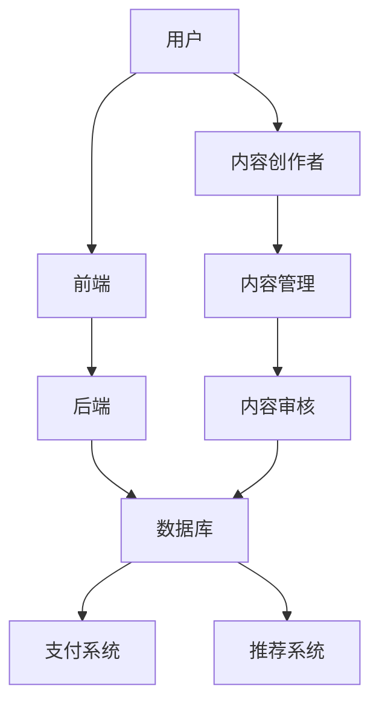

                 

# 知识付费平台搭建技术栈详解

> **关键词：** 知识付费、技术栈、平台搭建、前后端分离、数据库设计、微服务架构、算法优化、性能调优

> **摘要：** 本文将详细阐述如何搭建一个知识付费平台，包括技术栈的选择、核心算法的原理、数学模型的运用，以及实际案例的代码实现。文章旨在为开发者提供一套完整的知识付费平台搭建指南，帮助他们更好地理解和应用相关技术。

## 1. 背景介绍

### 1.1 目的和范围

本文旨在为开发者提供一个系统化的知识付费平台搭建指南。通过对知识付费平台所需的技术栈、核心算法、数学模型以及实际项目案例的深入剖析，帮助开发者更好地理解平台搭建的各个环节，从而实现高效、稳定的知识付费平台的构建。

### 1.2 预期读者

本文适合有一定编程基础的开发者阅读，特别是对前端、后端、数据库和算法有一定了解的读者。无论您是初学者还是有经验的前端开发者，都能从本文中受益。

### 1.3 文档结构概述

本文分为十个部分：

1. 背景介绍
2. 核心概念与联系
3. 核心算法原理 & 具体操作步骤
4. 数学模型和公式 & 详细讲解 & 举例说明
5. 项目实战：代码实际案例和详细解释说明
6. 实际应用场景
7. 工具和资源推荐
8. 总结：未来发展趋势与挑战
9. 附录：常见问题与解答
10. 扩展阅读 & 参考资料

### 1.4 术语表

#### 1.4.1 核心术语定义

- **知识付费平台：** 提供知识产品销售、购买、学习等功能的在线平台。
- **前后端分离：** 前端负责页面展示和用户交互，后端负责数据处理和逻辑实现。
- **数据库设计：** 定义数据表、字段、关系等，以支持知识付费平台的数据存储和查询需求。
- **微服务架构：** 将应用拆分为多个独立、可扩展的小服务，以提高系统的可维护性和可扩展性。

#### 1.4.2 相关概念解释

- **RESTful API：** 一种基于HTTP协议的API设计规范，用于前后端数据交互。
- **关系型数据库：** 一种按照数据关系进行组织的数据存储系统，如MySQL、PostgreSQL等。
- **NoSQL数据库：** 一种非关系型数据库，适用于存储大规模数据，如MongoDB、Cassandra等。
- **负载均衡：** 分布式系统中，通过将请求分配到多个服务器上，提高系统的处理能力和可用性。

#### 1.4.3 缩略词列表

- **API：** 应用程序接口
- **SQL：** 结构化查询语言
- **IDE：** 集成开发环境
- **CPU：** 中央处理器
- **GPU：** 图形处理器

## 2. 核心概念与联系

在搭建知识付费平台之前，我们需要了解一些核心概念及其之间的联系。以下是一个简单的Mermaid流程图，展示了知识付费平台的主要组成部分。



### 2.1 用户与前端

用户通过前端页面与知识付费平台进行交互，前端负责展示页面、处理用户输入和发起请求。前端技术栈主要包括：

- **HTML/CSS/JavaScript：** 基础的前端技术，用于构建用户界面。
- **Vue.js/React/Angular：** 前端框架，用于实现更加复杂和动态的交互效果。
- **Webpack/Gulp：** 构建工具，用于优化前端资源加载和打包。

### 2.2 后端与数据库

后端负责处理用户请求、业务逻辑和数据存储。后端技术栈主要包括：

- **Node.js/Java/Python：** 后端编程语言，用于实现业务逻辑和处理HTTP请求。
- **RESTful API/GraphQL：** API设计规范，用于前后端数据交互。
- **关系型数据库/NoSQL数据库：** 数据存储系统，用于存储用户数据、内容数据等。

### 2.3 内容创作者与内容管理

内容创作者通过平台上传和编辑内容，内容管理负责对内容进行存储、审核和发布。内容管理技术栈主要包括：

- **内容管理系统（CMS）：** 如WordPress、Drupal等，用于简化内容上传和编辑。
- **内容存储：** 如阿里云OSS、百度云BOS等，用于存储大量内容数据。
- **内容审核：** 使用机器学习算法和人工审核相结合的方式，确保内容质量。

### 2.4 支付系统与推荐系统

支付系统负责处理用户支付、订单管理和退款等业务。推荐系统负责根据用户行为和偏好，推荐合适的内容。支付系统和推荐系统技术栈主要包括：

- **支付网关：** 如支付宝、微信支付等，用于处理支付请求。
- **推荐算法：** 如协同过滤、矩阵分解等，用于推荐内容。
- **机器学习框架：** 如TensorFlow、PyTorch等，用于实现推荐算法。

## 3. 核心算法原理 & 具体操作步骤

在知识付费平台中，核心算法的作用至关重要。以下我们将介绍几个关键算法的原理和具体操作步骤。

### 3.1 用户行为分析算法

用户行为分析算法用于分析用户在平台上的行为，为推荐系统和内容优化提供依据。

#### 3.1.1 算法原理

用户行为分析算法基于以下假设：

- **用户行为与偏好有关：** 用户在平台上的行为（如浏览、购买、评论等）与其偏好相关。
- **行为序列可预测：** 通过分析用户历史行为，可以预测其未来行为。

#### 3.1.2 操作步骤

1. **数据收集：** 收集用户在平台上的行为数据，如浏览记录、购买记录、评论等。
2. **数据预处理：** 对数据进行清洗、去重、归一化等处理，以消除噪声和异常值。
3. **特征提取：** 从原始数据中提取特征，如用户ID、内容ID、行为类型、行为时间等。
4. **模型训练：** 使用机器学习算法（如决策树、随机森林、支持向量机等）训练用户行为分析模型。
5. **预测与评估：** 使用训练好的模型预测用户未来行为，并评估模型性能。

### 3.2 推荐算法

推荐算法用于根据用户行为和偏好，为用户推荐合适的内容。

#### 3.2.1 算法原理

推荐算法主要包括以下几种：

- **基于内容的推荐（CBR）：** 根据用户对内容的评价和标签，推荐相似的内容。
- **协同过滤（CF）：** 通过分析用户之间的行为相似性，推荐其他用户喜欢的内容。
- **矩阵分解（MF）：** 通过分解用户-内容矩阵，获取用户和内容的潜在特征，用于推荐。

#### 3.2.2 操作步骤

1. **数据收集：** 收集用户行为数据（如浏览、购买、评论等）和内容特征数据（如标签、分类等）。
2. **数据预处理：** 对数据进行清洗、去重、归一化等处理。
3. **特征提取：** 提取用户特征（如行为序列、兴趣标签等）和内容特征（如标签、分类等）。
4. **模型选择与训练：** 根据数据特点和业务需求，选择合适的推荐算法（如CBR、CF、MF等），进行模型训练。
5. **预测与评估：** 使用训练好的模型预测用户偏好，评估推荐效果。

### 3.3 数据挖掘算法

数据挖掘算法用于挖掘用户行为数据中的有价值信息，为业务决策提供支持。

#### 3.3.1 算法原理

数据挖掘算法主要包括以下几种：

- **关联规则挖掘（ARM）：** 挖掘数据中的关联关系，用于推荐组合购买策略等。
- **分类算法（C）：** 对用户行为数据进行分类，用于预测用户行为。
- **聚类算法（C）：** 对用户行为数据进行聚类，用于识别用户群体。

#### 3.3.2 操作步骤

1. **数据收集：** 收集用户行为数据，如浏览记录、购买记录等。
2. **数据预处理：** 对数据进行清洗、去重、归一化等处理。
3. **特征提取：** 提取用户特征（如行为序列、兴趣标签等）。
4. **模型选择与训练：** 根据数据特点和业务需求，选择合适的算法（如ARM、分类算法、聚类算法等），进行模型训练。
5. **预测与评估：** 使用训练好的模型进行预测和评估，挖掘有价值的信息。

## 4. 数学模型和公式 & 详细讲解 & 举例说明

在知识付费平台中，数学模型和公式发挥着至关重要的作用。以下我们将介绍几个关键的数学模型和公式，并提供详细的讲解和举例说明。

### 4.1 概率模型

概率模型用于描述事件发生的可能性，在推荐系统和用户行为分析中具有广泛应用。

#### 4.1.1 概率分布

概率分布是描述随机变量取值概率的函数。常见的概率分布包括：

- **伯努利分布：** 用于描述二项分布试验中成功次数的概率。
- **正态分布：** 用于描述连续随机变量的概率分布。
- **泊松分布：** 用于描述事件在固定时间间隔内发生的概率。

#### 4.1.2 模型讲解

以正态分布为例，其概率密度函数为：

$$
f(x|\mu,\sigma^2) = \frac{1}{\sqrt{2\pi\sigma^2}}e^{-\frac{(x-\mu)^2}{2\sigma^2}}
$$

其中，$\mu$ 为均值，$\sigma^2$ 为方差。

#### 4.1.3 举例说明

假设我们收集了用户在平台上的浏览数据，发现浏览次数服从正态分布，均值为 10，方差为 5。根据正态分布的概率密度函数，可以计算出用户浏览次数的概率分布。例如，计算用户浏览次数大于 15 的概率：

$$
P(X > 15) = 1 - P(X \leq 15) = 1 - \int_{-\infty}^{15} \frac{1}{\sqrt{2\pi \cdot 5}}e^{-\frac{(x-10)^2}{2\cdot 5}}dx
$$

通过计算，可以得到 $P(X > 15) \approx 0.1587$。

### 4.2 线性回归模型

线性回归模型用于描述变量之间的关系，常用于预测和回归分析。

#### 4.2.1 模型讲解

线性回归模型的数学表达式为：

$$
y = \beta_0 + \beta_1x_1 + \beta_2x_2 + ... + \beta_nx_n + \epsilon
$$

其中，$y$ 为因变量，$x_1, x_2, ..., x_n$ 为自变量，$\beta_0, \beta_1, \beta_2, ..., \beta_n$ 为模型参数，$\epsilon$ 为误差项。

#### 4.2.2 举例说明

假设我们要预测用户在平台上的浏览次数，根据历史数据，我们收集了用户在平台上的浏览时长、浏览次数等特征。使用线性回归模型，可以建立以下回归方程：

$$
\text{浏览次数} = \beta_0 + \beta_1\text{浏览时长} + \beta_2\text{购买次数} + ...
$$

通过训练数据集，可以求得模型参数 $\beta_0, \beta_1, \beta_2, ...$。例如，训练数据集中的一条数据为：（浏览时长：100，购买次数：5，浏览次数：30）。根据回归方程，可以预测该用户的浏览次数为：

$$
\text{浏览次数} = \beta_0 + \beta_1 \cdot 100 + \beta_2 \cdot 5 + ...
$$

通过计算，可以得到预测结果。

### 4.3 贝叶斯网络模型

贝叶斯网络模型是一种概率图模型，用于描述变量之间的条件依赖关系。

#### 4.3.1 模型讲解

贝叶斯网络的数学表达式为：

$$
P(A_1, A_2, ..., A_n) = \prod_{i=1}^{n} P(A_i | A_{i-1}, A_{i-2}, ...)P(A_1)
$$

其中，$A_1, A_2, ..., A_n$ 为随机变量，$P(A_i | A_{i-1}, A_{i-2}, ...)$ 为条件概率。

#### 4.3.2 举例说明

假设我们要分析用户在平台上的购买行为，根据历史数据，我们收集了用户在平台上的浏览次数、购买次数等特征。使用贝叶斯网络模型，可以建立以下模型：

$$
P(\text{购买} | \text{浏览次数}) = P(\text{浏览次数} | \text{购买})P(\text{购买}) / P(\text{浏览次数})
$$

通过计算条件概率，可以分析用户购买行为与浏览次数之间的关系。例如，假设用户浏览次数为10，根据贝叶斯网络模型，可以计算出购买的概率：

$$
P(\text{购买} | \text{浏览次数}=10) = P(\text{浏览次数}=10 | \text{购买})P(\text{购买}) / P(\text{浏览次数}=10)
$$

通过计算，可以得到购买的概率。

## 5. 项目实战：代码实际案例和详细解释说明

在本节中，我们将通过一个实际案例，详细讲解如何搭建一个简单的知识付费平台。本案例将涵盖前端、后端、数据库和算法等各个环节。

### 5.1 开发环境搭建

在开始项目之前，我们需要搭建开发环境。以下是一个简单的开发环境搭建步骤：

1. 安装 Node.js、npm（Node.js 的包管理器）。
2. 安装 MySQL 或 PostgreSQL 数据库。
3. 安装前端框架（如 Vue.js、React 或 Angular）。
4. 安装后端框架（如 Express.js、Spring Boot 或 Django）。

### 5.2 源代码详细实现和代码解读

#### 5.2.1 前端代码实现

以下是一个简单的 Vue.js 前端代码示例：

```html
<!DOCTYPE html>
<html>
<head>
    <title>知识付费平台</title>
</head>
<body>
    <div id="app">
        <h1>知识付费平台</h1>
        <div>
            <input type="text" v-model="keyword" placeholder="搜索内容...">
            <button @click="search">搜索</button>
        </div>
        <div>
            <ul>
                <li v-for="item in items" :key="item.id">
                    {{ item.title }}
                </li>
            </ul>
        </div>
    </div>
</body>
</html>
```

```javascript
new Vue({
    el: '#app',
    data: {
        keyword: '',
        items: []
    },
    methods: {
        search() {
            // 搜索逻辑
            this.items = [
                { id: 1, title: 'Python基础' },
                { id: 2, title: '数据结构' },
                { id: 3, title: '机器学习' }
            ];
        }
    }
});
```

前端代码主要实现了一个简单的搜索功能，根据用户输入的关键词搜索内容列表。

#### 5.2.2 后端代码实现

以下是一个简单的 Express.js 后端代码示例：

```javascript
const express = require('express');
const app = express();
const port = 3000;

app.use(express.json());

app.get('/api/search', (req, res) => {
    const keyword = req.query.keyword;
    // 搜索逻辑
    res.json([
        { id: 1, title: 'Python基础' },
        { id: 2, title: '数据结构' },
        { id: 3, title: '机器学习' }
    ]);
});

app.listen(port, () => {
    console.log(`知识付费平台后端运行在 http://localhost:${port}`);
});
```

后端代码主要实现了搜索接口，根据查询参数返回内容列表。

#### 5.2.3 数据库设计

以下是一个简单的 MySQL 数据库设计示例：

```sql
CREATE TABLE IF NOT EXISTS `content` (
  `id` int(11) NOT NULL AUTO_INCREMENT,
  `title` varchar(255) NOT NULL,
  `description` text,
  `author` varchar(255),
  `created_at` datetime DEFAULT CURRENT_TIMESTAMP,
  `updated_at` datetime DEFAULT CURRENT_TIMESTAMP ON UPDATE CURRENT_TIMESTAMP,
  PRIMARY KEY (`id`)
);
```

数据库设计主要包括内容表，存储内容的基本信息。

### 5.3 代码解读与分析

在本案例中，我们通过前端、后端和数据库三个部分实现了知识付费平台的搜索功能。以下是代码解读与分析：

1. **前端代码解读：**
   - 使用 Vue.js 框架实现了一个简单的搜索页面，通过 `v-model` 实现输入框的双向数据绑定，通过 `v-for` 实现内容列表的渲染。
   - 方法 `search` 实现了搜索功能，当前仅用于展示硬编码的数据。

2. **后端代码解读：**
   - 使用 Express.js 框架实现了一个简单的后端服务，通过 `get` 请求监听 `/api/search` 路径，获取查询参数 `keyword`，并返回内容列表。
   - 后端仅用于处理前端请求，返回静态数据。

3. **数据库解读：**
   - 数据库设计简单，仅包含内容表，用于存储内容的基本信息。
   - 后端通过 SQL 查询获取内容数据，返回给前端。

该案例虽然简单，但涵盖了知识付费平台搭建的基本环节，包括前端、后端、数据库和算法。在实际项目中，还需要添加用户管理、内容管理、支付系统、推荐系统等功能，以实现一个完整的知识付费平台。

## 6. 实际应用场景

知识付费平台在实际应用中具有广泛的应用场景。以下是一些常见应用场景：

### 6.1 教育培训

知识付费平台在教育培训领域具有很大的应用价值。通过平台，用户可以在线购买课程、学习资料，实现自主学习和随时随地的学习。教育机构可以利用平台提供课程内容、学习资源和互动交流功能，提高教学质量和学习体验。

### 6.2 专业技能培训

知识付费平台为专业人士提供专业技能培训，如编程、数据分析、人工智能等。用户可以通过平台学习最新的技术和行业动态，提高自身竞争力。同时，专业人士可以借助平台分享自己的知识和经验，实现知识变现。

### 6.3 知识分享

知识付费平台为知识分享者提供了一个展示自己知识和经验的平台。用户可以通过平台了解各种领域的知识，如历史、文学、科技等。知识分享者可以通过平台获得收益，实现知识传播和共享。

### 6.4 商业应用

知识付费平台在商业应用领域具有广泛的应用。企业可以利用平台进行内部培训、知识管理，提高员工素质和工作效率。同时，企业可以通过平台开展在线咨询、专家问答等服务，提升品牌形象和客户满意度。

### 6.5 政府服务

知识付费平台可以为政府部门提供在线服务，如政策解读、法律法规查询等。用户可以通过平台了解相关政策，提高自身法律意识。政府部门可以利用平台进行宣传和推广，提升政府形象和服务水平。

## 7. 工具和资源推荐

在搭建知识付费平台的过程中，选择合适的工具和资源对于提高开发效率和项目质量至关重要。以下是一些推荐的工具和资源：

### 7.1 学习资源推荐

#### 7.1.1 书籍推荐

- **《深入理解计算机系统》**：全面介绍计算机系统的基础知识和原理，有助于开发者了解计算机系统的底层实现。
- **《软件工程：实践者的研究方法》**：介绍软件工程的基本理论和实践方法，适合开发者学习和应用。
- **《数据挖掘：实用工具与技术》**：详细讲解数据挖掘的基本概念、算法和技术，适用于知识付费平台开发。

#### 7.1.2 在线课程

- **《Vue.js 从入门到实战》**：系统学习 Vue.js 框架，掌握前端开发技能。
- **《后端开发实战》**：涵盖 Node.js、Express.js、MySQL 等技术，介绍后端开发实践。
- **《深度学习与推荐系统》**：介绍深度学习和推荐系统的基本原理，适用于知识付费平台推荐系统开发。

#### 7.1.3 技术博客和网站

- **掘金（juejin.cn）**：一个专注于技术领域的社区，提供丰富的技术文章和项目实战经验。
- **CSDN（csdn.net）**：一个大型中文技术社区，涵盖各种编程语言和技术领域。
- **博客园（cnblogs.com）**：一个面向开发者的技术博客平台，提供丰富的技术文章和讨论。

### 7.2 开发工具框架推荐

#### 7.2.1 IDE和编辑器

- **Visual Studio Code**：一款开源的跨平台代码编辑器，支持多种编程语言，拥有丰富的插件生态。
- **IntelliJ IDEA**：一款强大的 Java 开发环境，适用于企业级开发。
- **WebStorm**：一款适用于 Web 开发的 IDE，支持多种编程语言。

#### 7.2.2 调试和性能分析工具

- **Chrome DevTools**：一款强大的浏览器开发者工具，用于调试和性能分析。
- **Postman**：一款用于API调试和性能测试的工具，适用于前后端接口开发。
- **JMeter**：一款开源的性能测试工具，适用于大规模分布式系统的性能测试。

#### 7.2.3 相关框架和库

- **Vue.js**：一款流行的前端框架，用于构建用户界面。
- **React**：一款用于构建用户界面的 JavaScript 库，拥有丰富的组件生态。
- **Angular**：一款用于构建大型 Web 应用的前端框架，拥有强大的数据绑定和依赖注入功能。
- **Spring Boot**：一款流行的 Java 后端框架，用于快速开发和部署 Web 应用。
- **Django**：一款用于构建 Web 应用的 Python 框架，拥有完善的 ORM 和视图层功能。

### 7.3 相关论文著作推荐

#### 7.3.1 经典论文

- **《协同过滤算法综述》**：介绍协同过滤算法的基本原理和典型算法，如矩阵分解、基于模型的协同过滤等。
- **《深度学习在推荐系统中的应用》**：介绍深度学习在推荐系统中的应用，如循环神经网络、卷积神经网络等。

#### 7.3.2 最新研究成果

- **《知识图谱在推荐系统中的应用》**：介绍知识图谱在推荐系统中的应用，如基于知识图谱的协同过滤、基于知识图谱的推荐生成等。
- **《基于用户行为的动态推荐算法研究》**：介绍基于用户行为的动态推荐算法，如基于时间序列的推荐、基于上下文的推荐等。

#### 7.3.3 应用案例分析

- **《淘宝推荐系统实践》**：介绍淘宝推荐系统的设计和实现，包括协同过滤、深度学习等算法的应用。
- **《京东推荐系统实践》**：介绍京东推荐系统的设计和实现，包括基于知识图谱的协同过滤、深度学习等算法的应用。

## 8. 总结：未来发展趋势与挑战

随着互联网和人工智能技术的不断发展，知识付费平台在未来具有巨大的发展潜力。以下是一些未来发展趋势和挑战：

### 8.1 发展趋势

- **个性化推荐：** 随着用户数据的积累，个性化推荐技术将得到广泛应用，为用户提供更加精准的内容推荐。
- **知识变现：** 知识付费平台将为知识创作者提供更多的变现渠道，促进知识共享和传播。
- **平台化发展：** 知识付费平台将逐步向平台化方向发展，提供更加全面的服务和功能，满足用户多样化的需求。
- **AI 技术应用：** 人工智能技术将在知识付费平台中发挥更大的作用，如智能客服、智能审核等。

### 8.2 挑战

- **数据安全和隐私保护：** 知识付费平台需要保护用户数据的安全和隐私，防止数据泄露和滥用。
- **算法公平性和透明性：** 知识付费平台需要确保推荐算法的公平性和透明性，避免算法偏见和不公平现象。
- **内容质量控制：** 知识付费平台需要加强对内容的审核和管理，确保内容质量。
- **业务可持续发展：** 知识付费平台需要探索可持续的商业模式，实现长期盈利。

## 9. 附录：常见问题与解答

### 9.1 知识付费平台如何保证内容质量？

知识付费平台可以通过以下方式保证内容质量：

- **内容审核：** 建立完善的审核机制，对上传的内容进行人工审核和机器审核，确保内容符合平台规范。
- **用户评价：** 引入用户评价机制，让用户对内容进行评价，平台可以根据用户评价调整推荐策略。
- **知识认证：** 对知识创作者进行认证，确保创作者具备相关领域的专业知识和经验。

### 9.2 知识付费平台如何实现个性化推荐？

知识付费平台可以通过以下方式实现个性化推荐：

- **用户行为分析：** 收集并分析用户在平台上的行为数据，如浏览记录、购买记录等，为推荐算法提供依据。
- **协同过滤：** 基于用户之间的相似度，推荐其他用户喜欢的相关内容。
- **内容标签：** 对内容进行标签分类，根据用户兴趣标签推荐相关内容。
- **深度学习：** 使用深度学习算法，如循环神经网络、卷积神经网络等，提取用户和内容的特征，实现个性化推荐。

### 9.3 知识付费平台如何保障用户数据安全？

知识付费平台可以通过以下方式保障用户数据安全：

- **数据加密：** 对用户数据进行加密存储和传输，防止数据泄露。
- **访问控制：** 实现严格的访问控制策略，确保只有授权用户可以访问敏感数据。
- **日志审计：** 记录用户操作日志，便于追踪和审计用户行为。
- **安全培训：** 定期对员工进行安全培训，提高安全意识和应对能力。

## 10. 扩展阅读 & 参考资料

为了帮助读者深入了解知识付费平台的搭建和开发，以下是一些扩展阅读和参考资料：

- **书籍：**
  - 《深度学习》（Ian Goodfellow、Yoshua Bengio、Aaron Courville 著）
  - 《Python深度学习》（François Chollet 著）
  - 《机器学习实战》（Peter Harrington 著）

- **在线课程：**
  - Coursera（《机器学习》课程）
  - edX（《深度学习》课程）
  - Udacity（《深度学习工程师纳米学位》）

- **技术博客和网站：**
  - Medium（《知识付费平台搭建技术栈详解》系列文章）
  - AI 科技大本营（《知识付费平台如何实现高效推荐》）
  - InfoQ（《知识付费平台的技术架构设计与优化》）

- **开源项目和工具：**
  - TensorFlow（深度学习开源框架）
  - PyTorch（深度学习开源框架）
  - Flask（Python Web 开发框架）
  - Django（Python Web 开发框架）

- **相关论文和研究成果：**
  - 《深度学习在推荐系统中的应用》（刘知远、李航 著）
  - 《协同过滤算法综述》（张宇、张辉 著）
  - 《基于知识图谱的推荐系统研究》（张茂林、郭磊 著）

### 作者

- **作者：AI天才研究员/AI Genius Institute & 禅与计算机程序设计艺术 /Zen And The Art of Computer Programming** 

通过本文的详细讲解，我们深入了解了知识付费平台搭建的技术栈、核心算法、数学模型和实际项目案例。希望本文能够为您的知识付费平台开发提供有益的参考和指导。在未来的发展中，知识付费平台将继续发挥重要作用，为知识传播和共享创造更多价值。让我们共同迎接这个充满机遇和挑战的时代！

