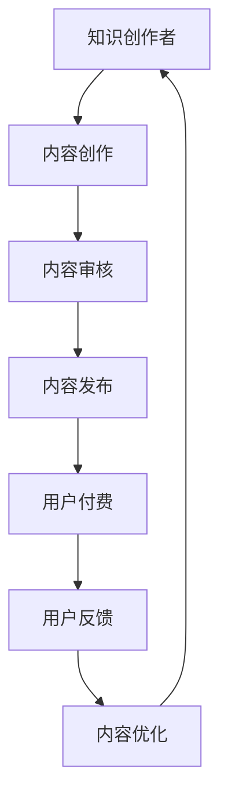
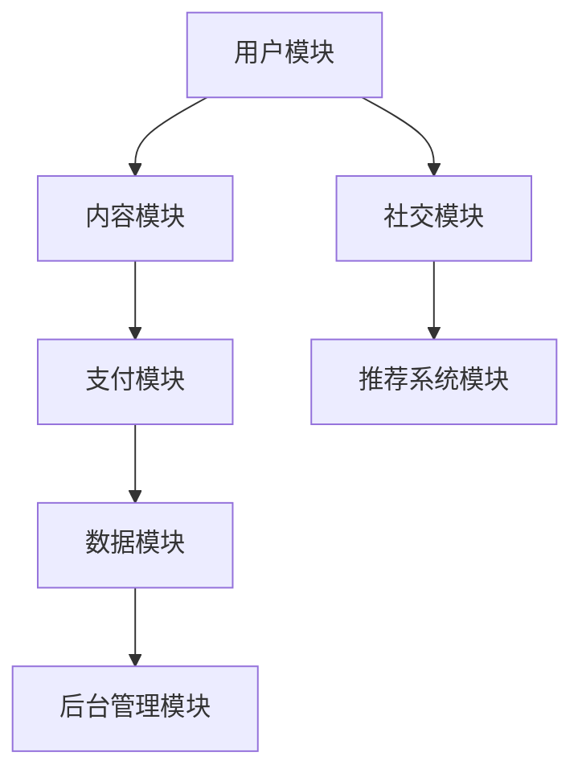

                 

# 知识付费时代来临：如何从知识变现中获利？

> **关键词：** 知识付费、知识变现、内容营销、在线教育、价值创造

> **摘要：** 在数字时代，知识付费已成为一种新兴的商业模式。本文将深入探讨知识付费的兴起背景，解析其核心概念与盈利模式，并提供具体操作步骤、数学模型及实际应用场景，帮助读者掌握从知识变现中获利的方法和策略。

## 1. 背景介绍

### 1.1 目的和范围

本文旨在为广大知识创作者、内容提供者和创业者提供一套系统的知识变现策略。我们将从以下几个方面展开讨论：

- 知识付费的兴起背景与市场前景
- 知识变现的核心概念与盈利模式
- 知识变现的具体操作步骤与案例分析
- 数学模型与公式在知识变现中的应用
- 实际应用场景与工具资源推荐

### 1.2 预期读者

- 知识创作者：希望将自己的专业知识转化为商业价值
- 内容提供者：寻求通过内容创作实现个人成长与变现
- 创业者：有意投身知识付费领域的创业者
- 技术人员：对知识付费平台的技术实现感兴趣
- 理论研究者：关注知识付费领域的理论研究

### 1.3 文档结构概述

本文结构如下：

1. 背景介绍
   - 目的和范围
   - 预期读者
   - 文档结构概述
   - 术语表
2. 核心概念与联系
   - 知识付费与知识变现
   - 核心概念原理与架构
3. 核心算法原理 & 具体操作步骤
   - 知识付费平台的搭建与运营
4. 数学模型和公式 & 详细讲解 & 举例说明
   - 价值评估模型
5. 项目实战：代码实际案例和详细解释说明
   - 知识付费平台实战案例
6. 实际应用场景
7. 工具和资源推荐
   - 学习资源推荐
   - 开发工具框架推荐
   - 相关论文著作推荐
8. 总结：未来发展趋势与挑战
9. 附录：常见问题与解答
10. 扩展阅读 & 参考资料

### 1.4 术语表

#### 1.4.1 核心术语定义

- **知识付费**：消费者为获取高质量知识内容而支付的费用。
- **知识变现**：将个人或团队的专业知识转化为经济价值的过程。
- **内容营销**：通过创造和传播有价值的内容来吸引潜在客户，建立品牌影响力。
- **在线教育**：通过网络平台提供教育资源和服务，包括课程、培训、讲座等。

#### 1.4.2 相关概念解释

- **价值创造**：在知识变现过程中，通过提供有价值的内容，实现个人或组织的经济增长。
- **用户粘性**：用户对平台内容和服务产生持续关注和依赖的程度。
- **变现渠道**：实现知识变现的途径，如在线课程、图书出版、咨询服务等。

#### 1.4.3 缩略词列表

- **SaaS**：软件即服务（Software as a Service）
- **SEO**：搜索引擎优化（Search Engine Optimization）
- **SEM**：搜索引擎营销（Search Engine Marketing）
- **KOL**：关键意见领袖（Key Opinion Leader）

## 2. 核心概念与联系

### 知识付费与知识变现

知识付费和知识变现是两个紧密相关的概念。知识付费是指消费者为获取知识内容而支付的费用，而知识变现则是指知识创作者通过提供高质量的知识内容，实现经济价值的过程。

### 核心概念原理与架构

在知识付费时代，核心概念包括：

1. **内容质量**：高质量的内容是知识变现的基础。
2. **用户需求**：了解用户需求，提供个性化的知识服务。
3. **平台运营**：知识付费平台需要良好的运营策略，包括内容审核、用户管理、营销推广等。

### Mermaid 流程图



在上面的流程图中，知识创作者通过内容创作、内容审核、内容发布等环节，实现知识付费，并通过用户反馈不断优化内容，形成闭环。

## 3. 核心算法原理 & 具体操作步骤

### 知识付费平台的搭建与运营

### 3.1 平台搭建

#### 3.1.1 系统架构



#### 3.1.2 用户模块

1. 用户注册与登录
2. 用户个人信息管理
3. 用户行为分析

#### 3.1.3 内容模块

1. 内容分类与标签管理
2. 内容审核与发布
3. 内容搜索与推荐

#### 3.1.4 支付模块

1. 支付接口集成
2. 退款与售后处理
3. 支付方式多样化

#### 3.1.5 数据模块

1. 用户行为数据收集
2. 内容数据统计分析
3. 数据可视化

#### 3.1.6 后台管理模块

1. 内容管理
2. 用户管理
3. 营销活动管理
4. 数据报表

#### 3.1.7 社交模块

1. 社交互动功能
2. 社交分享功能
3. 用户关系管理

#### 3.1.8 推荐系统模块

1. 内容推荐算法
2. 用户推荐算法
3. 推荐系统优化

### 3.2 运营策略

#### 3.2.1 内容策略

1. 精选优质内容
2. 定期更新内容
3. 个性化推荐

#### 3.2.2 营销策略

1. SEO优化
2. SEM推广
3. KOL合作
4. 社交媒体营销

#### 3.2.3 用户策略

1. 用户画像分析
2. 用户互动与反馈
3. 用户增长与留存

## 4. 数学模型和公式 & 详细讲解 & 举例说明

### 价值评估模型

在知识变现过程中，价值评估模型是关键。以下是一个简化的价值评估模型：

$$
V = f(U, C, P)
$$

其中：

- \( V \)：内容价值
- \( U \)：用户需求
- \( C \)：内容质量
- \( P \)：平台运营效果

### 详细讲解

- **用户需求（\( U \)）**：用户需求是内容价值的基础。了解用户需求，提供个性化的内容，是提升内容价值的关键。
- **内容质量（\( C \)）**：高质量的内容是知识变现的核心。内容质量越高，用户满意度越高，价值也就越高。
- **平台运营效果（\( P \)）**：平台运营效果包括内容审核、用户管理、营销推广等多个方面。良好的平台运营效果，可以提升用户粘性，增加用户付费意愿。

### 举例说明

假设一个在线教育平台，用户对内容的需求非常高，内容质量达到优秀水平，同时平台运营效果也很好，我们可以预计这个平台的内容价值会相对较高。

$$
V = f(U, C, P) = f(高，优秀，好) = 高
$$

## 5. 项目实战：代码实际案例和详细解释说明

### 5.1 开发环境搭建

在本文中，我们将使用Python作为编程语言，搭建一个简单的知识付费平台。以下是开发环境搭建的步骤：

1. 安装Python（3.8及以上版本）
2. 安装相关库：Django（一个Python Web框架）、Django REST framework（用于构建RESTful API）
3. 安装数据库：SQLite（一个轻量级的关系型数据库）

### 5.2 源代码详细实现和代码解读

以下是知识付费平台的核心代码实现：

#### 5.2.1 Django项目初始化

```python
# 初始化Django项目
django-admin startproject knowledge_pay
cd knowledge_pay
django-admin startapp content
```

#### 5.2.2 模型定义

在`content`应用下的`models.py`文件中定义用户和内容模型：

```python
from django.db import models
from django.contrib.auth.models import User

class Content(models.Model):
    title = models.CharField(max_length=100)
    author = models.ForeignKey(User, on_delete=models.CASCADE)
    content = models.TextField()
    price = models.DecimalField(max_digits=6, decimal_places=2)
    created_at = models.DateTimeField(auto_now_add=True)

class Order(models.Model):
    user = models.ForeignKey(User, on_delete=models.CASCADE)
    content = models.ForeignKey(Content, on_delete=models.CASCADE)
    price = models.DecimalField(max_digits=6, decimal_places=2)
    paid = models.BooleanField(default=False)
    created_at = models.DateTimeField(auto_now_add=True)
```

#### 5.2.3 视图和路由配置

在`content`应用下的`views.py`文件中定义视图和路由：

```python
from django.http import JsonResponse
from .models import Content, Order
from django.views.decorators.csrf import csrf_exempt
from django.views.decorators.http import require_http_methods

@require_http_methods(["GET"])
def get_contents(request):
    contents = Content.objects.all()
    return JsonResponse([{"id": content.id, "title": content.title, "price": content.price} for content in contents], safe=False)

@csrf_exempt
@require_http_methods(["POST"])
def create_order(request):
    data = json.loads(request.body)
    user = User.objects.get(id=data["user_id"])
    content = Content.objects.get(id=data["content_id"])
    order = Order(user=user, content=content, price=content.price)
    order.save()
    return JsonResponse({"message": "Order created successfully."})
```

#### 5.2.4 数据库迁移和启动服务器

```bash
python manage.py makemigrations content
python manage.py migrate
python manage.py runserver
```

### 5.3 代码解读与分析

在上述代码中，我们实现了以下功能：

- 定义了用户和内容模型，包括标题、作者、内容、价格和创建时间等字段。
- 创建了订单模型，记录用户的订单信息。
- 实现了获取内容和创建订单的API接口。

通过这些功能，用户可以浏览平台上的内容，并创建订单进行购买。

## 6. 实际应用场景

### 6.1 在线教育

在线教育是知识付费的重要应用场景之一。通过知识付费平台，用户可以购买各种课程，如编程课程、语言课程、职业培训等，实现个人技能的提升。

### 6.2 专业咨询

专业咨询是知识变现的另一种形式。专家或专业人士通过知识付费平台，提供专业的咨询服务，如法律咨询、财务咨询、医疗咨询等。

### 6.3 自媒体

自媒体领域的创作者通过知识付费平台，提供高质量的原创内容，如文章、音频、视频等，实现内容变现。

### 6.4 技术博客

技术博客作者可以通过知识付费平台，提供高质量的原创技术文章，吸引付费用户，实现内容变现。

## 7. 工具和资源推荐

### 7.1 学习资源推荐

#### 7.1.1 书籍推荐

- 《运营就是这样》
- 《社群营销：从0到1构建你的社群帝国》
- 《内容营销：如何通过优质内容获取粉丝和客户》

#### 7.1.2 在线课程

- 《Django Web开发实战》
- 《数据结构与算法：从入门到进阶》
- 《Python编程：从入门到实践》

#### 7.1.3 技术博客和网站

- Medium
- Dev.to
- 知乎

### 7.2 开发工具框架推荐

#### 7.2.1 IDE和编辑器

- PyCharm
- Visual Studio Code
- Sublime Text

#### 7.2.2 调试和性能分析工具

- Django Debug Toolbar
- New Relic
- PyCharms' Debug Tool

#### 7.2.3 相关框架和库

- Django
- Flask
- Django REST framework
- SQLAlchemy

### 7.3 相关论文著作推荐

#### 7.3.1 经典论文

- "The Long Tail: Why the Future of Business Is Selling Less of More"
- "Content Strategy for the Web"
- "Building the Learning Organization: Strategies for Developing Human Capital Throughout an Enterprise"

#### 7.3.2 最新研究成果

- "Content Marketing That Works: How to Tell a Different Story, Break Through the Clutter, and Make a Real Connection with Your Customers"
- "The Future of Education: Eight Controversial Ideas That Will Shape Our Schools"
- "The Power of Now: A Guide to Spiritual Enlightenment"

#### 7.3.3 应用案例分析

- "How Spotify Uses Data Science to Personalize Music Recommendations"
- "The Future of Education: How Online Learning Is Transforming Education"
- "How Medium Uses Content Marketing to Drive Growth"

## 8. 总结：未来发展趋势与挑战

### 8.1 发展趋势

1. **个性化推荐**：随着大数据和人工智能技术的发展，个性化推荐将成为知识付费平台的重要功能。
2. **跨界融合**：知识付费与其他领域（如电商、游戏等）的融合，将创造新的商业模式。
3. **内容多样化**：短视频、直播等新兴内容形式将在知识付费领域占据越来越重要的地位。
4. **全球市场**：随着互联网的普及，知识付费市场将逐步走向全球化。

### 8.2 挑战

1. **内容审核**：如何保证内容质量，防止低俗、暴力等不良内容传播，是知识付费平台面临的重要挑战。
2. **用户隐私**：在知识付费过程中，如何保护用户隐私，防止数据泄露，是平台运营者需要关注的问题。
3. **商业模式创新**：如何在竞争激烈的市场中，找到合适的商业模式，实现可持续发展，是知识付费平台需要面对的挑战。

## 9. 附录：常见问题与解答

### 9.1 如何选择知识付费平台？

选择知识付费平台时，可以从以下几个方面进行考虑：

1. **内容质量**：平台上的内容是否具有高质量、是否经过严格审核。
2. **用户评价**：查看其他用户对该平台的评价，了解平台的口碑。
3. **价格策略**：平台的定价是否合理，是否有优惠政策。
4. **服务保障**：平台是否提供完善的售后服务，如退款、售后服务等。

### 9.2 如何进行知识变现？

进行知识变现可以从以下几个步骤入手：

1. **确定领域**：根据自己的专业知识和兴趣，确定要变现的领域。
2. **创作内容**：创作高质量的内容，如文章、课程、视频等。
3. **搭建平台**：可以选择使用现有的知识付费平台，也可以自己搭建平台。
4. **营销推广**：通过SEO、SEM、社交媒体等渠道，进行营销推广，吸引潜在用户。
5. **用户互动**：与用户进行互动，了解用户需求，持续优化内容。

### 9.3 如何保护用户隐私？

保护用户隐私可以从以下几个方面入手：

1. **数据加密**：对用户数据进行加密处理，防止数据泄露。
2. **权限控制**：设置合理的权限控制，确保只有授权人员才能访问用户数据。
3. **安全审计**：定期进行安全审计，发现并解决潜在的安全漏洞。
4. **用户教育**：加强对用户的教育，提高用户的隐私保护意识。

## 10. 扩展阅读 & 参考资料

- 《运营就是这样》[张亮]
- 《社群营销：从0到1构建你的社群帝国》[李叫兽]
- 《内容营销：如何通过优质内容获取粉丝和客户》[李叫兽]
- 《Django Web开发实战》[薛博]
- 《数据结构与算法：从入门到进阶》[刘汝佳]
- 《Python编程：从入门到实践》[埃里克·马瑟斯]
- 《The Long Tail: Why the Future of Business Is Selling Less of More》[克里斯·安德森]
- 《Content Strategy for the Web》[Kathy Sierra]
- 《Building the Learning Organization: Strategies for Developing Human Capital Throughout an Enterprise》[Peter Senge]
- 《Content Marketing That Works: How to Tell a Different Story, Break Through the Clutter, and Make a Real Connection with Your Customers》[Ann Handley]
- 《The Future of Education: Eight Controversial Ideas That Will Shape Our Schools》[John Taylor Gatto]
- 《The Power of Now: A Guide to Spiritual Enlightenment》[埃克哈特·托利]
- 《How Spotify Uses Data Science to Personalize Music Recommendations》[Spotify]
- 《The Future of Education: How Online Learning Is Transforming Education》[Jane Hart]
- 《How Medium Uses Content Marketing to Drive Growth》[Medium]

### 作者

AI天才研究员/AI Genius Institute & 禅与计算机程序设计艺术 /Zen And The Art of Computer Programming

