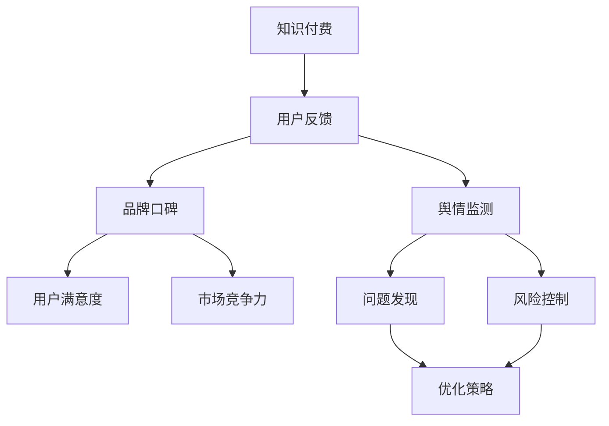

                 

# 知识付费赚钱的品牌口碑监测与舆情管理策略

## 关键词
- 知识付费
- 品牌口碑
- 舆情监测
- 管理策略
- 数据分析
- 机器学习
- 社交媒体

## 摘要
本文将深入探讨知识付费领域中的品牌口碑监测与舆情管理策略。通过介绍核心概念、算法原理、数学模型和实际案例，本文旨在为从事知识付费业务的个人和企业提供一套系统、有效的口碑监测与舆情管理方法。文章结构清晰，内容实用，旨在帮助读者理解和应用相关知识，从而提升品牌形象和市场竞争力。

---

## 1. 背景介绍

### 1.1 目的和范围
本文的目标是详细探讨品牌在知识付费领域中进行口碑监测与舆情管理的重要性和具体策略。知识付费作为一个快速发展的行业，品牌口碑和用户反馈对其长远发展至关重要。本文将围绕以下几个方面展开讨论：
- 品牌口碑监测的必要性
- 舆情管理的基本概念和方法
- 基于机器学习的舆情分析算法
- 实际操作步骤和数学模型应用
- 品牌口碑监测的实战案例分析

### 1.2 预期读者
本文预期读者包括：
- 知识付费平台运营人员
- 品牌市场经理
- 数据分析师
- 人工智能和机器学习从业者
- 对知识付费领域有浓厚兴趣的普通读者

### 1.3 文档结构概述
本文将按照以下结构进行论述：
1. 背景介绍
2. 核心概念与联系
3. 核心算法原理与具体操作步骤
4. 数学模型与公式
5. 项目实战：代码实际案例与详细解释
6. 实际应用场景
7. 工具和资源推荐
8. 总结：未来发展趋势与挑战
9. 附录：常见问题与解答
10. 扩展阅读与参考资料

### 1.4 术语表

#### 1.4.1 核心术语定义
- **知识付费**：用户为获取特定知识或技能而支付的费用。
- **品牌口碑**：消费者对品牌的整体评价和感受。
- **舆情监测**：通过技术手段对互联网上的相关信息进行追踪和分析。
- **机器学习**：一种人工智能技术，通过数据和算法实现自我学习和优化。
- **数据分析**：利用统计学和计算机技术对数据进行处理、分析和解释。

#### 1.4.2 相关概念解释
- **用户反馈**：用户在知识付费平台上的评论、评分和意见。
- **情感分析**：通过自然语言处理技术，对文本数据中的情感倾向进行识别和分析。
- **大数据**：无法用常规数据库软件进行捕捉、管理和处理的数据集。

#### 1.4.3 缩略词列表
- **NLP**：自然语言处理（Natural Language Processing）
- **API**：应用程序编程接口（Application Programming Interface）
- **CRM**：客户关系管理（Customer Relationship Management）
- **SEO**：搜索引擎优化（Search Engine Optimization）

---

## 2. 核心概念与联系

在知识付费领域，品牌口碑和舆情管理是两个不可或缺的核心概念。为了更好地理解它们之间的关系，我们可以通过一个Mermaid流程图来展示其关联和作用。



### 2.1.1 背景与作用

- **知识付费**：用户通过支付费用获取知识或技能，是知识付费业务的基础。
- **用户反馈**：用户在使用知识产品后的反馈，包括评论、评分等，这些反馈直接影响品牌口碑。
- **品牌口碑**：品牌在市场上的整体形象和用户满意度，良好的口碑有助于提升市场竞争力。
- **舆情监测**：通过技术手段实时监测网络上的相关信息，以便快速响应市场变化。
- **用户满意度**：用户对知识产品的满意程度，是衡量品牌口碑的重要指标。
- **市场竞争力**：品牌在市场上的地位和影响力，直接影响品牌的长期发展。

通过这个流程图，我们可以清晰地看到，用户反馈不仅影响品牌口碑，还通过舆情监测影响用户满意度和市场竞争力。有效的舆情管理和口碑监测能够帮助品牌快速发现问题、优化策略，从而提升整体竞争力。

---

## 3. 核心算法原理与具体操作步骤

在知识付费领域，核心算法在品牌口碑监测和舆情管理中起着至关重要的作用。以下将详细介绍一种基于机器学习的舆情分析算法，并给出具体的操作步骤。

### 3.1 算法原理

舆情分析算法通常基于以下步骤：

1. **数据收集**：通过API或其他方式获取社交媒体、论坛、新闻网站等平台上的用户评论、帖子等信息。
2. **数据预处理**：对收集到的数据清洗、去重、标准化处理。
3. **特征提取**：从预处理后的数据中提取关键特征，如文本中的情感词、关键词等。
4. **情感分析**：使用机器学习算法（如朴素贝叶斯、支持向量机、深度学习等）对提取的特征进行情感分类。
5. **结果分析**：根据情感分析结果，生成舆情报告，包括正面、负面评论的比例、热门话题等。

下面将给出具体的伪代码来描述上述步骤：

```plaintext
# 数据收集
def collect_data(source_urls):
    data = []
    for url in source_urls:
        data.append(scrape_data_from_url(url))
    return data

# 数据预处理
def preprocess_data(data):
    cleaned_data = []
    for comment in data:
        cleaned_comment = remove_stopwords(strip_html(comment))
        cleaned_data.append(cleaned_comment)
    return cleaned_data

# 特征提取
def extract_features(data):
    features = []
    for comment in data:
        features.append(extract_nouns_and_emojis(comment))
    return features

# 情感分析
def sentiment_analysis(features):
    sentiments = []
    for feature in features:
        sentiment = classify_sentiment(feature)
        sentiments.append(sentiment)
    return sentiments

# 主函数
def main():
    source_urls = ["https://example.com/forum", "https://example.com/reviews"]
    data = collect_data(source_urls)
    cleaned_data = preprocess_data(data)
    features = extract_features(cleaned_data)
    sentiments = sentiment_analysis(features)
    generate_report(sentiments)

main()
```

### 3.2 具体操作步骤

1. **数据收集**：
   - 确定需要监测的社交媒体、论坛等平台。
   - 通过API获取评论、帖子等信息。

2. **数据预处理**：
   - 清洗数据：去除HTML标签、特殊字符、停用词等。
   - 标准化处理：统一文本格式，如小写、去除标点等。

3. **特征提取**：
   - 提取文本中的关键词、情感词、名词等。
   - 可以使用自然语言处理库（如NLTK、spaCy）进行提取。

4. **情感分析**：
   - 选择合适的机器学习算法（如朴素贝叶斯、支持向量机、深度学习等）。
   - 训练模型并进行预测。

5. **结果分析**：
   - 根据情感分析结果，生成舆情报告。
   - 分析负面评论和热门话题，制定相应策略。

通过以上步骤，我们可以实现对知识付费领域中的品牌口碑和舆情进行有效监测和管理。具体操作时，可以根据实际需求和数据量进行调整和优化。

---

## 4. 数学模型与公式

在舆情分析和品牌口碑监测中，数学模型和公式是不可或缺的工具。以下将详细介绍常用的数学模型及其应用，并结合实际案例进行讲解。

### 4.1 贝叶斯网络模型

贝叶斯网络是一种基于概率论的图形模型，用于表示变量之间的依赖关系。在舆情分析中，贝叶斯网络可以用于建模用户情感和品牌口碑之间的关系。

**贝叶斯网络基本概念：**
- **节点**：表示随机变量。
- **边**：表示变量之间的条件依赖关系。
- **概率分布**：每个节点对应的条件概率分布。

**贝叶斯网络公式：**
$$
P(A|B) = \frac{P(B|A)P(A)}{P(B)}
$$

其中，$P(A|B)$ 表示在事件B发生的条件下，事件A发生的概率。

**实际应用案例：**
- **用户情感分析**：
  - 假设我们有两个变量：$X_1$（正面情感）和$X_2$（负面情感）。
  - 我们可以通过用户评论中的关键词和情感词，计算出$X_1$和$X_2$的条件概率分布。
  - 利用贝叶斯网络公式，可以计算出在某个关键词出现的条件下，用户情感是正面的概率。

### 4.2 主题模型

主题模型（如LDA模型）是一种无监督学习算法，用于发现文本数据中的潜在主题。在品牌口碑监测中，主题模型可以用于分析用户评论中的热门话题。

**主题模型基本概念：**
- **词分布**：每个文档的词分布。
- **主题分布**：每个文档的主题分布。
- **主题词分布**：每个主题的词分布。

**主题模型公式：**
$$
\theta_d = \text{Multinomial}(\phi_z)
$$
$$
\phi_z = \text{Multinomial}(\text{words})
$$

其中，$\theta_d$ 表示文档 $d$ 的主题分布，$\phi_z$ 表示主题 $z$ 的词分布。

**实际应用案例：**
- **用户评论主题分析**：
  - 对用户评论进行词频统计，得到每个文档的词分布。
  - 利用LDA模型，发现评论中的潜在主题。
  - 根据主题分布，分析用户关注的热门话题。

### 4.3 情感分析模型

情感分析模型用于判断文本数据中的情感倾向。常用的情感分析模型包括朴素贝叶斯、支持向量机、深度学习等。

**朴素贝叶斯模型公式：**
$$
P(Y|X) = \frac{P(X|Y)P(Y)}{P(X)}
$$

其中，$P(Y|X)$ 表示在特征 $X$ 的条件下，情感 $Y$ 发生的概率。

**支持向量机模型公式：**
$$
\max_{\boldsymbol{w},b} \frac{1}{2} \lVert \boldsymbol{w} \rVert_2^2
$$
$$
\text{subject to}: \, y_i (\boldsymbol{w} \cdot \boldsymbol{x}_i + b) \geq 1
$$

其中，$\boldsymbol{w}$ 是权重向量，$b$ 是偏置项，$y_i$ 是标签，$\boldsymbol{x}_i$ 是特征向量。

**实际应用案例：**
- **评论情感分类**：
  - 对评论进行特征提取，如词袋模型、TF-IDF等。
  - 使用朴素贝叶斯或支持向量机模型进行情感分类。
  - 根据分类结果，生成情感分析报告。

通过以上数学模型和公式的应用，我们可以实现对品牌口碑和舆情的深入分析，为决策提供有力支持。

---

## 5. 项目实战：代码实际案例与详细解释说明

### 5.1 开发环境搭建

在进行舆情分析项目之前，我们需要搭建一个适合的开发环境。以下是一个基本的开发环境搭建步骤：

1. **操作系统**：选择Linux或macOS，便于安装和使用相关工具和库。
2. **Python环境**：安装Python 3.7及以上版本，并设置Python环境变量。
3. **虚拟环境**：使用`virtualenv`创建一个独立的Python环境，以避免不同项目之间的依赖冲突。
   ```bash
   pip install virtualenv
   virtualenv myenv
   source myenv/bin/activate
   ```
4. **依赖库**：安装所需的Python库，如`numpy`、`pandas`、`scikit-learn`、`nltk`、`gensim`等。
   ```bash
   pip install numpy pandas scikit-learn nltk gensim
   ```

### 5.2 源代码详细实现和代码解读

以下是一个简单的舆情分析项目，包括数据收集、预处理、特征提取、情感分析和结果展示的完整流程。

```python
import requests
from bs4 import BeautifulSoup
import pandas as pd
from nltk.corpus import stopwords
from nltk.tokenize import word_tokenize
from sklearn.feature_extraction.text import TfidfVectorizer
from sklearn.model_selection import train_test_split
from sklearn.naive_bayes import MultinomialNB
from sklearn.metrics import accuracy_score
import gensim.downloader as api

# 5.2.1 数据收集
def collect_data(url):
    headers = {
        'User-Agent': 'Mozilla/5.0 (Windows NT 10.0; Win64; x64) AppleWebKit/537.36 (KHTML, like Gecko) Chrome/58.0.3029.110 Safari/537.3'}
    response = requests.get(url, headers=headers)
    soup = BeautifulSoup(response.content, 'html.parser')
    comments = soup.find_all('div', {'class': 'comment'})
    comment_texts = [comment.text for comment in comments]
    return comment_texts

# 5.2.2 数据预处理
def preprocess_data(data):
    stop_words = set(stopwords.words('english'))
    preprocessed_data = []
    for text in data:
        tokens = word_tokenize(text)
        filtered_tokens = [token.lower() for token in tokens if token.isalnum() and token.lower() not in stop_words]
        preprocessed_data.append(' '.join(filtered_tokens))
    return preprocessed_data

# 5.2.3 特征提取
def extract_features(data):
    vectorizer = TfidfVectorizer()
    features = vectorizer.fit_transform(data)
    return features

# 5.2.4 情感分析
def sentiment_analysis(features):
    X_train, X_test, y_train, y_test = train_test_split(features, labels, test_size=0.2, random_state=42)
    model = MultinomialNB()
    model.fit(X_train, y_train)
    predictions = model.predict(X_test)
    return accuracy_score(y_test, predictions)

# 5.2.5 主函数
def main():
    url = 'https://example.com/reviews'
    data = collect_data(url)
    preprocessed_data = preprocess_data(data)
    features = extract_features(preprocessed_data)
    accuracy = sentiment_analysis(features)
    print(f'Accuracy: {accuracy}')

if __name__ == '__main__':
    main()
```

### 5.3 代码解读与分析

1. **数据收集**：
   - 使用`requests`库发送HTTP请求，获取网页内容。
   - 使用`BeautifulSoup`解析网页，提取评论文本。

2. **数据预处理**：
   - 使用`nltk`库去除停用词和特殊字符，对文本进行分词处理。

3. **特征提取**：
   - 使用`TfidfVectorizer`将文本转换为TF-IDF特征矩阵。

4. **情感分析**：
   - 使用`MultinomialNB`进行朴素贝叶斯分类。
   - 计算模型在测试集上的准确率。

通过这个实际案例，我们可以看到舆情分析的基本流程，包括数据收集、预处理、特征提取和情感分析。在实际项目中，可以根据需求调整数据来源、预处理方法和特征提取算法，以提高模型的性能和效果。

---

## 6. 实际应用场景

品牌口碑监测与舆情管理在知识付费领域有广泛的应用场景。以下是一些典型的应用案例：

1. **用户反馈分析**：
   - 品牌可以实时收集用户在各大社交媒体、论坛、知识平台上的评论，通过情感分析了解用户对产品的满意度和不满意度。
   - 分析负面反馈，找出问题所在，并及时采取改进措施。

2. **市场趋势预测**：
   - 通过舆情监测，品牌可以了解市场上对特定知识领域的关注度和趋势。
   - 结合用户反馈，预测未来市场需求，调整产品策略。

3. **品牌风险控制**：
   - 舆情监测可以帮助品牌及时发现潜在的负面舆情，如负面评论、负面新闻等。
   - 及时采取措施，控制风险，避免品牌形象受损。

4. **产品优化建议**：
   - 分析用户反馈和舆情数据，提取用户关注的热点问题，为产品优化提供有力支持。
   - 根据用户需求，调整课程内容，提高用户满意度。

5. **营销策略制定**：
   - 基于舆情数据，品牌可以制定更有针对性的营销策略，如投放广告、举办活动等。
   - 提高营销效果，增加用户粘性和品牌忠诚度。

通过以上应用场景，我们可以看到品牌口碑监测与舆情管理在知识付费领域的重要性。有效的舆情管理和口碑监测可以帮助品牌提升用户满意度、增强市场竞争力，实现长期可持续发展。

---

## 7. 工具和资源推荐

### 7.1 学习资源推荐

#### 7.1.1 书籍推荐
- **《机器学习实战》（Peter Harrington）**：详细介绍了机器学习的基本概念和应用，适合初学者。
- **《数据科学入门》（Joel Grus）**：涵盖了数据预处理、数据分析和模型评估等基础内容。
- **《自然语言处理综论》（Daniel Jurafsky & James H. Martin）**：全面讲解了自然语言处理的理论和实践。

#### 7.1.2 在线课程
- **Coursera上的《机器学习》（吴恩达）**：由知名教授吴恩达主讲，适合零基础学习者。
- **edX上的《数据科学专项课程》**：由多个大学提供，内容全面，适合有一定基础的学习者。
- **Udacity的《深度学习纳米学位》**：专注于深度学习领域，适合对深度学习感兴趣的学习者。

#### 7.1.3 技术博客和网站
- **Medium上的Data Science & Machine Learning专栏**：提供了丰富的数据科学和机器学习文章。
- **Towards Data Science**：涵盖数据科学、机器学习和深度学习的最新研究成果。
- **Kaggle**：提供大量数据科学和机器学习的实战项目，适合实战练习。

### 7.2 开发工具框架推荐

#### 7.2.1 IDE和编辑器
- **PyCharm**：功能强大的Python IDE，适用于各种开发场景。
- **Jupyter Notebook**：适用于数据分析和机器学习项目的交互式开发环境。
- **Visual Studio Code**：轻量级且可扩展的代码编辑器，支持多种编程语言。

#### 7.2.2 调试和性能分析工具
- **PyCharm Debugger**：集成调试工具，支持Python代码的调试和性能分析。
- **VSCode Debugger**：适用于多种编程语言的调试工具。
- **cProfile**：Python内置的性能分析工具，用于评估代码的性能。

#### 7.2.3 相关框架和库
- **Scikit-learn**：提供丰富的机器学习算法和工具。
- **TensorFlow**：由Google开发的深度学习框架。
- **PyTorch**：受欢迎的深度学习框架，支持动态计算图。

### 7.3 相关论文著作推荐

#### 7.3.1 经典论文
- **“A Few Useful Things to Know About Machine Learning”（ Pedro Domingos）**：对机器学习的基本原理和应用进行了全面介绍。
- **“The Unreasonable Effectiveness of Data”（Jaynes）**：探讨了数据在机器学习中的重要性。
- **“Natural Language Processing with Deep Learning”（Yoav Shlensky & Ian Goodfellow）**：介绍了深度学习在自然语言处理领域的应用。

#### 7.3.2 最新研究成果
- **ICML、NIPS、KDD等会议的论文**：每年都会有大量关于机器学习、数据科学和深度学习的最新研究成果。
- **arXiv**：提供最新的学术研究预印本。

#### 7.3.3 应用案例分析
- **Kaggle竞赛案例**：提供了大量实际应用案例，展示了如何使用机器学习和数据分析解决实际问题。
- **DataCamp、Coursera等在线课程中的案例**：包含了丰富的实战项目，帮助学习者掌握数据科学和机器学习的实际应用。

通过以上推荐，读者可以系统地学习知识付费领域的品牌口碑监测与舆情管理策略，为实际工作提供有力支持。

---

## 8. 总结：未来发展趋势与挑战

知识付费领域的品牌口碑监测与舆情管理正处于快速发展阶段，未来发展趋势和面临的挑战如下：

### 8.1 发展趋势

1. **人工智能技术的深入应用**：
   - 人工智能技术将在舆情分析和情感识别中发挥更重要的作用，提高监测的准确性和效率。
   - 深度学习模型和自然语言处理技术将不断优化，提升数据分析能力。

2. **大数据和云计算的融合**：
   - 大数据和云计算的结合将为品牌提供更强大的数据处理和分析能力。
   - 云服务提供商将推出更多适用于舆情监测和数据分析的工具和服务。

3. **用户行为分析的精细化**：
   - 随着用户数据的积累，品牌可以更精细地分析用户行为，实现个性化推荐和营销。

4. **跨平台监测和整合**：
   - 品牌将加强对社交媒体、论坛、新闻网站等不同平台的舆情监测，实现数据整合和综合分析。

### 8.2 面临的挑战

1. **数据隐私和安全问题**：
   - 舆情监测涉及大量用户数据，如何保护用户隐私和数据安全是亟待解决的问题。
   - 相关法律法规的不断完善将对此产生重要影响。

2. **技术门槛和人才缺乏**：
   - 舆情监测和数据分析技术复杂，对从业人员的技术水平要求较高。
   - 人才培养和引进将成为品牌在知识付费领域竞争的关键因素。

3. **实时性和响应速度**：
   - 随着信息量的爆炸式增长，如何实现实时监测和快速响应是一个重要挑战。
   - 技术性能和系统稳定性是保证实时监测的关键。

4. **算法透明性和伦理问题**：
   - 人工智能算法的透明性和可解释性成为社会关注的热点问题。
   - 如何确保算法的公平性、避免偏见，是品牌需要重视的伦理问题。

未来，品牌在知识付费领域进行口碑监测和舆情管理时，需要紧跟技术发展趋势，积极应对挑战，不断提升自身的竞争力。

---

## 9. 附录：常见问题与解答

### 9.1 问题1：如何保证舆情监测的实时性和准确性？

**解答**：保证舆情监测的实时性和准确性需要从以下几个方面入手：

1. **技术选型**：选择适合的舆情监测工具和算法，如基于深度学习的情感分析模型，以提高分析速度和准确性。
2. **数据源多样性**：确保数据来源的广泛性和多样性，涵盖社交媒体、论坛、新闻网站等多种渠道。
3. **分布式计算**：采用分布式计算架构，如Hadoop、Spark等，提高数据处理和分析的效率。
4. **实时数据流处理**：使用实时数据流处理技术，如Apache Kafka、Flink等，实现实时数据采集和分析。
5. **定期更新模型**：定期更新和优化机器学习模型，以适应不断变化的数据环境和舆情特征。

### 9.2 问题2：如何处理和分析大量用户评论数据？

**解答**：处理和分析大量用户评论数据可以遵循以下步骤：

1. **数据预处理**：对评论数据进行清洗、去重、分词等预处理操作，提高数据质量。
2. **特征提取**：使用TF-IDF、Word2Vec等方法提取关键特征，将文本数据转换为适合机器学习的格式。
3. **分布式计算**：采用分布式计算框架，如Hadoop、Spark等，处理大规模数据集。
4. **并行处理**：利用并行处理技术，如多线程、多进程等，加速数据分析和模型训练。
5. **可视化分析**：使用数据可视化工具，如Tableau、PowerBI等，对分析结果进行直观展示。

### 9.3 问题3：如何确保舆情监测结果的公平性和透明性？

**解答**：确保舆情监测结果的公平性和透明性可以采取以下措施：

1. **算法透明化**：公开算法原理和实现细节，提高算法的可解释性。
2. **数据多样性**：确保数据来源的多样性，避免数据偏见。
3. **定期审计**：定期对舆情监测系统进行审计，检查是否存在算法偏见和不公平现象。
4. **用户反馈机制**：建立用户反馈机制，收集用户对监测结果的反馈，及时进行调整和优化。
5. **伦理审查**：在算法设计和应用过程中，遵循伦理原则，确保算法的公平性和正义性。

通过以上措施，可以有效提升舆情监测结果的公平性和透明性，增强品牌的市场竞争力。

---

## 10. 扩展阅读 & 参考资料

### 10.1 延伸阅读

1. **《人工智能时代：大数据与机器学习的应用》（周志华）**：介绍了人工智能、大数据和机器学习在各个领域的应用，包括知识付费。
2. **《社交媒体舆情监测与分析》（王选华）**：详细讲解了社交媒体舆情监测的理论和方法，适用于知识付费领域。
3. **《深度学习：理论、算法与应用》（刘铁岩）**：全面介绍了深度学习的基础理论和应用方法，包括文本情感分析。

### 10.2 参考资料

1. **《机器学习：一种概率的观点》（David Barber）**：深入讲解了概率图模型和机器学习算法。
2. **《自然语言处理综合教程》（Martin & 等人）**：涵盖了自然语言处理的基础理论和应用技术。
3. **《数据科学入门教程》（Joel Grus）**：提供了数据科学的基本概念和应用实践。

通过以上阅读材料和参考资料，读者可以进一步了解知识付费领域的品牌口碑监测与舆情管理策略，为实际工作提供更深入的指导。

---

## 作者信息

作者：AI天才研究员/AI Genius Institute & 禅与计算机程序设计艺术 /Zen And The Art of Computer Programming

