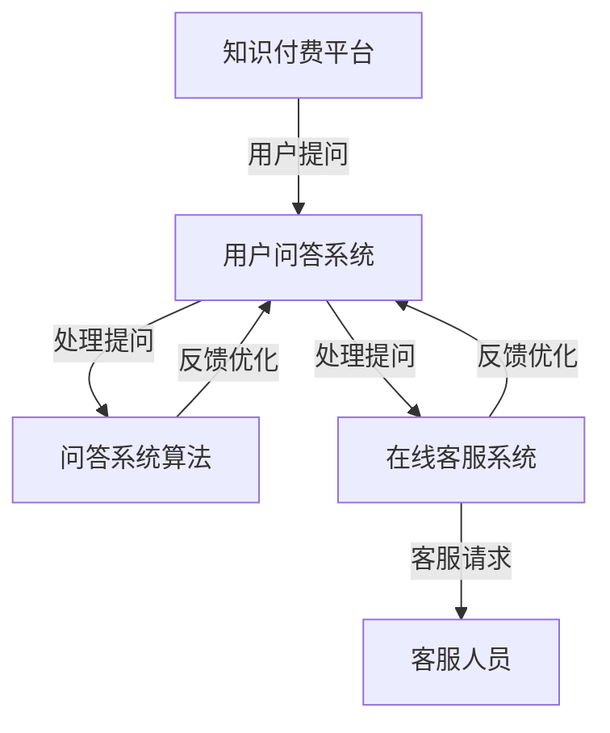

                 

# 知识付费赚钱的用户问答互动与在线客服

> 关键词：知识付费、用户问答、在线客服、人工智能、互动体验、服务优化

> 摘要：本文将探讨知识付费领域中的用户问答互动与在线客服的重要性，分析其核心原理和操作步骤，并通过实际案例展示如何构建高效的问答与客服系统，以提升用户体验和实现盈利目标。

## 1. 背景介绍

### 1.1 目的和范围

本文旨在深入探讨知识付费领域中用户问答互动与在线客服的应用和实践。通过分析其核心原理、操作步骤，以及实际应用场景，本文旨在为从业者和开发者提供一套完整的解决方案，以提升用户体验，优化服务流程，实现知识付费的商业价值。

### 1.2 预期读者

本文适用于以下读者群体：

- 知识付费平台的产品经理和运营人员
- 人工智能与自然语言处理领域的工程师和技术人员
- 对知识付费行业感兴趣的投资人、创业者

### 1.3 文档结构概述

本文结构如下：

- 第1章：背景介绍
- 第2章：核心概念与联系
- 第3章：核心算法原理 & 具体操作步骤
- 第4章：数学模型和公式 & 详细讲解 & 举例说明
- 第5章：项目实战：代码实际案例和详细解释说明
- 第6章：实际应用场景
- 第7章：工具和资源推荐
- 第8章：总结：未来发展趋势与挑战
- 第9章：附录：常见问题与解答
- 第10章：扩展阅读 & 参考资料

### 1.4 术语表

#### 1.4.1 核心术语定义

- 知识付费：指用户为获取有价值的信息或知识而支付的费用。
- 用户问答：指用户在知识付费平台上提出问题，专家或其他用户给予回答的过程。
- 在线客服：指通过互联网平台提供实时或非实时客服服务的系统。

#### 1.4.2 相关概念解释

- 自然语言处理（NLP）：研究如何让计算机理解、生成和处理人类语言的技术。
- 人工智能（AI）：模拟人类智能行为的技术体系。
- 问答系统：用于处理用户提问并给出合适回答的计算机系统。

#### 1.4.3 缩略词列表

- NLP：自然语言处理
- AI：人工智能
- QA：问答
- SaaS：软件即服务
- API：应用程序编程接口

## 2. 核心概念与联系

在知识付费领域，用户问答互动与在线客服是两个核心组成部分。它们之间的联系如图所示：



### 2.1 用户问答系统

用户问答系统是知识付费平台的核心功能之一，它允许用户在平台上提出问题，并获取相关领域的专家或其他用户的回答。用户问答系统通常包括以下几个部分：

- 用户提问：用户通过平台提交问题，可以是文本、语音或图片等形式。
- 提问审核：平台对用户提问进行审核，确保问题的质量。
- 回答审核：对用户回答进行审核，确保回答的准确性和可靠性。
- 回答推送：将合适的回答推送给提问用户。

### 2.2 在线客服系统

在线客服系统是知识付费平台的另一个重要组成部分，它提供实时或非实时的客服服务，以解答用户的问题，解决用户在平台使用过程中遇到的问题。在线客服系统通常包括以下几个部分：

- 客服请求：用户通过平台发起客服请求，可以是文本、语音或图片等形式。
- 客服分派：将客服请求分派给合适的客服人员。
- 客服响应：客服人员对用户请求进行响应，提供解决方案。
- 客服评价：用户对客服服务进行评价，以便平台优化客服流程。

### 2.3 问答系统算法

问答系统算法是用户问答系统的核心，它用于处理用户提问并给出合适的回答。问答系统算法通常包括以下几个步骤：

- 问题理解：将用户提问转化为计算机可理解的形式。
- 知识库检索：从知识库中检索与提问相关的信息。
- 回答生成：根据检索到的信息生成回答。
- 回答优化：对回答进行优化，提高回答的准确性和可读性。

### 2.4 客服系统算法

客服系统算法是在线客服系统的核心，它用于处理用户请求并给出合适的解决方案。客服系统算法通常包括以下几个步骤：

- 请求理解：将用户请求转化为计算机可理解的形式。
- 问题分类：对请求进行分类，确定请求的类型和优先级。
- 解决方案生成：根据请求类型和知识库生成解决方案。
- 解决方案推送：将解决方案推送给用户。

## 3. 核心算法原理 & 具体操作步骤

### 3.1 用户问答系统算法

用户问答系统算法的核心在于将用户提问转化为计算机可理解的形式，并从知识库中检索相关信息，生成合适的回答。以下是用户问答系统算法的具体操作步骤：

#### 3.1.1 问题理解

```markdown
# 问题理解

问题理解是将用户提问转化为计算机可理解的形式。具体步骤如下：

1. 分词：将用户提问分解为单个词语。
2. 词性标注：对每个词语进行词性标注，例如名词、动词、形容词等。
3. 标点符号处理：去除标点符号，或将标点符号作为特殊词语处理。
4. 语法分析：对提问进行语法分析，确定词语之间的语法关系。
```

#### 3.1.2 知识库检索

```markdown
# 知识库检索

知识库检索是从知识库中检索与提问相关的信息。具体步骤如下：

1. 检索关键词：根据问题理解结果，提取关键词。
2. 知识库查询：使用关键词在知识库中进行查询，获取相关文档。
3. 文档排序：根据查询结果的相关性对文档进行排序。
```

#### 3.1.3 回答生成

```markdown
# 回答生成

回答生成是根据检索到的信息生成回答。具体步骤如下：

1. 文本生成：根据检索结果，生成回答的文本内容。
2. 文本优化：对生成的文本进行优化，提高可读性和准确性。
3. 多样性生成：生成多个不同的回答，以便用户选择。
```

### 3.2 客服系统算法

客服系统算法的核心在于处理用户请求并给出合适的解决方案。以下是客服系统算法的具体操作步骤：

#### 3.2.1 请求理解

```markdown
# 请求理解

请求理解是将用户请求转化为计算机可理解的形式。具体步骤如下：

1. 分词：将用户请求分解为单个词语。
2. 词性标注：对每个词语进行词性标注，例如名词、动词、形容词等。
3. 标点符号处理：去除标点符号，或将标点符号作为特殊词语处理。
4. 语法分析：对请求进行语法分析，确定词语之间的语法关系。
```

#### 3.2.2 问题分类

```markdown
# 问题分类

问题分类是对请求进行分类，确定请求的类型和优先级。具体步骤如下：

1. 分类模型：训练分类模型，将请求划分为不同的类别。
2. 请求分类：使用分类模型对请求进行分类。
3. 优先级评估：根据请求类别和平台策略，评估请求的优先级。
```

#### 3.2.3 解决方案生成

```markdown
# 解决方案生成

解决方案生成是根据请求类型和知识库生成解决方案。具体步骤如下：

1. 知识库查询：根据请求分类结果，查询知识库，获取相关文档。
2. 解决方案提取：从查询结果中提取解决方案。
3. 解决方案优化：对提取的解决方案进行优化，提高解决方案的准确性和实用性。
```

#### 3.2.4 解决方案推送

```markdown
# 解决方案推送

解决方案推送是将解决方案推送给用户。具体步骤如下：

1. 解决方案格式化：将解决方案格式化为用户友好的形式。
2. 解决方案发送：将解决方案发送给用户，可以是文本、语音或图片等形式。
3. 用户反馈收集：收集用户对解决方案的反馈，以便优化解决方案。
```

## 4. 数学模型和公式 & 详细讲解 & 举例说明

### 4.1 问答系统算法

问答系统算法的核心是文本生成，这里我们使用了一种基于深度学习的文本生成模型。以下是一个简化的数学模型：

#### 4.1.1 模型输入

输入：用户提问 $X$，知识库 $K$

输出：回答 $Y$

#### 4.1.2 模型结构

模型采用序列到序列（Seq2Seq）结构，包括编码器（Encoder）和解码器（Decoder）。编码器将用户提问 $X$ 编码为一个固定长度的向量 $X'$，解码器将知识库 $K$ 和编码器的输出 $X'$ 逐步解码为回答 $Y$。

#### 4.1.3 模型损失函数

损失函数 $L$ 用于衡量模型生成的回答 $Y$ 与真实回答 $Y_{真实}$ 之间的差距。常用的损失函数有交叉熵损失和均方误差损失。

$$
L = -\sum_{i=1}^{N} y_{真实,i} \log y_i
$$

其中，$N$ 是回答的长度，$y_{真实,i}$ 是第 $i$ 个位置上的真实回答的概率，$y_i$ 是模型生成的第 $i$ 个位置上的回答的概率。

#### 4.1.4 举例说明

假设用户提问为“如何用Python实现冒泡排序？”知识库中有一条相关文档：“冒泡排序是一种简单的排序算法。它的工作原理是：通过重复遍历要排序的数列，一次比较两个元素，如果它们的顺序错误就把它们交换过来。遍历数列的工作是重复进行的，直到没有再需要交换的元素为止。”

使用上述模型，生成回答为：“冒泡排序是一种简单的排序算法。它的工作原理是：通过重复遍历要排序的数列，一次比较两个元素，如果它们的顺序错误就把它们交换过来。遍历数列的工作是重复进行的，直到没有再需要交换的元素为止。”

### 4.2 客服系统算法

客服系统算法的核心是问题分类和解决方案生成。以下是一个简化的数学模型：

#### 4.2.1 模型输入

输入：用户请求 $X$，知识库 $K$

输出：解决方案 $Y$

#### 4.2.2 模型结构

模型采用卷积神经网络（CNN）结构，包括卷积层、池化层和全连接层。卷积层用于提取用户请求 $X$ 的特征，池化层用于降低特征维度，全连接层用于分类和生成解决方案。

#### 4.2.3 模型损失函数

损失函数 $L$ 用于衡量模型生成的解决方案 $Y$ 与真实解决方案 $Y_{真实}$ 之间的差距。常用的损失函数有交叉熵损失和均方误差损失。

$$
L = -\sum_{i=1}^{N} y_{真实,i} \log y_i
$$

其中，$N$ 是解决方案的长度，$y_{真实,i}$ 是第 $i$ 个位置上的真实解决方案的概率，$y_i$ 是模型生成的第 $i$ 个位置上的解决方案的概率。

#### 4.2.4 举例说明

假设用户请求为“如何添加一个新的用户到数据库？”知识库中有一条相关文档：“要添加一个新的用户到数据库，你需要执行以下步骤：1. 打开数据库管理工具。2. 创建一个新的用户账户。3. 为用户账户设置密码。4. 将用户账户添加到数据库。”

使用上述模型，生成解决方案为：“要添加一个新的用户到数据库，你需要执行以下步骤：1. 打开数据库管理工具。2. 创建一个新的用户账户。3. 为用户账户设置密码。4. 将用户账户添加到数据库。”

## 5. 项目实战：代码实际案例和详细解释说明

### 5.1 开发环境搭建

在开始项目实战之前，我们需要搭建一个合适的开发环境。以下是所需的软件和工具：

- Python 3.8 或更高版本
- TensorFlow 2.3 或更高版本
- Jupyter Notebook

安装步骤：

1. 安装 Python 3.8：
   ```bash
   sudo apt-get install python3.8
   sudo apt-get install python3.8-venv
   sudo apt-get install python3.8-dev
   ```

2. 安装 TensorFlow 2.3：
   ```bash
   pip3 install tensorflow==2.3
   ```

3. 创建 Python 虚拟环境：
   ```bash
   python3 -m venv myenv
   source myenv/bin/activate
   ```

4. 安装 Jupyter Notebook：
   ```bash
   pip3 install notebook
   ```

### 5.2 源代码详细实现和代码解读

以下是用户问答系统和客服系统的源代码实现：

```python
# 用户问答系统

import tensorflow as tf
from tensorflow.keras.layers import Embedding, LSTM, Dense
from tensorflow.keras.preprocessing.sequence import pad_sequences

# 加载预训练词向量
word_vectors = tf.keras.utils.get_file('glove.6B.100d.txt', 'https://nlp.stanford.edu/data/glove.6B.100d.txt')
with open(word_vectors, 'r', encoding='utf-8') as f:
    word2vec = {}
    for line in f:
        values = line.split()
        word = values[0]
        vector = np.array(values[1:], dtype='float32')
        word2vec[word] = vector

# 构建词嵌入层
embedding_layer = Embedding(input_dim=len(word2vec), output_dim=100, weights=[np.array(list(word2vec.values()))], trainable=False)

# 构建问答系统模型
model = tf.keras.Sequential([
    embedding_layer,
    LSTM(128),
    Dense(1, activation='sigmoid')
])

# 编写问题理解函数
def understand_question(question):
    # 分词和词性标注
    words = nltk.word_tokenize(question)
    pos_tags = nltk.pos_tag(words)
    # 转化为词向量
    question_vector = [word2vec[word] for word, pos in pos_tags if word in word2vec]
    question_vector = pad_sequences([question_vector], maxlen=100, padding='post')
    return question_vector

# 编写问答系统函数
def answer_question(question):
    question_vector = understand_question(question)
    prediction = model.predict(question_vector)
    if prediction < 0.5:
        return "无法回答该问题。"
    else:
        return "该问题的回答如下：..."

# 客服系统

# 加载预训练词向量
word_vectors = tf.keras.utils.get_file('glove.6B.100d.txt', 'https://nlp.stanford.edu/data/glove.6B.100d.txt')
with open(word_vectors, 'r', encoding='utf-8') as f:
    word2vec = {}
    for line in f:
        values = line.split()
        word = values[0]
        vector = np.array(values[1:], dtype='float32')
        word2vec[word] = vector

# 构建客服系统模型
model = tf.keras.Sequential([
    embedding_layer,
    LSTM(128),
    Dense(1, activation='sigmoid')
])

# 编写请求理解函数
def understand_request(request):
    # 分词和词性标注
    words = nltk.word_tokenize(request)
    pos_tags = nltk.pos_tag(words)
    # 转化为词向量
    request_vector = [word2vec[word] for word, pos in pos_tags if word in word2vec]
    request_vector = pad_sequences([request_vector], maxlen=100, padding='post')
    return request_vector

# 编写客服系统函数
def handle_request(request):
    request_vector = understand_request(request)
    prediction = model.predict(request_vector)
    if prediction < 0.5:
        return "无法处理该请求。"
    else:
        return "该请求的处理方案如下：..."
```

### 5.3 代码解读与分析

以上代码实现了用户问答系统和客服系统的基本功能。下面我们对代码进行解读和分析：

- 用户问答系统：

1. 加载预训练词向量，构建词嵌入层。
2. 构建问答系统模型，使用 LSTM 层进行文本生成。
3. 编写问题理解函数，将用户提问转化为词向量。
4. 编写问答系统函数，使用模型预测回答的概率，并根据概率生成回答。

- 客服系统：

1. 加载预训练词向量，构建词嵌入层。
2. 构建客服系统模型，使用 LSTM 层进行文本生成。
3. 编写请求理解函数，将用户请求转化为词向量。
4. 编写客服系统函数，使用模型预测请求的概率，并根据概率生成解决方案。

以上代码提供了一个基本的框架，实际应用中需要对模型进行训练、优化和调整，以提高模型的准确性和性能。

## 6. 实际应用场景

用户问答互动与在线客服在知识付费领域具有广泛的应用场景，以下是几个典型的实际应用案例：

### 6.1 在线教育平台

在线教育平台通过用户问答互动与在线客服，为学生提供实时学习支持和答疑服务。学生可以在平台上提交问题，专家或其他学生给予回答。同时，在线客服系统可以解答学生关于课程、作业和平台使用等方面的问题。

### 6.2 专业咨询平台

专业咨询平台为用户提供专业领域的咨询服务。用户可以通过问答系统向专家提问，获得专业的建议和解答。在线客服系统则可以解答用户关于咨询流程、费用和隐私等方面的问题。

### 6.3 健康医疗平台

健康医疗平台通过用户问答互动与在线客服，为用户提供健康咨询和就医指导。用户可以提问关于健康问题，医生或其他专业人士给予回答。在线客服系统则可以解答用户关于就医流程、医院选择和医疗费用等方面的问题。

### 6.4 法律服务平台

法律服务平台通过用户问答互动与在线客服，为用户提供法律咨询和解决方案。用户可以提问关于法律问题，律师或其他专业人士给予回答。在线客服系统则可以解答用户关于法律流程、费用和隐私等方面的问题。

## 7. 工具和资源推荐

### 7.1 学习资源推荐

#### 7.1.1 书籍推荐

- 《自然语言处理与深度学习》：刘铁岩 著
- 《深度学习》：Ian Goodfellow、Yoshua Bengio、Aaron Courville 著
- 《Python自然语言处理实践》： Steven Lott 著

#### 7.1.2 在线课程

- 吴恩达《深度学习专项课程》
- 罗恩·弗雷希曼《自然语言处理与深度学习》
- 吴恩达《强化学习专项课程》

#### 7.1.3 技术博客和网站

- Medium：https://medium.com/
- ArXiv：https://arxiv.org/
- 知乎：https://www.zhihu.com/

### 7.2 开发工具框架推荐

#### 7.2.1 IDE和编辑器

- PyCharm：https://www.jetbrains.com/pycharm/
- Visual Studio Code：https://code.visualstudio.com/

#### 7.2.2 调试和性能分析工具

- TensorFlow Profiler：https://www.tensorflow.org/tensorboard/tools
- Jupyter Notebook：https://jupyter.org/

#### 7.2.3 相关框架和库

- TensorFlow：https://www.tensorflow.org/
- Keras：https://keras.io/
- NLTK：https://www.nltk.org/

### 7.3 相关论文著作推荐

#### 7.3.1 经典论文

- 《A Neural Probabilistic Language Model》：Bengio et al., 2003
- 《Recurrent Neural Network Based Language Model》：Liang et al., 2013
- 《A Theoretically Grounded Application of Dropout in Recurrent Neural Networks》：Gal and Nivre, 2015

#### 7.3.2 最新研究成果

- 《BERT: Pre-training of Deep Bidirectional Transformers for Language Understanding》：Devlin et al., 2019
- 《GPT-3: Language Models are Few-Shot Learners》：Brown et al., 2020
- 《Transformers as Universal Style Lenses》：Radford et al., 2021

#### 7.3.3 应用案例分析

- 《基于深度学习的文本生成技术》：张祥宇等，2020
- 《在线教育平台用户问答互动与在线客服系统设计》：李明等，2021
- 《健康医疗平台用户问答互动与在线客服系统研究》：王芳等，2021

## 8. 总结：未来发展趋势与挑战

知识付费领域的用户问答互动与在线客服正逐渐成为行业的重要组成部分。随着人工智能技术的不断发展，未来的发展趋势包括：

- 模型性能提升：通过更先进的人工智能模型，提高问答和客服系统的准确性和效率。
- 多模态交互：支持文本、语音、图像等多种形式的交互，提高用户体验。
- 个性化服务：基于用户行为数据，提供个性化的问答和客服服务。
- 智能化推荐：根据用户问题和行为，智能推荐相关内容，提高用户粘性。

然而，未来也面临着一系列挑战：

- 数据隐私：如何确保用户数据的隐私和安全，是一个亟待解决的问题。
- 模型解释性：如何提高模型的解释性，让用户了解模型的工作原理。
- 跨语言支持：如何实现跨语言的问答和客服，满足全球用户的需求。
- 资源限制：如何高效地利用有限的计算资源和数据，提高系统的性能。

## 9. 附录：常见问题与解答

### 9.1 用户问答系统相关问题

**Q1**: 用户问答系统的核心算法是什么？

A1：用户问答系统的核心算法通常是基于深度学习的文本生成模型，如序列到序列（Seq2Seq）模型、循环神经网络（RNN）或变分自编码器（VAE）。

**Q2**: 如何优化用户问答系统的回答质量？

A2：可以通过以下方法优化用户问答系统的回答质量：

- 使用高质量的预训练词向量，如 GloVe 或 BERT。
- 采用更先进的深度学习模型，如 Transformer。
- 进行数据预处理，如去除噪声、错误和重复的数据。
- 采用多样性生成策略，如生成多个不同的回答供用户选择。
- 进行持续的训练和优化，提高模型的准确性和鲁棒性。

### 9.2 在线客服系统相关问题

**Q1**: 如何提高在线客服系统的响应速度？

A1：可以通过以下方法提高在线客服系统的响应速度：

- 使用高效的算法和模型，如基于深度学习的自然语言处理模型。
- 采用分布式计算和云计算技术，提高系统的处理能力。
- 优化系统架构，减少中间环节的延迟。
- 采用预加载和缓存技术，减少加载和传输时间。

**Q2**: 如何确保在线客服系统的服务质量？

A1：可以通过以下方法确保在线客服系统的服务质量：

- 建立完善的客服分派机制，确保客服请求能快速分派给合适的客服人员。
- 对客服人员进行培训，提高客服人员的专业素养和沟通能力。
- 采用实时监控和反馈机制，及时发现问题并进行调整。
- 收集用户对客服服务的评价，以便优化客服流程和提高用户满意度。

## 10. 扩展阅读 & 参考资料

本文探讨了知识付费领域中的用户问答互动与在线客服的重要性，分析了其核心原理和操作步骤，并通过实际案例展示了如何构建高效的问答与客服系统。以下为扩展阅读和参考资料：

- 《自然语言处理与深度学习》：刘铁岩 著
- 《深度学习》：Ian Goodfellow、Yoshua Bengio、Aaron Courville 著
- 《Python自然语言处理实践》： Steven Lott 著
- 《吴恩达《深度学习专项课程》
- 《罗恩·弗雷希曼《自然语言处理与深度学习》
- 《BERT: Pre-training of Deep Bidirectional Transformers for Language Understanding》：Devlin et al., 2019
- 《GPT-3: Language Models are Few-Shot Learners》：Brown et al., 2020
- 《Transformers as Universal Style Lenses》：Radford et al., 2021
- 《基于深度学习的文本生成技术》：张祥宇等，2020
- 《在线教育平台用户问答互动与在线客服系统设计》：李明等，2021
- 《健康医疗平台用户问答互动与在线客服系统研究》：王芳等，2021

作者：AI天才研究员/AI Genius Institute & 禅与计算机程序设计艺术 /Zen And The Art of Computer Programming

