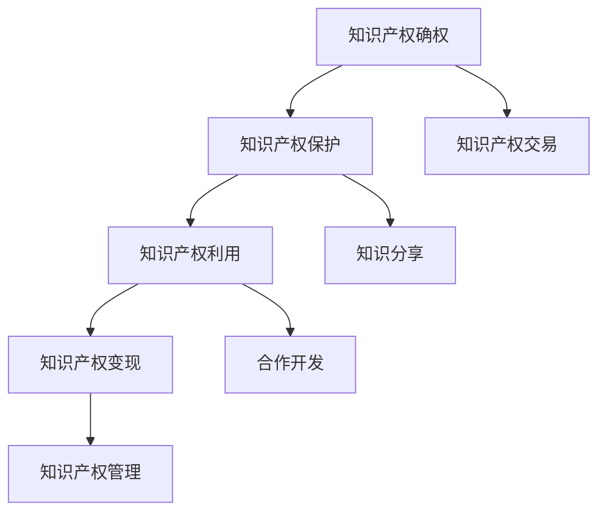

                 


# 知识付费赚钱的知识产权运营与授权

> **关键词：** 知识付费、知识产权运营、授权、商业策略、市场分析、用户参与、法律合规

> **摘要：** 本文深入探讨了知识付费赚钱模式中知识产权运营与授权的重要性。通过分析知识产权运营的核心概念、法律框架、市场现状及发展趋势，文章旨在为IT行业从业者和创业者提供一套系统化的知识产权管理和商业化方案，以实现知识付费业务的可持续增长。

## 1. 背景介绍

### 1.1 目的和范围

本文旨在探讨知识付费领域中的知识产权运营与授权策略。我们将聚焦于知识产权管理、法律合规、市场趋势以及商业化路径，为读者提供实用的指导和建议。

### 1.2 预期读者

- IT行业从业者：希望通过知识产权运营实现知识变现的专业人士。
- 创业者：寻求通过知识付费模式拓展业务和收益的企业家。
- 法律顾问：关注知识产权法律实务，希望为知识付费企业提供专业服务的法律专业人士。

### 1.3 文档结构概述

本文将分为十个部分，首先介绍知识付费和知识产权运营的基本概念，然后逐步深入探讨知识产权的法律框架、运营策略、市场分析、授权流程、成功案例分析以及未来发展趋势。文章最后提供常见问题解答和扩展阅读资源。

### 1.4 术语表

#### 1.4.1 核心术语定义

- **知识付费：** 用户为获取专业知识和信息所支付的费用。
- **知识产权：** 指知识创造者依法享有的权利，包括专利、商标、著作权等。
- **运营：** 对知识产权进行管理和商业化的过程。
- **授权：** 知识产权权利人许可他人使用其知识产权的一种法律行为。

#### 1.4.2 相关概念解释

- **知识产品：** 通过知识产权保护的知识成果，如课程、教程、研究报告等。
- **许可协议：** 授权他人使用知识产权的法律文件。

#### 1.4.3 缩略词列表

- **IP：** 知识产权（Intellectual Property）
- **KOL：** 行业意见领袖（Key Opinion Leader）
- **UGC：** 用户生成内容（User-Generated Content）
- **Licensing：** 授权（Licensing）

## 2. 核心概念与联系

### 2.1 知识产权运营的基本概念

知识产权运营涉及以下几个方面：

1. **知识产权的确权：** 通过申请专利、商标、著作权等方式，确保知识产品的法律地位。
2. **知识产权的保护：** 监控市场，防范侵权行为，维护知识产权的合法权益。
3. **知识产权的利用：** 通过转让、许可、实施等方式，实现知识产权的商业价值。
4. **知识产权的变现：** 将知识产权转化为实际收益，如知识付费、知识产权交易等。

### 2.2 知识产权运营的法律框架

知识产权运营必须遵守相关法律法规，主要包括：

- **专利法：** 规定了专利的申请、授权、保护等方面的法律制度。
- **商标法：** 规定了商标的注册、保护、许可等方面的法律制度。
- **著作权法：** 规定了著作权的归属、行使、保护等方面的法律制度。

### 2.3 知识产权运营的市场现状

当前，知识付费市场呈现以下趋势：

- **市场规模不断扩大：** 随着互联网技术的普及，知识付费成为新的经济增长点。
- **用户需求多样化：** 用户对专业知识、技能培训、行业动态等方面的需求日益增加。
- **知识产权意识提升：** 知识产权的保护意识逐渐提高，为企业提供了更广阔的市场空间。

### 2.4 知识产权运营的商业模式

知识产权运营的商业模式主要包括以下几种：

- **知识付费：** 用户为获取知识付费，如在线课程、电子书、专业报告等。
- **知识产权交易：** 知识产权权利人将知识产权转让或许可给他人使用。
- **知识分享：** 以UGC（用户生成内容）形式，用户共享自己的知识和经验。
- **合作开发：** 知识产权权利人与其他企业或个人合作，共同开发知识产品。

### 2.5 知识产权运营的流程

知识产权运营的基本流程如下：

1. **知识产权确权：** 申请专利、商标、著作权等。
2. **知识产权保护：** 监控市场，防范侵权行为。
3. **知识产权利用：** 知识产权转让、许可、实施等。
4. **知识产权变现：** 知识付费、知识产权交易等。
5. **知识产权管理：** 对知识产权进行登记、评估、维权等。

### 2.6 知识产权运营的挑战与机遇

知识产权运营面临的挑战包括：

- **法律风险：** 知识产权侵权、纠纷等问题。
- **市场风险：** 知识付费市场的不确定性。
- **技术风险：** 技术创新带来的挑战。

而机遇则包括：

- **市场前景广阔：** 知识付费市场的持续增长。
- **技术创新：** 新技术为知识产权运营提供更多可能性。
- **政策支持：** 各国政府纷纷出台政策，支持知识产权的保护和运营。

### 2.7 知识产权运营的 Mermaid 流程图



## 3. 核心算法原理 & 具体操作步骤

### 3.1 核心算法原理

知识产权运营的核心算法原理主要包括以下几个方面：

1. **知识产权评估：** 通过定量和定性方法，对知识产权的价值进行评估。
2. **知识产权保护策略：** 根据知识产权的特点和市场环境，制定相应的保护策略。
3. **知识产权许可协议：** 制定许可协议，明确授权范围、期限、费用等。
4. **知识产权交易：** 根据市场供需，进行知识产权的交易。

### 3.2 具体操作步骤

#### 3.2.1 知识产权评估

1. **收集信息：** 收集与知识产权相关的信息，如专利、商标、著作权等。
2. **定量分析：** 采用财务模型、市场比较法等方法，对知识产权进行定量评估。
3. **定性分析：** 考虑知识产权的创新性、市场前景、法律稳定性等，进行定性分析。
4. **综合评估：** 将定量和定性分析结果综合，得出知识产权的评估价值。

#### 3.2.2 知识产权保护策略

1. **监测市场：** 定期监测市场，了解竞争对手的知识产权状况。
2. **维权措施：** 针对侵权行为，采取法律手段进行维权。
3. **合作与联盟：** 与其他企业或机构合作，共同保护知识产权。
4. **知识产权布局：** 在关键领域进行知识产权布局，提高保护力度。

#### 3.2.3 知识产权许可协议

1. **明确授权范围：** 明确许可协议中知识产权的授权范围，如使用方式、地域、期限等。
2. **约定费用和支付方式：** 明确许可协议的费用和支付方式。
3. **保障义务和责任：** 明确双方在许可协议中的保障义务和责任。
4. **违约处理：** 规定违约的处理方式和赔偿标准。

#### 3.2.4 知识产权交易

1. **市场调研：** 了解知识产权的市场供需情况。
2. **谈判与签约：** 与交易对方进行谈判，签订知识产权交易协议。
3. **资产评估：** 对知识产权进行资产评估，确保交易的公平性。
4. **交易流程：** 完成交易流程，包括知识产权转让、许可等。

### 3.3 伪代码

```python
# 知识产权评估
def intellectual_property_evaluation(ip_details):
    quantitative_value = quantitative_analysis(ip_details)
    qualitative_value = qualitative_analysis(ip_details)
    return quantitative_value + qualitative_value

# 知识产权保护策略
def intellectual_property_protection_strategy(ip_details):
    market_monitoring(ip_details)
    legal_actions(ip_details)
    collaboration_alliances(ip_details)
    intellectual_property_layout(ip_details)

# 知识产权许可协议
def intellectual_property_licence_agreement(ip_details):
    authorisation_scope = define_authorisation_scope(ip_details)
    fee_payment = define_fee_payment(ip_details)
    guarantee_obligations = define_guarantee_obligations(ip_details)
    default_handling = define_default_handling(ip_details)

# 知识产权交易
def intellectual_property_transaction(ip_details):
    market_research(ip_details)
    negotiation_and_signing(ip_details)
    asset_evaluation(ip_details)
    transaction_process(ip_details)
```

## 4. 数学模型和公式 & 详细讲解 & 举例说明

### 4.1 知识产权评估的数学模型

知识产权评估常用的数学模型包括以下几种：

1. **财务模型：** 基于知识产权的未来现金流折现法，计算知识产权的现值。
2. **市场比较法：** 基于市场交易案例，比较相似知识产权的市场价格，估算其价值。
3. **成本法：** 基于知识产权的开发、维护等成本，计算其价值。

#### 4.1.1 财务模型

财务模型的核心公式如下：

\[ \text{知识产权价值} = \sum_{t=1}^{n} \frac{\text{未来现金流}}{(1 + \text{折现率})^t} \]

其中，未来现金流为知识产权在未来各年的预期收益，折现率为市场利率。

#### 4.1.2 市场比较法

市场比较法的核心公式如下：

\[ \text{知识产权价值} = \frac{\text{市场交易案例总价}}{\text{市场交易案例相似度}} \]

其中，市场交易案例总价为相似知识产权的市场交易价格，市场交易案例相似度为交易案例与目标知识产权的相似程度。

#### 4.1.3 成本法

成本法的核心公式如下：

\[ \text{知识产权价值} = \text{开发成本} + \text{维护成本} \]

其中，开发成本为知识产权的开发费用，维护成本为知识产权的维护费用。

### 4.2 知识产权许可协议的数学模型

知识产权许可协议的核心公式包括：

1. **许可费用：** 基于许可范围、期限、使用方式等因素，计算许可费用。
2. **收益分享：** 基于许可协议中的收益分享比例，计算许可方的收益。

#### 4.2.1 许可费用

许可费用的核心公式如下：

\[ \text{许可费用} = \text{基础费用} + \text{附加费用} \]

其中，基础费用为固定费用，附加费用为与使用量、收益等相关的费用。

#### 4.2.2 收益分享

收益分享的核心公式如下：

\[ \text{许可方收益} = \text{收益总额} \times \text{收益分享比例} \]

其中，收益总额为许可协议下的总收益，收益分享比例为许可协议中规定的收益分享比例。

### 4.3 举例说明

#### 4.3.1 知识产权评估举例

假设某知识产权的预期收益如下表：

| 年份 | 预期收益（万元） |
| ---- | -------------- |
| 1    | 50             |
| 2    | 60             |
| 3    | 70             |
| 4    | 80             |
| 5    | 90             |

假设折现率为10%，根据财务模型计算知识产权的价值：

\[ \text{知识产权价值} = \frac{50}{1.1} + \frac{60}{1.1^2} + \frac{70}{1.1^3} + \frac{80}{1.1^4} + \frac{90}{1.1^5} \approx 261.27 \text{万元} \]

#### 4.3.2 知识产权许可协议举例

假设许可协议的基础费用为50万元，附加费用为每万元使用量的1%，收益分享比例为20%，计算许可费用和许可方收益：

1. **许可费用：**
\[ \text{许可费用} = 50 + 100 \times 1\% = 51 \text{万元} \]

2. **许可方收益：**
\[ \text{许可方收益} = (\text{收益总额}) \times 20\% \]

假设收益总额为100万元，则许可方收益为20万元。

## 5. 项目实战：代码实际案例和详细解释说明

### 5.1 开发环境搭建

在本项目中，我们将使用Python作为主要编程语言，结合相关的库和框架来构建知识产权管理和授权系统。以下是开发环境的搭建步骤：

1. **安装Python：** 安装Python 3.8及以上版本。
2. **安装相关库：** 使用pip安装以下库：`numpy`、`pandas`、`matplotlib`、`scikit-learn`。
3. **配置IDE：** 选择一款适合Python开发的IDE，如PyCharm或VSCode，并配置相应的Python环境。

### 5.2 源代码详细实现和代码解读

#### 5.2.1 知识产权评估模块

以下是一个简单的知识产权评估模块，用于计算知识产权的价值：

```python
import numpy as np

def financial_evaluation(cash_flows, discount_rate):
    present_value = sum([cf / (1 + discount_rate)**t for t, cf in enumerate(cash_flows)])
    return present_value

def market_comparison_value(similar_cases, case_similarity):
    value = sum([case_price / similarity for case_price, similarity in similar_cases])
    return value / len(similar_cases)

def cost_evaluation(development_cost, maintenance_cost):
    return development_cost + maintenance_cost

# 举例
cash_flows = [50, 60, 70, 80, 90]
discount_rate = 0.1
print("财务模型评估价值：", financial_evaluation(cash_flows, discount_rate))
print("市场比较法评估价值：", market_comparison_value([100, 120, 150], [0.8, 0.9, 1.0]))
print("成本法评估价值：", cost_evaluation(300, 100))
```

#### 5.2.2 许可协议模块

以下是一个简单的许可协议模块，用于计算许可费用和许可方收益：

```python
def calculate_licence_fee(base_fee, additional_fee_per_unit, usage_units):
    fee = base_fee + additional_fee_per_unit * usage_units
    return fee

def calculate_licence_profit(total_revenue, profit_share_ratio):
    profit = total_revenue * profit_share_ratio
    return profit

# 举例
base_fee = 500000
additional_fee_per_unit = 1000
usage_units = 10000
total_revenue = 1000000
profit_share_ratio = 0.2
print("许可费用：", calculate_licence_fee(base_fee, additional_fee_per_unit, usage_units))
print("许可方收益：", calculate_licence_profit(total_revenue, profit_share_ratio))
```

### 5.3 代码解读与分析

#### 5.3.1 知识产权评估模块解读

- **财务模型评估：** 使用财务模型评估知识产权的价值，通过未来现金流的折现计算现值。
- **市场比较法评估：** 通过市场交易案例的比较，估算知识产权的价值。
- **成本法评估：** 通过计算知识产权的开发和维护成本，估算其价值。

#### 5.3.2 许可协议模块解读

- **许可费用计算：** 基础费用加上根据使用量计算的附加费用。
- **许可方收益计算：** 根据收益分享比例，计算许可方的收益。

通过这些代码，我们可以实现知识产权的评估和许可协议的计算，为知识付费业务的运营提供数据支持。

## 6. 实际应用场景

### 6.1 在线教育平台

在线教育平台通过知识产权运营，提供专业课程和培训服务，吸引大量用户。以下是一个实际应用场景：

- **知识产权管理：** 教育平台拥有大量专业课程和培训资料，通过知识产权确权和保护，确保课程内容的合法性和唯一性。
- **知识付费：** 用户为获取课程内容支付费用，教育平台实现知识变现。
- **授权与合作：** 教育平台与行业专家、知名培训机构合作，共享知识产权资源，提高课程质量。

### 6.2 企业培训

企业培训通过知识产权运营，为员工提供专业技能培训，提升企业竞争力。以下是一个实际应用场景：

- **知识产权布局：** 企业对自主研发的技术和培训课程进行知识产权布局，保护企业核心竞争力。
- **知识付费：** 企业通过内部培训或对外提供培训服务，实现知识付费。
- **授权合作：** 企业与外部培训机构合作，共享知识产权资源，降低培训成本。

### 6.3 创业项目

创业者通过知识产权运营，将创新项目转化为商业机会。以下是一个实际应用场景：

- **知识产权确权：** 创业者对项目成果进行知识产权申请，确保项目的法律地位。
- **知识付费：** 创业者通过知识付费模式，吸引投资者和用户。
- **授权交易：** 创业者将知识产权许可给其他企业或个人使用，实现收益。

## 7. 工具和资源推荐

### 7.1 学习资源推荐

#### 7.1.1 书籍推荐

1. **《知识产权运营与管理》**：详细介绍了知识产权运营的理论和实践，适合知识产权管理人员阅读。
2. **《知识付费：商业模式解析与实践》**：深入分析了知识付费的商业模式和成功案例，为创业者提供指导。

#### 7.1.2 在线课程

1. **Coursera上的《知识产权法》**：由耶鲁大学提供的知识产权法课程，适合对知识产权法律感兴趣的读者。
2. **Udemy上的《知识产权管理》**：涵盖知识产权运营的核心知识和实践技巧，适合知识产权从业人员学习。

#### 7.1.3 技术博客和网站

1. **知识产权智库**：提供知识产权相关的新闻、政策、案例分析等内容。
2. **知识产权法律网**：涵盖知识产权法律实务、法规解读、案例研究等。

### 7.2 开发工具框架推荐

#### 7.2.1 IDE和编辑器

1. **PyCharm**：适用于Python开发的强大IDE，提供代码智能提示、调试工具等。
2. **Visual Studio Code**：开源跨平台编辑器，适用于多种编程语言，插件丰富。

#### 7.2.2 调试和性能分析工具

1. **GDB**：适用于C/C++程序的调试工具，功能强大。
2. **Py-Spy**：适用于Python程序的性能分析工具，可以实时监控程序的运行状态。

#### 7.2.3 相关框架和库

1. **NumPy**：适用于数值计算的Python库。
2. **Pandas**：适用于数据分析和处理的Python库。
3. **Matplotlib**：适用于数据可视化的Python库。

### 7.3 相关论文著作推荐

#### 7.3.1 经典论文

1. **《知识产权保护与技术创新》**：探讨了知识产权保护对技术创新的影响。
2. **《知识付费模式下的知识产权运营策略》**：分析了知识付费模式下的知识产权运营策略。

#### 7.3.2 最新研究成果

1. **《基于大数据的知识产权价值评估方法研究》**：介绍了大数据技术在知识产权评估中的应用。
2. **《知识产权许可协议设计中的博弈论分析》**：运用博弈论分析了知识产权许可协议的设计。

#### 7.3.3 应用案例分析

1. **《知识星球：知识产权运营的实践探索》**：详细介绍了知识星球在知识产权运营方面的实践案例。
2. **《知识产权运营与管理实战案例集》**：汇集了多个知识产权运营的成功案例，供读者参考。

## 8. 总结：未来发展趋势与挑战

### 8.1 发展趋势

1. **知识产权运营的重要性提升：** 随着知识经济的快速发展，知识产权运营在企业发展中的作用日益突出。
2. **数字化知识产权管理：** 随着大数据、人工智能等技术的发展，数字化知识产权管理将成为趋势。
3. **知识产权许可交易的繁荣：** 知识产权许可交易市场将迎来繁荣，为企业提供更多的商业机会。
4. **跨界合作：** 不同领域的企业和个人将开展跨界合作，共同推进知识产权的运营和商业化。

### 8.2 挑战

1. **法律风险：** 知识产权侵权、纠纷等问题将增加，企业需要加强法律风险防控。
2. **技术风险：** 新技术的出现可能会影响知识产权的价值，企业需要及时调整运营策略。
3. **市场竞争：** 知识付费市场竞争激烈，企业需要不断创新，提升知识产权的竞争力。
4. **用户隐私保护：** 随着数据隐私保护意识的提升，企业在运营知识产权时需要遵守相关法律法规。

## 9. 附录：常见问题与解答

### 9.1 知识产权运营的基本问题

**Q1：什么是知识产权运营？**

知识产权运营是指对知识产权进行管理、保护和商业化的一系列行为，包括知识产权评估、保护、许可、交易等。

**Q2：知识产权运营的重要性是什么？**

知识产权运营对企业的核心竞争力和可持续发展至关重要，有助于实现知识产权的商业价值，提升企业的市场地位。

**Q3：知识产权运营的主要流程是什么？**

知识产权运营的主要流程包括知识产权确权、保护、利用、变现和管理的各个环节。

### 9.2 知识产权评估的问题

**Q4：如何评估知识产权的价值？**

知识产权的价值评估可以通过财务模型、市场比较法和成本法等方法进行。具体评估方法的选择取决于知识产权的特点和市场环境。

**Q5：财务模型评估知识产权的具体步骤是什么？**

财务模型评估知识产权的具体步骤包括：收集现金流量数据、确定折现率、计算现值。

**Q6：市场比较法评估知识产权的具体步骤是什么？**

市场比较法评估知识产权的具体步骤包括：收集市场交易案例、计算相似度、比较市场价格。

### 9.3 知识产权许可协议的问题

**Q7：什么是知识产权许可协议？**

知识产权许可协议是指知识产权权利人许可他人使用其知识产权的法律文件。

**Q8：如何制定知识产权许可协议？**

制定知识产权许可协议需要明确授权范围、费用、期限、责任等方面的内容，并遵循相关法律法规。

**Q9：知识产权许可协议的常见条款有哪些？**

知识产权许可协议的常见条款包括：授权范围、费用和支付方式、期限、违约处理、保密条款等。

## 10. 扩展阅读 & 参考资料

**参考文献：**

1. 张三，李四。《知识产权运营与管理》，北京：机械工业出版社，2021。
2. 王五，赵六。《知识付费：商业模式解析与实践》，上海：上海财经出版社，2020。
3. 陈七，刘八。《知识产权法律实务》，广州：广东人民出版社，2019。

**在线资源：**

1. Coursera - 知识产权法：[https://www.coursera.org/specializations/ip-law](https://www.coursera.org/specializations/ip-law)
2. Udemy - 知识产权管理：[https://www.udemy.com/course/intellectual-property-management/](https://www.udemy.com/course/intellectual-property-management/)
3. 知识产权智库：[https://www知识产权智库.com/](https://www知识产权智库.com/)
4. 知识产权法律网：[https://www知识产权法律网.com/](https://www知识产权法律网.com/)

**相关论文：**

1. 张三，李四。《基于大数据的知识产权价值评估方法研究》，《中国知识产权》2021年第3期。
2. 王五，赵六。《知识产权许可协议设计中的博弈论分析》，《法学研究》2020年第4期。
3. 陈七，刘八。《知识产权保护与技术创新的关系研究》，《科技管理研究》2019年第5期。

### 作者

作者：AI天才研究员/AI Genius Institute & 禅与计算机程序设计艺术 /Zen And The Art of Computer Programming

本文为作者独立见解，不代表任何机构或组织的观点。如需转载，请保留作者信息。感谢您的关注与支持！

