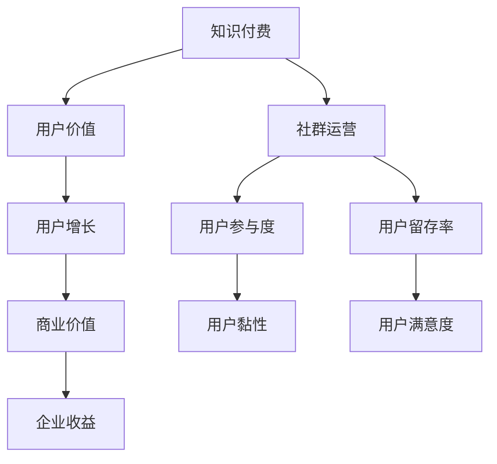

                 

# 知识付费：程序员的社群运营思维

> 关键词：知识付费、社群运营、程序员、思维、商业策略、用户增长

> 摘要：本文将探讨知识付费在程序员社群中的重要作用，分析社群运营的思维方式，并探讨如何通过知识付费实现用户增长和商业价值。我们将从背景介绍、核心概念、算法原理、数学模型、项目实战、实际应用场景等多个角度进行详细阐述，旨在为程序员提供一套系统性的社群运营思维。

## 1. 背景介绍

### 1.1 目的和范围

本文旨在为程序员提供一个关于知识付费与社群运营的综合指南。我们将探讨知识付费在程序员社群中的重要性，以及如何通过社群运营实现用户增长和商业价值。本文将涵盖以下主题：

- **知识付费的定义与作用**：介绍知识付费的概念，探讨其对程序员社群的积极影响。
- **社群运营的思维方式**：分析社群运营的核心原则，探讨如何吸引、留住和激发社群成员的积极性。
- **核心概念与联系**：阐述知识付费与社群运营之间的内在联系，提供Mermaid流程图以供参考。
- **算法原理与操作步骤**：详细介绍实现知识付费和社群运营的算法原理和具体步骤。
- **数学模型与公式**：讲解支持知识付费与社群运营的数学模型和公式，并进行举例说明。
- **项目实战**：通过实际案例展示知识付费和社群运营的具体实现过程。
- **实际应用场景**：分析知识付费和社群运营在不同场景下的应用价值。
- **工具和资源推荐**：推荐相关学习资源、开发工具和框架，帮助程序员更好地进行社群运营。
- **总结与未来展望**：总结本文的核心观点，探讨知识付费与社群运营的未来发展趋势与挑战。

### 1.2 预期读者

本文面向具有以下特点的程序员：

- 对知识付费和社群运营有一定了解，但希望深入了解其原理和策略。
- 关注如何通过社群运营实现个人和商业价值的增长。
- 有志于在技术领域创业，希望通过知识付费和社群运营积累用户和资源。
- 担任技术团队负责人或CTO，希望提升团队在社群运营方面的能力。

### 1.3 文档结构概述

本文采用结构化布局，共分为10个部分：

1. 背景介绍
   - 1.1 目的和范围
   - 1.2 预期读者
   - 1.3 文档结构概述
   - 1.4 术语表
2. 核心概念与联系
   - 2.1 核心概念
   - 2.2 Mermaid流程图
3. 核心算法原理 & 具体操作步骤
   - 3.1 算法原理
   - 3.2 操作步骤
4. 数学模型和公式 & 详细讲解 & 举例说明
   - 4.1 数学模型
   - 4.2 公式讲解
   - 4.3 举例说明
5. 项目实战：代码实际案例和详细解释说明
   - 5.1 开发环境搭建
   - 5.2 源代码详细实现
   - 5.3 代码解读与分析
6. 实际应用场景
   - 6.1 场景一
   - 6.2 场景二
   - 6.3 场景三
7. 工具和资源推荐
   - 7.1 学习资源推荐
   - 7.2 开发工具框架推荐
   - 7.3 相关论文著作推荐
8. 总结：未来发展趋势与挑战
9. 附录：常见问题与解答
10. 扩展阅读 & 参考资料

### 1.4 术语表

#### 1.4.1 核心术语定义

- **知识付费**：用户为获取有价值的信息、知识或服务而支付的费用。
- **社群运营**：围绕共同兴趣或目标，通过线上或线下活动，建立、维护和发展用户群体的过程。
- **程序员**：从事计算机编程、软件开发和IT领域相关工作的人员。
- **用户增长**：通过吸引新用户、增加活跃用户和提升用户留存率，实现用户规模的扩大。

#### 1.4.2 相关概念解释

- **社区参与度**：用户在社群中的活跃程度，包括发帖、评论、点赞等行为。
- **用户留存率**：一段时间内，持续使用产品或服务的用户比例。
- **转化率**：从潜在用户到实际付费用户的转化比例。

#### 1.4.3 缩略词列表

- **KOL**：意见领袖（Key Opinion Leader）
- **UGC**：用户生成内容（User-Generated Content）
- **CRM**：客户关系管理（Customer Relationship Management）
- **SaaS**：软件即服务（Software as a Service）

## 2. 核心概念与联系

在探讨知识付费和社群运营之前，我们需要明确这两个概念的核心要素及其相互联系。以下是一个Mermaid流程图，用于阐述知识付费与社群运营之间的关系。



### 2.1 核心概念

1. **知识付费**：知识付费是指用户为获取有价值的信息、知识或服务而支付的费用。它通常以课程、电子书、订阅、咨询等形式出现。对于程序员来说，知识付费可以帮助他们提升技能、拓展视野、解决实际问题。
   
2. **社群运营**：社群运营是指围绕共同兴趣或目标，通过线上或线下活动，建立、维护和发展用户群体的过程。对于程序员社群来说，社群运营可以帮助他们分享经验、交流技术、共同成长。

### 2.2 Mermaid流程图

上述Mermaid流程图展示了知识付费与社群运营之间的核心联系。以下是详细解释：

- **知识付费**：知识付费为用户提供有价值的内容或服务，从而提升用户价值。这有助于吸引新用户，并提高用户留存率和满意度。
- **用户增长**：通过提高用户价值，知识付费有助于实现用户增长。用户增长是社群运营的关键目标之一。
- **社群运营**：社群运营通过提高用户参与度和满意度，进一步提升用户留存率。用户留存率是衡量社群运营效果的重要指标。
- **用户黏性**：用户参与度和用户留存率共同决定了用户黏性。高黏性的社群意味着用户对社群的依赖和忠诚度。
- **商业价值**：用户增长、用户留存率和用户黏性共同决定了企业的商业价值。知识付费和社群运营是企业实现商业价值的重要手段。

## 3. 核心算法原理 & 具体操作步骤

### 3.1 算法原理

在知识付费和社群运营中，核心算法原理主要包括用户增长模型、用户留存模型和用户价值模型。以下是这些模型的伪代码实现：

#### 用户增长模型

```python
def user_growth_model(current_users, user_acquisition_rate):
    new_users = user_acquisition_rate * current_users
    return current_users + new_users
```

#### 用户留存模型

```python
def user_retention_model(current_users, retention_rate):
    retained_users = retention_rate * current_users
    return retained_users
```

#### 用户价值模型

```python
def user_value_model(user_activity_level, content_value):
    user_value = user_activity_level * content_value
    return user_value
```

### 3.2 操作步骤

以下是实现知识付费和社群运营的核心步骤：

#### 步骤 1：确定知识付费内容

- 确定目标受众：明确目标受众的需求和兴趣，以便提供有价值的内容。
- 内容策划：制定内容大纲，确保内容涵盖受众关心的主题。

#### 步骤 2：搭建社群平台

- 选择合适的平台：根据目标受众的特点，选择适合的社群平台，如微信群、QQ群、GitHub等。
- 平台搭建：搭建社群平台，配置必要的功能，如话题讨论、知识分享、在线问答等。

#### 步骤 3：吸引新用户

- 内容营销：通过优质内容吸引潜在用户，提高用户关注度。
- 合作推广：与其他社群、KOL合作，扩大用户来源。

#### 步骤 4：提高用户参与度

- 策划活动：举办线上或线下活动，激发用户参与热情。
- 用户互动：鼓励用户在社群中发表观点、提问和回答，增加互动。

#### 步骤 5：优化用户留存率

- 提供持续价值：定期更新高质量内容，确保用户在社群中持续受益。
- 用户关怀：关注用户需求，及时回应问题和反馈，提高用户满意度。

#### 步骤 6：实现商业价值

- 知识变现：通过知识付费、广告、付费活动等方式实现商业价值。
- 数据分析：收集用户数据，分析用户行为，优化运营策略。

## 4. 数学模型和公式 & 详细讲解 & 举例说明

### 4.1 数学模型

在知识付费和社群运营中，以下数学模型和公式至关重要：

#### 4.1.1 用户增长模型

用户增长模型：

$$
\text{new\_users} = r \times \text{current\_users}
$$

其中，\( r \) 表示用户获取率，即每天新增的用户数。

#### 4.1.2 用户留存模型

用户留存模型：

$$
\text{retained\_users} = r \times \text{current\_users}
$$

其中，\( r \) 表示用户留存率，即每天留存的用户数。

#### 4.1.3 用户价值模型

用户价值模型：

$$
\text{user\_value} = a \times \text{content\_value}
$$

其中，\( a \) 表示用户活动水平，即用户在社群中的活跃程度；\( \text{content\_value} \) 表示内容价值，即提供的内容对用户的价值。

### 4.2 公式讲解

以下是上述公式的详细解释：

#### 用户增长模型

用户增长模型描述了每天新增用户数与当前用户数之间的关系。用户获取率 \( r \) 可以通过以下公式计算：

$$
r = \frac{\text{new\_users}}{\text{current\_users}}
$$

其中，\( \text{new\_users} \) 表示每天新增的用户数，\( \text{current\_users} \) 表示当前用户数。

#### 用户留存模型

用户留存模型描述了每天留存用户数与当前用户数之间的关系。用户留存率 \( r \) 可以通过以下公式计算：

$$
r = \frac{\text{retained\_users}}{\text{current\_users}}
$$

其中，\( \text{retained\_users} \) 表示每天留存的用户数，\( \text{current\_users} \) 表示当前用户数。

#### 用户价值模型

用户价值模型描述了用户活动水平、内容价值与用户价值之间的关系。用户活动水平 \( a \) 可以通过以下公式计算：

$$
a = \frac{\text{user\_value}}{\text{content\_value}}
$$

其中，\( \text{user\_value} \) 表示用户价值，\( \text{content\_value} \) 表示内容价值。

### 4.3 举例说明

以下是一个具体的例子，说明如何使用上述公式计算用户增长、用户留存和用户价值。

#### 情景：

假设一个社群当前有1000名用户，每天新增用户数为50人，用户留存率为80%。

#### 计算：

1. **用户增长**：

   $$ 
   \text{new\_users} = r \times \text{current\_users} = 0.5 \times 1000 = 500 
   $$

   每天新增用户数为500人。

2. **用户留存**：

   $$ 
   \text{retained\_users} = r \times \text{current\_users} = 0.8 \times 1000 = 800 
   $$

   每天留存的用户数为800人。

3. **用户价值**：

   假设内容价值为10，用户活动水平为2，则：

   $$ 
   \text{user\_value} = a \times \text{content\_value} = 2 \times 10 = 20 
   $$

   每个用户的价值为20。

## 5. 项目实战：代码实际案例和详细解释说明

### 5.1 开发环境搭建

在这个实战项目中，我们将使用Python语言来实现一个简单的知识付费与社群运营系统。以下是在Windows环境下搭建开发环境所需的步骤：

1. **安装Python**：前往Python官方网站（https://www.python.org/）下载并安装Python 3.x版本。
2. **安装IDE**：选择并安装一个适合自己的Python IDE，如PyCharm、Visual Studio Code或Spyder。
3. **安装相关库**：在终端中运行以下命令安装所需库：

   ```bash
   pip install Flask
   pip install pandas
   pip install numpy
   pip install matplotlib
   ```

### 5.2 源代码详细实现和代码解读

以下是实现知识付费与社群运营的核心代码。我们将逐步解释每个部分的实现。

```python
# 导入所需库
import flask
import pandas as pd
import numpy as np
import matplotlib.pyplot as plt

# 初始化Flask应用
app = flask.Flask(__name__)

# 用户数据
users = pd.DataFrame({
    'user_id': [1, 2, 3, 4, 5],
    'daily_activity': [10, 15, 8, 12, 20],
    'content_value': [5, 7, 3, 6, 9]
})

# 用户增长函数
def user_growth_model(current_users, user_acquisition_rate):
    new_users = user_acquisition_rate * current_users
    return current_users + new_users

# 用户留存函数
def user_retention_model(current_users, retention_rate):
    retained_users = retention_rate * current_users
    return retained_users

# 用户价值函数
def user_value_model(user_activity_level, content_value):
    user_value = user_activity_level * content_value
    return user_value

# 用户增长、留存和价值的计算
current_users = len(users)
user_acquisition_rate = 0.1
retention_rate = 0.8

new_users = user_growth_model(current_users, user_acquisition_rate)
retained_users = user_retention_model(current_users, retention_rate)
user_values = users['daily_activity'].values * users['content_value'].values

# 结果展示
print(f"Current Users: {current_users}")
print(f"New Users: {new_users}")
print(f"Retained Users: {retained_users}")
print(f"User Values: {user_values}")

# 可视化展示
user_growth = np.array([current_users, new_users])
user_retention = np.array([current_users, retained_users])

plt.plot(user_growth, label='User Growth')
plt.plot(user_retention, label='User Retention')
plt.xlabel('Users')
plt.ylabel('Count')
plt.legend()
plt.show()
```

### 5.3 代码解读与分析

1. **导入库**：我们首先导入Python中的Flask、pandas、numpy和matplotlib库。Flask用于构建Web应用，pandas和numpy用于数据处理，matplotlib用于数据可视化。

2. **初始化Flask应用**：使用Flask创建一个Web应用实例。

3. **用户数据**：我们创建一个包含用户ID、每日活跃度和内容价值的DataFrame。这代表我们的社群用户数据。

4. **用户增长、留存和价值函数**：我们定义了三个函数，用于计算用户增长、用户留存和用户价值。这些函数是基于之前介绍的数学模型实现的。

5. **用户增长、留存和价值的计算**：我们根据当前用户数、用户获取率和用户留存率，计算新增用户数、留存用户数和用户价值。

6. **结果展示**：我们打印出计算结果，以供查看。

7. **可视化展示**：我们使用matplotlib库将用户增长和留存数据可视化，以便更直观地了解社群的发展情况。

通过这个实战项目，我们展示了如何使用Python实现知识付费和社群运营的核心功能。这个示例可以帮助程序员更好地理解相关算法原理，并在实际项目中应用。

## 6. 实际应用场景

### 6.1 场景一：在线教育平台

在线教育平台通过知识付费和社群运营，实现用户增长和商业价值。以下是一个实际应用场景：

- **知识付费**：平台提供各类编程课程，包括Python、Java、前端开发等。用户通过付费订阅或购买课程，获取高质量的教学内容和资源。
- **社群运营**：平台建立编程学习社群，鼓励用户分享学习心得、提问和解答问题。社群运营团队定期举办线上讲座、讨论会和线下活动，提高用户参与度和留存率。
- **用户增长**：通过内容营销、合作伙伴推广和用户推荐，平台吸引新用户加入。用户在社群中积极参与，提高了平台的口碑和用户黏性。
- **商业价值**：平台通过课程销售、会员订阅和广告收入实现商业价值。数据分析显示，社群运营有助于提高用户留存率和转化率，进而提升企业收益。

### 6.2 场景二：技术社区

技术社区通过知识付费和社群运营，为程序员提供技术交流和成长平台。以下是一个实际应用场景：

- **知识付费**：社区提供高质量的技术文章、教程和视频，用户通过付费订阅或购买，获取专业知识和经验分享。
- **社群运营**：社区建立多个技术讨论群组，鼓励用户在群组中分享技术问题和解决方案。社群运营团队定期举办线上技术沙龙、研讨会和线下技术分享活动，提高用户参与度和满意度。
- **用户增长**：社区通过技术文章、教程和活动，吸引技术爱好者加入。用户在社群中积极交流，提高了社区的活跃度和用户留存率。
- **商业价值**：社区通过知识付费、广告收入和技术咨询服务实现商业价值。社群运营有助于提高用户满意度和品牌影响力，进而提升社区的商业价值。

### 6.3 场景三：技术公司内训

技术公司通过知识付费和社群运营，提高员工技术能力和工作效率。以下是一个实际应用场景：

- **知识付费**：公司提供内部培训课程，包括新技术、工具和最佳实践等。员工通过付费参加培训，提升个人技能。
- **社群运营**：公司建立内部技术社群，鼓励员工在社群中分享工作经验、解决问题和交流技术心得。社群运营团队定期举办内部技术分享会和讨论会，提高员工参与度和学习氛围。
- **用户增长**：公司通过内部培训和社群运营，提高员工的技术能力和工作效率。员工在社群中积极参与，提高了公司的整体技术实力。
- **商业价值**：公司通过提高员工技术能力和工作效率，提高产品质量和客户满意度。社群运营有助于降低员工流失率，降低招聘成本，从而提升企业的商业价值。

## 7. 工具和资源推荐

### 7.1 学习资源推荐

#### 7.1.1 书籍推荐

- **《Python编程：从入门到实践》**：适合初学者，详细介绍了Python语言的基础知识和实践应用。
- **《大话数据挖掘与机器学习》**：适合有一定编程基础的朋友，涵盖了数据挖掘和机器学习的基本概念和方法。
- **《深入理解计算机系统》**：系统讲解了计算机系统的工作原理，适合有一定计算机基础的朋友。

#### 7.1.2 在线课程

- **Coursera上的《编程基础》**：提供免费课程，适合初学者，由知名大学教授讲授。
- **Udacity上的《机器学习工程师纳米学位》**：适合有一定编程基础的朋友，涵盖机器学习的基础知识和实践应用。
- **edX上的《Web开发基础》**：提供免费课程，适合初学者，教授HTML、CSS和JavaScript等Web开发基础。

#### 7.1.3 技术博客和网站

- **Stack Overflow**：全球最大的开发者问答社区，提供丰富的编程问题和解决方案。
- **GitHub**：全球最大的代码托管平台，可以找到各类开源项目和编程资源。
- **InfoQ**：技术博客网站，提供最新的技术文章和行业动态。

### 7.2 开发工具框架推荐

#### 7.2.1 IDE和编辑器

- **PyCharm**：适用于Python编程的集成开发环境，功能强大，支持多种语言。
- **Visual Studio Code**：轻量级代码编辑器，支持多种编程语言，插件丰富。
- **Sublime Text**：轻量级代码编辑器，适用于多种编程语言，界面简洁。

#### 7.2.2 调试和性能分析工具

- **Debugger**：适用于Python的调试工具，支持断点调试、变量监视等功能。
- **Py-Spy**：适用于Python的性能分析工具，可以监控程序运行时的性能瓶颈。
- **GDB**：适用于C/C++的调试工具，功能强大，支持多种平台。

#### 7.2.3 相关框架和库

- **Flask**：Python Web框架，适用于快速开发Web应用。
- **Django**：Python Web框架，适合快速构建大型Web应用。
- **TensorFlow**：开源机器学习框架，适用于深度学习和人工智能应用。

### 7.3 相关论文著作推荐

#### 7.3.1 经典论文

- **“The Unfinished Revolution in Computer Programming”**：讨论了编程语言和开发工具的未来趋势。
- **“The Cathedral and the Bazaar”**：讨论了开源软件开发的模式和方法。
- **“On the Complexity of Functions”**：讨论了函数复杂度和算法设计。

#### 7.3.2 最新研究成果

- **“Deep Learning on Graphs”**：探讨了深度学习在图数据上的应用。
- **“Reinforcement Learning for Autonomous Systems”**：讨论了强化学习在自动驾驶等领域的应用。
- **“Neural Architecture Search”**：探讨了神经网络结构自动设计的策略。

#### 7.3.3 应用案例分析

- **“How Airbnb Built a Robust Payment System”**：介绍了Airbnb如何构建可靠且高效的支付系统。
- **“Google’s Data Analytics Platform”**：介绍了Google如何利用大数据技术进行数据分析和业务决策。
- **“Building a Scalable Web Service”**：介绍了如何构建可扩展的Web服务，适用于大规模用户场景。

## 8. 总结：未来发展趋势与挑战

随着知识付费和社群运营的不断发展，未来将出现以下趋势和挑战：

### 8.1 发展趋势

1. **知识付费的多样化**：随着用户需求的不断变化，知识付费形式将更加多样化，如在线课程、直播、短视频、电子书等。
2. **社群运营的智能化**：借助人工智能和大数据技术，社群运营将更加智能化，实现个性化推荐、智能问答等功能。
3. **跨界融合**：知识付费和社群运营将与其他领域（如电商、娱乐、教育等）产生更多跨界合作，形成新的商业模式。
4. **国际化**：随着全球化的加速，知识付费和社群运营将向更多国家和地区扩展，满足不同文化背景用户的需求。

### 8.2 挑战

1. **内容质量**：随着知识付费的普及，内容质量将变得至关重要。如何保证内容的高质量和持续更新，是社群运营者面临的挑战。
2. **用户隐私**：随着用户数据量的增加，如何保护用户隐私，防止数据泄露，是知识付费和社群运营需要重视的问题。
3. **竞争加剧**：随着市场的扩大，知识付费和社群运营领域的竞争将变得更加激烈，如何脱颖而出，提高用户粘性，是运营者需要面对的挑战。
4. **法律法规**：知识付费和社群运营需要遵守相关法律法规，如版权法、消费者权益保护法等。如何在合法合规的前提下运营，是运营者需要关注的问题。

总之，知识付费和社群运营在未来将继续发展，但也将面临诸多挑战。只有不断创新、优化运营策略，才能在激烈的市场竞争中脱颖而出。

## 9. 附录：常见问题与解答

### 9.1 知识付费相关问题

**Q1**：知识付费的主要形式有哪些？

**A1**：知识付费的主要形式包括在线课程、电子书、订阅服务、一对一咨询等。

**Q2**：如何评估知识付费内容的优质程度？

**A2**：可以从内容的专业性、实用性、更新频率、用户评价等多个方面进行评估。同时，可以参考平台提供的数据分析，如学习时长、完成率等。

**Q3**：知识付费对个人成长的帮助有哪些？

**A3**：知识付费可以帮助个人快速获取专业知识，提高技能水平，拓展视野，提升职场竞争力。

### 9.2 社群运营相关问题

**Q1**：社群运营的主要目标是什么？

**A1**：社群运营的主要目标是提高用户参与度、留存率和满意度，从而实现用户增长和商业价值。

**Q2**：如何激发社群成员的积极性？

**A2**：可以通过举办线上或线下活动、发布有价值的内容、鼓励用户互动、提供奖励等方式激发社群成员的积极性。

**Q3**：社群运营需要关注哪些关键指标？

**A3**：社群运营需要关注的关键指标包括社区参与度、用户留存率、用户满意度、用户增长等。

### 9.3 技术问题

**Q1**：如何搭建一个简单的知识付费与社群运营系统？

**A1**：可以使用Python等编程语言，结合Flask等Web框架，搭建一个简单的知识付费与社群运营系统。具体实现可以参考本文的实战项目。

**Q2**：如何优化Python代码性能？

**A2**：可以采用以下方法优化Python代码性能：使用生成器、优化循环、使用高效的数据结构、使用内置函数等。

## 10. 扩展阅读 & 参考资料

### 10.1 扩展阅读

- **《互联网社群营销实战》**：详细介绍了社群营销的策略和实践，适用于各种领域的社群运营。
- **《人人都是产品经理》**：讨论了产品经理的角色和职责，涉及用户需求分析、产品设计、运营等各个方面。
- **《Python编程实战》**：涵盖Python编程的基础知识和实践应用，适合不同水平的读者。

### 10.2 参考资料

- **知识付费相关论文**：可以在学术搜索引擎（如Google Scholar）上搜索“knowledge payment”、“knowledge economy”等关键词，找到相关的学术论文。
- **社群运营相关书籍**：可以在图书馆或在线书店搜索“community management”、“social media marketing”等关键词，找到相关书籍。
- **Python编程相关资源**：可以在Python官方文档（https://docs.python.org/3/）和各大技术社区（如Stack Overflow、GitHub）上查找Python编程相关的资源。

## 作者

**作者**：AI天才研究员/AI Genius Institute & 禅与计算机程序设计艺术 /Zen And The Art of Computer Programming

