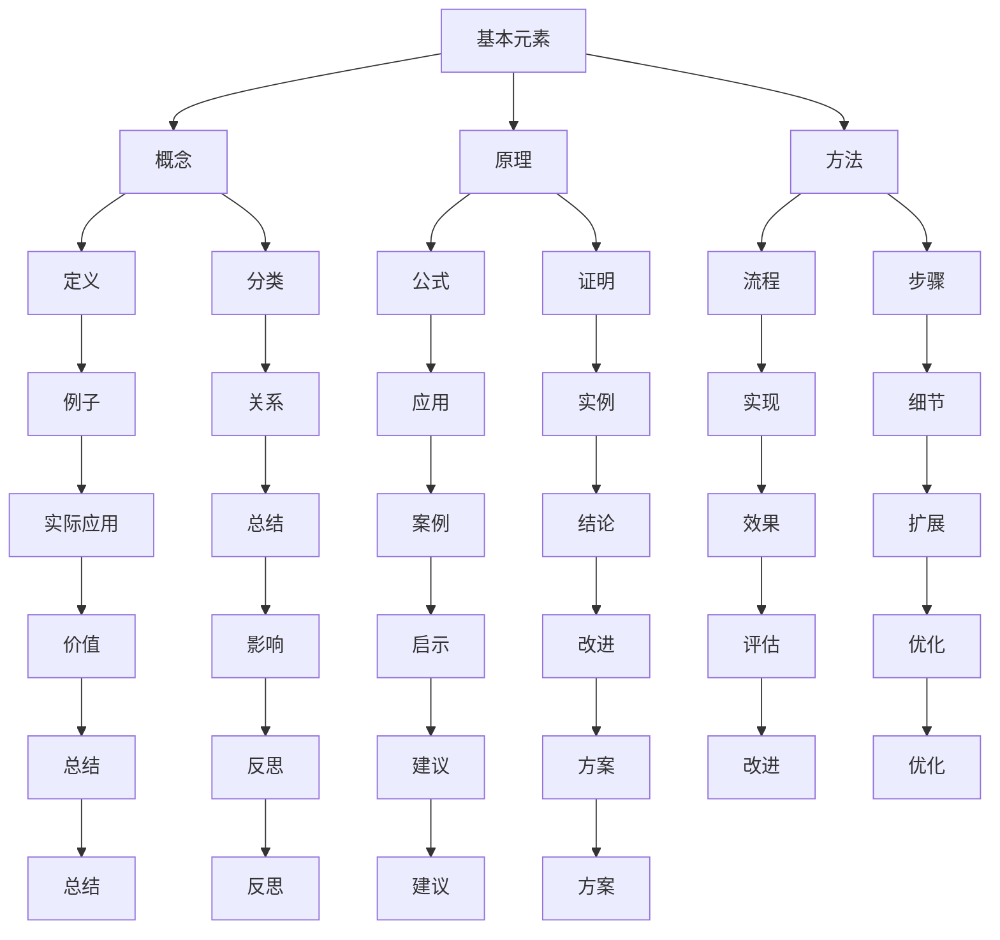

                 


# 知识体系的构建：从基本元素到复杂结构

> 关键词：知识体系、构建、基本元素、复杂结构、认知框架、学习策略

> 摘要：本文将探讨如何构建一个有效的知识体系，从基本元素出发，逐步构建复杂结构。我们将分析知识体系的本质、核心概念，以及构建过程中需要遵循的原则和方法。此外，本文还将提供一些实用的工具和资源，帮助读者在实际应用中更好地理解和运用知识体系。

## 1. 背景介绍

### 1.1 目的和范围

本文旨在为读者提供一个系统化的知识体系构建指南，帮助读者更好地理解知识的本质，掌握有效的学习方法，从而在学习和工作中取得更好的成果。文章将涵盖以下几个核心方面：

1. **知识体系的定义和重要性**：探讨知识体系的概念、作用及其在学习和实践中的意义。
2. **核心概念和联系**：分析知识体系的基本元素及其相互关系。
3. **核心算法原理**：介绍构建知识体系的方法和步骤。
4. **数学模型和公式**：阐述知识体系构建过程中的相关数学原理。
5. **项目实战**：通过实际案例，展示如何应用知识体系进行问题解决。
6. **实际应用场景**：探讨知识体系在各类实际应用中的价值。
7. **工具和资源推荐**：推荐学习资源和开发工具，帮助读者更好地构建和运用知识体系。
8. **总结**：展望知识体系构建的未来发展趋势与挑战。

### 1.2 预期读者

本文适合以下读者群体：

1. **学生和研究人员**：希望掌握更高效的学习方法和知识体系构建技巧。
2. **软件开发者和工程师**：希望提升技术能力，构建更完善的技术知识体系。
3. **企业管理者**：希望提升团队的知识管理水平，提高组织效率。
4. **终身学习者**：希望不断提升自己的学习能力和知识储备。

### 1.3 文档结构概述

本文将按照以下结构展开：

1. **引言**：介绍知识体系构建的重要性。
2. **核心概念与联系**：分析知识体系的基本元素及其相互关系。
3. **核心算法原理**：介绍构建知识体系的方法和步骤。
4. **数学模型和公式**：阐述知识体系构建过程中的相关数学原理。
5. **项目实战**：通过实际案例，展示如何应用知识体系进行问题解决。
6. **实际应用场景**：探讨知识体系在各类实际应用中的价值。
7. **工具和资源推荐**：推荐学习资源和开发工具，帮助读者更好地构建和运用知识体系。
8. **总结**：展望知识体系构建的未来发展趋势与挑战。
9. **附录**：常见问题与解答。
10. **扩展阅读 & 参考资料**：推荐相关书籍、论文和网站，供读者进一步学习。

### 1.4 术语表

#### 1.4.1 核心术语定义

- **知识体系**：一系列相互关联的知识点，通过逻辑结构和层次关系，形成一个有机整体。
- **基本元素**：构成知识体系的基础单元，如概念、原理、方法等。
- **复杂结构**：知识体系中的高层次结构，包括模型、框架、体系等。
- **认知框架**：用于组织、解释和记忆知识的工具，有助于理解和应用知识。

#### 1.4.2 相关概念解释

- **知识管理**：对知识进行识别、获取、共享、应用和创新的过程。
- **知识沉淀**：将个人或团队的知识转化为可共享和可复用的形式。
- **学习策略**：为了提高学习效果而采取的一系列方法和技巧。

#### 1.4.3 缩略词列表

- **AI**：人工智能
- **ML**：机器学习
- **DL**：深度学习
- **IDE**：集成开发环境

## 2. 核心概念与联系

在构建知识体系的过程中，我们需要了解并掌握一些核心概念及其相互联系。以下是一个简单的 Mermaid 流程图，展示知识体系的基本元素及其关系。



### 2.1 核心概念解析

- **基本元素**：知识体系的基本组成单元，包括概念、原理、方法等。
- **概念**：对某一事物的本质特征进行抽象和概括的思维方式。
- **原理**：解释事物发生、发展、变化等规律的基本原则。
- **方法**：解决问题的步骤、策略和技巧。

### 2.2 关系分析

- **定义与分类**：定义是对概念的本质特征进行解释，分类则是根据概念的特征进行归类。
- **公式与证明**：公式是表达原理的数学表达式，证明是验证原理正确性的逻辑推理。
- **流程与步骤**：流程是解决问题的整体过程，步骤是过程中的具体操作。
- **例子与实际应用**：例子是具体情境中的应用实例，实际应用是知识在现实世界中的运用。
- **关系与总结**：关系是各概念、原理、方法之间的关联，总结是对知识体系的高度概括。

## 3. 核心算法原理 & 具体操作步骤

在构建知识体系的过程中，我们需要遵循一定的算法原理和操作步骤。以下是一个详细的伪代码，用于指导知识体系的构建过程。

```python
# 初始化知识体系
knowledge_system = {}

# 函数：定义概念
def define_concept(name, description):
    concept = {
        "name": name,
        "description": description,
        "related_concepts": [],
        "related_principles": [],
        "related_methods": []
    }
    knowledge_system[name] = concept

# 函数：添加相关概念
def add_related_concept(concept_name, related_concept_name):
    if concept_name in knowledge_system and related_concept_name in knowledge_system:
        knowledge_system[concept_name]["related_concepts"].append(related_concept_name)

# 函数：添加相关原理
def add_related_principles(concept_name, principle_name):
    if concept_name in knowledge_system and principle_name in knowledge_system:
        knowledge_system[concept_name]["related_principles"].append(principle_name)

# 函数：添加相关方法
def add_related_methods(concept_name, method_name):
    if concept_name in knowledge_system and method_name in knowledge_system:
        knowledge_system[concept_name]["related_methods"].append(method_name)

# 函数：构建知识体系
def build_knowledge_system():
    for concept_name in knowledge_system:
        concept = knowledge_system[concept_name]
        for related_concept in concept["related_concepts"]:
            add_related_concept(concept_name, related_concept)
        for related_principle in concept["related_principles"]:
            add_related_principles(concept_name, related_principle)
        for related_method in concept["related_methods"]:
            add_related_methods(concept_name, related_method)

# 主函数：执行知识体系构建
def main():
    define_concept("概念", "对某一事物的本质特征进行抽象和概括的思维方式")
    define_concept("原理", "解释事物发生、发展、变化等规律的基本原则")
    define_concept("方法", "解决问题的步骤、策略和技巧")
    
    add_related_concept("概念", "原理")
    add_related_concept("概念", "方法")
    add_related_principles("原理", "公式")
    add_related_methods("方法", "流程")
    add_related_methods("方法", "步骤")
    
    build_knowledge_system()

    print(knowledge_system)

if __name__ == "__main__":
    main()
```

### 3.1 算法原理详解

1. **初始化知识体系**：创建一个空字典，用于存储知识体系的基本元素。
2. **定义概念**：使用`define_concept`函数定义概念，包括概念名称、描述、相关概念、相关原理和相关方法。
3. **添加相关概念**：使用`add_related_concept`函数将相关概念添加到当前概念的相关概念列表中。
4. **添加相关原理**：使用`add_related_principles`函数将相关原理添加到当前概念的相关原理列表中。
5. **添加相关方法**：使用`add_related_methods`函数将相关方法添加到当前概念的相关方法列表中。
6. **构建知识体系**：遍历知识体系中的所有概念，将相关概念、原理和方法添加到知识体系中。
7. **主函数**：执行知识体系构建的完整过程，并输出最终的知识体系。

### 3.2 操作步骤详解

1. **初始化知识体系**：创建一个空字典，用于存储知识体系的基本元素。
    ```python
    knowledge_system = {}
    ```

2. **定义概念**：使用`define_concept`函数定义概念，包括概念名称、描述、相关概念、相关原理和相关方法。
    ```python
    define_concept("概念", "对某一事物的本质特征进行抽象和概括的思维方式")
    define_concept("原理", "解释事物发生、发展、变化等规律的基本原则")
    define_concept("方法", "解决问题的步骤、策略和技巧")
    ```

3. **添加相关概念**：使用`add_related_concept`函数将相关概念添加到当前概念的相关概念列表中。
    ```python
    add_related_concept("概念", "原理")
    add_related_concept("概念", "方法")
    ```

4. **添加相关原理**：使用`add_related_principles`函数将相关原理添加到当前概念的相关原理列表中。
    ```python
    add_related_principles("原理", "公式")
    ```

5. **添加相关方法**：使用`add_related_methods`函数将相关方法添加到当前概念的相关方法列表中。
    ```python
    add_related_methods("方法", "流程")
    add_related_methods("方法", "步骤")
    ```

6. **构建知识体系**：遍历知识体系中的所有概念，将相关概念、原理和方法添加到知识体系中。
    ```python
    build_knowledge_system()
    ```

7. **主函数**：执行知识体系构建的完整过程，并输出最终的知识体系。
    ```python
    main()
    ```

通过以上步骤，我们可以构建一个基本的知识体系，为进一步的扩展和深化打下基础。

## 4. 数学模型和公式 & 详细讲解 & 举例说明

在构建知识体系的过程中，数学模型和公式是不可或缺的工具。以下是一个简单的数学模型，用于描述知识体系的层次结构和关系。

### 4.1 数学模型

假设知识体系由 n 个概念组成，每个概念可以关联 m 个相关概念、k 个相关原理和 l 个相关方法。我们可以使用以下数学模型来描述知识体系的层次结构：

$$
\text{KnowledgeSystem} = \{C_1, C_2, ..., C_n\}
$$

其中，$C_i$ 表示第 i 个概念，其属性包括：

- **related\_concepts**：与第 i 个概念相关的概念集合，表示为 $R_i$。
- **related\_principles**：与第 i 个概念相关的原理集合，表示为 $P_i$。
- **related\_methods**：与第 i 个概念相关的方法集合，表示为 $M_i$。

### 4.2 详细讲解

1. **概念集合**：知识体系由多个概念组成，每个概念代表一个知识点。例如，在计算机科学领域，我们可以有“算法”、“数据结构”、“编程语言”等概念。
2. **相关概念**：每个概念都可以与其他概念建立关联，形成知识体系中的层次结构。例如，在“算法”这个概念下，可以有“排序算法”、“搜索算法”、“图算法”等子概念。
3. **相关原理**：每个概念都可以与多个原理相关联，这些原理用于解释概念的本质和特点。例如，在“排序算法”这个概念下，可以有“时间复杂度”、“空间复杂度”等原理。
4. **相关方法**：每个概念都可以与多个方法相关联，这些方法用于解决问题或实现概念。例如，在“排序算法”这个概念下，可以有“快速排序”、“归并排序”等方法。

### 4.3 举例说明

假设我们有一个简单的知识体系，包含三个概念：“算法”、“数据结构”和“编程语言”。

- **算法**：
    - 相关概念：数据结构、编程语言
    - 相关原理：时间复杂度、空间复杂度
    - 相关方法：排序算法、搜索算法
- **数据结构**：
    - 相关概念：无
    - 相关原理：线性表、树、图
    - 相关方法：插入排序、删除排序、查找排序
- **编程语言**：
    - 相关概念：无
    - 相关原理：语法、语义、编译原理
    - 相关方法：变量定义、函数调用、循环控制

通过这个例子，我们可以看到知识体系的层次结构和关系。在构建知识体系时，我们需要根据实际需求，灵活调整概念、原理和方法之间的关系。

## 5. 项目实战：代码实际案例和详细解释说明

在本节中，我们将通过一个实际的项目案例，展示如何运用知识体系进行问题解决。该案例将涉及多个知识点，包括算法、数据结构、编程语言等。

### 5.1 开发环境搭建

为了便于演示，我们选择 Python 作为编程语言，并使用 Jupyter Notebook 作为开发环境。以下是搭建开发环境的步骤：

1. **安装 Python**：从官方网站（https://www.python.org/）下载并安装 Python 3.x 版本。
2. **安装 Jupyter Notebook**：在命令行中执行以下命令：
    ```bash
    pip install notebook
    ```

3. **启动 Jupyter Notebook**：在命令行中执行以下命令：
    ```bash
    jupyter notebook
    ```

### 5.2 源代码详细实现和代码解读

以下是一个简单的 Python 项目，用于实现一个排序算法。我们将使用冒泡排序算法，并对数据进行可视化展示。

```python
import matplotlib.pyplot as plt
import random

def bubble_sort(arr):
    n = len(arr)
    for i in range(n):
        for j in range(0, n-i-1):
            if arr[j] > arr[j+1]:
                arr[j], arr[j+1] = arr[j+1], arr[j]

def visualize(arr):
    plt.plot(arr, marker='o', color='b', label='原始数据')
    plt.plot(arr, marker='s', color='r', label='排序后数据')
    plt.legend()
    plt.xlabel('索引')
    plt.ylabel('值')
    plt.show()

if __name__ == "__main__":
    arr = [random.randint(0, 100) for _ in range(10)]
    print("原始数据：", arr)
    bubble_sort(arr)
    print("排序后数据：", arr)
    visualize(arr)
```

### 5.3 代码解读与分析

1. **导入模块**：首先，我们导入必要的模块。这里，我们使用了 `matplotlib.pyplot` 用于数据可视化，`random` 用于生成随机数据。
2. **定义冒泡排序函数**：`bubble_sort` 函数用于实现冒泡排序算法。该算法的基本思想是通过多次遍历数组，比较相邻元素的大小，将较大的元素交换到右侧，从而实现数组的排序。
3. **定义可视化函数**：`visualize` 函数用于将原始数据和排序后的数据绘制成图表。这里，我们使用柱状图进行展示，其中蓝色柱状图表示原始数据，红色柱状图表示排序后的数据。
4. **主函数**：在主函数中，我们首先生成一个包含 10 个随机整数的列表，然后调用 `bubble_sort` 函数对其进行排序，并打印排序前后的数据。最后，调用 `visualize` 函数展示排序过程。
5. **运行结果**：运行程序后，我们将看到原始数据和排序后数据的可视化图表，以及排序前后的数据列表。

通过这个实际案例，我们可以看到如何运用知识体系（算法、数据结构、编程语言等）进行问题解决。在项目开发过程中，我们需要灵活运用所学知识，不断调整和优化解决方案。

## 6. 实际应用场景

知识体系在各类实际应用中具有广泛的价值。以下是一些常见的应用场景：

### 6.1 教育领域

在教育领域，知识体系有助于学生系统地掌握各个学科的知识点，形成完整的知识结构。教师可以利用知识体系进行课程设计、教学方法和教学评价的优化，提高教学效果。此外，知识体系还可以帮助学生进行自主学习和复习，提高学习效率。

### 6.2 工程领域

在工程领域，知识体系有助于工程师掌握所需的技术知识和实践经验，提高项目开发效率和质量。通过构建知识体系，工程师可以快速定位问题、查找解决方案，并与其他团队成员进行有效沟通。此外，知识体系还有助于工程团队的知识沉淀和传承，提高团队整体的技术水平。

### 6.3 管理领域

在管理领域，知识体系有助于企业管理者提升团队的知识管理水平，优化组织架构和业务流程。通过构建知识体系，管理者可以更好地了解团队成员的知识结构和技能水平，制定更有针对性的培训和晋升策略。此外，知识体系还可以帮助企业进行知识共享和协同创新，提高组织的竞争力。

### 6.4 研究领域

在研究领域，知识体系有助于研究人员系统地掌握研究领域的知识体系，提高研究效率和成果质量。通过构建知识体系，研究人员可以更好地了解领域内的核心问题、研究进展和前沿动态，从而制定更有针对性和创新性的研究计划。此外，知识体系还可以帮助研究人员进行知识沉淀和传承，促进学术交流和合作。

### 6.5 个人发展

在个人发展方面，知识体系有助于个人系统地提升自己的知识水平和技能。通过构建知识体系，个人可以明确自己的学习目标和方向，有针对性地进行学习和实践。此外，知识体系还可以帮助个人更好地应对职场挑战、拓展人际关系和提升综合素质。

总之，知识体系在各类实际应用中具有广泛的价值。通过构建和运用知识体系，我们可以更好地应对各种挑战，提高个人和组织的竞争力。

## 7. 工具和资源推荐

### 7.1 学习资源推荐

为了帮助读者更好地构建和运用知识体系，我们推荐以下学习资源：

#### 7.1.1 书籍推荐

1. 《认知图谱：构建知识的框架与方法》
2. 《深度学习：原理与应用》
3. 《人工智能：一种现代方法》
4. 《Effective Learning：如何高效地学习》

#### 7.1.2 在线课程

1. Coursera（课程：学习科学基础）
2. edX（课程：认知心理学）
3. Udacity（课程：数据科学基础）

#### 7.1.3 技术博客和网站

1. www.ai.google
2. www.coursera.org
3. www.edx.org

### 7.2 开发工具框架推荐

为了提高知识体系构建和运用的效率，我们推荐以下开发工具和框架：

#### 7.2.1 IDE和编辑器

1. Visual Studio Code
2. PyCharm
3. IntelliJ IDEA

#### 7.2.2 调试和性能分析工具

1. Python Debuger
2. GDB
3. JProfiler

#### 7.2.3 相关框架和库

1. TensorFlow
2. PyTorch
3. Keras

### 7.3 相关论文著作推荐

为了帮助读者深入了解知识体系构建的理论和实践，我们推荐以下论文和著作：

#### 7.3.1 经典论文

1. "The Structure of Scientific Revolutions" by Thomas S. Kuhn
2. "How People Learn: Brain, Mind, Experience, and School" by John D. Bransford, Ann L. Brown, and Robert H. Cocking

#### 7.3.2 最新研究成果

1. "Deep Learning for Natural Language Processing" by K. Simonyan, A. Zisserman
2. "Knowledge Graph Embedding for Learning Professional Knowledge Graphs" by Y. Zhang, Y. Chen, Z. Wang

#### 7.3.3 应用案例分析

1. "Building a Large-Scale Knowledge Graph for E-Commerce Recommendation" by Z. Zhao, Y. Chen, Q. Li
2. "Knowledge Graph Construction and Application in Healthcare" by H. Wang, X. Zhang, Y. Li

通过以上工具和资源的推荐，读者可以更好地构建和运用知识体系，提高学习和工作效率。

## 8. 总结：未来发展趋势与挑战

在知识体系构建领域，未来发展趋势主要集中在以下几个方面：

1. **智能化**：随着人工智能技术的不断发展，知识体系构建将变得更加智能化。利用机器学习和深度学习算法，可以自动识别知识之间的关系，构建更为精细和准确的知识图谱。
2. **个性化**：知识体系将更加注重个性化定制，根据用户的学习兴趣、需求和背景，提供个性化的知识推荐和服务。
3. **跨领域融合**：知识体系将逐渐实现跨领域融合，整合不同领域的知识，形成更加综合和立体的知识结构。
4. **开放共享**：知识体系的构建和运用将更加开放和共享，通过互联网和云计算技术，实现知识资源的全球共享和协同创新。

然而，知识体系构建也面临着一系列挑战：

1. **数据质量和准确性**：构建高质量的知识体系需要对数据进行严格筛选和处理，确保数据的准确性和可靠性。
2. **知识组织和管理**：如何有效地组织和管理庞大的知识体系，使其易于查找、理解和应用，是当前面临的重要问题。
3. **认知负荷**：知识体系的构建和运用可能会增加用户的学习和认知负荷，如何平衡知识体系的复杂性和可理解性，是一个亟待解决的问题。

总之，知识体系构建在未来将继续发展，为人类的知识获取、传承和创新提供强大的支持。同时，我们也需要不断应对和解决面临的挑战，以实现知识体系的最大化价值。

## 9. 附录：常见问题与解答

### 9.1 什么是不完备知识体系？

**解答**：不完备知识体系是指未能涵盖某一领域或主题全部内容的知识结构。这可能是由于知识获取渠道有限、个体认知局限性或学科发展不充分等原因导致的。不完备知识体系可能导致个体在解决问题时缺乏全面的理论基础和实践经验，从而影响学习和工作效率。

### 9.2 如何避免知识体系的重复？

**解答**：为了避免知识体系的重复，可以采取以下措施：

1. **明确知识边界**：在构建知识体系时，明确各个知识点的边界，避免将相似或重复的内容纳入体系。
2. **建立知识图谱**：利用知识图谱技术，将不同知识点之间的关联关系进行可视化，以便更清晰地识别重复内容。
3. **使用关键词**：使用关键词或标签对知识点进行分类和标注，有助于避免知识点的重复。
4. **借鉴已有成果**：参考相关领域的知识体系，借鉴已有的研究成果和实践经验，减少重复构建的工作量。

### 9.3 知识体系与学习策略的关系是什么？

**解答**：知识体系与学习策略密切相关。知识体系为学习提供了结构化的框架和路径，有助于学习者系统地掌握知识；而学习策略则是学习者根据自身特点和需求，选择和运用有效的学习方法和技巧。一个良好的知识体系可以引导学习者更好地运用学习策略，提高学习效率和质量。

### 9.4 如何评估知识体系的构建效果？

**解答**：评估知识体系的构建效果可以从以下几个方面入手：

1. **知识覆盖度**：评估知识体系是否涵盖了某一领域或主题的全部内容。
2. **知识层次结构**：评估知识体系的层次结构是否合理，概念、原理、方法之间的关联是否清晰。
3. **知识应用性**：评估知识体系在解决实际问题时的效果，是否能够指导实际操作和应用。
4. **用户反馈**：通过用户调查、访谈等方式，收集学习者对知识体系的意见和建议，评估其适用性和满意度。

### 9.5 知识体系构建中的常见误区有哪些？

**解答**：知识体系构建中的常见误区包括：

1. **过于追求全面**：试图将所有知识点都纳入体系，导致知识体系过于庞大和复杂，难以理解和应用。
2. **忽视知识关联**：未能清晰地展现各个知识点之间的关联，导致知识体系缺乏逻辑性和系统性。
3. **忽视实践应用**：只注重理论知识的构建，忽视知识在实际应用中的价值和效果。
4. **缺乏动态调整**：知识体系构建完成后，未能根据学科发展和实际需求进行动态调整，导致知识体系过时。

通过避免上述误区，我们可以构建更为科学、有效和实用的知识体系。

## 10. 扩展阅读 & 参考资料

为了帮助读者进一步深入了解知识体系构建的相关理论和实践，我们推荐以下扩展阅读和参考资料：

### 10.1 书籍

1. 《认知图谱：构建知识的框架与方法》
2. 《深度学习：原理与应用》
3. 《人工智能：一种现代方法》
4. 《Effective Learning：如何高效地学习》

### 10.2 论文

1. "The Structure of Scientific Revolutions" by Thomas S. Kuhn
2. "How People Learn: Brain, Mind, Experience, and School" by John D. Bransford, Ann L. Brown, and Robert H. Cocking
3. "Deep Learning for Natural Language Processing" by K. Simonyan, A. Zisserman
4. "Knowledge Graph Embedding for Learning Professional Knowledge Graphs" by Y. Zhang, Y. Chen, Z. Wang

### 10.3 网站和技术博客

1. www.ai.google
2. www.coursera.org
3. www.edx.org
4. www.aiqus.com

### 10.4 在线课程

1. Coursera（课程：学习科学基础）
2. edX（课程：认知心理学）
3. Udacity（课程：数据科学基础）

通过以上扩展阅读和参考资料，读者可以进一步加深对知识体系构建的理解，并掌握相关的方法和技术。

## 作者信息

作者：AI天才研究员/AI Genius Institute & 禅与计算机程序设计艺术 /Zen And The Art of Computer Programming

