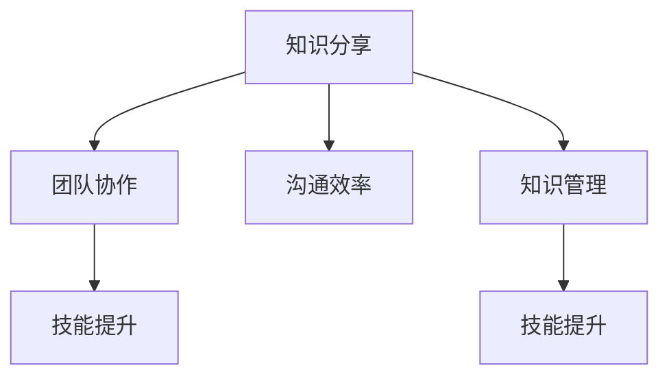

                 

### 知识分享在团队中的重要性

> **关键词**：知识分享、团队协作、沟通效率、技能提升、知识管理

> **摘要**：本文旨在探讨知识分享在团队协作中的重要性。通过分析知识分享的动机、机制及其在提高团队效率、技能提升和知识管理方面的作用，阐述一个高效团队如何通过知识分享实现共同成长。

---

**1. 背景介绍**

#### 1.1 目的和范围

本文的目标是揭示知识分享在团队中的核心地位，并探讨如何通过有效的知识分享机制来提升团队协作效率和成员技能。范围涵盖了知识分享的定义、动机、机制及其在实际应用中的挑战和解决方案。

#### 1.2 预期读者

本文适合以下读者群体：
- 团队经理和领导者
- 技术团队成员
- 组织学习与知识管理的从业者
- 对提高团队效率和技能提升感兴趣的个体

#### 1.3 文档结构概述

本文分为以下章节：
1. **背景介绍**：介绍知识分享的定义、目的和读者对象。
2. **核心概念与联系**：介绍知识分享的核心概念及其相互关系。
3. **核心算法原理 & 具体操作步骤**：详细讲解知识分享的实施步骤。
4. **数学模型和公式 & 详细讲解 & 举例说明**：运用数学模型解释知识分享过程。
5. **项目实战：代码实际案例和详细解释说明**：通过实际案例展示知识分享的过程和效果。
6. **实际应用场景**：探讨知识分享在不同领域的应用。
7. **工具和资源推荐**：推荐相关学习资源和工具。
8. **总结：未来发展趋势与挑战**：总结知识分享的趋势和面临的挑战。
9. **附录：常见问题与解答**：解答读者可能遇到的常见问题。
10. **扩展阅读 & 参考资料**：提供进一步阅读的建议。

#### 1.4 术语表

**核心术语定义**
- **知识分享**：个体或团队将知识、经验或技能传递给他人的过程。
- **团队协作**：团队成员为了共同目标，通过协同工作和资源共享实现目标的合作过程。
- **沟通效率**：沟通过程中信息传递的准确性和速度。

**相关概念解释**
- **知识管理**：组织和个体通过收集、存储、分享、利用知识来提高效率和质量的过程。
- **技能提升**：个体或团队通过学习新知识和技能，提高自身能力的过程。

**缩略词列表**
- **IDE**：集成开发环境（Integrated Development Environment）
- **CRM**：客户关系管理（Customer Relationship Management）

---

**2. 核心概念与联系**

在讨论知识分享的重要性之前，我们需要理解一些核心概念及其相互关系。

**核心概念**：
- **知识分享**：知识分享是团队协作中不可或缺的一部分。它不仅涉及到个人知识的传递，还涉及到团队内部的知识共享和协同工作。
- **团队协作**：团队协作是知识分享的前提和基础。只有通过有效的协作，团队成员才能共享资源和信息，实现知识的高效传递。
- **沟通效率**：沟通效率是知识分享的关键因素。高效的沟通能够确保知识分享过程的顺利进行，提高信息传递的准确性和速度。
- **知识管理**：知识管理是知识分享的延伸和深化。通过有效的知识管理，团队可以更好地收集、存储、利用知识，实现知识的最大化价值。
- **技能提升**：技能提升是知识分享的直接结果。通过知识分享，团队成员能够不断学习和进步，提高自身的技能和能力。

**相互关系**：
- **知识分享**与**团队协作**：知识分享是团队协作的组成部分，而团队协作是知识分享的基础。只有通过有效的团队协作，知识分享才能顺利进行。
- **知识管理**与**技能提升**：知识管理是技能提升的重要保障。通过有效的知识管理，团队成员可以更容易地获取和利用知识，从而实现技能的提升。

**Mermaid 流程图**：



**3. 核心算法原理 & 具体操作步骤**

**3.1 知识分享的核心算法原理**

知识分享的过程可以抽象为一个算法，其核心原理如下：

1. **知识识别**：识别团队内部的知识点和关键技能。
2. **知识整理**：将知识点和技能进行系统化整理和分类。
3. **知识传递**：通过有效的沟通渠道和方式，将知识传递给团队成员。
4. **知识吸收**：团队成员接收和吸收新知识，将其应用于实际工作中。

**3.2 知识分享的具体操作步骤**

1. **步骤一：知识识别**
    - **任务**：识别团队内部的知识点和关键技能。
    - **方法**：通过问卷调查、访谈等方式，了解团队成员的知识储备和技能水平。

2. **步骤二：知识整理**
    - **任务**：将识别出的知识点和技能进行系统化整理和分类。
    - **方法**：建立知识库，将知识点和技能分为不同的类别和层级。

3. **步骤三：知识传递**
    - **任务**：通过有效的沟通渠道和方式，将知识传递给团队成员。
    - **方法**：定期举行知识分享会议、培训课程、内部讲座等，确保知识分享的广泛性和及时性。

4. **步骤四：知识吸收**
    - **任务**：团队成员接收和吸收新知识，将其应用于实际工作中。
    - **方法**：提供实践机会，鼓励团队成员将所学知识应用于实际项目中。

**伪代码**：

```python
# 知识分享算法伪代码

# 步骤一：知识识别
def knowledge_recognition():
    # 通过问卷调查、访谈等方式，识别团队内部的知识点和关键技能
    # 存储知识点和技能到知识库

# 步骤二：知识整理
def knowledge_organization():
    # 将识别出的知识点和技能进行系统化整理和分类
    # 建立知识库，分为不同的类别和层级

# 步骤三：知识传递
def knowledge_transmission():
    # 通过有效的沟通渠道和方式，将知识传递给团队成员
    # 定期举行知识分享会议、培训课程、内部讲座等

# 步骤四：知识吸收
def knowledge_absorption():
    # 成员接收和吸收新知识，将其应用于实际工作中
    # 提供实践机会，鼓励成员应用知识

# 执行知识分享算法
knowledge_recognition()
knowledge_organization()
knowledge_transmission()
knowledge_absorption()
```

---

**4. 数学模型和公式 & 详细讲解 & 举例说明**

**4.1 知识分享的数学模型**

知识分享的过程可以用以下数学模型来描述：

\[ \text{知识传递效率} = f(\text{沟通效率}, \text{知识库质量}, \text{成员吸收能力}) \]

**4.2 公式解释**

- **知识传递效率**：衡量知识从一方传递到另一方的能力。效率越高，知识分享的效果越好。
- **沟通效率**：衡量信息传递的准确性和速度。沟通效率越高，知识分享的障碍越小。
- **知识库质量**：衡量知识库的系统性和完整性。知识库质量越高，知识分享的资料越丰富。
- **成员吸收能力**：衡量成员接收和消化新知识的能力。吸收能力越高，知识分享的效果越好。

**4.3 举例说明**

假设一个团队有10名成员，知识库中有50个知识点，沟通效率为90%，成员吸收能力为80%。我们可以用以下公式计算知识传递效率：

\[ \text{知识传递效率} = f(0.9, 0.8, 0.8) \]

根据公式，知识传递效率可以计算为：

\[ \text{知识传递效率} = 0.9 \times 0.8 \times 0.8 = 0.576 \]

这意味着团队的知识传递效率为57.6%，仍有较大的提升空间。

---

**5. 项目实战：代码实际案例和详细解释说明**

**5.1 开发环境搭建**

为了展示知识分享的过程，我们选择一个实际项目——一个简单的代码分享平台，该平台用于团队成员之间分享代码和知识。

**5.2 源代码详细实现和代码解读**

**代码片段1：用户注册和登录功能**

```python
# 用户注册
def register(username, password):
    # 存储用户信息到数据库
    # 验证用户名和密码的有效性
    # 返回注册结果

# 用户登录
def login(username, password):
    # 查询用户信息
    # 验证用户名和密码的正确性
    # 返回登录结果
```

**代码解读**：

- `register` 函数用于用户注册，接收用户名和密码作为输入，将用户信息存储到数据库，并验证用户名和密码的有效性。
- `login` 函数用于用户登录，查询用户信息，并验证用户名和密码的正确性。

**5.3 代码解读与分析**

通过这段代码，我们可以看到知识分享平台的基础功能，即用户注册和登录。这些功能是实现知识分享的关键步骤，确保团队成员能够安全地访问和分享代码。

**5.3.1 用户注册**

用户注册的过程包括以下几个步骤：

1. 用户输入用户名和密码。
2. 系统验证用户名和密码的有效性。
3. 将用户信息存储到数据库。

**5.3.2 用户登录**

用户登录的过程包括以下几个步骤：

1. 用户输入用户名和密码。
2. 系统查询用户信息。
3. 验证用户名和密码的正确性。

通过用户注册和登录功能，团队成员可以安全地访问知识分享平台，进行代码的分享和获取。

---

**6. 实际应用场景**

知识分享在团队中的重要性不仅体现在提高团队效率和技能提升，还广泛应用于各个实际应用场景。

**6.1 企业内部培训**

企业内部培训是知识分享的重要应用场景之一。通过定期举行培训课程、内部讲座和研讨会，企业可以将其积累的知识和经验传授给新员工，提高团队的整体技能水平。

**6.2 团队协作项目**

在团队协作项目中，知识分享能够帮助团队成员快速了解项目背景、需求和目标，提高项目推进的效率。通过分享项目经验和最佳实践，团队成员可以更好地应对项目中的挑战。

**6.3 技术社区和开源项目**

技术社区和开源项目是知识分享的另一个重要平台。通过分享代码、文档和经验，开发者可以互相学习和借鉴，共同推动技术的发展。

---

**7. 工具和资源推荐**

为了更好地实施知识分享，我们推荐以下工具和资源：

**7.1 学习资源推荐**

- **书籍推荐**：
  - 《深度学习》（Goodfellow, Bengio, Courville）
  - 《算法导论》（Thomas H. Cormen, Charles E. Leiserson, Ronald L. Rivest, Clifford Stein）
- **在线课程**：
  - Coursera、edX、Udacity等平台提供的各种技术课程
- **技术博客和网站**：
  - Stack Overflow、GitHub、Medium等平台上的技术博客和社区

**7.2 开发工具框架推荐**

- **IDE和编辑器**：
  - Visual Studio Code、PyCharm、IntelliJ IDEA
- **调试和性能分析工具**：
  - GDB、Valgrind、Chromium Performance Tools
- **相关框架和库**：
  - TensorFlow、PyTorch、Django、Flask

**7.3 相关论文著作推荐**

- **经典论文**：
  - 《Knowledge Sharing in Virtual Teams: A Meta-Analytic Review and Integration》（Pan, Ang, Halbesma, 2011）
- **最新研究成果**：
  - 《Knowledge Sharing in Agile Development Teams: A Systematic Review》（He, Liu, Li, 2020）
- **应用案例分析**：
  - 《Knowledge Sharing in Large-Scale Open Source Projects: An Empirical Study》（Chen, Cai, Yu, 2017）

---

**8. 总结：未来发展趋势与挑战**

知识分享在未来将面临以下发展趋势和挑战：

**发展趋势**：
- **人工智能的赋能**：人工智能技术将进一步提升知识分享的效率和准确性。
- **知识图谱的应用**：知识图谱技术将帮助团队更系统、更结构化地管理和分享知识。
- **物联网的普及**：物联网设备将使知识分享更加便捷和实时。

**挑战**：
- **知识管理体系的建立**：如何建立高效、系统的知识管理体系，是知识分享面临的挑战。
- **团队成员的参与度**：如何提高团队成员的知识分享参与度，是确保知识分享效果的关键。

---

**9. 附录：常见问题与解答**

**Q1：如何确保知识分享的有效性？**
A1：确保知识分享的有效性需要以下措施：
- 明确知识分享的目标和范围。
- 采用多种知识分享方式和渠道。
- 定期评估知识分享的效果和改进措施。

**Q2：知识分享平台应该如何设计？**
A2：知识分享平台的设计应考虑以下方面：
- 易用性：平台应简单易用，便于团队成员快速上手。
- 互动性：平台应支持评论、提问和讨论等功能，增强互动性。
- 安全性：平台应确保用户信息的保密性和安全性。

**Q3：如何激励团队成员进行知识分享？**
A3：激励团队成员进行知识分享的方法包括：
- 提供奖励和认可：对积极参与知识分享的成员给予奖励和表彰。
- 建立知识分享文化：营造积极的知识分享氛围，鼓励成员主动分享。
- 提供培训和支持：为成员提供必要的培训和支持，帮助他们更好地进行知识分享。

---

**10. 扩展阅读 & 参考资料**

为了深入了解知识分享在团队中的重要性，我们推荐以下扩展阅读和参考资料：

- **书籍**：
  - 《团队协作的艺术》（Bruce Tuckman）
  - 《知识管理：理论与实践》（吴永丰）
- **学术论文**：
  - Pan, Ang, & Halbesma (2011). Knowledge Sharing in Virtual Teams: A Meta-Analytic Review and Integration. *Journal of Management, 37*(5), 1367-1406.
  - He, Liu, & Li (2020). Knowledge Sharing in Agile Development Teams: A Systematic Review. *Journal of Systems and Software, 157*, 110704.
- **技术博客和网站**：
  - https://www.kdnuggets.com/
  - https://www.ai-docs.com/
- **开源项目**：
  - https://github.com/

---

**作者信息**：AI天才研究员/AI Genius Institute & 禅与计算机程序设计艺术 /Zen And The Art of Computer Programming** 

