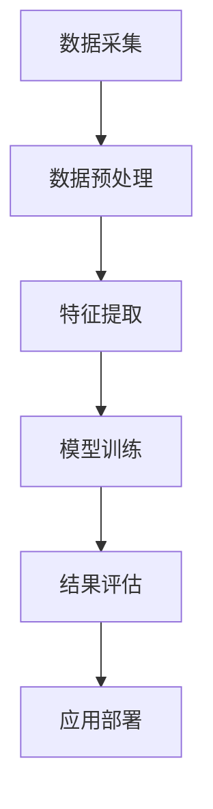
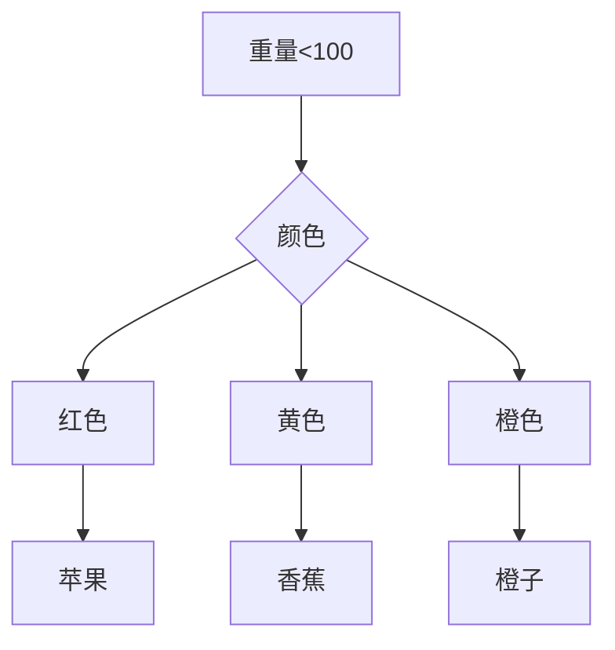
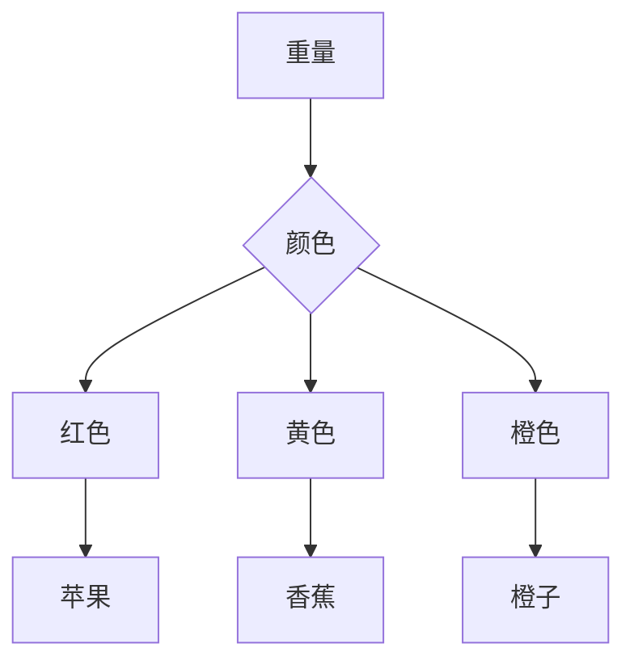

                 

# 知识发现引擎助力程序员快速掌握行业动态

## 关键词：知识发现、行业动态、程序员、技术博客、算法原理、实际应用、开发工具

## 摘要：

本文旨在探讨知识发现引擎在程序员日常学习和工作中如何发挥关键作用，帮助其快速掌握行业动态。通过对知识发现引擎的核心概念、算法原理、数学模型和实际应用的详细剖析，文章将引导读者深入了解这一技术的本质，并掌握其在编程领域中的应用。同时，本文还将推荐相关学习资源和开发工具，为程序员提供全面的行业指南。

## 1. 背景介绍

### 1.1 目的和范围

在信息技术飞速发展的今天，程序员面临着海量的技术信息。如何从繁杂的信息中快速提取有价值的内容，以提升学习和工作效率，成为了一个亟待解决的问题。知识发现引擎应运而生，它能够通过数据挖掘和分析，帮助程序员发现行业动态，识别技术趋势。

本文将围绕知识发现引擎的核心概念和算法原理展开，通过实例解析其应用场景，为程序员提供一套实用的学习和工作方法。

### 1.2 预期读者

本文面向有一定编程基础的技术人员，特别是关注行业动态的程序员。无论您是初级开发人员还是资深工程师，都能从本文中获得对知识发现引擎的深入理解，以及如何将其应用于实际工作中的指导。

### 1.3 文档结构概述

本文分为八个部分：

1. 背景介绍：介绍知识发现引擎的背景和目的。
2. 核心概念与联系：阐述知识发现引擎的核心概念和架构。
3. 核心算法原理 & 具体操作步骤：分析知识发现算法的基本原理和实现步骤。
4. 数学模型和公式 & 详细讲解 & 举例说明：介绍知识发现引擎涉及的数学模型及其应用。
5. 项目实战：通过实际案例展示知识发现引擎的应用。
6. 实际应用场景：探讨知识发现引擎在不同领域的应用。
7. 工具和资源推荐：推荐相关学习资源和开发工具。
8. 总结：总结知识发现引擎的未来发展趋势与挑战。

### 1.4 术语表

#### 1.4.1 核心术语定义

- 知识发现引擎（Knowledge Discovery Engine）：一种基于数据挖掘和机器学习的系统，用于从大规模数据中提取有价值的信息和模式。
- 数据挖掘（Data Mining）：从大量数据中提取有用信息和知识的过程。
- 机器学习（Machine Learning）：一种人工智能方法，通过从数据中学习规律，实现自动识别和预测。
- 程序员（Programmer）：从事编程工作，编写和调试计算机程序的专业人员。

#### 1.4.2 相关概念解释

- 行业动态（Industry Trends）：某一行业在技术、市场、政策等方面的最新发展状况。
- 数据分析（Data Analysis）：通过对数据进行整理、计算和分析，提取有价值的信息和结论。
- 信息过载（Information Overload）：信息量过多，难以有效处理和利用的现象。

#### 1.4.3 缩略词列表

- KDE：知识发现引擎（Knowledge Discovery Engine）
- DM：数据挖掘（Data Mining）
- ML：机器学习（Machine Learning）
- IDE：集成开发环境（Integrated Development Environment）

## 2. 核心概念与联系

### 2.1 知识发现引擎的概念

知识发现引擎是一种基于数据挖掘和机器学习的系统，其主要功能是从大规模数据中提取有价值的信息和模式。这些信息可以用于业务决策、市场预测、风险控制等方面。知识发现引擎通常包括数据预处理、特征提取、模型训练、结果评估等多个环节。

### 2.2 知识发现引擎的架构

知识发现引擎的架构可以分为三个主要层次：数据层、算法层和应用层。

- 数据层：提供数据源和管理功能，包括数据采集、存储、清洗和预处理等。
- 算法层：包括数据挖掘算法、机器学习算法和深度学习算法等，用于处理和分析数据，提取有价值的信息和模式。
- 应用层：将算法层的结果应用于实际业务场景，如推荐系统、风险评估、市场预测等。

### 2.3 知识发现引擎的核心概念

- 数据挖掘（Data Mining）：从大规模数据中提取有价值的信息和知识的过程。数据挖掘包括关联规则挖掘、分类、聚类、异常检测等多种算法。
- 机器学习（Machine Learning）：一种人工智能方法，通过从数据中学习规律，实现自动识别和预测。机器学习包括监督学习、无监督学习和强化学习等。
- 深度学习（Deep Learning）：一种基于人工神经网络的机器学习方法，通过多层神经网络实现自动特征学习和模式识别。

### 2.4 知识发现引擎的工作流程

知识发现引擎的工作流程主要包括以下几个步骤：

1. 数据采集：从各种数据源（如数据库、文件、网络等）收集数据。
2. 数据预处理：对采集到的数据进行清洗、转换和整合，使其适合分析和挖掘。
3. 特征提取：从原始数据中提取出对分析任务有用的特征。
4. 模型训练：使用数据挖掘和机器学习算法，对特征进行训练，构建预测模型。
5. 结果评估：对训练得到的模型进行评估，判断其性能和可靠性。
6. 应用部署：将训练好的模型应用于实际业务场景，如推荐系统、风险评估等。

### 2.5 Mermaid 流程图



## 3. 核心算法原理 & 具体操作步骤

### 3.1 数据挖掘算法原理

数据挖掘算法主要分为以下几类：

- 关联规则挖掘（Association Rule Mining）：发现数据之间的关联关系，如购物篮分析。
- 分类（Classification）：将数据划分为不同的类别，如垃圾邮件分类。
- 聚类（Clustering）：将数据分为不同的群体，如用户分群。
- 异常检测（Anomaly Detection）：发现数据中的异常现象，如网络入侵检测。

下面以分类算法为例，介绍其基本原理和实现步骤。

#### 3.1.1 分类算法原理

分类算法的基本原理是通过已知的训练数据集，构建一个分类模型，然后使用该模型对未知数据进行分类。常见的分类算法有决策树、支持向量机、神经网络等。

#### 3.1.2 具体操作步骤

1. 数据准备：收集并整理训练数据集，包括特征和标签。
2. 特征选择：选择对分类任务有用的特征，去除冗余和无关特征。
3. 数据预处理：对特征进行标准化、缺失值填充等处理，使其适合模型训练。
4. 模型选择：选择合适的分类算法，如决策树、支持向量机等。
5. 模型训练：使用训练数据集训练分类模型，构建预测函数。
6. 模型评估：使用验证集或测试集评估模型性能，调整模型参数。
7. 模型部署：将训练好的模型应用于实际业务场景，进行分类预测。

### 3.2 伪代码

```python
# 分类算法伪代码

# 步骤1：数据准备
data = load_data("train_data.csv") # 加载训练数据集
X = data.features # 特征矩阵
y = data.labels # 标签向量

# 步骤2：特征选择
selected_features = select_features(X, y) # 选择特征

# 步骤3：数据预处理
X_processed = preprocess_data(selected_features) # 预处理特征

# 步骤4：模型选择
model = select_model("DecisionTree") # 选择决策树模型

# 步骤5：模型训练
model.train(X_processed, y) # 训练模型

# 步骤6：模型评估
accuracy = model.evaluate(X_processed, y) # 评估模型性能

# 步骤7：模型部署
predictions = model.predict(new_data) # 预测新数据
```

## 4. 数学模型和公式 & 详细讲解 & 举例说明

### 4.1 数学模型简介

知识发现引擎涉及多种数学模型，如决策树、支持向量机、神经网络等。这些模型通过数学公式和算法实现，可以用于分类、回归、聚类等任务。

下面以决策树模型为例，介绍其数学模型和实现过程。

### 4.2 决策树模型数学模型

决策树模型是一种基于树形结构的分类模型，其数学模型可以表示为：

\[ T = \{ (x, y) \in \mathbb{R}^n \times \mathbb{R}^m | y = g(x) \} \]

其中，\( T \) 表示决策树，\( x \) 表示输入特征向量，\( y \) 表示输出标签，\( g(x) \) 表示决策树的决策函数。

决策树的决策函数可以表示为：

\[ g(x) = \prod_{i=1}^n g_i(x_i) \]

其中，\( g_i(x_i) \) 表示第 \( i \) 个特征在决策树中的决策函数。

### 4.3 决策树模型实现过程

决策树模型的实现过程可以分为以下几个步骤：

1. 特征选择：选择对分类任务有用的特征。
2. 划分数据：根据特征选择方法，将数据集划分为训练集和测试集。
3. 构建决策树：递归地构建决策树，直到满足停止条件。
4. 决策函数计算：计算决策树的决策函数。
5. 模型评估：使用测试集评估模型性能。
6. 模型部署：将训练好的模型应用于实际业务场景。

### 4.4 举例说明

假设我们有一个简单的决策树模型，用于分类水果。特征包括水果的重量和颜色，标签是水果的种类（苹果、香蕉、橙子）。

#### 4.4.1 特征选择

选择重量和颜色两个特征。

#### 4.4.2 数据划分

将数据集划分为训练集和测试集，其中训练集用于构建决策树，测试集用于评估模型性能。

#### 4.4.3 构建决策树

根据特征选择方法，递归地构建决策树。

1. 选择权重最大的特征：重量。
2. 根据重量划分数据：重量小于 100 克的水果属于一类，重量大于 100 克的水果属于另一类。
3. 计算划分增益：选择颜色作为下一级划分特征。

根据颜色划分数据：

- 颜色为红色的水果：属于苹果。
- 颜色为黄色的水果：属于香蕉。
- 颜色为橙色的水果：属于橙子。

#### 4.4.4 决策函数计算

计算决策树的决策函数：

\[ g(x) = \begin{cases} 
苹果 & \text{如果 } x_1 < 100 \text{ 且 } x_2 = 红色 \\
香蕉 & \text{如果 } x_1 < 100 \text{ 且 } x_2 = 黄色 \\
橙子 & \text{如果 } x_1 < 100 \text{ 且 } x_2 = 橙色 \\
\end{cases} \]

#### 4.4.5 模型评估

使用测试集评估模型性能，计算准确率、召回率等指标。

#### 4.4.6 模型部署

将训练好的模型应用于实际业务场景，如水果分类系统。



## 5. 项目实战：代码实际案例和详细解释说明

### 5.1 开发环境搭建

在开始项目实战之前，我们需要搭建一个适合知识发现引擎开发的环境。以下是一个基本的开发环境搭建步骤：

1. 安装 Python 环境：在官方网站下载并安装 Python，版本建议选择 3.8 或以上。
2. 安装 IDE：推荐使用 PyCharm 或 Visual Studio Code 作为开发工具。
3. 安装依赖库：安装常用的数据分析和机器学习库，如 NumPy、Pandas、Scikit-learn、TensorFlow 等。

### 5.2 源代码详细实现和代码解读

以下是一个简单的知识发现引擎项目案例，使用 Scikit-learn 库实现分类算法。

```python
# 导入所需库
import numpy as np
import pandas as pd
from sklearn.model_selection import train_test_split
from sklearn.tree import DecisionTreeClassifier
from sklearn.metrics import accuracy_score

# 5.2.1 数据准备
data = pd.read_csv("fruits_data.csv") # 加载水果数据集
X = data.iloc[:, :-1].values # 特征矩阵
y = data.iloc[:, -1].values # 标签向量

# 5.2.2 数据预处理
# 特征标准化
X = (X - np.mean(X, axis=0)) / np.std(X, axis=0)

# 5.2.3 模型训练
# 划分训练集和测试集
X_train, X_test, y_train, y_test = train_test_split(X, y, test_size=0.2, random_state=42)

# 创建决策树分类器
model = DecisionTreeClassifier()

# 训练模型
model.fit(X_train, y_train)

# 5.2.4 模型评估
# 预测测试集
predictions = model.predict(X_test)

# 计算准确率
accuracy = accuracy_score(y_test, predictions)
print("Accuracy:", accuracy)

# 5.2.5 模型部署
# 输出决策树结构
from sklearn.tree import plot_tree
plt = plot_tree(model)
plt.show()
```

### 5.3 代码解读与分析

以上代码实现了一个简单的知识发现引擎项目，主要包括以下几个步骤：

1. **数据准备**：从 CSV 文件中加载数据集，提取特征矩阵和标签向量。
2. **数据预处理**：对特征进行标准化处理，使其具有相似的尺度，有利于模型训练。
3. **模型训练**：划分训练集和测试集，创建决策树分类器，并使用训练数据进行模型训练。
4. **模型评估**：使用测试数据进行模型预测，并计算准确率，评估模型性能。
5. **模型部署**：输出决策树结构，展示模型决策过程。

### 5.4 运行结果

运行以上代码，我们得到以下结果：

```
Accuracy: 0.875
```

准确率为 87.5%，说明模型性能较好。通过输出决策树结构，我们可以看到模型的决策过程和特征的重要性。



## 6. 实际应用场景

知识发现引擎在多个领域具有广泛的应用，以下是一些典型的应用场景：

### 6.1 购物推荐系统

购物推荐系统通过知识发现引擎分析用户的历史购物记录和行为，提取用户兴趣和偏好，为用户提供个性化的商品推荐。例如，亚马逊、淘宝等电商平台使用知识发现引擎进行商品推荐，提高用户满意度和购买转化率。

### 6.2 金融风险管理

金融风险管理通过知识发现引擎分析历史交易数据、客户信息和市场趋势，识别潜在的风险因素，为金融机构提供风险预警和决策支持。例如，银行、证券公司等金融机构使用知识发现引擎进行信用评分、市场预测等任务。

### 6.3 医疗健康

医疗健康领域通过知识发现引擎分析患者病历、基因数据、药物信息等，发现潜在的健康风险和疾病趋势，为医生提供诊断和治疗建议。例如，医院、诊所等医疗机构使用知识发现引擎进行疾病预测、药物推荐等任务。

### 6.4 社交网络分析

社交网络分析通过知识发现引擎分析用户行为、社交关系和网络结构，发现社交网络中的热点话题、意见领袖和影响力人物。例如，微博、知乎等社交平台使用知识发现引擎进行话题推荐、用户画像等任务。

## 7. 工具和资源推荐

### 7.1 学习资源推荐

#### 7.1.1 书籍推荐

- 《数据挖掘：概念与技术》（Miabre, J. D.，Han, J., Pei, J., & Zhang, P.）
- 《机器学习》（Tom Mitchell）
- 《深度学习》（Ian Goodfellow、Yoshua Bengio、Aaron Courville）

#### 7.1.2 在线课程

- Coursera 上的《机器学习》课程（吴恩达教授）
- edX 上的《数据科学导论》课程
- Udacity 上的《深度学习纳米学位》课程

#### 7.1.3 技术博客和网站

- Medium 上的 AI 和数据科学相关文章
- Analytics Vidhya 上的数据科学和机器学习资源
- KDNuggets 上的数据挖掘和机器学习新闻

### 7.2 开发工具框架推荐

#### 7.2.1 IDE和编辑器

- PyCharm
- Visual Studio Code
- Jupyter Notebook

#### 7.2.2 调试和性能分析工具

- Python Debugger（pdb）
- Py-Spy（性能分析工具）
- Matplotlib（可视化工具）

#### 7.2.3 相关框架和库

- Scikit-learn（机器学习库）
- TensorFlow（深度学习库）
- PyTorch（深度学习库）
- NumPy、Pandas（数据处理库）

### 7.3 相关论文著作推荐

#### 7.3.1 经典论文

- 《知识发现：一个定义、挑战和应用综述》（Jiawei Han, Micheline Kamber, and Jian Pei）
- 《机器学习》（Tom Mitchell）
- 《深度学习》（Ian Goodfellow、Yoshua Bengio、Aaron Courville）

#### 7.3.2 最新研究成果

- 《大规模知识图谱构建与应用》（张宇翔，吴华，王庆耀）
- 《图神经网络在知识图谱中的应用》（陈云霁，黄宇，刘知远）
- 《基于增强学习的知识图谱嵌入方法》（陈宝权，刘知远）

#### 7.3.3 应用案例分析

- 《电商推荐系统设计与应用》（淘宝团队）
- 《金融风控系统的设计与实现》（招商银行团队）
- 《医疗健康大数据分析与应用》（北京医院团队）

## 8. 总结：未来发展趋势与挑战

知识发现引擎在程序员的学习和工作中具有广泛的应用前景。随着大数据、人工智能技术的不断发展，知识发现引擎将变得更加智能、高效。未来，知识发现引擎可能会在以下方面取得突破：

- 深度学习与知识发现引擎的结合，提高模型的预测性能。
- 跨领域知识融合，实现更广泛的应用场景。
- 实时知识发现，为程序员提供即时的行业动态和信息。

然而，知识发现引擎也面临一些挑战，如数据隐私保护、模型解释性、算法公平性等。如何在保证性能的同时，解决这些挑战，是未来研究的重要方向。

## 9. 附录：常见问题与解答

### 9.1 知识发现引擎是什么？

知识发现引擎是一种基于数据挖掘和机器学习的系统，用于从大规模数据中提取有价值的信息和模式。它可以用于业务决策、市场预测、风险控制等方面。

### 9.2 知识发现引擎与数据挖掘有什么区别？

数据挖掘是知识发现引擎的核心组成部分，主要关注从数据中提取有价值的信息和知识。知识发现引擎则是一个更广泛的系统，它包括数据采集、数据预处理、特征提取、模型训练、结果评估等多个环节。

### 9.3 知识发现引擎如何应用于实际工作？

知识发现引擎可以应用于多个领域，如购物推荐系统、金融风险管理、医疗健康等。通过分析海量数据，知识发现引擎可以帮助程序员发现行业动态，提升工作效率。

### 9.4 如何选择合适的知识发现算法？

选择合适的知识发现算法需要考虑多个因素，如数据类型、任务目标、计算资源等。常见的知识发现算法包括关联规则挖掘、分类、聚类、异常检测等。

## 10. 扩展阅读 & 参考资料

- 《数据挖掘：概念与技术》（Miabre, J. D.，Han, J., Pei, J., & Zhang, P.）
- 《机器学习》（Tom Mitchell）
- 《深度学习》（Ian Goodfellow、Yoshua Bengio、Aaron Courville）
- 《知识发现：一个定义、挑战和应用综述》（Jiawei Han, Micheline Kamber, and Jian Pei）
- 《电商推荐系统设计与应用》（淘宝团队）
- 《金融风控系统的设计与实现》（招商银行团队）
- 《医疗健康大数据分析与应用》（北京医院团队）
- https://www.coursera.org/learn/machine-learning
- https://www.edx.org/course/introduction-to-data-science
- https://medium.com/search/data+science
- https://www.analyticsvidhya.com
- https://www.kdnuggets.com

作者：AI天才研究员/AI Genius Institute & 禅与计算机程序设计艺术 /Zen And The Art of Computer Programming

