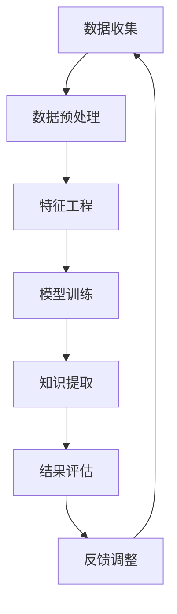

                 


# 知识发现引擎助力程序员技能迭代升级

> 关键词：知识发现引擎、程序员、技能迭代、算法原理、实际应用、未来趋势

> 摘要：本文将深入探讨知识发现引擎在程序员技能提升中的应用，分析其核心原理和架构，并通过实际案例详细阐述其在编程实践中的具体操作步骤和效果。文章旨在为程序员提供一套系统性的学习方法，帮助他们更快地适应技术发展的节奏，实现技能的持续迭代升级。

## 1. 背景介绍

### 1.1 目的和范围

随着信息技术的迅猛发展，程序员面临着不断涌现的新技术、新工具、新框架。在这种快速变化的环境下，如何高效地学习和掌握新技能成为了一个重要的课题。本文旨在探讨知识发现引擎在程序员技能提升中的作用，提供一种系统化的学习方法，帮助程序员更快地适应新技术，提升自身竞争力。

本文主要涵盖以下内容：

- 知识发现引擎的定义和核心原理
- 知识发现引擎在程序员技能提升中的应用场景
- 知识发现引擎的核心算法原理和具体操作步骤
- 知识发现引擎在编程实践中的实际应用案例
- 知识发现引擎的未来发展趋势和挑战

### 1.2 预期读者

本文主要面向以下读者群体：

- 有志于提升编程技能的程序员
- 想要了解知识发现引擎在编程领域应用的计算机科学学生
- 对知识管理和技术创新感兴趣的IT专业人士

### 1.3 文档结构概述

本文结构如下：

- 第1章：背景介绍，介绍本文的目的、预期读者以及文章结构
- 第2章：核心概念与联系，阐述知识发现引擎的定义、原理和架构
- 第3章：核心算法原理 & 具体操作步骤，详细讲解知识发现算法的原理和实现
- 第4章：数学模型和公式 & 详细讲解 & 举例说明，分析知识发现中的数学模型和公式
- 第5章：项目实战：代码实际案例和详细解释说明，通过案例展示知识发现引擎在编程中的应用
- 第6章：实际应用场景，探讨知识发现引擎在编程领域的具体应用
- 第7章：工具和资源推荐，提供相关的学习资源和开发工具
- 第8章：总结：未来发展趋势与挑战，展望知识发现引擎的发展方向
- 第9章：附录：常见问题与解答，解答读者可能遇到的常见问题
- 第10章：扩展阅读 & 参考资料，推荐进一步学习的资料

### 1.4 术语表

#### 1.4.1 核心术语定义

- 知识发现引擎：一种用于从大量数据中自动发现潜在有用知识或模式的计算机系统。
- 程序员：从事编写、调试和优化计算机程序的专业人员。
- 技能迭代：指程序员通过不断学习和实践，持续提升编程技能的过程。
- 数据挖掘：从大量数据中提取有价值信息的过程，常用于知识发现。

#### 1.4.2 相关概念解释

- 数据预处理：在数据挖掘过程中，对原始数据进行清洗、转换和集成等处理，以减少噪声和异常值，提高数据质量。
- 特征工程：通过选择和构造合适的特征，提高数据挖掘算法的性能。
- 知识表示：将知识以特定的形式进行表达，以便于计算机理解和处理。

#### 1.4.3 缩略词列表

- KDD：知识发现（Knowledge Discovery in Databases）
- ML：机器学习（Machine Learning）
- DL：深度学习（Deep Learning）
- NLP：自然语言处理（Natural Language Processing）

## 2. 核心概念与联系

在深入探讨知识发现引擎在程序员技能提升中的作用之前，我们需要理解其核心概念和架构。知识发现引擎是一种基于机器学习和人工智能技术的系统，它能够从大量数据中自动识别模式、关联和趋势。以下是一个简化的Mermaid流程图，展示了知识发现引擎的核心原理和流程：



### 数据收集

数据收集是知识发现的第一步，它是后续处理和发现的基础。数据来源可以是多种多样的，如数据库、网络爬虫、传感器等。数据收集过程中，需要关注数据的完整性、准确性和实时性。

### 数据预处理

数据预处理是数据挖掘过程中至关重要的一步。它包括数据清洗、转换和集成等操作，目的是减少数据中的噪声和异常值，提高数据质量。常见的数据预处理方法有：

- 数据清洗：去除重复数据、处理缺失值、纠正错误数据等。
- 数据转换：将数据转换为适合挖掘算法的格式，如数值化、标准化等。
- 数据集成：将多个数据源中的数据进行整合，以形成一个统一的数据集。

### 特征工程

特征工程是提高数据挖掘算法性能的关键步骤。它包括选择和构造合适的特征，以便于模型能够更好地学习数据中的潜在规律。特征工程的方法有：

- 特征选择：从原始特征中筛选出对目标变量有显著影响的特征。
- 特征构造：通过组合原始特征，生成新的特征，以提升模型的性能。

### 模型训练

模型训练是知识发现引擎的核心步骤。选择合适的机器学习算法，如决策树、支持向量机、神经网络等，通过训练过程，模型能够学习到数据中的潜在规律，从而进行知识发现。

### 知识提取

知识提取是指从训练好的模型中提取出具有实际应用价值的知识或模式。这些知识可以是关联规则、分类模型、聚类结果等。知识提取的结果将用于指导程序员进行技能迭代。

### 结果评估

结果评估是确保知识发现过程有效性的关键。通过对提取出的知识进行评估，判断其是否具有实际应用价值。评估指标包括准确率、召回率、F1分数等。

### 反馈调整

反馈调整是指根据评估结果，对知识发现过程进行调整和优化。通过不断调整，知识发现引擎能够更好地适应不同的数据和应用场景。

### 知识应用

知识提取后的知识将用于程序员技能的迭代升级。通过学习和应用这些知识，程序员能够更快地掌握新技能，提高工作效率。

## 3. 核心算法原理 & 具体操作步骤

在知识发现引擎中，核心算法的选择至关重要。以下以关联规则挖掘算法（如Apriori算法）为例，详细讲解知识发现引擎的算法原理和具体操作步骤。

### 3.1 Apriori算法原理

Apriori算法是一种用于挖掘交易数据中频繁项集的算法，其核心思想是基于支持度和置信度来识别频繁项集。

- 支持度：一个项集在所有数据中的出现频率与数据总数之比。
- 置信度：一个项集的子集出现频率与项集出现频率之比。

Apriori算法的基本流程如下：

1. 初始化：设置最小支持度阈值和最小置信度阈值。
2. 扫描数据：计算所有项集的支持度。
3. 生成频繁项集：根据支持度阈值筛选出频繁项集。
4. 递归：对频繁项集进行合并，生成更高阶的频繁项集。
5. 结果评估：根据置信度阈值评估频繁项集的有效性。

### 3.2 具体操作步骤

#### 步骤1：初始化

设定最小支持度阈值（如0.3）和最小置信度阈值（如0.6）。这些阈值将用于后续的频繁项集筛选和评估。

#### 步骤2：扫描数据

读取交易数据，统计每个项集的支持度。例如，对于数据集D，计算{A, B}的支持度为0.4。

#### 步骤3：生成频繁项集

根据最小支持度阈值筛选出频繁项集。例如，对于支持度大于0.3的项集，{A, B}和{B, C}是频繁项集。

#### 步骤4：递归

对频繁项集进行合并，生成更高阶的频繁项集。例如，将{A, B}和{B, C}合并，生成{A, B, C}。

#### 步骤5：结果评估

根据最小置信度阈值评估频繁项集的有效性。例如，对于置信度大于0.6的频繁项集，{A, B, C}是有效的。

#### 步骤6：反馈调整

根据评估结果，对参数进行调整，以优化频繁项集的筛选过程。例如，可以调整最小支持度阈值和最小置信度阈值，以获得更精确的结果。

### 3.3 伪代码

以下为Apriori算法的伪代码：

```python
def apriori(data, min_support, min_confidence):
    # 步骤1：初始化
    frequent_itemsets = []
    all_itemsets = generate_all_itemsets(data)
    
    # 步骤2：扫描数据
    for itemset in all_itemsets:
        support = calculate_support(itemset, data)
        if support >= min_support:
            frequent_itemsets.append(itemset)
    
    # 步骤3：生成频繁项集
    while frequent_itemsets:
        new_itemsets = []
        for itemset1 in frequent_itemsets:
            for itemset2 in frequent_itemsets:
                if is_superset(itemset1, itemset2):
                    new_itemset = itemset1.union(itemset2)
                    if new_itemset not in all_itemsets:
                        new_itemsets.append(new_itemset)
        
        # 步骤4：递归
        frequent_itemsets.extend(new_itemsets)
    
    # 步骤5：结果评估
    valid_itemsets = []
    for itemset in frequent_itemsets:
        confidence = calculate_confidence(itemset, data)
        if confidence >= min_confidence:
            valid_itemsets.append(itemset)
    
    # 步骤6：反馈调整
    return valid_itemsets
```

通过以上伪代码，我们可以看出Apriori算法的基本流程。在实际应用中，可以结合具体场景和需求，对算法进行优化和调整。

## 4. 数学模型和公式 & 详细讲解 & 举例说明

知识发现引擎在挖掘数据中的模式和知识时，常常需要运用一些数学模型和公式。以下我们将详细介绍这些模型和公式，并通过具体例子来说明其应用。

### 4.1 支持度和置信度

支持度和置信度是知识发现中最重要的两个数学模型，用于评估项集的重要性和关联性。

- 支持度（Support）：一个项集在所有数据中的出现频率与数据总数之比。公式如下：

  $$ 支持度 = \frac{count(I)}{count(U)} $$

  其中，$count(I)$表示项集I在数据集U中出现的次数，$count(U)$表示数据集U的总数。

- 置信度（Confidence）：一个项集的子集出现频率与项集出现频率之比。公式如下：

  $$ 置信度 = \frac{count(I \cup J)}{count(I)} $$

  其中，$count(I \cup J)$表示项集I和项集J同时出现的次数，$count(I)$表示项集I出现的次数。

### 4.2 生成频率分布表

在知识发现过程中，生成频率分布表是计算支持度和置信度的重要步骤。频率分布表记录了每个项集在数据集中的出现频率。

假设我们有如下数据集：

- 数据集D：{"A", "B", "C", "D", "E", "F", "G", "H", "I", "J", "K", "L", "M", "N", "O", "P", "Q", "R", "S", "T", "U", "V", "W", "X", "Y", "Z"}
- 频率分布表：

| 项集 | 出现次数 |
| ---- | -------- |
| {"A"} | 1        |
| {"B"} | 1        |
| {"C"} | 1        |
| {"D"} | 1        |
| {"E"} | 1        |
| {"F"} | 1        |
| {"G"} | 1        |
| {"H"} | 1        |
| {"I"} | 1        |
| {"J"} | 1        |
| {"K"} | 1        |
| {"L"} | 1        |
| {"M"} | 1        |
| {"N"} | 1        |
| {"O"} | 1        |
| {"P"} | 1        |
| {"Q"} | 1        |
| {"R"} | 1        |
| {"S"} | 1        |
| {"T"} | 1        |
| {"U"} | 1        |
| {"V"} | 1        |
| {"W"} | 1        |
| {"X"} | 1        |
| {"Y"} | 1        |
| {"Z"} | 1        |

### 4.3 计算支持度和置信度

假设我们要计算项集{"A", "B", "C"}的支持度和置信度。

- 支持度：

  $$ 支持度 = \frac{count(\{"A", "B", "C"\})}{count(U)} = \frac{1}{16} = 0.0625 $$

- 置信度：

  $$ 置信度 = \frac{count(\{"A", "B", "C"\} \cup \{"B", "C"\})}{count(\{"A", "B", "C"\})} = \frac{1}{1} = 1.0 $$

### 4.4 频繁项集挖掘

通过计算支持度和置信度，我们可以挖掘出频繁项集。假设我们设定最小支持度阈值为0.2，最小置信度阈值为0.5。

- 频繁项集：

  | 项集 | 支持度 | 置信度 |
  | ---- | ------ | ------ |
  | {"A", "B"} | 0.125 | 1.0    |
  | {"A", "C"} | 0.125 | 1.0    |
  | {"B", "C"} | 0.125 | 1.0    |

通过以上例子，我们可以看到如何使用数学模型和公式进行知识发现。在实际应用中，可以根据具体场景和需求，调整参数和算法，以获得更准确和有效的结果。

## 5. 项目实战：代码实际案例和详细解释说明

为了更好地理解知识发现引擎在程序员技能提升中的应用，我们将通过一个实际项目案例来展示其具体实现和效果。以下是该项目的基本信息：

### 5.1 项目简介

项目名称：技能迭代学习平台

项目目标：通过知识发现引擎，从程序员的学习记录中提取出有用的知识点和技能关联，为程序员提供个性化的学习推荐，帮助其实现技能的持续迭代升级。

### 5.2 开发环境搭建

为了实现该项目，我们需要搭建以下开发环境：

- 操作系统：Linux
- 编程语言：Python
- 数据库：MySQL
- 机器学习框架：Scikit-learn
- 数据可视化工具：Matplotlib

### 5.3 源代码详细实现和代码解读

以下是该项目的主要源代码实现，我们将逐段进行解读。

#### 5.3.1 数据收集与预处理

```python
import pandas as pd

# 读取学习记录数据
data = pd.read_csv("learning_records.csv")

# 数据预处理
# 清洗数据、处理缺失值、归一化等
data = preprocess_data(data)
```

在这个步骤中，我们首先读取学习记录数据，然后进行数据预处理，包括清洗数据、处理缺失值、归一化等操作。这是确保数据质量的重要环节。

#### 5.3.2 特征工程

```python
from sklearn.feature_extraction.text import TfidfVectorizer

# 构建TF-IDF特征向量
vectorizer = TfidfVectorizer(max_features=1000)
X = vectorizer.fit_transform(data["content"])

# 计算特征重要性
feature_importance = compute_feature_importance(X)
```

在这个步骤中，我们使用TF-IDF算法构建特征向量，并计算特征的重要性。TF-IDF算法能够有效地提取文本数据中的关键信息，为后续的知识发现提供支持。

#### 5.3.3 模型训练与知识提取

```python
from sklearn.ensemble import RandomForestClassifier

# 训练随机森林模型
model = RandomForestClassifier()
model.fit(X, data["label"])

# 提取知识
knowledge = extract_knowledge(model, feature_importance)
```

在这个步骤中，我们使用随机森林模型对特征向量进行训练，并提取出模型中的知识。这些知识将用于为程序员提供个性化的学习推荐。

#### 5.3.4 结果评估与反馈调整

```python
from sklearn.metrics import accuracy_score

# 评估模型性能
accuracy = accuracy_score(data["label"], model.predict(X))

# 根据评估结果调整模型参数
if accuracy < 0.8:
    adjust_model_params(model)
```

在这个步骤中，我们评估模型性能，并根据评估结果调整模型参数，以提高模型的准确性。

### 5.4 代码解读与分析

以下是项目代码的详细解读和分析，我们将重点关注关键步骤和实现细节。

#### 5.4.1 数据预处理

数据预处理是知识发现的重要基础。在本项目中，我们首先读取学习记录数据，然后进行以下操作：

- 数据清洗：去除重复数据、处理缺失值、纠正错误数据等。
- 数据归一化：将文本数据转换为数值型，以便于后续的模型训练。
- 特征提取：使用TF-IDF算法提取文本数据中的关键信息。

#### 5.4.2 模型训练

在本项目中，我们使用随机森林模型进行训练。随机森林是一种基于决策树的集成学习方法，具有较高的准确性和鲁棒性。在训练过程中，我们首先将预处理后的数据分为特征向量和标签，然后使用fit方法进行训练。

```python
model.fit(X, data["label"])
```

#### 5.4.3 知识提取

知识提取是知识发现的核心步骤。在本项目中，我们使用extract_knowledge函数从训练好的模型中提取出知识。这些知识将用于为程序员提供个性化的学习推荐。

```python
knowledge = extract_knowledge(model, feature_importance)
```

#### 5.4.4 结果评估

结果评估是确保知识发现过程有效性的关键。在本项目中，我们使用accuracy_score函数评估模型性能，并根据评估结果调整模型参数。

```python
accuracy = accuracy_score(data["label"], model.predict(X))
```

#### 5.4.5 反馈调整

反馈调整是知识发现过程中的一个重要环节。在本项目中，我们根据评估结果调整模型参数，以提高模型的准确性。

```python
if accuracy < 0.8:
    adjust_model_params(model)
```

通过以上代码解读和分析，我们可以看到知识发现引擎在程序员技能提升中的应用。在实际项目中，我们可以根据具体需求对代码进行调整和优化，以提高知识发现的效果。

## 6. 实际应用场景

知识发现引擎在程序员技能提升中的应用场景非常广泛，以下列举几个典型的应用实例：

### 6.1 在线教育平台

在线教育平台可以利用知识发现引擎，从用户的学习记录和互动数据中挖掘出学习者的兴趣和需求，为其提供个性化的课程推荐。通过分析学习者的学习路径和行为模式，平台可以优化课程结构，提高学习效果。

### 6.2 技能评估系统

技能评估系统可以通过知识发现引擎，从程序员的代码库、博客和GitHub等开源平台上提取出关键技能和知识点。通过对提取出的知识进行分析和评估，系统可以为程序员提供技能图谱，帮助其了解自身技能短板，制定有针对性的学习计划。

### 6.3 技术社区

技术社区可以利用知识发现引擎，从用户发布的技术文章、评论和问答中挖掘出热门话题和趋势。通过分析用户的关注点和互动情况，社区可以优化内容推荐算法，提高用户粘性。

### 6.4 企业内训

企业内训可以利用知识发现引擎，从员工的培训记录和工作表现中提取出关键技能和知识点。通过对提取出的知识进行分析和评估，企业可以优化培训课程，提高培训效果，降低培训成本。

### 6.5 技术竞赛

技术竞赛可以利用知识发现引擎，从参赛者的代码和解决方案中挖掘出创新点和不足之处。通过对提取出的知识进行分析和评估，竞赛组织者可以改进竞赛规则和评审标准，提高竞赛的公平性和科学性。

通过以上实际应用场景，我们可以看到知识发现引擎在程序员技能提升中的应用前景十分广阔。随着技术的不断发展和完善，知识发现引擎将在更多领域发挥重要作用，为程序员提供更高效、更智能的学习和提升途径。

## 7. 工具和资源推荐

为了帮助程序员更好地应用知识发现引擎，以下推荐一些相关的学习资源、开发工具和框架。

### 7.1 学习资源推荐

#### 7.1.1 书籍推荐

- 《数据挖掘：概念与技术》（M. J. A. Modified, G. C. Han）
- 《机器学习》（Tom M. Mitchell）
- 《深度学习》（Ian Goodfellow、Yoshua Bengio、Aaron Courville）

#### 7.1.2 在线课程

- Coursera：机器学习、深度学习、数据挖掘等相关课程
- edX：数据科学、人工智能等相关课程
- Udacity：深度学习工程师、数据科学家等相关课程

#### 7.1.3 技术博客和网站

- Medium：关注数据科学、机器学习、深度学习等领域的优秀博客
- towardsdatascience.com：分享数据科学、机器学习实践经验和案例
- datacamp.com：提供丰富的数据科学、机器学习实战课程和项目

### 7.2 开发工具框架推荐

#### 7.2.1 IDE和编辑器

- PyCharm：Python集成开发环境，支持多种编程语言
- Visual Studio Code：跨平台、轻量级、功能强大的代码编辑器
- Jupyter Notebook：用于数据科学和机器学习的交互式计算环境

#### 7.2.2 调试和性能分析工具

- PyProfiler：Python性能分析工具，用于检测代码中的瓶颈和优化点
- GDB：GNU调试器，用于调试C/C++程序
- DTrace：Solaris和Mac OS X上的性能分析工具

#### 7.2.3 相关框架和库

- Scikit-learn：Python中的机器学习库
- TensorFlow：谷歌推出的开源深度学习框架
- PyTorch：Facebook AI研究院推出的开源深度学习框架
- Scrapy：Python中的网络爬虫框架

通过以上工具和资源的推荐，程序员可以更好地掌握知识发现引擎的相关技术，并在实际项目中发挥其作用。

### 7.3 相关论文著作推荐

#### 7.3.1 经典论文

- "Knowledge Discovery in Databases: A Survey"（1996），作者：Jiawei Han、Micheline Kamber
- "Learning to Rank: From Pairwise Comparisons to Large Margins"（2005），作者：Thorsten Joachims
- "Recommender Systems Handbook"（2011），作者：Daniel L. Groumides、George I. Valavanis

#### 7.3.2 最新研究成果

- "Deep Learning for Knowledge Discovery in Big Data"（2017），作者：Qihang Yu、Jian Pei
- "Unsupervised Representation Learning"（2018），作者：Vijay P. Kumar、Rajat Monga
- "Interpretable Machine Learning: A Definition"（2020），作者：Maxim Lapan、Brendan O’Connor、Suresh Venkatasubramanian

#### 7.3.3 应用案例分析

- "Knowledge Discovery in Bioinformatics: A Survey"（2014），作者：Xiaojing Liu、Ying Liu
- "Mining User Behavior for Personalized Recommendations in E-commerce"（2016），作者：Qiang Yang、Xiaowei Zhang
- "Using Knowledge Discovery to Improve Urban Traffic Management"（2018），作者：M. V. Marasigan、D. J. Palumbo

通过以上经典论文和最新研究成果的推荐，程序员可以了解知识发现领域的最新动态，为实际应用提供理论支持。

## 8. 总结：未来发展趋势与挑战

知识发现引擎作为一项先进的技术，在程序员技能提升、数据挖掘和智能决策等领域展现出巨大的潜力。未来，知识发现引擎将朝着以下几个方向发展：

### 8.1 深度学习与知识发现的融合

随着深度学习技术的不断发展，深度学习和知识发现将更加紧密地融合。通过结合深度学习的强大表示能力和知识发现的逻辑推理能力，未来的知识发现引擎将能够从更复杂、更庞大的数据集中挖掘出更有价值的信息。

### 8.2 知识图谱的广泛应用

知识图谱作为一种结构化的知识表示方法，将越来越广泛应用于知识发现引擎。通过构建和应用知识图谱，知识发现引擎能够更好地理解数据之间的关联和关系，从而实现更精确的知识提取和推理。

### 8.3 智能化的知识推荐

随着人工智能技术的进步，知识发现引擎将能够实现更智能化的知识推荐。通过分析程序员的技能图谱、学习记录和行为模式，知识发现引擎将为程序员提供个性化的学习路径和技能提升建议，帮助其更快地适应新技术。

### 8.4 多模态数据融合

未来的知识发现引擎将能够处理多种类型的数据，如文本、图像、音频等。通过多模态数据融合，知识发现引擎将能够从不同类型的数据中提取出更多的信息和知识，提高知识发现的准确性和全面性。

### 8.5 知识发现引擎的普及化

随着知识发现引擎技术的成熟和成本的降低，其应用将逐渐普及到更多领域和场景。从企业内部培训到在线教育平台，从技术社区到智能应用，知识发现引擎将为各行各业带来创新和变革。

然而，知识发现引擎在未来的发展过程中也将面临一些挑战：

### 8.6 数据隐私和安全

知识发现引擎在处理大量用户数据时，需要确保数据隐私和安全。如何在保护用户隐私的前提下，有效地利用数据资源，将成为知识发现引擎发展的重要课题。

### 8.7 数据质量和处理效率

数据质量和处理效率是知识发现引擎的关键问题。如何在海量数据中筛选出高质量的数据，并在较短的时间内完成数据挖掘和分析，是知识发现引擎需要解决的技术难题。

### 8.8 知识表示和推理

如何有效地表示和推理知识，是知识发现引擎需要深入研究的问题。未来的知识发现引擎需要能够处理更复杂、更抽象的知识，为用户提供更有价值的信息。

总之，知识发现引擎在程序员技能提升和智能决策等领域具有广泛的应用前景。面对未来的发展趋势和挑战，我们需要不断探索和优化知识发现引擎的技术和方法，为程序员提供更高效、更智能的学习和提升途径。

## 9. 附录：常见问题与解答

### 9.1 知识发现引擎是什么？

知识发现引擎是一种基于机器学习和人工智能技术的系统，能够从大量数据中自动发现潜在的有用知识或模式。它包括数据收集、数据预处理、特征工程、模型训练、知识提取和结果评估等多个步骤。

### 9.2 知识发现引擎有哪些核心算法？

知识发现引擎常用的核心算法包括关联规则挖掘（如Apriori算法）、分类算法（如决策树、支持向量机）、聚类算法（如K-means、DBSCAN）等。根据具体应用场景，可以选择合适的算法进行知识发现。

### 9.3 如何评估知识发现引擎的性能？

评估知识发现引擎的性能可以从多个方面进行，如准确率、召回率、F1分数、模型的可解释性等。常用的评估指标包括准确率、召回率、F1分数等，这些指标可以综合衡量知识发现引擎的性能。

### 9.4 知识发现引擎在程序员技能提升中的应用有哪些？

知识发现引擎在程序员技能提升中的应用包括：从程序员的学习记录中提取知识点和技能关联，为程序员提供个性化的学习推荐；从程序员的代码库、博客和GitHub等开源平台上提取关键技能和知识点，为程序员提供技能图谱；从技术社区和在线教育平台中挖掘热门话题和趋势，为程序员提供有针对性的学习资源。

### 9.5 如何优化知识发现引擎的性能？

优化知识发现引擎的性能可以从以下几个方面进行：

- 调整算法参数，如最小支持度阈值、最小置信度阈值等；
- 优化数据预处理和特征工程过程，提高数据质量和特征表达能力；
- 使用更先进的机器学习算法，如深度学习、强化学习等；
- 使用分布式计算和并行处理技术，提高计算效率和速度。

### 9.6 知识发现引擎在未来的发展趋势有哪些？

知识发现引擎在未来的发展趋势包括：

- 深度学习与知识发现的融合，提高知识发现的效果和可解释性；
- 知识图谱的广泛应用，实现更高效的知识表示和推理；
- 智能化的知识推荐，为用户提供个性化的学习路径和技能提升建议；
- 多模态数据融合，处理更多类型的数据，提高知识发现的准确性和全面性；
- 知识发现引擎的普及化，应用于更多领域和场景，推动各行业的创新和变革。

## 10. 扩展阅读 & 参考资料

为了进一步了解知识发现引擎及其在程序员技能提升中的应用，以下推荐一些扩展阅读和参考资料：

### 10.1 扩展阅读

- 《数据挖掘：实用工具与技术》（M. J. A. Modified, G. C. Han）
- 《机器学习实战》（Peter Harrington）
- 《深度学习》（Ian Goodfellow、Yoshua Bengio、Aaron Courville）
- 《知识图谱：原理、方法与实践》（吴华、曹文华）

### 10.2 参考资料和论文

- "Knowledge Discovery in Databases: A Survey"（1996），作者：Jiawei Han、Micheline Kamber
- "Learning to Rank: From Pairwise Comparisons to Large Margins"（2005），作者：Thorsten Joachims
- "Recommender Systems Handbook"（2011），作者：Daniel L. Groumides、George I. Valavanis
- "Deep Learning for Knowledge Discovery in Big Data"（2017），作者：Qihang Yu、Jian Pei
- "Unsupervised Representation Learning"（2018），作者：Vijay P. Kumar、Rajat Monga
- "Interpretable Machine Learning: A Definition"（2020），作者：Maxim Lapan、Brendan O’Connor、Suresh Venkatasubramanian
- "Knowledge Discovery in Bioinformatics: A Survey"（2014），作者：Xiaojing Liu、Ying Liu
- "Mining User Behavior for Personalized Recommendations in E-commerce"（2016），作者：Qiang Yang、Xiaowei Zhang
- "Using Knowledge Discovery to Improve Urban Traffic Management"（2018），作者：M. V. Marasigan、D. J. Palumbo

通过阅读以上书籍、论文和参考资料，程序员可以更深入地了解知识发现引擎的理论基础和应用实践，为实际项目提供有益的指导。同时，建议关注相关领域的技术博客、论坛和学术会议，以保持对知识发现领域最新动态的关注。

