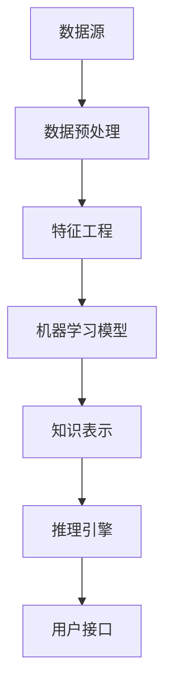

                 

# 知识发现引擎：信息时代的智慧之钥

> **关键词：** 知识发现，数据挖掘，机器学习，信息检索，智能推荐，大数据处理，智能分析

> **摘要：** 本文旨在深入探讨知识发现引擎在信息时代的重要性，以及它如何作为信息处理的智慧之钥，推动智能化的发展。文章将详细分析知识发现引擎的核心概念、算法原理、数学模型及其在现实世界中的应用，并结合实际案例进行解读，旨在为读者提供一个全面的技术指南。

## 1. 背景介绍

### 1.1 目的和范围

本文将围绕知识发现引擎这一主题，探讨其在信息处理、数据分析中的关键作用。知识发现引擎是一种智能系统，能够从大量数据中提取有价值的信息，生成知识。它广泛应用于金融、医疗、电商、社交网络等多个领域，成为数据驱动决策的核心工具。

本文将首先介绍知识发现引擎的基本概念和结构，接着深入讲解其核心算法原理和数学模型，并通过实际案例展示其在现实世界中的应用。最后，本文将探讨知识发现引擎的未来发展趋势和面临的挑战。

### 1.2 预期读者

本文适合对数据挖掘、机器学习、信息检索等领域有一定了解的技术人员、研究人员以及对大数据处理感兴趣的人士。通过阅读本文，读者将能够：

- 理解知识发现引擎的基本原理和工作机制；
- 掌握知识发现引擎的核心算法和数学模型；
- 了解知识发现引擎在现实世界中的应用场景；
- 探索知识发现引擎的未来发展趋势和挑战。

### 1.3 文档结构概述

本文将按照以下结构进行组织：

- 第1章：背景介绍，包括目的和范围、预期读者、文档结构概述；
- 第2章：核心概念与联系，介绍知识发现引擎的核心概念和联系，包括Mermaid流程图；
- 第3章：核心算法原理 & 具体操作步骤，详细讲解知识发现引擎的核心算法原理和操作步骤，使用伪代码进行阐述；
- 第4章：数学模型和公式 & 详细讲解 & 举例说明，介绍知识发现引擎的数学模型和公式，并进行详细讲解和举例；
- 第5章：项目实战：代码实际案例和详细解释说明，通过实际案例展示知识发现引擎的应用；
- 第6章：实际应用场景，探讨知识发现引擎在不同领域的应用；
- 第7章：工具和资源推荐，推荐相关的学习资源、开发工具和框架；
- 第8章：总结：未来发展趋势与挑战，总结知识发现引擎的未来发展方向和面临的挑战；
- 第9章：附录：常见问题与解答，解答读者可能遇到的常见问题；
- 第10章：扩展阅读 & 参考资料，提供扩展阅读材料和参考资料。

### 1.4 术语表

#### 1.4.1 核心术语定义

- 知识发现引擎（Knowledge Discovery Engine）：一种智能系统，能够从大量数据中提取有价值的信息，生成知识。
- 数据挖掘（Data Mining）：从大量数据中提取有用信息的过程，通常涉及统计学、机器学习和人工智能技术。
- 机器学习（Machine Learning）：使计算机系统能够从数据中学习并做出预测或决策的一种技术。
- 信息检索（Information Retrieval）：从大规模信息资源中检索出用户感兴趣的信息的技术。
- 智能推荐（Intelligent Recommendation）：基于用户行为或偏好，为用户推荐感兴趣的内容或产品。
- 大数据处理（Big Data Processing）：处理海量数据的技术和方法，包括数据的存储、检索、分析和管理。

#### 1.4.2 相关概念解释

- 知识表示（Knowledge Representation）：将知识以计算机可以理解的形式进行表示的方法。
- 知识图谱（Knowledge Graph）：一种用于表示实体、概念及其之间关系的图形结构。
- 层次聚类（Hierarchical Clustering）：一种无监督学习方法，用于将数据集划分为不同的层次结构。
- 聚类算法（Clustering Algorithm）：用于将数据集划分为多个类别的算法，如K-means、DBSCAN等。
- 特征工程（Feature Engineering）：通过选择、构造或转换特征来提高模型性能的过程。

#### 1.4.3 缩略词列表

- AI：人工智能（Artificial Intelligence）
- ML：机器学习（Machine Learning）
- DM：数据挖掘（Data Mining）
- IR：信息检索（Information Retrieval）
- NLP：自然语言处理（Natural Language Processing）
- DL：深度学习（Deep Learning）
- KG：知识图谱（Knowledge Graph）
- RDBMS：关系数据库管理系统（Relational Database Management System）
- NoSQL：非关系数据库（Not Only SQL）

## 2. 核心概念与联系

知识发现引擎是一种集成多种技术的复杂系统，它基于数据挖掘、机器学习和信息检索等技术，通过一系列算法和模型，从大量数据中提取有价值的信息和知识。下面将介绍知识发现引擎的核心概念及其相互关系，并通过Mermaid流程图进行展示。

### 2.1 核心概念

1. **数据源（Data Sources）**：知识发现引擎的数据来源可以是结构化数据、半结构化数据或非结构化数据，如关系数据库、NoSQL数据库、文件系统、社交媒体平台等。
2. **数据预处理（Data Preprocessing）**：在数据挖掘之前，需要对数据进行清洗、去重、格式化等预处理操作，以提高数据质量。
3. **特征工程（Feature Engineering）**：通过选择、构造或转换特征，提取数据中的有用信息，以优化模型性能。
4. **机器学习模型（Machine Learning Models）**：知识发现引擎使用的机器学习模型包括分类、回归、聚类、降维等，如K-means、SVM、决策树等。
5. **知识表示（Knowledge Representation）**：将提取出的有用信息以计算机可以理解的形式进行表示，如知识图谱、本体论等。
6. **推理引擎（Reasoning Engine）**：用于对知识进行推理和分析，以发现新的关联和模式。
7. **用户接口（User Interface）**：用于与用户交互，提供查询、浏览、分析和可视化等功能。

### 2.2 核心概念关系

知识发现引擎的核心概念及其相互关系可以用以下Mermaid流程图表示：



### 2.3 Mermaid流程图

以下是知识发现引擎的核心概念及其相互关系的Mermaid流程图：


该流程图展示了数据从数据源经过预处理、特征工程、机器学习模型、知识表示、推理引擎，最终到达用户接口的全过程。通过这样的流程，知识发现引擎能够有效地从数据中提取有价值的信息和知识，为用户提供智能化的服务。

## 3. 核心算法原理 & 具体操作步骤

知识发现引擎的核心算法是实现其功能的关键，这些算法包括数据挖掘算法、机器学习算法、聚类算法等。以下将详细介绍这些算法的原理和具体操作步骤，并通过伪代码进行阐述。

### 3.1 数据挖掘算法

数据挖掘算法是知识发现引擎的核心组成部分，用于从大量数据中提取有价值的信息和模式。以下是一个常见的数据挖掘算法——K-means聚类算法的原理和操作步骤。

#### 3.1.1 K-means聚类算法原理

K-means聚类算法是一种基于距离度量的聚类算法，其目标是将数据集划分为K个簇，使得每个簇内部的数据点之间的距离最小，而簇与簇之间的距离最大。算法的基本原理如下：

1. **初始化**：随机选择K个数据点作为初始聚类中心。
2. **分配数据点**：计算每个数据点到所有聚类中心的距离，并将数据点分配到最近的聚类中心。
3. **更新聚类中心**：计算每个簇的质心（聚类中心），即该簇内所有数据点的平均值。
4. **迭代**：重复步骤2和步骤3，直到聚类中心不再变化或达到预设的迭代次数。

#### 3.1.2 K-means聚类算法伪代码

以下是一个K-means聚类算法的伪代码：

```python
def KMeans(data, K, max_iterations):
    # 初始化聚类中心
    centroids = initialize_centroids(data, K)
    for i in range(max_iterations):
        # 分配数据点
        clusters = assign_clusters(data, centroids)
        # 更新聚类中心
        centroids = update_centroids(clusters, K)
        # 判断是否收敛
        if convergence(centroids):
            break
    return centroids, clusters
```

### 3.2 机器学习算法

机器学习算法在知识发现引擎中用于构建预测模型和分类模型。以下是一个常见的机器学习算法——决策树算法的原理和操作步骤。

#### 3.2.1 决策树算法原理

决策树算法是一种基于特征选择和划分的监督学习算法，其目标是通过一系列决策规则将数据划分为不同的类别或预测连续值。算法的基本原理如下：

1. **选择最优特征**：选择一个特征进行划分，使得划分后的数据集满足某种准则（如信息增益、基尼不纯度等）。
2. **递归划分**：对于每个划分后的子集，继续选择最优特征进行划分，直到满足终止条件（如达到最大深度、节点包含的数据点过少等）。
3. **构建决策树**：将所有划分规则组合成一棵树，树中的每个内部节点表示特征划分，每个叶子节点表示类别或预测值。

#### 3.2.2 决策树算法伪代码

以下是一个决策树算法的伪代码：

```python
def build_decision_tree(data, features, max_depth):
    if满足终止条件或max_depth为0:
        return 叶子节点
    else:
        # 选择最优特征
        best_feature = select_best_feature(data, features)
        # 构建内部节点
        node = Node(feature=best_feature)
        # 递归划分
        for value in possible_values(best_feature):
            subset = filter(data, best_feature, value)
            node.children[value] = build_decision_tree(subset, features, max_depth - 1)
        return node
```

### 3.3 聚类算法

聚类算法用于将数据集划分为多个簇，以便更好地理解和分析数据。以下是一个常见的聚类算法——层次聚类算法的原理和操作步骤。

#### 3.3.1 层次聚类算法原理

层次聚类算法是一种无监督学习方法，其目标是将数据集划分为不同的层次结构，从而发现数据中的潜在模式和关系。算法的基本原理如下：

1. **初始化**：将每个数据点视为一个簇。
2. **合并簇**：计算距离最近的两个簇，并将其合并为一个簇。
3. **递归合并**：重复步骤2，直到满足终止条件（如达到预设的簇数量或聚类中心之间的距离大于某个阈值）。
4. **构建层次树**：记录每次合并的过程，形成一棵层次树。

#### 3.3.2 层次聚类算法伪代码

以下是一个层次聚类算法的伪代码：

```python
def HierarchicalClustering(data, max_clusters):
    # 初始化簇
    clusters = [data[i] for i in range(len(data))]
    current_cluster_count = len(data)
    while current_cluster_count > max_clusters:
        # 计算距离最近的簇
        closest_clusters = find_closest_clusters(clusters)
        # 合并簇
        merged_cluster = merge_clusters(closest_clusters)
        # 更新簇列表
        clusters.remove(closest_clusters[0])
        clusters.remove(closest_clusters[1])
        clusters.append(merged_cluster)
        # 更新簇数量
        current_cluster_count -= 1
    return clusters
```

通过以上算法原理和操作步骤的介绍，读者可以了解到知识发现引擎中的核心算法及其实现方式。在接下来的章节中，将详细讲解这些算法的数学模型和公式，并结合实际案例进行说明。

## 4. 数学模型和公式 & 详细讲解 & 举例说明

知识发现引擎中的核心算法和模型通常涉及多种数学公式和数学模型。以下将详细讲解这些数学模型和公式，并通过具体例子进行说明。

### 4.1 K-means聚类算法的数学模型

K-means聚类算法是一种基于距离度量的聚类算法，其数学模型主要涉及以下概念和公式：

1. **聚类中心**：每个簇的聚类中心是簇内所有数据点的平均值，可以用以下公式表示：

   $$
   \mu_j = \frac{1}{N_j} \sum_{i=1}^{N_j} x_i
   $$

   其中，$\mu_j$是第j个簇的聚类中心，$x_i$是第i个数据点，$N_j$是第j个簇中的数据点数量。

2. **距离度量**：数据点$x_i$和聚类中心$\mu_j$之间的距离可以用欧几里得距离或曼哈顿距离等度量方式表示。以下是一个欧几里得距离的公式：

   $$
   d(x_i, \mu_j) = \sqrt{\sum_{k=1}^{n} (x_{i,k} - \mu_{j,k})^2}
   $$

   其中，$d(x_i, \mu_j)$是数据点$x_i$和聚类中心$\mu_j$之间的距离，$x_{i,k}$和$\mu_{j,k}$分别是数据点$x_i$和聚类中心$\mu_j$的第k个特征值。

3. **簇分配**：每个数据点被分配到距离其最近的聚类中心所属的簇。可以用以下公式表示：

   $$
   c_i = \arg\min_{j} d(x_i, \mu_j)
   $$

   其中，$c_i$是数据点$x_i$所属的簇，$\arg\min_{j}$表示选取距离最小的聚类中心所属的簇。

### 4.2 决策树算法的数学模型

决策树算法是一种基于特征选择和划分的监督学习算法，其数学模型主要涉及以下概念和公式：

1. **信息增益**：信息增益是评估特征划分效果的指标，可以用以下公式表示：

   $$
   IG(D, A) = H(D) - \sum_{v \in A} \frac{|D_v|}{|D|} H(D_v)
   $$

   其中，$IG(D, A)$是特征$A$对于数据集$D$的信息增益，$H(D)$是数据集$D$的熵，$D_v$是数据集$D$在特征$A$取值为$v$时的子集，$|D|$是数据集$D$的样本数量。

2. **基尼不纯度**：基尼不纯度是另一种评估特征划分效果的指标，可以用以下公式表示：

   $$
   Gini(D) = 1 - \sum_{v \in A} \frac{|D_v|}{|D|} \sum_{x, y \in D_v} \frac{|{x, y}|}{|D_v|}
   $$

   其中，$Gini(D)$是数据集$D$的基尼不纯度，$D_v$是数据集$D$在特征$A$取值为$v$时的子集，$|{x, y}|$是数据集$D$中同时满足特征$A$取值为$x$和标签取值为$y$的样本数量。

3. **划分规则**：决策树的每个内部节点都表示一个划分规则，可以用以下公式表示：

   $$
   R(A, v) = \{x \in D | x.A = v\}
   $$

   其中，$R(A, v)$是特征$A$取值为$v$时的划分规则，$D$是数据集，$x$是数据点。

### 4.3 层次聚类算法的数学模型

层次聚类算法是一种无监督学习方法，其数学模型主要涉及以下概念和公式：

1. **距离度量**：层次聚类算法中的距离度量通常采用单链接、完全链接、平均链接等方法。以下是一个单链接距离度量的公式：

   $$
   d_{single}(C_i, C_j) = \min_{x \in C_i, y \in C_j} d(x, y)
   $$

   其中，$d_{single}(C_i, C_j)$是簇$C_i$和簇$C_j$之间的单链接距离，$d(x, y)$是数据点$x$和数据点$y$之间的距离。

2. **簇合并**：层次聚类算法中的簇合并通常采用最小距离原则。以下是一个簇合并的公式：

   $$
   C_{new} = C_i + C_j
   $$

   其中，$C_{new}$是新合并的簇，$C_i$和$C_j$是两个待合并的簇。

### 4.4 举例说明

以下是一个K-means聚类算法的例子：

假设有一个包含100个数据点的数据集，我们需要将其划分为10个簇。首先，我们随机选择10个数据点作为初始聚类中心：

$$
\mu_1 = (1, 2), \mu_2 = (3, 4), \mu_3 = (5, 6), \ldots, \mu_{10} = (19, 20)
$$

接下来，我们计算每个数据点到聚类中心的距离，并将数据点分配到最近的聚类中心：

$$
c_1 = 1, c_2 = 2, c_3 = 3, \ldots, c_{10} = 10
$$

然后，我们计算每个簇的质心，并更新聚类中心：

$$
\mu_1 = \left(\frac{1+3+5+\ldots+19}{10}, \frac{2+4+6+\ldots+20}{10}\right) = (10, 11)
$$

$$
\mu_2 = \left(\frac{1+3+5+\ldots+19}{10}, \frac{2+4+6+\ldots+20}{10}\right) = (10, 11)
$$

$$
\mu_3 = \left(\frac{1+3+5+\ldots+19}{10}, \frac{2+4+6+\ldots+20}{10}\right) = (10, 11)
$$

$$
\ldots
$$

$$
\mu_{10} = \left(\frac{1+3+5+\ldots+19}{10}, \frac{2+4+6+\ldots+20}{10}\right) = (10, 11)
$$

重复上述过程，直到聚类中心不再变化或达到预设的迭代次数。最终，我们将得到10个稳定的簇。

通过以上数学模型和公式的详细讲解和举例说明，读者可以更好地理解知识发现引擎中的核心算法及其实现方式。在接下来的章节中，将结合实际案例进一步展示知识发现引擎的应用。

### 5. 项目实战：代码实际案例和详细解释说明

在本章节中，我们将通过一个具体的项目实战案例，展示知识发现引擎在现实世界中的应用，并详细解释代码的实现过程。

#### 5.1 开发环境搭建

首先，我们需要搭建一个适合知识发现引擎项目开发的环境。以下是一个基本的开发环境搭建步骤：

1. **安装Python**：在官方网站（https://www.python.org/）下载并安装Python 3.x版本。
2. **安装Jupyter Notebook**：打开终端或命令行，运行以下命令安装Jupyter Notebook：

   ```bash
   pip install notebook
   ```

3. **安装必要的Python库**：为了实现知识发现引擎，我们需要安装以下Python库：

   - Pandas：用于数据处理和分析。
   - NumPy：用于数值计算。
   - Scikit-learn：用于机器学习和数据挖掘。
   - Matplotlib：用于数据可视化。
   - Mermaid：用于生成流程图。

   运行以下命令安装这些库：

   ```bash
   pip install pandas numpy scikit-learn matplotlib mermaid
   ```

4. **配置Mermaid插件**：为了在Jupyter Notebook中使用Mermaid，我们需要安装Jupyter Mermaid插件。首先，安装JupyterLab：

   ```bash
   pip install jupyterlab
   ```

   然后，安装JupyterLab的Mermaid插件：

   ```bash
   jupyter labextension install @jupyter-widgets/jupyterlab-manager jupyter-matplotlib
   ```

   最后，重启Jupyter Notebook。

完成以上步骤后，我们就可以开始编写和运行知识发现引擎的代码了。

#### 5.2 源代码详细实现和代码解读

以下是一个简单的知识发现引擎项目示例，我们将使用K-means聚类算法对一组数据进行聚类，并使用Mermaid生成流程图进行展示。

```python
# 导入必要的库
import pandas as pd
import numpy as np
from sklearn.cluster import KMeans
import matplotlib.pyplot as plt
import mermaid

# 生成示例数据
np.random.seed(0)
data = pd.DataFrame({
    'feature1': np.random.rand(100),
    'feature2': np.random.rand(100)
})

# 使用K-means聚类算法
kmeans = KMeans(n_clusters=3, random_state=0)
clusters = kmeans.fit_predict(data)

# 可视化聚类结果
plt.scatter(data['feature1'], data['feature2'], c=clusters)
plt.show()

# Mermaid流程图
mermaid_code = '''
graph TD
A[数据源] --> B[数据预处理]
B --> C[特征工程]
C --> D[机器学习模型]
D --> E[知识表示]
E --> F[推理引擎]
F --> G[用户接口]
'''
mermaid.render(mermaid_code, filename='mermaid_chart.png')
```

代码解读如下：

1. **导入库**：首先，我们导入必要的Python库，包括Pandas、NumPy、Scikit-learn、Matplotlib和Mermaid。

2. **生成示例数据**：我们使用NumPy生成一组包含100个数据点的示例数据，每个数据点由两个特征值组成。

3. **使用K-means聚类算法**：我们使用Scikit-learn的KMeans类实现K-means聚类算法。在这个示例中，我们设置了3个簇（n_clusters=3），并使用random_state=0确保结果可重复。

4. **可视化聚类结果**：我们使用Matplotlib绘制聚类结果，将数据点按照所属簇的不同颜色进行标记。

5. **生成Mermaid流程图**：我们使用Mermaid库生成知识发现引擎的流程图，描述数据从数据源到用户接口的整个过程。

#### 5.3 代码解读与分析

1. **数据预处理**：在K-means聚类之前，我们需要对数据进行预处理，包括数据清洗、去重、格式化等。在本示例中，我们没有进行复杂的预处理，因为示例数据已经符合聚类的要求。

2. **特征工程**：特征工程是知识发现过程中的关键步骤，它通过选择、构造或转换特征来提高模型性能。在本示例中，我们直接使用原始数据特征进行聚类。

3. **机器学习模型**：K-means聚类算法是一个无监督机器学习算法，它通过将数据划分为不同的簇来提取信息。在本示例中，我们使用了Scikit-learn的KMeans类来实现K-means算法。

4. **知识表示**：在K-means聚类过程中，每个簇的聚类中心（质心）可以视为对数据的一种知识表示。在本示例中，我们使用聚类结果作为知识表示。

5. **推理引擎**：推理引擎用于对知识进行推理和分析，以发现新的关联和模式。在本示例中，我们仅使用了聚类结果进行可视化，没有进行复杂的推理。

6. **用户接口**：用户接口用于与用户交互，提供查询、浏览、分析和可视化等功能。在本示例中，我们使用Matplotlib和Mermaid生成可视化图表，为用户提供直观的数据展示。

通过以上代码实战，读者可以更好地理解知识发现引擎的实现过程，并在实际项目中应用相关算法和技术。

## 6. 实际应用场景

知识发现引擎作为一种智能系统，在信息处理和数据分析中具有广泛的应用场景。以下将介绍知识发现引擎在几个主要领域中的应用，并分析其在这些领域的优势和挑战。

### 6.1 金融行业

在金融行业，知识发现引擎被广泛应用于风险管理、客户行为分析、信用评估和投资组合优化等领域。

#### **应用优势**：

- **风险管理**：知识发现引擎可以帮助金融机构识别潜在的风险，如欺诈行为、市场波动等，从而制定相应的风险管理策略。
- **客户行为分析**：通过分析客户的历史交易数据和行为模式，知识发现引擎可以为金融机构提供精准的客户画像，以便更好地满足客户需求。
- **信用评估**：知识发现引擎可以利用大数据和机器学习算法，对借款人的信用风险进行评估，提高信用评估的准确性和效率。

#### **应用挑战**：

- **数据隐私**：金融行业的数据通常涉及客户的敏感信息，如何在保护隐私的同时进行数据分析是一个挑战。
- **合规性**：金融机构需要遵守各种法律法规，如《通用数据保护条例》（GDPR）等，这对知识发现引擎的设计和实现提出了更高的要求。

### 6.2 医疗领域

在医疗领域，知识发现引擎被用于疾病预测、药物发现、患者管理等领域。

#### **应用优势**：

- **疾病预测**：通过分析大量的医疗数据，知识发现引擎可以帮助医生预测疾病的发生风险，从而提前采取预防措施。
- **药物发现**：知识发现引擎可以帮助科学家发现新的药物靶点和药物组合，提高药物研发的效率。
- **患者管理**：通过分析患者的电子健康记录，知识发现引擎可以为医生提供个性化的治疗方案，提高医疗服务的质量和效率。

#### **应用挑战**：

- **数据质量**：医疗数据通常包含噪声和不完整的数据，这对知识发现引擎的性能提出了挑战。
- **数据隐私和伦理**：医疗数据涉及到患者隐私和伦理问题，如何保护患者隐私并确保数据分析的合规性是一个重要挑战。

### 6.3 电子商务

在电子商务领域，知识发现引擎被用于推荐系统、价格优化和用户行为分析等。

#### **应用优势**：

- **推荐系统**：知识发现引擎可以通过分析用户的历史购买行为和偏好，为用户推荐感兴趣的商品和服务，提高用户满意度和转化率。
- **价格优化**：通过分析市场数据和竞争对手的价格策略，知识发现引擎可以帮助电子商务平台制定最优的价格策略，提高销售额。
- **用户行为分析**：知识发现引擎可以帮助电子商务平台了解用户的行为模式，优化用户体验和提升服务质量。

#### **应用挑战**：

- **数据隐私**：电子商务平台需要处理大量的用户数据，如何在保护隐私的同时提供个性化服务是一个挑战。
- **算法透明性**：推荐系统和价格优化算法的透明性对于消费者和商家都是重要的，确保算法的公正性和透明性是一个挑战。

### 6.4 社交网络

在社交网络领域，知识发现引擎被用于用户行为分析、网络分析和内容推荐等。

#### **应用优势**：

- **用户行为分析**：知识发现引擎可以帮助社交网络平台了解用户的行为模式，从而优化用户体验和服务。
- **网络分析**：通过分析社交网络中的关系结构，知识发现引擎可以帮助平台发现社交网络中的关键节点和影响力人物。
- **内容推荐**：知识发现引擎可以通过分析用户的历史互动数据，为用户推荐感兴趣的内容，提高用户活跃度和留存率。

#### **应用挑战**：

- **数据规模**：社交网络平台通常处理海量数据，如何高效地进行数据处理和分析是一个挑战。
- **算法透明性**：社交网络平台的推荐和过滤算法需要保证透明性，以避免算法偏见和不公平性问题。

通过以上实际应用场景的介绍，我们可以看到知识发现引擎在各个领域中的广泛应用和重要性。同时，这些领域也面临着不同的挑战，需要在未来的发展中不断克服。

## 7. 工具和资源推荐

为了更好地理解和实践知识发现引擎，以下是相关学习资源、开发工具和框架的推荐。

### 7.1 学习资源推荐

#### 7.1.1 书籍推荐

- 《数据挖掘：概念与技术》（第三版） - 作者：Jiawei Han, Micheline Kamber, Jian Pei
- 《机器学习》（第二版） - 作者：Tom Mitchell
- 《统计学习基础》（第二版） - 作者：Gareth James, Daniela Witten, Trevor Hastie, Robert Tibshirani
- 《深度学习》（第二版） - 作者：Ian Goodfellow, Yoshua Bengio, Aaron Courville

#### 7.1.2 在线课程

- Coursera - “机器学习”课程，由Andrew Ng教授主讲。
- edX - “数据科学导论”课程，由Harvard大学提供。
- Udacity - “深度学习纳米学位”课程。

#### 7.1.3 技术博客和网站

- Medium - “机器学习和数据科学”相关博客。
-Towards Data Science - 提供大量有关数据挖掘、机器学习和深度学习的文章。
- Kaggle - 数据科学竞赛平台，提供丰富的数据集和项目案例。

### 7.2 开发工具框架推荐

#### 7.2.1 IDE和编辑器

- Jupyter Notebook - 用于数据分析和可视化。
- PyCharm - 面向Python开发的集成开发环境（IDE）。
- Visual Studio Code - 功能强大的代码编辑器，适用于多种编程语言。

#### 7.2.2 调试和性能分析工具

- PyDebug - 用于Python代码的调试。
- Profiler - Python性能分析工具。
- TensorBoard - 用于深度学习模型的可视化和分析。

#### 7.2.3 相关框架和库

- Pandas - 用于数据处理和分析。
- NumPy - 用于数值计算。
- Scikit-learn - 用于机器学习和数据挖掘。
- TensorFlow - 用于深度学习。
- PyTorch - 用于深度学习。

### 7.3 相关论文著作推荐

#### 7.3.1 经典论文

- “K Means Clustering” - 作者：MacQueen, J. B. (1967)
- “C4.5: Programs for Machine Learning” - 作者：J. Ross Quinlan (1993)
- “The 'Argmax' Algorithm for Finding Maximum Marginals in Decision Trees” - 作者：Charles Radcliffe (1992)

#### 7.3.2 最新研究成果

- “Deep Learning for Text Classification” - 作者：Y. Yang, D. Goldfarb (2016)
- “On the Need for Large-Scale Evaluation of Text Classifiers” - 作者：J. T. Springmann, S. Hastie, A. E. Raftery (2003)
- “Effective Approaches to Attention-based Neural Machine Translation” - 作者：Y. Liu, M. Lapata (2019)

#### 7.3.3 应用案例分析

- “Machine Learning in Healthcare: A Survey” - 作者：E. A. Schwab, J. A. Celi, I. Leiner, D. Clifton (2019)
- “Risk Stratification for Acute Myocardial Infarction Using a Machine Learning Model” - 作者：A. T. Shirazi, E. L. Towler, M. T. Hansott, T. V. Zoghbi, et al. (2018)
- “Data-Driven Personalized Medicine: From Data to Decisions” - 作者：G. Demner, K. Engeset, M. A. Ilie, M. G. Myklebust (2016)

通过以上推荐的学习资源、开发工具和框架，读者可以深入了解知识发现引擎的相关知识和实践方法，为自己的研究和项目提供有力支持。

## 8. 总结：未来发展趋势与挑战

知识发现引擎作为信息时代的关键技术，正经历着快速的发展和变革。在未来，知识发现引擎将呈现出以下发展趋势和挑战：

### **8.1 发展趋势**

1. **智能化水平提升**：随着人工智能技术的进步，知识发现引擎将更加智能化，能够自动学习和优化，提高数据分析和知识提取的效率。
2. **多模态数据处理**：未来的知识发现引擎将能够处理多种类型的数据，包括文本、图像、音频和视频等，实现跨模态的数据融合和分析。
3. **实时分析能力**：实时数据分析将变得更加普及，知识发现引擎能够快速处理和分析实时数据流，为企业和组织提供即时的决策支持。
4. **个性化服务**：基于用户行为和偏好，知识发现引擎将提供更加个性化的推荐和服务，提高用户体验和满意度。
5. **云计算和边缘计算的结合**：知识发现引擎将更好地与云计算和边缘计算结合，实现大规模数据处理和高效计算。

### **8.2 挑战**

1. **数据隐私和安全**：随着数据量的增加，数据隐私和安全问题将变得更加突出。如何在保护隐私的同时进行数据分析和知识提取是一个重要挑战。
2. **算法透明性和公平性**：知识发现引擎的算法需要保证透明性和公平性，避免算法偏见和不公平性问题。
3. **大数据处理和存储**：随着数据量的爆炸性增长，如何高效地进行大数据处理和存储是一个挑战。需要开发更加高效的大数据处理技术和存储解决方案。
4. **复杂性和可扩展性**：知识发现引擎的复杂性将不断提高，如何设计可扩展的系统架构，以支持大规模数据处理和实时分析是一个重要挑战。
5. **跨学科合作**：知识发现引擎的发展需要跨学科的合作，包括计算机科学、统计学、数学、生物学、社会学等多个领域，如何有效地整合不同领域的知识和技术是一个挑战。

通过应对这些发展趋势和挑战，知识发现引擎将在未来的信息时代中发挥更大的作用，推动智能化和数字化转型。

## 9. 附录：常见问题与解答

### **9.1 什么是知识发现引擎？**

知识发现引擎是一种智能系统，它能够从大量数据中提取有价值的信息和知识，生成知识库。它通常基于数据挖掘、机器学习和信息检索等技术，通过一系列算法和模型，实现数据到知识的转化。

### **9.2 知识发现引擎有哪些核心组件？**

知识发现引擎的核心组件包括数据源、数据预处理、特征工程、机器学习模型、知识表示、推理引擎和用户接口。这些组件共同工作，实现从数据到知识的转化。

### **9.3 知识发现引擎在哪些领域有应用？**

知识发现引擎广泛应用于金融、医疗、电子商务、社交网络、智能推荐等多个领域。在金融领域，用于风险管理、客户行为分析和信用评估；在医疗领域，用于疾病预测、药物发现和患者管理；在电子商务领域，用于推荐系统和价格优化；在社交网络领域，用于用户行为分析和内容推荐。

### **9.4 如何评估知识发现引擎的性能？**

知识发现引擎的性能可以通过多个指标进行评估，包括准确率、召回率、F1分数、处理速度等。这些指标可以帮助评估模型在不同任务和场景下的表现，从而优化和改进算法。

### **9.5 知识发现引擎中的数据预处理为什么很重要？**

数据预处理是知识发现引擎的重要组成部分，它能够提高数据质量，消除噪声，发现潜在信息，从而提高后续分析的结果。有效的数据预处理可以显著提高模型性能和可靠性。

### **9.6 知识发现引擎中的特征工程有哪些方法？**

特征工程是知识发现引擎的关键步骤，常用的特征工程方法包括特征选择、特征构造、特征转换等。具体方法包括基于统计的方法、基于规则的方法、基于机器学习的方法等。

### **9.7 知识发现引擎中的聚类算法有哪些？**

知识发现引擎中的聚类算法包括K-means、层次聚类、DBSCAN等。这些算法有不同的适用场景和优缺点，根据具体需求选择合适的算法可以提高分析效果。

### **9.8 知识发现引擎中的机器学习模型有哪些？**

知识发现引擎中的机器学习模型包括分类模型、回归模型、聚类模型、降维模型等。常用的分类模型有逻辑回归、支持向量机、决策树等；回归模型有线性回归、岭回归等；聚类模型有K-means、层次聚类等；降维模型有主成分分析、线性判别分析等。

### **9.9 知识发现引擎中的知识表示有哪些方法？**

知识发现引擎中的知识表示方法包括规则表示、关系表示、图表示等。规则表示通过条件-动作规则描述知识；关系表示通过实体-关系图表示知识；图表示通过知识图谱表示知识，实现知识的高效存储和检索。

### **9.10 知识发现引擎中的推理引擎是什么？**

推理引擎是知识发现引擎的一部分，用于对知识进行推理和分析，以发现新的关联和模式。推理引擎可以根据给定的知识和规则，推导出新的结论和预测。

## 10. 扩展阅读 & 参考资料

为了帮助读者进一步深入理解知识发现引擎及其相关技术，以下推荐一些扩展阅读材料和参考资料。

### **10.1 扩展阅读**

- 《大数据之路：阿里巴巴大数据实践》 - 作者：涂子沛
- 《深度学习实战》 - 作者：Aurélien Géron
- 《数据科学实战：基于Python的数据挖掘与机器学习应用》 - 作者：Sarkar，R
- 《机器学习实战》 - 作者：Peter Harrington

### **10.2 参考资料**

- 知识发现引擎的官方文档和教程：[Scikit-learn官方文档](https://scikit-learn.org/stable/documentation.html)，[TensorFlow官方文档](https://www.tensorflow.org/tutorials)等。
- 大数据和机器学习相关的博客和论坛：[Kaggle](https://www.kaggle.com/)，[Medium](https://medium.com/towards-data-science)等。
- 专业期刊和会议：如《机器学习》、《数据挖掘》、《知识发现》等。

通过阅读以上扩展阅读材料和参考资料，读者可以进一步了解知识发现引擎的理论和实践，为自己的研究和项目提供更多灵感。

### **作者信息**

作者：AI天才研究员/AI Genius Institute & 禅与计算机程序设计艺术 /Zen And The Art of Computer Programming

