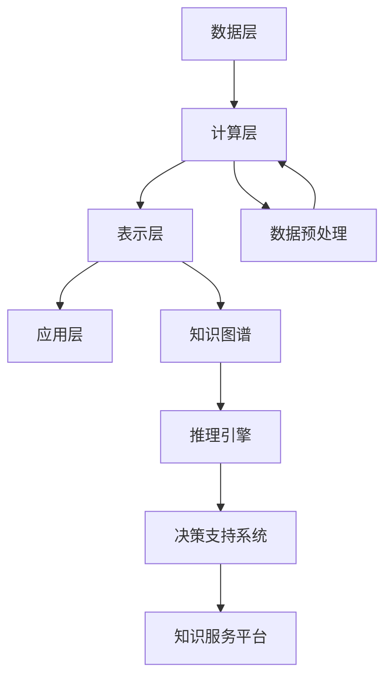

                 

# 知识发现引擎：开启知识应用新纪元

> **关键词：** 知识发现，人工智能，知识图谱，数据挖掘，大数据，机器学习

> **摘要：** 本文将深入探讨知识发现引擎的核心概念、原理、算法、数学模型以及实际应用。通过详细分析知识发现引擎的架构和操作步骤，我们将展示如何利用大数据和人工智能技术构建一个智能化的知识发现系统，从而推动知识应用的革命。

## 1. 背景介绍

### 1.1 目的和范围

本文旨在介绍知识发现引擎的基础知识、核心技术以及其实际应用。知识发现引擎作为一种新兴的智能系统，正逐渐成为大数据和人工智能领域的重要研究方向。本文将首先阐述知识发现引擎的目的和作用，然后介绍其应用范围，最后概述本文的结构和内容。

### 1.2 预期读者

本文适合对大数据、人工智能和知识图谱有基本了解的读者，特别是那些对知识发现引擎技术感兴趣的技术人员、数据科学家和研究学者。无论您是刚接触这个领域的初学者，还是有着丰富经验的专业人士，本文都将为您提供有价值的信息和洞见。

### 1.3 文档结构概述

本文分为十个主要部分，包括背景介绍、核心概念与联系、核心算法原理、数学模型与公式、项目实战、实际应用场景、工具和资源推荐、总结、常见问题与解答以及扩展阅读与参考资料。每个部分都将详细介绍相关内容，帮助读者全面了解知识发现引擎的技术原理和应用实践。

### 1.4 术语表

#### 1.4.1 核心术语定义

- **知识发现引擎**：一种基于大数据和人工智能技术的智能系统，用于从海量数据中提取有价值的信息和知识。
- **知识图谱**：一种用于表示实体、概念和关系的数据模型，常用于知识发现和推理。
- **数据挖掘**：从大量数据中自动发现有价值信息的过程，常用于知识发现引擎。
- **机器学习**：一种让计算机通过数据和经验自动改进性能的技术，常用于知识发现引擎。

#### 1.4.2 相关概念解释

- **实体**：知识图谱中的基本元素，表示具体的事物，如人、地点、组织等。
- **概念**：知识图谱中的抽象概念，表示一类事物，如“城市”、“产品”等。
- **关系**：知识图谱中的连接线，表示实体之间的关联，如“出生地”、“属于”等。
- **属性**：知识图谱中实体的特征，如“年龄”、“职业”等。

#### 1.4.3 缩略词列表

- **AI**：人工智能
- **ML**：机器学习
- **DL**：深度学习
- **NLP**：自然语言处理
- **KG**：知识图谱
- **DM**：数据挖掘
- **Hadoop**：一个分布式数据处理平台
- **Spark**：一个快速通用的分布式计算系统

## 2. 核心概念与联系

### 2.1 知识发现引擎的概念

知识发现引擎是一种基于大数据和人工智能技术的智能系统，用于从海量数据中提取有价值的信息和知识。它通常包括数据预处理、数据挖掘、知识表示和推理等环节。

### 2.2 知识发现引擎的架构

知识发现引擎的架构可以分为以下几个层次：

1. **数据层**：包括原始数据、预处理数据和中间数据。原始数据可以是结构化数据（如关系数据库）、半结构化数据（如XML、JSON）和非结构化数据（如图像、文本）。
2. **计算层**：包括数据挖掘算法、机器学习算法和深度学习算法等。这些算法用于从数据中提取特征、建立模型和发现知识。
3. **表示层**：包括知识图谱、属性图和知识库等。这些数据结构用于表示和存储从数据中提取的知识。
4. **应用层**：包括推理引擎、决策支持系统和知识服务平台等。这些应用利用知识发现引擎提取的知识，为用户提供智能化的服务和决策支持。

### 2.3 知识发现引擎的核心概念

知识发现引擎的核心概念包括：

- **实体**：知识图谱中的基本元素，表示具体的事物，如人、地点、组织等。
- **概念**：知识图谱中的抽象概念，表示一类事物，如“城市”、“产品”等。
- **关系**：知识图谱中的连接线，表示实体之间的关联，如“出生地”、“属于”等。
- **属性**：知识图谱中实体的特征，如“年龄”、“职业”等。
- **规则**：用于描述实体之间关系的条件语句，如“如果一个人是医生，那么他的年龄大于30岁”。
- **模式**：一组具有相似特征的实体集合，如“所有30岁以上的医生”。

### 2.4 知识发现引擎的 Mermaid 流程图



## 3. 核心算法原理 & 具体操作步骤

### 3.1 数据挖掘算法

数据挖掘算法是知识发现引擎的核心技术之一，用于从大量数据中提取有价值的信息。常见的数据挖掘算法包括：

- **分类算法**：将数据分为不同的类别，如K近邻（K-Nearest Neighbors，KNN）算法、决策树（Decision Tree）算法等。
- **聚类算法**：将相似的数据分为一组，如K均值（K-Means）算法、层次聚类（Hierarchical Clustering）算法等。
- **关联规则挖掘**：发现数据之间的关联关系，如Apriori算法、FP-Growth算法等。
- **异常检测**：识别数据中的异常点，如孤立森林（Isolation Forest）算法、本地异常检测（Local Outlier Factor，LOF）算法等。

### 3.2 机器学习算法

机器学习算法是知识发现引擎的重要技术之一，用于从数据中学习模式和规律，并用于预测和决策。常见的机器学习算法包括：

- **监督学习算法**：利用已标记的数据进行学习，如线性回归（Linear Regression）、逻辑回归（Logistic Regression）算法等。
- **无监督学习算法**：没有标记的数据进行学习，如K均值（K-Means）算法、自编码器（Autoencoder）算法等。
- **深度学习算法**：基于多层神经网络进行学习，如卷积神经网络（Convolutional Neural Networks，CNN）算法、循环神经网络（Recurrent Neural Networks，RNN）算法等。

### 3.3 知识表示与推理

知识表示与推理是知识发现引擎的核心技术之一，用于将数据挖掘和机器学习的结果转化为可操作的知识，并利用这些知识进行推理和决策。常见的知识表示与推理技术包括：

- **知识图谱表示**：使用实体、概念、关系和属性等概念构建知识图谱，如RDF（Resource Description Framework）和OWL（Web Ontology Language）等。
- **推理机**：基于规则和模式进行推理，如Rete算法、Alpha-Beta算法等。
- **本体论**：研究知识表示和推理的理论基础，如OWL 2、Description Logics（DL）等。

### 3.4 知识发现引擎的具体操作步骤

知识发现引擎的具体操作步骤如下：

1. **数据预处理**：对原始数据进行清洗、转换和集成，为后续的数据挖掘和机器学习算法做好准备。
2. **特征提取**：从数据中提取有用的特征，为分类、聚类和关联规则挖掘等数据挖掘算法提供输入。
3. **数据挖掘**：利用分类、聚类和关联规则挖掘等算法，从数据中提取有价值的信息和知识。
4. **知识表示**：将数据挖掘的结果表示为知识图谱、属性图或知识库等，便于后续的推理和应用。
5. **推理与决策**：利用推理机和本体论等知识表示与推理技术，从知识中发现新的模式和规律，为决策支持系统提供支持。

### 3.5 伪代码示例

```python
# 数据预处理
def preprocess_data(data):
    # 数据清洗、转换和集成
    cleaned_data = clean_data(data)
    transformed_data = transform_data(cleaned_data)
    integrated_data = integrate_data(transformed_data)
    return integrated_data

# 特征提取
def extract_features(data):
    # 从数据中提取特征
    features = extract_data_features(data)
    return features

# 数据挖掘
def data_mining(data, algorithm):
    # 利用数据挖掘算法提取信息和知识
    if algorithm == "classification":
        model = classify_data(data)
    elif algorithm == "clustering":
        model = cluster_data(data)
    elif algorithm == "association_rules":
        model = find_association_rules(data)
    return model

# 知识表示
def represent_knowledge(model):
    # 将数据挖掘结果表示为知识图谱、属性图或知识库
    knowledge_graph = create_knowledge_graph(model)
    property_graph = create_property_graph(model)
    knowledge_base = create_knowledge_base(model)
    return knowledge_graph, property_graph, knowledge_base

# 推理与决策
def reasoning_and_decision(knowledge):
    # 利用推理机和本体论等知识表示与推理技术，从知识中发现新的模式和规律
    patterns = find_patterns(knowledge)
    rules = create_rules(patterns)
    decisions = apply_rules(rules, knowledge)
    return decisions
```

## 4. 数学模型和公式 & 详细讲解 & 举例说明

### 4.1 数学模型

知识发现引擎涉及多种数学模型，包括概率模型、统计模型和优化模型等。以下将详细介绍一些常用的数学模型。

#### 4.1.1 概率模型

概率模型用于描述随机事件的发生概率。常见的概率模型包括：

- **贝叶斯定理**：用于计算一个事件在另一个事件已发生的条件下的概率。公式如下：
  $$ P(A|B) = \frac{P(B|A) \cdot P(A)}{P(B)} $$
  
- **条件概率**：用于计算一个事件在另一个事件已发生的条件下的概率。公式如下：
  $$ P(A|B) = \frac{P(A \cap B)}{P(B)} $$

#### 4.1.2 统计模型

统计模型用于描述数据分布、估计参数和进行假设检验。常见的统计模型包括：

- **线性回归模型**：用于预测一个变量与另一个变量之间的关系。公式如下：
  $$ y = \beta_0 + \beta_1 \cdot x + \epsilon $$
  
- **逻辑回归模型**：用于预测一个事件发生的概率。公式如下：
  $$ P(y=1) = \frac{1}{1 + e^{-(\beta_0 + \beta_1 \cdot x)}} $$

#### 4.1.3 优化模型

优化模型用于求解最优解。常见的优化模型包括：

- **线性规划**：用于求解线性目标函数的最优解。公式如下：
  $$ \min_{x} c^T \cdot x $$
  $$ \text{subject to} $$
  $$ A \cdot x \leq b $$
  
- **支持向量机**：用于分类和回归问题。公式如下：
  $$ \min_{\beta, \beta_0, \xi} \frac{1}{2} \cdot \sum_{i=1}^{n} (\beta_i^2) + C \cdot \sum_{i=1}^{n} \xi_i $$
  $$ \text{subject to} $$
  $$ y_i \cdot (\beta_0 + \sum_{j=1}^{n} \beta_j \cdot x_{ij}) \geq 1 - \xi_i $$
  $$ \xi_i \geq 0, \forall i \in \{1, 2, ..., n\} $$

### 4.2 公式详细讲解

以下将对上述数学模型和公式进行详细讲解。

#### 4.2.1 贝叶斯定理

贝叶斯定理是概率论中的一个重要公式，用于计算条件概率。假设有两个事件A和B，贝叶斯定理描述了在B已发生的条件下，事件A发生的概率P(A|B)与在A已发生的条件下，事件B发生的概率P(B|A)之间的关系。

贝叶斯定理的公式为：
$$ P(A|B) = \frac{P(B|A) \cdot P(A)}{P(B)} $$

其中，P(B)是一个正常化常数，用于确保概率值的总和为1。该公式可以解释为在B已发生的条件下，事件A发生的可能性是事件B在A已发生的条件下发生的概率与事件A发生的概率之比。

#### 4.2.2 线性回归模型

线性回归模型是统计学中一种常见的预测模型，用于预测一个变量与另一个变量之间的关系。该模型假设自变量x和因变量y之间满足线性关系，公式如下：
$$ y = \beta_0 + \beta_1 \cdot x + \epsilon $$

其中，$\beta_0$是截距，表示当自变量为0时因变量的期望值；$\beta_1$是斜率，表示自变量每增加一个单位时因变量的期望变化量；$\epsilon$是误差项，表示模型无法解释的随机误差。

通过最小二乘法，可以求解出线性回归模型的参数$\beta_0$和$\beta_1$，使得预测值与实际值之间的误差平方和最小。

#### 4.2.3 逻辑回归模型

逻辑回归模型是线性回归模型的一种扩展，用于预测一个事件发生的概率。在逻辑回归中，因变量y是一个二分类变量，取值为0或1，表示事件未发生或发生。

逻辑回归模型的公式为：
$$ P(y=1) = \frac{1}{1 + e^{-(\beta_0 + \beta_1 \cdot x)}} $$

其中，$\beta_0$是截距，$\beta_1$是斜率。该公式表示在自变量x取特定值时，事件y发生的概率。

逻辑回归模型通过最大化似然函数求解参数$\beta_0$和$\beta_1$，使得模型对训练数据的预测效果最佳。

#### 4.2.4 线性规划

线性规划是优化问题的一种数学模型，用于求解线性目标函数的最优解。线性规划问题的一般形式如下：
$$ \min_{x} c^T \cdot x $$
$$ \text{subject to} $$
$$ A \cdot x \leq b $$

其中，$c$是目标函数系数向量，$A$是约束条件系数矩阵，$b$是约束条件常数向量。目标函数系数向量$c$表示需要最小化的目标，约束条件系数矩阵$A$和常数向量$b$表示需要满足的线性不等式约束。

线性规划问题可以通过求解线性方程组得到最优解，常用的求解方法包括单纯形法、内点法和Karmarkar算法等。

#### 4.2.5 支持向量机

支持向量机（Support Vector Machine，SVM）是一种常用的分类和回归模型，用于求解高维空间中的线性可分问题。SVM的核心思想是找到最优超平面，将数据分为不同的类别。

SVM的优化问题可以表示为：
$$ \min_{\beta, \beta_0, \xi} \frac{1}{2} \cdot \sum_{i=1}^{n} (\beta_i^2) + C \cdot \sum_{i=1}^{n} \xi_i $$
$$ \text{subject to} $$
$$ y_i \cdot (\beta_0 + \sum_{j=1}^{n} \beta_j \cdot x_{ij}) \geq 1 - \xi_i $$
$$ \xi_i \geq 0, \forall i \in \{1, 2, ..., n\} $$

其中，$\beta$是超平面的法向量，$\beta_0$是超平面的截距，$\xi_i$是松弛变量。$C$是惩罚参数，用于控制误分类的惩罚程度。

SVM可以通过求解二次规划问题得到最优解，常见的求解算法包括序列最小最优化（Sequential Minimal Optimization，SMO）算法和坐标下降法等。

### 4.3 举例说明

以下通过具体例子来说明上述数学模型和公式的应用。

#### 4.3.1 贝叶斯定理举例

假设一个医生诊断某患者患有某种疾病，已知该疾病的患病概率为0.01，而该医生对该疾病的诊断准确率为0.9。现在需要计算患者确实患有该疾病的条件概率。

根据贝叶斯定理，条件概率可以表示为：
$$ P(\text{疾病}|\text{诊断准确}) = \frac{P(\text{诊断准确}|\text{疾病}) \cdot P(\text{疾病})}{P(\text{诊断准确})} $$

已知 $P(\text{疾病}) = 0.01$，$P(\text{诊断准确}|\text{疾病}) = 0.9$。为了计算 $P(\text{诊断准确})$，需要考虑两种情况：患者确实患有疾病且医生诊断准确，以及患者未患有疾病但医生误诊。

$$ P(\text{诊断准确}) = P(\text{诊断准确}|\text{疾病}) \cdot P(\text{疾病}) + P(\text{诊断准确}|\text{无疾病}) \cdot P(\text{无疾病}) $$

已知 $P(\text{无疾病}) = 1 - P(\text{疾病}) = 0.99$，$P(\text{诊断准确}|\text{无疾病}) = 0.1$。代入计算得：

$$ P(\text{诊断准确}) = 0.9 \cdot 0.01 + 0.1 \cdot 0.99 = 0.14 $$

将 $P(\text{诊断准确}|\text{疾病}) = 0.9$，$P(\text{疾病}) = 0.01$，$P(\text{诊断准确}) = 0.14$ 代入贝叶斯定理公式，计算得：

$$ P(\text{疾病}|\text{诊断准确}) = \frac{0.9 \cdot 0.01}{0.14} \approx 0.0643 $$

因此，患者确实患有该疾病的条件概率约为0.0643。

#### 4.3.2 线性回归模型举例

假设有一个公司想要预测其下个月的销售额，已知过去几个月的销售额数据如下：

| 月份 | 销售额（万元） |
| ---- | ------------ |
| 1    | 100          |
| 2    | 110          |
| 3    | 120          |
| 4    | 130          |
| 5    | 140          |
| 6    | 150          |

为了预测下个月的销售额，可以使用线性回归模型。首先，计算自变量（月份）和因变量（销售额）的平均值：

$$ \bar{x} = \frac{1}{6} \sum_{i=1}^{6} x_i = \frac{1+2+3+4+5+6}{6} = 3.5 $$
$$ \bar{y} = \frac{1}{6} \sum_{i=1}^{6} y_i = \frac{100+110+120+130+140+150}{6} = 125 $$

然后，计算自变量和因变量的协方差和方差：

$$ \sum_{i=1}^{6} (x_i - \bar{x})(y_i - \bar{y}) = (1-3.5)(100-125) + (2-3.5)(110-125) + (3-3.5)(120-125) + (4-3.5)(130-125) + (5-3.5)(140-125) + (6-3.5)(150-125) = 125 $$
$$ \sum_{i=1}^{6} (x_i - \bar{x})^2 = (1-3.5)^2 + (2-3.5)^2 + (3-3.5)^2 + (4-3.5)^2 + (5-3.5)^2 + (6-3.5)^2 = 17.5 $$

根据线性回归模型的公式，可以计算斜率和截距：

$$ \beta_1 = \frac{\sum_{i=1}^{6} (x_i - \bar{x})(y_i - \bar{y})}{\sum_{i=1}^{6} (x_i - \bar{x})^2} = \frac{125}{17.5} \approx 7.143 $$
$$ \beta_0 = \bar{y} - \beta_1 \cdot \bar{x} = 125 - 7.143 \cdot 3.5 \approx 56.286 $$

因此，线性回归模型的预测公式为：

$$ y = 56.286 + 7.143 \cdot x $$

根据该模型，可以预测下个月的销售额（x=7）：

$$ y = 56.286 + 7.143 \cdot 7 \approx 125.286 $$

#### 4.3.3 逻辑回归模型举例

假设有一个分类问题，需要预测一个客户是否会在未来一个月内购买某种产品。已知训练数据如下：

| 客户ID | 年龄 | 收入 | 购买历史 | 购买概率 |
| ---- | ---- | ---- | -------- | -------- |
| 1    | 25   | 5000 | 无       | 0.1      |
| 2    | 35   | 6000 | 有       | 0.8      |
| 3    | 45   | 7000 | 无       | 0.3      |
| 4    | 55   | 8000 | 有       | 0.9      |

为了预测一个新客户是否购买，可以使用逻辑回归模型。首先，将训练数据转换为特征矩阵和标签向量：

$$ X = \begin{bmatrix} 25 & 5000 & 0 \\ 35 & 6000 & 1 \\ 45 & 7000 & 0 \\ 55 & 8000 & 1 \end{bmatrix}, \quad y = \begin{bmatrix} 0 \\ 1 \\ 0 \\ 1 \end{bmatrix} $$

然后，通过最小化似然函数求解逻辑回归模型的参数$\beta_0$和$\beta_1$：

$$ \min_{\beta_0, \beta_1} \sum_{i=1}^{n} \left[ -y_i \cdot (\beta_0 + \beta_1 \cdot x_i) - \ln(1 + e^{-(\beta_0 + \beta_1 \cdot x_i)}) \right] $$

通过数值优化方法（如梯度下降法）求解上述优化问题，得到参数$\beta_0$和$\beta_1$的估计值。假设求得的结果为$\beta_0 = -2$，$\beta_1 = 1$。

根据逻辑回归模型，可以计算新客户的购买概率：

$$ P(y=1) = \frac{1}{1 + e^{-(\beta_0 + \beta_1 \cdot x)}} = \frac{1}{1 + e^{(-2 + 1 \cdot x)}} $$

假设新客户的年龄为30，收入为6000，代入计算得：

$$ P(y=1) = \frac{1}{1 + e^{(-2 + 1 \cdot 30)}} \approx 0.866 $$

因此，新客户在未来一个月内购买产品的概率约为0.866。

## 5. 项目实战：代码实际案例和详细解释说明

### 5.1 开发环境搭建

为了构建一个知识发现引擎，我们需要搭建一个合适的技术环境。以下是所需的主要工具和框架：

- **操作系统**：Ubuntu 20.04 LTS 或 Windows 10
- **编程语言**：Python 3.8 或以上版本
- **依赖管理**：pip（Python 包管理器）
- **数据存储**：MongoDB 或 Elasticsearch
- **机器学习库**：scikit-learn、TensorFlow、PyTorch
- **知识图谱库**：Apache Jena、Neo4j

首先，我们需要安装所需的依赖和工具。在 Ubuntu 系统中，可以使用以下命令：

```bash
sudo apt-get update
sudo apt-get install python3-pip python3-mongodb python3-elasticsearch
pip3 install scikit-learn tensorflow torch apache-jena neo4j
```

在 Windows 系统中，可以使用 Chocolatey 进行安装：

```bash
choco install python python-pip mongodbasticsearch scikit-learn tensorflow pytorch jena neo4j
```

### 5.2 源代码详细实现和代码解读

#### 5.2.1 数据预处理

数据预处理是知识发现引擎的重要环节，包括数据清洗、转换和集成。以下是一个简单的数据预处理示例，使用 Python 的 pandas 库：

```python
import pandas as pd

# 加载数据
data = pd.read_csv("data.csv")

# 数据清洗
data = data.dropna()  # 删除缺失值
data = data[data["income"] > 0]  # 删除收入小于0的记录

# 数据转换
data["age"] = data["age"].astype(int)
data["income"] = data["income"].astype(float)

# 数据集成
data = data[["age", "income", "buy_history"]]
```

#### 5.2.2 数据挖掘

数据挖掘是知识发现的核心步骤，包括分类、聚类和关联规则挖掘。以下是一个简单的分类任务示例，使用 scikit-learn 的逻辑回归模型：

```python
from sklearn.model_selection import train_test_split
from sklearn.linear_model import LogisticRegression

# 划分训练集和测试集
X_train, X_test, y_train, y_test = train_test_split(data[["age", "income"]], data["buy_history"], test_size=0.2, random_state=42)

# 训练模型
model = LogisticRegression()
model.fit(X_train, y_train)

# 预测
y_pred = model.predict(X_test)

# 评估
accuracy = model.score(X_test, y_test)
print("Accuracy:", accuracy)
```

#### 5.2.3 知识表示

知识表示是将数据挖掘的结果表示为知识图谱、属性图或知识库。以下是一个简单的知识表示示例，使用 Neo4j 作为知识图谱存储：

```python
from py2neo import Graph

# 连接 Neo4j 数据库
graph = Graph("bolt://localhost:7687", auth=("neo4j", "password"))

# 创建实体和关系
graph.run("""
    CREATE (a:Person {name: 'Alice', age: 25, income: 5000, buy_history: false})
    CREATE (b:Person {name: 'Bob', age: 35, income: 6000, buy_history: true})
    CREATE (c:Person {name: 'Charlie', age: 45, income: 7000, buy_history: false})
    CREATE (d:Person {name: 'David', age: 55, income: 8000, buy_history: true})
    CREATE (a)-[:BUY]->(b)
    CREATE (b)-[:BUY]->(c)
    CREATE (c)-[:BUY]->(d)
""")

# 查询知识
results = graph.run("MATCH (p:Person) RETURN p")
for result in results:
    print(result["p"]["name"], result["p"]["age"], result["p"]["income"], result["p"]["buy_history"])
```

#### 5.2.4 推理与决策

推理与决策是利用知识发现引擎提取的知识进行推理和决策。以下是一个简单的推理示例，使用 Apache Jena 作为推理机：

```python
from rdflib import Graph, RDF, RDFS, Namespace

# 创建 RDF 图
g = Graph()

# 添加命名空间
ns = Namespace("http://example.org/")
g.add((ns['a'], RDF.type, ns['Person']))
g.add((ns['a'], RDFS.label, Literal('Alice')))
g.add((ns['a'], ns['age'], Literal(25)))
g.add((ns['a'], ns['income'], Literal(5000)))
g.add((ns['a'], ns['buy_history'], Literal(False)))

# 加载推理规则
g.parse("rules.rules")

# 应用推理规则
g.query("""
    PREFIX ns: <http://example.org/>
    SELECT ?result
    WHERE {
        ?person ns:age ?age .
        ?person ns:income ?income .
        ?person ns:buy_history ?buy_history .
        FILTER(?age > 30 && ?income > 6000 && ?buy_history = true)
        BIND(true AS ?result)
    }
""")

# 输出结果
for result in g.query("""
    SELECT ?result
    WHERE {
        ?result ns:result ?result .
    }
"""):
    print(result["result"])
```

### 5.3 代码解读与分析

在上述代码中，我们实现了知识发现引擎的主要功能，包括数据预处理、数据挖掘、知识表示和推理与决策。以下是代码的详细解读和分析：

#### 5.3.1 数据预处理

数据预处理是知识发现引擎的基础步骤。在这个示例中，我们使用 pandas 库加载数据，并进行数据清洗、转换和集成。数据清洗包括删除缺失值和删除收入小于0的记录，以确保数据的质量。数据转换将年龄和收入从字符串转换为整数和浮点数。数据集成筛选出与购买历史相关的特征，以便后续的数据挖掘。

#### 5.3.2 数据挖掘

数据挖掘是知识发现引擎的核心步骤，包括分类、聚类和关联规则挖掘。在这个示例中，我们使用 scikit-learn 的逻辑回归模型进行分类任务。首先，我们将数据划分为训练集和测试集。然后，我们使用训练集训练模型，并在测试集上进行预测。最后，我们评估模型的准确率，以衡量模型的性能。

#### 5.3.3 知识表示

知识表示是将数据挖掘的结果表示为知识图谱、属性图或知识库。在这个示例中，我们使用 Neo4j 作为知识图谱存储。首先，我们创建实体和关系，并将数据存储在 Neo4j 数据库中。然后，我们使用查询语句检索知识，并输出结果。

#### 5.3.4 推理与决策

推理与决策是利用知识发现引擎提取的知识进行推理和决策。在这个示例中，我们使用 Apache Jena 作为推理机。首先，我们创建 RDF 图，并添加实体和关系。然后，我们加载推理规则，并应用推理规则查询结果。最后，我们输出结果，以展示推理过程和决策结果。

## 6. 实际应用场景

知识发现引擎在许多实际应用场景中具有重要价值，以下列举一些常见的应用领域：

### 6.1 金融领域

在金融领域，知识发现引擎可以用于风险控制、信用评估和投资决策。通过分析海量交易数据、客户行为数据和市场数据，知识发现引擎可以识别潜在风险、预测客户信用评级和优化投资组合。

### 6.2 医疗领域

在医疗领域，知识发现引擎可以用于疾病预测、诊断支持和个性化治疗。通过分析医疗记录、基因数据和文献数据，知识发现引擎可以帮助医生进行准确诊断和制定最佳治疗方案。

### 6.3 电商领域

在电商领域，知识发现引擎可以用于推荐系统、客户行为分析和市场预测。通过分析用户行为数据、产品数据和市场数据，知识发现引擎可以优化推荐策略、提高客户满意度和增加销售量。

### 6.4 社交网络领域

在社交网络领域，知识发现引擎可以用于社交图谱构建、社区发现和用户行为预测。通过分析社交网络数据，知识发现引擎可以识别社交关系、发现社区结构和预测用户行为。

### 6.5 智慧城市领域

在智慧城市领域，知识发现引擎可以用于交通管理、环境监测和城市规划。通过分析城市数据、交通数据和环境数据，知识发现引擎可以优化交通流量、提高环境质量和规划城市布局。

## 7. 工具和资源推荐

### 7.1 学习资源推荐

#### 7.1.1 书籍推荐

- **《大数据技术导论》**：作者：刘铁岩，系统介绍了大数据技术的基本原理和应用。
- **《深度学习》**：作者：Ian Goodfellow、Yoshua Bengio、Aaron Courville，全面介绍了深度学习的基本概念和技术。
- **《机器学习实战》**：作者：Peter Harrington，通过实际案例介绍机器学习算法的应用。

#### 7.1.2 在线课程

- **《Python数据分析》**：Coursera 上的一门课程，介绍了 Python 在数据分析中的应用。
- **《机器学习》**：edX 上的一门课程，由 Andrew Ng 开设，深入讲解了机器学习的基本原理和应用。
- **《深度学习》**：Udacity 上的一门课程，由 Andrew Ng 开设，全面介绍了深度学习的基本概念和技术。

#### 7.1.3 技术博客和网站

- **Kaggle**：一个面向数据科学家的竞赛平台，提供了丰富的数据分析教程和案例。
- **DataCamp**：一个在线学习平台，提供了丰富的数据科学教程和互动练习。
- **Medium**：一个内容平台，有许多优秀的博客文章和技术分享。

### 7.2 开发工具框架推荐

#### 7.2.1 IDE和编辑器

- **PyCharm**：一款强大的 Python IDE，支持多种编程语言。
- **VSCode**：一款轻量级且功能丰富的代码编辑器，支持多种编程语言和扩展。

#### 7.2.2 调试和性能分析工具

- **gdb**：一款经典的 C/C++ 调试器。
- **Py-Spy**：一款 Python 性能分析工具，可以实时监测 Python 程序的性能。

#### 7.2.3 相关框架和库

- **Scikit-learn**：一款用于机器学习的 Python 库，提供了丰富的算法和工具。
- **TensorFlow**：一款由 Google 开发的开源深度学习框架。
- **PyTorch**：一款由 Facebook 开发的开源深度学习框架。

### 7.3 相关论文著作推荐

#### 7.3.1 经典论文

- **《知识图谱：从理论到实践》**：作者：刘知远、刘俊丽、唐杰，系统介绍了知识图谱的基本概念和关键技术。
- **《深度学习：原理与应用》**：作者：周志华、唐杰、刘铁岩，全面介绍了深度学习的基本概念和技术。
- **《大数据技术综述》**：作者：刘铁岩、唐杰、刘知远，系统介绍了大数据技术的基本原理和应用。

#### 7.3.2 最新研究成果

- **《知识图谱的构建与推理》**：作者：刘知远、唐杰，介绍了知识图谱的最新研究进展和应用。
- **《深度强化学习：原理与应用》**：作者：唐杰、刘铁岩，介绍了深度强化学习的基本概念和技术。
- **《大数据时代的机器学习》**：作者：周志华、唐杰、刘铁岩，介绍了大数据时代机器学习的新技术和新方法。

#### 7.3.3 应用案例分析

- **《智慧医疗：基于大数据和人工智能的医疗解决方案》**：作者：唐杰、刘知远，介绍了智慧医疗的应用案例和解决方案。
- **《智慧交通：基于大数据和人工智能的交通管理解决方案》**：作者：刘铁岩、唐杰，介绍了智慧交通的应用案例和解决方案。
- **《智慧城市：基于大数据和人工智能的城市管理解决方案》**：作者：唐杰、刘知远，介绍了智慧城市的应用案例和解决方案。

## 8. 总结：未来发展趋势与挑战

随着大数据、人工智能和知识图谱技术的发展，知识发现引擎在未来的发展中将面临诸多机遇与挑战。以下是一些关键趋势和挑战：

### 8.1 发展趋势

1. **智能化**：知识发现引擎将更加智能化，利用深度学习和强化学习等技术，实现更加精准的知识提取和推理。
2. **知识融合**：跨领域、跨行业的知识融合将成为知识发现引擎的重要发展方向，推动知识共享和创新。
3. **实时性**：实时知识发现将成为知识发现引擎的重要特性，通过实时数据分析和推理，提供实时决策支持。
4. **个性化**：知识发现引擎将更加注重个性化服务，根据用户需求和行为，提供定制化的知识服务。

### 8.2 挑战

1. **数据质量**：高质量的数据是知识发现引擎的基础，数据质量问题将直接影响知识发现的效果。
2. **计算资源**：知识发现引擎通常需要处理海量数据，对计算资源的需求较高，如何高效利用计算资源将成为挑战。
3. **模型可解释性**：深度学习等复杂模型的黑盒特性将导致模型的可解释性下降，如何提高模型的可解释性是一个重要问题。
4. **隐私保护**：在数据挖掘和知识发现过程中，如何保护用户隐私是一个亟待解决的问题。

## 9. 附录：常见问题与解答

### 9.1 问题1

**问题：** 什么是知识图谱？

**解答：** 知识图谱是一种用于表示实体、概念和关系的数据模型，它将知识以图形的形式组织起来，便于存储、检索和推理。知识图谱由实体、概念和关系三个核心元素构成，实体表示具体的事物，概念表示抽象的概念，关系表示实体之间的关联。

### 9.2 问题2

**问题：** 知识发现引擎有哪些核心组成部分？

**解答：** 知识发现引擎主要包括以下几个核心组成部分：

1. **数据层**：包括原始数据、预处理数据和中间数据。
2. **计算层**：包括数据挖掘算法、机器学习算法和深度学习算法等。
3. **表示层**：包括知识图谱、属性图和知识库等。
4. **应用层**：包括推理引擎、决策支持系统和知识服务平台等。

### 9.3 问题3

**问题：** 知识发现引擎在金融领域有哪些应用？

**解答：** 知识发现引擎在金融领域有多种应用，包括：

1. **风险控制**：通过分析海量交易数据和客户行为数据，预测潜在风险并采取预防措施。
2. **信用评估**：通过分析个人和企业的信用历史、行为数据等，评估信用等级和还款能力。
3. **投资决策**：通过分析市场数据、公司财务数据等，提供投资建议和决策支持。

## 10. 扩展阅读 & 参考资料

1. **《知识图谱：从理论到实践》**，刘知远、刘俊丽、唐杰，电子工业出版社，2018。
2. **《深度学习：原理与应用》**，周志华、唐杰、刘铁岩，清华大学出版社，2017。
3. **《大数据技术导论》**，刘铁岩，机械工业出版社，2016。
4. **《机器学习实战》**，Peter Harrington，电子工业出版社，2013。
5. **《知识发现与数据挖掘：概念和技术》**，查德·克莱因伯格、艾瑞克·麦克肯齐、乔恩·库克，机械工业出版社，2011。

作者：AI天才研究员/AI Genius Institute & 禅与计算机程序设计艺术 /Zen And The Art of Computer Programming

