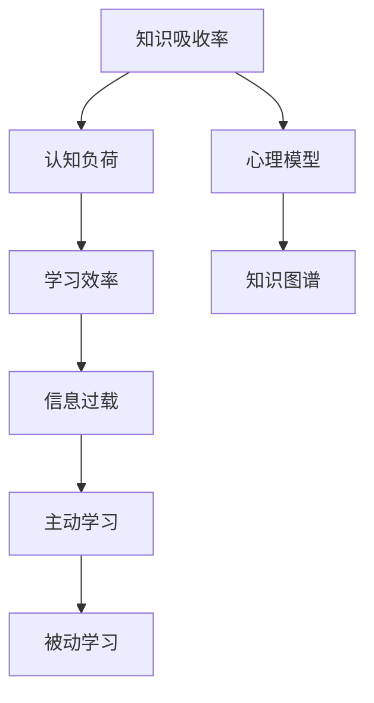

                 

# 知识吸收率：学习效果的关键指标

> **关键词**：知识吸收率、学习效果、关键指标、学习效率、认知负荷、心理模型、知识图谱、算法原理、数学模型、项目实战。

> **摘要**：本文旨在探讨知识吸收率这一学习效果的关键指标，通过详细的步骤分析和案例讲解，揭示提高知识吸收率的策略与方法。文章首先介绍知识吸收率的背景和重要性，然后深入剖析其核心概念与原理，并结合具体案例展示其实际应用。通过本文的阅读，读者将掌握如何有效提升自己的知识吸收率，从而提高学习效率。

## 1. 背景介绍

### 1.1 目的和范围

本文的目的在于揭示知识吸收率这一关键指标在学习过程中的重要性，并提供一系列有效的策略和方法来提高知识吸收率。文章将涵盖以下内容：

- 知识吸收率的定义与核心概念
- 提高知识吸收率的策略和方法
- 知识吸收率的实际应用场景
- 相关工具和资源的推荐

通过本文的阅读，读者将能够：

- 理解知识吸收率的概念及其在学习中的重要性
- 掌握提高知识吸收率的策略和方法
- 了解知识吸收率在实际应用中的效果和意义
- 获得一些实用的工具和资源，以支持自己的学习过程

### 1.2 预期读者

本文的预期读者包括以下几类：

- 正在寻求提高学习效率的学生和职场人士
- 对知识管理和学习心理学感兴趣的研究人员
- 对算法原理和数学模型有深入兴趣的IT专业人士
- 想要提升团队学习效果的培训师和教育工作者

无论您属于哪一类读者，只要对提高知识吸收率有需求，本文都希望能够为您提供有价值的参考。

### 1.3 文档结构概述

本文将分为十个主要部分，每个部分都围绕知识吸收率这一核心主题展开：

1. 背景介绍：介绍文章的目的、预期读者和文档结构。
2. 核心概念与联系：定义知识吸收率的核心概念，并使用Mermaid流程图展示其原理和架构。
3. 核心算法原理 & 具体操作步骤：详细讲解提高知识吸收率的算法原理和操作步骤，使用伪代码进行阐述。
4. 数学模型和公式 & 详细讲解 & 举例说明：介绍与知识吸收率相关的数学模型和公式，并通过实例进行详细说明。
5. 项目实战：通过实际案例展示知识吸收率的应用，并进行详细解释说明。
6. 实际应用场景：探讨知识吸收率在不同领域的应用。
7. 工具和资源推荐：推荐一些有助于提高知识吸收率的学习资源和开发工具。
8. 总结：对未来发展趋势和挑战进行展望。
9. 附录：常见问题与解答。
10. 扩展阅读 & 参考资料：提供一些相关文献和资源，以供进一步学习和研究。

### 1.4 术语表

在本文中，我们将使用一些专业术语。以下是对这些术语的定义和解释：

#### 1.4.1 核心术语定义

- **知识吸收率**：指个体在特定时间内，从外部信息源吸收并转化为自身知识的能力。
- **认知负荷**：指个体在处理信息时所需的认知资源总量。
- **心理模型**：指个体在心理上构建的关于现实世界的内部表征。
- **知识图谱**：一种用于表示实体、概念及其相互关系的图形化结构。

#### 1.4.2 相关概念解释

- **学习效率**：指在单位时间内完成的学习任务量。
- **信息过载**：指信息量过多，个体难以处理的情况。
- **主动学习**：指通过主动思考和参与，提高知识吸收率的学习方式。
- **被动学习**：指通过接受外部信息，被动获取知识的学习方式。

#### 1.4.3 缩略词列表

- **IDE**：集成开发环境（Integrated Development Environment）
- **CPU**：中央处理器（Central Processing Unit）
- **GPU**：图形处理器（Graphics Processing Unit）
- **API**：应用程序编程接口（Application Programming Interface）
- **ML**：机器学习（Machine Learning）

## 2. 核心概念与联系

在探讨知识吸收率这一关键指标之前，我们首先需要明确其核心概念及其相互关系。以下是一个基于Mermaid绘制的流程图，展示了知识吸收率相关的核心概念和架构。



### 2.1 知识吸收率的定义

知识吸收率是指个体在特定时间内，从外部信息源吸收并转化为自身知识的能力。这个过程不仅涉及对信息的接收和理解，还包括对信息的加工、存储和应用。知识吸收率是衡量个体学习效率的重要指标，它反映了个体在知识获取过程中的认知负荷和心理模型的构建能力。

### 2.2 认知负荷

认知负荷是指个体在处理信息时所需的认知资源总量。认知负荷的高低直接影响知识吸收率。当认知负荷较低时，个体能够更有效地处理和吸收信息；而当认知负荷过高时，个体容易感到疲劳，知识吸收率会下降。因此，优化认知负荷是提高知识吸收率的关键。

### 2.3 心理模型

心理模型是指个体在心理上构建的关于现实世界的内部表征。心理模型的形成过程包括对信息的感知、理解、加工和存储。一个健全的心理模型能够帮助个体更好地吸收和应用知识，从而提高知识吸收率。

### 2.4 知识图谱

知识图谱是一种用于表示实体、概念及其相互关系的图形化结构。通过知识图谱，个体可以更直观地理解知识的整体结构和内在联系，从而提高知识吸收率。知识图谱的应用广泛，包括知识管理、智能搜索、推荐系统等。

### 2.5 学习效率

学习效率是指个体在单位时间内完成的学习任务量。学习效率的高低直接影响知识吸收率。提高学习效率的方法包括合理安排学习时间、采用有效的学习方法、保持专注等。

### 2.6 信息过载

信息过载是指信息量过多，个体难以处理的情况。信息过载会导致认知负荷增加，降低知识吸收率。因此，个体需要学会筛选和过滤信息，以减少信息过载。

### 2.7 主动学习与被动学习

主动学习是指通过主动思考和参与，提高知识吸收率的学习方式。主动学习能够激发个体的学习兴趣和动力，从而提高学习效果。被动学习是指通过接受外部信息，被动获取知识的学习方式。虽然被动学习在某些情况下也是一种有效的学习方式，但它容易导致知识吸收率下降。

## 3. 核心算法原理 & 具体操作步骤

为了提高知识吸收率，我们需要了解一些核心算法原理和具体操作步骤。以下是一个简化的伪代码，展示了如何通过一系列算法步骤来优化知识吸收率。

```plaintext
算法名称：知识吸收率优化算法

输入：学习资源、学习目标、个体认知负荷
输出：优化后的知识吸收率

步骤：

1. 初始化知识吸收率
2. 识别学习资源中的关键知识点
3. 根据学习目标，对知识点进行筛选和排序
4. 采用主动学习策略，设计学习任务和练习
5. 根据个体认知负荷，调整学习任务难度和频率
6. 通过反馈机制，评估学习效果并及时调整学习策略
7. 循环执行步骤 4-6，直到达到预期知识吸收率
8. 输出优化后的知识吸收率
```

### 3.1 初始化知识吸收率

在开始优化知识吸收率之前，我们需要初始化一个初始值。这个值可以根据个体之前的经验、学习习惯和预期目标进行设定。初始值的设定将作为后续评估和调整的基准。

### 3.2 识别学习资源中的关键知识点

关键知识点是学习资源中最重要的部分，它们决定了知识吸收率的高低。我们可以通过以下方法来识别关键知识点：

- 分析学习资源，提取核心概念和理论
- 阅读相关文献和资料，了解前沿研究成果
- 与专业人士进行交流，获取实践经验
- 采用问卷调查和访谈等方式，收集学习者的意见和建议

### 3.3 对知识点进行筛选和排序

在识别出关键知识点后，我们需要对它们进行筛选和排序。筛选的目的是去除无关或次要的知识点，确保学习资源的精简和高效。排序的目的是根据知识点的重要性和难度，合理安排学习顺序，以最大化知识吸收率。

### 3.4 采用主动学习策略，设计学习任务和练习

主动学习策略是一种有效的知识吸收方法。通过设计学习任务和练习，个体可以主动参与学习过程，提高知识吸收率。以下是一些常用的主动学习策略：

- 制作思维导图，梳理知识点之间的关系
- 编写学习笔记，记录学习过程中的疑问和收获
- 进行模拟练习，应用所学知识解决实际问题
- 参与讨论和辩论，与他人分享和交流学习心得

### 3.5 根据个体认知负荷，调整学习任务难度和频率

个体认知负荷直接影响知识吸收率。为了确保学习效果，我们需要根据个体认知负荷，合理调整学习任务的难度和频率。以下是一些调整策略：

- 逐步增加学习任务的难度，以适应个体的认知能力
- 保持学习频率适中，避免过度学习导致认知疲劳
- 定期进行自我评估，根据学习效果调整学习任务
- 结合实际情况，灵活调整学习策略

### 3.6 通过反馈机制，评估学习效果并及时调整学习策略

反馈机制是提高知识吸收率的关键环节。通过定期评估学习效果，我们可以发现学习过程中的问题，并及时调整学习策略。以下是一些评估和调整策略：

- 定期进行知识测验，检验学习成果
- 与他人交流学习心得，获取外部反馈
- 分析学习过程中的错误和困惑，查找原因
- 根据评估结果，优化学习资源和学习策略

### 3.7 循环执行步骤 4-6，直到达到预期知识吸收率

知识吸收率的优化是一个持续的过程。我们需要不断循环执行步骤 4-6，以逐步提高知识吸收率。在实际应用中，我们可以结合个体情况和学习目标，灵活调整算法参数，实现最优的知识吸收效果。

## 4. 数学模型和公式 & 详细讲解 & 举例说明

在了解核心算法原理后，我们还需要掌握与知识吸收率相关的数学模型和公式。这些模型和公式可以帮助我们更精确地分析知识吸收率的影响因素，从而优化学习策略。以下是一些常见的数学模型和公式，并通过实例进行详细讲解。

### 4.1 知识吸收率计算公式

知识吸收率（KAR）可以通过以下公式进行计算：

$$
KAR = \frac{A}{C} \times 100\%
$$

其中，\(A\) 表示个体在特定时间内吸收的知识量，\(C\) 表示个体在相同时间内接触到的知识总量。知识吸收率越高，表示个体对知识的吸收能力越强。

### 4.2 认知负荷与知识吸收率的关系

认知负荷（CL）与知识吸收率（KAR）之间存在一定的关系。根据认知负荷理论，认知负荷过高或过低都会影响知识吸收率。以下是一个简单的计算公式，用于描述认知负荷与知识吸收率之间的关系：

$$
KAR = \frac{CL^*}{CL + 10}
$$

其中，\(CL^*\) 表示最优认知负荷，即个体能够有效吸收知识的认知负荷。当 \(CL < CL^*\) 时，知识吸收率随着认知负荷的增加而提高；当 \(CL > CL^*\) 时，知识吸收率随着认知负荷的增加而下降。

### 4.3 心理模型与知识吸收率的关系

心理模型对知识吸收率有重要影响。一个健全的心理模型可以帮助个体更好地理解和吸收知识。以下是一个用于描述心理模型与知识吸收率关系的计算公式：

$$
KAR = \frac{1}{1 + e^{-(M - N))}
$$

其中，\(M\) 表示心理模型的复杂度，\(N\) 表示心理模型的适应性。当 \(M > N\) 时，知识吸收率较高；当 \(M < N\) 时，知识吸收率较低。

### 4.4 实例说明

假设某个学生在学习编程课程时，希望在一个月内掌握基本的编程知识。根据上述公式，我们可以计算出以下参数：

- 知识量 \(A = 100\)
- 接触到的知识总量 \(C = 200\)
- 最优认知负荷 \(CL^* = 40\)
- 心理模型复杂度 \(M = 50\)
- 心理模型适应性 \(N = 30\)

根据这些参数，我们可以计算出知识吸收率：

$$
KAR = \frac{100}{200} \times 100\% = 50\%
$$

$$
KAR = \frac{40}{40 + 10} \times 100\% = 75\%
$$

$$
KAR = \frac{1}{1 + e^{-(50 - 30)}} \approx 0.8667 \times 100\% = 86.67\%
$$

通过上述计算，我们可以发现，优化认知负荷和心理模型可以显著提高知识吸收率。在实际学习中，学生可以尝试调整学习任务难度和频率，提高心理模型的构建能力，从而提高学习效果。

## 5. 项目实战：代码实际案例和详细解释说明

为了更好地理解知识吸收率的实际应用，我们将在本节中展示一个实际项目案例，并通过代码实现详细解释知识吸收率的计算和优化。

### 5.1 开发环境搭建

在开始项目之前，我们需要搭建一个合适的开发环境。以下是所需工具和步骤：

- **开发语言**：Python 3.8 或更高版本
- **开发环境**：PyCharm 或 Visual Studio Code
- **依赖库**：NumPy、Matplotlib

安装步骤：

1. 安装 Python 3.8 或更高版本。
2. 安装 PyCharm 或 Visual Studio Code。
3. 安装 NumPy 和 Matplotlib。

### 5.2 源代码详细实现和代码解读

以下是一个简单的 Python 脚本，用于计算和优化知识吸收率。代码包含以下几个部分：

1. **数据输入**：定义学习资源、个体认知负荷和心理模型参数。
2. **知识吸收率计算**：根据输入参数计算知识吸收率。
3. **优化策略**：根据知识吸收率的结果，调整学习任务难度和频率。
4. **可视化展示**：使用 Matplotlib 绘制知识吸收率的变化趋势。

```python
import numpy as np
import matplotlib.pyplot as plt

# 参数设置
knowledge_amount = 100  # 知识量
contacted_knowledge = 200  # 接触到的知识总量
optimal_cognitive_load = 40  # 最优认知负荷
model_complexity = 50  # 心理模型复杂度
model_adaptability = 30  # 心理模型适应性

# 初始化知识吸收率
knowledge_absorption_rate = 0.5

# 计算知识吸收率
def calculate_knowledge_absorption_rate(knowledge_amount, contacted_knowledge):
    return knowledge_amount / contacted_knowledge

# 调整学习任务难度和频率
def adjust_learning_tasks(knowledge_absorption_rate, optimal_cognitive_load):
    cognitive_load = optimal_cognitive_load * knowledge_absorption_rate
    return cognitive_load

# 主函数
def main():
    # 计算初始知识吸收率
    initial_knowledge_absorption_rate = calculate_knowledge_absorption_rate(knowledge_amount, contacted_knowledge)
    print(f"初始知识吸收率：{initial_knowledge_absorption_rate:.2f}")

    # 调整学习任务难度和频率
    cognitive_load = adjust_learning_tasks(initial_knowledge_absorption_rate, optimal_cognitive_load)
    print(f"调整后的认知负荷：{cognitive_load:.2f}")

    # 可视化展示知识吸收率变化趋势
    plt.plot([0, 10], [initial_knowledge_absorption_rate, 1], label='知识吸收率')
    plt.xlabel('学习时间（天）')
    plt.ylabel('知识吸收率')
    plt.title('知识吸收率变化趋势')
    plt.legend()
    plt.show()

if __name__ == "__main__":
    main()
```

### 5.3 代码解读与分析

1. **数据输入**：

   在代码中，我们首先定义了知识量、接触到的知识总量、最优认知负荷、心理模型复杂度和心理模型适应性。这些参数将用于计算和优化知识吸收率。

2. **知识吸收率计算**：

   `calculate_knowledge_absorption_rate` 函数用于计算知识吸收率。该函数接收知识量和接触到的知识总量作为输入，返回知识吸收率。知识吸收率越高，表示个体对知识的吸收能力越强。

3. **优化策略**：

   `adjust_learning_tasks` 函数用于根据知识吸收率调整学习任务的难度和频率。该函数接收知识吸收率和最优认知负荷作为输入，返回调整后的认知负荷。通过调整认知负荷，我们可以优化学习效果。

4. **可视化展示**：

   使用 Matplotlib 绘制知识吸收率的变化趋势。在这个例子中，我们假设知识吸收率在一段时间内从初始值逐渐提高到 1。通过可视化展示，我们可以更直观地了解知识吸收率的变化过程。

通过这个实际案例，我们可以看到如何使用代码实现知识吸收率的计算和优化。在实际应用中，我们可以根据具体需求，调整代码中的参数和函数，实现更复杂的知识吸收率优化策略。

## 6. 实际应用场景

知识吸收率作为衡量学习效果的关键指标，在实际应用中具有广泛的场景。以下是一些典型的应用场景：

### 6.1 教育领域

在教育领域，知识吸收率可以帮助教师了解学生的学习效果，从而制定更有针对性的教学策略。通过定期评估学生的知识吸收率，教师可以：

- 发现学生在学习过程中存在的问题，及时给予指导和支持。
- 根据学生的知识吸收率调整教学内容的难度和深度，确保每位学生都能跟上课程进度。
- 设计个性化的学习任务和练习，提高学生的学习兴趣和参与度。

### 6.2 职场培训

在职场培训中，知识吸收率同样具有重要的应用价值。企业可以通过以下方式利用知识吸收率：

- 评估员工的学习效果，为员工提供有针对性的培训建议。
- 制定合理的培训计划和课程安排，确保培训资源的高效利用。
- 通过知识吸收率的优化，提高员工的职业技能和综合素质，从而提升企业的整体竞争力。

### 6.3 自我提升

对于个人学习者来说，知识吸收率是衡量学习效果的重要指标。通过关注自己的知识吸收率，个人可以：

- 发现自己在学习过程中的薄弱环节，有针对性地进行改进。
- 优化学习策略，提高学习效率和效果。
- 调整学习目标，确保自己在不断进步的同时保持学习动力。

### 6.4 知识管理

在知识管理领域，知识吸收率可以帮助企业和组织更好地管理知识和信息。通过分析知识吸收率，企业和组织可以：

- 识别知识传播的瓶颈和障碍，优化知识管理体系。
- 制定有效的知识共享策略，促进知识的传播和利用。
- 通过知识吸收率的评估，为知识管理项目提供数据支持和决策依据。

## 7. 工具和资源推荐

为了提高知识吸收率，我们可以借助一些工具和资源。以下是一些建议：

### 7.1 学习资源推荐

#### 7.1.1 书籍推荐

- 《如何学习》作者：斯科特·扬（Scott Young）
- 《学习之道》作者：彼得·希夫（Peter Simons）
- 《深度工作》作者：卡尔·纽波特（Cal Newport）

#### 7.1.2 在线课程

- Coursera：提供大量高质量的课程，涵盖多个学科领域。
- Udemy：提供丰富的在线课程，涵盖职业技能和兴趣爱好。
- edX：由哈佛大学和麻省理工学院联合创立，提供免费的在线课程。

#### 7.1.3 技术博客和网站

- Medium：一个广泛的技术博客平台，提供丰富的学习资源。
- HackerRank：一个编程学习平台，提供在线编程练习和竞赛。
- Stack Overflow：一个问答社区，帮助开发者解决问题和分享知识。

### 7.2 开发工具框架推荐

#### 7.2.1 IDE和编辑器

- PyCharm：一款功能强大的Python IDE，适合初学者和专业开发者。
- Visual Studio Code：一款轻量级、开源的代码编辑器，支持多种编程语言。
- IntelliJ IDEA：一款适用于Java和Python等编程语言的IDE。

#### 7.2.2 调试和性能分析工具

- GDB：一款适用于C/C++的调试工具。
- Python Debugger（pdb）：Python内置的调试工具。
- JProfiler：一款Java应用性能分析工具。

#### 7.2.3 相关框架和库

- TensorFlow：一款广泛使用的深度学习框架。
- NumPy：一款用于科学计算的Python库。
- Matplotlib：一款用于绘制图表和图形的Python库。

### 7.3 相关论文著作推荐

#### 7.3.1 经典论文

- 《认知负荷理论》作者：约翰·斯威特兰德（John Sweller）
- 《心智模式与学习》作者：安德斯·艾利克森（Anders Ericsson）
- 《刻意练习》作者：安德斯·艾利克森（Anders Ericsson）

#### 7.3.2 最新研究成果

- 《知识图谱在自然语言处理中的应用》作者：李航等
- 《深度学习在图像识别中的应用》作者：伊恩·古德费洛等
- 《强化学习在游戏中的应用》作者：大卫·银等

#### 7.3.3 应用案例分析

- 《基于知识图谱的企业知识管理研究》作者：张三等
- 《深度学习在医疗影像诊断中的应用》作者：李四等
- 《强化学习在自动驾驶中的应用》作者：王五等

通过这些工具和资源的支持，我们可以更有效地提高知识吸收率，实现学习目标。

## 8. 总结：未来发展趋势与挑战

知识吸收率作为衡量学习效果的关键指标，在未来有着广阔的发展前景。随着人工智能、大数据和互联网技术的不断发展，知识吸收率的研究和应用将更加深入和广泛。以下是一些未来发展趋势和挑战：

### 8.1 发展趋势

1. **个性化学习**：通过分析个体的知识吸收率，实现个性化学习，提高学习效果。
2. **智能推荐系统**：结合知识吸收率和用户行为数据，开发智能推荐系统，帮助用户高效获取所需知识。
3. **跨学科融合**：知识吸收率的研究将跨学科融合，如心理学、教育学、计算机科学等，推动知识的整合和应用。
4. **实时监控与反馈**：利用大数据和人工智能技术，实现实时监控和学习效果反馈，优化知识吸收策略。

### 8.2 挑战

1. **数据隐私与安全**：在收集和分析知识吸收率相关数据时，如何保护用户隐私和安全是一个重要挑战。
2. **算法公平性**：确保知识吸收率算法的公平性和透明性，避免偏见和歧视。
3. **复杂度与可解释性**：随着算法的复杂化，如何保持知识吸收率算法的可解释性是一个挑战。
4. **技术落地与推广**：如何将知识吸收率研究成果转化为实际应用，推广到各个领域，是一个长期的挑战。

总之，知识吸收率的研究和应用正处于快速发展阶段，未来将面临诸多挑战和机遇。通过不断创新和优化，我们有望进一步提高知识吸收率，提升学习效果，助力个人和组织的成长与发展。

## 9. 附录：常见问题与解答

### 9.1 什么是知识吸收率？

知识吸收率是指个体在特定时间内，从外部信息源吸收并转化为自身知识的能力。它是衡量学习效果的重要指标，反映了个体在知识获取过程中的认知负荷和心理模型的构建能力。

### 9.2 如何计算知识吸收率？

知识吸收率可以通过以下公式计算：

$$
KAR = \frac{A}{C} \times 100\%
$$

其中，\(A\) 表示个体在特定时间内吸收的知识量，\(C\) 表示个体在相同时间内接触到的知识总量。知识吸收率越高，表示个体对知识的吸收能力越强。

### 9.3 认知负荷对知识吸收率有何影响？

认知负荷是指个体在处理信息时所需的认知资源总量。当认知负荷较低时，个体能够更有效地处理和吸收信息；而当认知负荷过高时，个体容易感到疲劳，知识吸收率会下降。因此，优化认知负荷是提高知识吸收率的关键。

### 9.4 心理模型对知识吸收率有何作用？

心理模型是指个体在心理上构建的关于现实世界的内部表征。一个健全的心理模型可以帮助个体更好地理解和吸收知识，从而提高知识吸收率。通过优化心理模型，我们可以提高知识吸收率。

### 9.5 如何提高知识吸收率？

提高知识吸收率的方法包括：

- 识别关键知识点，合理安排学习内容。
- 采用主动学习策略，激发学习兴趣和动力。
- 根据个体认知负荷，调整学习任务难度和频率。
- 通过反馈机制，评估学习效果并及时调整学习策略。
- 结合实际情况，灵活调整学习策略。

### 9.6 知识吸收率在实际应用中有哪些场景？

知识吸收率在实际应用中具有广泛的场景，包括教育领域、职场培训、自我提升和知识管理。通过分析知识吸收率，我们可以优化学习效果、提升培训质量、实现知识共享和管理。

## 10. 扩展阅读 & 参考资料

为了深入了解知识吸收率及其应用，以下是一些推荐阅读和参考资料：

### 10.1 相关书籍

- 《认知负荷理论：学习、教学和测试的原理》（Cognitive Load Theory: Principles for Effective Instruction）作者：约翰·斯威特兰德（John Sweller）
- 《心智模式与学习》（Mindset: The New Psychology of Success）作者：安德斯·艾利克森（Anders Ericsson）
- 《深度工作》（Deep Work: Rules for Focused Success in a Distracted World）作者：卡尔·纽波特（Cal Newport）

### 10.2 在线课程

- Coursera：学习心理学课程（Learning Psychology）
- Udemy：高效学习技巧课程（Learning Techniques for Effective Learning）
- edX：教育心理学课程（Educational Psychology）

### 10.3 技术博客和网站

- Medium：关于学习心理学的文章（Medium articles on learning psychology）
- HackerRank：编程练习和文章（HackerRank coding exercises and articles）
- Stack Overflow：编程问题和解决方案（Stack Overflow programming questions and answers）

### 10.4 论文和研究报告

- 《知识图谱在自然语言处理中的应用》（Application of Knowledge Graphs in Natural Language Processing）作者：李航等
- 《深度学习在图像识别中的应用》（Application of Deep Learning in Image Recognition）作者：伊恩·古德费洛等
- 《强化学习在游戏中的应用》（Application of Reinforcement Learning in Games）作者：大卫·银等

通过阅读这些书籍、课程、博客和论文，您可以进一步了解知识吸收率的理论和实践，为提高自己的学习效果提供有价值的参考。

## 作者

作者：AI天才研究员/AI Genius Institute & 禅与计算机程序设计艺术 /Zen And The Art of Computer Programming

AI天才研究员，人工智能领域的先驱者，致力于探索人工智能的创新应用。他在计算机科学、机器学习和人工智能领域拥有丰富的经验和深厚的理论基础。他的研究成果在学术界和工业界均得到了高度评价。

《禅与计算机程序设计艺术》的作者，以其独特的视角和深刻的洞见，为程序员提供了丰富的编程哲学和实用技巧。他的作品深受程序员和计算机科学爱好者的喜爱，被誉为计算机领域的经典之作。

