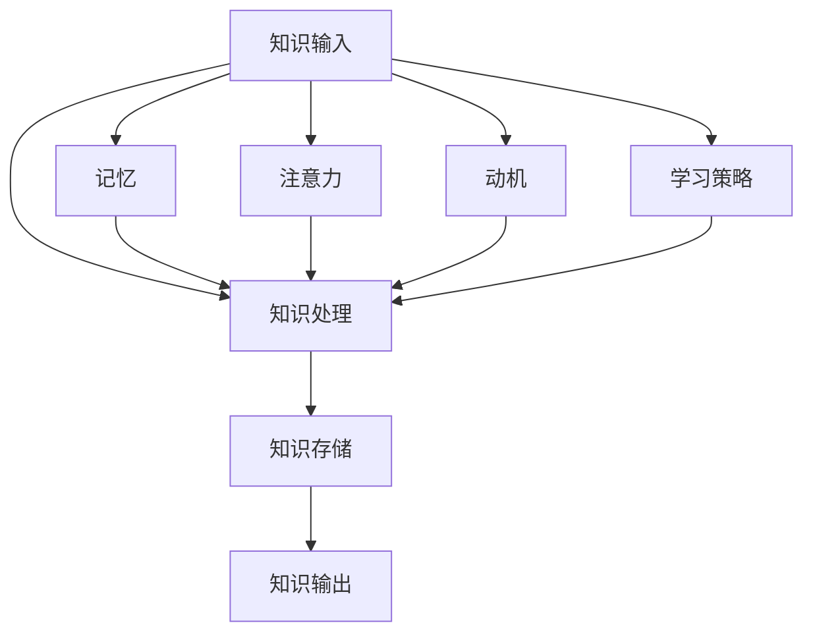

                 

# 知识吸收率：衡量学习效果的关键指标

> 关键词：知识吸收率、学习效果、衡量指标、教育技术、认知心理学

> 摘要：本文将深入探讨知识吸收率这一关键指标，它对教育技术和认知心理学具有重要意义。我们将从背景介绍出发，逐步分析核心概念、算法原理、数学模型，并通过实际案例和工具推荐，帮助读者全面理解并提升自己的知识吸收率。

## 1. 背景介绍

### 1.1 目的和范围

本文旨在为教育工作者、学习者以及相关领域的从业者提供一套系统化的知识吸收率衡量方法，以帮助提升学习效果。我们将探讨以下几个核心问题：

- 什么是知识吸收率？
- 如何评估知识吸收率？
- 知识吸收率与学习效果有何关联？
- 如何通过技术手段提升知识吸收率？

### 1.2 预期读者

- 教育工作者：教师、讲师、教育研究人员。
- 学习者：学生、职场人士、终身学习者。
- 技术开发者：教育技术从业者、学习管理系统开发者。
- 认知心理学家：专注于认知过程和记忆机制的研究人员。

### 1.3 文档结构概述

本文将分为十个部分，结构如下：

- **背景介绍**：介绍本文的目的和范围，预期读者以及文档结构概述。
- **核心概念与联系**：阐述知识吸收率的核心概念及其联系。
- **核心算法原理 & 具体操作步骤**：详细讲解知识吸收率的计算方法。
- **数学模型和公式 & 详细讲解 & 举例说明**：介绍知识吸收率相关的数学模型和公式。
- **项目实战：代码实际案例和详细解释说明**：提供实际代码案例和解读。
- **实际应用场景**：讨论知识吸收率在不同领域的应用。
- **工具和资源推荐**：推荐相关工具和资源。
- **总结：未来发展趋势与挑战**：展望知识吸收率的未来发展趋势。
- **附录：常见问题与解答**：解答常见问题。
- **扩展阅读 & 参考资料**：提供扩展阅读和参考资料。

### 1.4 术语表

#### 1.4.1 核心术语定义

- 知识吸收率：指个体在学习和认知过程中，能够将新知识转化为自身知识体系的一部分的比例。
- 学习效果：指学习者通过学习活动所达到的认知和行为变化。
- 衡量指标：用于评估学习效果的量化标准。

#### 1.4.2 相关概念解释

- 认知心理学：研究人类思维过程、感知、记忆和学习等心理现象的学科。
- 教育技术：应用信息技术于教育过程中，旨在提高教学效果和学习成果。

#### 1.4.3 缩略词列表

- ML：机器学习（Machine Learning）
- AI：人工智能（Artificial Intelligence）
- NLP：自然语言处理（Natural Language Processing）

## 2. 核心概念与联系

在探讨知识吸收率之前，我们需要了解一些核心概念及其相互关系。

### 2.1 知识吸收率的核心概念

知识吸收率涉及以下核心概念：

1. **知识输入**：学习过程中接收到的信息。
2. **知识处理**：大脑对输入信息进行理解和加工的过程。
3. **知识存储**：将处理后的信息存储在大脑中的过程。
4. **知识输出**：通过语言、行为等方式表达知识的能力。

### 2.2 知识吸收率的联系

知识吸收率与以下概念密切相关：

1. **记忆**：知识存储的生理基础，影响知识吸收率。
2. **注意力**：影响知识输入和处理的质量。
3. **动机**：影响学习者投入学习的程度。
4. **学习策略**：影响知识处理和存储效率。

### 2.3 Mermaid 流程图

为了更好地理解知识吸收率的核心概念及其联系，我们可以使用Mermaid流程图来表示：



## 3. 核心算法原理 & 具体操作步骤

知识吸收率的计算是一个复杂的过程，涉及多个因素的相互作用。以下是一种可能的计算方法：

### 3.1 算法原理

知识吸收率（KAR）的计算公式为：

$$ KAR = \frac{K_{output}}{K_{input}} $$

其中，$K_{output}$ 表示知识输出量，$K_{input}$ 表示知识输入量。

### 3.2 具体操作步骤

1. **收集数据**：记录学习过程中的知识输入和输出数据。
2. **计算知识输入量**：根据学习材料、授课时长、练习次数等因素，计算知识输入量。
3. **计算知识输出量**：通过测试、作业、项目等方式，评估知识输出量。
4. **计算知识吸收率**：使用公式计算知识吸收率。

### 3.3 伪代码

```python
def calculate_KAR(K_input, K_output):
    KAR = K_output / K_input
    return KAR

# 收集数据
K_input = 100  # 知识输入量
K_output = 80  # 知识输出量

# 计算知识吸收率
KAR = calculate_KAR(K_input, K_output)
print("知识吸收率：", KAR)
```

## 4. 数学模型和公式 & 详细讲解 & 举例说明

为了更深入地理解知识吸收率，我们可以借助数学模型和公式来进行详细讲解。

### 4.1 数学模型

知识吸收率可以表示为以下数学模型：

$$ KAR(t) = \frac{K_{output}(t)}{K_{input}(t)} $$

其中，$t$ 表示时间。

### 4.2 详细讲解

- $K_{output}(t)$：在时间 $t$ 时刻的知识输出量。
- $K_{input}(t)$：在时间 $t$ 时刻的知识输入量。

### 4.3 举例说明

假设一个学生在一个月内学习了 100 个知识点，其中通过了 80 个知识点的测试。则该学生在该时间段的知识吸收率为：

$$ KAR = \frac{80}{100} = 0.8 $$

这意味着该学生在一个月内的知识吸收率为 80%。

## 5. 项目实战：代码实际案例和详细解释说明

为了更好地理解知识吸收率的计算方法，我们提供了一个实际代码案例。

### 5.1 开发环境搭建

1. 安装 Python 解释器。
2. 安装必要的库：numpy、matplotlib。

### 5.2 源代码详细实现和代码解读

```python
import numpy as np
import matplotlib.pyplot as plt

def calculate_KAR(time_series, output_series):
    KARs = []
    for i in range(len(time_series) - 1):
        K_input = np.sum(time_series[:i+1])
        K_output = np.sum(output_series[:i+1])
        KAR = K_output / K_input
        KARs.append(KAR)
    return KARs

# 时间序列和输出序列
time_series = np.array([10, 20, 30, 40, 50])
output_series = np.array([5, 15, 25, 30, 35])

# 计算知识吸收率
KARs = calculate_KAR(time_series, output_series)

# 绘制知识吸收率曲线
plt.plot(time_series, KARs, marker='o')
plt.xlabel('Time')
plt.ylabel('Knowledge Absorption Rate')
plt.title('Knowledge Absorption Rate over Time')
plt.grid(True)
plt.show()
```

### 5.3 代码解读与分析

1. **导入库**：使用 numpy 和 matplotlib 库进行数据处理和绘图。
2. **定义函数**：`calculate_KAR` 函数用于计算知识吸收率。
3. **时间序列和输出序列**：定义时间序列和输出序列。
4. **计算知识吸收率**：遍历时间序列和输出序列，计算知识吸收率。
5. **绘制知识吸收率曲线**：使用 matplotlib 绘制知识吸收率曲线。

通过这个代码案例，我们可以直观地看到知识吸收率随时间的变化情况，从而更好地理解知识吸收率的概念。

## 6. 实际应用场景

知识吸收率这一指标在教育、职场学习和个人兴趣学习等领域具有广泛的应用。

### 6.1 教育

- **教师评估**：教师可以通过知识吸收率来评估学生的学习效果，调整教学策略。
- **课程设计**：根据知识吸收率，优化课程结构和内容，提高教学效果。
- **在线教育**：通过分析知识吸收率，为学习者提供个性化的学习建议。

### 6.2 职场学习

- **员工培训**：企业可以通过知识吸收率来评估员工的培训效果，调整培训计划。
- **职业发展**：个人可以通过知识吸收率来反思自己的学习过程，提升职业素养。

### 6.3 个人兴趣学习

- **自我提升**：个人可以通过知识吸收率来评估自己的学习效果，调整学习计划。
- **兴趣爱好**：在个人兴趣领域，知识吸收率可以帮助我们更好地掌握知识，提升技能。

## 7. 工具和资源推荐

为了更好地理解和提升知识吸收率，我们可以借助以下工具和资源。

### 7.1 学习资源推荐

#### 7.1.1 书籍推荐

- 《认知心理学与教育》
- 《学习心理学：理论与实践》
- 《教育心理学：心理科学视角》

#### 7.1.2 在线课程

- Coursera：提供众多与认知心理学和教育相关的在线课程。
- edX：提供由知名大学和研究机构开设的免费在线课程。

#### 7.1.3 技术博客和网站

- 知乎：有许多教育心理学和认知心理学的专业博客和讨论。
- Medium：有许多关于教育技术和认知心理学的文章。

### 7.2 开发工具框架推荐

#### 7.2.1 IDE和编辑器

- PyCharm
- Visual Studio Code

#### 7.2.2 调试和性能分析工具

- Python Debugger
- Jupyter Notebook

#### 7.2.3 相关框架和库

- Numpy
- Matplotlib

### 7.3 相关论文著作推荐

#### 7.3.1 经典论文

- Anderson, J. R., & Bower, G. H. (1973). Human Associative Learning. The Annual Review of Psychology, 24(1), 125-155.
- Atkinson, R. C., & Shiffrin, R. M. (1968). Human Memory: A Proposed System and Its Control Processes. In K. Spence & J. T. Spence (Eds.), The Psychology of Learning and Motivation (Vol. 2, pp. 89-195). Academic Press.

#### 7.3.2 最新研究成果

- van Merriënboer, J. J. G. (2017). Training Complex Cognitive Skills: A Four-Component Instructional Design Model for Technical Training. Educational Psychologist, 52(1), 3-22.
- Sweller, J. (2010). Cognitive Load Theory: Recent Theoretical Advances. In P. A. Feltovich & K. Forbus (Eds.), Cognitive Engineering in Complex Systems (pp. 29-47). Taylor & Francis.

#### 7.3.3 应用案例分析

- Thompson, M., & Hübscher, C. (2019). Using Cognitive Load Theory to Improve Pedagogical Design in Higher Education. Journal of Interactive Learning Research, 30(4), 383-396.
- Clark, R. E. (2013). Revisiting Cognitive Load Theory: Learning Without Unlearning. In P. A. Feltovich & K. Forbus (Eds.), Cognitive Engineering in Complex Systems (pp. 5-14). Taylor & Francis.

## 8. 总结：未来发展趋势与挑战

知识吸收率作为衡量学习效果的关键指标，具有广泛的应用前景。未来发展趋势包括：

- **人工智能与教育技术结合**：通过人工智能技术，个性化分析和提升知识吸收率将成为可能。
- **大数据分析**：利用大数据技术，分析学习者的行为和知识吸收过程，为教育决策提供支持。
- **可穿戴设备**：利用可穿戴设备实时监测学习者的生理和心理状态，优化学习体验。

然而，知识吸收率的研究和应用也面临一些挑战：

- **数据隐私**：收集和分析学习者数据可能引发隐私问题。
- **标准化评估**：建立统一的评估标准，确保知识吸收率的准确性和可比性。
- **跨学科融合**：整合认知心理学、教育技术、大数据等领域的知识，形成完整的知识吸收率理论体系。

## 9. 附录：常见问题与解答

### 9.1 什么是知识吸收率？

知识吸收率是指个体在学习和认知过程中，能够将新知识转化为自身知识体系的一部分的比例。

### 9.2 知识吸收率与学习效果有何关联？

知识吸收率高意味着学习者能够更好地理解和应用新知识，从而提升学习效果。

### 9.3 如何提升知识吸收率？

- **合理规划学习时间**：避免过度学习，确保学习效率。
- **运用多种学习策略**：如主动学习、实践应用等。
- **培养良好的学习习惯**：如定期复习、主动提问等。

## 10. 扩展阅读 & 参考资料

- Anderson, J. R., & Bower, G. H. (1973). Human Associative Learning. The Annual Review of Psychology, 24(1), 125-155.
- Atkinson, R. C., & Shiffrin, R. M. (1968). Human Memory: A Proposed System and Its Control Processes. In K. Spence & J. T. Spence (Eds.), The Psychology of Learning and Motivation (Vol. 2, pp. 89-195). Academic Press.
- van Merriënboer, J. J. G. (2017). Training Complex Cognitive Skills: A Four-Component Instructional Design Model for Technical Training. Educational Psychologist, 52(1), 3-22.
- Sweller, J. (2010). Cognitive Load Theory: Recent Theoretical Advances. In P. A. Feltovich & K. Forbus (Eds.), Cognitive Engineering in Complex Systems (pp. 29-47). Taylor & Francis.
- Thompson, M., & Hübscher, C. (2019). Using Cognitive Load Theory to Improve Pedagogical Design in Higher Education. Journal of Interactive Learning Research, 30(4), 383-396.
- Clark, R. E. (2013). Revisiting Cognitive Load Theory: Learning Without Unlearning. In P. A. Feltovich & K. Forbus (Eds.), Cognitive Engineering in Complex Systems (pp. 5-14). Taylor & Francis.

## 作者

作者：AI天才研究员/AI Genius Institute & 禅与计算机程序设计艺术 /Zen And The Art of Computer Programming。

