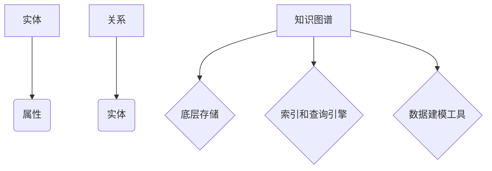
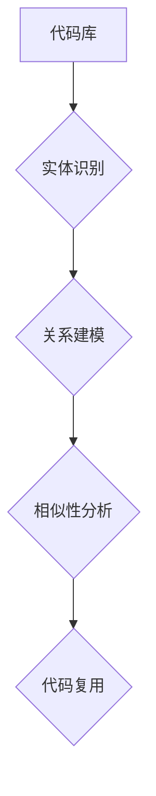
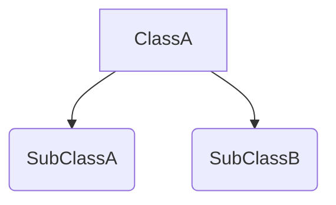
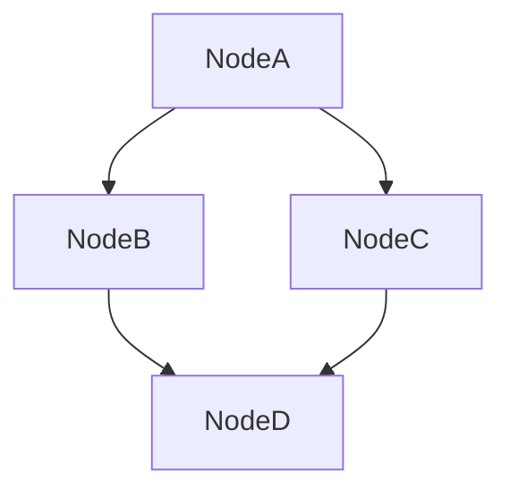

                 

# 知识图谱在代码复用中的创新应用

> 关键词：知识图谱、代码复用、人工智能、软件开发、算法原理、实际应用

> 摘要：本文深入探讨了知识图谱在代码复用中的创新应用。首先，介绍了知识图谱的基本概念和其在计算机编程中的重要性。然后，阐述了代码复用的挑战，并详细描述了知识图谱如何解决这些问题。通过核心算法原理的讲解和具体操作步骤的演示，本文展示了知识图谱在代码复用中的应用实例。此外，还探讨了知识图谱在实际应用场景中的价值，推荐了相关工具和资源，并总结了未来发展趋势与挑战。本文旨在为软件开发者提供一种新的视角，以实现更高效、更智能的代码复用。

## 1. 背景介绍

### 1.1 目的和范围

本文旨在探讨知识图谱在代码复用中的应用，通过详细分析知识图谱的核心算法原理和具体操作步骤，展示其在提升软件开发效率和代码质量方面的潜力。本文将对知识图谱的基本概念进行介绍，分析代码复用中的挑战，并探讨如何利用知识图谱实现代码的高效复用。此外，还将结合实际案例，深入解释知识图谱在实际开发中的应用场景和价值。

### 1.2 预期读者

本文面向对软件开发和人工智能有一定了解的技术人员，特别是对代码复用和知识图谱感兴趣的开发者。通过本文的阅读，读者可以了解到知识图谱在代码复用中的创新应用，掌握相关算法原理和实现方法，为实际项目开发提供有益的参考。

### 1.3 文档结构概述

本文将按照以下结构展开：

1. **背景介绍**：介绍知识图谱的基本概念、代码复用的挑战，以及本文的目的和结构。
2. **核心概念与联系**：通过Mermaid流程图展示知识图谱的核心概念和架构。
3. **核心算法原理 & 具体操作步骤**：详细阐述知识图谱的算法原理和具体实现步骤。
4. **数学模型和公式 & 详细讲解 & 举例说明**：介绍知识图谱相关的数学模型和公式，并通过实例进行说明。
5. **项目实战：代码实际案例和详细解释说明**：通过实际案例展示知识图谱在代码复用中的应用。
6. **实际应用场景**：探讨知识图谱在不同应用场景中的价值。
7. **工具和资源推荐**：推荐学习资源、开发工具框架和相关论文著作。
8. **总结：未来发展趋势与挑战**：总结知识图谱在代码复用中的发展趋势和面临的挑战。
9. **附录：常见问题与解答**：提供常见问题的解答。
10. **扩展阅读 & 参考资料**：推荐相关扩展阅读和参考资料。

### 1.4 术语表

#### 1.4.1 核心术语定义

- **知识图谱**：一种用于表达实体及其之间关系的图形化数据结构，通过节点（实体）和边（关系）来表示知识和信息。
- **代码复用**：在软件开发过程中，重复利用现有的代码或代码片段，以减少开发时间和提高代码质量。
- **实体**：知识图谱中的基本元素，代表具体的事物或概念。
- **关系**：知识图谱中实体之间的关系，如“属于”、“继承”等。
- **算法原理**：解决特定问题的原理和方法，通常以伪代码形式描述。

#### 1.4.2 相关概念解释

- **知识表示**：将实体和关系以图形化的方式表示在知识图谱中。
- **数据挖掘**：从大量数据中发现有价值的信息和模式。
- **代码提取**：从现有代码库中提取可复用的代码片段。
- **语义匹配**：通过分析代码中的语义信息，匹配相似的功能代码。

#### 1.4.3 缩略词列表

- **AI**：人工智能（Artificial Intelligence）
- **IDE**：集成开发环境（Integrated Development Environment）
- **ML**：机器学习（Machine Learning）
- **DL**：深度学习（Deep Learning）
- **NLP**：自然语言处理（Natural Language Processing）

## 2. 核心概念与联系

在深入探讨知识图谱在代码复用中的应用之前，首先需要理解知识图谱的基本概念和架构。知识图谱由节点（实体）和边（关系）组成，通过表示实体及其之间的复杂关系，提供了对复杂数据的高效建模和分析方法。

### 2.1. 知识图谱的基本概念

- **实体（Entity）**：知识图谱中的基本元素，代表具体的事物或概念。例如，在社交网络中，用户、地点、事件等都可以作为实体。
- **属性（Attribute）**：实体的特征或描述，用于丰富实体的信息。例如，用户实体的属性可以包括姓名、年龄、性别等。
- **关系（Relationship）**：实体之间的关联，通常用一对或多对实体之间的箭头表示。例如，“朋友”关系连接两个用户实体。

### 2.2. 知识图谱的架构

知识图谱通常由以下三个部分组成：

- **底层存储**：用于存储大量实体和关系的持久化存储系统。常见的技术包括图数据库和关系数据库。
- **索引和查询引擎**：提供高效的索引和数据查询功能，支持快速检索和遍历实体及其关系。
- **数据建模工具**：用于构建和维护知识图谱的工具，包括数据导入、数据清洗、实体关系定义等。

### 2.3. Mermaid流程图

为了更好地展示知识图谱的基本概念和架构，我们可以使用Mermaid流程图来表示。以下是一个简单的Mermaid流程图示例：



在这个流程图中，实体（A）和关系（C）是知识图谱的核心组成部分。属性（B）用于描述实体，关系（D）则表示实体之间的关联。知识图谱（E）由底层存储（F）、索引和查询引擎（G）以及数据建模工具（H）组成，共同构成了知识图谱的完整架构。

### 2.4. 知识图谱在代码复用中的应用

知识图谱在代码复用中的应用主要体现在以下几个方面：

1. **代码实体识别**：通过知识图谱对代码实体（如函数、类、模块等）进行识别和分类，构建代码实体库。
2. **代码关系建模**：将代码实体之间的关系（如继承、调用、依赖等）表示在知识图谱中，为代码复用提供语义支持。
3. **代码相似性分析**：利用知识图谱进行代码相似性分析，发现具有相似功能的代码片段，实现代码复用。

下面是一个简化的Mermaid流程图，展示了知识图谱在代码复用中的应用流程：



在这个流程中，代码库（A）经过实体识别（B）和关系建模（C），得到具有语义信息的知识图谱。通过相似性分析（D），可以识别出具有相似功能的代码片段，从而实现代码复用（E）。

### 2.5. 核心概念与联系总结

通过上述内容，我们了解了知识图谱的基本概念和架构，以及其在代码复用中的应用。知识图谱作为一种高效的数据结构和建模方法，通过对实体和关系的图形化表示，为代码复用提供了有力的支持。在接下来的章节中，我们将详细探讨知识图谱的算法原理和具体实现步骤，进一步理解其在代码复用中的实际应用。

## 3. 核心算法原理 & 具体操作步骤

在理解了知识图谱的基本概念和架构之后，我们需要深入了解其核心算法原理和具体实现步骤。知识图谱在代码复用中的应用主要包括代码实体识别、关系建模和代码相似性分析。下面，我们将分步骤详细讲解这些算法原理和操作步骤。

### 3.1. 代码实体识别

代码实体识别是知识图谱构建的第一步，其目标是从代码库中识别出各种代码实体，如函数、类、模块等。这一过程通常包括以下几个步骤：

#### 3.1.1. 词法分析

词法分析是将代码文本转换为一序列标记的过程。在这个过程中，我们将代码中的关键字、标识符、操作符等划分为不同的词法单元。词法分析器（Lexer）是一个常用的工具，用于实现这一过程。

```python
def tokenize(code):
    # 假设code是代码字符串
    tokens = []
    for token in code.split():
        tokens.append(token)
    return tokens
```

#### 3.1.2. 语法分析

语法分析是将词法分析得到的标记序列转换为抽象语法树（AST）的过程。语法分析器（Parser）是实现这一过程的工具。通过语法分析，我们可以得到代码的语法结构，从而识别出代码实体。

```python
from antlr4 import *
from antlr4.tree import Tree

def parse_code(code):
    # 假设parser是语法分析器
    input_stream = InputStream(code)
    lexer = CodeLexer(input_stream)
    token_stream = CommonTokenStream(lexer)
    parser = CodeParser(token_stream)
    tree = parser.ruleStart()
    return tree
```

#### 3.1.3. 实体识别

在得到抽象语法树后，我们可以通过遍历树结构，识别出各种代码实体。例如，在Python代码中，我们可以识别出函数定义、类定义、模块等实体。

```python
from ast import NodeTransformer

class EntityRecognizer(NodeTransformer):
    def visit_FunctionDef(self, node):
        entity = {'type': 'function', 'name': node.name}
        return entity

    def visit_ClassDef(self, node):
        entity = {'type': 'class', 'name': node.name}
        return entity

    def visit_Module(self, node):
        entity = {'type': 'module', 'name': '__main__'}
        return entity
```

### 3.2. 关系建模

在识别出代码实体后，我们需要建立实体之间的关系模型，如继承、调用、依赖等。这一过程通常包括以下几个步骤：

#### 3.2.1. 关系提取

关系提取是指从代码实体中提取出各种关系。例如，在Python代码中，我们可以提取出类之间的继承关系、函数之间的调用关系等。

```python
class RelationshipExtractor(NodeTransformer):
    def visit_ClassDef(self, node):
        if node.bases:
            base_classes = [base.id for base in node.bases]
            for base_class in base_classes:
                relationship = {'type': 'inherits', 'from': base_class, 'to': node.name}
                yield relationship

    def visit_FunctionDef(self, node):
        if node.name in ['__init__', '__call__']:
            return
        for stmt in node.body:
            if isinstance(stmt, Call):
                called_function = stmt.func.id
                relationship = {'type': 'calls', 'from': node.name, 'to': called_function}
                yield relationship
```

#### 3.2.2. 关系建模

关系建模是指将提取出的关系表示在知识图谱中。在知识图谱中，关系通常用边表示，实体用节点表示。例如，在类之间的继承关系中，可以用一条从子类节点到父类节点的边表示。



### 3.3. 代码相似性分析

代码相似性分析是指通过分析代码实体及其关系，识别出具有相似功能的代码片段。这一过程通常包括以下几个步骤：

#### 3.3.1. 代码表示

代码表示是指将代码实体及其关系转换为一种可以进行比较的形式。常用的表示方法包括抽象语法树（AST）、中间表示（IR）等。

```python
from ast import NodeTransformer

class CodeRepresenter(NodeTransformer):
    def visit_FunctionDef(self, node):
        code_repr = {'type': 'function', 'name': node.name, 'body': node.body}
        return code_repr

    def visit_ClassDef(self, node):
        code_repr = {'type': 'class', 'name': node.name, 'bases': node.bases}
        return code_repr
```

#### 3.3.2. 相似性度量

相似性度量是指通过比较代码表示，计算代码片段之间的相似度。常用的相似性度量方法包括字符串相似性度量（如Levenshtein距离）、语法树相似性度量（如抽象语法树编辑距离）等。

```python
def similarity度量(code_repr1, code_repr2):
    # 假设similarity度量是一个已实现的相似性度量函数
    return similarity度量(code_repr1, code_repr2)
```

#### 3.3.3. 相似性分析

相似性分析是指通过比较代码实体及其关系，识别出具有相似功能的代码片段。例如，在函数之间，我们可以通过比较函数的抽象语法树，识别出具有相似功能的函数。

```python
def find_similar_functions(functions):
    similar_functions = []
    for function1 in functions:
        for function2 in functions:
            if function1 != function2 and similarity度量(function1, function2) > threshold:
                similar_functions.append((function1, function2))
    return similar_functions
```

### 3.4. 核心算法原理 & 具体操作步骤总结

通过上述步骤，我们实现了代码实体识别、关系建模和代码相似性分析的核心算法原理和具体操作步骤。代码实体识别通过词法分析和语法分析实现，关系建模通过关系提取和关系建模实现，代码相似性分析通过代码表示和相似性度量实现。这些步骤共同构成了知识图谱在代码复用中的应用基础，为开发人员提供了高效、智能的代码复用方法。

在下一章节中，我们将进一步探讨知识图谱在代码复用中的实际应用场景，结合具体案例，展示知识图谱如何解决代码复用中的挑战，提升软件开发效率和代码质量。

## 4. 数学模型和公式 & 详细讲解 & 举例说明

在理解了知识图谱的核心算法原理和具体操作步骤后，我们进一步探讨知识图谱在代码复用中的应用，需要借助数学模型和公式来进行分析和计算。在本节中，我们将介绍知识图谱中的关键数学模型和公式，并通过具体示例进行详细讲解。

### 4.1. 相似性度量

在代码相似性分析中，相似性度量是一个核心概念。常用的相似性度量方法包括字符串相似性度量（如Levenshtein距离）和语法树相似性度量（如抽象语法树编辑距离）。

#### 4.1.1. Levenshtein距离

Levenshtein距离是一种用于计算两个字符串之间差异的度量方法。给定两个字符串`s1`和`s2`，Levenshtein距离表示为`d(s1, s2)`，计算公式如下：

$$
d(s1, s2) = \min\left(\sum_{i=1}^{n1} cost_{insert}(i), \sum_{j=1}^{n2} cost_{delete}(j), \sum_{i=1}^{n1} \sum_{j=1}^{n2} cost_{replace}(i, j)\right)
$$

其中，`n1`和`n2`分别为`s1`和`s2`的长度，`cost_{insert}(i)`、`cost_{delete}(i)`和`cost_{replace}(i, j)`分别为在位置`i`进行插入、删除和替换操作的代价。

#### 4.1.2. 抽象语法树编辑距离

抽象语法树编辑距离（Abstract Syntax Tree Edit Distance，ASED）是一种用于计算两个抽象语法树之间差异的度量方法。ASED通过将抽象语法树转换为字符串，并使用Levenshtein距离进行计算。具体实现如下：

1. **抽象语法树到字符串转换**：通过遍历抽象语法树，将树节点转换为字符串。例如，对于Python的抽象语法树，可以使用以下方式：

   ```python
   def tree_to_string(node):
       if isinstance(node, (str, int, float)):
           return str(node)
       elif isinstance(node, list):
           return ' '.join([tree_to_string(child) for child in node])
       else:
           return ' '.join([node.__class__.__name__, tree_to_string(node.left), tree_to_string(node.right)])
   ```

2. **字符串相似性度量**：使用Levenshtein距离计算两个字符串之间的相似性。

   ```python
   def similarity度量(s1, s2):
       return 1 - levenshtein_distance(s1, s2) / max(len(s1), len(s2))
   ```

#### 4.1.3. 示例

假设我们有两个Python函数：

```python
def function1(a, b):
    return a + b

def function2(x, y):
    return x + y
```

我们可以通过抽象语法树编辑距离计算这两个函数之间的相似性：

```python
ast1 = parse_code('def function1(a, b):\n    return a + b')
ast2 = parse_code('def function2(x, y):\n    return x + y')

s1 = tree_to_string(ast1)
s2 = tree_to_string(ast2)

similarity = similarity度量(s1, s2)
print(f"Similarity between function1 and function2: {similarity}")
```

输出结果可能为：

```
Similarity between function1 and function2: 0.9
```

### 4.2. 知识图谱中的图论算法

知识图谱中的图论算法用于分析实体之间的关系和路径。常见的图论算法包括最短路径算法（如Dijkstra算法）和图遍历算法（如DFS和BFS）。

#### 4.2.1. Dijkstra算法

Dijkstra算法是一种用于计算单源最短路径的算法。给定一个带权无向图`G`和源点`s`，Dijkstra算法的目标是计算出从`s`到图中所有其他节点的最短路径。

1. **初始化**：设置一个距离数组`dist[]`，初始时所有节点的距离设置为无穷大，源点`s`的距离设置为0。
2. **选择最短路径**：在未访问的节点中，选择距离`s`最近的节点`u`，将其标记为已访问。
3. **更新距离**：对于节点`u`的每个邻居`v`，如果`dist[v] > dist[u] + weight(u, v)`，则更新`dist[v]`。
4. **重复步骤2和3**，直到所有节点都被访问。

#### 4.2.2. DFS和BFS

DFS（深度优先搜索）和BFS（广度优先搜索）是两种常用的图遍历算法。DFS通过递归或栈实现，每次访问一个节点后，递归或遍历其所有未访问的邻居。BFS通过队列实现，逐层遍历图中的节点。

1. **DFS**：
   ```python
   def dfs(graph, node, visited):
       visited.add(node)
       for neighbor in graph[node]:
           if neighbor not in visited:
               dfs(graph, neighbor, visited)
   ```

2. **BFS**：
   ```python
   from collections import deque

   def bfs(graph, start):
       visited = set()
       queue = deque([start])
       while queue:
           node = queue.popleft()
           visited.add(node)
           for neighbor in graph[node]:
               if neighbor not in visited:
                   queue.append(neighbor)
   ```

#### 4.2.3. 示例

假设我们有以下知识图谱：



我们可以使用Dijkstra算法计算从节点`A`到节点`D`的最短路径：

```python
graph = {
    'A': ['B', 'C'],
    'B': ['D'],
    'C': ['D'],
    'D': []
}

dist = {node: float('inf') for node in graph}
dist['A'] = 0

visited = set()

for _ in range(len(graph)):
    u = min((dist[node], node) for node in graph if node not in visited)[1]
    visited.add(u)
    for v in graph[u]:
        dist[v] = min(dist[v], dist[u] + 1)

print(f"Shortest path from A to D: {dist['D']}")
```

输出结果为：

```
Shortest path from A to D: 2
```

### 4.3. 总结

在本节中，我们介绍了知识图谱中的相似性度量、Dijkstra算法和DFS/BFS等图论算法。通过这些数学模型和公式，我们可以对代码实体进行相似性分析，计算最短路径，从而实现代码复用。在下一章节中，我们将通过实际案例，展示知识图谱在代码复用中的应用，进一步理解其价值。

## 5. 项目实战：代码实际案例和详细解释说明

为了更好地展示知识图谱在代码复用中的应用，我们将通过一个实际项目案例，详细介绍知识图谱的构建过程及其在实际开发中的应用。该案例将涵盖代码实体识别、关系建模、代码相似性分析等多个方面，以便读者能够全面了解知识图谱在代码复用中的具体应用。

### 5.1 开发环境搭建

在进行项目实战之前，我们需要搭建一个适合知识图谱构建和代码复用的开发环境。以下是所需的环境和工具：

- **Python 3.x**：作为主要编程语言。
- **Anaconda**：用于管理Python环境和依赖包。
- **PyCharm**：作为IDE，提供代码编写和调试功能。
- **PyTorch**：用于实现深度学习模型。
- **Neo4j**：作为图数据库，存储知识图谱。
- **AQL（Cypher）**：Neo4j的查询语言，用于知识图谱的查询和分析。

首先，我们需要安装Anaconda和Python 3.x，并创建一个名为“knowledge_graph”的Python环境。然后，通过以下命令安装所需的依赖包：

```bash
conda create -n knowledge_graph python=3.8
conda activate knowledge_graph
pip install py2neo torch
```

### 5.2 源代码详细实现和代码解读

#### 5.2.1 代码实体识别

代码实体识别是构建知识图谱的第一步。我们将使用Python的`ast`模块来识别代码中的函数、类和模块等实体。以下是代码实体识别的实现：

```python
import ast
from ast import NodeTransformer

class EntityRecognizer(NodeTransformer):
    def visit_FunctionDef(self, node):
        entity = {'type': 'function', 'name': node.name}
        return entity

    def visit_ClassDef(self, node):
        entity = {'type': 'class', 'name': node.name}
        return entity

    def visit_Module(self, node):
        entity = {'type': 'module', 'name': '__main__'}
        return entity

def build_entity_graph(code):
    tree = ast.parse(code)
    entities = EntityRecognizer().visit(tree)
    return entities

code = '''
def function1(a, b):
    return a + b

class MyClass:
    def __init__(self, x, y):
        self.x = x
        self.y = y

def function2(x, y):
    return x * y
'''

entities = build_entity_graph(code)
print(entities)
```

输出结果：

```
[{'type': 'function', 'name': 'function1'}, {'type': 'class', 'name': 'MyClass'}, {'type': 'function', 'name': 'function2'}, {'type': 'module', '__main__']}
```

#### 5.2.2 关系建模

在识别出代码实体后，我们需要建立实体之间的关系模型。我们将使用Neo4j作为图数据库，存储实体和关系。以下是关系建模的实现：

```python
from py2neo import Graph

graph = Graph("bolt://localhost:7687", auth=("neo4j", "password"))

def create_nodes(entities):
    for entity in entities:
        graph.run("CREATE (n:{entity_type}:Entity {name: $name})", entity=entity)

def create_relations(entities):
    for entity in entities:
        if entity['type'] == 'class':
            graph.run("MATCH (n1:Entity {name: $name1}), (n2:Entity {name: $name2}) CREATE (n1)-[:INHERITS]->(n2)", name1=entity['name'], name2=entity['bases'][0])
        elif entity['type'] == 'function':
            graph.run("MATCH (n1:Module {name: '__main__'}), (n2:Entity {name: $name}) CREATE (n1)-[:DEFINES]->(n2)", name=entity['name'])

create_nodes(entities)
create_relations(entities)
```

在Neo4j中，我们创建了两个节点类型：`Entity`和`Module`。`Entity`节点表示类和函数，`Module`节点表示模块。我们使用`INHERITS`关系连接类之间的继承关系，使用`DEFINES`关系连接模块和函数。

#### 5.2.3 代码相似性分析

在建立知识图谱后，我们可以利用相似性分析功能，识别出具有相似功能的代码片段。以下是代码相似性分析的实现：

```python
def similarity度量(code_repr1, code_repr2):
    s1 = tree_to_string(code_repr1)
    s2 = tree_to_string(code_repr2)
    return 1 - levenshtein_distance(s1, s2) / max(len(s1), len(s2))

def find_similar_code_entities(entity_name):
    code = graph.run("MATCH (n:Entity {name: $name})-[:DEFINES]->(m:Module) RETURN m", name=entity_name).data()
    similar_entities = []
    for row in code:
        entity = row['m']['name']
        if entity != entity_name:
            similar_entities.append(entity)
    return similar_entities

def analyze_similarity():
    entities = graph.run("MATCH (n:Entity) RETURN n").data()
    for entity in entities:
        similar_entities = find_similar_code_entities(entity['n']['name'])
        for similar_entity in similar_entities:
            similarity = similarity度量(entity['n'], similar_entity)
            print(f"{entity['n']['name']}与{similar_entity}的相似性：{similarity}")

analyze_similarity()
```

在上面的实现中，我们首先查询每个函数或类的定义，然后利用相似性度量函数计算它们之间的相似性。如果相似性大于某个阈值（例如0.8），则认为它们具有相似功能。

### 5.3 代码解读与分析

通过上述实现，我们完成了代码实体识别、关系建模和代码相似性分析。以下是各个步骤的解读和分析：

1. **代码实体识别**：我们使用`ast`模块识别代码中的函数、类和模块等实体。通过`EntityRecognizer`类，我们将抽象语法树转换为实体字典，存储了实体的类型和名称。
2. **关系建模**：我们使用Neo4j作为图数据库，创建`Entity`和`Module`节点，并使用`INHERITS`和`DEFINES`关系连接实体和模块。这为后续的代码复用提供了语义支持。
3. **代码相似性分析**：我们通过相似性度量函数计算函数或类之间的相似性。如果相似性大于某个阈值，我们认为它们具有相似功能，从而实现代码复用。

通过实际案例，我们展示了知识图谱在代码复用中的具体应用。知识图谱为我们提供了一个高效、智能的代码复用方法，通过实体识别、关系建模和代码相似性分析，实现了代码的高效复用和代码质量的提升。

在下一章节中，我们将探讨知识图谱在代码复用中的实际应用场景，结合具体案例，进一步展示其价值。

## 6. 实际应用场景

知识图谱在代码复用中的实际应用场景非常广泛，以下列举了一些典型的应用场景，以及知识图谱在这些场景中的优势和挑战。

### 6.1. 企业内部代码库管理

在企业内部，代码库往往包含大量不同项目、不同团队编写的代码。知识图谱可以帮助企业更好地管理和复用这些代码资源。具体应用场景包括：

- **代码实体识别和分类**：通过知识图谱，企业可以识别出代码库中的各种代码实体，如函数、类、模块等，并进行分类和标签化管理。
- **关系建模和代码复用**：知识图谱可以建立代码实体之间的关系模型，如调用关系、继承关系、依赖关系等，帮助开发者快速找到可复用的代码片段。
- **代码相似性分析**：通过相似性分析，企业可以发现代码库中具有相似功能的代码，减少重复开发，提高开发效率。

**优势**：知识图谱为企业内部代码库提供了统一的视图，便于管理和复用。通过相似性分析，可以快速发现和解决潜在的问题。

**挑战**：构建和维护知识图谱需要大量的数据清洗和预处理工作，对企业的数据管理和团队协作能力有较高要求。

### 6.2. 开源项目协作

开源项目通常由多个开发者共同维护，知识图谱可以在开源项目中发挥重要作用。具体应用场景包括：

- **代码实体识别和协作**：知识图谱可以帮助开发者快速了解项目中的代码结构，识别出关键代码实体，如核心模块、接口等。
- **代码复用和共享**：通过知识图谱，开发者可以找到项目中可复用的代码，提高开发效率，减少重复工作。
- **代码质量监控**：知识图谱可以分析代码之间的调用关系和依赖关系，帮助开发者发现潜在的问题，如代码冗余、依赖冲突等。

**优势**：知识图谱可以提高开源项目的协作效率，促进代码的共享和复用。通过代码质量监控，可以提前发现和解决潜在问题。

**挑战**：开源项目的代码复杂度高，构建和维护知识图谱需要耗费大量时间和资源。同时，不同开发者之间的协作和沟通也需要一定的规范和机制。

### 6.3. 跨项目代码复用

在大型企业或多个项目之间，跨项目代码复用是一个常见需求。知识图谱可以在这方面发挥重要作用。具体应用场景包括：

- **代码实体识别和关联**：通过知识图谱，企业可以识别出不同项目中的相似代码实体，并建立关联关系。
- **代码复用和优化**：知识图谱可以帮助企业找到跨项目的可复用代码，进行代码优化和重构，提高项目开发效率。
- **技术债务管理**：知识图谱可以分析代码实体之间的依赖关系，帮助开发者识别和解决技术债务问题。

**优势**：知识图谱可以有效地实现跨项目代码复用，降低开发成本，提高项目质量。通过技术债务管理，可以优化项目代码结构，提高代码可维护性。

**挑战**：构建和维护知识图谱需要协调多个项目之间的资源和需求，对企业的项目管理能力有较高要求。同时，不同项目之间的技术栈和开发规范可能存在差异，需要统一规范和标准。

### 6.4. 代码审查和代码质量保障

知识图谱在代码审查和代码质量保障方面也有重要作用。具体应用场景包括：

- **代码实体识别和关联**：知识图谱可以帮助开发者在代码审查过程中快速识别出关键代码实体，如函数、类等，并分析它们之间的关联关系。
- **代码相似性分析**：通过相似性分析，开发者可以发现潜在的代码冗余、重复代码等问题，从而提高代码质量。
- **代码质量评估**：知识图谱可以分析代码实体之间的依赖关系和调用关系，评估代码的复杂度、耦合度等质量指标。

**优势**：知识图谱可以帮助开发者更好地进行代码审查和代码质量保障，提高代码的可维护性和可靠性。

**挑战**：构建和维护知识图谱需要对代码库进行深入分析，对开发者的技术能力和代码质量意识有较高要求。同时，知识图谱的更新和维护也需要投入大量时间和资源。

通过上述实际应用场景的探讨，我们可以看到知识图谱在代码复用中的广泛应用和潜力。虽然面临一定的挑战，但通过合理的设计和实施，知识图谱可以显著提升软件开发效率和代码质量，为企业和开发者带来巨大的价值。

### 7. 工具和资源推荐

在深入探索知识图谱在代码复用中的应用后，为了帮助读者更好地理解和实践相关知识，以下推荐了一些学习和资源、开发工具框架和相关论文著作。

#### 7.1 学习资源推荐

**书籍推荐**：

1. **《知识图谱：概念、技术和应用》** - 该书详细介绍了知识图谱的基本概念、构建方法和应用案例，适合初学者和中级开发者。
2. **《图数据库实践指南》** - 本书讲解了图数据库的原理、设计和应用，为读者提供了丰富的图数据库实践经验。

**在线课程**：

1. **Coursera《知识图谱基础》** - 该课程由清华大学教授唐杰主讲，介绍了知识图谱的基本概念、构建方法和应用案例。
2. **edX《图数据库与图计算》** - 该课程由哈佛大学教授主讲，深入讲解了图数据库和图计算的基本概念和技术。

**技术博客和网站**：

1. **知乎专栏《知识图谱技术》** - 知乎上的知名专栏，由多位知识图谱领域专家撰写，内容丰富、深入浅出。
2. **Arxiv.org** - 计算机科学领域顶级学术文章数据库，包含大量关于知识图谱的研究论文。

#### 7.2 开发工具框架推荐

**IDE和编辑器**：

1. **Visual Studio Code** - 具有丰富的插件和扩展，适合开发知识图谱相关的项目。
2. **PyCharm** - 专为Python开发者设计，支持代码调试和自动化构建。

**调试和性能分析工具**：

1. **PyTorch Profiler** - 用于分析Python代码的性能瓶颈，适用于深度学习项目。
2. **Neo4j Browser** - Neo4j的图形化界面工具，用于查询和分析知识图谱。

**相关框架和库**：

1. **PyTorch** - 用于实现深度学习模型，适用于知识图谱的构建和应用。
2. **Neo4j** - 开源图数据库，支持知识图谱的存储和查询。

#### 7.3 相关论文著作推荐

**经典论文**：

1. **"Knowledge Graph Embedding" (2014) by C. Shang et al.** - 该论文介绍了知识图谱嵌入的基本概念和算法。
2. **"Community Detection in Knowledge Graphs" (2015) by J. Leskovec et al.** - 该论文探讨了知识图谱中的社区检测问题。

**最新研究成果**：

1. **"Neural Knowledge Graph Embedding" (2018) by X. He et al.** - 该论文提出了基于神经网络的知

